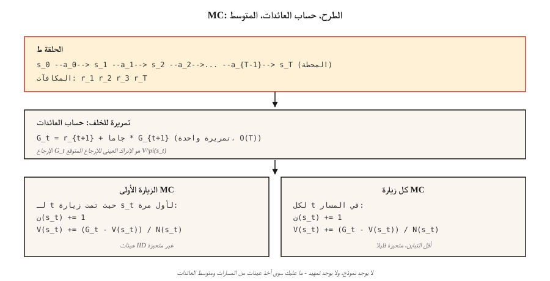

# أساليب مونت كارلو - التعلم من الحلقات الكاملة
> البرمجة الديناميكية تحتاج إلى نموذج. مونت كارلو لا تحتاج إلا إلى حلقات. قم بتشغيل السياسة، وشاهد العائدات، ومتوسطها. أبسط فكرة في RL — والتي تفتح كل شيء في اتجاه مجرى النهر.
**النوع:** بناء
** اللغات: ** بايثون
** المتطلبات الأساسية: ** المرحلة 9 · 01 (MDPs)، المرحلة 9 · 02 (البرمجة الديناميكية)
**الوقت:** ~75 دقيقة
## المشكلة
البرمجة الديناميكية أنيقة، لكنها تفترض أنه يمكنك الاستعلام عن `P(s' | s, a)` لكل حالة وإجراء. لا شيء تقريبًا في العالم الحقيقي يعمل بهذه الطريقة. لا يستطيع الروبوت حساب التوزيع على وحدات بكسل الكاميرا بشكل تحليلي بعد عزم الدوران المشترك. لا يمكن لخوارزمية التسعير أن تتكامل مع كل رد فعل محتمل للعميل. لا يمكن لـ LLM تعداد كل الاستمرارات الممكنة بعد الرمز المميز.
أنت بحاجة إلى طريقة تحتاج فقط إلى القدرة على أخذ عينات من البيئة. تشغيل السياسة. احصل على المسار `s_0, a_0, r_1, s_1, a_1, r_2, …, s_T`. استخدامه لتقدير القيم. هذا هو مونت كارلو.
يعد التحول من DP إلى MC أمرًا مهمًا من الناحية الفلسفية: فنحن ننتقل من *النموذج المعروف + النسخ الاحتياطي الدقيق* إلى *الطرح النموذجي + متوسط ​​العائد*. يقفز التباين، ولكن قابلية التطبيق تنفجر. كل خوارزمية RL بعد هذا الدرس - TD، Q-learning، REINFORCE، PPO، GRPO - هي مقدر مونت كارلو في القلب، وأحيانًا مع طبقات التمهيد في الأعلى.
##المفهوم

**الفكرة الأساسية، في سطر واحد:** `V^π(s) = E_π[G_t | s_t = s] ≈ (1/N) Σ_i G^{(i)}(s)` حيث يتم ملاحظة `G^{(i)}(s)` يعود بعد الزيارات إلى `s` بموجب السياسة `π`.
**الزيارة الأولى مقابل كل زيارة MC.** نظرًا لوجود حلقة تزور الحالة `s` عدة مرات، فإن الزيارة الأولى MC تحسب فقط العائد من الزيارة الأولى؛ كل زيارة MC تحسب جميع الزيارات. وكلاهما غير متحيز في الحد. الزيارة الأولى أسهل في التحليل (عينات معرف الهوية). تستخدم كل زيارة المزيد من البيانات لكل حلقة وعادة ما تتقارب بشكل أسرع في الممارسة العملية.
**المتوسط ​​التزايدي.** بدلاً من تخزين كافة المرتجعات، قم بتحديث المتوسط ​​الجاري:
__الكود_0__
إعادة تنظيم: `V_new = V_old + α · (target - V_old)` باستخدام `α = 1/n`. قم بتبديل `1/n` بحجم خطوة ثابت `α ∈ (0, 1)` وستحصل على مُقدِّر MC غير ثابت يتتبع التغييرات في `π`. هذه الخطوة هي القفزة الكاملة من MC إلى TD إلى كل خوارزمية RL الحديثة.
**الاستكشاف أصبح الآن مشكلة.** DP يتطرق إلى كل ولاية بالتعداد. MC يرى حالات زيارات السياسة فقط. إذا كان `π` حتميًا، فلن يتم أخذ عينات من مناطق كاملة من مساحة الحالة أبدًا، وستظل تقديرات قيمتها عند الصفر إلى الأبد. ثلاثة إصلاحات، بالترتيب التاريخي:
1. **يبدأ الاستكشاف.** ابدأ كل حلقة من زوج (s، a) عشوائي. تغطية الضمانات؛ غير واقعي في الممارسة العملية (لا يمكنك "إعادة ضبط" الروبوت إلى حالة تعسفية).
2. **ε-greedy.** تصرف بجشع w.r.t. Q الحالي، ولكن مع احتمال `ε` اختر إجراءً عشوائيًا. يتم أخذ عينات من جميع أزواج إجراءات الحالة بشكل غير مقارب.
3. **خارج السياسة MC.** اجمع البيانات بموجب سياسة السلوك `μ`، وتعرف على السياسة المستهدفة `π` عبر أخذ عينات الأهمية. تباين عالٍ، لكنه بمثابة الجسر لإعادة تشغيل أساليب المخزن المؤقت مثل DQN.
**تحكم مونت كارلو.** التقييم ← التحسين ← التقييم، تمامًا مثل تكرار السياسة، ولكن التقييم يعتمد على أخذ العينات:
1. قم بتشغيل `π` واحصل على حلقة.
2. قم بتحديث `Q(s, a)` من المرتجعات التي تمت ملاحظتها.
3. اصنع `π` ε-greedy w.r.t. __الكود_3__.
4. كرر.
يتقارب مع `Q*` و `π*` مع الاحتمال 1 في ظل ظروف معتدلة (كل زوج تتم زيارته بشكل لا نهائي، `α` يرضي Robbins-Monro).
## بنائها
### الخطوة 1: الطرح → قائمة (s، a، r)
```python
def rollout(env, policy, max_steps=200):
    trajectory = []
    s = env.reset()
    for _ in range(max_steps):
        a = policy(s)
        s_next, r, done = env.step(s, a)
        trajectory.append((s, a, r))
        s = s_next
        if done:
            break
    return trajectory
```

لا يوجد نموذج، فقط `env.reset()` و`env.step(s, a)`. نفس الواجهة كبيئة صالة الألعاب الرياضية ولكن تم تجريدها.
### الخطوة 2: حساب المرتجعات (المسح العكسي)
```python
def returns_from(trajectory, gamma):
    returns = []
    G = 0.0
    for _, _, r in reversed(trajectory):
        G = r + gamma * G
        returns.append(G)
    return list(reversed(returns))
```

تمريرة واحدة، `O(T)`. التكرار العكسي `G_t = r_{t+1} + γ G_{t+1}` يتجنب إعادة الجمع.
### الخطوة 3: تقييم الزيارة الأولى MC
```python
def mc_policy_evaluation(env, policy, episodes, gamma=0.99):
    V = defaultdict(float)
    counts = defaultdict(int)
    for _ in range(episodes):
        trajectory = rollout(env, policy)
        returns = returns_from(trajectory, gamma)
        seen = set()
        for t, ((s, _, _), G) in enumerate(zip(trajectory, returns)):
            if s in seen:
                continue
            seen.add(s)
            counts[s] += 1
            V[s] += (G - V[s]) / counts[s]
    return V
```

هناك ثلاثة أسطر تقوم بهذا العمل: وضع علامة على الحالة كما تظهر في الزيارة الأولى، وعدد الزيادة، وتحديث متوسط ​​التشغيل.
### الخطوة 4: التحكم ε-الجشع MC (في السياسة)
```python
def mc_control(env, episodes, gamma=0.99, epsilon=0.1):
    Q = defaultdict(lambda: {a: 0.0 for a in ACTIONS})
    counts = defaultdict(lambda: {a: 0 for a in ACTIONS})

    def policy(s):
        if random() < epsilon:
            return choice(ACTIONS)
        return max(Q[s], key=Q[s].get)

    for _ in range(episodes):
        trajectory = rollout(env, policy)
        returns = returns_from(trajectory, gamma)
        seen = set()
        for (s, a, _), G in zip(trajectory, returns):
            if (s, a) in seen:
                continue
            seen.add((s, a))
            counts[s][a] += 1
            Q[s][a] += (G - Q[s][a]) / counts[s][a]
    return Q, policy
```

### الخطوة 5: قارن بالمعيار الذهبي DP
يجب أن يتوافق تقدير MC الخاص بـ `V^π` مع نتيجة DP من الدرس 02 كحلقات → ∞. عمليًا: 50000 حلقة على 4×4 GridWorld ستجعلك ضمن `~0.1` من DP الإجابة.
## مطبات
- **حلقات لا نهائية.** MC يتطلب *إنهاء* الحلقات. إذا كان من الممكن تكرار سياستك إلى الأبد، فقم بوضع حد `max_steps` وتعامل مع الحد الأقصى باعتباره فشلًا ضمنيًا. تنتهي مهلة GridWorld التي تتبع سياسة عشوائية بشكل روتيني - وهذا أمر طبيعي، فقط make تأكد من حسابها بشكل صحيح.
- **التباين.** MC يستخدم العوائد الكاملة. في الحلقات الطويلة، يكون التباين كبيرًا - حيث تتغير مكافأة واحدة غير محظوظة في النهاية `V(s_0)` بنفس المقدار. طرق TD (الدرس 04) تقطع ذلك عن طريق التمهيد.
- **تغطية الدولة.** الجشع MC على سؤال جديد مع العلاقات لن يجرب سوى إجراء واحد. يجب عليك *يجب* أن تستكشف (ε-الجشع، يبدأ الاستكشاف، UCB).
- **السياسات غير الثابتة.** إذا تغير `π` (كما هو الحال في عنصر التحكم MC)، فإن عمليات الإرجاع القديمة تكون من سياسة مختلفة. يعالج Constant-α MC هذا؛ متوسط ​​العينة MC لا يفعل ذلك.
- **أخذ العينات ذات الأهمية خارج السياسة.** تتضاعف الأوزان `π(a|s)/μ(a|s)` عبر المسار. التباين ينفجر مع الأفق. الحد الأقصى مع الترجيح لكل قرار IS أو التبديل إلى TD.
## استخدمه
دور أساليب مونت كارلو لعام 2026:
| حالة الاستخدام | لماذا MC |
|----------|--------|
| الألعاب قصيرة الأفق (البلاك جاك، البوكر) | تنتهي الحلقات بشكل طبيعي. العائدات نظيفة. |
| التقييم دون الاتصال بالإنترنت للسياسة المسجلة | متوسط ​​العوائد المخصومة على المسارات المخزنة. |
| بحث شجرة مونت كارلو (AlphaZero) | MC عمليات النشر من اختيار دليل أوراق الشجر. |
| LLM RL التقييم | حساب متوسط ​​المكافأة على عينات الإكمال لسياسة معينة. |
| تقدير خط الأساس في PPO | يستخدم هدف الميزة `A_t = G_t - V(s_t)` MC `G_t`. |
| التدريس RL | أبسط خوارزمية تعمل بالفعل — تجريد التمهيد لرؤية الجوهر. |
تستكمل خوارزميات RL العميقة الحديثة (PPO، SAC) بين MC النقي (إرجاع كامل) وTD النقي (التمهيد بخطوة واحدة) عبر `n`-إرجاع خطوة أو GAE. كلا نقطتي النهاية هما مثيلات لنفس المقدر.
## اشحنها
حفظ باسم `outputs/skill-mc-evaluator.md`:
```markdown
---
name: mc-evaluator
description: Evaluate a policy via Monte Carlo rollouts and produce a convergence report with DP-comparison if available.
version: 1.0.0
phase: 9
lesson: 3
tags: [rl, monte-carlo, evaluation]
---

Given an environment (episodic, with reset+step API) and a policy, output:

1. Method. First-visit vs every-visit MC. Reason.
2. Episode budget. Target number, variance diagnostic, expected standard error.
3. Exploration plan. ε schedule (if needed) or exploring starts.
4. Gold-standard comparison. DP-optimal V* if tabular; otherwise a bound from a Q-learning / PPO baseline.
5. Termination check. Max-step cap, timeouts, handling of non-terminating trajectories.

Refuse to run MC on non-episodic tasks without a finite horizon cap. Refuse to report V^π estimates from fewer than 100 episodes per state for tabular tasks. Flag any policy with zero-variance actions as an exploration risk.
```

## تمارين
1. **سهل.** تنفيذ تقييم الزيارة الأولى MC لسياسة التوزيع العشوائي الموحد على 4×4 GridWorld. تشغيل 10.000 حلقة. مؤامرة `V(0,0)` كدالة لعدد الحلقات مقابل إجابة DP.
2. **متوسط.** قم بتنفيذ التحكم ε-greedy MC باستخدام `ε ∈ {0.01, 0.1, 0.3}`. قارن متوسط ​​العائد بعد 20000 حلقة. كيف يبدو المنحنى؟ أين تعيش مقايضة التحيز والتباين؟
3. **صعب.** تنفيذ *خارج السياسة* MC مع أخذ عينات الأهمية: جمع البيانات بموجب السياسة العشوائية الموحدة `μ`، وتقدير `V^π` للسياسة الحتمية المثالية `π`. قارن بين IS العادي مقابل كل قرار IS مقابل IS المرجح. التي لديها أدنى التباين؟
## المصطلحات الرئيسية
| مصطلح | ماذا يقول الناس | ماذا يعني في الواقع |
|------|-|--------------------------------------|
| مونت كارلو | "أخذ العينات العشوائية" | تقدير التوقعات عن طريق حساب متوسط ​​عينات IID من التوزيع. |
| العودة `G_t` | "مكافأة المستقبل" | مجموع المكافآت المخفضة من الخطوة `t` إلى نهاية الحلقة: `Σ_{k≥0} γ^k r_{t+k+1}`. |
| الزيارة الأولى MC | "احسب كل ولاية مرة واحدة" | تساهم الزيارة الأولى في الحلقة فقط في تقدير القيمة. |
| كل زيارة MC | "استخدام كافة الزيارات" | كل زيارة تساهم. متحيزة قليلاً ولكنها أكثر كفاءة في أخذ العينات. |
| ε- الجشع | "ضجيج الاستكشاف" | اختر إجراءً جشعًا باستخدام السؤال `1-ε`؛ إجراء عشوائي مع probe `ε`. |
| أهمية أخذ العينات | "تصحيح أخذ العينات من التوزيع الخاطئ" | أعد وزن المرتجعات حسب `π(a|s)/μ(a|s)` من المنتجات لتقدير `V^π` من بيانات `μ`. |
| على السياسة | "أتعلم من بياناتي الخاصة" | السياسة المستهدفة = سياسة السلوك. الفانيليا MC، PPO، SARSA. |
| خارج السياسة | "تعلم من بيانات شخص آخر" | سياسة الهدف ≠ سياسة السلوك. عينة الأهمية MC، التعلم Q، DQN. |
## مزيد من القراءة
- [Sutton & Barto (2018). Ch. 5 — Monte Carlo Methods](http://incompleteideas.net/book/RLbook2020.pdf) — المعالجة القانونية.
- [Singh & Sutton (1996). Reinforcement Learning with Replacing Eligibility Traces](https://link.springer.com/article/10.1007/BF00114726) — تحليل الزيارة الأولى مقابل تحليل كل زيارة.
- [Precup, Sutton, Singh (2000). Eligibility Traces for Off-Policy Policy Evaluation](http://incompleteideas.net/papers/PSS-00.pdf) — خارج السياسة MC والتحكم في التباين.
- [Mahmood et al. (2014). Weighted Importance Sampling for Off-Policy Learning](https://arxiv.org/abs/1404.6362) — مقدرات التباين المنخفض الحديثة IS.
- [Tesauro (1995). TD-Gammon, A Self-Teaching Backgammon Program](https://dl.acm.org/doi/10.1145/203330.203343) — أول عرض تجريبي واسع النطاق لـ MC/TD اللعب الذاتي يتقارب مع اللعب فوق طاقة البشر؛ مقدمة مفاهيمية لكل درس في النصف الثاني من هذه المرحلة.