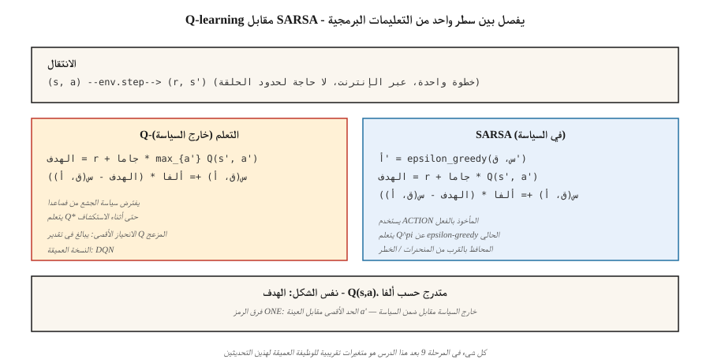

# Temporal Difference — Q-Learning & SARSA

> مونت كارلو تنتظر انتهاء الحلقة. TD التحديثات بعد كل خطوة عن طريق تمهيد القيمة التقديرية التالية. إن التعلم Q خارج السياسة ومتفائل. SARSA على السياسة والحذر. كلاهما سطر واحد من التعليمات البرمجية. كلاهما يدعم كل طريقة RL عميقة في هذه المرحلة.

**النوع:** بناء
** اللغات: ** بايثون
** المتطلبات الأساسية: ** المرحلة 9 · 01 (MDPs)، المرحلة 9 · 02 (البرمجة الديناميكية)، المرحلة 9 · 03 (مونت كارلو)
**الوقت:** ~75 دقيقة

## The Problem

تعمل مونت كارلو ولكن لديها متطلبين باهظين الثمن. إنها تحتاج إلى حلقات تنتهي، ولا يتم تحديثها إلا بعد وصول العودة النهائية. إذا كانت الحلقة الخاصة بك عبارة عن 1000 خطوة، فإن MC تنتظر 1000 خطوة لتحديث أي شيء. إنه عالي التباين ومنخفض التحيز وبطيء في الممارسة.

البرمجة الديناميكية لها ملف تعريف معاكس - نسخ احتياطية قابلة للتمهيد بدون تباين - ولكنها تتطلب نموذجًا معروفًا.

الفرق الزمني (TD) التعلم يقسم الفرق. من انتقال واحد `(s, a, r, s')`، قم بتشكيل هدف من خطوة واحدة `r + γ V(s')` وادفع `V(s)` نحوه. لا يوجد نموذج. لا توجد حلقات كاملة. الانحياز من استخدام `V` تقريبي على RHS، ولكن تباين أقل بشكل كبير من MC والتحديثات عبر الإنترنت من الخطوة الأولى.

هذا هو المحور الذي تدور عليه جميع RL — DQN، A2C، PPO، SAC — الحديثة. ما تبقى من المرحلة 9 عبارة عن طبقات من تقريب الوظائف والحيل المبنية فوق التحديث TD ذو الخطوة الواحدة الذي ستكتبه في هذا الدرس.

## The Concept



**التحديث TD(0) لـ V:**

`V(s) ← V(s) + α [r + γ V(s') - V(s)]`

الكمية الموجودة بين قوسين هي الخطأ TD `δ = r + γ V(s') - V(s)`. إنه النظير عبر الإنترنت لـ `G_t - V(s_t)` في MC. يتطلب التقارب `α` إرضاء روبنز مونرو (`Σ α = ∞`، `Σ α² < ∞`) ويتم زيارة جميع الولايات بشكل لا نهائي.

**Q-learning.** طريقة خارج السياسة TD للتحكم:

`Q(s, a) ← Q(s, a) + α [r + γ max_{a'} Q(s', a') - Q(s, a)]`

يفترض `max` أنه سيتم اتباع سياسة *الجشع* من `s'` فصاعدًا، بغض النظر عن الإجراء الذي يتخذه الوكيل بالفعل. إن فصل makes Q-learning يتعلم `Q*` بينما يستكشف الوكيل عبر ε-greedy. منيه وآخرون. (2015) حول هذا إلى تعليم Q عميق على Atari (الدرس 05).

**SARSA.** طريقة على السياسة TD:

`Q(s, a) ← Q(s, a) + α [r + γ Q(s', a') - Q(s, a)]`

الاسم هو الصف `(s, a, r, s', a')`. SARSA يستخدم الإجراء `a'` الذي يتخذه الوكيل *في الواقع* بعد ذلك، وليس الجشع `argmax`. يتقارب إلى `Q^π` لأي شيء يتم تشغيله ε-greedy `π`، والذي يصبح في الحد `ε → 0` `Q*`.

**الفرق بين المشي على الجرف.** في مهمة المشي على الجرف الكلاسيكية (السقوط من الجرف = مكافأة -100)، يتعلم Q-learning المسار الأمثل على طول حافة الجرف ولكنه أحيانًا يأخذ العقوبة أثناء الاستكشاف. SARSA يتعلم مسارًا أكثر أمانًا على بعد خطوة واحدة من الهاوية لأنه يأخذ في الاعتبار ضوضاء الاستكشاف في قيمة Q الخاصة به. ومع التدريب، يصل كلاهما إلى المستوى الأمثل عند `ε → 0`. من الناحية العملية، هذا مهم: عندما يحدث الاستكشاف فعليًا عند النشر، يكون سلوك SARSA أكثر تحفظًا.

**المتوقع SARSA.** استبدل `Q(s', a')` بقيمته المتوقعة ضمن `π`:

`Q(s, a) ← Q(s, a) + α [r + γ Σ_{a'} π(a'|s') Q(s', a') - Q(s, a)]`

تباين أقل من SARSA (لا توجد عينة من `a'`)، نفس هدف السياسة. في كثير من الأحيان الافتراضي في الكتب المدرسية الحديثة.

** n-step TD و TD(ἐ).** قم بالاستكمال بين TD(0) و MC عن طريق انتظار الخطوات `n` قبل التمهيد. `n=1` هو TD، `n=∞` هو MC. TD(π) المتوسطات على جميع `n` مع الأوزان الهندسية `(1-λ)λ^{n-1}`. معظم الاستخدامات العميقة RL `n` بين 3 و20.

## Build It

### Step 1: SARSA on ε-greedy policy

```python
def sarsa(env, episodes, alpha=0.1, gamma=0.99, epsilon=0.1):
    Q = defaultdict(lambda: {a: 0.0 for a in ACTIONS})

    def choose(s):
        if random() < epsilon:
            return choice(ACTIONS)
        return max(Q[s], key=Q[s].get)

    for _ in range(episodes):
        s = env.reset()
        a = choose(s)
        while True:
            s_next, r, done = env.step(s, a)
            a_next = choose(s_next) if not done else None
            target = r + (gamma * Q[s_next][a_next] if not done else 0.0)
            Q[s][a] += alpha * (target - Q[s][a])
            if done:
                break
            s, a = s_next, a_next
    return Q
```

ثمانية أسطر. الفرق *الوحيد* عن Q-learning هو الخط المستهدف.

### Step 2: Q-learning

```python
def q_learning(env, episodes, alpha=0.1, gamma=0.99, epsilon=0.1):
    Q = defaultdict(lambda: {a: 0.0 for a in ACTIONS})
    for _ in range(episodes):
        s = env.reset()
        while True:
            a = choose(s, Q, epsilon)
            s_next, r, done = env.step(s, a)
            target = r + (gamma * max(Q[s_next].values()) if not done else 0.0)
            Q[s][a] += alpha * (target - Q[s][a])
            if done:
                break
            s = s_next
    return Q
```

يفصل `max` الهدف عن السلوك. هذا الرمز الوحيد هو الفرق بين السياسة وخارج السياسة.

### Step 3: learning curves

تتبع متوسط ​​العائد لكل 100 حلقة. يتقارب التعلم Q بشكل أسرع في GridWorld الحتمية البسيطة؛ SARSA أكثر تحفظًا عند المشي على الجرف. في 4×4 GridWorld في `code/main.py`، كلاهما شبه مثالي بعد حوالي 2000 حلقة مع `α=0.1, ε=0.1`.

### Step 4: compare to DP truth

قم بتشغيل تكرار القيمة (الدرس 02) للحصول على `Q*`. تحقق `max_{s,a} |Q_learned(s,a) - Q*(s,a)|`. يهبط وكيل TD جدولي صحي ضمن `~0.5` على 4×4 GridWorld بعد 10000 حلقة.

## Pitfalls

- **قيم Q الأولية مهمة.** الحرف الأول المتفائل (`Q = 0` لمهمة ذات مكافأة سلبية) يشجع على الاستكشاف. يمكن للأحرف الأولية المتشائمة أن تحبس السياسة الجشعة إلى الأبد.
- **جدول α.** الثابت `α` مناسب للمشكلات غير الثابتة. يؤدي الاضمحلال `α_n = 1/n` إلى التقارب من الناحية النظرية ولكنه بطيء جدًا في الممارسة العملية - قم بتثبيت `α` في `[0.05, 0.3]` وراقب منحنى التعلم.
- **ε الجدول الزمني.** البدء بالارتفاع (`ε=1.0`)، ثم الانخفاض إلى `ε=0.05`. "GLIE" (الجشع في الحد مع الاستكشاف اللانهائي) هو شرط التقارب.
- **أقصى انحياز في Q-learning.** ينحرف عامل التشغيل `max` لأعلى عندما يكون `Q` صاخبًا. يؤدي إلى المبالغة في التقدير - يعمل نظام Hasselt's Double Q-learning (الذي يستخدمه DDQN في الدرس 05) على إصلاح ذلك باستخدام جدولي Q.
- **حلقات غير منتهية.** TD يمكن أن تتعلم بدون محطات طرفية، لكنك تحتاج إما إلى تحديد الخطوات أو التعامل مع bootstrap بشكل صحيح عند الحد الأقصى. قياسي: تعامل مع الحد الأقصى على أنه غير طرفي، واستمر في التمهيد.
- **تجزئة الحالة.** إذا كانت الحالات عبارة عن صفوف/موترات، فاستخدم مفتاحًا قابلاً للتجزئة (صف، وليس قائمة؛ صف من العوامات مدورة، وليس خام).

## Use It

المشهد 2026 TD:

| مهمة | الطريقة | السبب |
|------|--------|--------|
| بيئات جدولية صغيرة | س-التعلم | يتعلم السياسة المثلى مباشرة. |
| السلامة على السياسة أمر بالغ الأهمية | SARSA / متوقع SARSA | المحافظ أثناء الاستكشاف. |
| حالة عالية الأبعاد | DQN (المرحلة 9 · 05) | الشبكة العصبية Q-function مع إعادة التشغيل وشبكة الهدف. |
| أعمال مستمرة | SAC / TD3 (المرحلة 9 · 07) | TD تحديث على شبكة Q؛ صافي السياسة تنبعث من الإجراءات. |
| LLM RL (على أساس نموذج المكافأة) | PPO / GRPO (المرحلة 9 · 08، 12) | ممثل ناقد يتمتع بميزة أسلوب TD عبر GAE. |
| غير متصل RL | CQL / IQL (المرحلة 9 · 08) | س- التعلم مع التنظيم المحافظ. |

تسعون بالمائة من "RL" التي قرأت عنها في أوراق 2026 هي بعض التفاصيل حول Q-learning أو SARSA. افهم التحديث الجدولي بين أصابعك قبل القراءة بشكل أعمق.

## Ship It

حفظ باسم `outputs/skill-td-agent.md`:

```markdown
---
name: td-agent
description: Pick between Q-learning, SARSA, Expected SARSA for a tabular or small-feature RL task.
version: 1.0.0
phase: 9
lesson: 4
tags: [rl, td-learning, q-learning, sarsa]
---

Given a tabular or small-feature environment, output:

1. Algorithm. Q-learning / SARSA / Expected SARSA / n-step variant. One-sentence reason tied to on-policy vs off-policy and variance.
2. Hyperparameters. α, γ, ε, decay schedule.
3. Initialization. Q_0 value (optimistic vs zero) and justification.
4. Convergence diagnostic. Target learning curve, `|Q - Q*|` check if DP is possible.
5. Deployment caveat. How will exploration behave at inference? Is SARSA's conservatism needed?

Refuse to apply tabular TD to state spaces > 10⁶. Refuse to ship a Q-learning agent without a max-bias caveat. Flag any agent trained with ε held at 1.0 throughout (no exploitation phase).
```

## Exercises

1. **سهل.** تنفيذ Q-learning وSARSA على 4×4 GridWorld. منحنيات تعلم الرسم (متوسط ​​العائد لكل 100 حلقة) لـ 2000 حلقة. من يتقارب بشكل أسرع؟
2. **متوسط.** أنشئ بيئة للمشي على الجرف (4×12، الصف الأخير هو الجرف بمكافأة -100 ثم أعد التعيين للبدء). قارن بين سياسات Q-learning وSARSA النهائية. لقطة شاشة للمسارات التي يسلكها كل منهم. أيهما أقرب إلى الهاوية؟
3. **صعب.** تنفيذ نظام Q-Learning المزدوج. في GridWorld ذات المكافآت الصاخبة (تتم إضافة ضوضاء غاوسية σ = 5 إلى مكافأة كل خطوة)، أظهر أن Q-learning يبالغ في تقدير `V*(0,0)` بمقدار كبير بينما لا يفعل Double Q-learning ذلك.

## Key Terms

| مصطلح | ماذا يقول الناس | ماذا يعني في الواقع |
|------|-|--------------------------------------|
| TD خطأ | "إشارة التحديث" | `δ = r + γ V(s') - V(s)`، المتبقي من التمهيد. |
| TD(0) | "خطوة واحدة TD" | قم بالتحديث بعد كل عملية انتقال باستخدام تقدير الحالة التالية فقط. |
| س-التعلم | "خارج السياسة RL101" | TD التحديث بـ `max` خلال إجراءات الحالة التالية؛ يتعلم `Q*` بغض النظر عن سياسة السلوك. |
| SARSA | "التعلم عن طريق السياسات" | TD التحديث باستخدام الإجراء التالي الفعلي؛ يتعلم `Q^π` للتيار ε- الجشع π. |
| متوقع SARSA | "قلة التباين SARSA" | استبدل العينة `a'` بتوقعها تحت π. |
| GLIE | "جدول الاستكشاف الصحيح" | الجشع في الحد مع الاستكشاف اللانهائي؛ اللازمة لتقارب Q-التعلم. |
| التمهيد | "استخدام التقدير الحالي في الهدف" | ما الذي يميز TD عن MC. مصدر التحيز ولكن الحد من التباين الهائل. |
| انحياز التعظيم | "التعلم Q يبالغ في تقديره" | `max` على التقديرات الصاخبة متحيزة نحو الأعلى؛ تم إصلاحه بواسطة Double Q-Learning. |

## Further Reading

- [Watkins & Dayan (1992). Q-learning](https://link.springer.com/article/10.1007/BF00992698) — the original paper and convergence proof.
- [Sutton & Barto (2018). الفصل. 6 — التعلم بالفرق الزمني](http://incompleteideas.net/book/RLbook2020.pdf) — TD(0), SARSA, التعلم Q, المتوقع SARSA.
- [Hasselt (2010). Double Q-learning](https://papers.nips.cc/paper_files/paper/2010/hash/091d584fced301b442654dd8c23b3fc9-Abstract.html) — fix for maximization bias.
- [Seijen, Hasselt, Whiteson, Wiering (2009). تحليل نظري وعملي للدوافع المتوقعة SARSA](https://ieeexplore.ieee.org/document/4927542) — الدوافع المتوقعة SARSA.
- [Rummery & Niranjan (1994). On-line Q-learning using connectionist systems](https://www.researchgate.net/publication/2500611_On-Line_Q-Learning_Using_Connectionist_Systems) — the paper that coined SARSA (then called "modified connectionist Q-learning").
- [Sutton & Barto (2018). Ch. 7 — n-step Bootstrapping](http://incompleteideas.net/book/RLbook2020.pdf) — generalizes TD(0) إلى TD(n)، المسار من Q-learning إلى آثار الأهلية، ولاحقًا GAE في PPO.
