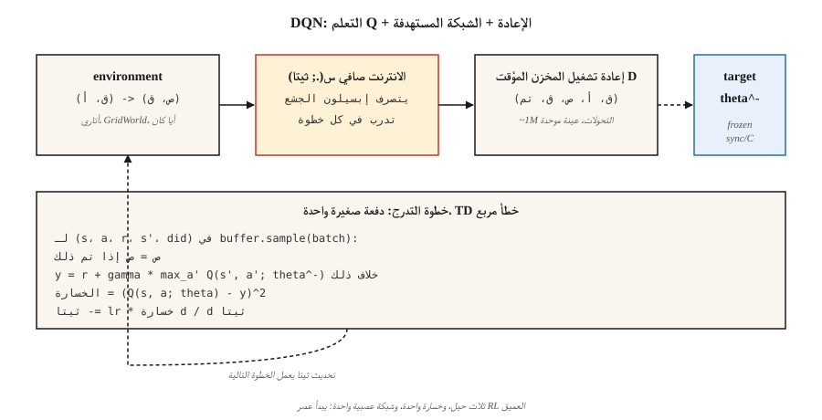

# Deep Q-Networks (DQN)

> 2013: قام منيه بتدريب إحدى شبكات Q-learning على وحدات البكسل الخام، متغلبًا على كل وكيل RL كلاسيكي في سبع ألعاب Atari. 2015: تم نشر 49 لعبة في مجلة Nature، مما أشعل شرارة عصر RL العميق. DQN هو Q-learning بالإضافة إلى ثلاث حيل تعمل على تقريب وظيفة make بشكل مستقر.

**النوع:** بناء
** اللغات: ** بايثون
** المتطلبات الأساسية: ** المرحلة 3 · 03 (الانتشار العكسي)، المرحلة 9 · 04 (Q-learning، SARSA)
**الوقت:** ~75 دقيقة

## The Problem

يحتاج تعلم Q الجدولي إلى قيمة Q منفصلة لكل زوج (حالة، إجراء). تحتوي رقعة الشطرنج على 10⁴³ حالات تقريبًا. إطار أتاري هو 210×160×3 = 100800 ميزة. الجدولي RL يموت في آلاف الولايات، ناهيك عن المليارات.

أصبح الإصلاح واضحًا بعد فوات الأوان: استبدل جدول Q بشبكة عصبية، `Q(s, a; θ)`. لكن الأمر الواضح بعد فوات الأوان استغرق عقودًا. يتباعد التقريب الساذج للدالة مع التعلم Q تحت "الثالوث القاتل" - تقريب الوظيفة + التمهيد + التعلم خارج السياسة. منيه وآخرون. (2013، 2015) حدد ثلاث حيل هندسية تعمل على استقرار التعلم:

1. **إعادة تشغيل التجربة** ترتبط بالتحولات.
2. تعمل **الشبكة المستهدفة** على تجميد هدف التمهيد.
3. **قص المكافأة** يعمل على تسوية أحجام التدرج.

DQN على Atari كانت المرة الأولى التي تحل فيها بنية واحدة مع مجموعة معلمات تشعبية واحدة العشرات من مشكلات التحكم من وحدات البكسل الأولية. كل شيء "عميق-RL" تم إنشاؤه منذ ذلك الحين - DDQN، قوس قزح، المبارزة، التوزيع، R2D2، Agent57 - مكدس فوق هذه القاعدة المكونة من ثلاث حيل.

## The Concept



**الهدف.** DQN تقليل خسارة خطوة واحدة TD لوظيفة Q العصبية:

`L(θ) = E_{(s,a,r,s')~D} [ (r + γ max_{a'} Q(s', a'; θ^-) - Q(s, a; θ))² ]`

`θ` = شبكة على الإنترنت، يتم تحديثها في كل خطوة عن طريق النسب المتدرج. `θ^-` = الشبكة المستهدفة، يتم نسخها بشكل دوري من `θ` (كل 10000 خطوة تقريبًا). `D` = إعادة تشغيل المخزن المؤقت للانتقالات السابقة.

**الحيل الثلاثة حسب الأهمية:**

**إعادة تشغيل التجربة.** مخزن مؤقت للحلقات من التحولات `~10⁶`. تقوم كل خطوة تدريب بأخذ عينات من دفعة صغيرة بشكل موحد وبشكل عشوائي. يؤدي هذا إلى كسر الارتباط الزمني (الإطارات المتعاقبة متطابقة تقريبًا)، ويسمح للشبكة بالتعلم من التحولات المجزية النادرة عدة مرات، وإلغاء ربط تحديثات التدرج المتتالية. بدونها، السياسة TD مع شبكة عصبية تتباعد على أتاري.

**الشبكة المستهدفة.** استخدام نفس الشبكة `Q(·; θ)` على جانبي معادلة بيلمان make هو الهدف الذي يحرك كل تحديث — "مطاردة ذيلك." الحل: احتفظ بشبكة ثانية `Q(·; θ^-)` بالأوزان المجمدة. كل `C` خطوة، انسخ `θ → θ^-`. يؤدي هذا إلى استقرار هدف الانحدار لآلاف خطوات التدرج في المرة الواحدة. تعد التحديثات البسيطة `θ^- ← τ θ + (1-τ) θ^-` (المستخدمة في DDPG، SAC) متغيرًا أكثر سلاسة.

**قص المكافآت.** تختلف أحجام مكافآت أتاري من 1 إلى 1000+. يؤدي القطع إلى `{-1, 0, +1}` إلى إيقاف أي لعبة منفردة من السيطرة على التدرج. من الخطأ أن يكون حجم المكافأة مهمًا؛ جيد بالنسبة لـ Atari حيث تكون الإشارة فقط هي المهمة.

** مزدوج DQN.** هاسيلت (2016) يعمل على إصلاح انحياز التعظيم: استخدم الشبكة عبر الإنترنت *لتحديد* الإجراء، والشبكة المستهدفة *لتقييمها*.

`target = r + γ Q(s', argmax_{a'} Q(s', a'; θ); θ^-)`

الاستبدال المنسدل، أفضل باستمرار. استخدامه بشكل افتراضي.

**تحسينات أخرى (Rainbow, 2017):** إعادة التشغيل ذات الأولوية (عينة من التحولات ذات الأخطاء العالية TD أكثر)، بنية المبارزة (منفصلة `V(s)` ورؤوس المزايا)، والشبكات المزعجة (الاستكشاف المكتسب)، وإرجاع الخطوة n، والتوزيع Q (C51/QR-DQN)، التمهيد متعدد الخطوات. كل يضيف نسبة قليلة. المكاسب مضافة تقريبًا.

## Build It

الكود هنا خالٍ من numpy-stdlib فقط - نستخدم طبقة مخفية مفردة ملفوفة يدويًا MLP على GridWorld صغير مستمر، لذلك يتم تنفيذ كل خطوة تدريب بالميكروثانية. الخوارزمية مطابقة لـ Atari DQN على نطاق واسع.

### Step 1: replay buffer

```python
class ReplayBuffer:
    def __init__(self, capacity):
        self.buf = []
        self.capacity = capacity
    def push(self, s, a, r, s_next, done):
        if len(self.buf) == self.capacity:
            self.buf.pop(0)
        self.buf.append((s, a, r, s_next, done))
    def sample(self, batch, rng):
        return rng.sample(self.buf, batch)
```

~50,000 سعة لأتاري؛ 5000 تكفي لبيئة لعبتنا.

### Step 2: a tiny Q-network (manual MLP)

```python
class QNet:
    def __init__(self, n_in, n_hidden, n_actions, rng):
        self.W1 = [[rng.gauss(0, 0.3) for _ in range(n_in)] for _ in range(n_hidden)]
        self.b1 = [0.0] * n_hidden
        self.W2 = [[rng.gauss(0, 0.3) for _ in range(n_hidden)] for _ in range(n_actions)]
        self.b2 = [0.0] * n_actions
    def forward(self, x):
        h = [max(0.0, sum(w * xi for w, xi in zip(row, x)) + b) for row, b in zip(self.W1, self.b1)]
        q = [sum(w * hi for w, hi in zip(row, h)) + b for row, b in zip(self.W2, self.b2)]
        return q, h
```

التمريرة الأمامية: خطية → ReLU → خطية. هذه هي الشبكة بأكملها.

### Step 3: the DQN update

```python
def train_step(online, target, batch, gamma, lr):
    grads = zeros_like(online)
    for s, a, r, s_next, done in batch:
        q, h = online.forward(s)
        if done:
            y = r
        else:
            q_next, _ = target.forward(s_next)
            y = r + gamma * max(q_next)
        td_error = q[a] - y
        accumulate_grads(grads, online, s, h, a, td_error)
    apply_sgd(online, grads, lr / len(batch))
```

الشكل هو Q-learning من الدرس 04 مع وجود اختلافين: (أ) ندعم من خلال `Q(·; θ)` قابل للتمييز بدلاً من فهرسة الجدول، (ب) يستخدم الهدف `Q(·; θ^-)`.

### Step 4: the outer loop

لكل حلقة، تصرف على ε-greedy على `Q(·; θ)`، وادفع التحولات إلى المخزن المؤقت، وقم بتجربة دفعة صغيرة، واتخذ خطوة متدرجة، وقم بمزامنة `θ^- ← θ` بشكل دوري. النمط:

```python
for episode in range(N):
    s = env.reset()
    while not done:
        a = epsilon_greedy(online, s, epsilon)
        s_next, r, done = env.step(s, a)
        buffer.push(s, a, r, s_next, done)
        if len(buffer) >= batch:
            train_step(online, target, buffer.sample(batch), gamma, lr)
        if steps % sync_every == 0:
            target = copy(online)
        s = s_next
```

في عالم GridWorld الصغير الخاص بنا والذي يتميز بحالة ساخنة واحدة خافتة تبلغ 16 درجة، يتعلم العميل سياسة شبه مثالية في 500 حلقة تقريبًا. على Atari، قم بقياس هذا إلى 200 مليون إطار وأضف مستخرج الميزات CNN.

## Pitfalls

- **الثالوث القاتل.** يمكن أن يتباعد التقريب الوظيفي + خارج السياسة + التمهيد. DQN يخفف بشبكة الهدف + الإعادة؛ لا تقم بإزالة سواء.
- **الاستكشاف.** يجب أن يتضاءل ε، عادةً من 1.0 إلى 0.01 خلال أول 10% من التدريب. وبدون الاستكشاف المبكر الكافي، تتقارب شبكة كيو نت مع حوض محلي.
- **المبالغة في التقدير.** `max` على Q الصاخبة متحيز للأعلى. استخدم دائمًا Double DQN في الإنتاج.
- **مقياس المكافآت.** قص المكافآت أو تطبيعها؛ حجم التدرج يتناسب مع حجم المكافأة.
- **إعادة تشغيل Coldstart المخزن المؤقت.** لا تتدرب حتى يحتوي المخزن المؤقت على بضعة آلاف من التحولات. التدرجات المبكرة على ~ 20 عينة overfit.
- **تردد المزامنة المستهدفة.** متكرر جدًا ≈ لا توجد شبكة مستهدفة؛ نادرة جدًا ≈ أهداف قديمة. يستخدم أتاري DQN 10000 خطوة بيئية. القاعدة الأساسية: المزامنة كل 1/100 تقريبًا من أفق التدريب.
- **المعالجة المسبقة للملاحظة.** أتاري DQN يكدس 4 إطارات إلى make حالة ماركوف. تحتاج أي بيئة تحتوي على معلومات السرعة إلى تكديس الإطارات أو حالة متكررة.

## Use It

في عام 2026، نادرًا ما تكون DQN هي أحدث ما توصلت إليه التكنولوجيا ولكنها تظل الخوارزمية المرجعية خارج السياسة:

| مهمة | طريقة الاختيار | لماذا لا DQN؟ |
|------|------------------|-------------|
| عمل منفصل يشبه أتاري | قوس قزح DQN أو موسلي | نفس الإطار، المزيد من الحيل. |
| التحكم المستمر | SAC / TD3 (المرحلة 9 · 07) | DQN ليس لديه شبكة سياسة. |
| على السياسة / الإنتاجية العالية | PPO (المرحلة 9 · 08) | لا يوجد مخزن مؤقت لإعادة التشغيل؛ أسهل في القياس. |
| غير متصل RL | CQL / IQL / محوّل القرار | أهداف Q المحافظة، لا توجد عمليات تفجير تمهيدية. |
| مساحات عمل منفصلة كبيرة (موصى به) | DQN مع تضمين الإجراء، أو IMPALA | بخير؛ مسائل الديكور. |
| LLM RL | PPO / GRPO | مستوى التسلسل، وليس مستوى الخطوة؛ خسارة مختلفة. |

الدروس لا تزال تسافر. تظهر شبكات إعادة التشغيل والاستهداف في SAC، TD3، DDPG، SAC-X، المخزن المؤقت للتشغيل الذاتي الخاص بـ AlphaZero، وكل طريقة RL غير متصلة بالإنترنت. يستمر قص المكافأة كتطبيع الميزة في PPO. العمارة هي المخطط.

## Ship It

حفظ باسم `outputs/skill-dqn-trainer.md`:

```markdown
---
name: dqn-trainer
description: Produce a DQN training config (buffer, target sync, ε schedule, reward clipping) for a discrete-action RL task.
version: 1.0.0
phase: 9
lesson: 5
tags: [rl, dqn, deep-rl]
---

Given a discrete-action environment (observation shape, action count, horizon, reward scale), output:

1. Network. Architecture (MLP / CNN / Transformer), feature dim, depth.
2. Replay buffer. Capacity, minibatch size, warmup size.
3. Target network. Sync strategy (hard every C steps or soft τ).
4. Exploration. ε start / end / schedule length.
5. Loss. Huber vs MSE, gradient clip value, reward clipping rule.
6. Double DQN. On by default unless explicit reason to disable.

Refuse to ship a DQN with no target network, no replay buffer, or ε held at 1. Refuse continuous-action tasks (route to SAC / TD3). Flag any reward range > 10× per-step mean as needing clipping or scale normalization.
```

## Exercises

1. **سهل.** تشغيل `code/main.py`. رسم منحنى العودة لكل حلقة. كم عدد الحلقات حتى يتجاوز متوسط ​​التشغيل -10؟
2. **متوسطة.** قم بتعطيل الشبكة المستهدفة (استخدم شبكة الإنترنت لكلا جانبي هدف بيلمان). قياس عدم استقرار التدريب - هل يتأرجح العائد أم يتباعد؟
3. **صعب.** أضف ضعف DQN: استخدم الشبكة عبر الإنترنت لاختيار `argmax a'`، واستهداف الشبكة للتقييم. قارن الانحياز `Q(s_0, best_a)` مقابل الصحيح `V*(s_0)` بعد 1000 حلقة مع مقابل بدون Double DQN في GridWorld الصاخبة.

## Key Terms

| مصطلح | ماذا يقول الناس | ماذا يعني في الواقع |
|------|-|--------------------------------------|
| DQN | "التعلم العميق Q" | التعلم Q باستخدام وظيفة Q العصبية ومخزن إعادة التشغيل والشبكة المستهدفة. |
| تجربة الإعادة | "الانتقالات العشوائية" | تم أخذ عينات من المخزن المؤقت الحلقي بشكل موحد في كل خطوة متدرجة؛ يتناقض مع البيانات. |
| الشبكة المستهدفة | "التمهيد المجمد" | نسخة دورية من Q المستخدمة في هدف بيلمان؛ يستقر التدريب. |
| الثالوث القاتل | "لماذا RL يتباعد" | تقريب الوظيفة + التمهيد + خارج السياسة = لا يوجد ضمان للتقارب. |
| مزدوج DQN | "إصلاح انحياز التعظيم" | تقوم شبكة الإنترنت باختيار الإجراء، وتقوم شبكة الهدف بتقييمه. |
| المبارزة DQN | "رؤوس V و A" | تتحلل Q = V + A - يعني(A)؛ نفس الإخراج، وتدفق التدرج أفضل. |
| قوس قزح | "كل الحيل" | DDQN + PER + مبارزة + خطوة ن + صاخبة + توزيعية في واحد. |
| PER | "إعادة التشغيل ذات الأولوية" | عينة من التحولات تتناسب مع حجم الخطأ TD. |

## Further Reading

- [Mnih et al. (2013). Playing Atari with Deep Reinforcement Learning](https://arxiv.org/abs/1312.5602) — the 2013 NeurIPS workshop paper that kicked off deep RL.
- [Mnih et al. (2015). التحكم على مستوى الإنسان من خلال التعلم المعزز العميق](https://www.nature.com/articles/nature14236) — ورقة الطبيعة، 49 لعبة DQN.
- [Hasselt, Guez, Silver (2016). Deep Reinforcement Learning with Double Q-learning]( — https.
- [Wang et al. (2016). مبارزة بنيات الشبكة](https://arxiv.org/abs/1511.06581) — مبارزة DQN.
- [Hessel et al. (2018). Rainbow: Combining Improvements in Deep RL](https://arxiv.org/abs/1710.02298) — the stacked-tricks paper.
- [OpenAI Spinning Up — DQN](https://spinningup.openai.com/en/latest/algorithms/dqn.html) — clear modern exposition.
- [Sutton & Barto (2018). الفصل. 9 - التنبؤ بالسياسة مع التقريب](http://incompleteideas.net/book/RLbook2020.pdf) - معالجة الكتاب المدرسي لـ "الثالوث القاتل" (تقريب الوظيفة + التمهيد + خارج السياسة) التي تم تصميم الشبكة المستهدفة لـ DQN ومخزن إعادة التشغيل المؤقت لترويضها.
- [تنفيذ CleanRL DQN](https://docs.cleanrl.dev/rl-algorithms/dqn/) — ملف فردي مرجعي DQN يُستخدم في دراسات الاستئصال؛ من الجيد قراءته جنبًا إلى جنب مع نسخة هذا الدرس من البداية.
