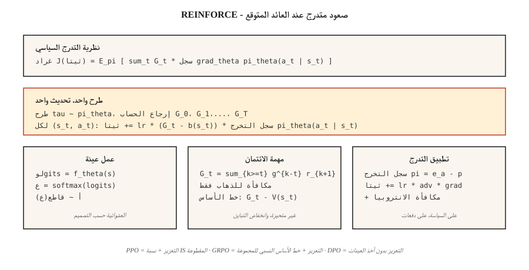

# Policy Gradient — REINFORCE from Scratch

> توقف عن تقدير القيمة. قم بوضع معلمات السياسة مباشرة، وحساب تدرج العائد المتوقع، والخطوة صعودًا. كتبه ويليامز (1992) في نظرية واحدة. وهذا هو سبب وجود PPO، GRPO، وكل LLM RL حلقة.

**النوع:** بناء
** اللغات: ** بايثون
**المتطلبات الأساسية:** المرحلة 3 · 03 (الانتشار العكسي)، المرحلة 9 · 03 (مونت كارلو)، المرحلة 9 · 04 (TD التعلم)
**الوقت:** ~75 دقيقة

## The Problem

Q-learning و DQN يحددان وظيفة *القيمة*. يمكنك اختيار الإجراءات حسب `argmax Q`. هذا أمر جيد بالنسبة للأفعال المنفصلة والحالات المنفصلة. ينكسر عندما تكون الإجراءات مستمرة (أي `argmax` على عزم دوران ذي 10 أبعاد؟) أو عندما تريد سياسة عشوائية (`argmax` حتمية بالبناء).

تقوم تدرجات السياسة بتحديد *السياسة* بدلاً من ذلك. `π_θ(a | s)` عبارة عن شبكة عصبية تنتج توزيعًا على الإجراءات. عينة منه للعمل. احسب تدرج العائد المتوقع بالنسبة إلى `θ`. خطوة شاقة. لا `argmax`. لا يوجد تكرار بيلمان. مجرد صعود متدرج على `J(θ) = E_{π_θ}[G]`.

تخبرك نظرية REINFORCE (Williams 1992) أن هذا التدرج قابل للحساب: `∇J(θ) = E_π[ G · ∇_θ log π_θ(a | s) ]`. تشغيل حلقة. احسب العائد. اضرب بـ `∇ log π_θ(a | s)` في كل خطوة. متوسط. صعود التدرج. منتهي.

كل خوارزمية LLM-RL في عام 2026 — PPO، DPO، GRPO — هي تحسين لـ REINFORCE. إن فهمها بين أصابعك هو الشرط الأساسي لبقية هذه المرحلة، وللمرحلة 10 · 07 (RLHF التنفيذ) والمرحلة 10 · 08 (DPO).

## The Concept



**نظرية تدرج السياسة.** بالنسبة لأي سياسة `π_θ` ذات معلمات بواسطة `θ`:

`∇J(θ) = E_{τ ~ π_θ}[ Σ_{t=0}^{T} G_t · ∇_θ log π_θ(a_t | s_t) ]`

حيث `G_t = Σ_{k=t}^{T} γ^{k-t} r_{k+1}` هو العائد المخصوم من الخطوة `t`. تم التوقع على المسارات الكاملة `τ` المأخوذة من `π_θ`.

**البرهان قصير.** افرق `J(θ) = Σ_τ P(τ; θ) G(τ)` تحت التوقع. استخدم `∇P(τ; θ) = P(τ; θ) ∇ log P(τ; θ)` (خدعة مشتق السجل). العامل `log P(τ; θ) = Σ log π_θ(a_t | s_t) + environment terms that do not depend on θ`. شروط البيئة تختفي. سطرين من الجبر يعطيك النظرية.

**حيل تقليل التباين.** تتمتع Vanilla REINFORCE بتباين قاتل - العوائد صاخبة، `∇ log π` صاخبة، منتجها صاخب للغاية. اثنين من الإصلاحات القياسية:

1. **طرح خط الأساس.** استبدل `G_t` بـ `G_t - b(s_t)` لأي خط أساس `b(s_t)` لا يعتمد على `a_t`. غير متحيز لأن `E[b(s_t) · ∇ log π(a_t | s_t)] = 0`. الاختيار النموذجي: `b(s_t) = V̂(s_t)` يتعلمه الناقد ← الممثل الناقد (الدرس 07).
2. **مكافأة الانطلاق.** استبدل `Σ_t G_t · ∇ log π_θ(a_t | s_t)` بـ `Σ_t G_t^{from t} · ∇ log π_θ(a_t | s_t)`. العائدات المستقبلية فقط هي التي تهم إجراءً معينًا - فالمكافآت السابقة تساهم في ضوضاء متوسطة.

مجتمعة، تحصل على:

`∇J ≈ (1/N) Σ_{i=1}^{N} Σ_{t=0}^{T_i} [ G_t^{(i)} - V̂(s_t^{(i)}) ] · ∇_θ log π_θ(a_t^{(i)} | s_t^{(i)})`

وهو التعزيز بخط الأساس - السلف المباشر لـ A2C (الدرس 07) و PPO (الدرس 08).

**تحديد معلمات سياسة Softmax.** بالنسبة للإجراءات المنفصلة، ​​الاختيار القياسي:

`π_θ(a | s) = exp(f_θ(s, a)) / Σ_{a'} exp(f_θ(s, a'))`

حيث `f_θ` هي أي شبكة عصبية تنتج نتيجة لكل إجراء. التدرج له شكل نظيف:

`∇_θ log π_θ(a | s) = ∇_θ f_θ(s, a) - Σ_{a'} π_θ(a' | s) ∇_θ f_θ(s, a')`

أي درجة الإجراء المتخذ مطروحًا منه قيمته المتوقعة بموجب السياسة.

**سياسة غاوسية للأفعال المستمرة.** `π_θ(a | s) = N(μ_θ(s), σ_θ(s))`. `∇ log N(a; μ, σ)` له نموذج مغلق. هذا هو كل احتياجات المرحلة 9 · 07 SAC.

## Build It

### Step 1: softmax policy network

```python
def policy_logits(theta, state_features):
    return [dot(theta[a], state_features) for a in range(N_ACTIONS)]

def softmax(logits):
    m = max(logits)
    exps = [exp(l - m) for l in logits]
    Z = sum(exps)
    return [e / Z for e in exps]
```

استخدم سياسة خطية (ناقل وزن واحد لكل إجراء) لبيئة جدولية. بالنسبة لـ Atari، قم بتبديل CNN واحتفظ برأس softmax.

### Step 2: sampling and log-probability

```python
def sample_action(probs, rng):
    x = rng.random()
    cum = 0
    for a, p in enumerate(probs):
        cum += p
        if x <= cum:
            return a
    return len(probs) - 1

def log_prob(probs, a):
    return log(probs[a] + 1e-12)
```

### Step 3: rollout with log-probs captured

```python
def rollout(theta, env, rng, gamma):
    trajectory = []
    s = env.reset()
    while not done:
        logits = policy_logits(theta, s)
        probs = softmax(logits)
        a = sample_action(probs, rng)
        s_next, r, done = env.step(s, a)
        trajectory.append((s, a, r, probs))
        s = s_next
    return trajectory
```

### Step 4: REINFORCE update

```python
def reinforce_step(theta, trajectory, gamma, lr, baseline=0.0):
    returns = compute_returns(trajectory, gamma)
    for (s, a, _, probs), G in zip(trajectory, returns):
        advantage = G - baseline
        grad_log_pi_a = [-p for p in probs]
        grad_log_pi_a[a] += 1.0
        for i in range(N_ACTIONS):
            for j in range(len(s)):
                theta[i][j] += lr * advantage * grad_log_pi_a[i] * s[j]
```

التدرج `∇ log π(a|s) = e_a - π(·|s)` (onehot من `a` ناقص الاحتمالات) هو قلب تدرجات سياسة softmax. حرقه في الذاكرة العضلية.

### Step 5: baselines

يعد متوسط ​​التشغيل `G` خلال الحلقات الأخيرة بمثابة تقليل تباين كافٍ لتشغيل 4×4 GridWorld؛ يستغرق الأمر حوالي 500 حلقة للتقارب. قم بترقية خط الأساس إلى `V̂(s)` المستفادة وستحصل على الناقد الممثل.

## Pitfalls

- **تدرجات متفجرة.** يمكن أن تكون العائدات ضخمة. قم دائمًا بتطبيع `G` إلى `~N(0, 1)` عبر الدفعة قبل الضرب بـ `∇ log π`.
- **انهيار الإنتروبيا.** تتقارب السياسة إلى إجراء شبه حتمي في وقت مبكر جدًا، وتتوقف عن الاستكشاف، وتتعثر. الإصلاح: إضافة الإنتروبيا الإضافية `β · H(π(·|s))` إلى الهدف.
- **التباين العالي.** يحتاج Vanilla REINFORCE إلى آلاف الحلقات. خط الأساس الناقد (الدرس 07) أو منطقة الثقة TRPO/PPO (الدرس 08) هو الإصلاح القياسي.
- **عينة عدم الكفاءة.** سياسة التشغيل تعني أنك تتخلص من كل عملية انتقال بعد تحديث واحد. تعمل التصحيحات خارج السياسة عن طريق أخذ عينات الأهمية على إعادة البيانات، على حساب التباين (نسبة PPO هي وزن مقطوع IS).
- **التدرجات غير الثابتة.** يستخدم نفس التدرج منذ 100 حلقة الرقم `π` القديم. يتم تحديث الأساليب المتعلقة بالسياسة كل بضع عمليات طرح لهذا السبب.
- **تخصيص الرصيد.** بدون المكافأة الحالية، ستتسبب المكافآت السابقة في حدوث ضجيج. استخدم دائمًا المكافأة للذهاب.

## Use It

في عام 2026، نادرًا ما يتم تشغيل REINFORCE بشكل مباشر ولكن صيغة التدرج الخاصة به موجودة في كل مكان:

| حالة الاستخدام | الطريقة المشتقة |
|----------|--------------|
| التحكم المستمر | PPO / SAC بسياسة غاوسية |
| LLM RLHF | PPO مع KL عقوبة، تعمل وفقًا لسياسة مستوى الرمز المميز |
| LLM الاستدلال (DeepSeek) | GRPO — التعزيز بخط الأساس النسبي للمجموعة، بدون انتقاد |
| وكيل متعدد | تعزيز الناقد المركزي (MADDPG, COMA) |
| الروبوتات العمل المنفصلة | A2C, A3C, PPO |
| إعدادات التفضيلات فقط | DPO — تمت إعادة كتابة REINFORCE كخسارة احتمالية التفضيل، بدون أخذ عينات |

عندما تقرأ `loss = -advantage * log_prob` في البرنامج النصي التدريبي لعام 2026، فهذا يعني التعزيز بخط الأساس. الأوراق الكاملة (DPO، GRPO، RLOO) هي حيل لتقليل التباين أعلى هذا السطر الواحد.

## Ship It

حفظ باسم `outputs/skill-policy-gradient-trainer.md`:

```markdown
---
name: policy-gradient-trainer
description: Produce a REINFORCE / actor-critic / PPO training config for a given task and diagnose variance issues.
version: 1.0.0
phase: 9
lesson: 6
tags: [rl, policy-gradient, reinforce]
---

Given an environment (discrete / continuous actions, horizon, reward stats), output:

1. Policy head. Softmax (discrete) or Gaussian (continuous) with parameter counts.
2. Baseline. None (vanilla), running mean, learned `V̂(s)`, or A2C critic.
3. Variance controls. Reward-to-go on by default, return normalization, gradient clip value.
4. Entropy bonus. Coefficient β and decay schedule.
5. Batch size. Episodes per update; on-policy data freshness contract.

Refuse REINFORCE-no-baseline on horizons > 500 steps. Refuse continuous-action control with a softmax head. Flag any run with `β = 0` and observed policy entropy < 0.1 as entropy-collapsed.
```

## Exercises

1. **سهل.** قم بتنفيذ REINFORCE على 4×4 GridWorld باستخدام سياسة softmax الخطية. تدرب على 1000 حلقة بدون خط أساس. رسم منحنى التعلم. قياس التباين (قياس العوائد).
2. **متوسط.** أضف خط أساس للمتوسط ​​الجاري. تدريب مرة أخرى. مقارنة كفاءة العينة والتباين لتشغيل الفانيليا. إلى أي مدى يقلل خط الأساس من خطوات التقارب؟
3. **صعب.** أضف إنتروبيا إضافية `β · H(π)`. اكتساح `β ∈ {0, 0.01, 0.1, 1.0}`. مؤامرة العودة النهائية والانتروبيا السياسة. أين هو المكان الجميل في هذه المهمة؟

## Key Terms

| مصطلح | ماذا يقول الناس | ماذا يعني في الواقع |
|------|-|--------------------------------------|
| التدرج السياسي | "تدريب السياسة مباشرة" | `∇J(θ) = E[G · ∇ log π_θ(a|s)]`; مشتقة من خدعة مشتق السجل. |
| تعزيز | "خوارزمية PG الأصلية" | ويليامز (1992); تُرجع مونت كارلو مضروبة في تدرج سياسة السجل. |
| خدعة مشتق السجل | "مقدر دالة النتيجة" | `∇P(τ;θ) = P(τ;θ) · ∇ log P(τ;θ)`; makes تدرجات التوقعات قابلة للتتبع. |
| خط الأساس | "تقليل التباين" | أي `b(s)` مطروح من `G`؛ غير متحيز لأن `E[b · ∇ log π] = 0`. |
| مكافأة للذهاب | "يتم احتساب العائدات المستقبلية فقط" | `G_t^{from t}` بدلاً من `G_0` الكامل؛ الصحيح وأقل التباين. |
| مكافأة الانتروبيا | "تشجيع الاستكشاف" | المصطلح `+β · H(π(·|s))` يحافظ على السياسة من الانهيار. |
| على السياسة | "تدرب على ما رأيته للتو" | توقع التدرج هو w.r.t. السياسة الحالية — لا يمكن إعادة استخدام البيانات القديمة مباشرةً. |
| ميزة | "كم هو أفضل من المتوسط" | `A(s, a) = G(s, a) - V(s)`; تتضاعف الكمية الموقعة REINFORCE-with-baseline. |

## Further Reading

- [Williams (1992). Simple Statistical Gradient-Following Algorithms for Connectionist Reinforcement Learning](https://link.springer.com/article/10.1007/BF00992696) — the original REINFORCE paper.
- [Sutton et al. (2000). طرق التدرج في السياسة لتعزيز التعلم من خلال تقريب الوظيفة](https://papers.nips.cc/paper_files/paper/1999/hash/464d828b85b0bed98e80ade0a5c43b0f-Abstract.html) - نظرية التدرج في السياسة الحديثة مع تقريب الوظيفة.
- [Sutton & Barto (2018). Ch. 13 — Policy Gradient Methods](http://incompleteideas.net/book/RLbook2020.pdf) — textbook presentation.
- [OpenAI Spinning Up — VPG / REINFORCE](https://spinningup.openai.com/en/latest/algorithms/vpg.html) — clear pedagogical exposition with PyTorch code.
- [Peters & Schaal (2008). تعزيز التعلم للمهارات الحركية مع تدرجات السياسة](https://homes.cs.washington.edu/~todorov/courses/amath579/reading/PolicyGradient.pdf) — تقليل التباين وعرض التدرج الطبيعي الذي يربط REINFORCE بأسرة منطقة الثقة (TRPO، PPO).
