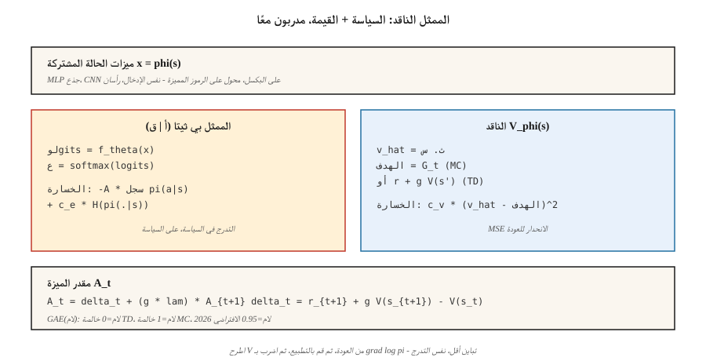

# Actor-Critic — A2C and A3C

> التعزيز صاخب. أضف ناقدًا يتعلم `V̂(s)`، واطرحه من العائد، وستحصل على ميزة لها نفس التوقعات ولكن بتباين أقل بكثير. هذا هو الناقد الممثل. A2C يقوم بتشغيله بشكل متزامن؛ A3C يمرره عبر الخيوط. كلاهما النموذج العقلي لكل طريقة RL عميقة حديثة.

**النوع:** بناء
** اللغات: ** بايثون
** المتطلبات الأساسية: ** المرحلة 9 · 04 (TD التعلم)، المرحلة 9 · 06 (تعزيز)
**الوقت:** ~75 دقيقة

## The Problem

يعمل Vanilla REINFORCE، لكن تباينه فظيع. عودة مونت كارلو `G_t` يمكن أن تتأرجح بعامل 10 بين الحلقات. يؤدي ضرب هذا الضجيج في `∇ log π` والمتوسط ​​إلى إنتاج مُقدِّر تدرج يستغرق آلاف الحلقات لتحريك السياسة بنفس المسافة التي يمكنك نقلها بها مع عدد أقل بكثير من التحديثات DQN.

يأتي التباين من استخدام العوائد الأولية. إذا قمت بطرح خط الأساس `b(s_t)` — أي دالة للحالة، بما في ذلك القيمة المستفادة — فلن يتغير التوقع وينخفض ​​التباين. أفضل خط أساس يمكن تتبعه هو `V̂(s_t)`. الآن ضرب الكمية `∇ log π` هو *الميزة*:

`A(s, a) = G - V̂(s)`

يكون الإجراء جيدًا إذا أنتج عائدًا أعلى من المتوسط؛ سيئة إذا أدناه. التعزيز بالناقد المتعلم هو *الناقد الفاعل*. الناقد يعطي الممثل معلما منخفض التباين. هذه هي كل أساليب السياسة العميقة بعد عام 2015 (A2C، A3C، PPO، SAC، IMPALA).

## The Concept



**شبكتان، خسارة مشتركة واحدة:**

- **الفاعل** `π_θ(a | s)`: السياسة. عينة للعمل. تدرب مع التدرج في السياسة.
- **الناقد** `V_φ(s)`: تقديرات العائد المتوقع من الدولة. تم تدريبه على تقليل `(V_φ(s) - target)²`.

**الميزة.** نموذجان قياسيان:

- *MC الميزة:* `A_t = G_t - V_φ(s_t)`. غير متحيز، والتباين العالي.
- *TD الميزة:* `A_t = r_{t+1} + γ V_φ(s_{t+1}) - V_φ(s_t)`. متحيز (يستخدم `V_φ`)، تباين أقل بكثير. يُطلق عليه أيضًا *TD المتبقي* `δ_t`.

** ميزة n-step.** أحرف بين الاثنين:

`A_t^{(n)} = r_{t+1} + γ r_{t+2} + … + γ^{n-1} r_{t+n} + γ^n V_φ(s_{t+n}) - V_φ(s_t)`

`n = 1` نقي TD. `n = ∞` هو MC. تستخدم معظم التطبيقات `n = 5` لـ Atari، `n = 2048` لـ PPO على MuJoCo.

**تقدير الميزة المعممة (GAE).** شولمان وآخرون. (2016) اقترح متوسطًا مرجحًا بشكل كبير على جميع مزايا الخطوة n:

`A_t^{GAE} = Σ_{l=0}^{∞} (γλ)^l δ_{t+l}`

مع `λ ∈ [0, 1]`. `λ = 0` هو TD (تباين منخفض، انحياز عالي). `λ = 1` هو MC (تباين عالٍ، غير متحيز). `λ = 0.95` هو الإعداد الافتراضي لعام 2026 — قم بالضبط حتى يصل قرص التحيز/التباين إلى المكان الذي تريده.

** A2C: الناقد الممثل ذو الميزة المتزامنة. ** اجمع `T` خطوات عبر `N` بيئات متوازية. حساب المزايا لكل خطوة. تحديث الممثل والناقد على الدفعة المجمعة. يكرر. الأخ الأبسط والأكثر قابلية للتوسع لـ A3C.

**A3C: ميزة غير متزامنة الفاعل الناقد.** منيه وآخرون. (2016). تفرخ `N` سلاسل العمليات، كل منها يشغل بيئة. يحسب كل عامل التدرجات محليًا في عملية الطرح الخاصة به، ثم يطبقها بشكل غير متزامن على خادم معلمات مشترك. ليست هناك حاجة إلى مخزن مؤقت لإعادة التشغيل - حيث يتواصل العمال عن طريق تشغيل مسارات مختلفة. أثبت A3C أنه يمكنك التدرب على CPU على نطاق واسع. في عام 2026، تهيمن GPU القائمة على A2C (البيئات المتوازية المجمعة) لأن GPUs تريد دفعات كبيرة.

**الخسارة المجمعة.**

`L(θ, φ) = -E[ A_t · log π_θ(a_t | s_t) ] + c_v · E[(V_φ(s_t) - G_t)²] - c_e · E[H(π_θ(·|s_t))]`

ثلاثة مصطلحات: خسارة تدرج السياسة، وانحدار القيمة، ومكافأة الإنتروبيا. `c_v ~ 0.5`، `c_e ~ 0.01` هي نقاط بداية أساسية.

## Build It

### Step 1: a critic

تم تحديث الناقد الخطي `V_φ(s) = w · features(s)` بـ MSE:

```python
def critic_update(w, x, target, lr):
    v_hat = dot(w, x)
    err = target - v_hat
    for j in range(len(w)):
        w[j] += lr * err * x[j]
    return v_hat
```

على بيئة جدولية يلتقي الناقد في بضع مئات من الحلقات. في Atari، استبدل الناقد الخطي بصندوق CNN مشترك + رأس قيمة.

### Step 2: n-step advantage

بالنظر إلى طول الطرح `T` والنهائي التمهيدي `V(s_T)`:

```python
def compute_advantages(rewards, values, gamma=0.99, lam=0.95, last_value=0.0):
    advantages = [0.0] * len(rewards)
    gae = 0.0
    for t in reversed(range(len(rewards))):
        next_v = values[t + 1] if t + 1 < len(values) else last_value
        delta = rewards[t] + gamma * next_v - values[t]
        gae = delta + gamma * lam * gae
        advantages[t] = gae
    returns = [a + v for a, v in zip(advantages, values)]
    return advantages, returns
```

`returns` هو هدف الناقد. `advantages` هو ما يتضاعف `∇ log π`.

### Step 3: combined update

```python
for step_i, (x, a, _r, probs) in enumerate(traj):
    adv = advantages[step_i]
    target_v = returns[step_i]

    # critic
    critic_update(w, x, target_v, lr_v)

    # actor
    for i in range(N_ACTIONS):
        grad_logpi = (1.0 if i == a else 0.0) - probs[i]
        for j in range(N_FEAT):
            theta[i][j] += lr_a * adv * grad_logpi * x[j]
```

على مستوى السياسة، يتم طرح إصدار واحد لكل تحديث، ومعدلات تعلم منفصلة للممثل والناقد.

### Step 4: parallelization (A3C vs A2C)

- **A3C:** قم بتدوير الخيوط `N`. يدير كل منهم بيئته الخاصة وتمريره الأمامي الخاص به. دفع تحديثات التدرج بشكل دوري إلى رئيسي مشترك. لا توجد أقفال على السيد - السباقات على ما يرام، فهي تضيف فقط الضوضاء.
- **A2C:** تشغيل `N` مثيلات env في عملية واحدة، وتكديس الملاحظات في دفعة `[N, obs_dim]`، وتمرير أمامي مجمع، وتمرير خلفي مجمع. استخدام أعلى GPU، حتمي، أسهل في التفكير. الافتراضي في عام 2026.

رمز لعبتنا أحادي الخيط من أجل الوضوح؛ إعادة الكتابة إلى A2C المجمعة عبارة عن ثلاثة أسطر من numpy.

## Pitfalls

- **تحيز الناقد قبل تدرج الممثل.** إذا كان الناقد عشوائيًا، فإن خط الأساس الخاص به غير مفيد وأنت تتدرب على الضوضاء النقية. قم بإحماء الناقد لبضع مئات من الخطوات قبل تشغيل تدرج السياسة، أو استخدم معدل التعلم البطيء للممثل.
- **تسوية المزايا.** تسوية المزايا إلى متوسط ​​صفري/وحدة قياسية لكل دفعة. استقرار التدريب على نطاق واسع بتكلفة قريبة من الصفر.
- **الجذع المشترك.** استخدم أداة استخراج الميزات المشتركة للممثل والناقد عند إدخال الصور. رؤوس منفصلة. الميزات المشتركة تستفيد مجانًا من كلا الخسارتين.
- **عقد على السياسة.** A2C يعيد استخدام البيانات لتحديث واحد بالضبط. المزيد ويكون التدرج الخاص بك متحيزًا (تصحيح أخذ العينات المهم هو ما يضيفه PPO).
- **انهيار الإنتروبيا.** بدون `c_e > 0`، تصبح السياسة شبه حتمية في بضع مئات من التحديثات وتتوقف عن الاستكشاف.
- **مقياس المكافأة.** يعتمد حجم المزايا على مقياس المكافأة. تطبيع المكافآت (على سبيل المثال، تقسيم التشغيل القياسي) لأحجام التدرج المتسقة عبر المهام.

## Use It

نادرًا ما يكون A2C/A3C هو الاختيار النهائي في عام 2026، لكنه يمثل الهندسة المعمارية التي يصقلها كل شيء لاحقًا:

| الطريقة | العلاقة بـ A2C |
|--------|----------------|
| PPO | A2C + نسبة الأهمية المقطوعة للتحديثات متعددة العصور |
| IMPALA | A3C + تصحيح V-trace خارج السياسة |
| SAC (المرحلة 9 · 07) | خارج السياسة A2C مع الناقد ذو القيمة الناعمة (الدرس القادم) |
| GRPO (المرحلة 9 · 12) | A2C بدون الناقد — ميزة نسبية جماعية |
| DPO | A2C انهارت إلى خسارة ترتيب التفضيل، لا يوجد أخذ عينات |
| ألفا ستار / OpenAI خمسة | A2C مع تدريب الدوري + تدريب مسبق التقليد |

إذا رأيت "ميزة" في ورقة بحثية لعام 2026، ففكر في الممثل الناقد.

## Ship It

حفظ باسم `outputs/skill-actor-critic-trainer.md`:

```markdown
---
name: actor-critic-trainer
description: Produce an A2C / A3C / GAE configuration for a given environment, with advantage estimation and loss weights specified.
version: 1.0.0
phase: 9
lesson: 7
tags: [rl, actor-critic, gae]
---

Given an environment and compute budget, output:

1. Parallelism. A2C (GPU batched) vs A3C (CPU async) and the number of workers.
2. Rollout length T. Steps per env per update.
3. Advantage estimator. n-step or GAE(λ); specify λ.
4. Loss weights. `c_v` (value), `c_e` (entropy), gradient clip.
5. Learning rates. Actor and critic (separate if using).

Refuse single-worker A2C on environments with horizon > 1000 (too on-policy, too slow). Refuse to ship without advantage normalization. Flag any run with `c_e = 0` and observed entropy < 0.1 as entropy-collapsed.
```

## Exercises

1. **سهل.** تدريب الممثل الناقد مع ميزة MC (`G_t - V(s_t)`) على 4×4 GridWorld. قارن كفاءة العينة مع خط الأساس REINFORCE مع متوسط التشغيل من الدرس 06.
2. **متوسطة.** قم بالتبديل إلى TD-الميزة المتبقية (`r + γ V(s') - V(s)`). قياس التباين في دفعات الميزة. بكم يهبط؟
3. **صعب.** تنفيذ GAE(π). اكتساح `λ ∈ {0, 0.5, 0.9, 0.95, 1.0}`. رسم العائد النهائي مقابل كفاءة العينة. أين يقع التحيز/التباين في هذه المهمة؟

## Key Terms

| مصطلح | ماذا يقول الناس | ماذا يعني في الواقع |
|------|-|--------------------------------------|
| ممثل | "شبكة السياسة" | `π_θ(a|s)`، تم تحديثه بواسطة تدرج السياسة. |
| الناقد | "صافية القيمة" | `V_φ(s)`، تم التحديث بواسطة انحدار MSE إلى العائدات / TD الأهداف. |
| ميزة | "كم هو أفضل من المتوسط" | `A(s, a) = Q(s, a) - V(s)` أو مقدراتها. مضاعف لـ `∇ log π`. |
| TD باقية | """ | `δ_t = r + γ V(s') - V(s)`; تقدير الميزة بخطوة واحدة. |
| GAE | "مقبض الاستيفاء" | مجموع مرجح بشكل كبير لمزايا n-step، محدد بواسطة `λ`. |
| A2C | "الناقد الممثل المتزامن" | دفعة عبر بيئات. خطوة متدرجة واحدة لكل عملية طرح. |
| A3C | "الناقد الممثل غير المتزامن" | مؤشرات الترابط العاملة تدفع التدرجات إلى خادم معلمة مشترك. الورق الأصلي؛ أقل شيوعا في عام 2026. |
| بوتستراب | "استخدم V في الأفق" | قم باقتطاع الطرح، أضف `γ^n V(s_{t+n})` لإغلاق المجموع. |

## Further Reading

- [Mnih et al. (2016). Asynchronous Methods for Deep Reinforcement Learning]( — https, the original async actor-critic paper.
- [Schulman et al. (2016). التحكم المستمر عالي الأبعاد باستخدام تقدير المزايا المعمم](https://arxiv.org/abs/1506.02438) — GAE.
- [Sutton & Barto (2018). Ch. 13 — Actor-Critic Methods](http://incompleteideas.net/book/RLbook2020.pdf) — foundations; pair this with Ch. 9 on function approximation when the critic is a neural net.
- [Espeholt et al. (2018). IMPALA](https://arxiv.org/abs/1802.01561) — ناقد ممثل موزع قابل للتطوير مع تصحيح V-trace خارج السياسة.
- [OpenAI Baselines / Stable-Baselines3](https://stable-baselines3.readthedocs.io/) — production A2C/PPO implementations worth reading.
- [Konda & Tsitsiklis (2000). خوارزميات الممثل والناقد](https://papers.nips.cc/paper/1786-actor-critic-algorithms) - نتيجة التقارب التأسيسية لتحليل الممثل والناقد على نطاق زمني.
