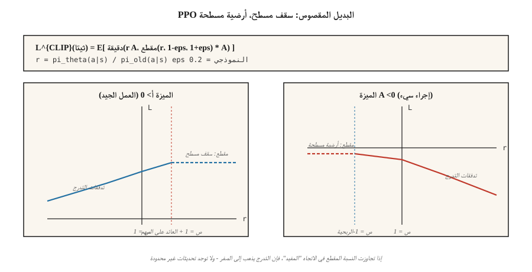

# Proximal Policy Optimization (PPO)

> A2C يتخلص من كل عملية طرح بعد تحديث واحد. PPO يغلف تدرج السياسة بنسبة أهمية مقطوعة حتى تتمكن من إجراء أكثر من 10 فترات على نفس البيانات دون انفجار السياسة. شولمان وآخرون. (2017). لا تزال خوارزمية تدرج السياسة الافتراضية في عام 2026.

**النوع:** بناء
** اللغات: ** بايثون
** المتطلبات الأساسية: ** المرحلة 9 · 06 (REINFORCE)، المرحلة 9 · 07 (ممثل-ناقد)
**الوقت:** ~75 دقيقة

## The Problem

A2C (الدرس 07) يتعلق بالسياسة: يتطلب التدرج `E_{π_θ}[A · ∇ log π_θ]` بيانات تم أخذ عينات منها من *الحالي* `π_θ`. قم بإجراء تحديث واحد وتغييرات `π_θ`؛ البيانات التي استخدمتها أصبحت الآن خارج السياسة. أعد استخدامه وسيكون التدرج الخاص بك متحيزًا.

عمليات الطرح باهظة الثمن. على Atari، عملية طرح واحدة عبر 8 بيئات × 128 خطوة = 1024 انتقالًا وعشرات الثواني من وقت البيئة. إن التخلص من ذلك بعد خطوة متدرجة واحدة يعد إهدارًا.

كان تحسين سياسة منطقة الثقة (TRPO، Schulman 2015) هو الحل الأول: تقييد كل تحديث بحيث يظل التباعد KL بين السياسة القديمة والجديدة أقل من `δ`. نظيف من الناحية النظرية، ولكنه يتطلب حل التدرج المترافق لكل تحديث. لا أحد يدير TRPO في عام 2026.

PPO (Schulman et al. 2017) يستبدل قيد منطقة الثقة الصعبة بهدف بسيط مقطوع. سطر إضافي واحد من التعليمات البرمجية. عشر حقب لكل عملية طرح. لا التدرجات المترافقة. ضمانات نظرية جيدة بما فيه الكفاية. وبعد مرور تسع سنوات، لا تزال خوارزمية تدرج السياسة الافتراضية لكل شيء بدءًا من MuJoCo وحتى RLHF.

## The Concept



**نسبة الأهمية.**

`r_t(θ) = π_θ(a_t | s_t) / π_{θ_old}(a_t | s_t)`

هذه هي نسبة احتمالية السياسة الجديدة مقابل السياسة التي جمعت البيانات. `r_t = 1` تعني عدم التغيير. `r_t = 2` يعني أن السياسة الجديدة من المرجح أن تأخذ `a_t` بمقدار الضعف مقارنة بالسياسة القديمة.

**البديل المقطوع.**

`L^{CLIP}(θ) = E_t [ min(r_t(θ) A_t, clip(r_t(θ), 1-ε, 1+ε) A_t) ]`

مصطلحين:

- إذا كانت الميزة `A_t > 0` والنسبة تحاول تجاوز `1 + ε`، فإن المقطع يسطح التدرج — فلا تدفع إجراءً جيدًا أبعد من `+ε` فوق الاحتمال القديم.
- إذا كانت الميزة `A_t < 0` والنسبة تحاول النمو بعد `1 - ε` (بمعنى أننا سنكون make إجراء سيئ أكثر احتمالاً مقارنة بتقليله المقطوع)، فإن المقطع يحد من التدرج — فلا تدفع الإجراء السيئ إلى أقل من `-ε`.

يتعامل `min` مع الاتجاه الآخر: إذا تحركت النسبة في الاتجاه *المفيد*، فستظل تحصل على التدرج (لا يوجد أي قص على الجانب قد يؤذيك).

نموذجي `ε = 0.2`. قم برسم الهدف كدالة لـ `r_t`: دالة خطية متعددة التعريف مع سقف مسطح على "الجانب الجيد" وأرضية مسطحة على "الجانب السيئ".

**الخسارة PPO الكاملة.**

`L(θ, φ) = L^{CLIP}(θ) - c_v · (V_φ(s_t) - V_t^{target})² + c_e · H(π_θ(·|s_t))`

نفس هيكل الممثل والناقد مثل A2C. ثلاثة معاملات، عادةً `c_v = 0.5`، `c_e = 0.01`، `ε = 0.2`.

**حلقة التدريب.**

1. قم بتجميع التحولات `N × T` عبر البيئات المتوازية `N` لخطوات `T` لكل منها.
2. حساب المزايا (GAE)، وتجميدها كثوابت.
3. قم بتجميد `π_{θ_old}` كلقطة للتيار `π_θ`.
4. بالنسبة للعهود `K`، لكل دفعة صغيرة من `(s, a, A, V_target, log π_old(a|s))`: - حساب `r_t(θ) = exp(log π_θ(a|s) - log π_old(a|s))`. - تطبيق `L^{}` + فقدان القيمة + الانتروبيا. - خطوة التدرج.
5. تجاهل الطرح. العودة إلى الخطوة 1.

`K = 10` والدفعات الصغيرة من 64 هي مجموعة قياسية من المعلمات الفائقة. PPO قوية: نادرًا ما تكون الأرقام الدقيقة مهمة في حدود ±50%.

**KL-متغير العقوبة.** اقترحت الورقة الأصلية بديلاً باستخدام عقوبة KL تكيفية: `L = L^{PG} - β · KL(π_θ || π_old)` مع `β` معدلة بناءً على الملاحظة KL. أصبحت نسخة القطع هي المهيمنة. يبقى المتغير KL في RLHF (حيث يعد KL للسياسة المرجعية قيدًا منفصلاً تريده دائمًا على أي حال).

## Build It

### Step 1: capture `log π_old(a | s)` at rollout time

```python
for step in range(T):
    probs = softmax(logits(theta, state_features(s)))
    a = sample(probs, rng)
    s_next, r, done = env.step(s, a)
    buffer.append({
        "s": s, "a": a, "r": r, "done": done,
        "v_old": value(w, state_features(s)),
        "log_pi_old": log(probs[a] + 1e-12),
    })
    s = s_next
```

يتم التقاط اللقطة مرة واحدة، في وقت الإطلاق. ولا يتغير خلال فترات التحديث.

### Step 2: compute GAE advantages (Lesson 07)

نفس A2C. تطبيع عبر الدفعة.

### Step 3: clipped surrogate update

```python
for _ in range(K_EPOCHS):
    for mb in minibatches(buffer, size=64):
        for rec in mb:
            x = state_features(rec["s"])
            probs = softmax(logits(theta, x))
            logp = log(probs[rec["a"]] + 1e-12)
            ratio = exp(logp - rec["log_pi_old"])
            adv = rec["advantage"]
            surrogate = min(
                ratio * adv,
                clamp(ratio, 1 - EPS, 1 + EPS) * adv,
            )
            # backprop -surrogate, add value loss, subtract entropy
            grad_logpi = onehot(rec["a"]) - probs
            if (adv > 0 and ratio >= 1 + EPS) or (adv < 0 and ratio <= 1 - EPS):
                pg_grad = 0.0  # clipped
            else:
                pg_grad = ratio * adv
            for i in range(N_ACTIONS):
                for j in range(N_FEAT):
                    theta[i][j] += LR * pg_grad * grad_logpi[i] * x[j]
```

نمط "المقطع → التدرج الصفري" هو قلب PPO. إذا كانت السياسة الجديدة قد انحرفت بالفعل كثيرًا في الاتجاه المفيد، فسيتوقف التحديث.

### Step 4: value and entropy

أضف المعيار MSE إلى هدف الناقد ومكافأة الإنتروبيا للممثل، مثل A2C.

### Step 5: diagnostics

ثلاثة أشياء يجب مراقبتها عند كل تحديث:

- **المتوسط ​​KL** `E[log π_old - log π_θ]`. يجب أن يبقى في `[0, 0.02]`. إذا تجاوزت `0.1`، قم بتقليل `K_EPOCHS` أو `LR`.
- **جزء المقطع** — جزء العينات التي تقع نسبتها خارج `[1-ε, 1+ε]`. ينبغي أن يكون `~0.1-0.3`. إذا كان `~0`، فلن يتم تشغيل المقطع مطلقًا → رفع `LR` أو `K_EPOCHS`. إذا كان الرقم `~0.5+`، فأنت تقوم بتركيب الطرح بشكل زائد ← قم بخفضه.
- **التباين الموضح** `1 - Var(V_target - V_pred) / Var(V_target)`. مقياس الجودة الحرجة. يجب أن يصعد نحو 1 كما يتعلم الناقد.

## Pitfalls

- **معامل المقطع تم ضبطه بشكل خاطئ.** `ε = 0.2` هو المعيار الفعلي. الانتقال إلى تحديثات `0.1` makes خجول جدًا؛ `0.3+` يدعو لعدم الاستقرار.
- **العصور كثيرة جدًا.** `K > 20` تؤدي إلى زعزعة الاستقرار بشكل روتيني لأن السياسة تنجرف بعيدًا عن `π_old`. عصور كاب، وخاصة بالنسبة للشبكات الكبيرة.
- **لا توجد تسوية للمكافآت.** تستهلك مقاييس المكافآت الكبيرة نطاق المقاطع. تطبيع المكافآت (تشغيل الأمراض المنقولة جنسيا) قبل مزايا الحوسبة.
- **نسيان تسوية المزايا.** تعد تسوية المتوسط ​​الصفري/الوحدة المعيارية لكل دفعة أمرًا قياسيًا. يؤدي تخطيها إلى تدمير PPO في معظم المعايير.
- **معدل التعلم غير منحط.** PPO يستفيد من الاضمحلال الخطي LR إلى الصفر. الثابت LR غالبًا ما يكون أسوأ.
- **أخطاء حسابية تتعلق بنسب الأهمية.** دائمًا `exp(log_new - log_old)` للاستقرار الرقمي، وليس `new / old`.
- **علامة تدرج خاطئة.** تكبير البديل = *تصغير* `-L^{CLIP}`. العلامة المعكوسة هي الخطأ PPO الأكثر شيوعًا.

## Use It

PPO هي خوارزمية RL الافتراضية لعام 2026 عبر عدد مذهل من المجالات:

| حالة الاستخدام | PPO البديل |
|----------|------------|
| MuJoCo / التحكم بالروبوتات | PPO بسياسة غاوسية، GAE(0.95) |
| أتاري / ألعاب منفصلة | PPO مع سياسة قاطعة، طرح 128 خطوة |
| RLHF لـ LLMs | PPO مع KL عقوبة للنموذج المرجعي، مكافأة من RM في نهاية الرد |
| وكلاء اللعبة على نطاق واسع | IMPALA + PPO (ألفا ستار، OpenAI خمسة) |
| Reasoning LLMs | GRPO (الدرس 12) — PPO متغير بدون نقد |
| بيانات التفضيل فقط | DPO — انهيار مغلق لـ PPO+KL، لا يوجد أخذ عينات عبر الإنترنت |

PPO *شكل الخسارة* — البديل المقطوع + القيمة + الإنتروبيا — هو السقالات لـ DPO، GRPO، وتقريبًا كل RLHF pipخط.

## Ship It

حفظ باسم `outputs/skill-ppo-trainer.md`:

```markdown
---
name: ppo-trainer
description: Produce a PPO training config and a diagnostic plan for a given environment.
version: 1.0.0
phase: 9
lesson: 8
tags: [rl, ppo, policy-gradient]
---

Given an environment and training budget, output:

1. Rollout size. `N` envs × `T` steps.
2. Update schedule. `K` epochs, minibatch size, LR schedule.
3. Surrogate params. `ε` (clip), `c_v`, `c_e`, advantage normalization on.
4. Advantage. GAE(`λ`) with explicit `γ` and `λ`.
5. Diagnostics plan. KL, clip fraction, explained variance thresholds with alerts.

Refuse `K > 30` or `ε > 0.3` (unsafe trust region). Refuse any PPO run without advantage normalization or KL/clip monitoring. Flag clip fraction sustained above 0.4 as drift.
```

## Exercises

1. **سهل.** قم بتشغيل PPO على 4×4 GridWorld باستخدام `ε=0.2, K=4`. قارن كفاءة العينة بـ A2C (عصر واحد لكل عملية طرح) بخطوات بيئية متطابقة.
2. **متوسط.** مسح `K ∈ {1, 4, 10, 30}`. مؤامرة العودة مقابل خطوات env وتتبع يعني KL لكل تحديث. في أي `K` ينفجر KL في هذه المهمة؟
3. **صعب.** استبدل البديل المقطوع بعقوبة KL تكيفية (`β` تضاعف إذا `KL > 2·target`، إلى النصف إذا `KL < target/2`). قارن بين العودة النهائية والاستقرار والخالية من المقاطع.

## Key Terms

| مصطلح | ماذا يقول الناس | ماذا يعني في الواقع |
|------|-|--------------------------------------|
| نسبة الأهمية | "r_t(θ)" | `π_θ(a|s) / π_old(a|s)`; الانحراف عن السياسة التي جمعت البيانات. |
| بديل مقطوع | "خدعة PPO الرئيسية" | `min(r·A, clip(r, 1-ε, 1+ε)·A)`; التدرج المسطح بعد المقطع على الجانب المفيد. |
| منطقة الثقة | "TRPO / PPO القصد" | حدد KL لكل تحديث لضمان تحسين الرتابة. |
| KL penalty | "منطقة الثقة الناعمة" | البديل PPO: `L - β · KL(π_θ || π_old)`. التكيف `β`. |
| مقطع مقطع | "كم مرة يتم تشغيل القطع" | التشخيص - ينبغي أن يكون 0.1-0.3؛ الخارج يعني خطأ. |
| تدريب متعدد العصور | "إعادة استخدام البيانات" | حقبة K في كل عملية طرح؛ تكلفة التباين المتداولة لكفاءة العينة. |
| على السياسة العش | "في الغالب على السياسة" | PPO هو اسميًا تابع للسياسة ولكن K> 1 يستخدم بيانات خارج السياسة قليلاً بأمان. |
| PPO - KL | "الآخر PPO" | KL-عقوبة البديل؛ يستخدم في RLHF حيث KL-إلى المرجع هو بالفعل قيد. |

## Further Reading

- [Schulman et al. (2017). Proximal Policy Optimization Algorithms](https://arxiv.org/abs/1707.06347) — the paper.
- [Schulman et al. (2015). تحسين سياسة منطقة الثقة](https://arxiv.org/abs/1502.05477) — TRPO، PPO سابق.
- [Andrychowicz et al. (2021). What Matters In On-Policy RL? A Large-Scale Empirical Study](https://arxiv.org/abs/2006.05990) — every PPO hyperparameter ablated.
- [Ouyang et al. (2022). تدريب النماذج اللغوية على اتباع التعليمات مع التعليقات البشرية](https://arxiv.org/abs/2203.02155) — InstructGPT؛ الوصفة PPO-in-RLHF.
- [OpenAI Spinning Up — PPO](https://spinningup.openai.com/en/latest/algorithms/ppo.html) — clean modern exposition with PyTorch.
- [CleanRL PPO implementation](https://github.com/vwxyzjn/cleanrl) — reference single-file PPO used by many papers.
- [Hugging Face — PPOTrainer](https://huggingface.co/docs/trl/main/en/ppo_trainer) — the production recipe for PPO on language models; read alongside Lesson 09 (RLHF).
- [انجستروم وآخرون. (2020). مسائل التنفيذ في التدرجات العميقة للسياسة](https://arxiv.org/abs/2005.12729) - ورقة "37 تحسينًا على مستوى الكود"؛ والتي PPO الحيل هي حاملة للأحمال وهي فولكلور.
