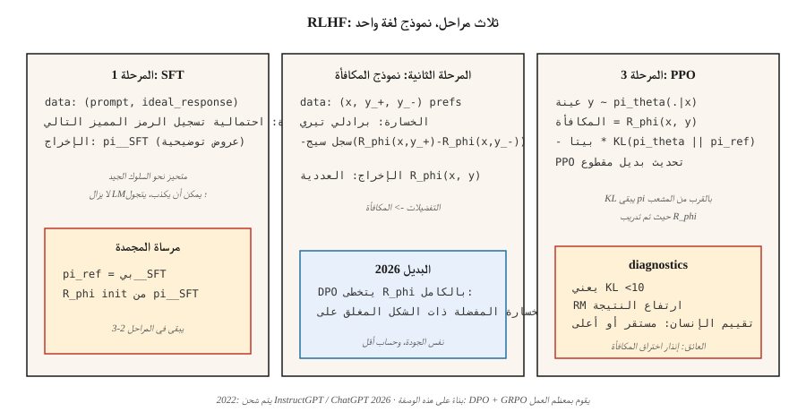

# Reward Modeling & RLHF

> لا يستطيع البشر كتابة دالة مكافأة لـ "الاستجابة المساعدة الجيدة"، ولكن يمكنهم مقارنة استجابتين واختيار الأفضل. قم بملاءمة نموذج المكافأة مع تلك المقارنات، ثم RL نموذج اللغة مقابله. كريستيانو 2017. InstructGPT 2022. الوصفة التي حولت GPT-3 إلى ChatGPT. في عام 2026، سيتم استبداله في الغالب بـ DPO — لكن النموذج العقلي يظل قائمًا.

**النوع:** بناء
** اللغات: ** بايثون
**المتطلبات الأساسية:** المرحلة 5 · 05 (المشاعر)، المرحلة 9 · 08 (PPO)
**الوقت:** ~45 دقيقة

## The Problem

لقد قمت بتدريب نموذج لغة على هدف التنبؤ بالرمز المميز التالي. ويكتب قواعد اللغة الإنجليزية. كما أنه يكذب ويتعثر ويرفض الرفض. لا يمكنك إصلاح ذلك بمزيد من التدريب المسبق - نص الويب هو المشكلة وليس العلاج.

تريد *مكافأة عددية* تقول "الإجابة أ أفضل من الإجابة ب للتعليمات X." إن كتابة وظيفة المكافأة يدويًا أمر مستحيل. "المساعدة" ليست تعبيرًا مغلقًا على الرموز المميزة. لكن يمكن للبشر مقارنة مخرجين وتحديد التفضيل. وهذا أمر رخيص للجمع على نطاق واسع.

RLHF (Christiano et al. 2017; Ouyang et al. 2022) يحول التفضيلات إلى نموذج مكافأة، ثم يقوم بتحسين LM عبر PPO مقابل تلك المكافأة. في ثلاث خطوات: SFT → RM → PPO. إنها الوصفة التي شحنت ChatGPT وClaude وGemini وكل الآخرين المتوافقين مع LLM في 2023-2025.

في عام 2026، تم استبدال الخطوة PPO في الغالب بـ DPO (المرحلة 10 · 08) لأنها أرخص وجيدة تقريبًا لضبط المحاذاة. لكن قطعة *نموذج المكافأة* لا تزال تكمن وراء كل عينة من أفضل ما في N، وكل RL من مكافآت يمكن التحقق منها pipe، وكل نموذج تفكير يستخدم نموذج مكافأة العملية. افهم RLHF وستفهم مجموعة المحاذاة بأكملها.

## The Concept



**المرحلة 1: الضبط الدقيق تحت الإشراف (SFT).** ابدأ من نموذج أساسي تم تدريبه مسبقًا. صقل العروض التوضيحية المكتوبة بواسطة الإنسان للسلوك المستهدف (الاستجابات التي تتبع التعليمات، والردود المفيدة، وما إلى ذلك). النتيجة: نموذج `π_SFT` *متحيز نحو السلوك الجيد* ولكن لا يزال لديه مساحة عمل غير محدودة.

**المرحلة الثانية: التدريب على نموذج المكافأة.**

- اجمع أزواجًا من الاستجابات `(y_+, y_-)` للمطالبات `x`، التي صنفها البشر على أنها "y_+ مفضلة على y_-."
- تدريب نموذج المكافأة `R_φ(x, y)` لتعيين درجات أعلى لـ `y_+`.
- الخسارة: **الثنائية اللوجستية بين برادلي وتيري**:

  `L(φ) = -E[ log σ(R_φ(x, y_+) - R_φ(x, y_-)) ]`

  σ هو السيني. يشير الاختلاف في المكافأة إلى احتمالات التفضيل. BT هو المعيار منذ عام 1952 (برادلي تيري) وهو الخيار السائد في RLHF الحديث.

- `R_φ` تتم تهيئته عادةً من النموذج SFT مع وجود رأس عددي في الأعلى. نفس العمود الفقري للمحولات. طبقة خطية واحدة تنتج المكافأة.

**المرحلة 3: PPO ضد RM مع KL ركلة جزاء.**

- تهيئة السياسة القابلة للتدريب `π_θ` من `π_SFT`. احتفظ بـ *مرجع* مجمّد `π_ref = π_SFT`.
- المكافأة في نهاية الرد `y`:

  `r_total(x, y) = R_φ(x, y) - β · KL(π_θ(·|x) || π_ref(·|x))`

  تمنع العقوبة KL `π_θ` من الانجراف بشكل تعسفي من `π_SFT` — إنها *منظم*، وليست منطقة ثقة صعبة. `β` عادةً `0.01`-`0.05`.
- قم بتشغيل PPO (الدرس 08) بهذه المكافأة. يتم حساب المزايا على المسار على مستوى الرمز المميز، لكن RM يسجل الاستجابة الكاملة فقط.

**لماذا KL؟** بدونها، PPO سيجد بسعادة استراتيجيات اختراق المكافآت - تم تدريب RM فقط على عمليات الإكمال أثناء التوزيع. قد تحصل الاستجابة خارج التوزيع على درجات أعلى من أي استجابة مكتوبة بواسطة الإنسان. يحافظ KL على `π_θ` بالقرب من المشعب حيث تم تدريب RM. إنه المقبض الوحيد الأكثر أهمية في RLHF.

**الحالة 2026:**

- **DPO** (رافايلوف 2023): ينهار الجبر ذو الشكل المغلق المرحلة 2+3 إلى خسارة واحدة خاضعة للإشراف على بيانات التفضيل. لا RM، لا PPO. نفس الجودة في معايير المحاذاة لجزء صغير من الحساب. تمت تغطيته في المرحلة 10 · 08.
- **GRPO** (DeepSeek 2024–2025): PPO مع خط أساس نسبي للمجموعة بدلاً من الناقد، مكافأة من *المدقق* (تشغيل التعليمات البرمجية / مطابقة الإجابات الرياضية) بدلاً من RM المُدرب بشريًا. المهيمنة على نماذج الاستدلال. تمت تغطيته في المرحلة 9 · 12.
- **نماذج مكافأة العملية (PRMs):** نقاط الحلول الجزئية (كل خطوة من خطوات الاستدلال)، المستخدمة في كلا المتغيرين RLHF وGRPO للاستدلال.
- **الدستورية AI / RLAIF:** استخدم الانحياز LLM لتوليد التفضيلات بدلاً من البشر. يقيس ميزانية التفضيل.

## Build It

يستخدم هذا الدرس "مطالبات" و"استجابات" اصطناعية صغيرة يتم تمثيلها على شكل سلاسل. RM عبارة عن مسجل خطي فوق تمثيل حقيبة الرموز المميزة. لا يوجد LLM حقيقي — الشكل * للخط pip مهم، وليس المقياس. انظر `code/main.py`.

### Step 1: synthetic preference data

```python
PROMPTS = ["help me", "answer me", "explain this"]
GOOD_WORDS = {"clear", "specific", "kind", "thorough"}
BAD_WORDS = {"vague", "rude", "wrong", "short"}

def make_pair(rng):
    x = rng.choice(PROMPTS)
    y_good = rng.choice(list(GOOD_WORDS)) + " " + rng.choice(list(GOOD_WORDS))
    y_bad = rng.choice(list(BAD_WORDS)) + " " + rng.choice(list(BAD_WORDS))
    return (x, y_good, y_bad)
```

في الواقع RLHF يتم استبدال هذا بواضعي علامات بشريين. الشكل — `(prompt, preferred_response, rejected_response)` — متطابق.

### Step 2: Bradley-Terry reward model

النتيجة الخطية: `R(x, y) = w · bag(y)`. تدريب لتقليل فقدان السجل الزوجي BT:

```python
def rm_train_step(w, x, y_pos, y_neg, lr):
    r_pos = dot(w, bag(y_pos))
    r_neg = dot(w, bag(y_neg))
    p = sigmoid(r_pos - r_neg)
    for tok, cnt in bag(y_pos).items():
        w[tok] += lr * (1 - p) * cnt
    for tok, cnt in bag(y_neg).items():
        w[tok] -= lr * (1 - p) * cnt
```

بعد بضع مئات من التحديثات، يقوم `w` بتعيين أوزان إيجابية لرموز الكلمات الجيدة وأوزان سلبية للكلمات السيئة.

### Step 3: PPO-like policy on top of RM

تنتج سياسة الألعاب الخاصة بنا رمزًا واحدًا من المفردات. نحن نسجل الرمز المميز تحت RM، ونحسب `log π_θ(token | prompt)`، ونضيف عقوبة KL إلى المرجع، ونطبق البديل المقطوع PPO.

```python
def rlhf_step(theta, ref, w, prompt, rng, eps=0.2, beta=0.1, lr=0.05):
    logits_theta = policy_logits(theta, prompt)
    probs = softmax(logits_theta)
    token = sample(probs, rng)
    logits_ref = policy_logits(ref, prompt)
    probs_ref = softmax(logits_ref)
    reward = dot(w, bag([token])) - beta * kl(probs, probs_ref)
    # ppo-style update on theta, treating reward as the return
    ...
```

### Step 4: monitor the KL

المسار يعني `KL(π_θ || π_ref)` كل تحديث. إذا زحفت إلى ما بعد `~5-10`، فقد انحرفت السياسة بعيدًا عن `π_SFT` — أو انخفاض `β` آخذ في الارتفاع أو بدء اختراق المكافآت. هذا هو التشخيص الأعلى في الواقع RLHF.

### Step 5: the production recipe with TRL

بمجرد أن تفهم اللعبة pipeline، إليك نفس الحلقة التي يكتبها مستخدم المكتبة الحقيقي. Hugging Face [TRL](https://huggingface.co/docs/trl) is the reference implementation — `RewardTrainer` for Stage 2 and `PPOTrainer` (with a KL-to-reference built in) للمرحلة الثالثة.

```python
# Stage 2: reward model from pairwise preferences
from trl import RewardTrainer, RewardConfig
from transformers import AutoModelForSequenceClassification, AutoTokenizer

tok = AutoTokenizer.from_pretrained("meta-llama/Llama-3.1-8B-Instruct")
rm = AutoModelForSequenceClassification.from_pretrained(
    "meta-llama/Llama-3.1-8B-Instruct", num_labels=1
)

# dataset rows: {"prompt", "chosen", "rejected"} — Bradley-Terry format
trainer = RewardTrainer(
    model=rm,
    tokenizer=tok,
    train_dataset=preference_data,
    args=RewardConfig(output_dir="./rm", num_train_epochs=1, learning_rate=1e-5),
)
trainer.train()
```

```python
# Stage 3: PPO against the RM with KL penalty to the SFT reference
from trl import PPOTrainer, PPOConfig, AutoModelForCausalLMWithValueHead

policy = AutoModelForCausalLMWithValueHead.from_pretrained("./sft-checkpoint")
ref    = AutoModelForCausalLMWithValueHead.from_pretrained("./sft-checkpoint")  # frozen

ppo = PPOTrainer(
    config=PPOConfig(learning_rate=1.41e-5, batch_size=64, init_kl_coef=0.05,
                     target_kl=6.0, adap_kl_ctrl=True),
    model=policy, ref_model=ref, tokenizer=tok,
)

for batch in dataloader:
    responses = ppo.generate(batch["query_ids"], max_new_tokens=128)
    rewards   = rm(torch.cat([batch["query_ids"], responses], dim=-1)).logits[:, 0]
    stats     = ppo.step(batch["query_ids"], responses, rewards)
    # stats includes: mean_kl, clip_frac, value_loss — the three PPO diagnostics
```

ثلاثة أشياء تفعلها المكتبة من أجلك. `adap_kl_ctrl=True` ينفذ جدول β التكيفي: إذا تمت ملاحظة KL يتجاوز `target_kl`، فإن β يتضاعف؛ إذا كان أقل من النصف، β نصفين. تم تجميد النموذج المرجعي وفقًا للاتفاقية — يجب ألا تقوم بمشاركة المعلمات عن طريق الخطأ مع `policy`. ويعيش رأس القيمة على نفس العمود الفقري للسياسة (`AutoModelForCausalLMWithValueHead` يعلق رأسًا عدديًا MLP)، ولهذا السبب TRL يُبلغ `policy/kl` و `value/loss` بشكل منفصل.

## Pitfalls

- ** الإفراط في التحسين / اختراق المكافآت. ** RM غير كامل؛ `π_θ` يعثر على عمليات إكمال عدائية ذات نقاط عالية ولكنها سيئة. الأعراض: تصعد المكافأة إلى أجل غير مسمى بينما يسجل تقييم الإنسان ثباتًا أو انخفاضًا. الإصلاح: توقف مبكرًا، ارفع `β`، وسع RM بيانات التدريب.
- **اختراق الطول.** غالبًا ما يكافئ مديرو العلاقات الذين تم تدريبهم على الاستجابات المفيدة ضمنًا الطول. تتعلم السياسة كيفية وضع الاستجابات. العلاج: مكافأة ذات طول طبيعي، أو RLAIF مع طول مدرك RM.
- **صغير جدًا RM.** يجب أن يكون RM كبيرًا مثل البوليصة على الأقل. لا يمكن لـ RM الصغير أن يسجل مخرجات السياسة بأمانة.
- **KL ضبط.** منخفض جدًا β → الانجراف ومكافأة القرصنة. سياسة β → مرتفعة للغاية بالكاد تتغير. الحيلة القياسية هي *تكيفية* β تستهدف KL ثابتًا في كل خطوة.
- **ضوضاء البيانات المفضلة.** ~30% من التسميات البشرية مزعجة أو غامضة. قم بالمعايرة عن طريق تدريب RM على البيانات التي تمت تصفيتها بالاتفاق أو استخدام درجة الحرارة على BT.
- **مشاكل خارج السياسة.** PPO البيانات خارج السياسة قليلاً بعد الفترة الأولى. مراقبة جزء المقطع كما في الدرس 08.

## Use It

RLHF في عام 2026 ذو طبقات:

| طبقة | الهدف | الطريقة |
|-------|--------|--------|
| التعليمات التالية، المساعدة، عدم الضرر | محاذاة | DPO (المرحلة 10 · 08) يفضل على RLHF-PPO. |
| صحة الاستدلال (الرياضيات، الكود) | القدرة | GRPO مع مكافأة المتحقق (المرحلة 9 · 12). |
| مهام متعددة الخطوات طويلة الأفق | وكيل | PPO / GRPO مع نماذج مكافأة العملية على الخطوات. |
| سلوك الأمان/الرفض | السلامة | RLHF-PPO بسلامة منفصلة RM، أو دستورية AI. |
| أفضل ما في N عند الاستدلال | محاذاة سريعة | استخدم RM في وقت فك التشفير؛ لا حاجة للتدريب على السياسات. |
| مكافأة التقطير | حساب الاستدلال | قم بتدريب "رأس مكافأة" صغير فوق LM مجمد. |

RLHF كانت *الطريقة* في 2022-2024. في عام 2026، تكون محاذاة الإنتاج pipخطوط DPO-الأولى، PPO-فقط للخطوات RM المكثفة أو الحرجة للسلامة.

## Ship It

حفظ باسم `outputs/skill-rlhf-architect.md`:

```markdown
---
name: rlhf-architect
description: Design an RLHF / DPO / GRPO alignment pipeline for a language model, including RM, KL, and data strategy.
version: 1.0.0
phase: 9
lesson: 9
tags: [rl, rlhf, alignment, llm]
---

Given a base LM, a target behavior (alignment / reasoning / refusal / agent), and a preference or verifier budget, output:

1. Stage. SFT? RM? DPO? GRPO? With justification.
2. Preference or verifier source. Humans, AI feedback, rule-based, unit-test-pass, or reward distillation.
3. KL strategy. Fixed β, adaptive β, or DPO (implicit KL).
4. Diagnostics. Mean KL, reward stability, over-optimization guard (holdout human eval).
5. Safety gate. Red-team set, refusal rate, safety RM separate from helpfulness RM.

Refuse to ship RLHF-PPO without a KL monitor. Refuse to use an RM smaller than the target policy. Refuse length-only rewards. Flag any pipeline that does not hold back a blind human-eval set as lacking over-optimization protection.
```

## Exercises

1. **سهل.** قم بتدريب نموذج مكافأة برادلي-تيري في `code/main.py` على 500 زوج من التفضيلات الاصطناعية. قم بقياس الدقة الزوجية على 100 زوج معلق. يجب أن تتجاوز 90%.
2. **متوسطة.** قم بتشغيل الحلقة PPO-RLHF باستخدام `β ∈ {0.0, 0.1, 1.0}`. لكل قطعة، RM النتيجة مقابل KL-للإشارة إلى التحديثات. الذي يدير مكافأة الإختراق؟
3. **صعب.** تنفيذ DPO (خسارة احتمالية التفضيل في النموذج المغلق) على نفس بيانات التفضيل ومقارنتها بالخط RLHF-PPO pipeline في الحساب المستخدم والنتيجة النهائية RM التي تم تحقيقها.

## Key Terms

| مصطلح | ماذا يقول الناس | ماذا يعني في الواقع |
|------|-|--------------------------------------|
| RLHF | "محاذاة RL" | ثلاث مراحل SFT + RM + PPO pipeline (كريستيانو 2017، أويانغ 2022). |
| نموذج المكافأة (RM) | "شبكة التهديف" | تتناسب الدالة العددية المستفادة مع التفضيلات الزوجية عبر برادلي تيري. |
| برادلي تيري | "الخسارة اللوجستية الزوجية" | `P(y_+ ≻ y_-) = σ(R(y_+) - R(y_-))`; الهدف RM القياسي. |
| KL ضربة جزاء | "كن بالقرب من المرجع" | `β · KL(π_θ || π_ref)` في المكافأة؛ منظم مكافحة القرصنة والمكافأة. |
| مكافأة القرصنة | "قانون جودهارت" | السياسة تستغل RM العيوب؛ الأعراض: مكافأة تصل، تقييم الإنسان شقة. |
| RLAIF | "AI-التفضيلات المُسمّاة" | RLHF حيث تأتي المسميات من LM آخر بدلاً من البشر. |
| PRM | "نموذج مكافأة العملية" | يسجل خطوات التفكير الجزئي؛ تستخدم في الاستدلال pipالخطوط. |
| دستوري AI | "المنهج الأنثروبي" | AI-التفضيلات التي تم إنشاؤها تسترشد بقواعد واضحة. |

## Further Reading

- [Christiano et al. (2017). Deep Reinforcement Learning from Human Preferences](https://arxiv.org/abs/1706.03741) — the paper that started RLHF.
- [Ouyang et al. (2022). InstructGPT — تدريب نماذج اللغة على اتباع التعليمات مع التعليقات البشرية](https://arxiv.org/abs/2203.02155) — الوصفة وراء ChatGPT.
- [Stiennon et al. (2020). Learning to summarize with human feedback](https://arxiv.org/abs/2009.01325) — earlier RLHF for summarization.
- [Rafailov et al. (2023). تحسين التفضيل المباشر](https://arxiv.org/abs/2305.18290) — DPO؛ ما بعد RLHF الافتراضي في عام 2026.
- [Bai et al. (2022). Constitutional AI: Harmlessness from AI Feedback]( — https and self-critique loop.
- [Anthropic RLHF paper (Bai et al. 2022). تدريب مساعد مفيد وغير ضار](https://arxiv.org/abs/2204.05862) — ورقة HH.
- [Hugging Face library](https://huggingface.co/docs/trl) — production `RewardTrainer` and `PPOTrainer`. Read the trainer source for the adaptive-KL and value-head details.
- [Hugging — Illustrating Reinforcement Learning from Human Feedback](https://huggingface.co/blog/rlhf) by Lambert, Castricato, von Werra, Havrilla — the canonical walk-through of the three-stage pipelineeline with diagrams.
- [von Werra et al. (2020). TRL: التعلم المعزز للمحولات](https://githubhub.com/huggingface/trl) — المكتبة؛ `examples/` تحتوي على نصوص RLHF شاملة لـ Llama وMistral وQwen.
- [ساتون وبارتو (2018). الفصل. 17.4 — تصميم إشارات المكافأة](http://incompleteideas.net/book/RLbook2020.pdf) — عرض فرضية المكافأة؛ شرط أساسي للتفكير في اختراق المكافأة.
