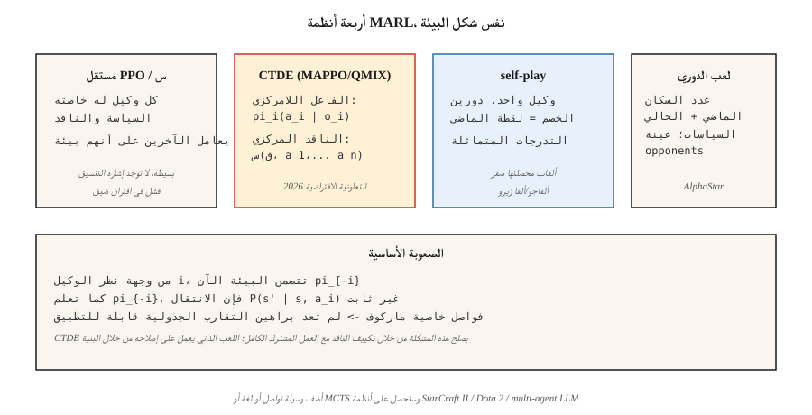

# Multi-Agent RL

> يفترض الوكيل الفردي RL أن البيئة ثابتة. ضع وكيلين للتعلم في نفس العالم وسينتهي هذا الافتراض: كل وكيل هو جزء من بيئة الآخر، وكلاهما يتغير. الوكيل المتعدد RL هو مجموعة من الحيل لتقارب التعلم make عندما لم يعد افتراض ماركوف قائمًا.

**النوع:** بناء
** اللغات: ** بايثون
** المتطلبات الأساسية: ** المرحلة 9 · 04 (Q-learning)، المرحلة 9 · 06 (REINFORCE)، المرحلة 9 · 07 (ممثل-ناقد)
**الوقت:** ~45 دقيقة

## The Problem

إن تعلم الروبوت للتنقل في الغرفة يمثل مشكلة ذات وكيل واحد RL. فريق كرة القدم ليس كذلك. معارضو AlphaStar و StarCraft ليسوا كذلك. سوق وكلاء العطاءات ليس كذلك. سيارتان تتفاوضان على توقف رباعي الاتجاهات ليس كذلك. مشاكل العالم الحقيقي ليست كذلك.

في كل بيئة متعددة الوكلاء، من وجهة نظر أي وكيل، فإن الوكلاء الآخرين *يشكلون* جزءًا من البيئة. وعندما يتعلمون ويغيرون سلوكهم، تصبح البيئة غير ثابتة. خاصية ماركوف - "الحالة التالية تعتمد فقط على الحالة الحالية وإجراءاتي" - يتم انتهاكها لأن الحالة التالية تعتمد أيضًا على ما اختاره العملاء *الآخرون*، وسياساتهم هي أهداف متحركة.

يؤدي هذا إلى كسر براهين التقارب الجدولية (يفترض ضمان Q-learning وجود بيئة ثابتة). إنه يكسر السذاجة العميقة RL أيضًا: يطارد العملاء بعضهم البعض في حلقات، ولا يتقاربون أبدًا مع سياسة مستقرة. أنت بحاجة إلى تقنيات متعددة الوكلاء: التدريب المركزي / التنفيذ اللامركزي، خطوط الأساس المغايرة للواقع، اللعب في الدوري، اللعب الذاتي.

تطبيقات 2026: أسراب الروبوتات، وتوجيه حركة المرور، وأساطيل المركبات ذاتية القيادة، ومحاكيات السوق، وأنظمة LLM متعددة الوكلاء (المرحلة 16)، وأي لعبة بها أكثر من لاعب ذكي.

## The Concept



**الشكلية: لعبة ماركوف.** تعميم MDP: حالات `S`، إجراء مشترك `a = (a_1, …, a_n)`، انتقال `P(s' | s, a)`، ومكافآت لكل وكيل `R_i(s, a, s')`. يقوم كل وكيل `i` بتعظيم عائده بموجب سياسته الخاصة `π_i`. إذا كانت المكافآت متطابقة، فهي **تعاونية بالكامل**. إذا كان المجموع صفرًا، فهو **تعارض**. وإذا كان مختلطًا، فهو **مجموع عام**.

**التحديات الأساسية:**

- **عدم الثبات.** `P(s' | s, a_i)` من عرض الوكيل `i` يعتمد على `π_{-i}`، الذي يتغير.
- **تخصيص الائتمان.** مع المكافأة المشتركة، من هو الوكيل الذي تسبب في ذلك؟
- **تنسيق الاستكشاف.** يجب على الوكلاء استكشاف الاستراتيجيات التكميلية، وليس استكشاف نفس الحالة بشكل متكرر.
- **قابلية التوسع.** تنمو مساحة العمل المشترك بشكل كبير في `n`.
- **قابلية الملاحظة الجزئية.** يرى كل وكيل فقط ملاحظته الخاصة؛ الدولة العالمية مخفية.

**أربعة أنظمة مهيمنة:**

**1. تعلم Q المستقل / مستقل PPO (IQL، IPPO).** يتعلم كل وكيل سؤاله أو سياسته الخاصة، ويعامل الآخرين كجزء من البيئة. بسيطة، وفي بعض الأحيان تنجح (خصوصًا مع تجربة إعادة التشغيل التي تعمل كخدعة تجانس لنمذجة الوكيل). التقارب النظري: لا يوجد. من الناحية العملية: جيد للمهام غير المترابطة، وسيئ للمهام المترابطة بإحكام.

**2. التدريب المركزي، التنفيذ اللامركزي (CTDE).** النموذج الحديث الأكثر شيوعًا. كل وكيل لديه *سياسة* `π_i` خاصة به والتي تتطلب المراقبة المحلية `o_i` — التنفيذ اللامركزي القياسي عند النشر. أثناء *التدريب*، يحدد الناقد المركزي `Q(s, a_1, …, a_n)` الحالة العالمية الكاملة والعمل المشترك. أمثلة:
- **MADDPG** (لوي وآخرون 2017): DDPG مع ناقد مركزي لكل وكيل.
- **COMA** (Foerster et al. 2017): خط أساس مخالف للواقع — اسأل "ما هي المكافأة التي كنت سأحصل عليها لو اتخذت الإجراء `a'` بدلاً من ذلك؟" — يعزل مساهمتي.
- **MAPPO** / **IPPO** مع ناقد مشترك (يو وآخرون. 2022): PPO مع وظيفة قيمة مركزية. المهيمنة في عام 2026 للتعاونية MARL.
- **QMIX** (راشد وآخرون 2018): تحليل القيمة — `Q_tot(s, a) = f(Q_1(s, a_1), …, Q_n(s, a_n))` مع الخلط الرتيب.

**3. اللعب الذاتي.** نسختان من نفس الوكيل تلعبان ببعضهما البعض. سياسة الخصم *هي* سياستي من لقطة سابقة. ألفا جو / ألفا زيرو / موزيرو. OpenAI خمسة. يعمل بشكل أفضل مع الألعاب ذات المحصلة الصفرية؛ إشارة التدريب متماثلة.

**4. اللعب في الدوري.** امتداد للعب الذاتي ليشمل البيئات العامة/العدائية: احتفظ بمجموعة من السياسات الماضية والحالية، واختبر خصمًا من الدوري، وتدرب ضده. يضيف المستغلين (المتخصصين في التغلب على الأفضل حاليًا) والمستغلين الرئيسيين (المتخصصين في التغلب على المستغلين). ألفا ستار (ستار كرافت II). مطلوبة عندما تسمح اللعبة بدورات استراتيجية "حجر ورقة مقص".

**الاتصالات.** السماح للوكلاء بإرسال الرسائل المستفادة `m_i` لبعضهم البعض. يعمل في البيئات التعاونية. فورستر وآخرون. (2016) أظهر أنه يمكن تدريب التواصل المتنوع بين الوكلاء من البداية إلى النهاية. تتواصل الأنظمة متعددة الوكلاء القائمة على LLM اليوم (المرحلة 16) بشكل أساسي باللغة الطبيعية.

## Build It

يستخدم هذا الدرس GridWorld 6×6 مع وكيلين متعاونين. يبدأون في زوايا متقابلة ويجب عليهم الوصول إلى هدف مشترك. المكافأة المشتركة: `-1` لكل خطوة بينما لا يزال أي من العميلين يتحرك، `+10` عند وصولهما. انظر `code/main.py`.

### Step 1: the multi-agent env

```python
class CoopGridWorld:
    def __init__(self):
        self.size = 6
        self.goal = (5, 5)

    def reset(self):
        return ((0, 0), (5, 0))  # two agents

    def step(self, state, actions):
        a1, a2 = state
        new1 = move(a1, actions[0])
        new2 = move(a2, actions[1])
        done = (new1 == self.goal) and (new2 == self.goal)
        reward = 10.0 if done else -1.0
        return (new1, new2), reward, done
```

مساحة العمل *المشتركة* هي `|A|² = 16`. الدولة العالمية هي موقفين.

### Step 2: independent Q-learning

يدير كل وكيل جدول Q خاص به مرتبطًا بالحالة المشتركة. في كل خطوة: يقوم كلاهما باختيار إجراءات الجشع، وجمع الانتقال المشترك، ويقوم كل منهما بتحديث Q الخاص به بالمكافأة المشتركة.

```python
def independent_q(env, episodes, alpha, gamma, epsilon):
    Q1, Q2 = defaultdict(default_q), defaultdict(default_q)
    for _ in range(episodes):
        s = env.reset()
        while not done:
            a1 = epsilon_greedy(Q1, s, epsilon)
            a2 = epsilon_greedy(Q2, s, epsilon)
            s_next, r, done = env.step(s, (a1, a2))
            target1 = r + gamma * max(Q1[s_next].values())
            target2 = r + gamma * max(Q2[s_next].values())
            Q1[s][a1] += alpha * (target1 - Q1[s][a1])
            Q2[s][a2] += alpha * (target2 - Q2[s][a2])
            s = s_next
```

يعمل على هذه المهمة لأن المكافآت كثيفة ومتوافقة. فشل في المهام المقترنة بإحكام (على سبيل المثال، حيث يتعين على أحد العملاء *الانتظار* للآخر).

### Step 3: centralized Q with decomposed-value update

استخدم سؤال واحد على الإجراءات المشتركة `Q(s, a_1, a_2)`. التحديث من المكافأة المشتركة. اللامركزية في التنفيذ من خلال التهميش: `π_i(s) = argmax_{a_i} max_{a_{-i}} Q(s, a_1, a_2)`. قم بتداول مساحة العمل المشترك الأسية للحصول على رؤية عالمية *صحيحة*.

### Step 4: simple self-play (adversarial 2-agent)

نفس الوكيل، دورين. تدريب العميل "أ" ضد العميل "ب"؛ بعد `K` الحلقات، انسخ أوزان A إلى B. تدريب متماثل، تقدم ثابت. وصفة AlphaZero في صورة مصغرة.

## Pitfalls

- **إعادة اللعب غير الثابتة.** تعد تجربة إعادة اللعب مع عملاء مستقلين أسوأ من تجربة وكيل واحد لأن التحولات القديمة تم إنشاؤها بواسطة خصوم عفا عليهم الزمن الآن. الإصلاح: إعادة التسمية أو الوزن حسب الحداثة.
- **غموض في تخصيص الرصيد.** مكافأة مشتركة بعد حلقة طويلة؛ لا توجد طريقة واضحة لتحديد الوكيل الذي ساهم. تم الإصلاح: خطوط الأساس المغايرة للواقع (COMA)، أو تشكيل المكافأة لكل وكيل.
- ** انحراف / مطاردة السياسة. ** تتغير أفضل استجابة لكل وكيل مع تحديث كل منهما. الإصلاح: الناقد المركزي، معدلات التعلم البطيئة، أو التجميد واحدًا تلو الآخر.
- **مكافأة القرصنة عبر التنسيق.** يعثر الوكلاء على عمليات استغلال منسقة لم يتوقعها المصمم. وكلاء المزاد يتقاربون لتقديم عرض صفر. الإصلاح: تصميم المكافآت بعناية، والقيود السلوكية.
- **تكرار الاستكشاف.** يستكشف كلا العميلين نفس أزواج إجراءات الحالة. الإصلاح: مكافآت الإنتروبيا لكل وكيل، أو تكييف الأدوار.
- **دورات الدوري.** يمكن أن يعلق اللعب الذاتي الخالص في دورة الهيمنة. الإصلاح: اللعب في الدوري مع خصوم متنوعين.
- **انفجار العينة.** `n` الوكلاء × فضاء الدولة × الإجراءات المشتركة. تقريبي مع تقريب الوظيفة؛ مساحات العمل المقسمة (رأس مخرج سياسة واحد لكل وكيل).

## Use It

خريطة التطبيق 2026 MARL:

| المجال | الطريقة | ملاحظات |
|--------|--------|-------|
| الملاحة التعاونية / التلاعب | MAPPO / QMIX | CTDE؛ الناقد المشترك + الجهات الفاعلة اللامركزية. |
| ألعاب ثنائية اللاعبين (شطرنج، جو، بوكر) | اللعب الذاتي مع MCTS (AlphaZero) | مجموع صفر؛ تدريب متماثل. |
| لعبة معقدة متعددة اللاعبين (Dota، StarCraft) | لعب الدوري + التقليد التدريبي | OpenAI خمسة، ألفا ستار. |
| أساطيل المركبات ذاتية القيادة | CTDE MAPPO / PPO مع الاهتمام | عمليات جزئية؛ أحجام الفريق المتغيرة. |
| أسواق المزادات | لعبة التوازن النظري + RL | متوسط ​​المجال RL عندما `n` → ∞. |
| LLM أنظمة متعددة الوكلاء (المرحلة 16) | التواصل باللغة الطبيعية + تكييف الأدوار | RL حلقة في طبقة تخطيط الوكيل. |

في عام 2026، أكبر منطقة نمو لـ MARL تعتمد على LLM: حشود من وكلاء نماذج اللغة الذين يتفاوضون ويناقشون ويبنون البرامج. يظهر RL كتحسين التفضيل على مخرجات *مستوى المسار*، وليس على مستوى الرمز المميز (المرحلة 16 · 03).

## Ship It

حفظ باسم `outputs/skill-marl-architect.md`:

```markdown
---
name: marl-architect
description: Pick the right multi-agent RL regime (IPPO, CTDE, self-play, league) for a given task.
version: 1.0.0
phase: 9
lesson: 10
tags: [rl, multi-agent, marl, self-play]
---

Given a task with `n` agents, output:

1. Regime classification. Cooperative / adversarial / general-sum. Justify.
2. Algorithm. IPPO / MAPPO / QMIX / self-play / league. Reason tied to coupling tightness and reward structure.
3. Information access. Centralized training (what global info goes to the critic)? Decentralized execution?
4. Credit assignment. Counterfactual baseline, value decomposition, or reward shaping.
5. Exploration plan. Per-agent entropy, population-based training, or league.

Refuse independent Q-learning on tightly-coupled cooperative tasks. Refuse to recommend self-play for general-sum with cycle risks. Flag any MARL pipeline without a fixed-opponent eval (cherry-picked self-play numbers are common).
```

## Exercises

1. **سهل.** قم بتدريب نظام Q-Learning المستقل على شبكة GridWorld التعاونية المكونة من وكيلين. كم عدد الحلقات حتى متوسط ​​العائد> 0؟ رسم منحنى التعلم المشترك.
2. **متوسطة.** أضف مهمة "تنسيق": يتم الوصول إلى الهدف فقط عندما يتقدم كلا العميلين إليه في نفس المنعطف. هل ما زالت Q المستقلة تتقارب؟ ما فواصل؟
3. **صعب.** تنفيذ ناقد مركزي للتدريب بأسلوب MAPPO ومقارنة سرعة التقارب مع PPO المستقل في مهمة التنسيق.

## Key Terms

| مصطلح | ماذا يقول الناس | ماذا يعني في الواقع |
|------|-|--------------------------------------|
| لعبة ماركوف | "متعدد الوكلاء MDP" | `(S, A_1, …, A_n, P, R_1, …, R_n)`; كل وكيل له مكافأته الخاصة. |
| CTDE | "تدريب مركزي، تنفيذ لامركزي" | الناقد المشترك في وقت التدريب؛ تستخدم سياسة كل وكيل العناصر المحلية فقط. |
| IPPO | "المستقلة PPO" | يقوم كل وكيل بتشغيل PPO بشكل منفصل. خط الأساس البسيط؛ في كثير من الأحيان الاستخفاف بها. |
| MAPPO | "متعدد الوكلاء PPO" | PPO مع وظيفة قيمة مركزية مشروطة بالحالة العالمية. |
| QMIX | "تحليل القيمة الرتيبة" | `Q_tot = f_monotone(Q_1, …, Q_n)` يسمح بـ argmax اللامركزي. |
| COMA | "وكيل متعدد مضاد" | الميزة = Q ناقص Q المتوقع تهميش عملي. |
| اللعب الذاتي | "الوكيل مقابل الذات الماضية" | وكيل واحد، دورين؛ معيار للألعاب محصلتها صفر. |
| لعب الدوري | "التدريب السكاني" | قم بتخزين السياسات السابقة، وعينة من المعارضين من المجموعة؛ يتعامل مع دورات الاستراتيجية. |

## Further Reading

- [Lowe et al. (2017). Multi-Agent Actor-Critic for Mixed Cooperative-Competitive Environments (MADDPG)]( — https with a centralized critic.
- [Foerster et al. (2017). تدرجات السياسة المضادة للوكلاء المتعددين (COMA)](https://arxiv.org/abs/1705.08926) — خطوط الأساس المضادة للواقع لتعيين الائتمان.
- [Rashid et al. (2018). QMIX: Monotonic Value Function Factorisation](https://arxiv.org/abs/1803.11485) — value decomposition with monotonicity.
- [Yu et al. (2022). الفعالية المفاجئة لـ PPO في الألعاب التعاونية متعددة الوكلاء (MAPPO)](https://arxiv.org/abs/2103.01955) — PPO قوية بشكل مدهش لـ MARL.
- [Vinyals et al. (2019). Grandmaster level in StarCraft II using multi-agent reinforcement learning (AlphaStar)](https://www.nature.com/articles/s41586-019-1724-z) — league play at scale.
- [Silver et al. (2017). إتقان لعبة Go بدون معرفة بشرية (AlphaGo Zero)](https://www.nature.com/articles/nature24270) — اللعب الذاتي الخالص في الألعاب ذات المحصلة الصفرية.
- [Sutton & Barto (2018). Ch. 15 — Neuroscience & Ch. 17 — Frontiers](http://incompleteideas.net/book/RLbook2020.pdf) — includes the textbook's short treatment of multi-agent settings and the non-stationarity problem that CTDE is designed to solve.
- [Zhang, Yang & Başar (2021). التعلم المعزز متعدد الوكلاء: نظرة عامة انتقائية](https://arxiv.org/abs/1911.10635) — مسح يغطي التعاون والتنافسية والمختلطة MARL مع نتائج التقارب.
