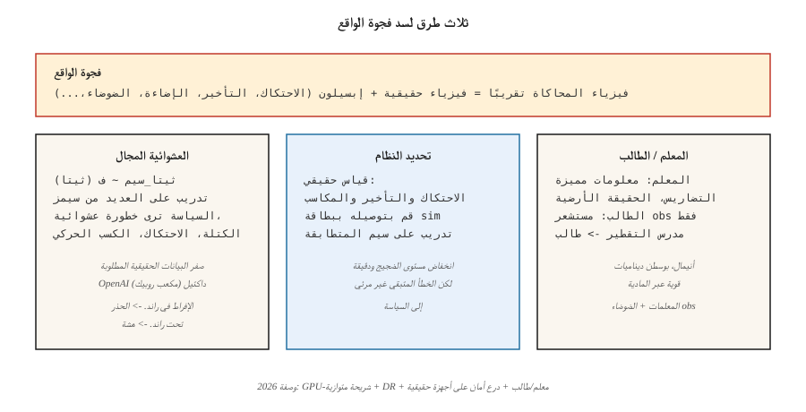

# نقل سيم إلى حقيقي
> السياسة التي تم تدريبها في جهاز محاكاة تفشل على الأجهزة هي سياسة تحفظ جهاز المحاكاة. إن التوزيع العشوائي للنطاق، وتكييف المجال، وتحديد النظام هي الأدوات الثلاثة التي تساعد make وحدات التحكم المتعلمة في عبور فجوة الواقع.
**النوع:** تعلم
** اللغات: ** بايثون
**المتطلبات الأساسية:** المرحلة 9 · 08 (PPO)، المرحلة 2 · 10 (التحيز/التباين)
**الوقت:** ~45 دقيقة
## المشكلة
يعد تدريب الروبوت الحقيقي أمرًا بطيئًا وخطيرًا ومكلفًا. يحتاج الشخص ذو القدمين إلى ملايين الحلقات التدريبية لتعلم المشي؛ دراجة حقيقية ذات قدمين تسقط حتى لو كسرت الأجهزة. تمنحك المحاكاة عمليات إعادة تعيين غير محدودة، وإمكانية تكرار نتائج حتمية، وبيئات متوازية، وعدم حدوث أضرار مادية.
لكن أجهزة المحاكاة خاطئة. تتمتع المحامل بقدرة احتكاك أكبر من موديلات MuJoCo. تحتوي الكاميرات على تشويه العدسة الذي لا يتضمنه جهاز المحاكاة. تحتوي المحركات على تأخيرات ورد فعل عكسي وتشبع يتخطاه 99٪ من نماذج sim. تعمل الرياح والغبار والإضاءة المتغيرة على تخريب سياسة مدربة على التقديم المعقم. **فجوة الواقع** — الفرق المنهجي بين توزيع شرائح sim والتوزيع الحقيقي — هي المشكلة المركزية لـ RL المنشور في مجال الروبوتات.
أنت بحاجة إلى سياسة *قوية لتحويل التوزيع من محاكاة إلى حقيقية*. ثلاثة أساليب تاريخية: جعل جهاز المحاكاة عشوائيًا (عشوائية المجال)، أو تكييف السياسة مع القليل من البيانات الحقيقية (تكييف/ضبط المجال)، أو تحديد معلمات النظام الحقيقي ومطابقتها (تحديد النظام). في عام 2026، تجمع الوصفة السائدة بين الثلاثة مع محاكاة متوازية ضخمة (Isaac Sim، Isaac Lab، Mujoco MJX on GPU).
##المفهوم

** التوزيع العشوائي للمجال (DR).** توبين وآخرون. 2017، بنغ وآخرون. 2018. أثناء التدريب، قم باختيار كل معلمة sim التي قد تختلف على الروبوت الحقيقي بشكل عشوائي: الكتل، ومعاملات الاحتكاك، ومكاسب المحرك PD، وضوضاء المستشعر، وموضع الكاميرا، والإضاءة، والأنسجة، ونماذج الاتصال. تتعلم السياسة التوزيع المشروط على "أي شريحة موجودة اليوم" وتعمم عبر النطاق الكامل. إذا كان الروبوت الحقيقي يقع ضمن نطاق التدريب، فإن السياسة تنجح.
- **الجانب العلوي:** لا حاجة إلى بيانات حقيقية. وصفة واحدة، العديد من الروبوتات.
- **الجانب السلبي:** التدريب العشوائي المفرط ينتج عنه سياسة "عالمية" ولكنها شديدة الحذر. الكثير من الضوضاء ≈ الكثير من التنظيم.
**تعريف النظام (SI).** قم بملاءمة معلمات جهاز المحاكاة مع بيانات العالم الحقيقي قبل التدريب. إذا كان بإمكانك قياس احتكاك مفصل الذراع على الروبوت الحقيقي، فقم بتوصيل ذلك إلى شريحة الاتصال. ثم قم بتدريب سياسة تتوقع تلك القيم. يحتاج إلى الوصول إلى النظام الحقيقي ولكنه يقلل من فجوة الواقع بشكل مباشر.
- **الجانب العلوي:** هدف تدريب دقيق ومنخفض الضوضاء.
- **الجانب السلبي:** خطأ النموذج المتبقي غير مرئي للسياسة؛ لا تزال التأثيرات الصغيرة غير المحددة (على سبيل المثال، النطاق الميت للمحرك) تعوق النشر.
** التكيف مع المجال. ** تدرب على sim، واضبط كمية صغيرة من البيانات الحقيقية. نكهتين:
- **Real2Sim2Real:** تعلم محاكاة متبقية `f(s, a, z) - f_sim(s, a)` باستخدام عمليات الطرح الحقيقية، وتدرب على بطاقة sim المصححة. يغلق الفجوة دون الكثير من البيانات الحقيقية.
- **تكييف الملاحظة:** تدريب سياسة تحدد obs الحقيقية → obs المشابهة لـ sim عبر مستخرج الميزات المستفادة (على سبيل المثال، GAN بكسل إلى بكسل). تبقى وحدة التحكم في sim.
**التعلم المتميز/المعلم والطالب.** ميكي وآخرون. 2022 (ANYmal رباعي الأرجل). قم بتدريب *معلم* على المحاكاة يمكنه الوصول إلى المعلومات المميزة (احتكاك الحقيقة الأرضية، ارتفاع التضاريس، IMU الانجراف). قم بتقطير *الطالب* الذي يرى فقط ملاحظات المستشعر الحقيقي. يتعلم الطالب استنتاج الميزات المميزة من التاريخ، والتي تكون قوية عبر المعلمات المادية.
**محاكاة متوازية على نطاق واسع.** 2024-2026. يقوم كل من Isaac Lab وMujoco MJX وBrax بتشغيل آلاف الروبوتات المتوازية في GPU واحد. PPO مع 4,096 إنسانًا موازيًا يجمع سنوات من الخبرة في ساعات. "فجوة الواقع" تتقلص مع اتساع نطاق توزيع التدريب؛ يصبح DR حرًا تقريبًا عندما يكون لكل من تلك البيئات الـ 4,096 معلمات عشوائية مختلفة.
**وصفة العالم الحقيقي 2026 (مثال للمشي على أربع:**)
1. شريحة متوازية بشكل كبير مع الجاذبية العشوائية للمجال، والاحتكاك، والمكاسب الحركية، والحمولة.
2. سياسة المعلم مدربة بمعلومات مميزة (خريطة التضاريس، وسرعة الجسم، والحقيقة الأرضية).
3. سياسة الطالب مستخرجة من المعلم باستخدام استقبال الحس العميق فقط (أجهزة تشفير مفصل الساق).
4. تكييف المراقبة الاختياري عبر جهاز التشفير التلقائي على IMU الحقيقي.
5. النشر. صفر إطلاق النار على 10+ البيئات. إذا فشلت، فقم بإجراء دقائق من الضبط الدقيق في العالم الحقيقي باستخدام PPO المقيد بالسلامة.
## بنائها
رمز هذا الدرس عبارة عن عرض توضيحي صغير للتوزيع العشوائي للمجال على GridWorld مع انتقالات *صاخبة*. نحن ندرب سياسة تواجه احتمالات الانزلاق العشوائية في "sim" ونقيمها على "حقيقية" بمستوى انزلاق لم يسبق له مثيل أثناء التدريب. يتم تعيين الشكل مباشرةً لنقل MuJoCo إلى الأجهزة.
### الخطوة 1: شريحة ذات معلمات
```python
def step(state, action, slip):
    if rng.random() < slip:
        action = random_perpendicular(action)
    ...
```

`slip` هي معلمة يكشفها المحاكي. في الروبوتات الحقيقية، يمكن أن يكون الاحتكاك، أو الكتلة، أو اكتساب الحركة، أو أي شيء يتحول بين المحاكاة والحقيقية.
### الخطوة الثانية: التدريب باستخدام DR
في بداية كل حلقة، قم بتجربة `slip ~ Uniform[0.0, 0.4]`. تدريب PPO / التعلم Q / أي شيء. افعل ذلك للعديد من الحلقات.
### الخطوة 3: تقييم النتيجة الصفرية على القسائم "الحقيقية".
التقييم على `slip ∈ {0.0, 0.1, 0.2, 0.3, 0.5, 0.7}`. الأربعة الأولى تقع ضمن دعم التدريب؛ `0.5` و`0.7` بالخارج. يجب أن تظل السياسة المُدربة على DR شبه مثالية داخل الدعم وتتدهور بشكل جيد خارجه. ستكون السياسة المدربة ذات الانزلاق الثابت هشة خارج قسيمة التدريب الخاصة بها.
### الخطوة 4: قارن بالتدريب الضيق
تدريب سياسة ثانية باستخدام `slip = 0.0` فقط. قم بالتقييم على نفس عملية المسح `slip`. من المفترض أن ترى انخفاضًا كارثيًا بمجرد الانزلاق الحقيقي> 0.
## مطبات
- **الكثير من العشوائية.** تدرب على `slip ∈ [0, 0.9]` وسياستك تتجنب المخاطرة إلى درجة أنها لا تحاول أبدًا اتباع المسار الأمثل. مطابقة التوزيع الواقعي *المتوقع*، وليس "أي شيء يمكن أن يحدث".
- **القليل جدًا من التوزيع العشوائي.** تدرب على شريحة رفيعة ولن تتمكن السياسة من التعميم على الإطلاق. استخدم المنهج التكيفي (التوزيع العشوائي للمجال التلقائي) الذي يعمل على توسيع التوزيع مع تحسن السياسة.
- **مساحة المعلمة التي تم تحديدها بشكل خاطئ.** قم باختيار الشيء الخطأ بشكل عشوائي (تدرج لون الكاميرا عندما تكون الفجوة الحقيقية هي تأخير المحرك) وDR لا يساعد. قم بتعريف الروبوت الحقيقي أولاً.
- **تسرب المعلومات المميزة.** يمكن للمعلم الذي يستخدم الحالة العالمية لاتخاذ الإجراءات، وليس فقط الملاحظات، أن ينتج طالبًا لا يستطيع اللحاق بالركب. التأكد من أن سياسة المعلم قابلة للتنفيذ من قبل الطالب بالنظر إلى تاريخ الملاحظة.
- **فشل النقل من شريحة إلى أخرى.** إذا لم تكن سياستك قوية تجاه متغير بطاقة sim الأصعب، فلن تكون قوية أيضًا في العالم الحقيقي. اختبر دائمًا متغير بطاقة sim المعلقة قبل النشر.
- **لا يوجد غلاف أمان حقيقي.** السياسة التي تعمل على شريحة sim و"تعمل بشكل حقيقي" بدون درع أمان منخفض المستوى يمكن أن تؤدي إلى تعطيل الأجهزة. أضف حدود المعدل وحدود عزم الدوران وحدود المفاصل في وحدة التحكم غير المتعلمة.
## استخدمه
مكدس 2026 من sim إلى Real:
| المجال | كومة |
|--------|------|
| حركة الأرجل (ANYmal، Spot، humanoid) | إسحاق لاب + DR + المعلم / الطالب المتميز |
| التلاعب (الأيدي البارعة، الاختيار والمكان) | إسحاق لاب + DR + DR-GAN للرؤية |
| القيادة الذاتية | CARLA / NVIDIA DRIVE Sim + DR + ضبط دقيق حقيقي |
| سباق الطائرات بدون طيار | RotorS / Flightmare + DR + التكيف عبر الإنترنت |
| التلاعب بالإصبع/اليد | OpenAI داكتيل (DR على نطاق غير مسبوق) |
| الأسلحة الصناعية | MuJoCo-Warp + SI + ضبط صغير حقيقي |
للتحكم على جميع المستويات، يكون سير العمل متسقًا: قم بتركيب شريحة sim بأفضل ما يمكنك، وقم بتوزيع ما لا يمكنك ملاءمته بشكل عشوائي، وقم بتدريب سياسات هائلة، والتقطير، وانشر باستخدام درع أمان.
## اشحنها
حفظ باسم `outputs/skill-sim2real-planner.md`:
```markdown
---
name: sim2real-planner
description: Plan a sim-to-real transfer pipeline for a given robot + task, covering DR, SI, and safety.
version: 1.0.0
phase: 9
lesson: 11
tags: [rl, sim2real, robotics, domain-randomization]
---

Given a robot platform, a task, and access to real hardware time, output:

1. Reality gap inventory. Suspected sources ranked by expected impact (contact, sensing, actuation delay, vision).
2. DR parameters. Exact list, ranges, distribution. Justify each range against real measurements.
3. SI steps. Which parameters to measure; measurement method.
4. Teacher/student split. What privileged info the teacher uses; what obs the student uses.
5. Safety envelope. Low-level limits, emergency stops, backup controller.

Refuse to deploy without (a) a zero-shot sim-variant test, (b) a safety shield, (c) a rollback plan. Flag any DR range wider than 3× measured real variability as likely over-randomized.
```

## تمارين
1. **سهل.** قم بتدريب وكيل Q-learning على GridWorld ذو الانزلاق الثابت (الانزلاق = 0.0). قم بالتقييم على البطاقة ∈ {0.0، 0.1، 0.3، 0.5}. مؤامرة العودة مقابل الانزلاق.
2. **متوسط.** تدريب DR أخذ عينات وكيل التعلم Q `slip ~ Uniform[0, 0.3]`. تقييم نفس الاجتياح. ما المبلغ الذي يشتريه DR بسعر القسيمة=0.5 (خارج التوزيع)؟
3. **صعب.** تنفيذ منهج دراسي: ابدأ بالزلة=0.0، وقم بتوسيع نطاق DR في كل مرة تصل فيها السياسة إلى 90% من المستوى الأمثل. قم بقياس إجمالي خطوات البيئة للوصول إلى الانزلاق = 0.3 نقطة الصفر مقابل خط الأساس الثابت DR.
## المصطلحات الرئيسية
| مصطلح | ماذا يقول الناس | ماذا يعني في الواقع |
|------|-|--------------------------------------|
| فجوة الواقع | "الفرق بين المحاكاة والحقيقية" | تحول التوزيع بين التدريب وفيزياء النشر / الاستشعار. |
| التوزيع العشوائي للمجال (DR) | "التدريب عبر شرائح عشوائية" | قم بتوزيع معلمات sim بطريقة عشوائية أثناء التدريب حتى يتم تعميم السياسة. |
| تعريف النظام (SI) | "قياس شريحة حقيقية ومناسبة" | تقدير المعلمات المادية الحقيقية؛ اضبط sim للمطابقة. |
| التكيف المجال | "ضبط البيانات الحقيقية" | ضبط صغير في العالم الحقيقي بعد التدريب على المحاكاة؛ قد يتكيف مع obs أو الديناميكيات. |
| معلومات مميزة | "الحقيقة الأساسية للمعلم" | المعلومات التي تمتلكها بطاقة sim فقط؛ يجب على الطالب استنتاج ذلك من تاريخ obs. |
| المعلم / الطالب | "التقطير المميز -> يمكن ملاحظته" | تدريب المعلم على الاختصارات؛ يتعلم الطالب التقليد بدونها. |
| __المصطلح_3__ | "العشوائية التلقائية للمجال" | المنهج الذي يوسع نطاقات DR مع تحسن السياسة. |
| Real2Sim | "سد الفجوة بالبيانات الحقيقية" | تعرف على ما تبقى من make لمحاكاة عمليات الطرح الحقيقية. |
## مزيد من القراءة
- [Tobin et al. (2017). Domain Randomization for Transferring Deep Neural Networks from Simulation to the Real World](https://arxiv.org/abs/1703.06907) — ورقة DR الأصلية (رؤية للروبوتات).
- [Peng et al. (2018). Sim-to-Real Transfer of Robotic Control with Dynamics Randomization](https://arxiv.org/abs/1710.06537) — DR للديناميكيات، الحركة الرباعية.
- [OpenAI et al. (2019). Solving Rubik's Cube with a Robot Hand](https://arxiv.org/abs/1910.07113) — داكتيل، ADR على نطاق واسع.
- [Miki et al. (2022). Learning robust perceptive locomotion for quadrupedal robots in the wild](https://www.science.org/doi/10.1126/scirobotics.abk2822) — مدرس وطالب في ANYmal.
- [Makoviychuk et al. (2021). Isaac Gym: High Performance GPU Based Physics Simulation for Robot Learning](https://arxiv.org/abs/2108.10470) — بطاقة sim المتوازية على نطاق واسع والتي تقود عمليات النشر في 2025-2026.
- [Akkaya et al. (2019). Automatic Domain Randomization](https://arxiv.org/abs/1910.07113) — ADR طريقة المنهج.
- [Sutton & Barto (2018). Ch. 8 — Planning and Learning with Tabular Methods](http://incompleteideas.net/book/RLbook2020.pdf) — إطار Dyna (استخدم نموذجًا للتخطيط + عمليات الطرح) الذي يدعم خطوط pipe الحديثة للمحاكاة إلى الواقع.
- [Zhao, Queralta & Westerlund (2020). Sim-to-Real Transfer in Deep Reinforcement Learning for Robotics: a Survey](https://arxiv.org/abs/2009.13303) — تصنيف أساليب المحاكاة إلى الحقيقية مع نتائج قياس الأداء.