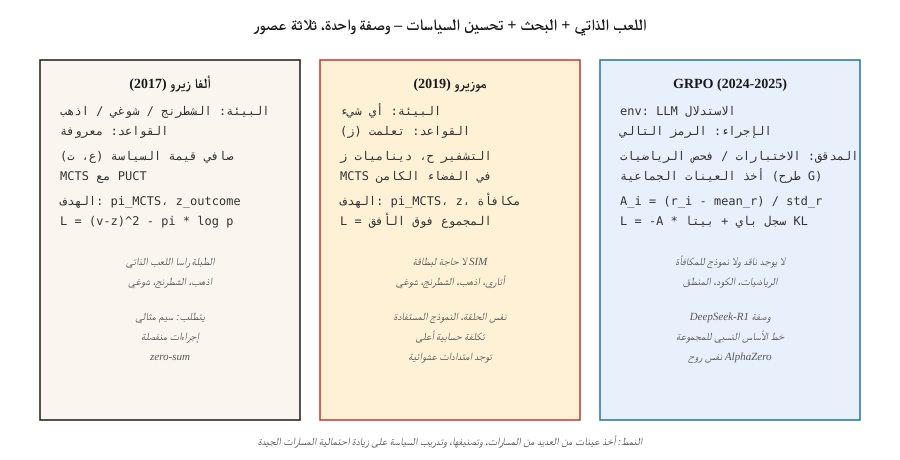

# RL for Games — AlphaZero, MuZero, and the LLM-Reasoning Era

> 1992: TD-تغلب جامون على أبطال البشر في لعبة الطاولة بـ TD النقي. 2016: فاز AlphaGo على Lee Sedol. 2017: سيطر AlphaZero على لعبة الشطرنج، وshogi، وGo from الصفر. 2024: أثبت DeepSeek-R1 نفس الوصفة، مع استبدال GRPO بـ PPO، ويعمل على التفكير. الألعاب هي المعيار الذي يدفع كل اختراق في هذه المرحلة.

**النوع:** بناء
** اللغات: ** بايثون
**المتطلبات:** المرحلة 9 · 05 (DQN)، المرحلة 9 · 08 (PPO)، المرحلة 9 · 09 (RLHF)، المرحلة 9 · 10 (MARL)
**الوقت:** ~120 دقيقة

## The Problem

الألعاب تحتوي على كل ما يريده RL. المكافأة النظيفة (الفوز/الخسارة). حلقات لا نهائية (إعادة ضبط التشغيل الذاتي). محاكاة مثالية (اللعبة *هي* المحاكاة). مساحات عمل مستمرة منفصلة أو صغيرة. هيكل متعدد الوكلاء يفرض قوة الخصومة.

والألعاب هي الطريقة التي تم بها اختبار كل اختراق رئيسي RL. TD-غامون (لعبة الطاولة، 1992). أتاري-DQN (2013). ألفا جو (2016). ألفا زيرو (2017). OpenAI خمسة (دوتا 2، 2019). ألفا ستار (ستار كرافت II، 2019). MuZero (النموذج المستفادة، 2019). AlphaTensor (ضرب المصفوفة، 2022). AlphaDev (خوارزميات الفرز، 2023). DeepSeek-R1 (الاستدلال الرياضي، 2025) - أحدث عرض لكيفية عمل تقنيات اللعبة-RL على النص.

يستعرض هذا التتويج البنى الثلاثة المميزة — AlphaZero وMuZero وGRPO — من خلال عدسة موحدة واحدة: **اللعب الذاتي + البحث + تحسين السياسات**. كل يعمم السابق؛ GRPO على وجه الخصوص هي وصفة AlphaZero المطبقة على المنطق LLM، مع الرموز المميزة كأفعال والتحقق الرياضي كإشارة الفوز.

## The Concept



**الحلقة الموحدة.**

```
while True:
    trajectory = self_play(current_policy, search)     # play game against self
    policy_target = search.improved_policy(trajectory) # search improves raw policy
    policy_net.update(policy_target, value_target)     # supervised on search output
```

**ألفا زيرو (2017).** سيلفر وآخرون. بالنظر إلى لعبة (شطرنج، شوغي، جو) ذات قواعد معروفة:

- شبكة قيمة السياسة: برج واحد `f_θ(s) → (p, v)`. `p` هو التحركات القانونية السابقة. `v` هي نتيجة اللعبة المتوقعة.
- بحث شجرة مونت كارلو (MCTS): في كل حركة، قم بتوسيع شجرة الاستمرارات المحتملة. استخدم `(p, v)` كالسابق + bootstrap. حدد nodes بواسطة UCB (PUCT): `a* = argmax Q(s, a) + c · p(a|s) · √N(s) / (1 + N(s, a))`.
- اللعب الذاتي: العب ألعاب وكيل مقابل وكيل. عند النقل `t`، يصبح توزيع الزيارات MCTS `π_t` هدف التدريب على السياسة.
- الخسارة: `L = (v - z)² - π · log p + c · ||θ||²`. `z` هي نتيجة اللعبة (+1 / 0 / -1).

المعرفة البشرية صفر. صفر الاستدلال يدويا. وصفة واحدة تتقن لعبة الشطرنج والشوغي والغو بعد بضع عشرات الملايين من ألعاب اللعب الذاتي لكل منها.

**موزيرو (2019).** شريتويزر وآخرون. يزيل شرط معرفة القواعد.

- بدلاً من البيئة الثابتة، تعلم *نموذج الديناميكيات الكامنة* `(h, g, f)`: - `h(s)`: تشفير الملاحظة إلى الحالة الكامنة. - `g(s_latent, a)`: توقع الحالة الكامنة التالية + المكافأة. - `f(s_latent)`: توقع السياسة السابقة + القيمة.
- MCTS يعمل في *المساحة الكامنة المستفادة*. نفس البحث، نفس حلقة التدريب.
- يعمل على Go، والشطرنج، وshogi *و* Atari — خوارزمية واحدة، دون معرفة بالقواعد.

**Stochastic MuZero (2022).** يضيف ديناميكيات عشوائية وفرصة nodes؛ يمتد إلى ألعاب الطاولة.

** الموسلي، غامبل موزيرو (2022-2024). ** تحسينات على كفاءة العينة والبحث الحتمي.

**GRPO (2024-2025).** وصفة DeepSeek-R1. نفس الحلقة ذات الشكل AlphaZero، المطبقة على استدلال نموذج اللغة:

- "اللعبة": أجب عن مسألة رياضية/ترميز/استدلال. "Win" = أداة التحقق (نجاح حالة الاختبار، مطابقة الإجابات الرقمية) تُرجع 1.
- السياسة: LLM. الأفعال: الرموز. الحالة: موجه + استجابة حتى الآن.
- لا يوجد منتقد (PPO-أسلوب V_φ). بدلاً من ذلك، بالنسبة لكل موجه، قم بإكمال نموذج `G` من السياسة. حساب المكافأة لكل منهما. استخدم **الميزة النسبية للمجموعة** `A_i = (r_i - mean_r) / std_r` كإشارة لتحديث نمط REINFORCE.
- KL عقوبة للسياسة المرجعية لمنع الانجراف (مثل RLHF).
- الخسارة الكاملة:

  `L_GRPO(θ) = -E_{q, {o_i}} [ (1/G) Σ_i A_i · log π_θ(o_i | q) ] + β · KL(π_θ || π_ref)`

لا نموذج مكافأة ولا ناقد ولا MCTS. يحل خط الأساس النسبي للمجموعة محل الثلاثة. يطابق أو يتجاوز جودة PPO-RLHF في معايير الاستدلال في جزء صغير من الحساب.

**وصفة R1 كاملة.** DeepSeek-R1 (DeepSeek 2025) نموذجان في ورقة واحدة:

- **R1-Zero.** ابدأ من النموذج الأساسي DeepSeek-V3. لا SFT. قم بتطبيق GRPO مباشرةً باستخدام مكونين للمكافأة: *مكافأة الدقة* (تعتمد على القاعدة - هل تم تحليل الإجابة النهائية إلى الرقم الصحيح / هل اجتاز الكود اختبارات الوحدة) و *مكافأة التنسيق* (هل قام الإكمال بتغليف سلسلة أفكاره في علامات `<think>…</think>`). على مدى آلاف الخطوات، ينمو متوسط ​​طول الاستجابة من ~100 إلى ~10000 رمز مميز وترتفع درجات قياس الأداء الرياضي إلى مستويات معاينة قريبة من o1. يتعلم النموذج التفكير من الصفر. الجانب السلبي: سلاسل أفكاره غالبًا ما تكون غير قابلة للقراءة، وتختلط اللغات، وتفتقر إلى الصقل الأسلوبي.
- **R1.** إصلاح R1-مشاكل إمكانية قراءة الصفر مع خط pipe المكون من أربع مراحل: 1. **البدء البارد SFT.** اجمع بضعة آلاف من العروض التوضيحية لـ CoT الطويلة بتنسيق نظيف. الإشراف على النموذج الأساسي عليها. وهذا يعطي نقطة بداية قابلة للقراءة. 2. ** موجه نحو التفكير GRPO.** قم بتطبيق GRPO بمكافآت الدقة + التنسيق بالإضافة إلى مكافأة *تناسق اللغة* لمنع تبديل التعليمات البرمجية. 3. **عينة الرفض + SFT الجولة 2.** عينة من مسارات التفكير RL من نقطة التفتيش RL، واحتفظ فقط بتلك التي لديها الإجابات النهائية الصحيحة وCoT القابلة للقراءة، وادمجها مع 200K تقريبًا من الأمثلة غير المنطقية SFT (الكتابة، QA، الإدراك الذاتي). قم بضبط القاعدة مرة أخرى. 4. **طيف كامل GRPO.** جولة أخرى RL تغطي كلاً من المنطق (المكافآت القائمة على القواعد) والمواءمة العامة (المكافآت القائمة على تفضيلات المساعدة/عدم الضرر).

تتطابق النتيجة مع o1 على AIME وMATH-500 عند الأوزان المفتوحة، وهي صغيرة بما يكفي للتقطير. تطلق نفس الورقة أيضًا ستة نماذج كثيفة مقطرة (Qwen-1.5B حتى Llama-70B) بواسطة SFT'ing على آثار الاستدلال R1 - لا RL عند الطالب. تقطير المعلم القوي RL يتفوق باستمرار على RL من الصفر على مقياس الطالب.

**لماذا GRPO بدلاً من PPO للاستدلال.** ثلاثة أسباب في ورقة DeepSeekMath (فبراير 2024): (1) لا توجد شبكة قيمة لتدريبها، مما يؤدي إلى انخفاض الذاكرة إلى النصف؛ (2) يتعامل خط الأساس للمجموعة بشكل طبيعي مع المكافأة المتناثرة في نهاية المسار التي تنتجها مهام التفكير؛ (3) التطبيع الفوري make مزايا قابلة للمقارنة عبر مشاكل ذات صعوبة مختلفة تمامًا، والتي لا يستطيع الناقد الوحيد لـ PPO القيام بها.

** الألعاب الخالية من البحث مقارنة بالألعاب المعتمدة على البحث. ** تشعبت الألعاب:

- *ألعاب المعلومات المثالية ذات الآفاق الطويلة* (انطلق، الشطرنج): لا تزال قائمة على البحث. يهيمن AlphaZero / MuZero.
- *LLM الاستدلال*: لا يوجد MCTS بعد في الإنتاج؛ GRPO في عمليات النشر الكاملة، الأفضل من بين N لحساب الاستدلال. تشير نماذج مكافآت العمليات (PRMs) إلى إضافة بحث على مستوى الخطوة مرة أخرى.

## Build It

الكود الموجود في `code/main.py` ينفذ **GRPO بشكل مصغر** — قاطع طريق مع مجموعات متعددة من العينات. الخوارزمية هي نفسها الموجودة في LLM؛ فقط السياسة والبيئة هي الأكثر بساطة. إنه يعلم *الخسارة* و*الميزة النسبية للمجموعة*، وهي ابتكار 2025.

### Step 1: a tiny verifier environment

```python
QUESTIONS = [
    {"prompt": "q1", "correct": 3},
    {"prompt": "q2", "correct": 1},
]

def verify(prompt_idx, answer_token):
    return 1.0 if answer_token == QUESTIONS[prompt_idx]["correct"] else 0.0
```

في الواقع GRPO يقوم المدقق بإجراء اختبارات الوحدة أو التحقق من المساواة في الرياضيات.

### Step 2: policy: softmax over K answer tokens per prompt

```python
def policy_probs(theta, p_idx):
    return softmax(theta[p_idx])
```

أي ما يعادل إخراج الطبقة النهائية لـ LLM مشروطًا بالموجه.

### Step 3: group sampling and group-relative advantage

```python
def grpo_step(theta, p_idx, G=8, beta=0.01, lr=0.1, rng=None):
    probs = policy_probs(theta, p_idx)
    samples = [sample(probs, rng) for _ in range(G)]
    rewards = [verify(p_idx, s) for s in samples]
    mean_r = sum(rewards) / G
    std_r = stddev(rewards) + 1e-8
    advs = [(r - mean_r) / std_r for r in rewards]

    for a, A in zip(samples, advs):
        grad = onehot(a) - probs
        for i in range(len(probs)):
            theta[p_idx][i] += lr * A * grad[i]
    # KL penalty: pull theta toward reference
    for i in range(len(probs)):
        theta[p_idx][i] -= beta * (theta[p_idx][i] - reference[p_idx][i])
```

الميزة النسبية للمجموعة هي خدعة DeepSeek لعام 2024. لا حاجة للناقد. "خط الأساس" هو متوسط ​​المجموعة، ويستخدم التطبيع المجموعة القياسية.

### Step 4: compare to REINFORCE baseline (value-free)

نفس الإعداد، نفس الحساب، REINFORCE البسيط. GRPO يتقارب بشكل أسرع وأكثر ثباتًا.

### Step 5: observe entropy and KL

نفس التشخيص مثل RLHF: يعني KL للإشارة، إنتروبيا السياسة، المكافأة بمرور الوقت. بمجرد استقرار هذه الأمور، يتم التدريب.

## Pitfalls

- **مكافأة القرصنة عبر ألعاب التحقق.** GRPO يرث خطر RLHF: إذا كان أداة التحقق خاطئة أو قابلة للاستغلال، فسوف يجد LLM الثغرة. إن أدوات التحقق القوية (حالات الاختبار المتعددة، والأدلة الرسمية) مهمة.
- **حجم المجموعة صغير جدًا.** يبدو تباين الخط الأساسي للمجموعة مثل `1/√G`. أقل من `G = 4`، إشارة الميزة مشوشة؛ الاختيار القياسي هو `G = 8` إلى `64`.
- **انحياز الطول.** LLM عمليات الإكمال بأطوال مختلفة لها احتمالات سجل مختلفة. قم بالتطبيع عن طريق عدد الرموز المميزة، أو استخدم log-prob على مستوى التسلسل، أو قم بالاقتطاع إلى الحد الأقصى للطول.
- **دورات لعب ذاتي خالصة.** يمكن أن يتعثر التدريب بأسلوب AlphaZero في حلقات الهيمنة في الألعاب ذات المجموع العام. يتم تخفيفها من خلال مجموعات الخصم المتنوعة (لعب الدوري، الدرس 10).
- **عدم تطابق سياسة البحث.** يقوم AlphaZero بتدريب السياسة لتقليد نتائج البحث. إذا كانت شبكة السياسة صغيرة جدًا بحيث لا تمثل توزيع البحث، فسيتوقف التدريب.
- **الحد الأدنى للحوسبة.** يحتاج MuZero / AlphaZero إلى عمليات حسابية ضخمة. غالبًا ما تستغرق عملية الاستئصال الواحدة مئات GPU-ساعات. توجد عروض توضيحية مصغرة (على سبيل المثال، AlphaZero على Connect Four) للتعلم.
- **تغطية أداة التحقق.** اختبارات الوحدة التي تنجح في حل الأخطاء تعزز الخطأ. أدوات التحقق من التصميم التي تلتقط الحالات المتطورة.

## Use It

لعبة 2026-RL المناظر الطبيعية، حسب المجال:

| المجال | الطريقة السائدة |
|--------|-----------------|
| ألعاب لوحية ثنائية اللاعبين (Go، شطرنج، شوغي) | ألفازيرو / موزيرو / كاتاجو |
| ألعاب بطاقة المعلومات غير الكاملة (البوكر) | CFR + التعلم العميق (DeepStack، Libratus، Pluribus) |
| العاب اتاري/بيكسل | موسلي / موزيرو / IMPALA-PPO |
| استراتيجية كبيرة متعددة اللاعبين (Dota، StarCraft) | PPO + اللعب الذاتي + الدوري (OpenAI خمسة، AlphaStar) |
| LLM الرياضيات/الاستدلال الرمزي | GRPO (DeepSeek-R1، Qwen-RL، النسخ المفتوحة) |
| LLM محاذاة | DPO / RLHF-PPO (ليس GRPO؛ المتحقق هو التفضيل غير القابل للتحقق) |
| الروبوتات | PPO + DR (ليست لعبة-RL، ولكنها تستخدم نفس أدوات تدرج السياسة) |
| مشاكل اندماجية | متغيرات AlphaZero (AlphaTensor، AlphaDev) |

*الوصفة* — التشغيل الذاتي، والتحسين المعزز بالبحث، وتقطير السياسات — تشمل النص والبكسل والتحكم الفعلي. GRPO هو المثال الأصغر؛ المزيد قادمون.

## Ship It

حفظ باسم `outputs/skill-game-rl-designer.md`:

```markdown
---
name: game-rl-designer
description: Design a game-RL or reasoning-RL training pipeline (AlphaZero / MuZero / GRPO) for a given domain.
version: 1.0.0
phase: 9
lesson: 12
tags: [rl, alphazero, muzero, grpo, self-play]
---

Given a target (perfect-info game / imperfect-info / Atari / LLM reasoning / combinatorial), output:

1. Environment fit. Known rules? Markov? Stochastic? Multi-agent? Informs AlphaZero vs MuZero vs GRPO.
2. Search strategy. MCTS (PUCT with learned prior), Gumbel-sampled, best-of-N, or none.
3. Self-play plan. Symmetric self-play / league / offline data / verifier-generated.
4. Target signal. Game outcome / verifier reward / preference / learned model. Include robustness plan.
5. Diagnostics. Win rate vs baseline, ELO curve, verifier pass rate, KL to reference.

Refuse AlphaZero on imperfect-info games (route to CFR). Refuse GRPO without a trusted verifier. Refuse any game-RL pipeline without a fixed baseline opponent set (self-play ELO is uncalibrated otherwise).
```

## Exercises

1. **سهل.** قم بتنفيذ قاطعة الطريق GRPO في `code/main.py`. تدرب على مطلبين × 4 رموز إجابة لكل منهما. التقارب في < 1000 تحديث باستخدام `G=8`.
2. **متوسط.** قم بتوصيل PPO (مقطع) وعزز الفانيليا. قارن كفاءة العينة وتباين المكافأة بـ GRPO على نفس قاطعة الطريق.
3. **صعب.** يمتد إلى "سلسلة تفكير" بطول 2: يُصدر الوكيل رمزين مميزين ويكافئ المتحقق الزوج. قم بقياس كيفية تعامل GRPO مع تخصيص الرصيد عبر تسلسل من خطوتين. (تلميح: حساب ميزة المجموعة لكل *تسلسل كامل*، ونشرها في كلا موضعي الرمز المميز.)

## Key Terms

| مصطلح | ماذا يقول الناس | ماذا يعني في الواقع |
|------|-|--------------------------------------|
| MCTS | "البحث عن الشجرة بالشبكة المستفادة" | بحث شجرة مونت كارلو. اختيار UCB1/PUCT مع الأسبقية المستفادة `(p, v)`. |
| ألفا زيرو | "اللعب الذاتي + MCTS" | تم تدريب شبكة قيمة السياسة لتتناسب مع MCTS من الزيارات ونتائج اللعبة. |
| موزيرو | "النموذج المستفادة AlphaZero" | نفس الحلقة ولكن في الفضاء الكامن عبر الديناميكيات المستفادة. |
| GRPO | "خالية من النقد PPO" | تحسين السياسة النسبية للمجموعة؛ تعزيز مع خط الأساس لمتوسط ​​المجموعة + KL. |
| PUCT | "ألفا زيرو UCB" | `Q + c · p · √N / (1 + N_a)` — يوازن تقدير القيمة مع القيمة السابقة. |
| اللعب الذاتي | "الوكيل مقابل الذات الماضية" | معيار المجموع الصفري؛ إشارة تدريب متماثلة. |
| لعب الدوري | "اللعب الذاتي على أساس السكان" | الماضي + الحالي + المستغلون الذين تم أخذ عينات منهم كمعارضين. |
| مكافأة المتحقق | "يمكن التحقق منه RL" | تأتي المكافأة من المدقق الحتمي (اجتياز الاختبارات، ومطابقات الإجابة). |
| عملية المكافأة | "PRM" | يسجل كل خطوة من خطوات التفكير، وليس فقط الإجابة النهائية. |

## Further Reading

- [Silver et al. (2017). Mastering the game of Go without human knowledge (AlphaGo Zero)](https://www.nature.com/articles/nature24270).
- [Silver et al. (2018). خوارزمية تعلم معززة عامة تتقن لعبة الشطرنج والشوغي واللعب الذاتي (AlphaZero)](https://www.science.org/doi/10.1126/science.aar6404).
- [Schrittwieser et al. (2020). Mastering Atari, Go, chess and shogi by planning with a learned model (MuZero)](https://www.nature.com/articles/s41586-020-03051-4).
- [Vinyals et al. (2019). مستوى Grandmaster في StarCraft II (AlphaStar)](https://www.nature.com/articles/s41586-019-1724-z).
- [DeepSeek-AI (2024). DeepSeekMath: Pushing the Limits of Mathematical Reasoning in Open Language Models (GRPO)](https://arxiv.org/abs/2402.03300) — the paper that introduced GRPO and the group-relative baseline.
- [DeepSeek-AI (2025). DeepSeek-R1: تحفيز القدرة على التفكير في LLMs عبر التعلم المعزز](https://arxiv.org/abs/2501.12948) - الوصفة الكاملة المكونة من أربع مراحل R1 بالإضافة إلى الاستئصال R1-صفر.
- [Brown et al. (2019). Superhuman AI for multiplayer poker (Pluribus)]( — https + deep-learning at scale.
- [Tesauro (1995). تعلم الفرق الزمني و TD-Gammon](https://dl.acm.org/doi/10.1145/203330.203343) — الورقة التي بدأت كل شيء.
- [Hugging Face — GRPOTrainer](https://huggingface.co/docs/trl/main/en/grpo_trainer) — the production reference for applying GRPO with custom reward functions.
- [Qwen Team (2024). Qwen2.5-Math — GRPO النسخ المتماثل](https://githubhub.com/QwenLM/Qwen2.5-Math) — النسخ المتماثل المفتوح للوصفة R1 بمقاييس متعددة.
- [ساتون وبارتو (2018). الفصل. 17 - حدود التعلم المعزز](http://incompleteideas.net/book/RLbook2020.pdf) - إطار الكتاب المدرسي للعب الذاتي والبحث و"المكافأة المصممة" التي يتم إنشاء R1 بمقياس LLM.
