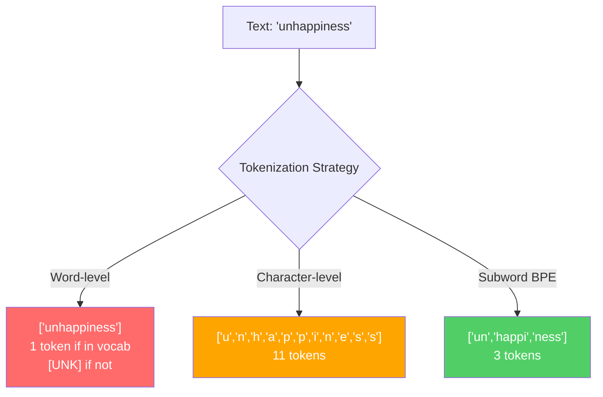
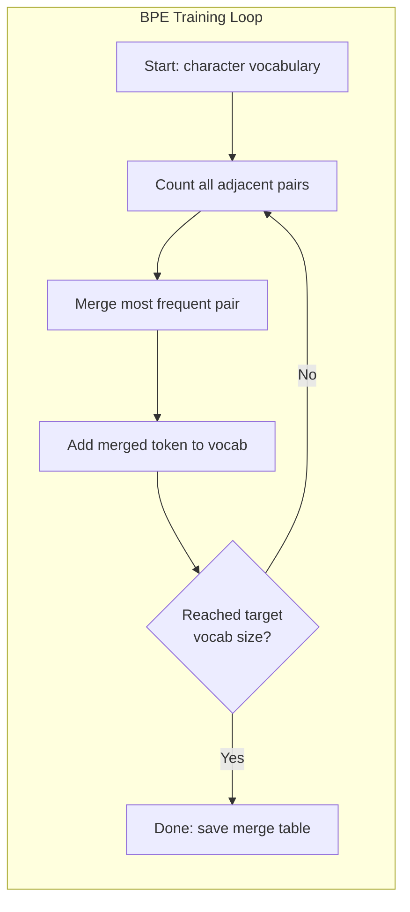
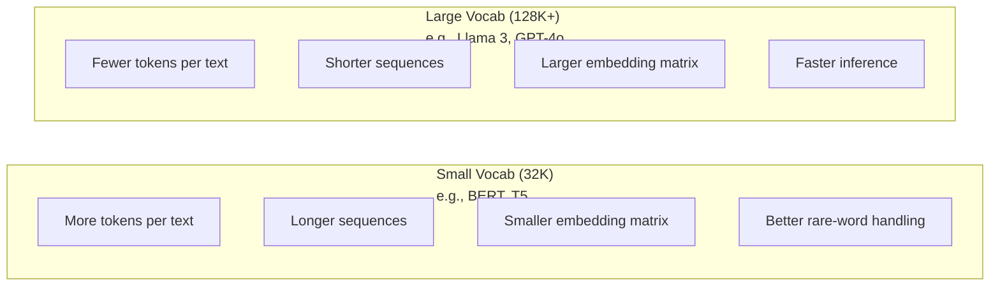

# Tokenizers: BPE, WordPiece, SentencePiece

> LLM الخاص بك لا يقرأ اللغة الإنجليزية. يقرأ الأعداد الصحيحة. يقرر المُرمز ما إذا كانت هذه الأعداد الصحيحة تحمل معنى أم تضيعه.

**النوع:** بناء
** اللغات: ** بايثون
**المتطلبات الأساسية:** المرحلة 05 (NLP أسس)
**الوقت:** ~90 دقيقة

## Learning Objectives

- تنفيذ خوارزميات الترميز BPE وWordPiece وUnigram من البداية ومقارنة استراتيجيات الدمج الخاصة بها
- اشرح كيف يؤثر حجم المفردات على كفاءة النموذج: فالصغر جدًا يخلق تسلسلات طويلة، والكبير جدًا يضيع معلمات التضمين
- تحليل عناصر الترميز عبر اللغات والتعليمات البرمجية، وتحديد مكان تعطل أدوات الترميز المحددة
- استخدم مكتبات tiktoken وجملة الجملة لترميز النص وفحص معرفات الرمز المميز الناتجة

## The Problem

LLM الخاص بك لا يقرأ اللغة الإنجليزية. ولا يقرأ أي لغة. يقرأ الأرقام.

الفجوة بين "مرحبا بالعالم!" و[15496, 11, 995, 0] هو مُرمز. يجب تحويل كل كلمة وكل مسافة وكل علامة ترقيم إلى عدد صحيح قبل أن يتمكن النموذج من معالجته. هذا التحويل ليس محايدا. فهو يدمج افتراضات في النموذج لا يمكن التراجع عنها لاحقًا.

إذا أخطأت في هذا الأمر، فإن نموذجك يهدر القدرة على تشفير الكلمات الشائعة برموز متعددة. تصبح كلمة "لسوء الحظ" أربعة رموز بدلاً من رمز واحد. تقلصت نافذة السياق التي يبلغ حجمها 128 كيلو بايت بنسبة 75% بالنسبة للنص الثقيل بكلمات متعددة المقاطع. إذا قمت بذلك بشكل صحيح، فستحتوي نافذة السياق نفسها على ضعف المعنى. غالبًا ما يرجع الاختلاف بين "هذا النموذج يتعامل جيدًا مع التعليمات البرمجية" و"هذا النموذج يخنق بايثون" إلى كيفية تدريب مُرمز الرموز المميزة.

كل API يتصل بك make إلى GPT-4 أو يتم تسعير كلود لكل رمز مميز. كل رمز مميز ينشئ نموذجك تكاليف حسابية. كلما قل عدد الرموز المطلوبة لتمثيل المخرجات، كلما كان الاستدلال الشامل أسرع. الترميز ليس معالجة مسبقة. إنها الهندسة المعمارية.

## The Concept

### Three Approaches That Failed (and One That Won)

هناك ثلاث طرق واضحة لتحويل النص إلى أرقام. اثنان منهم لا يعملان على نطاق واسع.

**الترميز على مستوى الكلمات** ينقسم إلى مسافات وعلامات ترقيم. "القطة جلست" تصبح ["The"، "cat"، "sat"]. بسيط. ولكن ماذا عن "الترميز"؟ أو "GPT-4o"؟ أو كلمة ألمانية مركبة مثل "Geschwindigkeitsbegrenzung"؟ يتطلب مستوى الكلمات مفردات ضخمة لتغطية كل كلمة في كل لغة. إذا فاتتك كلمة وستحصل على الرمز `[UNK]` المخيف - طريقة العارضة في قول "ليس لدي أي فكرة عن ماهية هذا." اللغة الإنجليزية وحدها لديها أكثر من مليون كلمة. أضف التعليمات البرمجية وعناوين URL والرموز العلمية و100 لغة أخرى وستحتاج إلى مفردات لا حصر لها.

**الترميز على مستوى الشخصية** يذهب في الاتجاه الآخر. "مرحبًا" تصبح ["h"، "e"، "l"، "l"، "o"]. المفردات صغيرة (بضع مئات من الأحرف). لا توجد رموز غير معروفة على الإطلاق. لكن التسلسلات تصبح طويلة للغاية. الجملة التي من شأنها أن تكون 10 رموز على مستوى الكلمة تصبح 50 رمزًا على مستوى الحرف. يجب أن يتعلم النموذج أن "t" و"h" و"e" معًا تعني "" - قدرة الانتباه المتزايدة على شيء يتعلمه الإنسان في سن الثالثة.

**ترميز الكلمات الفرعية** يجد المكان المناسب. الكلمات الشائعة تبقى كاملة: "ال" هي رمز واحد. الكلمات النادرة تتحلل إلى أجزاء ذات معنى: "التعاسة" تصبح ["un"، "happi"، "ness"]. تظل المفردات قابلة للإدارة (30 ألفًا إلى 128 ألف رمزًا). تبقى التسلسلات قصيرة. تختفي الرموز المميزة غير المعروفة بشكل أساسي لأنه يمكن إنشاء أي كلمة من أجزاء الكلمات الفرعية.

يستخدم كل LLM حديث ترميز الكلمات الفرعية. GPT-2، GPT-4، BERT، اللاما 3، كلود - كلهم. السؤال هو أي خوارزمية.



### BPE: Byte Pair Encoding

BPE عبارة عن خوارزمية ضغط جشعة تم إعادة توجيهها لأغراض الترميز. الفكرة بسيطة بما يكفي لتناسب بطاقة الفهرسة.

ابدأ بالأحرف الفردية. عد كل زوج مجاور في مجموعة التدريب. قم بدمج الزوج الأكثر تكرارًا في رمز مميز جديد. كرر ذلك حتى تصل إلى حجم المفردات المستهدف.

هنا BPE يعمل على مجموعة صغيرة تحتوي على الكلمات "أقل" و"الأدنى" و"الأحدث":

```
Corpus (with word frequencies):
  "lower"  x5
  "lowest" x2
  "newest" x6

Step 0 -- Start with characters:
  l o w e r       (x5)
  l o w e s t     (x2)
  n e w e s t     (x6)

Step 1 -- Count adjacent pairs:
  (e,s): 8    (s,t): 8    (l,o): 7    (o,w): 7
  (w,e): 13   (e,r): 5    (n,e): 6    ...

Step 2 -- Merge most frequent pair (w,e) -> "we":
  l o we r        (x5)
  l o we s t      (x2)
  n e we s t      (x6)

Step 3 -- Recount and merge (e,s) -> "es":
  l o we r        (x5)
  l o we s t      (x2)    <- 'es' only forms from 'e'+'s', not 'we'+'s'
  n e we s t      (x6)    <- wait, the 'e' before 'we' and 's' after 'we'

Actually tracking this precisely:
  After "we" merge, remaining pairs:
  (l,o): 7   (o,we): 7   (we,r): 5   (we,s): 8
  (s,t): 8   (n,e): 6    (e,we): 6

Step 3 -- Merge (we,s) -> "wes" or (s,t) -> "st" (tied at 8, pick first):
  Merge (we,s) -> "wes":
  l o we r        (x5)
  l o wes t       (x2)
  n e wes t       (x6)

Step 4 -- Merge (wes,t) -> "west":
  l o we r        (x5)
  l o west        (x2)
  n e west        (x6)

...continue until target vocab size reached.
```

جدول الدمج هو الرمز المميز. لترميز نص جديد، قم بتطبيق عمليات الدمج بالترتيب الذي تم تعلمها به. تحدد مجموعة التدريب عمليات الدمج الموجودة، وهذا الاختيار يشكل بشكل دائم ما يراه النموذج.



### Byte-Level BPE (GPT-2, GPT-3, GPT-4)

يعمل المعيار BPE على أحرف Unicode. يعمل مستوى البايت BPE على البايتات الأولية (0-255). يمنحك هذا مفردات أساسية تبلغ 256 مفردة بالضبط، ويتعامل مع أي لغة أو تشفير، ولا ينتج عنه أبدًا رمز مميز غير معروف.

GPT-2 قدم هذا المنهج. تغطي المفردات الأساسية كل بايت ممكن. BPE الدمج يبنى فوق ذلك. تطبق مكتبة tiktoken الخاصة بـ OpenAI مستوى البايت BPE بأحجام المفردات التالية:

- GPT-2: 50,257 رمزًا
- GPT-3.5/GPT-4: ~100,256 رمزًا (تشفير cl100k_base)
- GPT-4o: 200,019 رمزًا (ترميز o200k_base)

### WordPiece (BERT)

يبدو WordPiece مشابهًا لـ BPE ولكنه يختار عمليات الدمج بشكل مختلف. بدلاً من التكرار الأولي، فإنه يزيد من احتمالية بيانات التدريب:

```
BPE merge criterion:      count(A, B)
WordPiece merge criterion: count(AB) / (count(A) * count(B))
```

BPE يسأل: "أي زوج يظهر في أغلب الأحيان؟" WordPiece يسأل: "أي زوج يظهر معًا أكثر مما تتوقع بالصدفة؟" هذا الاختلاف الدقيق ينتج مفردات مختلفة. WordPiece يفضل عمليات الدمج حيث يكون التواجد المشترك مفاجئًا، وليس متكررًا فقط.

WordPiece يستخدم أيضًا البادئة "##" للكلمات الفرعية المستمرة:

```
"unhappiness" -> ["un", "##happi", "##ness"]
"embedding"   -> ["em", "##bed", "##ding"]
```

تخبرك البادئة "##" أن هذه القطعة تواصل رمزًا مميزًا سابقًا. BERT يستخدم WordPiece مع مفردات مكونة من 30,522 رمزًا. كل متغير BERT -- DistilBERT، رمز RoBERTa هو في الواقع BPE، لكن BERT نفسه هو WordPiece.

### SentencePiece (Llama, T5)

يعامل SentencePiece الإدخال كتدفق أولي من أحرف Unicode، بما في ذلك المسافات البيضاء. لا توجد خطوة ما قبل الترميز. لا توجد قواعد خاصة باللغة حول حدود الكلمات. هذا make لا يعرف اللغة حقًا - فهو يعمل على اللغات الصينية واليابانية والتايلاندية وغيرها من اللغات حيث لا تفصل المسافات بين الكلمات.

يدعم SentencePiece خوارزميتين:
- **وضع BPE**: نفس منطق الدمج القياسي BPE، المطبق على تسلسلات الأحرف الأولية
- **وضع Unigram**: يبدأ بمفردات كبيرة ويزيل بشكل متكرر الرموز المميزة الأقل تأثيرًا على الاحتمالية الإجمالية. عكس BPE -- تقليم بدلاً من الدمج.

تستخدم Llama 2 SentencePiece BPE مع مفردات تبلغ 32000 رمزًا. T5 يستخدم SentencePiece Unigram مع 32000 رمزًا. ملحوظة: تم تحويل Llama 3 إلى مستوى البايت القائم على tiktoken BPE رمز مميز مع 128,256 رمزًا مميزًا.

### Vocabulary Size Tradeoffs

وهذا قرار هندسي حقيقي له عواقب قابلة للقياس.



أرقام ملموسة. بالنسبة إلى 128 ألف مفردة مع تضمينات ذات 4096 بُعدًا، تكون مصفوفة التضمين وحدها 128000 × 4096 = 524 مليون معلمة. بالنسبة إلى 32 ألف مفردة، فهي 131 مليون معلمة. وهذا يمثل فرقًا قدره 400 مليون في المعلمة عن اختيار أداة الرمز المميزة وحدها.

لكن المفردات الأكبر حجمًا تضغط النص بقوة أكبر. نفس الفقرة الإنجليزية التي تأخذ 100 رمزًا بمفردات 32 ألفًا قد تحتاج إلى 70 رمزًا بمفردات 128 ألفًا. وهذا يعني انخفاض عدد التمريرات الأمامية بنسبة 30% أثناء عملية الإنشاء. بالنسبة للنموذج الذي يخدم ملايين الطلبات، يعد ذلك بمثابة تخفيض مباشر في تكلفة الحوسبة.

الاتجاه واضح: أحجام المفردات آخذة في النمو. GPT-2 مستخدم 50,257. GPT-4 استخدامات ~ 100 ألف. اللاما 3 يستخدم 128 كيلو بايت. GPT-4o يستخدم 200 ألف.

| نموذج | حجم المفردة | نوع الرمز المميز | متوسط ​​الرموز لكل كلمة إنجليزية |
|-------|-----------|----------------|-----------|
| BERT | 30,522 | WordPiece | ~1.4 |
| GPT-2 | 50,257 | مستوى البايت BPE | ~1.3 |
| اللاما 2 | 32,000 | جملة BPE | ~1.4 |
| GPT-4 | ~100,256 | مستوى البايت BPE | ~1.2 |
| اللاما 3 | 128,256 | مستوى البايت BPE (tiktoken) | ~1.1 |
| GPT-4o | 200,019 | مستوى البايت BPE | ~1.0 |

### The Multilingual Tax

إن الرموز المميزة التي يتم تدريبها بشكل أساسي على اللغة الإنجليزية تعتبر وحشية بالنسبة للغات الأخرى. يبلغ متوسط ​​النص الكوري في رمز GPT-2 2-3 رموز لكل كلمة. الصينية يمكن أن تكون أسوأ. وهذا يعني أن المستخدم الكوري لديه بالفعل نافذة سياق يبلغ حجمها نصف حجم المستخدم الإنجليزي - ويدفع نفس السعر مقابل كثافة معلومات أقل.

ولهذا السبب ضاعفت Llama 3 مفرداتها أربع مرات من 32 ألفًا إلى 128 ألفًا. المزيد من الرموز المخصصة للنصوص غير الإنجليزية يعني ضغطًا أكثر عدلاً عبر اللغات.

## Build It

### Step 1: Character-Level Tokenizer

ابدأ من الأساس. يقوم الرمز المميز على مستوى الحرف بتعيين كل حرف إلى نقطة كود Unicode الخاصة به. لا حاجة للتدريب. لا توجد رموز غير معروفة. مجرد رسم خرائط مباشر.

```python
class CharTokenizer:
    def encode(self, text):
        return [ord(c) for c in text]

    def decode(self, tokens):
        return "".join(chr(t) for t in tokens)
```

"مرحبا" تصبح [104، 101، 108، 108، 111]. كل شخصية هي رمزها الخاص. هذا هو الأساس الذي نقوم بتحسينه.

### Step 2: BPE Tokenizer from Scratch

التنفيذ الحقيقي. نحن نتدرب على البايتات الأولية (مثل GPT-2)، ونحسب الأزواج، وندمج الأكثر تكرارًا، ونسجل كل عملية دمج بالترتيب. جدول الدمج هو الرمز المميز.

```python
from collections import Counter

class BPETokenizer:
    def __init__(self):
        self.merges = {}
        self.vocab = {}

    def _get_pairs(self, tokens):
        pairs = Counter()
        for i in range(len(tokens) - 1):
            pairs[(tokens[i], tokens[i + 1])] += 1
        return pairs

    def _merge_pair(self, tokens, pair, new_token):
        merged = []
        i = 0
        while i < len(tokens):
            if i < len(tokens) - 1 and tokens[i] == pair[0] and tokens[i + 1] == pair[1]:
                merged.append(new_token)
                i += 2
            else:
                merged.append(tokens[i])
                i += 1
        return merged

    def train(self, text, num_merges):
        tokens = list(text.encode("utf-8"))
        self.vocab = {i: bytes([i]) for i in range(256)}

        for i in range(num_merges):
            pairs = self._get_pairs(tokens)
            if not pairs:
                break
            best_pair = max(pairs, key=pairs.get)
            new_token = 256 + i
            tokens = self._merge_pair(tokens, best_pair, new_token)
            self.merges[best_pair] = new_token
            self.vocab[new_token] = self.vocab[best_pair[0]] + self.vocab[best_pair[1]]

        return self

    def encode(self, text):
        tokens = list(text.encode("utf-8"))
        for pair, new_token in self.merges.items():
            tokens = self._merge_pair(tokens, pair, new_token)
        return tokens

    def decode(self, tokens):
        byte_sequence = b"".join(self.vocab[t] for t in tokens)
        return byte_sequence.decode("utf-8", errors="replace")
```

حلقة التدريب هي جوهر BPE: عد الأزواج، ودمج الفائز، ثم كرر. يؤدي كل دمج إلى تقليل إجمالي عدد الرموز المميزة. بعد جولات `num_merges`، يزداد عدد المفردات من 256 (بايت أساسي) إلى 256 + num_merges.

يطبق التشفير عمليات الدمج بالترتيب الدقيق الذي تم تعلمه به. هذا مهم. إذا أدى الدمج 1 إلى إنشاء "th" والدمج 5 إلى إنشاء "the"، فيجب أن يطبق التشفير الدمج 1 أولاً حتى يمكن تشكيل "the" من "th" + "e" في الدمج 5.

فك التشفير هو العكس: ابحث عن كل رمز مميز ID في المفردات، وقم بتسلسل البايتات، وفك التشفير إلى UTF-8.

### Step 3: Encode and Decode Roundtrip

```python
corpus = (
    "The cat sat on the mat. The cat ate the rat. "
    "The dog sat on the log. The dog ate the frog. "
    "Natural language processing is the study of how computers "
    "understand and generate human language. "
    "Tokenization is the first step in any NLP pipeline."
)

tokenizer = BPETokenizer()
tokenizer.train(corpus, num_merges=40)

test_sentences = [
    "The cat sat on the mat.",
    "Natural language processing",
    "tokenization pipeline",
    "unhappiness",
]

for sentence in test_sentences:
    encoded = tokenizer.encode(sentence)
    decoded = tokenizer.decode(encoded)
    raw_bytes = len(sentence.encode("utf-8"))
    ratio = len(encoded) / raw_bytes
    print(f"'{sentence}'")
    print(f"  Tokens: {len(encoded)} (from {raw_bytes} bytes) -- ratio: {ratio:.2f}")
    print(f"  Roundtrip: {'PASS' if decoded == sentence else 'FAIL'}")
```

تخبرك نسبة الضغط بمدى فعالية أداة الرمز المميز. تعني النسبة 0.50 أن أداة الرمز المميز ضغطت النص إلى نصف عدد الرموز المميزة مثل البايتات الأولية. أقل هو أفضل. أما بالنسبة للتدريب فالنسبة ستكون جيدة. في النص خارج التوزيع مثل "التعاسة" (الذي لا يظهر في المجموعة)، ستكون النسبة أسوأ - يعود رمز الرمز إلى التشفير على مستوى الأحرف للأنماط غير المرئية.

### Step 4: Compare with tiktoken

```python
import tiktoken

enc = tiktoken.get_encoding("cl100k_base")

texts = [
    "The cat sat on the mat.",
    "unhappiness",
    "Hello, world!",
    "def fibonacci(n): return n if n < 2 else fibonacci(n-1) + fibonacci(n-2)",
    "Geschwindigkeitsbegrenzung",
]

for text in texts:
    our_tokens = tokenizer.encode(text)
    tiktoken_tokens = enc.encode(text)
    tiktoken_pieces = [enc.decode([t]) for t in tiktoken_tokens]
    print(f"'{text}'")
    print(f"  Our BPE:   {len(our_tokens)} tokens")
    print(f"  tiktoken:  {len(tiktoken_tokens)} tokens -> {tiktoken_pieces}")
```

يستخدم tiktoken نفس الخوارزمية تمامًا ولكنه تم تدريبه على مئات الجيجابايت من النص مع 100000 عملية دمج. الخوارزمية متطابقة. الفرق هو بيانات التدريب وعدد عمليات الدمج. لا يمكن لأداة الرمز المميز التي تم تدريبها على فقرة تحتوي على 40 عملية دمج أن تتنافس مع عمليات دمج tiktoken التي تبلغ 100 ألف في مجموعة ضخمة. لكن الآلية هي نفسها.

### Step 5: Vocabulary Analysis

```python
def analyze_vocabulary(tokenizer, test_texts):
    total_tokens = 0
    total_chars = 0
    token_usage = Counter()

    for text in test_texts:
        encoded = tokenizer.encode(text)
        total_tokens += len(encoded)
        total_chars += len(text)
        for t in encoded:
            token_usage[t] += 1

    print(f"Vocabulary size: {len(tokenizer.vocab)}")
    print(f"Total tokens across all texts: {total_tokens}")
    print(f"Total characters: {total_chars}")
    print(f"Avg tokens per character: {total_tokens / total_chars:.2f}")

    print(f"\nMost used tokens:")
    for token_id, count in token_usage.most_common(10):
        token_bytes = tokenizer.vocab[token_id]
        display = token_bytes.decode("utf-8", errors="replace")
        print(f"  Token {token_id:4d}: '{display}' (used {count} times)")

    unused = [t for t in tokenizer.vocab if t not in token_usage]
    print(f"\nUnused tokens: {len(unused)} out of {len(tokenizer.vocab)}")
```

هذا يكشف عن توزيع Zipf في مفرداتك. تهيمن بعض الرموز المميزة (المسافات، "the"، "e"). نادراً ما يتم استخدام معظم الرموز المميزة. تعمل رموز الإنتاج على تحسين هذا التوزيع - تحصل الأنماط الشائعة على معرفات رمزية قصيرة، بينما تحصل الأنماط النادرة على تمثيلات أطول.

## Use It

الصفر الخاص بك BPE يعمل. انظر الآن كيف تبدو أدوات الإنتاج.

### tiktoken (OpenAI)

```python
import tiktoken

enc = tiktoken.get_encoding("cl100k_base")

text = "Tokenizers convert text to integers"
tokens = enc.encode(text)
print(f"Tokens: {tokens}")
print(f"Pieces: {[enc.decode([t]) for t in tokens]}")
print(f"Roundtrip: {enc.decode(tokens)}")
```

يتم كتابة tiktoken بالرمز Rust مع روابط Python. يقوم بتشفير ملايين الرموز في الثانية. نفس خوارزمية BPE وتنفيذ القوة الصناعية.

### Hugging Face tokenizers

```python
from tokenizers import Tokenizer
from tokenizers.models import BPE
from tokenizers.trainers import BpeTrainer
from tokenizers.pre_tokenizers import ByteLevel

tokenizer = Tokenizer(BPE())
tokenizer.pre_tokenizer = ByteLevel()

trainer = BpeTrainer(vocab_size=1000, special_tokens=["<pad>", "<eos>", "<unk>"])
tokenizer.train(["corpus.txt"], trainer)

output = tokenizer.encode("The cat sat on the mat.")
print(f"Tokens: {output.tokens}")
print(f"IDs: {output.ids}")
```

مكتبة الرموز المميزة Hugging Face موجودة أيضًا Rust تحت الغطاء. إنه يدرب BPE على مجموعة من الجيجابايت في ثوانٍ. هذا هو ما تستخدمه عند تدريب النموذج الخاص بك.

### Loading Llama's Tokenizer

```python
from transformers import AutoTokenizer

tokenizer = AutoTokenizer.from_pretrained("meta-llama/Llama-3.1-8B")

text = "Tokenizers are the unsung heroes of LLMs"
tokens = tokenizer.encode(text)
print(f"Token IDs: {tokens}")
print(f"Tokens: {tokenizer.convert_ids_to_tokens(tokens)}")
print(f"Vocab size: {tokenizer.vocab_size}")

multilingual = ["Hello world", "Hola mundo", "Bonjour le monde"]
for text in multilingual:
    ids = tokenizer.encode(text)
    print(f"'{text}' -> {len(ids)} tokens")
```

تعمل مفردات Llama 3 التي يبلغ عددها 128 ألفًا على ضغط النصوص غير الإنجليزية بشكل أفضل بكثير من مفردات GPT-2 التي يبلغ عددها 50 ألفًا. يمكنك التحقق من ذلك بنفسك - قم بتشفير نفس الجملة بلغات متعددة وحساب الرموز المميزة.

## Ship It

يُنتج هذا الدرس `outputs/prompt-tokenizer-analyzer.md` — مطالبة قابلة لإعادة الاستخدام تعمل على تحليل كفاءة الترميز لأي مجموعة من النصوص والنماذج. قم بإطعامه بعينة نصية وسيخبرك بالرمز المميز للنموذج الذي يتعامل معه بشكل أفضل.

## Exercises

1. قم بتعديل الرمز المميز BPE لطباعة المفردات في كل خطوة دمج. شاهد كيف يتحول "t" + "h" إلى "th"، ثم "th" + "e" يصبح "the". تتبع كيفية تجميع الكلمات الإنجليزية الشائعة قطعة قطعة.

2. أضف الرموز الخاصة (`<pad>`، `<eos>`، `<unk>`) إلى رمز الرمز BPE. قم بتعيين المعرفات 0 و1 و2 وقم بتحويل جميع الرموز المميزة الأخرى وفقًا لذلك. قم بتنفيذ خطوة ما قبل الترميز التي تنقسم على مسافة بيضاء قبل تشغيل BPE.

3. تنفيذ معيار الدمج WordPiece (نسبة الاحتمالية بدلاً من التكرار). قم بتدريب كل من BPE و WordPiece على نفس المجموعة بنفس عدد عمليات الدمج. قارن بين المفردات الناتجة - أي منها ينتج كلمات فرعية أكثر أهمية من الناحية اللغوية؟

4. بناء معيار كفاءة الرموز المميزة متعددة اللغات. خذ 10 جمل باللغات الإنجليزية والإسبانية والصينية والكورية والعربية. قم بترميز كل منها باستخدام tiktoken (cl100k_base) وقياس متوسط ​​الرموز المميزة لكل حرف. تحديد "ضريبة تعدد اللغات" لكل لغة.

5. قم بتدريب رمز BPE الخاص بك على مجموعة أكبر (قم بتنزيل مقالة ويكيبيديا). اضبط عدد عمليات الدمج لتحقيق نسبة ضغط تصل إلى 10% من tiktoken على نفس النص. وهذا يفرض عليك فهم العلاقة بين حجم المجموعة وعدد الدمج وجودة الضغط.

## Key Terms

| مصطلح | ماذا يقول الناس | ماذا يعني في الواقع |
|------|----------------|----------------------|
| الرمز المميز | "كلمة" | يمكن أن تكون الوحدة في مفردات النموذج حرفًا أو كلمة فرعية أو كلمة أو قطعة متعددة الكلمات |
| BPE | "بعض الأشياء المضغوطة" | تشفير زوج البايت - دمج زوج الرموز المميزة الأكثر تكرارًا بشكل متكرر حتى يتم الوصول إلى حجم المفردات المستهدف |
| WordPiece | "رمز BERT" | مثل BPE لكن عمليات الدمج تزيد من عدد نسبة الاحتمال (AB)/(count(A)*count(B)) بدلاً من التردد الأولي |
| جملة | "مكتبة الرموز المميزة" | أداة ترميز غير محددة اللغة تعمل على Unicode الخام دون ترميز مسبق، وتدعم خوارزميات BPE وUnigram |
| حجم المفردات | "كم عدد الكلمات التي يعرفها" | إجمالي عدد الرموز الفريدة: GPT-2 بها 50,257، BERT بها 30,522، Llama 3 بها 128,256 |
| الخصوبة | "ليس مصطلحًا رمزيًا" | متوسط ​​عدد الرموز لكل كلمة - يقيس كفاءة أداة الرمز المميز عبر اللغات (1.0 مثالي، 3.0 يعني أن النموذج يعمل بشكل أكثر صعوبة ثلاث مرات) |
| مستوى البايت BPE | "رمز GPT" | BPE تعمل على البايتات الأولية (0-255) بدلاً من أحرف Unicode، مما يضمن عدم وجود رموز غير معروفة لأي إدخال |
| دمج الجدول | "ملف الرمز المميز" | قائمة مرتبة لدمج الأزواج التي تم تعلمها أثناء التدريب - هذا IS الرمز المميز، والأمر مهم |
| الترميز المسبق | "الانقسام على المساحات" | القواعد المطبقة قبل ترميز الكلمات الفرعية: تقسيم المسافات البيضاء، فصل digit، التعامل مع علامات الترقيم |
| نسبة الضغط | "مدى كفاءة الرمز المميز" | الرموز المميزة التي تم إنتاجها مقسومة على بايتات الإدخال - يعني الرقم الأقل ضغطًا أفضل واستدلالًا أسرع |

## Further Reading

- [سينريش وآخرون، 2016 - "الترجمة الآلية العصبية للكلمات النادرة مع وحدات الكلمات الفرعية"](https://arxiv.org/abs/1508.07909) - الورقة التي قدمت BPE لـ NLP، وتحويل خوارزمية الضغط عام 1994 إلى أساس الترميز الحديث
- [كودو وريتشاردسون، 2018 -- "SentencePiece: أداة رمزية بسيطة ومستقلة عن اللغة للكلمات الفرعية"](https://arxiv.org/abs/1808.06226) -- ترميز لا يعرف اللغة مما جعل النماذج متعددة اللغات عملية
- [OpenAI مستودع tiktoken](https://githubhub.com/openai/tiktoken) - تنفيذ الإنتاج BPE في Rust مع روابط Python، المستخدمة بواسطة GPT-3.5/4/4o
- [Hugging Face وثائق الرموز المميزة](https://huggingface.co/docs/tokenizers) -- تدريب على الرموز المميزة على مستوى الإنتاج بأداء Rust
