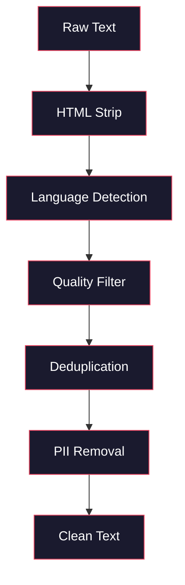
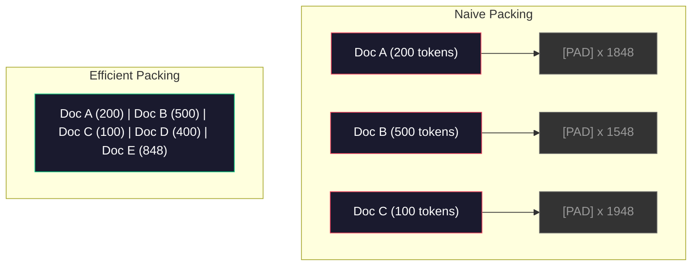

# خطوط أنابيب البيانات للتدريب المسبق
> النموذج مرآة. إنه يعكس أي بيانات تقوم بإطعامها بها. قم بإطعامها بالقمامة، فهي تعكس القمامة بطلاقة مثالية.
**النوع:** بناء
** اللغات: ** بايثون
**المتطلبات الأساسية:** المرحلة 10، الدروس 01-02 (أدوات الرموز، إنشاء أداة الرموز)
**الوقت:** ~90 دقيقة
## أهداف التعلم
- أنشئ خطًا متدفقًا للبيانات pipeline يقوم بترميز النص وتقطيعه وخلطه ودفعات تيرابايت من النص دون تحميله كله في الذاكرة
- تنفيذ عوامل تصفية جودة البيانات (إلغاء البيانات المكررة، واكتشاف اللغة، وتصفية المحتوى) المستخدمة في خطوط pipeline التدريبية المسبقة الحقيقية
- إنشاء تسلسلات تدريبية ذات طول ثابت باستخدام أقنعة الانتباه المناسبة والتعامل مع حدود المستندات
- ملف تعريف pipمعدل نقل الخط لضمان مواكبة أداة تحميل البيانات لسرعة التدريب GPU
## المشكلة
لديك رمز مميز. الآن أنت بحاجة إلى البيانات.
ليست مجموعة بيانات. ليس ملف CSV. تيرابايت من النص - تم تنظيفها وإلغاء تكرارها وتصفيتها من أجل الجودة، وتصنيفها إلى تسلسلات ذات طول ثابت، وتقديمها على دفعات عشوائية بسرعة كافية بحيث لا تنتظر مجموعة 8-GPU الخاصة بك الدفعة التالية أبدًا.
يعتقد معظم الناس أن تدريب LLM يتعلق ببنية النموذج. ليس كذلك. استخدمت Llama 3 15.6 تريليون رمز. GPT-3 استخدم 300 مليار. DeepSeek-V2 استخدم 8.1 تريليون. الهندسة المعمارية في جميع المجالات الثلاثة هي نفسها تقريبًا: كتل محولات مكدسة مع طبقات الانتباه والتغذية. الفرق في جودة المخرجات يأتي بشكل كبير من البيانات.
ورقة شينشيلا من DeepMind جعلت هذا الأمر دقيقًا. بالنسبة لميزانية حسابية معينة، توجد نسبة مثالية لمعلمات النموذج إلى الرموز المميزة للتدريب. وأظهرت شينشيلا أن معظم النماذج في عام 2022 كانت تعاني من نقص التدريب بشكل كبير، حيث كان لديها عدد كبير جدًا من المعلمات بالنسبة لكمية البيانات التي شاهدتها. تفوق نموذج المعلمة 70B الذي تم تدريبه على 1.4 تريليون رمز (Chinchilla-optimal) على نموذج 280B الذي تم تدريبه على 300 مليار رمز (Gopher).
تحدد بياناتك pipeline ما إذا كان النموذج الخاص بك يتعلم اللغة أو يتعلم الضوضاء.
##المفهوم
### من أين تأتي البيانات
يتم تدريب كل نموذج لغة كبير على مزيج من المصادر. إن التركيب الدقيق هو سر يخضع لحراسة مشددة بالنسبة لمعظم المختبرات، ولكننا نعرف ما يكفي لفهم الفئات.
| المصدر | الحجم | الجودة | يستخدم بواسطة |
|--------|------|---------|---------|
| الزحف المشترك | ~250 TB خام | منخفض (يحتاج إلى تصفية ثقيلة) | GPT-3، اللاما، النماذج الأكثر فتحًا |
| ويكيبيديا | ~20 GB | عالية | كل تخصص LLM |
| كود GitHub | ~1 TB+ | متوسط ​​(الكثير من التكرارات، الكود الميت) | ستاركودر، كود لاما، ديب سيك-كودر |
| كتب (BookCorpus، بايل) | ~100 GB | عالية | GPT-2، GPT-3، النماذج المبكرة |
| أوراق أكاديمية (arXiv، S2ORC) | ~100 GB | عالي لـ STEM | اللاما، جلاكتيكا |
| ستاك أوفر فلوو، رديت | ~100 GB | متوسطة | اللاما، الصقر |
| الويب المنسق (C4، RefinedWeb) | ~5 TB | متوسط-عالٍ (تمت تصفيته مسبقًا) | T5، فالكون |
كشفت Llama 3 عن مزيج بياناتها: ما يقرب من 50% من بيانات الويب، و25% من التعليمات البرمجية، و13% من الكتب والأبحاث الأكاديمية، و8% من بيانات الرياضيات، و4% من بيانات الويب متعددة اللغات. كان المجموع 15.6 تريليون رمز من مصادر تتجاوز 5 TB من النص الخام.
النسبة مهمة بقدر الحجم الإجمالي. الكثير من بيانات الويب ويصبح النموذج ببغاء Reddit. رمز قليل جدًا ولا يمكنه البرمجة. القليل جدًا من الرياضيات ويفشل في التفكير. يعد الحصول على هذا المزيج بشكل صحيح أحد أصعب أجزاء التدريب على LLM، ولا توجد صيغة محددة -- فهو يتطلب التجريب والتقييم.
### تنظيف البيانات
بيانات الويب الخام قذرة. يحتوي تفريغ الزحف المشترك النموذجي على:
- علامات HTML وجافا سكريبت
- الرؤوس والتذييلات وقوائم التنقل النموذجية
- الصفحات المكررة (الدقيقة وشبه المكررة)
- البريد العشوائي الناتج عن الآلة
- معلومات التعريف الشخصية (PII)
- نص منخفض الجودة (قوائم الكلمات الرئيسية، SEO البريد العشوائي)
- المحتوى غير النصي المشفر كنص
تنظيف هذا ليس اختياريا. إنه الفرق بين النموذج الذي يُنشئ فقرات متماسكة والنموذج الذي يُخرج علامات HTML ممزوجة بقوائم المنتجات.


كل خطوة تزيل فئة من الضوضاء:
**HTML تجريد:** إزالة كافة العلامات. احتفظ فقط بمحتوى النص المرئي. تقوم المكتبات مثل `trafilatura` أو `readability` باستخراج محتوى المقالة مع تجاهل التنقل والإعلانات والنموذج المعياري.
** اكتشاف اللغة: ** استخدم نموذج تعريف اللغة الخاص بـ fastText (lid.176.bin) لتصنيف كل مستند. قم بالتصفية حسب اللغات المستهدفة. من المحتمل أن الوثيقة المصنفة على أنها إنجليزية بدرجة ثقة أقل من 0.8 ليست لغة إنجليزية نظيفة.
**تصفية الجودة:** هذا هو المكان الذي يصبح فيه الأمر مثيرًا للاهتمام. يستخدم RefinedWeb (مجموعة البيانات وراء Falcon) مرشحًا يعتمد على الحيرة: قم بتدريب نموذج لغة صغير على ويكيبيديا، ثم سجل كل مستند. درجة الارتباك العالية تعني أن المستند يختلف عن ويكيبيديا - من المحتمل أن يكون بريدًا عشوائيًا أو قوائم كلمات رئيسية أو محتوى تم إنشاؤه بواسطة الآلة. تتم إزالة المستندات التي بها حيرة أعلى من الحد.
**إلغاء البيانات المكررة:** خطوة التنظيف الأكثر تأثيرًا. يحتوي Common Crawl على أعداد هائلة من الصفحات المكررة - إخلاء المسؤولية القانونية وإشعارات ملفات تعريف الارتباط وشروط الخدمة. التدريب على التكرارات يضيع الحوسبة ويمكن أن يتسبب في حفظ النموذج وتجديد فقرات معينة حرفيًا.
**PII إزالة:** الأسماء وعناوين البريد الإلكتروني وأرقام الهواتف وأرقام الضمان الاجتماعي. الكشف المستند إلى Regex لنماذج PII وNER المنظمة للأسماء في السياق.
### إلغاء البيانات المكررة باستخدام MinHash
يعد إلغاء البيانات المكررة أمرًا سهلاً: قم بتجزئة كل مستند وإزالة التكرارات. لكن التكرارات القريبة هي المشكلة الحقيقية. نسختان من نفس المقالة الإخبارية مع وجود إعلانات مختلفة قليلاً حولها تعتبر نسخًا مكررة تقريبًا. المحتوى متطابق بنسبة 95%، لكنهما يختلفان من حيث البايت.
MinHash + التجزئة الحساسة للمنطقة (LSH) تحل هذه المشكلة بكفاءة.


الفكرة:
1. **Shingling:** قم بتحويل كل مستند إلى مجموعة من n-grams (على سبيل المثال، 5-grams من الكلمات أو الأحرف). "الثعلب البني السريع" مع القوباء المنطقية المكونة من 3 كلمات يصبح {"الثعلب البني السريع"، "الثعلب البني السريع"".
2. **MinHash:** بالنسبة لمجموعة الألواح الخشبية لكل مستند، قم بحساب قيم التجزئة k. كل قيمة تجزئة هي الحد الأدنى من التجزئة عبر جميع القوباء المنطقية ضمن وظيفة تجزئة مختلفة. يؤدي هذا إلى إنشاء "توقيع" بحجم ثابت يقارب تشابه Jaccard بين أي وثيقتين.
3. **LSH:** قم بتجميع المستندات في مجموعات بناءً على نطاقات توقيع MinHash الخاصة بها. تعتبر المستندات الموجودة في نفس المجموعة بمثابة نسخ مكررة تقريبًا. يؤدي هذا إلى تجنب مقارنة كل زوج - فأنت فقط تقارن بين المرشحين.
4. **التحقق:** لكل زوج مرشح، قم بحساب التشابه الدقيق لـ Jaccard. قم بإزالة نسخة واحدة إذا تجاوز التشابه الحد الأدنى (عادةً 0.8).
أبلغ فريق Llama عن إزالة ما يقرب من 38% من بيانات الويب الخاصة بهم من خلال إلغاء البيانات المكررة. وهذا ليس عددا صغيرا. أكثر من ثلث الزحف المشترك عبارة عن محتوى مكرر أو شبه مكرر.
### التعبئة التسلسلية
يتوقع النموذج الخاص بك تسلسلات إدخال ذات طول ثابت. المستندات الخاصة بك ذات طول متغير. بعضها 50 رمزًا. بعضها 50000 رمز.
النهج الساذج: قم بتوسيع كل مستند إلى الحد الأقصى لطول التسلسل. يؤدي هذا إلى إهدار حسابات هائلة على رموز الحشو التي لا تساهم بأي شيء في التعلم.
النهج الأفضل: تجميع مستندات متعددة في تسلسل واحد، مفصولة برموز نهاية التسلسل. قد يحتوي تسلسل الرمز المميز 2048 على ثلاثة مستندات قصيرة متسلسلة مع الرموز المميزة [EOS] فيما بينها.


يجب ضبط قناع الانتباه بشكل صحيح. يجب ألا تتوافق الرموز المميزة من المستند "أ" مع الرموز المميزة من المستند "ب" ضمن نفس التسلسل المعبأ. وهذا يتطلب قناع انتباه كتلة قطري.
يتم اقتطاع المستندات الطويلة أو تقسيمها إلى أجزاء عند حدود التسلسل. نقطة الانقسام مهمة: تقسيم منتصف الجملة يجبر النموذج على رؤية أفكار غير مكتملة. تقوم بعض خطوط pipe بمحاذاة الانقسامات مع حدود الفقرة أو الجملة عندما يكون ذلك ممكنًا.
### قانون تحجيم شينشيلا
بالنسبة لميزانية الحوسبة الثابتة C (المقاسة بـ FLOPs)، يتبع حجم النموذج الأمثل N وحجم مجموعة البيانات D ما يلي:
```
N_opt ~ C^0.5
D_opt ~ C^0.5
```

من الناحية العملية، هذا يعني أنه يجب عليك قياس حجم النموذج وحجم مجموعة البيانات بالتساوي تقريبًا. يحتاج النموذج الذي يحتوي على 10x معلمات أكثر إلى 10x رموز تدريب إضافية تقريبًا للوصول إلى نفس الخسارة.
| نموذج | المعلمات | رموز التدريب | شينشيلا الأمثل؟ |
|-------|----------|----------------|---|
| GPT-3 | 175 ب | 300ب | لا (غير مدرب 3-4x) |
| شينشيلا | 70ب | 1.4 طن | نعم (حسب التصميم) |
| اللاما 2 | 70ب | 2 ت | الإفراط في التدريب (عمدا) |
| اللاما 3 | 70ب | 15 طن | الإفراط في التدريب بشكل كبير |
اللاما 3 ينتهك عمدا قانون شينشيلا. وجدت ميتا أن الإفراط في التدريب على المزيد من البيانات - بما يتجاوز نسبة الحوسبة المثالية - ينتج نماذج أفضل للاستدلال. يتم دفع تكلفة التدريب الإضافية مرة واحدة، ولكن النموذج الأصغر أرخص في الخدمة إلى الأبد. يُطلق على هذا أحيانًا اسم نهج القياس "الاستدلالي الأمثل"، وقد أصبح معيار الصناعة منذ عام 2024.
## بنائها
### الخطوة 1: تنظيف النص
إزالة HTML، وتطبيع المسافة البيضاء، وإزالة المحتوى غير النصي. سنستخدم نصًا ذا ملكية عامة (مشروع جوتنبرج) باعتباره مجموعتنا الصغيرة.
```python
import re

def clean_text(text):
    text = re.sub(r"<[^>]+>", "", text)
    text = re.sub(r"http\S+", "", text)
    text = re.sub(r"[^\x20-\x7E\n]", "", text)
    text = re.sub(r"\n{3,}", "\n\n", text)
    text = re.sub(r" {2,}", " ", text)
    return text.strip()

def quality_filter(text, min_words=50, max_ratio_caps=0.3, max_ratio_special=0.1):
    words = text.split()
    if len(words) < min_words:
        return False
    caps_ratio = sum(1 for w in words if w.isupper()) / len(words)
    if caps_ratio > max_ratio_caps:
        return False
    special_chars = sum(1 for c in text if not c.isalnum() and not c.isspace())
    if special_chars / max(len(text), 1) > max_ratio_special:
        return False
    return True
```

يلتقط مرشح الجودة SEO البريد العشوائي (ALL CAPS)، والتشويش الناتج عن الآلة (نسبة الأحرف الخاصة العالية)، والصفحات الروتينية (قصيرة جدًا). تعمل عمليات الفحص الثلاثة هذه وحدها على إزالة كمية مذهلة من البيانات المهملة من عمليات زحف الويب.
### الخطوة 2: إلغاء البيانات المكررة في MinHash
تنفيذ MinHash من الصفر. لا توجد مكتبات خارجية مطلوبة -- فقط `hashlib`.
```python
import hashlib
from collections import defaultdict

def get_shingles(text, k=5):
    words = text.lower().split()
    if len(words) < k:
        return set()
    return {" ".join(words[i:i+k]) for i in range(len(words) - k + 1)}

def minhash_signature(shingles, num_hashes=128):
    signature = []
    for i in range(num_hashes):
        min_hash = float("inf")
        for shingle in shingles:
            h = int(hashlib.sha256(f"{i}:{shingle}".encode()).hexdigest(), 16)
            min_hash = min(min_hash, h)
        signature.append(min_hash)
    return signature

def lsh_buckets(signature, bands=16):
    rows_per_band = len(signature) // bands
    buckets = []
    for b in range(bands):
        start = b * rows_per_band
        band_data = tuple(signature[start:start + rows_per_band])
        bucket_hash = hashlib.md5(str(band_data).encode()).hexdigest()
        buckets.append((b, bucket_hash))
    return buckets

def deduplicate(documents, threshold=0.8, num_hashes=128, bands=16):
    signatures = []
    shingle_sets = []
    for doc in documents:
        shingles = get_shingles(doc)
        shingle_sets.append(shingles)
        signatures.append(minhash_signature(shingles, num_hashes))

    bucket_map = defaultdict(list)
    for doc_idx, sig in enumerate(signatures):
        for band_id, bucket_hash in lsh_buckets(sig, bands):
            bucket_map[(band_id, bucket_hash)].append(doc_idx)

    duplicate_pairs = set()
    for bucket_docs in bucket_map.values():
        if len(bucket_docs) < 2:
            continue
        for i in range(len(bucket_docs)):
            for j in range(i + 1, len(bucket_docs)):
                duplicate_pairs.add((bucket_docs[i], bucket_docs[j]))

    removed = set()
    for i, j in duplicate_pairs:
        if i in removed or j in removed:
            continue
        s1, s2 = shingle_sets[i], shingle_sets[j]
        if not s1 or not s2:
            continue
        jaccard = len(s1 & s2) / len(s1 | s2)
        if jaccard >= threshold:
            removed.add(j)

    return [doc for idx, doc in enumerate(documents) if idx not in removed], len(removed)
```

تتحكم المعلمات `num_hashes=128` و`bands=16` في مقايضة استدعاء الدقة. المزيد من التجزئة تعطي تقديرات تشابه أكثر دقة. يؤدي المزيد من النطاقات إلى زيادة الاستدعاء (التقاط المزيد من التكرارات) على حساب المزيد من النتائج الإيجابية الخاطئة. تعمل هذه القيم بشكل جيد مع نص الويب النموذجي.
### الخطوة 3: ترميز وحزم التسلسلات
خذ النص النظيف المكرر، وقم بترميزه، ثم قم بتجميعه في تسلسلات ذات طول ثابت للتدريب.
```python
def tokenize_corpus(documents, tokenizer):
    all_tokens = []
    for doc in documents:
        tokens = tokenizer.encode(doc)
        all_tokens.extend(tokens)
        all_tokens.append(tokenizer.eos_id)
    return all_tokens

def pack_sequences(token_ids, seq_length, pad_id=0):
    sequences = []
    attention_masks = []
    for i in range(0, len(token_ids), seq_length):
        seq = token_ids[i:i + seq_length]
        mask = [1] * len(seq)
        if len(seq) < seq_length:
            pad_count = seq_length - len(seq)
            seq = seq + [pad_id] * pad_count
            mask = mask + [0] * pad_count
        sequences.append(seq)
        attention_masks.append(mask)
    return sequences, attention_masks
```

### الخطوة 4: أداة تحميل البيانات للتدريب
إنتاج دفعات عشوائية من التسلسلات المعبأة. هذا ما تستهلكه حلقة التدريب.
```python
import random

class PreTrainingDataLoader:
    def __init__(self, sequences, attention_masks, batch_size, shuffle=True):
        self.sequences = sequences
        self.attention_masks = attention_masks
        self.batch_size = batch_size
        self.shuffle = shuffle

    def __len__(self):
        return (len(self.sequences) + self.batch_size - 1) // self.batch_size

    def __iter__(self):
        indices = list(range(len(self.sequences)))
        if self.shuffle:
            random.shuffle(indices)
        for start in range(0, len(indices), self.batch_size):
            batch_idx = indices[start:start + self.batch_size]
            batch_seqs = [self.sequences[i] for i in batch_idx]
            batch_masks = [self.attention_masks[i] for i in batch_idx]
            yield batch_seqs, batch_masks
```

### الخطوة 5: إحصائيات مجموعة البيانات
قم بحساب الأرقام المهمة: إجمالي الرموز المميزة، والرموز الفريدة، ونسبة الضغط، وتوزيع طول المستند.
```python
from collections import Counter

def compute_statistics(documents, token_ids, sequences, tokenizer_vocab_size):
    total_chars = sum(len(d) for d in documents)
    total_tokens = len(token_ids)
    unique_tokens = len(set(token_ids))
    compression_ratio = total_chars / total_tokens

    doc_lengths = [len(d.split()) for d in documents]
    avg_doc_length = sum(doc_lengths) / max(len(doc_lengths), 1)
    max_doc_length = max(doc_lengths) if doc_lengths else 0
    min_doc_length = min(doc_lengths) if doc_lengths else 0

    token_counts = Counter(token_ids)
    top_tokens = token_counts.most_common(10)

    non_pad_tokens = sum(sum(1 for t in seq if t != 0) for seq in sequences)
    total_positions = sum(len(seq) for seq in sequences)
    utilization = non_pad_tokens / max(total_positions, 1)

    stats = {
        "total_documents": len(documents),
        "total_characters": total_chars,
        "total_tokens": total_tokens,
        "unique_tokens": unique_tokens,
        "vocab_utilization": unique_tokens / tokenizer_vocab_size,
        "compression_ratio": compression_ratio,
        "avg_doc_length_words": avg_doc_length,
        "max_doc_length_words": max_doc_length,
        "min_doc_length_words": min_doc_length,
        "num_sequences": len(sequences),
        "sequence_utilization": utilization,
        "top_10_tokens": top_tokens,
    }
    return stats
```

تخبرك نسبة الضغط بمدى كفاءة برنامج الرمز المميز في هذه المجموعة. عادةً ما يتم ضغط النص الإنجليزي إلى حوالي 3-4 أحرف لكل رمز مميز. إذا رأيت 1.5 حرفًا لكل رمز مميز، فهذا يعني أن برنامج الرمز المميز الخاص بك ينقسم بقوة شديدة. إذا رأيت 8+، فقد تعلمت عمليات دمج خاصة بالمجال.
يخبرك استخدام التسلسل بكمية التسلسلات المعبأة التي تمثل بيانات حقيقية مقابل الحشو. أقل من 90% يعني أن التعبئة الخاصة بك غير فعالة - فأنت تهدر الحوسبة على رموز الحشو.
## استخدمه
### قارن مع مجموعات بيانات HuggingFace
قم بتحميل نفس المجموعة من خلال مكتبة مجموعات بيانات HuggingFace وقارن سرعة pipeline.
```python
from datasets import load_dataset
from transformers import AutoTokenizer

ds = load_dataset("wikitext", "wikitext-2-raw-v1", split="train")
tokenizer = AutoTokenizer.from_pretrained("meta-llama/Meta-Llama-3-8B")

import time

start = time.time()
tokenized = ds.map(
    lambda x: tokenizer(x["text"], truncation=True, max_length=2048),
    batched=True,
    num_proc=4,
)
hf_time = time.time() - start
total_tokens = sum(len(t) for t in tokenized["input_ids"])
print(f"HuggingFace: {total_tokens:,} tokens in {hf_time:.2f}s ({total_tokens/hf_time:,.0f} tokens/sec)")
```

يستخدم HuggingFace pipeline رموز Rust أسفل الغطاء والمعالجة المتوازية عبر 4 مراكز. سيكون خط Python pipeline الخاص بك أبطأ بمقدار 10-50x. هذه الفجوة هي السبب وراء استخدام فرق الإنتاج للرموز المميزة المجمعة. الخوارزمية هي نفسها. لغة التنفيذ هي الفرق.
## اشحنها
يقدم هذا الدرس مطالبة بالتحقق من جودة البيانات وتصحيح الأخطاء في خطوط LLM التدريبية pipelines. انظر `outputs/prompt-data-quality-checker.md`.
## تمارين
1. **سهل:** أضف اكتشاف اللغة إلى سطر التنظيف pipe باستخدام إرشادي بسيط (تحليل مجموعة الأحرف). قم بالتصفية إلى المستندات الإنجليزية فقط وقياس عدد المستندات التي تمت إزالتها.
2. **متوسط:** قم بتنفيذ عملية إلغاء البيانات المكررة بشكل دقيق باستخدام تجزئة SHA-256 إلى جانب عملية MinHash القريبة من إلغاء البيانات المكررة. قارن عدد التكرارات التي تم التقاطها بواسطة كل طريقة في مجموعة البيانات المحذوفة من الويب.
3. **صعب:** أنشئ مرشحًا للجودة يعتمد على الحيرة. تدريب نموذج لغة بيجرام صغير على نص ويكيبيديا، وتسجيل كل مستند حسب درجة الحيرة، وإزالة الـ 20% السفلية. قارن جودة مخرجات النموذج عند التدريب على البيانات المصفاة مقابل البيانات غير المصفاة.
## المصطلحات الرئيسية
| مصطلح | ماذا يقول الناس | ماذا يعني في الواقع |
|------|----------------|----------------------|
| الزحف المشترك | "الإنترنت" | مؤسسة غير ربحية تزحف إلى الويب شهريًا -- ~250 تيرابايت خام، نقطة البداية لمعظم بيانات التدريب LLM |
| مينهاش | "بعض حيل التجزئة" | تقنية لتقدير تشابه Jaccard بين المجموعات باستخدام التوقيعات ذات الحجم الثابت - تتيح اكتشاف التكرارات القريبة على نطاق واسع |
| __المصطلح_1__ | "التجزئة الحساسة للمنطقة المحلية" | طريقة لتجميع العناصر المتشابهة في نفس المجموعة - تقلل المقارنات الزوجية من O(n^2) إلى شبه الخطية |
| التعبئة التسلسلية | "وثائق متسلسلة" | تركيب مستندات متعددة في تسلسلات ذات طول ثابت باستخدام أقنعة الانتباه المناسبة - يزيل هدر الحشو |
| تحجيم شينشيلا | "التدريب على المزيد من البيانات" | بالنسبة لميزانية حوسبة ثابتة، يتطلب الأداء الأمثل توسيع حجم النموذج ورموز التدريب بشكل متساوٍ تقريبًا |
| الخصوبة | "الرموز لكل كلمة" | متوسط ​​عدد الرموز لكل كلمة - 1.3 للغة الإنجليزية في GPT-4، أعلى للنصوص غير اللاتينية |
| خلط البيانات | "اختيار بيانات التدريب" | نسبة الكود مقابل النص مقابل الرياضيات مقابل البيانات متعددة اللغات - لا توجد صيغة، وتتطلب التجريب |
| مرشح الحيرة | "نقاط الجودة" | استخدم نموذج لغة صغير لتسجيل المستندات - الحيرة العالية تعني أن النص يختلف عن البيانات المرجعية النظيفة |
| إلغاء البيانات المكررة | "إزالة النسخ" | التخلص من المستندات الدقيقة وشبه المكررة - عادةً ما يؤدي إلى إزالة 30-40% من بيانات الويب الأولية |
| قناع الانتباه | "ما هي الرموز التي يجب النظر إليها" | قناع ثنائي يمنع الانتباه عبر حدود المستند في تسلسلات محزومة |
## مزيد من القراءة
- [Hoffmann et al., 2022 -- Training Compute-Optimal Large Language Models (Chinchilla)](https://arxiv.org/abs/2203.15556) -- الورقة التي غيرت طريقة تفكيرنا بشأن مقياس البيانات
- [Penedo et al., 2023 -- The RefinedWeb Dataset for Falcon LLM](https://arxiv.org/abs/2306.01116) -- كيفية تصفية الزحف المشترك إلى الجودة العالية
- [Touvron et al., 2023 -- Llama 2: Open Foundation and Fine-Tuned Chat Models](https://arxiv.org/abs/2307.09288) -- بيانات pipتفاصيل الخط الخاص بـ Llama 2
- [Lee et al., 2022 -- Deduplicating Training Data Makes Language Models Better](https://arxiv.org/abs/2107.06499) -- لماذا يعد إلغاء البيانات المكررة أكثر أهمية مما تعتقد
- [Broder, 1997 -- On the Resemblance and Containment of Documents](https://ieeexplore.ieee.org/document/666900) -- ورقة مينهاش الأصلية
- [Meta, 2024 -- Llama 3 Technical Report](https://arxiv.org/abs/2407.21783) -- 15.6T من الرموز، ونسب خلط البيانات، وتصفية pipeline