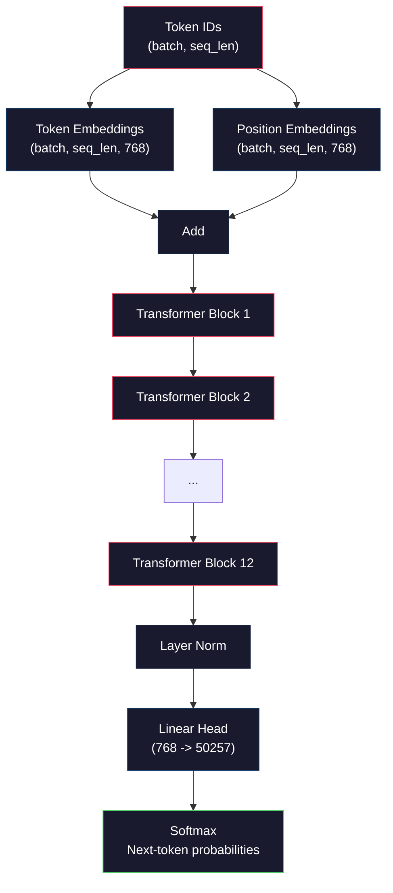
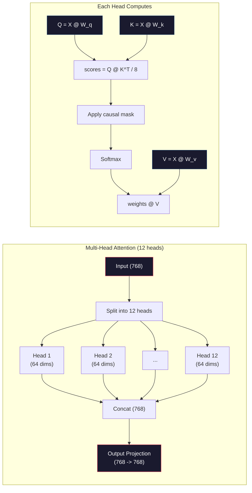
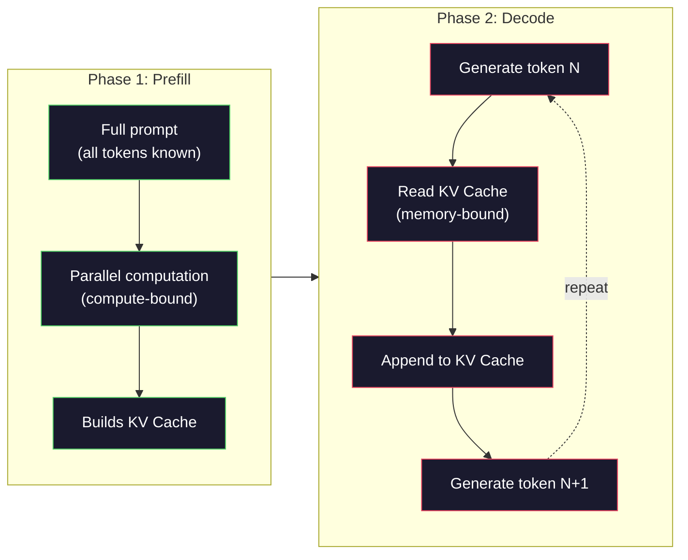

# Pre-Training a Mini GPT (124M Parameters)

> GPT-2 صغير يحتوي على 124 مليون معلمة. هذه 12 طبقة محولات، و12 رأس انتباه، و768 بُعدًا للتضمين. يمكنك تدريبه من الصفر على GPU واحد في غضون ساعات قليلة. معظم الناس لا يفعلون هذا أبدًا. يستخدمون نقاط تفتيش مدربة مسبقًا. لكن إذا لم تقم بتدريب أحدهم بنفسك، فإنك لا تفهم فعليًا ما يحدث داخل النموذج الذي تبني عليه المنتجات.

**النوع:** بناء
** اللغات: ** بايثون (مع numpy)
**المتطلبات الأساسية:** المرحلة 10، الدروس 01-03 (أدوات الرموز، إنشاء أداة الرموز، خطوط أنابيب البيانات)
**الوقت:** ~120 دقيقة

## Learning Objectives

- تنفيذ بنية GPT-2 الكاملة (124 مليون معلمة) من البداية: تضمينات الرمز المميز، والتضمينات الموضعية، وكتل المحولات، ورأس نموذج اللغة
- تدريب نموذج GPT على مجموعة نصية باستخدام التنبؤ بالرمز التالي مع فقدان الإنتروبيا المتقاطعة
- تنفيذ إنشاء نص الانحدار الذاتي مع أخذ عينات درجة الحرارة وتصفية top-k/top-p
- مراقبة منحنيات فقدان التدريب والتحقق من أن النموذج يتعلم أنماط لغة متماسكة

## The Problem

أنت تعرف ما هو المحول. لقد قرأت المخططات. يمكنك قراءة عبارة "الانتباه هو كل ما تحتاجه" ورسم مربعات بعنوان "الانتباه متعدد الرؤوس" على السبورة البيضاء.

لا يعني أي من ذلك أنك تفهم ما يحدث عندما يقوم النموذج بإنشاء نص.

يوجد 124,438,272 معلمة في GPT-2 صغير (مع ربط الوزن). تم ضبط كل واحدة منها عن طريق تشغيل حلقة تدريب: التمريرة الأمامية، الخسارة الحسابية، التمريرة الخلفية، تحديث الأوزان. اثني عشر كتل المحولات. اثنا عشر رأس انتباه لكل كتلة. مساحة التضمين 768 البعد. مفردات مكونة من 50,257 رمزًا. في كل مرة يقوم النموذج بإنشاء رمز مميز، تشارك جميع المعلمات البالغ عددها 124 مليونًا في سلسلة ضرب مصفوفة واحدة تأخذ سلسلة من معرفات الرمز المميز وتنتج توزيعًا احتماليًا على الرمز المميز التالي.

إذا لم تقم ببناء هذا بنفسك من قبل، فأنت تعمل مع صندوق أسود. يمكنك استخدام API. يمكنك ضبط. ولكن عندما يحدث خطأ ما - عندما يهلوس النموذج، عندما يكرر نفسه، عندما يرفض اتباع التعليمات - ليس لديك نموذج عقلي لـ *لماذا*.

يقوم هذا الدرس ببناء GPT-2 صغير من الصفر. ليس في PyTorch. في نومي. كل ضرب المصفوفة مرئي. يتم حساب كل تدرج بواسطة الكود الخاص بك. سترى بالضبط كيف يتضافر 124 مليون رقم للتنبؤ بالكلمة التالية.

## The Concept

### The GPT Architecture

GPT هو نموذج لغة انحدار ذاتي. "الانحدار التلقائي" يعني أنه يُنشئ رمزًا مميزًا واحدًا في كل مرة، كل منها مشروط بجميع الرموز المميزة السابقة. الهندسة المعمارية عبارة عن كومة من كتل وحدة فك ترميز المحولات.

فيما يلي الرسم البياني الحسابي الكامل من معرفات الرمز المميز إلى احتمالات الرمز المميز التالي:

1. تأتي معرفات الرمز المميز. الشكل: (batch_size, seq_len).
2. البحث عن تضمين الرمز المميز. يتم تعيين كل ID إلى متجه ذي 768 بُعدًا. الشكل: (حجم الدفعة، التسلسل، 768).
3. البحث عن تضمين الموضع. يتم تعيين كل موضع (0، 1، 2،...) إلى متجه ذي 768 بُعدًا. نفس الشكل.
4. أضف تضمينات الرمز المميز + تضمينات الموضع.
5. المرور عبر 12 قطعة محولات.
6. تطبيع الطبقة النهائية.
7. الإسقاط الخطي لحجم المفردات. الشكل: (حجم الدفعة، تسلسل_لين، حجم_الحجم).
8. Softmax للحصول على الاحتمالات.

هذا هو النموذج بأكمله. لا تلافيف. لا تكرار. مجرد عمليات التضمين والانتباه وشبكات التغذية الأمامية ومعايير الطبقة مكدسة 12 مرة.



### The Transformer Block

تتبع كل قطعة من الكتل الـ 12 نفس النمط. بنية ما قبل المعيار (GPT-2 تستخدم المعيار المسبق وليس المعيار اللاحق مثل المحول الأصلي):

1. طبقة نورم
2. الاهتمام الذاتي متعدد الرؤوس
3. الاتصال المتبقي (إضافة مدخلات مرة أخرى)
4. طبقة نورم
5. شبكة التغذية الأمامية (MLP)
6. الاتصال المتبقي (إضافة مدخلات مرة أخرى)

الاتصالات المتبقية حاسمة. بدونها، تختفي التدرجات عند وصولها إلى الكتلة 1 أثناء الانتشار العكسي. معهم، يمكن أن تتدفق التدرجات مباشرة من الخسارة إلى أي طبقة من خلال مسار "التخطي". هذا هو السبب في أنه يمكنك تكديس 12 أو 32 أو حتى 96 قطعة (يُشاع أن GPT-4 يستخدم 120 قطعة).

### Attention: The Core Mechanism

يتيح الاهتمام الذاتي لكل رمز مميز إلقاء نظرة على كل رمز مميز سابق وتحديد مقدار الاهتمام بكل رمز مميز. هنا الرياضيات.

لكل موضع رمز مميز، قم بحساب ثلاثة متجهات من الإدخال:
- **استعلام (س)**: "ما الذي أبحث عنه؟"
- **المفتاح (ك)**: "ماذا أحتوي؟"
- **القيمة (V)**: "ما هي المعلومات التي أحملها؟"

```
Q = input @ W_q    (768 -> 768)
K = input @ W_k    (768 -> 768)
V = input @ W_v    (768 -> 768)

attention_scores = Q @ K^T / sqrt(d_k)
attention_scores = mask(attention_scores)   # causal mask: -inf for future positions
attention_weights = softmax(attention_scores)
output = attention_weights @ V
```

القناع السببي هو ما makes GPT الانحدار الذاتي. يمكن للمنصب 5 أن يتولى المناصب من 0 إلى 5 ولكن ليس 6 و7 و8 وما إلى ذلك. وهذا يمنع النموذج من "الغش" من خلال النظر إلى الرموز المستقبلية أثناء التدريب.

**الانتباه متعدد الرؤوس** يقسم المساحة ذات 768 بُعدًا إلى 12 رأسًا لكل منها 64 بُعدًا. يتعلم كل رأس نمطًا مختلفًا من الاهتمام. قد يتتبع رأس واحد العلاقات النحوية (اتفاق الفاعل والفعل). آخر قد يتتبع التشابه الدلالي (المرادفات). قد يتتبع آخر القرب الموضعي (الكلمات القريبة). يتم توصيل المخرجات من جميع الرؤوس الـ 12 وإسقاطها مرة أخرى إلى 768 بُعدًا.



القسمة على sqrt(d_k) -- sqrt(64) = 8 -- يتم قياسها. بدونها، تنمو المنتجات النقطية بشكل كبير بالنسبة للمتجهات عالية الأبعاد، مما يدفع softmax إلى المناطق التي تكون فيها التدرجات صفرًا تقريبًا. كانت هذه إحدى الأفكار الرئيسية في الورقة الأصلية "الانتباه هو كل ما تحتاجه".

### KV Cache: Why Inference Is Fast

أثناء التدريب، يمكنك معالجة التسلسل بأكمله مرة واحدة. أثناء الاستدلال، يمكنك إنشاء رمز مميز واحد في كل مرة. بدون التحسين، يتطلب إنشاء الرمز المميز N إعادة حساب الاهتمام لجميع الرموز المميزة السابقة لـ N-1. هذا هو O(N^2) لكل رمز مميز تم إنشاؤه، أو إجمالي O(N^3) لتسلسل بطول N.

KV ذاكرة التخزين المؤقت تحل هذا. بعد حساب K وV لكل رمز، قم بتخزينهما. عند إنشاء الرمز المميز N+1، ما عليك سوى حساب Q للرمز المميز الجديد والبحث عن K وV المخزنين مؤقتًا من جميع الرموز المميزة السابقة. يؤدي هذا إلى تقليل تكلفة الرمز المميز من O(N) إلى O(1) لحساب K وV. لا يزال حساب درجة الاهتمام هو O(N) لأنك تحضر جميع المواضع السابقة، لكنك تتجنب مضاعفات المصفوفة الزائدة عن الحاجة على الإدخال.

بالنسبة إلى GPT-2 مع 12 طبقة و12 رأسًا، تخزن ذاكرة التخزين المؤقت KV 2 (K + V) × 12 طبقة × 12 رأسًا × 64 dims = 18,432 قيمة لكل رمز مميز. بالنسبة لتسلسل مكون من 1024 رمزًا، يبلغ حجمه حوالي 75 ميجابايت في FP32. بالنسبة إلى Llama 3 405B الذي يحتوي على 128 طبقة، يمكن أن يتجاوز حجم ذاكرة التخزين المؤقت KV لتسلسل واحد 10 جيجابايت. هذا هو السبب في أن الاستدلال طويل السياق مرتبط بالذاكرة.

### Prefill vs Decode: Two Phases of Inference

عندما ترسل مطالبة إلى LLM، يحدث الاستدلال على مرحلتين مختلفتين.

تقوم **الملء المسبق** بمعالجة المطالبة بالكامل بالتوازي. جميع الرموز المميزة معروفة، لذلك يمكن للنموذج حساب الانتباه لجميع المواضع في وقت واحد. هذه المرحلة مرتبطة بالحساب - حيث يقوم GPU بإجراء عمليات ضرب المصفوفة بإنتاجية كاملة. للحصول على 1000 رمز مميز على A100، تستغرق عملية التعبئة المسبقة حوالي 20-50 مللي ثانية.

**فك التشفير** يُنشئ الرموز المميزة واحدًا تلو الآخر. يعتمد كل رمز مميز جديد على جميع الرموز المميزة السابقة. هذه المرحلة مرتبطة بالذاكرة - عنق الزجاجة هو قراءة أوزان النموذج وKV ذاكرة التخزين المؤقت من GPU الذاكرة، وليس حسابات المصفوفة نفسها. نوى حساب GPU تظل خاملة في الغالب في انتظار قراءات الذاكرة. بالنسبة إلى GPT-2، تستغرق كل خطوة فك تشفير نفس الوقت تقريبًا بغض النظر عن عدد FLOPs التي تتطلبها الماتمول، لأن عرض النطاق الترددي للذاكرة هو القيد.

وهذا التمييز مهم لأنظمة الإنتاج. قم بملء مقاييس الإنتاجية مسبقًا بحساب GPU (أكثر FLOPS = تعبئة مسبقة أسرع). فك تشفير مقاييس الإنتاجية باستخدام النطاق الترددي للذاكرة (ذاكرة أسرع = فك تشفير أسرع). ولهذا السبب ركزت NVIDIA H100 على تحسينات عرض النطاق الترددي للذاكرة عبر A100 - فهي تعمل بشكل مباشر على تسريع إنشاء الرموز المميزة.



### The Training Loop

تدريب LLM هو التنبؤ بالرمز التالي. الرموز المميزة [0، 1، 2،...، N-1]، توقع الرموز المميزة [1، 2، 3،...، N]. دالة الخسارة هي إنتروبيا متقاطعة بين التوزيع الاحتمالي المتوقع للنموذج والرمز المميز التالي.

خطوة تدريبية واحدة:

1. **التمرير الأمامي**: قم بتشغيل الدفعة عبر جميع الكتل الـ 12. احصل على logits (درجات ما قبل softmax) لكل موضع.
2. **حساب الخسارة**: الإنتروبيا المتقاطعة بين logits والرموز المميزة للهدف (إزاحة الإدخال بمقدار موضع واحد).
3. **التمرير إلى الخلف**: حساب التدرجات لجميع معلمات 124M باستخدام الانتشار العكسي.
4. **خطوة المحسن**: تحديث الأوزان. GPT-2 يستخدم آدم مع إحماء معدل التعلم واضمحلال جيب التمام.

إن جدول معدل التعلم مهم أكثر مما قد تتوقعه. GPT-2 يسخن من 0 إلى ذروة معدل التعلم خلال أول 2000 خطوة، ثم يتحلل بعد منحنى جيب التمام. البدء بمعدل تعليم مرتفع يؤدي إلى تباعد النموذج. الحفاظ على معدل مرتفع ثابت يسبب التذبذب في التدريب اللاحق. يتم استخدام نمط الإحماء ثم الاضمحلال من قبل كل تخصص LLM.

### GPT-2 Small: The Numbers

| مكون | الشكل | المعلمات |
|-----------|-------|------------|
| تضمينات الرمز المميز | (50257، 768) | 38,597,376 |
| تضمينات الموقف | (١٠٢٤، ٧٦٨) | 786,432 |
| الانتباه لكل كتلة (W_q، W_k، W_v، W_out) | 4 × (768، 768) | 2,359,296 |
| لكل كتلة FFN (أعلى + أسفل) | (768، 3072) + (3072، 768) | 4,718,592 |
| معايير الطبقة لكل كتلة (2x) | 2 × 768 × 2 | 3,072 |
| معيار الطبقة النهائية | 768×2 | 1,536 |
| **المجموع لكل كتلة** | | **7,080,960** |
| **المجموع (12 قطعة)** | | **85,054,464 + 39,383,808 = 124,438,272** |

يشترك إسقاط الإخراج (رأس logits) في الأوزان مع مصفوفة تضمين الرمز المميز. وهذا ما يسمى ربط الوزن - فهو يقلل من عدد المعلمات بمقدار 38 مليونًا ويحسن الأداء لأنه يجبر النموذج على استخدام نفس مساحة التمثيل للإدخال والإخراج.

## Build It

### Step 1: Embedding Layer

تقوم عمليات تضمين الرمز المميز بتعيين كل من الرموز المميزة البالغ عددها 50257 رمزًا مميزًا لمتجه ذي 768 بُعدًا. تضيف عمليات تضمين الموضع معلومات حول مكان وجود كل رمز مميز في التسلسل. يتم تلخيصهما.

```python
import numpy as np

class Embedding:
    def __init__(self, vocab_size, embed_dim, max_seq_len):
        self.token_embed = np.random.randn(vocab_size, embed_dim) * 0.02
        self.pos_embed = np.random.randn(max_seq_len, embed_dim) * 0.02

    def forward(self, token_ids):
        seq_len = token_ids.shape[-1]
        tok_emb = self.token_embed[token_ids]
        pos_emb = self.pos_embed[:seq_len]
        return tok_emb + pos_emb
```

يأتي الانحراف المعياري 0.02 للتهيئة من الورقة GPT-2. كبيرة جدًا والتمريرات الأمامية الأولية تنتج قيمًا متطرفة تزعزع استقرار التدريب. صغيرة جدًا والمخرجات الأولية متطابقة تقريبًا لجميع المدخلات، مما يجعل إشارات التدرج المبكرة عديمة الفائدة.

### Step 2: Self-Attention with Causal Mask

الاهتمام برأس واحد أولاً. يقوم القناع السببي بتعيين المواضع المستقبلية على اللانهاية السالبة قبل softmax، مما يضمن أن كل موضع يمكنه فقط الاهتمام بنفسه وبالمواضع السابقة.

```python
def attention(Q, K, V, mask=None):
    d_k = Q.shape[-1]
    scores = Q @ K.transpose(0, -1, -2 if Q.ndim == 4 else 1) / np.sqrt(d_k)
    if mask is not None:
        scores = scores + mask
    weights = np.exp(scores - scores.max(axis=-1, keepdims=True))
    weights = weights / weights.sum(axis=-1, keepdims=True)
    return weights @ V
```

يقوم تنفيذ softmax بطرح الحد الأقصى قبل الأس. بدون هذا، فإن exp(large_number) يفيض إلى ما لا نهاية. هذه خدعة استقرار عددي لا تغير الناتج لأن softmax(x - c) = softmax(x) لأي ثابت c.

### Step 3: Multi-Head Attention

قم بتقسيم المدخلات ذات 768 بُعدًا إلى 12 رأسًا لكل منها 64 بُعدًا. كل رأس يحسب الاهتمام بشكل مستقل. قم بتسلسل النتائج ثم قم بالرجوع إلى 768 بُعدًا.

```python
class MultiHeadAttention:
    def __init__(self, embed_dim, num_heads):
        self.num_heads = num_heads
        self.head_dim = embed_dim // num_heads
        self.W_q = np.random.randn(embed_dim, embed_dim) * 0.02
        self.W_k = np.random.randn(embed_dim, embed_dim) * 0.02
        self.W_v = np.random.randn(embed_dim, embed_dim) * 0.02
        self.W_out = np.random.randn(embed_dim, embed_dim) * 0.02

    def forward(self, x, mask=None):
        batch, seq_len, d = x.shape
        Q = (x @ self.W_q).reshape(batch, seq_len, self.num_heads, self.head_dim).transpose(0, 2, 1, 3)
        K = (x @ self.W_k).reshape(batch, seq_len, self.num_heads, self.head_dim).transpose(0, 2, 1, 3)
        V = (x @ self.W_v).reshape(batch, seq_len, self.num_heads, self.head_dim).transpose(0, 2, 1, 3)

        scores = Q @ K.transpose(0, 1, 3, 2) / np.sqrt(self.head_dim)
        if mask is not None:
            scores = scores + mask
        weights = np.exp(scores - scores.max(axis=-1, keepdims=True))
        weights = weights / weights.sum(axis=-1, keepdims=True)
        attn_out = weights @ V

        attn_out = attn_out.transpose(0, 2, 1, 3).reshape(batch, seq_len, d)
        return attn_out @ self.W_out
```

إن رقصة إعادة التشكيل والتبديل وإعادة التشكيل هي الجزء الأكثر إرباكًا في انتباه الرؤوس المتعددة. إليك ما يحدث: يصبح الموتر (batch, seq_len, 768) (batch, seq_len, 12, 64)، ثم (batch, 12, seq_len, 64). الآن كل رأس من الرؤوس الـ 12 لديه مصفوفة (seq_len, 64) الخاصة به لجذب الانتباه. بعد الانتباه نعكس العملية: (batch, 12, seq_len, 64) تصبح (batch, seq_len, 12, 64) تصبح (batch, seq_len, 768).

### Step 4: Transformer Block

كتلة محول كاملة واحدة: LayerNorm، انتباه متعدد الرؤوس مع المتبقي، LayerNorm، تغذية للأمام مع المتبقي.

```python
class LayerNorm:
    def __init__(self, dim, eps=1e-5):
        self.gamma = np.ones(dim)
        self.beta = np.zeros(dim)
        self.eps = eps

    def forward(self, x):
        mean = x.mean(axis=-1, keepdims=True)
        var = x.var(axis=-1, keepdims=True)
        return self.gamma * (x - mean) / np.sqrt(var + self.eps) + self.beta


class FeedForward:
    def __init__(self, embed_dim, ff_dim):
        self.W1 = np.random.randn(embed_dim, ff_dim) * 0.02
        self.b1 = np.zeros(ff_dim)
        self.W2 = np.random.randn(ff_dim, embed_dim) * 0.02
        self.b2 = np.zeros(embed_dim)

    def forward(self, x):
        h = x @ self.W1 + self.b1
        h = np.maximum(0, h)  # GELU approximation: ReLU for simplicity
        return h @ self.W2 + self.b2


class TransformerBlock:
    def __init__(self, embed_dim, num_heads, ff_dim):
        self.ln1 = LayerNorm(embed_dim)
        self.attn = MultiHeadAttention(embed_dim, num_heads)
        self.ln2 = LayerNorm(embed_dim)
        self.ffn = FeedForward(embed_dim, ff_dim)

    def forward(self, x, mask=None):
        x = x + self.attn.forward(self.ln1.forward(x), mask)
        x = x + self.ffn.forward(self.ln2.forward(x))
        return x
```

تقوم شبكة التغذية الأمامية بتوسيع المدخلات ذات 768 بُعدًا إلى 3072 بُعدًا (4x)، وتطبيق اللاخطية، ثم إسقاطها مرة أخرى إلى 768. يمنح نمط التمدد والانكماش هذا النموذج تمثيلًا داخليًا "أوسع" للعمل به في كل موضع. GPT-2 يستخدم التنشيط GELU، لكننا نستخدم ReLU هنا للبساطة - الفرق بسيط لفهم البنية.

### Step 5: Full GPT Model

كومة 12 كتل المحولات. أضف طبقة التضمين في المقدمة وإسقاط الإخراج في الخلف.

```python
class MiniGPT:
    def __init__(self, vocab_size=50257, embed_dim=768, num_heads=12,
                 num_layers=12, max_seq_len=1024, ff_dim=3072):
        self.embedding = Embedding(vocab_size, embed_dim, max_seq_len)
        self.blocks = [
            TransformerBlock(embed_dim, num_heads, ff_dim)
            for _ in range(num_layers)
        ]
        self.ln_f = LayerNorm(embed_dim)
        self.vocab_size = vocab_size
        self.embed_dim = embed_dim

    def forward(self, token_ids):
        seq_len = token_ids.shape[-1]
        mask = np.triu(np.full((seq_len, seq_len), -1e9), k=1)

        x = self.embedding.forward(token_ids)
        for block in self.blocks:
            x = block.forward(x, mask)
        x = self.ln_f.forward(x)

        logits = x @ self.embedding.token_embed.T
        return logits

    def count_parameters(self):
        total = 0
        total += self.embedding.token_embed.size
        total += self.embedding.pos_embed.size
        for block in self.blocks:
            total += block.attn.W_q.size + block.attn.W_k.size
            total += block.attn.W_v.size + block.attn.W_out.size
            total += block.ffn.W1.size + block.ffn.b1.size
            total += block.ffn.W2.size + block.ffn.b2.size
            total += block.ln1.gamma.size + block.ln1.beta.size
            total += block.ln2.gamma.size + block.ln2.beta.size
        total += self.ln_f.gamma.size + self.ln_f.beta.size
        return total
```

لاحظ ربط الوزن: `lologitss = x @ self.embedding.token_embed.T`. يعيد إسقاط الإخراج استخدام مصفوفة تضمين الرمز المميز (منقولة). هذه ليست مجرد خدعة لحفظ المعلمات. وهذا يعني أن النموذج يستخدم نفس مساحة المتجه لفهم الرموز المميزة (التضمينات) والتنبؤ بها (الإخراج).

### Step 6: Training Loop

لإجراء تدريب حقيقي على 124 مليون معلمة، ستحتاج إلى GPU وPyTorch. توضح حلقة التدريب هذه الآليات المتبعة في نموذج صغير يعمل بطريقة غير متقنة. نستخدم نموذجًا صغيرًا (4 طبقات، 4 رؤوس، 128 خافتًا) لجعله make قابلاً للتتبع.

```python
def cross_entropy_loss(logits, targets):
    batch, seq_len, vocab_size = logits.shape
    logits_flat = logits.reshape(-1, vocab_size)
    targets_flat = targets.reshape(-1)

    max_logits = logits_flat.max(axis=-1, keepdims=True)
    log_softmax = logits_flat - max_logits - np.log(
        np.exp(logits_flat - max_logits).sum(axis=-1, keepdims=True)
    )

    loss = -log_softmax[np.arange(len(targets_flat)), targets_flat].mean()
    return loss


def train_mini_gpt(text, vocab_size=256, embed_dim=128, num_heads=4,
                   num_layers=4, seq_len=64, num_steps=200, lr=3e-4):
    tokens = np.array(list(text.encode("utf-8")[:2048]))
    model = MiniGPT(
        vocab_size=vocab_size, embed_dim=embed_dim, num_heads=num_heads,
        num_layers=num_layers, max_seq_len=seq_len, ff_dim=embed_dim * 4
    )

    print(f"Model parameters: {model.count_parameters():,}")
    print(f"Training tokens: {len(tokens):,}")
    print(f"Config: {num_layers} layers, {num_heads} heads, {embed_dim} dims")
    print()

    for step in range(num_steps):
        start_idx = np.random.randint(0, max(1, len(tokens) - seq_len - 1))
        batch_tokens = tokens[start_idx:start_idx + seq_len + 1]

        input_ids = batch_tokens[:-1].reshape(1, -1)
        target_ids = batch_tokens[1:].reshape(1, -1)

        logits = model.forward(input_ids)
        loss = cross_entropy_loss(logits, target_ids)

        if step % 20 == 0:
            print(f"Step {step:4d} | Loss: {loss:.4f}")

    return model
```

تبدأ الخسارة بالقرب من ln(vocab_size) - بالنسبة لمفردات مستوى البايت المكونة من 256 رمزًا، أي ln(256) = 5.55. يعين النموذج العشوائي احتمالية متساوية لكل رمز مميز. مع تقدم التدريب، تنخفض الخسارة لأن النموذج يتعلم التنبؤ بالأنماط الشائعة: "th" بعد "t"، والمسافة بعد فترة، وما إلى ذلك.

في الإنتاج، يمكنك استخدام مُحسِّن Adam مع تراكم التدرج، وتهيئة معدل التعلم، وقص التدرج. حلقة التحديث للأمام والتمرير والخسارة والخلف متطابقة. المُحسِّن أكثر تعقيدًا.

### Step 7: Text Generation

يستخدم الجيل النموذج المدرب للتنبؤ برمز واحد في كل مرة. يتم أخذ عينات من كل تنبؤ من توزيع المخرجات (أو يتم أخذها بجشع على أنها argmax).

```python
def generate(model, prompt_tokens, max_new_tokens=100, temperature=0.8):
    tokens = list(prompt_tokens)
    seq_len = model.embedding.pos_embed.shape[0]

    for _ in range(max_new_tokens):
        context = np.array(tokens[-seq_len:]).reshape(1, -1)
        logits = model.forward(context)
        next_logits = logits[0, -1, :]

        next_logits = next_logits / temperature
        probs = np.exp(next_logits - next_logits.max())
        probs = probs / probs.sum()

        next_token = np.random.choice(len(probs), p=probs)
        tokens.append(next_token)

    return tokens
```

تتحكم في درجة الحرارة العشوائية. تستخدم درجة الحرارة 1.0 التوزيع الخام. تعمل درجة الحرارة 0.5 على زيادة حدتها (أكثر حتمية - يختار النموذج أفضل خياراته في كثير من الأحيان). تعمل درجة الحرارة 1.5 على تسطيحها (أكثر عشوائية - تحصل الرموز المميزة ذات الاحتمالية المنخفضة على فرصة أكبر). درجة الحرارة 0.0 هي فك تشفير جشع (اختر دائمًا أعلى رمز احتمالي).

تعد النافذة `tokens[-seq_len:]` ضرورية لأن النموذج له الحد الأقصى لطول السياق (1024 لـ GPT-2). بمجرد تجاوزه، يجب عليك إسقاط أقدم الرموز. هذه هي "نافذة السياق" التي يتحدث عنها الجميع.

## Use It

### Full Training and Generation Demo

```python
corpus = """The transformer architecture has revolutionized natural language processing.
Attention mechanisms allow the model to focus on relevant parts of the input.
Self-attention computes relationships between all pairs of positions in a sequence.
Multi-head attention splits the representation into multiple subspaces.
Each attention head can learn different types of relationships.
The feedforward network provides nonlinear transformations at each position.
Residual connections enable gradient flow through deep networks.
Layer normalization stabilizes training by normalizing activations.
Position embeddings give the model information about token ordering.
The causal mask ensures autoregressive generation during training.
Pre-training on large text corpora teaches the model general language understanding.
Fine-tuning adapts the pre-trained model to specific downstream tasks."""

model = train_mini_gpt(corpus, num_steps=200)

prompt = list("The transformer".encode("utf-8"))
output_tokens = generate(model, prompt, max_new_tokens=100, temperature=0.8)
generated_text = bytes(output_tokens).decode("utf-8", errors="replace")
print(f"\nGenerated: {generated_text}")
```

في مجموعة صغيرة ذات نموذج صغير، سيكون النص الناتج شبه متماسك في أحسن الأحوال. سوف تتعلم بعض أنماط مستوى البايت من نص التدريب ولكن لا يمكنها تعميم الطريقة GPT-2 مع 40 جيجابايت من بيانات التدريب وبنية المعلمة الكاملة 124 ميجابايت. النقطة ليست في جودة الإخراج. النقطة المهمة هي أنه يمكنك تتبع كل خطوة: تضمين البحث، وحساب الانتباه، وتحويل التغذية الأمامية، وإسقاط logit، وsoftmax، وأخذ العينات. كل عملية مرئية.

## Ship It

يُنتج هذا الدرس `outputs/prompt-gpt-architecture-analyzer.md` — مطالبة تحلل اختيارات البنية في أي نموذج بنمط GPT. قم بتزويده ببطاقة نموذجية أو تقرير فني وسيقوم بتقسيم تخصيص المعلمات وتصميم الاهتمام وقرارات القياس.

## Exercises

1. قم بتعديل النموذج لاستخدام 24 طبقة و16 رأس بدلاً من 12/12. عد المعلمات. كيف يمكن مقارنة مضاعفة العمق بمضاعفة العرض (بعد التضمين)؟

2. قم بتنفيذ وظيفة التنشيط GELU (GELU(x) = x * 0.5 * (1 + erf(x / sqrt(2)))) واستبدل ReLU في شبكة التغذية الأمامية. قم بتشغيل التدريب لمدة 500 خطوة مع كل تنشيط وقارن الخسارة النهائية.

3. أضف ذاكرة تخزين مؤقت KV إلى وظيفة التوليد. قم بتخزين موترات K وV لكل طبقة بعد التمريرة الأمامية الأولى، وأعد استخدامها للرموز المميزة اللاحقة. قم بقياس السرعة: أنشئ 200 رمزًا مميزًا مع ذاكرة التخزين المؤقت وبدونها وقارن وقت ساعة الحائط.

4. قم بتنفيذ أخذ العينات من أعلى k (ضع في اعتبارك فقط الرموز المميزة ذات الاحتمالية الأعلى k) وأخذ العينات من أعلى p (أخذ عينات من النواة: ضع في اعتبارك أصغر مجموعة من الرموز المميزة التي يتجاوز احتمالها التراكمي p). قارن جودة الإخراج عند درجة حرارة 0.8 مع top-k=50 vs top-p=0.95.

5. بناء مخطط منحنى خسارة التدريب. تدريب النموذج على 1000 خطوة وخسارة قطعة الأرض مقابل الخطوة. حدد المراحل الثلاث: النسب الأولي السريع (تعلم البايتات الشائعة)، والمرحلة المتوسطة الأبطأ (تعلم أنماط البايت)، والهضبة (التركيب الزائد على المجموعة الصغيرة). شكل هذا المنحنى هو نفسه سواء كنت تقوم بتدريب نموذج 128 خافت أو GPT-4.

## Key Terms

| مصطلح | ماذا يقول الناس | ماذا يعني في الواقع |
|------|----------------|----------------------|
| الانحدار الذاتي | "إنه يولد كلمة واحدة في كل مرة" | كل رمز مميز للإخراج مشروط بجميع الرموز المميزة السابقة - يتنبأ النموذج P(token_n \| token_0,..., token_{n-1}) |
| القناع السببي | "لا يستطيع رؤية المستقبل" | مصفوفة مثلثية عليا ذات قيم لا نهائية تمنع الانتباه إلى المواقف المستقبلية أثناء التدريب |
| اهتمام متعدد الرؤوس | "أنماط الانتباه المتعددة" | تقسيم Q وK وV إلى رؤوس متوازية (على سبيل المثال، 12 رأسًا كل منها 64 لونًا خافتًا لـ GPT-2) حتى يتمكن كل رأس من تعلم أنواع مختلفة من العلاقات |
| KV ذاكرة التخزين المؤقت | "التخزين المؤقت للسرعة" | تخزين موترات المفتاح والقيمة المحسوبة من الرموز المميزة السابقة لتجنب الحسابات الزائدة أثناء إنشاء الانحدار الذاتي |
| تعبئة مسبقة | "معالجة الموجه" | مرحلة الاستدلال الأولى حيث تتم معالجة جميع الرموز المميزة بالتوازي - حساب مرتبط على GPU FLOPS |
| فك | "إنشاء الرموز" | مرحلة الاستدلال الثانية حيث يتم إنشاء الرموز المميزة واحدة تلو الأخرى - مرتبطة بالذاكرة على عرض النطاق الترددي GPU |
| ربط الوزن | "مشاركة التضمينات" | استخدام نفس المصفوفة لتضمين رمز الإدخال ورأس عرض الإخراج - يوفر 38 مليون معلمة في GPT-2 |
| الاتصال المتبقي | "تخطي الاتصال" | إضافة المدخلات مباشرة إلى مخرجات الطبقة الفرعية (x + الطبقة الفرعية (x)) - يتيح تدفق التدرج في الشبكات العميقة |
| تطبيع الطبقة | "تطبيع التنشيط" | التطبيع عبر بُعد الميزة ليعني 0 والتباين 1، باستخدام مقياس قابل للتعلم ومعلمات انحياز |
| خسارة الانتروبيا المتقاطعة | "ما أخطأت التوقعات" | -log(الاحتمال المعين للرمز التالي الصحيح)، متوسط ​​جميع المواضع - الهدف التدريبي LLM القياسي |

## Further Reading

- [رادفورد وآخرون، 2019 - "نماذج اللغة هي متعلمون متعددو المهام غير خاضعين للرقابة" (GPT-2)](https://cdn.openai.com/better-language-models/language_models_are_unsupervised_multitask_learners.pdf) - الورقة GPT-2 التي قدمت عائلة المعلمات 124M إلى 1.5B
- [فاسواني وآخرون، 2017 - "الانتباه هو كل ما تحتاجه"](https://arxiv.org/abs/1706.03762) - ورقة المحولات الأصلية مع اهتمام متدرج بالمنتج النقطي واهتمام متعدد الرؤوس
- [التقرير الفني للعبة Llama 3](https://arxiv.org/abs/2407.21783) -- كيف قامت Meta بتوسيع نطاق بنية GPT إلى معلمات 405B مع 16K GPUs
- [بوب وآخرون، 2022 - "قياس استدلال المحولات بكفاءة"](https://arxiv.org/abs/2211.05102) - الورقة التي أضفت طابعًا رسميًا على التعبئة المسبقة مقابل فك التشفير وتحليل ذاكرة التخزين المؤقت KV
