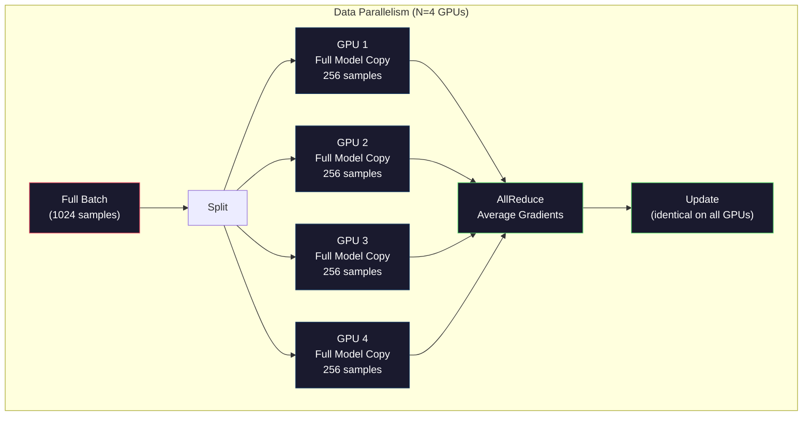
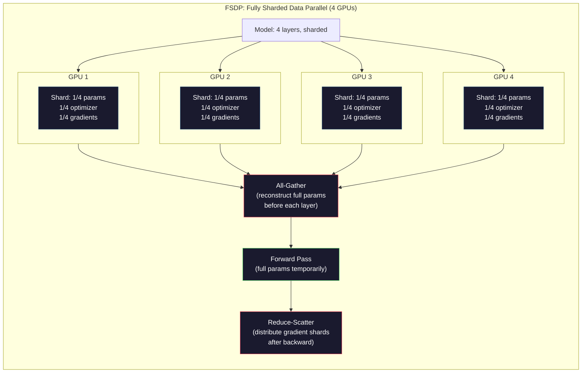
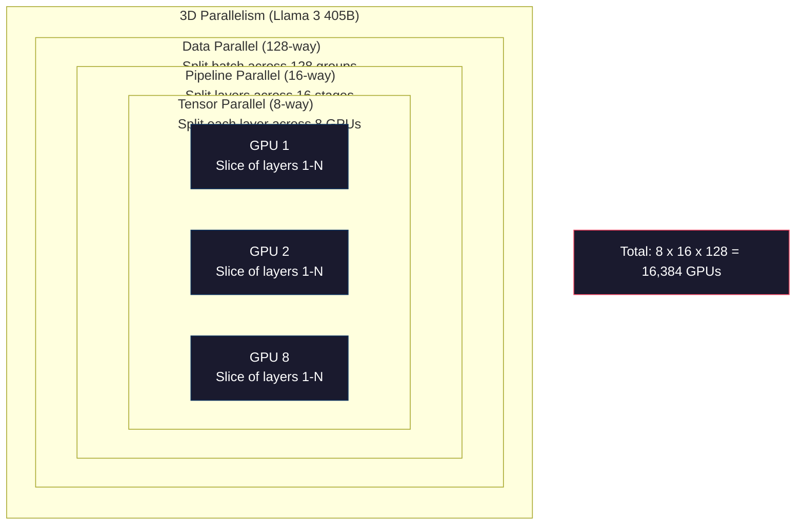

# Scaling: Distributed Training, FSDP, DeepSpeed

> تم تدريب نموذج 124M الخاص بك على GPU واحد. جرب الآن 7 مليار معلمة. النموذج لا يتناسب مع الذاكرة تستغرق البيانات أسابيع على جهاز واحد. التدريب الموزع ليس اختياريًا على نطاق واسع. إنه الطريق الوحيد للأمام.

**النوع:** بناء
** اللغات: ** بايثون
**المتطلبات الأساسية:** المرحلة 10، الدرس 04 (التدريب المسبق للاعب صغير GPT)
**الوقت:** ~120 دقيقة

## Learning Objectives

- شرح الأنواع الثلاثة للتوازي (البيانات، الموتر، pipeline) ومتى يكون كل منها ضروريًا بناءً على النموذج وحجم المجموعة
- تنفيذ التدريب الموازي للبيانات باستخدام PyTorch DDP مع مزامنة التدرج عبر GPUs متعددة
- حساب ميزانية الذاكرة لحجم نموذج معين (الأوزان + حالات المحسن + التدرجات + عمليات التنشيط) لتحديد الحد الأدنى من الأجهزة
- قم بتكوين مراحل FSDP أو DeepSpeed ZeRO لتقسيم حالات النموذج عبر GPUs وتناسب النماذج التي تتجاوز ذاكرة GPU الفردية

## The Problem

يحتاج نموذج المعلمة 7B في FP16 إلى 14 جيجابايت فقط للأوزان. يقوم مُحسِّن Adam بتخزين نسختين إضافيتين من كل معلمة (تقديرات اللحظة الأولى والثانية). وهذا هو 28GB أخرى. تضيف التدرجات أثناء الانتشار العكسي 14 جيجابايت إضافية. لديك 56 جيجابايت قبل تخزين عملية تنشيط واحدة.

يحتوي NVIDIA A100 على ذاكرة سعة 80 جيجابايت.

يتم استهلاك 56 جيجابايت من أصل 80 جيجابايت. وهذا يترك 24 جيجابايت للتنشيط - القيم المتوسطة المحسوبة أثناء التمرير الأمامي والتي يجب أن تظل حية للانتشار العكسي. بالنسبة لتسلسل 2048 رمزًا مميزًا مع نموذج 4096 بُعدًا، تستخدم عمليات تنشيط الطبقة الواحدة حوالي 64 ميجابايت. مع 32 طبقة، تحتاج إلى 2 جيجابايت لكل عينة. يتطلب حجم الدفعة 8 16 جيجابايت. لديك 24 جيجابايت. حجم الدفعة 12 تفجير.

جرب الآن معلمات 70B. الأوزان وحدها: 140 جيجابايت في FP16. لا يصلح على واحد GPU. أنت بحاجة إلى ما لا يقل عن 2 A100 (2 × 80 جيجابايت = 160 جيجابايت) فقط لحمل الأوزان. أضف حالات وتدرجات محسّنة وستحتاج إلى المزيد: 3+ GPUs كحد أدنى، وواقعيًا 8-16 اعتمادًا على استراتيجية التجزئة.

تم تدريب Llama 3 405B على 16,384 NVIDIA H100 GPUs. كلف تشغيل التدريب ما يقدر بنحو 100 مليون دولار في الحساب. قام DeepSeek V3 بتدريب نموذج مشابه مقابل ما يقرب من 5.6 مليون دولار من خلال كونه ذكيًا فيما يتعلق بالهندسة المعمارية (يعني مزيج الخبراء تنشيط جزء فقط من المعلمات لكل رمز مميز) وكفاءة التدريب.

يغطي هذا الدرس الاستراتيجيات الأربع التي make التدريب على نطاق واسع ممكن: توازي البيانات، توازي الموتر، pipالتوازي الخطي، وتوازي البيانات المجزأة بالكامل. ستقوم بمحاكاة كل واحدة منها باستخدام لغة بايثون الخالصة لفهم الآليات قبل لمس إطار التدريب الموزع.

## The Concept

### Why Distribution is Required

هنا هي الرياضيات الذاكرة للنماذج الحقيقية. كل رقم محسوب وليس مقدر.

| نموذج | بارامس | الأوزان (FP16) | دول آدم | التدرجات (FP16) | الإجمالي (لا يوجد تفعيلات) |
|-------|--------|----------------|------------|------------------|----------------------|
| GPT-2 صغير | 124 م | ٢٤٨ 248 | 992 MB | ٢٤٨ MB | 1.5 GB |
| اللاما 3 8ب | 8 ب | ١٦ 16 | 64 GB | ١٦ 16 | 96 GB |
| اللاما 3 70ب | 70ب | ١٤٠ 140 | ٥٦٠ 560 | ١٤٠ 140 | 840 GB |
| اللاما 3 405 ب | 405 ب | 810 GB | 3,240 GB | 810 GB | 4,860 GB |

عمود "دول آدم" هو القاتل. يخزن آدم متوسط ​​التشغيل (m) والتباين الجاري (v) لكل معلمة، وكلاهما في FP32. بالنسبة لطراز 70B، يكون ذلك 70B × 4 بايت × 2 = 560 جيجابايت. يحتاج المحسن وحده إلى سبع طائرات A100.

واحد H100 لديه 80 جيجابايت. يحتاج Llama 3 405B إلى 61 H100 على الأقل لحمل الأوزان والمحسن والتدرجات. أضف التنشيطات وسينمو العدد أكثر. استخدم Meta 16,384 GPU ليس لأنهم أرادوا ذلك، بل لأنهم اضطروا إلى ذلك.

### Data Parallelism

أبسط استراتيجية موزعة. انسخ النموذج بأكمله إلى N GPUs. قم بتقسيم كل دفعة تدريبية إلى عدد N من الأجزاء المتساوية. يقوم كل GPU بتشغيل تمرير للأمام والخلف على جزء البيانات الخاص به. بعد التمريرة الخلفية، قم بمتوسط ​​التدرجات عبر جميع GPUs. يقوم كل GPU بتحديث نسخته من الأوزان بنفس التدرجات المتوسطة، مع الحفاظ على مزامنة جميع النسخ.

**الخير:** قياس الإنتاجية الخطية. تقوم N GPUs بمعالجة N مرات أكثر من البيانات في كل خطوة. يقتصر الاتصال على متوسط ​​التدرج، الذي يتداخل مع الحساب.

**السيئ:** يحمل كل GPU نسخة كاملة من النموذج وحالات المُحسِّن والتدرجات. بالنسبة لطراز 70B، يحتاج كل GPU إلى 840 جيجابايت. توازي البيانات لا يفعل شيئًا لتقليل الذاكرة لكل GPU. إنه يقلل فقط من وقت التدريب.

**الرياضيات:** حجم الدفعة الفعالة = per_gpu_batch_size x N. بالنسبة إلى N=64 GPUs مع كل GPU دفعة مكونة من 16، تكون الدفعة الفعالة 1,024. استخدمت Llama 3 حجم دفعة فعال يبلغ 16 مليون رمز في كل خطوة.



### Tensor Parallelism

قم بتقسيم الطبقات الفردية عبر GPUs. يتم تقسيم ضرب المصفوفة الواحدة بين GPU، كل جزء حسابي من النتيجة.

خذ بعين الاعتبار مصفوفة وزن الشكل (8192، 8192) في طبقة التغذية الأمامية. مع توازي الموتر رباعي الاتجاهات، يحمل كل GPU قطعة (8192، 2048). تقوم كل GPU بضرب المدخلات في شطرها، مما ينتج عنه نتيجة جزئية. يتم دمج النتائج الجزئية (عبر التخفيض الشامل أو التجميع الكامل) لإنتاج المخرجات الكاملة.

**الخير:** يقلل من الذاكرة لكل GPU لأوزان النماذج. نموذج 70B مقسم إلى 8 GPU يعني أن كل GPU يحمل ~8.75B معلمات بقيمة أوزان.

**السيء:** يتطلب اتصالاً سريعًا بين GPU بعد كل طبقة. كل التخفيض بعد كل matmul يضيف الكمون. يعمل هذا بشكل جيد مع NVLink (900 GB/ثانية بين GPU على نفس node) ولكن بشكل سيئ عبر nodes متصلة بواسطة InfiniBand (400 جيجابايت/ثانية، حوالي 50 GB/ثانية). يقتصر توازي الموتر دائمًا على node (8 GPUs) واحد.

**الاستخدام الحقيقي:** ميجاترون-LM رائد التوازي الموتر. يستخدم Llama 3 405B توازي موتر ذي 8 اتجاهات داخل كل node.

### Pipeline Parallelism

قم بتقسيم النموذج إلى طبقات. GPU 1 يدير الطبقات 1-8. GPU 2 يدير الطبقات 9-16. GPU 3 طبقات 17-24. GPU 4 طبقات 25-32. تتدفق البيانات عبر الخط pip: GPU 1 يحسب طبقاته ويرسل التنشيطات إلى GPU 2، الذي يحسب طبقاته ويرسل إلى GPU 3، وهكذا.

**الجيد:** الحد الأدنى من الاتصال بين GPUs - فقط عمليات التنشيط عند حدود الطبقة، وهي صغيرة مقارنة بالتدرجات أو الأوزان. يعمل عبر nodes لأن متطلبات النطاق الترددي منخفضة.

**السيئة:** فقاعات خطوط الأنابيب. عندما يقوم GPU 4 بحساب التمريرة الأمامية على الدفعة الصغيرة 1، يكون GPUs 1 و2 و3 خاملاً (لقد قاموا بالفعل بإعادة توجيه الجزء الخاص بهم). أثناء التمرير للخلف، ينعكس النمط. مع البطانة الساذجة pip، الاستفادة من GPU هي 1/N فقط لمراحل N pipeline.

تعمل **GPipe وPipeDream** على حل مشكلة الفقاعات عن طريق تقسيم الدفعة إلى دفعات صغيرة. يبدأ GPU 1 على الدفعة الصغيرة 2 بمجرد الانتهاء من إعادة توجيه الدفعة الصغيرة 1. وهذا يتداخل مع الحساب عبر مراحل الخط pip. مع الدُفعات الصغيرة M والمراحل N، ينخفض ​​جزء الفقاعة إلى (N-1)/M. استخدم M = 16 دفعات صغيرة مع N = 4 مراحل والفقاعة هي 3/16 = 18.75% وقت خامل.

### FSDP: Fully Sharded Data Parallel

FSDP يجمع بين قابلية التوسع في توازي البيانات وكفاءة الذاكرة في التجزئة. بدلاً من أن يحمل كل GPU نسخة كاملة من النموذج، يحمل كل GPU 1/N فقط من المعلمات والتدرجات وحالات المُحسِّن.

قبل المرور الأمامي للطبقة، يقوم FSDP بتشغيل **جميع** لتجميع المعلمات الكاملة من جميع GPUs في ذاكرة كل GPU. بعد التمريرة الأمامية، يتجاهل كل GPU المعلمات غير المحلية. أثناء الرجوع إلى الخلف، يتم تشغيل التجميع مرة أخرى لإعادة بناء المعلمات لحساب التدرج. بعد التمريرة الخلفية، يقوم **تقليل التشتت** بتوزيع أجزاء متدرجة بحيث يخزن كل GPU فقط 1/N من التدرجات.

**الرياضيات لنموذج 70B على 8 GPUs:**

| مكون | بدون FSDP | مع FSDP |
|-----------|-------------|-----------|
| الأوزان (FP16) | 140 GB لكل GPU | 17.5 GB لكل GPU |
| دول آدم (FP32) | 560 GB لكل GPU | 70 GB لكل GPU |
| التدرجات (FP16) | 140 GB لكل GPU | 17.5 GB لكل GPU |
| **المجموع** | **840 GB لكل GPU** | **105 GB لكل GPU** |

بدون FSDP، لا يمكنك احتواء طراز 70B على 80 جيجابايت GPU واحد. مع FSDP في 8 GPU، يستخدم كل GPU 105 جيجابايت - انتظر، هذا لا يزال غير مناسب. أنت بحاجة إلى 16 GPU على الأقل للحصول على أقل من 80 جيجابايت لكل GPU، أو يمكنك دمج FSDP مع فحص التنشيط (إعادة حساب عمليات التنشيط أثناء الرجوع للخلف بدلاً من تخزينها).

تكلفة الاتصال أعلى من توازي بيانات الفانيليا بسبب التجميع الكامل قبل كل طبقة. ولكن توفير الذاكرة make التدريب الذي كان مستحيلًا سابقًا يمكن تشغيله.



### DeepSpeed ZeRO

DeepSpeed's ZeRO (Zero Redundancy Optimizer) مطابق من الناحية المفاهيمية لـ FSDP ولكن تم تطويره بشكل مستقل بواسطة Microsoft. وهو يحدد ثلاث مراحل، كل منها مقسمة بشكل أكثر قوة:

| المرحلة | شظايا | توفير الذاكرة | الاتصالات |
|-------|--------|---------------|---------------|
| زيرو-1 | الدول محسن فقط | ~4x تخفيض | نفس البيانات الموازية |
| زيرو-2 | + التدرجات | ~8x تخفيض | أكثر قليلا |
| زيرو-3 | + المعلمات | ~تخفيض Nx (N GPUs) | الكل متجمع لكل طبقة |

ZeRO-3 يعادل FSDP. التسمية مختلفة والآلية واحدة. PyTorch تمت إضافة FSDP كتطبيق أصلي بعد أن أثبت DeepSpeed ​​هذا المفهوم.

DeepSpeed also introduced ZeRO-Offload (offload optimizer states to CPU RAM, which is cheaper and larger) and ZeRO-Infinity (offload to NVMe SSDs). تستبدل هذه السرعة الحسابية بسعة الذاكرة - تكون العمليات التي تم تفريغها أبطأ ولكنها تحرر GPU من الذاكرة.

### Mixed Precision Training

يستخدم التدريب الحديث تنسيقات متعددة للفاصلة العائمة في وقت واحد:

- **التمرير الأمامي**: FP16 أو BF16 (16 بت). نصف ذكرى FP32. تعمل Matmuls بشكل أسرع مرتين على النوى الموترة.
- **الأوزان الرئيسية**: FP32 (32 بت). تتم صيانته بواسطة مُحسِّن الدقة الرقمية أثناء تحديثات الوزن.
- **تحجيم الخسارة**: اضرب الخسارة بثابت كبير قبل التمرير للخلف لمنع التدرجات FP16 من التدفق إلى الصفر. اقسم على نفس الثابت قبل خطوة المحسن.

BF16 (Brain Float 16) له نفس نطاق الأس مثل FP32 (8 بتات أسية) ولكن دقة أقل (7 بتات العشري مقابل FP32's 23). نادرًا ما يحتاج إلى قياس الخسارة لأنه يمكن أن يمثل نفس نطاق القيم. FP16 يحتوي على 5 بتات أسية و10 بتات عشرية - يمكن أن تمثل قيمًا دقيقة الحبيبات ولكنها تفيض/تتدفق تحت المقادير القصوى.

تستخدم وحدات TPU من Google BF16 محليًا. NVIDIA وA100 وH100 يدعمان كلاً من FP16 وBF16. انتقلت الصناعة إلى حد كبير إلى BF16 لأنها تقضي على صداع قياس الخسارة.

**مقارنة الذاكرة لطراز 7B:**

| الدقة | الأوزان | محسن | التدرجات | المجموع |
|-----------|--------|-----------|-----------|-------|
| FP32 في كل مكان | ٢٨ 28 | 56 GB | 28 GB | ١١٢ 112 |
| مختلط (BF16 + FP32 رئيسي) | ١٤ 14 | 56 GB | ١٤ 14 | 84 GB |

توفر الدقة المختلطة 28 جيجابايت في هذا الطراز. تظل حالات المُحسِّن في FP32 بغض النظر - هذا هو المكان الذي تذهب إليه معظم الذاكرة.

### Megatron-LM and 3D Parallelism

يجمع التدريب الحقيقي واسع النطاق بين المتوازيات الثلاثة:

- **توازي البيانات** عبر مجموعات مكونة من nodes (قياس حجم الدفعة)
- **توازي الموتر** داخل node (تقسيم الطبقات عبر 8 GPUs)
- **توازي خطوط الأنابيب** عبر nodes (تقسيم مجموعات الطبقات عبر الأجهزة)

اللاما 3 405B على 16,384 طائرة H100:
- توازي موتر ذو 8 اتجاهات داخل كل node (8 GPUs لكل node)
- 16 اتجاهًا pipتوازي خطي عبر nodes (16 pipمراحل خطية)
- 128 طريقة لتوازي البيانات عبر البعد المتبقي (16,384 / 8 / 16 = 128)

هذا التحلل ثلاثي الأبعاد (8 × 16 × 128 = 16,384) هو كيفية التوسع إلى آلاف GPUs. يرى كل GPU جزءًا مختلفًا من البيانات (بيانات متوازية)، ويحمل شريحة واحدة من كل طبقة (موتر متوازي)، ويحسب مجموعة مختلفة من الطبقات (pip خط متوازي).

اتخذ DeepSeek V3 نهجًا مختلفًا. تقوم بنية Mixture of Experts الخاصة بهم بتنشيط 37B فقط من أصل 671B معلمة لكل رمز مميز. هذا يعني أن كل GPU يحتاج فقط إلى حساب (وتخزين عمليات التنشيط) المعلمات النشطة. لقد تدربوا على 2,048 H800 GPU - أقل من 1/8 من عدد Meta GPU - مقابل 5.6 مليون دولار مقابل 100 مليون دولار في Meta.



## Build It

### Step 1: Simulate Data Parallelism

قم بتقسيم الدفعة عبر GPUs المحاكاة. يحسب كل GPU التمريرة الأمامية على شظيته. متوسط ​​"التدرجات" (نحاكيها كقيم الخسارة).

```python
import numpy as np

def simulate_data_parallelism(data, num_gpus, model_fn):
    batch_size = len(data)
    shard_size = batch_size // num_gpus
    remainder = batch_size % num_gpus

    gpu_losses = []
    gpu_gradients = []

    offset = 0
    for gpu_id in range(num_gpus):
        extra = 1 if gpu_id < remainder else 0
        shard = data[offset:offset + shard_size + extra]
        offset += shard_size + extra

        loss, grad = model_fn(shard)
        gpu_losses.append(loss)
        gpu_gradients.append(grad)

    avg_loss = np.mean(gpu_losses)
    avg_gradient = np.mean(gpu_gradients, axis=0)

    return avg_loss, avg_gradient
```

تعتبر عملية التخفيض الشامل (متوسط ​​التدرجات) هي الاتصال الوحيد في توازي البيانات. من الناحية العملية، يستخدم هذا مكتبة NCCL في NVIDIA GPUs، والتي تنفذ حلقة التخفيض الشامل: كل GPU يرسل 1/N من تدرجاته إلى جاره، ويستقبل 1/N من الجار الآخر، وبعد خطوات N-1 كل GPU لديه المتوسط ​​الكامل. إجمالي حجم الاتصال: 2 x gradient_size x (N-1)/N، يقترب من 2x حجم التدرج لـ N الكبير.

### Step 2: Simulate Tensor Parallelism

قم بتقسيم مصفوفة الوزن عبر GPUs. كل GPU يحسب ضرب المصفوفة الجزئي. الجمع بين النتائج.

```python
def simulate_tensor_parallelism(input_data, weight_matrix, num_gpus):
    d_in, d_out = weight_matrix.shape
    assert d_out % num_gpus == 0, f"d_out {d_out} not divisible by num_gpus {num_gpus}"
    shard_size = d_out // num_gpus

    partial_results = []
    for gpu_id in range(num_gpus):
        start = gpu_id * shard_size
        end = start + shard_size
        weight_shard = weight_matrix[:, start:end]

        partial = input_data @ weight_shard
        partial_results.append(partial)

    full_output = np.concatenate(partial_results, axis=-1)

    direct_output = input_data @ weight_matrix
    error = np.abs(full_output - direct_output).max()

    return full_output, error
```

يجب أن يكون الخطأ صفرًا تمامًا (أو آلة إبسيلون). إن توازي الموتر دقيق رياضيًا - فهو ينتج نفس النتيجة مثل حساب الماتمول الكامل على واحد GPU. يتم التقسيم على طول البعد الناتج، لذلك ينتج كل GPU مجموعة مختلفة من الأعمدة، ويعيد التسلسل بناء النتيجة الكاملة.

بالنسبة للطبقات الخطية المتوازية مع الأعمدة (تقسيم البعد الناتج)، يمكنك التسلسل. بالنسبة للصفوف المتوازية (تقسيم بُعد الإدخال)، يمكنك الجمع. في المحول FFN، يستخدم الخطي الأول (التوسيع) عمودًا متوازيًا ويستخدم الخطي الثاني (العقد) صفًا متوازيًا. هذا يتجنب التخفيض الكامل بين الطبقتين.

### Step 3: Simulate Pipeline Parallelism

قم بتقسيم طبقات النموذج عبر GPUs الافتراضية. اعرض مشكلة الفقاعة حيث تظل المراحل المبكرة خاملة بينما تقوم المراحل اللاحقة بالحساب.

```python
def simulate_pipeline_parallelism(num_layers, num_stages, num_microbatches):
    layers_per_stage = num_layers // num_stages

    timeline = {}
    clock = 0

    for mb in range(num_microbatches):
        for stage in range(num_stages):
            start_time = max(
                timeline.get((stage, mb - 1, "fwd"), (0, 0))[1] if mb > 0 else 0,
                timeline.get((stage - 1, mb, "fwd"), (0, 0))[1] if stage > 0 else 0,
            )
            end_time = start_time + layers_per_stage
            timeline[(stage, mb, "fwd")] = (start_time, end_time)

    last_fwd_end = max(v[1] for v in timeline.values())

    for mb in range(num_microbatches - 1, -1, -1):
        for stage in range(num_stages - 1, -1, -1):
            deps = [last_fwd_end]
            if mb < num_microbatches - 1 and (stage, mb + 1, "bwd") in timeline:
                deps.append(timeline[(stage, mb + 1, "bwd")][1])
            if stage < num_stages - 1 and (stage + 1, mb, "bwd") in timeline:
                deps.append(timeline[(stage + 1, mb, "bwd")][1])
            start_time = max(deps)
            end_time = start_time + layers_per_stage
            timeline[(stage, mb, "bwd")] = (start_time, end_time)

    total_time = max(v[1] for v in timeline.values())
    compute_time = num_microbatches * num_stages * layers_per_stage * 2
    bubble_fraction = 1.0 - compute_time / (total_time * num_stages)

    return timeline, total_time, bubble_fraction
```

مع 4 مراحل ودفعة صغيرة واحدة، يكون جزء الفقاعة 75% - ثلاث من أصل أربع GPU خاملة في أي وقت. ومع 16 دفعة صغيرة، تنخفض النسبة إلى حوالي 19%. تكلفة التخلص من الفقاعات هي الذاكرة: يجب عليك تخزين عمليات التنشيط لجميع الدفعات الصغيرة على متن الطائرة في وقت واحد.

### Step 4: Memory Calculator

حساب متطلبات الذاكرة الدقيقة للتدريب على أي حجم نموذج.

```python
def memory_calculator(
    params_billions,
    precision_bytes=2,
    optimizer="adam",
    num_gpus=1,
    sharding="none",
    sequence_length=2048,
    batch_size_per_gpu=1,
    hidden_dim=None,
    num_layers=None,
):
    params = params_billions * 1e9

    weight_memory = params * precision_bytes

    if optimizer == "adam":
        optimizer_memory = params * 4 * 2
    elif optimizer == "sgd":
        optimizer_memory = params * 4
    else:
        optimizer_memory = 0

    gradient_memory = params * precision_bytes

    total_no_activation = weight_memory + optimizer_memory + gradient_memory

    if hidden_dim and num_layers:
        activation_per_layer = (
            sequence_length * batch_size_per_gpu * hidden_dim * precision_bytes * 4
        )
        activation_memory = activation_per_layer * num_layers
    else:
        activation_memory = params * precision_bytes * 0.5

    if sharding == "fsdp" or sharding == "zero3":
        weight_memory /= num_gpus
        optimizer_memory /= num_gpus
        gradient_memory /= num_gpus
    elif sharding == "zero2":
        optimizer_memory /= num_gpus
        gradient_memory /= num_gpus
    elif sharding == "zero1":
        optimizer_memory /= num_gpus

    per_gpu_total = weight_memory + optimizer_memory + gradient_memory + activation_memory

    return {
        "params_billions": params_billions,
        "weights_gb": weight_memory / 1e9,
        "optimizer_gb": optimizer_memory / 1e9,
        "gradients_gb": gradient_memory / 1e9,
        "activations_gb": activation_memory / 1e9,
        "per_gpu_total_gb": per_gpu_total / 1e9,
        "total_across_gpus_gb": per_gpu_total * num_gpus / 1e9,
        "fits_on_80gb": per_gpu_total / 1e9 <= 80,
        "num_gpus": num_gpus,
        "sharding": sharding,
    }
```

تجيب هذه الآلة الحاسبة على السؤال الذي يطرحه كل مهندس ML: "كم عدد GPU الذي أحتاجه؟" قم بإطعامه بحجم النموذج ومعرفة ما إذا كان مناسبًا أم لا. اضبط إستراتيجية التجزئة حتى ينخفض ​​إجمالي كل GPU إلى أقل من 80 جيجابايت.

### Step 5: Mixed Precision Simulation

قارن استخدام الذاكرة بين FP32 وFP16 والتدريب الدقيق المختلط.

```python
def mixed_precision_comparison(params_billions):
    params = params_billions * 1e9

    fp32_weights = params * 4
    fp32_optimizer = params * 4 * 2
    fp32_gradients = params * 4
    fp32_total = fp32_weights + fp32_optimizer + fp32_gradients

    fp16_weights = params * 2
    fp16_master = params * 4
    fp16_optimizer = params * 4 * 2
    fp16_gradients = params * 2
    fp16_total = fp16_weights + fp16_master + fp16_optimizer + fp16_gradients

    mixed_weights = params * 2
    mixed_optimizer = params * 4 * 2
    mixed_gradients = params * 2
    mixed_total = mixed_weights + mixed_optimizer + mixed_gradients

    return {
        "fp32_total_gb": fp32_total / 1e9,
        "fp16_with_master_gb": fp16_total / 1e9,
        "mixed_bf16_gb": mixed_total / 1e9,
        "savings_vs_fp32": 1 - mixed_total / fp32_total,
    }
```

المفاجأة الكبرى بالنسبة لمعظم الناس: الدقة المختلطة لا تؤدي إلى خفض الذاكرة إلى النصف. يظل المحسن (Adam's m و v) في FP32 بغض النظر عن الدقة. بالنسبة لطراز 7B، يستخدم التدريب FP32 112 جيجابايت. الدقة المختلطة تستخدم 84 جيجابايت. يعني تخفيض 25% وليس 50% المحسن يهيمن.

## Use It

### Run All Simulations

```python
def run_all_demos():
    print("=" * 70)
    print("DATA PARALLELISM SIMULATION")
    print("=" * 70)

    np.random.seed(42)
    data = np.random.randn(64, 32)
    weight = np.random.randn(32, 16)

    def model_fn(batch):
        output = batch @ weight
        loss = np.mean(output ** 2)
        grad = 2 * batch.T @ (batch @ weight) / len(batch)
        return loss, grad

    for n_gpus in [1, 2, 4, 8]:
        loss, grad = simulate_data_parallelism(data, n_gpus, model_fn)
        print(f"  {n_gpus} GPUs: loss={loss:.4f}, grad_norm={np.linalg.norm(grad):.4f}")

    print()
    print("=" * 70)
    print("TENSOR PARALLELISM SIMULATION")
    print("=" * 70)

    x = np.random.randn(4, 8192)
    W = np.random.randn(8192, 8192)

    for n_gpus in [1, 2, 4, 8]:
        output, error = simulate_tensor_parallelism(x, W, n_gpus)
        print(f"  {n_gpus} GPUs: output_shape={output.shape}, max_error={error:.2e}")

    print()
    print("=" * 70)
    print("PIPELINE PARALLELISM SIMULATION")
    print("=" * 70)

    for n_mb in [1, 4, 8, 16, 32]:
        _, total_t, bubble = simulate_pipeline_parallelism(32, 4, n_mb)
        print(f"  {n_mb:2d} micro-batches: total_time={total_t:4d}, bubble={bubble:.1%}")

    print()
    print("=" * 70)
    print("MEMORY CALCULATOR")
    print("=" * 70)

    configs = [
        (7, "none", 1),
        (7, "fsdp", 8),
        (70, "none", 1),
        (70, "fsdp", 8),
        (70, "fsdp", 16),
        (405, "fsdp", 64),
        (405, "fsdp", 128),
    ]

    print(f"  {'Model':>8} {'Sharding':>8} {'GPUs':>5} {'Per-GPU':>10} {'Fits 80GB':>10}")
    print("  " + "-" * 50)
    for params, shard, gpus in configs:
        result = memory_calculator(params, num_gpus=gpus, sharding=shard)
        fits = "Yes" if result["fits_on_80gb"] else "No"
        print(f"  {params:>6}B {shard:>8} {gpus:>5} {result['per_gpu_total_gb']:>8.1f}GB {fits:>10}")

    print()
    print("=" * 70)
    print("MIXED PRECISION COMPARISON")
    print("=" * 70)

    for params_b in [7, 13, 70, 405]:
        result = mixed_precision_comparison(params_b)
        print(f"  {params_b}B: FP32={result['fp32_total_gb']:.0f}GB, "
              f"Mixed BF16={result['mixed_bf16_gb']:.0f}GB, "
              f"Savings={result['savings_vs_fp32']:.0%}")
```

## Ship It

ينتج هذا الدرس `outputs/prompt-distributed-training-planner.md` -- موجه يأخذ حجم النموذج والأجهزة المتوفرة، ثم ينتج خطة تدريب موزعة كاملة: استراتيجية التوازي، وميزانية الذاكرة، وعبء الاتصالات، والإنتاجية المتوقعة.

## Exercises

1. قم بتعديل حاسبة الذاكرة لتشمل فحص التنشيط. باستخدام نقاط التفتيش، قم بتخزين عمليات التنشيط فقط في كل طبقة K-th (K=1 النموذجية، مما يعني إعادة حساب الكل). اعرض مقايضة حساب الذاكرة: ما مقدار الذاكرة التي توفرها عملية فحص نقاط التفتيش، وما مدى إبطاء التدريب (حوالي 33% زيادة في الحوسبة لإجراء عمليات فحص كاملة)؟

2. قم بتوسيع محاكاة التوازي الخطي pip لتنفيذ جدول 1F1B (واحد للأمام، وواحد للخلف) الذي يستخدمه PipeDream. قارن جزء الفقاعة بالجدول الساذج لأربع مراحل و8 دفعات صغيرة. يجب أن يحتوي جدول 1F1B على ذاكرة ذروة أصغر لأنه يبدأ بالتمرير للخلف مبكرًا.

3. تنفيذ محاكي تراكم التدرج. بدلاً من التخفيض الشامل بعد كل دفعة صغيرة، قم بتجميع التدرجات محليًا لخطوات K، ثم التخفيض الكلي. أظهر كيف يؤدي هذا إلى تقليل الاتصال بمقدار K مرات ولكنه ينتج تدرجات نهائية متطابقة (وبالتالي تدريبًا متطابقًا).

4. بناء مقدر التكلفة. بالنظر إلى حجم النموذج، وعدد الرموز المميزة المستهدفة، ونوع GPU (A100 بسعر 2 دولار/ساعة، H100 بسعر 3.50 دولار/ساعة)، واستراتيجية التوازي، قم بتقدير إجمالي تكلفة التدريب بالدولار. التحقق من صحة التكاليف المعروفة: يقال إن Llama 3 405B تكلف حوالي 100 مليون دولار، وتكلفة DeepSeek V3 ~ 5.6 مليون دولار.

5. قم بإضافة ZeRO-Offload إلى حاسبة الذاكرة. افترض أن CPU RAM تبلغ 512 جيجابايت لكل node وNVMe تبلغ 2 تيرابايت. أظهر كيف أن تفريغ حالة المحسن إلى CPU يسمح لنموذج 70B بالتدريب على 4 GPU بدلاً من 16، بتكلفة 30-50% خطوات محسن أبطأ.

## Key Terms

| مصطلح | ماذا يقول الناس | ماذا يعني في الواقع |
|------|----------------|----------------------|
| توازي البيانات | "انسخ النموذج إلى كل GPU" | يقوم كل GPU بمعالجة جزء بيانات مختلف؛ يتم حساب متوسط ​​التدرجات عبر التخفيض الشامل بعد كل خطوة |
| توازي الموتر | "تقسيم الطبقة عبر GPUs" | مصفوفات وزن التقسيم بحيث يحسب كل GPU جزءاً من المطمول؛ يتطلب اتصال NVLink سريعًا |
| توازي خطوط الأنابيب | "تقسيم الطبقات عبر GPUs" | يدير كل GPU مجموعة مختلفة من الطبقات؛ تتدفق البيانات عبر الخط pip بدفعات صغيرة لتقليل الفقاعات |
| FSDP | "كسر كل شيء" | بيانات متوازية مجزأة بالكامل - تحتوي كل GPU على 1/N من الأوزان والتدرجات وحالات المُحسّن؛ تجميع الكل قبل الحساب |
| صفر | "نسخة DeepSpeed ​​من FSDP" | مُحسِّن Zero Redundancy مع 3 مراحل: مُحسِّن الأجزاء (المرحلة 1)، + التدرجات (المرحلة 2)، + المعلمات (المرحلة 3) |
| الكل يقلل | "المتوسط ​​عبر GPUs" | عملية جماعية حيث ينتهي كل GPU بمجموع (أو متوسط) جميع مدخلات GPUs - يتم تنفيذها عادةً كحلقة تقليل الكل |
| الكل جمع | "اجمع من كل GPU" | عملية جماعية حيث ينتهي كل GPU بتسلسل جميع بيانات GPU - المستخدمة في FSDP لإعادة بناء المعلمات الكاملة |
| تقليل التشتت | "الجمع والتوزيع" | عملية جماعية تقلل (تجميع) البيانات وتنثر أجزاء مختلفة إلى GPUs مختلفة - تستخدم في FSDP لتقسيم التدرج |
| دقة مختلطة | "تدرب بنصف الدقة" | استخدم FP16/BF16 للأمام/للخلف وFP32 لحالات المُحسِّن - يوفر ~25% من الذاكرة، وليس 50%، لأن المُحسِّن يهيمن على |
| فقاعة خط أنابيب | "وقت الخمول في خط pip" | جزء من الوقت GPU يجلس خاملاً في انتظار البيانات من المرحلة السابقة - يتم تقليله باستخدام المزيد من الدُفعات الصغيرة |

## Further Reading

- [Rajbhandari وآخرون، 2020 - "ZeRO: تحسينات الذاكرة نحو تدريب نماذج تريليون معلمة"](https://arxiv.org/abs/1910.02054) - ورقة DeepSpeed ​​ZERO التي حددت مراحل التجزئة الثلاثة
- [شوبي وآخرون، 2020 - "ميجاترون-LM: تدريب نماذج لغة متعددة المليارات باستخدام التوازي النموذجي"](https://arxiv.org/abs/1909.08053) -- توازي موتر NVIDIA للمحولات
- [نارايانان وآخرون، 2021 - "تدريب نموذجي لغوي فعال واسع النطاق على GPU مجموعات باستخدام Megatron-LM"](https://arxiv.org/abs/2104.04473) - توازي ثلاثي الأبعاد يجمع بين البيانات والموتر وpipالخط
- [تشاو وآخرون، 2023 -- "PyTorch FSDP: تجارب في توسيع نطاق البيانات المجزأة بالكامل بالتوازي"](https://arxiv.org/abs/2304.11277) -- تنفيذ PyTorch الأصلي FSDP
- [التقرير الفني للعبة Llama 3](https://arxiv.org/abs/2407.21783) -- 16,384 GPU تدريب بتفاصيل التوازي ثلاثي الأبعاد
- [DeepSeek-V3 تقرير فني](https://arxiv.org/abs/2412.19437) -- كيف تقلل بنية وزارة التربية والتعليم من تكلفة التدريب بمقدار أمر كبير
