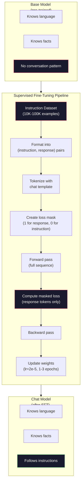

# Instruction Tuning (SFT)

> يتنبأ النموذج الأساسي بالرمز المميز التالي. هذا كل شيء. ولا يتبع التعليمات أو يجيب على الأسئلة أو يرفض الطلبات الضارة. SFT هو الجسر بين المتنبئ المميز والمساعد المفيد. كل عارضة أزياء تحدثت إليها - Claude، GPT، Llama Chat - مرت بهذه الخطوة.

**النوع:** بناء
** اللغات: ** بايثون (مع numpy)
**المتطلبات الأساسية:** المرحلة 10، الدرس 04 (التدريب المسبق للاعب صغير GPT)
**الوقت:** ~90 دقيقة

## Learning Objectives

- تنفيذ الضبط الدقيق الخاضع للإشراف (SFT) الذي يحول نموذج اللغة الأساسي إلى مساعد لمتابعة التعليمات
- تنسيق بيانات التدريب باستخدام قوالب الدردشة مع أدوار النظام والمستخدم والمساعد، وفقدان القناع على الرموز غير المساعدة
- اشرح سبب أهمية SFT: تستمر النماذج الأساسية في النص بدلاً من الإجابة على الأسئلة
- تقييم جودة SFT من خلال مقارنة النموذج الأساسي مع استجابات النموذج المضبوطة بدقة على مجموعة التعليمات المعلقة

## The Problem

لقد قمت بتدريب نموذج في الدرس 04. يمكنه التنبؤ بالرمز المميز التالي في ضوء التسلسل. قم بإطعامه "بنية المحولات" وقد يستمر بـ "أحدث ثورة في معالجة اللغة الطبيعية". هذا أمر مثير للإعجاب بالنسبة للتنبؤ بالرمز التالي.

الآن جرب هذا: أطعمه "ما هي عاصمة فرنسا؟" النموذج الأساسي لا يجيب على "باريس". ويستمر هذا النمط. قد ينتج "ما هي عاصمة ألمانيا؟ ما هي عاصمة إسبانيا؟" لأنها تعلمت من الوثائق التي تحتوي على قوائم الأسئلة. أو قد ينتج عنه "سؤال يطرحه الكثير من الناس" لأن هذا استمرار معقول للرمز التالي. النموذج ليس لديه مفهوم *الإجابة*. لا يعرف إلا *الاستمرار*.

هذه هي الفجوة بين GPT-3 (النموذج الأساسي، الذي تم إصداره في يونيو 2020) وChatGPT (الذي تم ضبطه حسب التعليمات، والذي تم إصداره في نوفمبر 2022). نفس الهندسة المعمارية. نفس التدريب المسبق الفرق هو 20.000 إلى 100.000 زوج (تعليمات، استجابة) تم تصميمها بعناية والتي علمت النموذج اتباع نمط المحادثة.

أثبت ستانفورد ألباكا أنك لا تحتاج إلى ملايين الأمثلة. في مارس 2023، قاموا بضبط Llama 7B بدقة على 52000 زوج من التعليمات والاستجابة التي تم إنشاؤها بواسطة GPT-3.5. التكلفة الإجمالية: 600 دولار. وكانت النتيجة روبوت دردشة يمكنه اتباع التعليمات والإجابة على الأسئلة وإجراء المحادثات. ليست جيدة مثل ChatGPT، ولكنها قريبة بشكل صادم مقابل 600 دولار وبضع ساعات من التدريب.

استخدمت Meta's Llama 2 Chat حوالي 27000 مثال عالي الجودة فقط في مرحلتها الأولية SFT. الفكرة الأساسية: الجودة أهم من الكمية. 27000 مثال كتبها معلقون ماهرون تغلب على مليون مثال صاخب تم استخلاصه من الإنترنت.

## The Concept

### What SFT Actually Does

يستمر الضبط الدقيق الخاضع للإشراف في نفس حلقة التدريب من التدريب المسبق - التمريرة الأمامية، وخسارة الحساب، والتمريرة الخلفية، وتحديث الأوزان - ولكن على نوع مختلف من البيانات. بدلاً من النص الخام، يمكنك التدريب على المحادثات المنظمة:

```json
{
  "system": "You are a helpful assistant.",
  "user": "What is the capital of France?",
  "assistant": "The capital of France is Paris."
}
```

يعرف النموذج بالفعل أن باريس هي عاصمة فرنسا. لقد تعلمت ذلك أثناء التدريب المسبق على ويكيبيديا والكتب المدرسية وصفحات الويب. SFT لا يعلم النموذج حقائق جديدة. إنه يعلم النموذج *سلوكًا* جديدًا: عندما ترى سؤالاً، قم بإنتاج إجابة. عندما ترى تعليمات، قم بإكمالها. عندما ترى طلبًا ضارًا، قم بالرفض.

فكر في الأمر بهذه الطريقة. التدريب المسبق يعطي المعرفة النموذجية. SFT يعطي الأخلاق النموذجية.

### Data Formats

هناك ثلاثة أشكال تهيمن على الصناعة. يقوم كل منها بتشفير نفس المعلومات - من قال ماذا - بمحددات مختلفة.

**تنسيق الألبكة** (ستانفورد، مارس 2023):

```json
{
  "instruction": "Summarize the following article in 3 sentences.",
  "input": "The European Central Bank raised interest rates...",
  "output": "The ECB increased rates by 25 basis points..."
}
```

بسيطة وتستخدم على نطاق واسع. يعد الحقل `input` اختياريًا - حيث لا تحتاج العديد من التعليمات إلى سياق إضافي. أصدرت جامعة ستانفورد 52000 مثال بهذا التنسيق، تم إنشاؤها بواسطة GPT-3.5 مقابل 600 دولار. أدى هذا إلى إطلاق حركة ضبط التعليمات مفتوحة المصدر.

**تنسيق ShareGPT** (المجتمع، 2023):

```json
{
  "conversations": [
    {"from": "system", "value": "You are a helpful assistant."},
    {"from": "human", "value": "What causes tides?"},
    {"from": "gpt", "value": "Tides are caused by the gravitational pull of the Moon..."},
    {"from": "human", "value": "How often do they occur?"},
    {"from": "gpt", "value": "Most coastal areas experience two high tides and two low tides per day..."}
  ]
}
```

يدعم المحادثات متعددة المنعطفات. يستخدم الحقل "من" "human" و"gpt" حسب الاصطلاح، بغض النظر عن النموذج الفعلي. تم تدريب Vicuna على 70.000 محادثة ShareGPT تم استخلاصها من نصوص ChatGPT التي شاركها المستخدم.

**تنسيق ChatML** (OpenAI، يستخدم في العديد من النماذج مفتوحة المصدر):

```
<|im_start|>system
You are a helpful assistant.<|im_end|>
<|im_start|>user
What is the capital of France?<|im_end|>
<|im_start|>assistant
The capital of France is Paris.<|im_end|>
```

يستخدم الرموز الخاصة (`<|im_start|>`، `<|im_end|>`) لتحديد الأدوار. تتم إضافة هذه الرموز المميزة إلى مفردات أداة الرمز المميز أثناء الضبط الدقيق. تستخدم Qwen وYi والعديد من النماذج الأخرى ChatML.

جميع التنسيقات الثلاثة تحقق نفس الشيء: فهي تخبر النموذج "هذه هي التعليمات، وهذه هي الاستجابة، تعلم هذا النمط".

### Why It Works

يعرف النموذج اللغة بالفعل من التدريب المسبق. لقد شهدت مليارات الأمثلة من الأسئلة تليها الإجابات، والتعليمات تليها الإكمالات، والمحادثات بين الناس. الأنماط مشفرة بالفعل في الأوزان.

SFT يركز هذه القدرة الكامنة. بدلاً من أن يحتاج النموذج إلى معرفة من السياق ما إذا كان يجب عليه الإجابة على سؤال أو متابعة مستند، SFT يتدرب بشكل واضح على نمط المحادثة. بعد بضعة آلاف من الأمثلة، يتعلم النموذج: عندما ترى علامة دور المساعد، قم بإنتاج استجابة مفيدة.

ولهذا السبب يكفي 27000 مثال. أنت لا تقوم بتدريس اللغة الإنجليزية النموذجية. أنت لا تعلمه حقائق عن العالم. أنت تعلمه سلوكًا واحدًا بسيطًا: الاستجابة للتعليمات. المعرفة كانت موجودة بالفعل.

### The Masked Loss

هذه هي التفاصيل الفنية الأكثر أهمية في SFT، ومعظم البرامج التعليمية تتخطاها.

أثناء التدريب المسبق، تقوم بحساب الخسارة على كل رمز مميز. يتعلم النموذج التنبؤ بكل رمز مميز تالي في التسلسل. خلال SFT، يمكنك فقط حساب الخسارة على الرموز المميزة *الاستجابة*. توجد رموز التعليمات للسياق، ولكن لا يتم معاقبة النموذج على "التنبؤ" بها بشكل غير صحيح.

لماذا؟ لأنك لا تريد أن يتعلم النموذج كيفية *إنشاء* التعليمات. تريده أن يتعلم *الرد على* التعليمات. إذا قمت بحساب الخسارة على رموز التعليمات، فأنت تقوم بتدريب النموذج للتنبؤ بـ "ما هي عاصمة فرنسا؟" كما لو كان هو الذي يطرح السؤال. يؤدي ذلك إلى إهدار إشارة التدرج ويمكن أن يربك النموذج بشأن دوره.

في الممارسة العملية، يمكنك إنشاء قناع الخسارة: 1 لرموز الاستجابة، و0 لرموز التعليمات. اضرب خسارة كل رمز مميز في هذا القناع قبل حساب المتوسط.

```
Tokens:    [SYS] You are helpful [USER] What is the capital? [ASST] Paris is the capital [EOS]
Loss mask:   0    0    0     0      0     0   0  0     0       1     1    1   1     1      1
```

فقط الرموز المميزة بعد `[ASST]` تساهم في الخسارة. يرى النموذج المحادثة الكاملة أثناء التمريرة الأمامية (يحتاج إلى التعليمات لإنتاج الاستجابة الصحيحة) ولكنه يقوم فقط بتحديث أوزانه بناءً على مدى توقعه للاستجابة.

### Training Hyperparameters

SFT يستخدم معلمات مفرطة مختلفة بشكل كبير عن التدريب المسبق. أنت لا تتدرب من الصفر. أنت تقوم بتعديل نموذج يعمل بالفعل.

| المعلمة | التدريب المسبق (لاما 2 7 ب) | SFT (لاما 2 شات) |
|-----------|---------------------------------------|-----|
| معدل التعلم | 3e-4 (الذروة) | 2ه-5 |
| العصور | 1 (تمرير واحد للبيانات) | 2 |
| حجم الدفعة | رموز 4M | 64 مثال |
| خطوات الإحماء | 2000 | 0-100 |
| تسوس الوزن | 0.1 | 0.0-0.1 |
| حجم البيانات | رموز 2T | 27000 مثال |

معدل التعلم أقل بمقدار 15 مرة لـ SFT. هذا أمر بالغ الأهمية. يؤدي معدل التعلم المرتفع أثناء الضبط الدقيق إلى تدمير المعرفة المدربة مسبقًا. النموذج "ينسى" ما تعلمه ويتناسب مع مجموعة بيانات الضبط الدقيقة الصغيرة. وهذا هو النسيان الكارثي.

عصران يعني أن النموذج يرى كل مثال تدريبي مرتين. يؤدي أكثر من 3 فترات في مجموعة بيانات صغيرة إلى الحفظ - يبدأ النموذج في إعادة إنتاج أمثلة التدريب حرفيًا بدلاً من التعميم.

### Catastrophic Forgetting

الضبط الدقيق يمكن أن يدمر القدرات العامة. إذا تدربت لفترة طويلة جدًا على البيانات التي تتبع التعليمات، فسيفقد النموذج قدرته على كتابة التعليمات البرمجية أو إجراء العمليات الحسابية أو إنتاج نص إبداعي. يصبح جيدًا جدًا في التنسيق المحدد لبيانات التدريب الخاصة به وفظيعًا في كل شيء آخر.

ثلاثة التخفيفات:

1. **معدل تعلم منخفض.** 1e-5 إلى 5e-5. التحديثات الأصغر تعني تدميرًا أقل للميزات المدربة مسبقًا.

2. **تدريب قصير** 1-3 فترات. توقف قبل أن يتفوق النموذج.

3. **امزج بيانات ما قبل التدريب.** قامت Llama 2 Chat بخلط نسبة صغيرة (2-5%) من بيانات ما قبل التدريب الأولية في مجموعة البيانات SFT. وهذا "يذكر" النموذج بقدراته العامة أثناء تعلم سلوك متابعة التعليمات الجديد.

### Real Numbers

يستغرق الضبط الدقيق لنموذج 7B على 10000 زوج من التعليمات عالية الجودة حوالي ساعة واحدة على NVIDIA A100 80 جيجابايت GPU واحد. وهنا الرياضيات:

- 10,000 مثال × 512 رمزًا متوسطًا = 5.12 مليون رمزًا
- عصران = إجمالي 10.24 مليون رمز
- A100 الإنتاجية للضبط الدقيق لنموذج 7B: ~3000 رمز مميز/ثانية
- 10.24 مليون / 3000 = ~3400 ثانية = ~57 دقيقة

بالنسبة لمنتجنا الصغير GPT (4 طبقات، 128 درجة خافتة)، يكون التدريب فوريًا تقريبًا. النقطة المهمة هي فهم الآليات، وليس المقياس.



## Build It

### Step 1: Instruction Dataset

إنشاء مجموعة بيانات التعليمات الاصطناعية. في الإنتاج، تستخدم شركات مثل Scale AI وAnthropic شروحًا بشرية لكتابة هذه الكلمات. سنقوم بإنشائها برمجيًا لتوضيح التنسيق.

```python
import numpy as np

INSTRUCTION_DATA = [
    {
        "instruction": "What is the capital of France?",
        "response": "The capital of France is Paris."
    },
    {
        "instruction": "Explain gravity in one sentence.",
        "response": "Gravity is the force that attracts objects with mass toward each other."
    },
    {
        "instruction": "Write a haiku about the ocean.",
        "response": "Waves crash on the shore, salt and foam beneath the sun, endless blue expanse."
    },
    {
        "instruction": "What is 15 multiplied by 7?",
        "response": "15 multiplied by 7 is 105."
    },
    {
        "instruction": "Name three programming languages.",
        "response": "Three programming languages are Python, Rust, and TypeScript."
    },
    {
        "instruction": "Summarize photosynthesis.",
        "response": "Photosynthesis converts sunlight, water, and carbon dioxide into glucose and oxygen."
    },
    {
        "instruction": "What year did World War II end?",
        "response": "World War II ended in 1945."
    },
    {
        "instruction": "Define machine learning.",
        "response": "Machine learning is a field where algorithms learn patterns from data to make predictions."
    },
]
```

ثمانية أمثلة صغيرة. استخدم ستانفورد ألباكا 52000. لكن الآليات متطابقة سواء كان لديك 8 أو 52000: الرمز المميز، والقناع، وحساب الخسارة في الاستجابات فقط.

### Step 2: Tokenize with Chat Template

قم بتحويل أزواج التعليمات والاستجابة إلى تسلسلات رمزية باستخدام علامات دور خاصة. تخبر العلامات النموذج أين تنتهي التعليمات وأين تبدأ الاستجابة.

```python
SPECIAL_TOKENS = {
    "INST_START": 253,
    "INST_END": 254,
    "RESP_START": 255,
}


def tokenize_instruction_pair(instruction, response, vocab_size=256):
    inst_tokens = list(instruction.encode("utf-8"))
    resp_tokens = list(response.encode("utf-8"))

    inst_tokens = [min(t, vocab_size - 4) for t in inst_tokens]
    resp_tokens = [min(t, vocab_size - 4) for t in resp_tokens]

    tokens = (
        [SPECIAL_TOKENS["INST_START"]]
        + inst_tokens
        + [SPECIAL_TOKENS["INST_END"]]
        + [SPECIAL_TOKENS["RESP_START"]]
        + resp_tokens
    )

    return tokens


def create_loss_mask(tokens):
    mask = np.zeros(len(tokens), dtype=np.float32)
    in_response = False

    for i, token in enumerate(tokens):
        if token == SPECIAL_TOKENS["RESP_START"]:
            in_response = True
            continue
        if in_response:
            mask[i] = 1.0

    return mask
```

قناع الخسارة هو كل الأصفار لرموز التعليمات وكل الآحاد لرموز الاستجابة. يحصل الرمز `RESP_START` نفسه على قناع 0 لأنه محدد، وليس جزءًا من محتوى الاستجابة.

### Step 3: Masked Cross-Entropy Loss

الإنتروبيا القياسية، ولكن مضروبة في قناع الخسارة. تساهم رموز الاستجابة فقط في التدرج.

```python
def masked_cross_entropy_loss(logits, targets, loss_mask):
    batch, seq_len, vocab_size = logits.shape
    logits_flat = logits.reshape(-1, vocab_size)
    targets_flat = targets.reshape(-1)
    mask_flat = loss_mask.reshape(-1)

    max_logits = logits_flat.max(axis=-1, keepdims=True)
    log_softmax = logits_flat - max_logits - np.log(
        np.exp(logits_flat - max_logits).sum(axis=-1, keepdims=True)
    )

    per_token_loss = -log_softmax[np.arange(len(targets_flat)), targets_flat]

    masked_loss = per_token_loss * mask_flat
    num_response_tokens = mask_flat.sum()
    if num_response_tokens == 0:
        return 0.0
    loss = masked_loss.sum() / num_response_tokens

    return loss
```

المقام هو `num_response_tokens`، وليس `seq_len`. إذا قمت بالقسمة على إجمالي طول التسلسل، فإن التعليمات الأطول تخفف من إشارة التدرج. يضمن القسمة على عدد رموز الاستجابة وزنًا متساويًا لكل رمز استجابة بغض النظر عن طول التعليمات.

### Step 4: SFT Training Loop

أعد استخدام MiniGPT من الدرس 04. تبدو حلقة التدريب مطابقة تقريبًا للتدريب المسبق، ولكن مع تنسيق التعليمات وفقدان مقنع.

```python
import sys
import os
sys.path.insert(0, os.path.join(os.path.dirname(__file__), "..", "..", "04-pre-training-mini-gpt", "code"))
from main import MiniGPT, LayerNorm, FeedForward, MultiHeadAttention, TransformerBlock, Embedding


def sft_train(model, dataset, num_epochs=2, lr=2e-5, seq_len=64):
    formatted_data = []
    for example in dataset:
        tokens = tokenize_instruction_pair(example["instruction"], example["response"])
        mask = create_loss_mask(tokens)
        formatted_data.append((tokens, mask))

    print(f"SFT Training: {len(formatted_data)} examples, {num_epochs} epochs, lr={lr}")
    print(f"Total tokens: {sum(len(t) for t, _ in formatted_data):,}")
    print()

    losses = []

    for epoch in range(num_epochs):
        epoch_loss = 0.0
        num_batches = 0

        indices = np.random.permutation(len(formatted_data))

        for idx in indices:
            tokens, mask = formatted_data[idx]

            if len(tokens) < 3:
                continue
            if len(tokens) > seq_len:
                tokens = tokens[:seq_len]
                mask = mask[:seq_len]

            input_ids = np.array(tokens[:-1]).reshape(1, -1)
            target_ids = np.array(tokens[1:]).reshape(1, -1)
            loss_mask = np.array(mask[1:]).reshape(1, -1)

            logits = model.forward(input_ids)
            loss = masked_cross_entropy_loss(logits, target_ids, loss_mask)

            batch_size, s_len, v_size = logits.shape
            probs = np.exp(logits - logits.max(axis=-1, keepdims=True))
            probs = probs / probs.sum(axis=-1, keepdims=True)
            dlogits = probs.copy()
            dlogits[np.arange(batch_size)[:, None], np.arange(s_len), target_ids] -= 1.0

            mask_expanded = loss_mask[:, :, np.newaxis]
            num_resp = loss_mask.sum()
            if num_resp > 0:
                dlogits = dlogits * mask_expanded / num_resp

            for block in model.blocks:
                block.ffn.W1 -= lr * np.random.randn(*block.ffn.W1.shape) * 0.01
                block.ffn.W2 -= lr * np.random.randn(*block.ffn.W2.shape) * 0.01
                block.ffn.b1 -= lr * np.random.randn(*block.ffn.b1.shape) * 0.01
                block.ffn.b2 -= lr * np.random.randn(*block.ffn.b2.shape) * 0.01

            epoch_loss += loss
            num_batches += 1
            losses.append(loss)

        avg_loss = epoch_loss / max(num_batches, 1)
        print(f"Epoch {epoch + 1}/{num_epochs} | Avg Loss: {avg_loss:.4f}")

    return model, losses
```

معدل التعلم هو 2e-5، وهو ما يتوافق مع Llama 2 Chat. قارن هذا بـ 3e-4 المستخدم في مرحلة ما قبل التدريب - أصغر بمقدار 15 مرة. التدرج مقنع: تنتج الرموز المميزة للتعليمات تدرجًا صفريًا. رموز الاستجابة فقط هي التي تدفع الأوزان.

### Step 5: Compare Base vs SFT Model

بيت القصيد من SFT هو تغيير السلوك. دعونا نقيس ذلك عن طريق التحقق من كيفية استجابة النموذج للمدخلات المنسقة للتعليمات مقابل استمرار النص الخام.

```python
def generate_response(model, prompt_tokens, max_new_tokens=50, temperature=0.8):
    tokens = list(prompt_tokens)
    seq_len = model.embedding.pos_embed.shape[0]

    for _ in range(max_new_tokens):
        context = np.array(tokens[-seq_len:]).reshape(1, -1)
        logits = model.forward(context)
        next_logits = logits[0, -1, :]

        next_logits = next_logits / max(temperature, 1e-8)
        probs = np.exp(next_logits - next_logits.max())
        probs = probs / probs.sum()
        probs = np.clip(probs, 1e-10, 1.0)
        probs = probs / probs.sum()

        next_token = np.random.choice(len(probs), p=probs)
        tokens.append(int(next_token))

    return tokens


def evaluate_instruction_following(model, instructions):
    print("Evaluating instruction following:")
    print("-" * 50)

    for instruction in instructions:
        tokens = (
            [SPECIAL_TOKENS["INST_START"]]
            + [min(t, 252) for t in list(instruction.encode("utf-8"))]
            + [SPECIAL_TOKENS["INST_END"]]
            + [SPECIAL_TOKENS["RESP_START"]]
        )

        output = generate_response(model, tokens, max_new_tokens=30, temperature=0.6)
        response_start = len(tokens)
        response_tokens = output[response_start:]
        response_bytes = bytes([t for t in response_tokens if t < 128])
        response_text = response_bytes.decode("utf-8", errors="replace")

        print(f"  Q: {instruction}")
        print(f"  A: {response_text[:80]}")
        print()
```

في نموذج صغير يحتوي على 8 أمثلة، لن تكون الإجابات ذات معنى. هذا متوقع. الشيء المهم هو *البنية*: يتعلم النموذج إنتاج المخرجات بعد علامة الاستجابة بدلاً من الاستمرار في إنشاء المزيد من التعليمات.

### Step 6: Measure Catastrophic Forgetting

قارن قدرة التنبؤ بالرمز التالي للنموذج قبل وبعد SFT. إذا ألحق SFT الضرر بالقدرات العامة، فستزيد الخسارة في النص الخام.

```python
def measure_forgetting(model, test_text, seq_len=64):
    tokens = np.array(list(test_text.encode("utf-8")[:512]))

    total_loss = 0.0
    num_windows = 0

    for start in range(0, len(tokens) - seq_len - 1, seq_len):
        input_ids = tokens[start:start + seq_len].reshape(1, -1)
        target_ids = tokens[start + 1:start + seq_len + 1].reshape(1, -1)

        logits = model.forward(input_ids)

        batch, s_len, vocab_size = logits.shape
        logits_flat = logits.reshape(-1, vocab_size)
        targets_flat = target_ids.reshape(-1)

        max_logits = logits_flat.max(axis=-1, keepdims=True)
        log_softmax = logits_flat - max_logits - np.log(
            np.exp(logits_flat - max_logits).sum(axis=-1, keepdims=True)
        )

        loss = -log_softmax[np.arange(len(targets_flat)), targets_flat].mean()
        total_loss += loss
        num_windows += 1

    return total_loss / max(num_windows, 1)
```

في الضبط الدقيق، يمكنك تتبع هذا المقياس طوال التدريب. إذا زاد فقدان النص الخام بأكثر من 10-15%، فإن SFT لديك عدواني للغاية. خفض معدل التعلم أو تقليل عدد العصور.

## Use It

### Full SFT Pipeline Demo

```python
if __name__ == "__main__":
    np.random.seed(42)

    test_text = """The transformer architecture processes sequences through self-attention.
Each layer applies multi-head attention followed by a feedforward network.
Residual connections and layer normalization stabilize deep networks.
The model learns to predict the next token given all previous tokens."""

    print("=" * 70)
    print("INSTRUCTION TUNING (SFT) DEMO")
    print("=" * 70)
    print()

    model = MiniGPT(
        vocab_size=256, embed_dim=128, num_heads=4,
        num_layers=4, max_seq_len=128, ff_dim=512
    )
    print(f"Model: {model.count_parameters():,} parameters")
    print(f"Config: 4 layers, 4 heads, 128 dims (mini GPT from Lesson 04)")
    print()

    print("PRE-SFT: Measuring base model loss on raw text")
    base_loss = measure_forgetting(model, test_text)
    print(f"  Base model loss: {base_loss:.4f}")
    print()

    print("=" * 70)
    print("SFT TRAINING")
    print("=" * 70)

    model, losses = sft_train(
        model, INSTRUCTION_DATA, num_epochs=3, lr=2e-5, seq_len=128
    )

    print()
    print("POST-SFT: Measuring fine-tuned model loss on raw text")
    sft_loss = measure_forgetting(model, test_text)
    print(f"  SFT model loss: {sft_loss:.4f}")
    print(f"  Change: {((sft_loss - base_loss) / base_loss * 100):+.1f}%")
    if abs(sft_loss - base_loss) / base_loss < 0.15:
        print("  Minimal forgetting (< 15% change)")
    else:
        print("  Significant forgetting detected")
    print()

    print("=" * 70)
    print("INSTRUCTION FOLLOWING EVALUATION")
    print("=" * 70)
    print()

    test_instructions = [
        "What is the capital of France?",
        "Name a programming language.",
        "Define gravity.",
    ]
    evaluate_instruction_following(model, test_instructions)

    print("=" * 70)
    print("DATA FORMAT EXAMPLES")
    print("=" * 70)
    print()

    for i, example in enumerate(INSTRUCTION_DATA[:3]):
        tokens = tokenize_instruction_pair(example["instruction"], example["response"])
        mask = create_loss_mask(tokens)
        resp_count = int(mask.sum())
        total_count = len(tokens)
        print(f"  Example {i + 1}: {total_count} tokens, {resp_count} response tokens ({resp_count/total_count:.0%} of sequence)")
        print(f"    Instruction: {example['instruction']}")
        print(f"    Response: {example['response']}")
        print()

    print("=" * 70)
    print("TRAINING LOSS CURVE")
    print("=" * 70)
    print()

    if losses:
        window = max(1, len(losses) // 5)
        for i in range(0, len(losses), window):
            chunk = losses[i:i + window]
            avg = sum(chunk) / len(chunk)
            print(f"  Steps {i:3d}-{i + len(chunk) - 1:3d}: avg loss = {avg:.4f}")
```

## Ship It

يُنتج هذا الدرس `outputs/prompt-sft-data-curator.md` - مطالبة تساعدك على تصميم وتنظيم مجموعات بيانات التعليمات لـ SFT. نظرًا للقدرة المستهدفة (إنشاء التعليمات البرمجية، والرياضيات، والمحادثة)، فإنها تنتج خطة لجمع البيانات بمواصفات التنسيق ومعايير الجودة ومتطلبات التنوع.

## Exercises

1. أضف الدعم الفوري للنظام. قم بتعديل `tokenize_instruction_pair` لقبول رسالة النظام وإضافتها قبل التعليمات. أنشئ 5 أمثلة بمطالبات نظام مختلفة ("أنت شاعر"، "أنت مدرس رياضيات") وتأكد من أن النموذج يرى مطالبات نظام مختلفة أثناء التدريب.

2. تنفيذ خلط البيانات. أنشئ دالة تأخذ مجموعة بيانات SFT ومجموعة نصية خام، ثم تنتج دفعات تدريبية حيث 5% من الأمثلة عبارة عن نص خام (بدون أقنعة) و95% عبارة عن أزواج تعليمات (مقنعة). قم بتشغيل 3 فترات وقارن مقاييس النسيان بالتدريب النقي SFT.

3. بناء هداف جودة البيانات. لكل زوج من التعليمات والاستجابة، احسب: (أ) طول الاستجابة بالرموز، (ب) نسبة التعليمات إلى الاستجابة، (ج) تنوع المفردات (الرموز المميزة / الرموز المميزة الإجمالية). قم بتصفية الأمثلة ذات طول الاستجابة <10 رموز مميزة أو التنوع <0.3. أظهر كيف تؤثر التصفية على الخسارة النهائية.

4. تنفيذ التدريب على المحادثة متعددة المنعطفات. قم بتوسيع الترميز للتعامل مع المحادثات ثلاثية الأدوار (مساعد المستخدم، مساعد المستخدم، مساعد المستخدم). يجب أن يغطي قناع الخسارة جميع الأدوار المساعدة الثلاثة. تحقق من صحة القناع عن طريق طباعة محاذاة قناع الرمز المميز على سبيل المثال.

5. قارن معدلات التعلم. قم بتدريب نفس النموذج ثلاث مرات باستخدام lr=1e-4 وlr=2e-5 وlr=1e-6. رسم منحنيات الخسارة. يجب أن يُظهر المدى 1e-4 نزولًا أوليًا سريعًا ولكن خسارة نهائية أعلى (التركيب الزائد). يجب أن يتحرك المدى 1e-6 بالكاد. يجب أن يكون سباق 2e-5 هو المكان المناسب.

## Key Terms

| مصطلح | ماذا يقول الناس | ماذا يعني في الواقع |
|------|----------------|----------------------|
| SFT | "ضبط الأحاديث" | الضبط الدقيق تحت الإشراف: التدريب المستمر على أزواج (التعليمات والاستجابة) مع حساب الخسارة فقط على رموز الاستجابة |
| ضبط التعليمات | "تعليم النموذج اتباع التعليمات" | التدريب على أزواج التعليمات والإجابة الصريحة بحيث يتعلم النموذج الأساسي نمط المحادثة، وليس المعرفة الجديدة |
| اخفاء الخسارة | "تجاهل الموجه" | ضبط الخسارة على صفر لرموز التعليمات بحيث تتدفق التدرجات فقط من تنبؤات رمز الاستجابة |
| شات مل | "لغة ترميز الدردشة" | تنسيق رمز مميز يستخدم المحددات `<\|im_start\|>` و`<\|im_end\|>` لتحديد أدوار المتحدث في بيانات المحادثة |
| تنسيق الألبكة | "تنسيق ستانفورد" | تنسيق JSON مع حقول التعليمات/الإدخال/الإخراج، يُستخدم لأمثلة تم إنشاؤها بحجم 52 ألف GPT-3.5 بتكلفة 600 دولار |
| النسيان الكارثي | "النموذج يصبح أكثر غباء" | يؤدي الضبط الدقيق إلى تدمير القدرات المدربة مسبقًا لأن التحديثات المتدرجة تحل محل المعرفة العامة بأنماط خاصة بالمهمة |
| ربط الوزن | "التضمينات المشتركة" | استخدام نفس المصفوفة لتضمين رمز الإدخال ورأس التنبؤ بالمخرجات، مما يؤدي إلى حفظ المعلمات وتحسين التماسك |
| قالب الدردشة | "كيفية تنسيق الموجه" | تسلسل الرمز المميز المحدد (علامات الدور، المحددات) الذي يبني محادثة للنموذج |

## Further Reading

- [Ouyang et al., 2022 - "نماذج لغة التدريب لمتابعة التعليمات مع ردود الفعل البشرية" (InstructGPT)](https://arxiv.org/abs/2203.02155) - الورقة التي قدمت ضبط التعليمات + RLHF في OpenAI
- [تاوري وآخرون، 2023 - "ستانفورد ألباكا: نموذج LLaMA يتبع التعليمات"](https://githubhub.com/tatsu-lab/stanford_alpaca) -- أمثلة تعليمات 52 ألف مقابل 600 دولار، مما يثبت أن SFT يعمل على مجموعات بيانات صغيرة
- [Touvron وآخرون، 2023 -- "Llama 2: الأساس المفتوح ونماذج الدردشة المضبوطة"](https://arxiv.org/abs/2307.09288) -- Meta's SFT + RLHF pipeline مع 27 ألف من الأمثلة عالية الجودة
- [شيانغ وآخرون، 2023 -- "Vicuna: برنامج Chatbot مفتوح المصدر مثير للإعجاب GPT-4"](https://lmsys.org/blog/2023-03-30-vicuna/) -- التدريب على 70 ألف محادثة ShareGPT
- [تشو وآخرون، 2023 -- "LIMA: الأقل هو الأكثر للمحاذاة"](https://arxiv.org/abs/2305.11206) - إثبات أن 1000 مثال منسق بعناية يمكن أن يتطابق مع SFT في مجموعات بيانات أكبر بكثير
