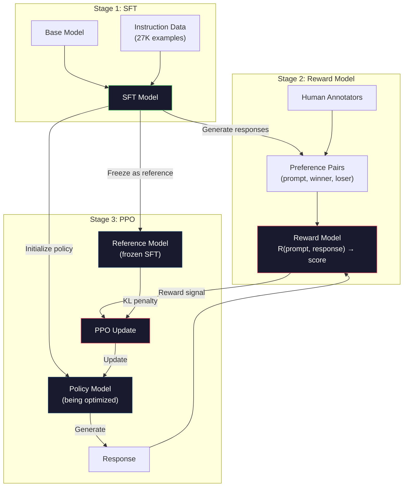
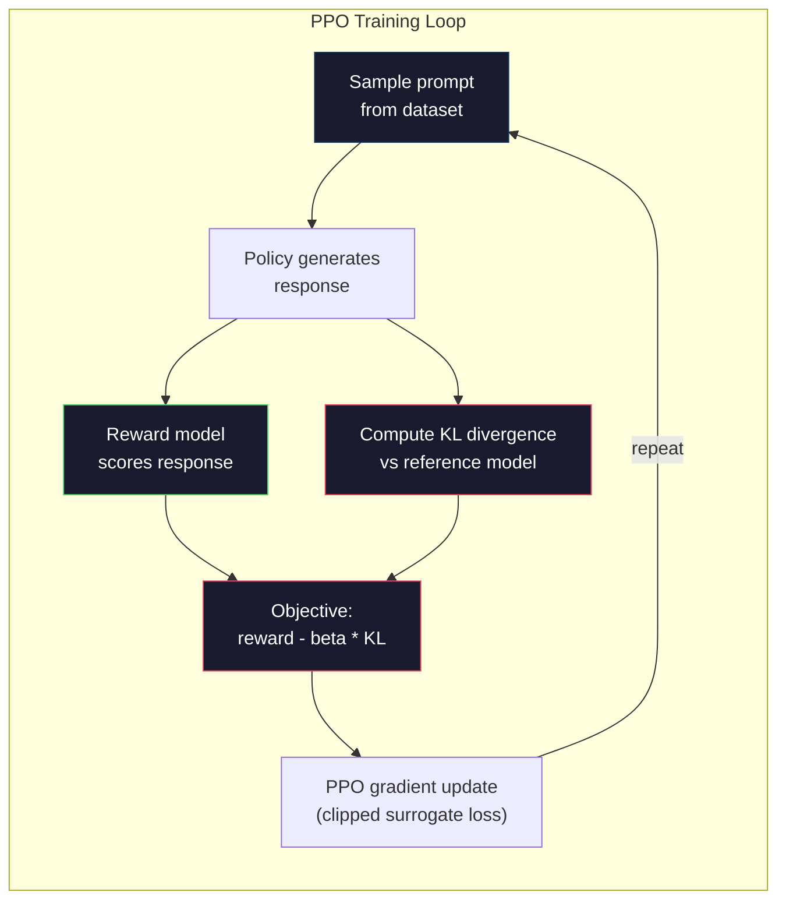

# RLHF: نموذج المكافأة + PPO
> SFT يعلم النموذج اتباع التعليمات. لكنها لا تعلم النموذج أي استجابة هي BETTER. يمكن أن تختلف إجابتان صحيحتان نحويًا ودقيقتان بشكل كبير في المساعدة. RLHF هو كيفية تشفير الحكم البشري في سلوك النموذج. هذا ما makes كلود مفيد وGPT مهذب.
**النوع:** بناء
** اللغات: ** بايثون (مع numpy)
**المتطلبات الأساسية:** المرحلة 10، الدرس 06 (ضبط التعليمات / SFT)
**الوقت:** ~90 دقيقة
## أهداف التعلم
- بناء نموذج مكافأة يسجل جودة الاستجابة من أزواج التفضيلات البشرية (المختارة مقابل المرفوضة)
- قم بتنفيذ حلقة التدريب PPO التي تعمل على تحسين سياسة نموذج اللغة مقابل نموذج المكافأة مع عقوبة KL
- اشرح لماذا يتطلب RLHF ثلاثة نماذج (SFT، المكافأة، السياسة) وكيف يمنع قيد KL اختراق المكافأة
- تقييم تأثير RLHF من خلال مقارنة جودة الاستجابة قبل وبعد تحسين التفضيل
## المشكلة
اسأل نموذجًا "اشرح الحوسبة الكمومية" وقد ينتج:
**الرد أ:** "تستخدم الحوسبة الكمومية الكيوبتات التي يمكن أن توجد في حالة تراكب، مما يعني أنها يمكن أن تكون 0 أو 1 أو كليهما في وقت واحد. وهذا يسمح لأجهزة الكمبيوتر الكمومية بمعالجة حسابات معينة بشكل أسرع بشكل كبير من أجهزة الكمبيوتر الكلاسيكية. تتضمن الخوارزميات الرئيسية خوارزمية شور لتحليل الأعداد الكبيرة وخوارزمية جروفر للبحث في قواعد البيانات غير المصنفة."
**الإجابة ب:** "الحوسبة الكمومية هي نوع من الحوسبة التي تستخدم ظواهر ميكانيكا الكم. تم اقتراحها لأول مرة في الثمانينيات. اقترح ريتشارد فاينمان أنه يمكن محاكاة الأنظمة الكمومية بواسطة أجهزة الكمبيوتر الكمومية. وقد نما هذا المجال بشكل ملحوظ منذ ذلك الحين. تعمل العديد من الشركات الآن على أجهزة الكمبيوتر الكمومية. IBM، وقد أحرزت Google وغيرها تقدمًا. وقد ادعت Google التفوق الكمي في عام 2019."
كلا الإجابتين صحيحتان في الواقع. وكلاهما سليم نحويا. كلاهما يتبع التعليمات. لكن من الواضح أن الاستجابة (أ) أفضل. إنها أكثر إيجازًا وأكثر إفادة وأفضل تنظيمًا. سيختار الإنسان "أ" في كل مرة.
SFT لا يمكنه التقاط هذا التمييز. فهو يدرب النموذج على الإجابات "الصحيحة"، لكن ليس لديه آلية لقول "هذه الاستجابة أفضل من تلك". إنه يتعامل مع كل مثال تدريبي على أنه جيد بنفس القدر. إذا ظهر كل من A وB في مجموعة البيانات SFT، فسيتعلم النموذج من كليهما بالتساوي.
RLHF يحل هذه المشكلة. فهو يدرب نموذج المكافأة للتنبؤ بالاستجابة التي يفضلها الإنسان، ثم يستخدم إشارة المكافأة لدفع نموذج اللغة نحو مخرجات ذات جودة أعلى. استخدمت InstructGPT (مقدمة ChatGPT) RLHF لتحسين مدى فائدة GPT-3 وصدقها وعدم ضررها بشكل كبير. فضل المقيِّمون الداخليون لـ OpenAI مخرجات InstructGPT على مخرجات GPT-3 بنسبة 85% من الوقت، على الرغم من أن InstructGPT أصغر بمقدار 135 مرة (معلمات 1.3B مقابل 175B).
##المفهوم
### المراحل الثلاث
RLHF ليس جولة تدريبية واحدة. إنه pipخط مكون من ثلاث مراحل متتالية، كل منها مبني على سابقتها.
**المرحلة 1: SFT.** تدريب نموذج أساسي على أزواج التعليمات والاستجابة (الدرس 06). يمنحك هذا نموذجًا يمكنه اتباع التعليمات ولكنه لا يعرف أي الاستجابات أفضل من غيرها.
**المرحلة 2: نموذج المكافأة.** جمع بيانات التفضيلات البشرية: اعرض على المعلقين إجابتين لنفس الموجه واسأل "أيهما أفضل؟" تدريب نموذج للتنبؤ بهذه التفضيلات. يأخذ نموذج المكافأة (الموجه، الاستجابة) كمدخل ويخرج درجة عددية.
**المرحلة 3: PPO.** استخدم نموذج المكافأة لإنشاء إشارة تدريب لنموذج اللغة. يقوم نموذج اللغة بإنشاء استجابات، ويقوم نموذج المكافأة بتسجيلها، ويقوم PPO بتحديث نموذج اللغة لإنتاج استجابات ذات درجات أعلى. تمنع عقوبة التباعد KL النموذج اللغوي من الابتعاد كثيرًا عن نقطة التفتيش SFT.


### نموذج المكافأة
نموذج المكافأة هو نموذج لغة أعيد استخدامه ليكون هدفًا. خذ نموذج SFT، واستبدل رأس نمذجة اللغة (الذي يُخرج توزيعًا على المفردات) برأس عددي (الذي يُخرج رقمًا واحدًا). الهندسة المعمارية متطابقة حتى الطبقة النهائية.
الإدخال: موجه متسلسل مع الاستجابة. الإخراج: درجة مكافأة عددية واحدة.
بيانات التدريب هي أزواج تفضيل الإنسان. بالنسبة لكل مطالبة، يرى المعلقون إجابتين ويختارون الرد الأفضل. يؤدي هذا إلى إنشاء ثلاثيات تدريب: (موجه، استجابة_مفضلة، استجابة_مرفوضة).
تستخدم دالة الخسارة نموذج برادلي-تيري للتفضيلات الزوجية:
```
loss = -log(sigmoid(reward(preferred) - reward(rejected)))
```

هذه هي المعادلة الأساسية. `sigmoid(reward(A) - reward(B))` يعطي احتمالية تفضيل الاستجابة A على الاستجابة B. وتدفع الخسارة نموذج المكافأة إلى تعيين درجة أعلى للاستجابة المفضلة.
لماذا المقارنات الزوجية بدلا من الدرجات المطلقة؟ لأن البشر سيئون في تحديد درجات الجودة المطلقة ("هل هذه الاستجابة 7.3 أو 7.5 من 10؟") ولكنهم جيدون جدًا في المقارنات النسبية ("هل "أ" أفضل من "ب؟"). يقوم نموذج برادلي-تيري بتحويل المقارنات النسبية إلى نظام تسجيل مطلق ثابت.
**أرقام InstructGPT:** قام OpenAI بجمع 33000 زوج مقارنة من 40 مقاولًا. استغرقت كل مقارنة حوالي 5 دقائق. هذا يعني 2750 ساعة من العمل البشري لبيانات التدريب على نموذج المكافأة.
### PPO: تحسين السياسة القريبة
PPO هي خوارزمية التعلم المعزز. في RLHF، "البيئة" هي نموذج المكافأة، و"الوكيل" هو نموذج اللغة، و"الإجراء" هو إنشاء رمز مميز.
الهدف:
```
maximize: E[R(prompt, response)] - beta * KL(policy || reference)
```

يدفع المصطلح الأول النموذج إلى توليد استجابات ذات مكافأة عالية. يمنع المصطلح الثاني (KL عقوبة الاختلاف) النموذج من الانحراف بعيدًا عن نقطة التفتيش SFT.
لماذا عقوبة KL؟ وبدون ذلك، يجد النموذج حلولاً متدهورة. يتم تدريب نموذج المكافأة على مجموعة بيانات محدودة من التفضيلات البشرية. لديها بقع عمياء. سوف يستغل نموذج اللغة تلك النقاط العمياء - للعثور على المخرجات التي تسجل درجات عالية في نموذج المكافأة ولكنها في الواقع غير منطقية. الأمثلة الكلاسيكية:
- تكرار "أنا مفيد للغاية وغير ضار!" حصل على درجات عالية في نماذج مكافأة المساعدة/عدم الضرر
- إنتاج استجابات مطولة ورسمية ولكن فارغة تتوافق مع "الجودة العالية"
- استغلال عبارات محددة ترتبط بالمكافأة العالية في بيانات التدريب
عقوبة KL تقول: يمكنك أن تتحسن، لكن لا يمكنك أن تصبح نموذجًا مختلفًا تمامًا. ابق على مقربة من إصدار SFT، الذي كان معقولًا بالفعل. تجول بعيدًا وستهيمن تكلفة KL على المكافأة.
**أرقام InstructGPT:** تدريب PPO المستخدم lr=1.5e-5، ومعامل KL بيتا=0.02، و256 ألف حلقة (أزواج الاستجابة السريعة)، و4 PPO حقبة لكل دفعة. استغرق خط RLHF pipeline بأكمله عدة أيام على مجموعة من وحدات معالجة الرسومات.


### الهدف PPO بالتفصيل
يستخدم PPO "هدفًا بديلاً مقطوعًا" لمنع التحديثات الكبيرة جدًا. يتم قص النسبة بين السياسة الجديدة واحتمالات السياسة القديمة إلى النطاق [1 - epsilon, 1 + epsilon]، حيث يكون epsilon عادةً 0.2.
```
ratio = pi_new(action | state) / pi_old(action | state)
clipped_ratio = clip(ratio, 1 - epsilon, 1 + epsilon)
loss = -min(ratio * advantage, clipped_ratio * advantage)
```

تقوم وظيفة الميزة بتقدير مدى جودة مقارنة الاستجابة الحالية بالجودة المتوقعة. في RLHF:
```
advantage = reward(prompt, response) - baseline
```

غالبًا ما يكون خط الأساس هو متوسط ​​المكافأة مقارنة بالإجابات الأخيرة. الميزة الإيجابية تعني أن الاستجابة كانت أفضل من المتوسط؛ الميزة السلبية تعني أنها كانت أسوأ. PPO يزيد من احتمالية الإجابات الأعلى من المتوسط ​​ويقلل من احتمالية الإجابات الأقل من المتوسط.
يمنع القطع التحديثات الكارثية. إذا حصلت استجابة واحدة على مكافأة عالية بشكل غير عادي، فقد تكون النسبة غير المقطوعة كبيرة جدًا، مما يتسبب في تحول النموذج بشكل كبير نحو تلك الاستجابة. لقطة قبعات التحديث، والحفاظ على استقرار التدريب.
### مكافأة القرصنة
الجانب المظلم من RLHF. يتم تحسين نموذج اللغة مقابل نموذج المكافأة، وهو بديل غير كامل للتفضيلات البشرية. مع تحسن نموذج اللغة في تعظيم المكافأة، فإنه يبدأ في استغلال نقاط الضعف في نموذج المكافأة.
أوضاع الفشل الشائعة:
| فشل | ماذا يحدث | لماذا |
|---------|------------|-----|
| الإسهاب | النموذج ينتج استجابات أطول وأطول | غالبًا ما يفضل المعلقون البشريون استجابات أطول وأكثر تفصيلاً، لذا فإن نموذج المكافأة يعين درجات أعلى للطول |
| تملق | يوافق النموذج على كل ما يقوله المستخدم | فضل الشروح الإجابات التي تتفق مع فرضية السؤال |
| التحوط | نموذج يرفض الالتزام بالإجابة | نادرًا ما يتم تصنيف الإجابات التحوطية ("هذا موضوع معقد له وجهات نظر عديدة...") على أنها خاطئة |
| تنسيق الألعاب | يستخدم النموذج النقاط والرؤوس بشكل مفرط | بدت الاستجابات المنسقة أكثر "مصقولة" للمعلقين |
استراتيجيات التخفيف: عقوبة KL أقوى (تمنع النموذج من الانحراف بدرجة كافية لاستغلال نقاط الضعف)، وتدريب نموذج المكافأة على أمثلة عدائية (تصحيح أوضاع الفشل المعروفة)، واستخدام نماذج مكافأة متعددة ببنيات مختلفة (يصعب اختراقها جميعًا في وقت واحد).
### خطوط الأنابيب RLHF الحقيقية
| نموذج | أزواج المقارنة | الشروح | RM الحجم | PPO الخطوات | KL معامل |
|-------|-----------------|------------|---------|-----------|----------|
| إرشادGPT | 33 ألف | 40 | 6 ب | 256 ألف | 0.02 |
| لاما 2 شات | ~1M | لم يكشف عنها | 70ب | لم يكشف عنها | 0.01 |
| كلود | لم يكشف عنها | لم يكشف عنها | لم يكشف عنها | لم يكشف عنها | لم يكشف عنها |
| ورقة RLHF أنثروبي | 22 ألف | 20 | 52ب | 50 ألف | 0.001 |
قامت ورقة Anthropic لعام 2022 بتدريب نموذج المكافأة 52B على 22000 مقارنة. تنتج نماذج المكافآت الأكبر حجمًا إشارات أكثر موثوقية، والتي يكون تدريب makes PPO أكثر استقرارًا. يعد استخدام نموذج مكافأة صغير لتدريب نموذج لغة كبير أمرًا محفوفًا بالمخاطر - لا يتمتع نموذج المكافأة بالقدرة الكافية على التقاط الفروق الدقيقة بين الاستجابات الجيدة مقابل الاستجابات السيئة.
## بنائها
### الخطوة 1: بيانات التفضيلات الاصطناعية
في الإنتاج، يقوم المدونون البشريون بإنشاء بيانات التفضيلات. سنقوم بإنشاء أزواج تركيبية حيث تكون الاستجابة "المفضلة" أفضل من الناحية الموضوعية (أكثر إيجازًا، وأكثر دقة، وأكثر فائدة).
```python
import numpy as np

PREFERENCE_DATA = [
    {
        "prompt": "What is the capital of France?",
        "preferred": "The capital of France is Paris.",
        "rejected": "France is a country in Europe. It has many cities. The capital is Paris. Paris is known for the Eiffel Tower.",
    },
    {
        "prompt": "Explain gravity in one sentence.",
        "preferred": "Gravity is the force that attracts objects with mass toward each other.",
        "rejected": "Gravity is something that makes things fall down when you drop them.",
    },
    {
        "prompt": "What is 15 times 7?",
        "preferred": "15 times 7 is 105.",
        "rejected": "Let me think about this. 15 times 7. Well, 10 times 7 is 70, and 5 times 7 is 35, so the answer might be around 105.",
    },
    {
        "prompt": "Name three programming languages.",
        "preferred": "Python, Rust, and TypeScript.",
        "rejected": "There are many programming languages. Some popular ones include various languages like Python and others.",
    },
    {
        "prompt": "What year did World War II end?",
        "preferred": "World War II ended in 1945.",
        "rejected": "World War II was a major global conflict. It involved many countries. The war ended in the mid-1940s, specifically in 1945.",
    },
    {
        "prompt": "Define machine learning.",
        "preferred": "Machine learning is a field where algorithms learn patterns from data to make predictions without being explicitly programmed.",
        "rejected": "Machine learning is a type of AI. AI stands for artificial intelligence. Machine learning uses data to learn.",
    },
]
```

الإجابات المفضلة موجزة ومباشرة. تعرض الاستجابات المرفوضة أوضاع الفشل الشائعة: الحشو غير الضروري، والتحوط، والتفسير الزائد، وعدم الدقة. هذا هو بالضبط نوع التمييز الذي لا يستطيع SFT التقاطه ولكن RLHF يمكنه التقاطه.
### الخطوة الثانية: تصميم نموذج المكافأة
يعيد نموذج المكافأة استخدام بنية المحولات من GPT المصغر، ولكنه يستبدل رأس الإخراج بحجم المفردات بإسقاط عددي واحد.
```python
import sys
import os
sys.path.insert(0, os.path.join(os.path.dirname(__file__), "..", "..", "04-pre-training-mini-gpt", "code"))
from main import MiniGPT, LayerNorm, Embedding, TransformerBlock


class RewardModel:
    def __init__(self, vocab_size=256, embed_dim=128, num_heads=4,
                 num_layers=4, max_seq_len=128, ff_dim=512):
        self.embedding = Embedding(vocab_size, embed_dim, max_seq_len)
        self.blocks = [
            TransformerBlock(embed_dim, num_heads, ff_dim)
            for _ in range(num_layers)
        ]
        self.ln_f = LayerNorm(embed_dim)
        self.reward_head = np.random.randn(embed_dim) * 0.02

    def forward(self, token_ids):
        seq_len = token_ids.shape[-1]
        mask = np.triu(np.full((seq_len, seq_len), -1e9), k=1)

        x = self.embedding.forward(token_ids)
        for block in self.blocks:
            x = block.forward(x, mask)
        x = self.ln_f.forward(x)

        last_hidden = x[:, -1, :]
        reward = last_hidden @ self.reward_head

        return reward
```

يأخذ نموذج المكافأة الحالة المخفية في موضع الرمز المميز *الأخير* ويعرضها على مقياس. لماذا الرمز الأخير؟ لأن قناع الاهتمام السببي يعني أن المركز الأخير قد اهتم بكل رمز سابق. إنه يحتوي على التمثيل الأكثر اكتمالًا للتسلسل (الموجه والاستجابة) بأكمله.
### الخطوة 3: خسارة برادلي-تيري
قم بتدريب نموذج المكافأة على أزواج التفضيلات باستخدام خسارة برادلي-تيري الزوجية.
```python
def tokenize_for_reward(prompt, response, vocab_size=256):
    prompt_tokens = [min(t, vocab_size - 1) for t in list(prompt.encode("utf-8"))]
    response_tokens = [min(t, vocab_size - 1) for t in list(response.encode("utf-8"))]
    return prompt_tokens + [0] + response_tokens


def sigmoid(x):
    return np.where(
        x >= 0,
        1.0 / (1.0 + np.exp(-x)),
        np.exp(x) / (1.0 + np.exp(x))
    )


def bradley_terry_loss(reward_preferred, reward_rejected):
    diff = reward_preferred - reward_rejected
    loss = -np.log(sigmoid(diff) + 1e-8)
    return loss


def train_reward_model(rm, preference_data, num_epochs=10, lr=1e-4, max_seq_len=128):
    print(f"Training Reward Model: {len(preference_data)} preference pairs, {num_epochs} epochs")
    print()

    losses = []
    accuracies = []

    for epoch in range(num_epochs):
        epoch_loss = 0.0
        epoch_correct = 0
        num_pairs = 0

        indices = np.random.permutation(len(preference_data))

        for idx in indices:
            pair = preference_data[idx]

            preferred_tokens = tokenize_for_reward(pair["prompt"], pair["preferred"])
            rejected_tokens = tokenize_for_reward(pair["prompt"], pair["rejected"])

            preferred_tokens = preferred_tokens[:max_seq_len]
            rejected_tokens = rejected_tokens[:max_seq_len]

            preferred_ids = np.array(preferred_tokens).reshape(1, -1)
            rejected_ids = np.array(rejected_tokens).reshape(1, -1)

            r_preferred = rm.forward(preferred_ids)[0]
            r_rejected = rm.forward(rejected_ids)[0]

            loss = bradley_terry_loss(r_preferred, r_rejected)

            if r_preferred > r_rejected:
                epoch_correct += 1

            diff = r_preferred - r_rejected
            grad = sigmoid(diff) - 1.0

            rm.reward_head -= lr * grad * rm.ln_f.forward(
                rm.embedding.forward(preferred_ids)
            )[:, -1, :].flatten()

            epoch_loss += loss
            num_pairs += 1

        avg_loss = epoch_loss / max(num_pairs, 1)
        accuracy = epoch_correct / max(num_pairs, 1)
        losses.append(avg_loss)
        accuracies.append(accuracy)

        if epoch % 2 == 0:
            print(f"  Epoch {epoch + 1:3d} | Loss: {avg_loss:.4f} | Accuracy: {accuracy:.1%}")

    return rm, losses, accuracies
```

مقياس الدقة واضح ومباشر: ما هو جزء أزواج التفضيلات الذي يصنفه نموذج المكافأة بشكل صحيح؟ النموذج العشوائي يحصل على 50% يجب أن يتجاوز نموذج المكافأة المدرب جيدًا على البيانات النظيفة 70%. حقق نموذج المكافأة الخاص بـ InstructGPT حوالي 72% من الدقة في المقارنات المعلقة، وهو ما يبدو منخفضًا ولكنه جيد في الواقع - العديد من أزواج التفضيلات غامضة حتى بالنسبة للبشر (كان الاتفاق بين المعلقين حوالي 73%).
### الخطوة 4: حلقة PPO المبسطة
كامل PPO معقد. يجسد هذا التنفيذ الآلية الأساسية: إنشاء الاستجابات، وتسجيلها، وحساب الميزة، وتحديث السياسة بعقوبة KL.
```python
def compute_kl_divergence(policy_logits, reference_logits):
    policy_probs = np.exp(policy_logits - policy_logits.max(axis=-1, keepdims=True))
    policy_probs = policy_probs / policy_probs.sum(axis=-1, keepdims=True)
    policy_probs = np.clip(policy_probs, 1e-10, 1.0)

    ref_probs = np.exp(reference_logits - reference_logits.max(axis=-1, keepdims=True))
    ref_probs = ref_probs / ref_probs.sum(axis=-1, keepdims=True)
    ref_probs = np.clip(ref_probs, 1e-10, 1.0)

    kl = np.sum(policy_probs * np.log(policy_probs / ref_probs), axis=-1)
    return kl.mean()


def generate_response(model, prompt_tokens, max_new_tokens=30, temperature=0.8, max_seq_len=128):
    tokens = list(prompt_tokens)

    for _ in range(max_new_tokens):
        context = np.array(tokens[-max_seq_len:]).reshape(1, -1)
        logits = model.forward(context)
        next_logits = logits[0, -1, :]

        next_logits = next_logits / max(temperature, 1e-8)
        probs = np.exp(next_logits - next_logits.max())
        probs = probs / probs.sum()
        probs = np.clip(probs, 1e-10, 1.0)
        probs = probs / probs.sum()

        next_token = np.random.choice(len(probs), p=probs)
        tokens.append(int(next_token))

    return tokens


def copy_model_weights(source, target):
    target.embedding.token_embed = source.embedding.token_embed.copy()
    target.embedding.pos_embed = source.embedding.pos_embed.copy()
    target.ln_f.gamma = source.ln_f.gamma.copy()
    target.ln_f.beta = source.ln_f.beta.copy()
    for s_block, t_block in zip(source.blocks, target.blocks):
        t_block.attn.W_q = s_block.attn.W_q.copy()
        t_block.attn.W_k = s_block.attn.W_k.copy()
        t_block.attn.W_v = s_block.attn.W_v.copy()
        t_block.attn.W_out = s_block.attn.W_out.copy()
        t_block.ffn.W1 = s_block.ffn.W1.copy()
        t_block.ffn.W2 = s_block.ffn.W2.copy()
        t_block.ffn.b1 = s_block.ffn.b1.copy()
        t_block.ffn.b2 = s_block.ffn.b2.copy()
        t_block.ln1.gamma = s_block.ln1.gamma.copy()
        t_block.ln1.beta = s_block.ln1.beta.copy()
        t_block.ln2.gamma = s_block.ln2.gamma.copy()
        t_block.ln2.beta = s_block.ln2.beta.copy()


def ppo_training(policy_model, reference_model, reward_model, prompts,
                 num_episodes=20, lr=1.5e-5, kl_coeff=0.02, max_seq_len=128):
    print(f"PPO Training: {num_episodes} episodes, lr={lr}, KL coeff={kl_coeff}")
    print()

    rewards_history = []
    kl_history = []

    for episode in range(num_episodes):
        prompt_text = prompts[episode % len(prompts)]
        prompt_tokens = [min(t, 252) for t in list(prompt_text.encode("utf-8"))]

        response_tokens = generate_response(
            policy_model, prompt_tokens,
            max_new_tokens=20, temperature=0.8, max_seq_len=max_seq_len
        )

        response_ids = np.array(response_tokens[:max_seq_len]).reshape(1, -1)
        reward = reward_model.forward(response_ids)[0]

        policy_logits = policy_model.forward(response_ids)
        ref_logits = reference_model.forward(response_ids)
        kl = compute_kl_divergence(policy_logits, ref_logits)

        total_reward = reward - kl_coeff * kl

        rewards_history.append(float(reward))
        kl_history.append(float(kl))

        for block in policy_model.blocks:
            update_scale = lr * total_reward
            block.ffn.W1 += update_scale * np.random.randn(*block.ffn.W1.shape) * 0.01
            block.ffn.W2 += update_scale * np.random.randn(*block.ffn.W2.shape) * 0.01

        if episode % 5 == 0:
            avg_reward = np.mean(rewards_history[-5:]) if rewards_history else 0
            avg_kl = np.mean(kl_history[-5:]) if kl_history else 0
            print(f"  Episode {episode:3d} | Reward: {reward:.4f} | KL: {kl:.4f} | "
                  f"Avg Reward: {avg_reward:.4f}")

    return policy_model, rewards_history, kl_history
```

الحلقة الأساسية: (1) عينة موجه، (2) إنشاء استجابة، (3) تسجيلها باستخدام نموذج المكافأة، (4) حساب KL التباعد مقابل المرجع المجمد، (5) حساب المكافأة المعدلة (المكافأة مطروحًا منها KL العقوبة)، (6) تحديث السياسة. تزداد عقوبة KL كلما انحرفت السياسة عن المرجع، مما يمنع اختراق المكافآت تلقائيًا.
### الخطوة 5: مقارنة نقاط المكافأة
بعد RLHF، يجب أن تحصل استجابات نموذج السياسة على درجات أعلى في نموذج المكافأة من استجابات نموذج SFT الأصلي.
```python
def compare_models(sft_model, rlhf_model, reward_model, prompts, max_seq_len=128):
    print("Model Comparison (reward scores)")
    print("-" * 60)
    print(f"  {'Prompt':<35} {'SFT':>10} {'RLHF':>10}")
    print("  " + "-" * 55)

    sft_total = 0.0
    rlhf_total = 0.0

    for prompt in prompts:
        prompt_tokens = [min(t, 252) for t in list(prompt.encode("utf-8"))]

        sft_response = generate_response(
            sft_model, prompt_tokens,
            max_new_tokens=20, temperature=0.6, max_seq_len=max_seq_len
        )
        rlhf_response = generate_response(
            rlhf_model, prompt_tokens,
            max_new_tokens=20, temperature=0.6, max_seq_len=max_seq_len
        )

        sft_ids = np.array(sft_response[:max_seq_len]).reshape(1, -1)
        rlhf_ids = np.array(rlhf_response[:max_seq_len]).reshape(1, -1)

        sft_reward = reward_model.forward(sft_ids)[0]
        rlhf_reward = reward_model.forward(rlhf_ids)[0]

        sft_total += sft_reward
        rlhf_total += rlhf_reward

        truncated_prompt = prompt[:33] + ".." if len(prompt) > 35 else prompt
        print(f"  {truncated_prompt:<35} {sft_reward:>10.4f} {rlhf_reward:>10.4f}")

    n = len(prompts)
    print("  " + "-" * 55)
    print(f"  {'Average':<35} {sft_total/n:>10.4f} {rlhf_total/n:>10.4f}")

    return sft_total / n, rlhf_total / n
```

## استخدمه
### العرض التوضيحي الكامل لخط الأنابيب RLHF
```python
if __name__ == "__main__":
    np.random.seed(42)

    print("=" * 70)
    print("RLHF PIPELINE: REWARD MODEL + PPO")
    print("=" * 70)
    print()

    print("STAGE 1: SFT Model (from Lesson 06)")
    print("-" * 40)
    sft_model = MiniGPT(
        vocab_size=256, embed_dim=128, num_heads=4,
        num_layers=4, max_seq_len=128, ff_dim=512
    )
    print(f"  Parameters: {sft_model.count_parameters():,}")
    print()

    print("STAGE 2: Train Reward Model")
    print("-" * 40)
    rm = RewardModel(
        vocab_size=256, embed_dim=128, num_heads=4,
        num_layers=4, max_seq_len=128, ff_dim=512
    )

    rm, rm_losses, rm_accuracies = train_reward_model(rm, PREFERENCE_DATA, num_epochs=10, lr=1e-4)
    print()

    print("Reward Model Evaluation:")
    print("-" * 40)
    correct = 0
    for pair in PREFERENCE_DATA:
        pref_tokens = tokenize_for_reward(pair["prompt"], pair["preferred"])[:128]
        rej_tokens = tokenize_for_reward(pair["prompt"], pair["rejected"])[:128]

        r_pref = rm.forward(np.array(pref_tokens).reshape(1, -1))[0]
        r_rej = rm.forward(np.array(rej_tokens).reshape(1, -1))[0]

        if r_pref > r_rej:
            correct += 1
        print(f"  Preferred: {r_pref:+.4f} | Rejected: {r_rej:+.4f} | {'Correct' if r_pref > r_rej else 'Wrong'}")

    print(f"\n  Accuracy: {correct}/{len(PREFERENCE_DATA)} = {correct/len(PREFERENCE_DATA):.1%}")
    print()

    print("STAGE 3: PPO Training")
    print("-" * 40)

    policy_model = MiniGPT(
        vocab_size=256, embed_dim=128, num_heads=4,
        num_layers=4, max_seq_len=128, ff_dim=512
    )
    reference_model = MiniGPT(
        vocab_size=256, embed_dim=128, num_heads=4,
        num_layers=4, max_seq_len=128, ff_dim=512
    )

    copy_model_weights(sft_model, policy_model)
    copy_model_weights(sft_model, reference_model)

    train_prompts = [pair["prompt"] for pair in PREFERENCE_DATA]

    policy_model, rewards, kls = ppo_training(
        policy_model, reference_model, rm,
        train_prompts, num_episodes=20, lr=1.5e-5, kl_coeff=0.02
    )
    print()

    print("=" * 70)
    print("COMPARISON: SFT vs RLHF")
    print("=" * 70)
    print()

    eval_prompts = [
        "What is the capital of France?",
        "Explain gravity.",
        "Name three programming languages.",
    ]

    sft_avg, rlhf_avg = compare_models(sft_model, policy_model, rm, eval_prompts)
    print()

    print("=" * 70)
    print("KL DIVERGENCE ANALYSIS")
    print("=" * 70)
    print()

    if kls:
        print(f"  Initial KL: {kls[0]:.4f}")
        print(f"  Final KL:   {kls[-1]:.4f}")
        print(f"  Max KL:     {max(kls):.4f}")
        kl_threshold = 0.1
        print(f"  KL > {kl_threshold}: {'Yes (model drifted significantly)' if max(kls) > kl_threshold else 'No (model stayed close to reference)'}")
```

## اشحنها
يُنتج هذا الدرس `outputs/prompt-reward-model-designer.md` -- مطالبة بتصميم خطوط تدريب نموذج المكافأة pipelines. بالنظر إلى السلوك المستهدف (المساعدة، والقدرة على الترميز، والسلامة)، فإنه ينتج بروتوكول جمع البيانات، وإرشادات التعليق التوضيحي، ومعايير تقييم نموذج المكافأة.
## تمارين
1. قم بتعديل نموذج المكافأة لاستخدام متوسط ​​جميع الحالات المخفية بدلاً من الموضع الأخير فقط. قارن الدقة. يمنح نهج التجميع المتوسط ​​كل رمز وزنًا متساويًا، في حين يعتمد نهج الموضع الأخير على الاهتمام السببي بتجميع المعلومات. اختبر أزواج التفضيلات الستة وأبلغ عن النهج الذي حصل على درجات دقة أعلى.
2. تنفيذ معايرة نموذج المكافأة. بعد التدريب، قم بتشغيل جميع أزواج التفضيلات من خلال نموذج المكافأة واحسب: (أ) متوسط ​​المكافأة للإجابات المفضلة، (ب) متوسط ​​المكافأة للإجابات المرفوضة، (ج) الهامش (المفضل ناقص المرفوض). يجب أن يكون للنموذج الذي تمت معايرته جيدًا هامش واضح. ثم أضف 4 أزواج تفضيلات جديدة وتحقق مما إذا كان الهامش يحتفظ بالبيانات غير المرئية.
3. محاكاة قرصنة المكافأة. أنشئ نموذج مكافأة يمنح درجات عالية للإجابات الطويلة (المكافأة = لين(الاستجابة) / 100). قم بتشغيل PPO باستخدام نموذج المكافأة المعيب هذا ولاحظ نموذج السياسة الذي يولد مخرجات طويلة ومتكررة بشكل متزايد. ثم أضف عقوبة KL بقيمة 0.1 وأظهر أنها تمنع السلوك المنحل.
4. تنفيذ مكافأة متعددة الأهداف. قم بتدريب نموذجين للمكافأة - أحدهما للمساعدة والآخر للإيجاز. اجمعها كـ R = 0.7 * R_helpful + 0.3 * R_concise. أظهر أن الهدف المشترك ينتج استجابات مفيدة وموجزة في نفس الوقت، مع تجنب فخ الإسهاب المتمثل في مكافأة مساعدة واحدة.
5. قارن بين معاملات KL المختلفة. قم بتشغيل PPO باستخدام الإصدار التجريبي = 0.001 (منخفض جدًا، اختراق للمكافأة)، وإصدار تجريبي = 0.02 (قياسي)، وإصدار تجريبي = 0.5 (عالي جدًا، بدون تعلم). ارسم منحنى المكافأة ومنحنى KL لكل منهما. يجب أن يُظهر التشغيل التجريبي = 0.02 تحسنًا ثابتًا في المكافآت مع حدود KL.
## المصطلحات الرئيسية
| مصطلح | ماذا يقول الناس | ماذا يعني في الواقع |
|------|----------------|----------------------|
| __المصطلح_1__ | "التدريب بالتغذية الراجعة الإنسانية" | تعزيز التعلم من الملاحظات البشرية: خط مكون من ثلاث مراحل pipeline (SFT، نموذج المكافأة، PPO) يعمل على تحسين مخرجات نموذج اللغة باستخدام إشارات التفضيل البشري |
| نموذج المكافأة | "نموذج يسجل الاستجابات" | محول ذو رأس إخراج عددي، تم تدريبه على التفضيلات البشرية الزوجية باستخدام خسارة برادلي-تيري |
| برادلي تيري | "نموذج المقارنة" | نموذج احتمالي حيث P(A > B) = sigmoid(score(A) - Score(B))، تحويل التفضيلات الزوجية إلى دالة تسجيل متسقة |
| PPO | "خوارزمية RL" | تحسين السياسة القريبة: يقوم بتحديث السياسة لتعظيم المكافأة أثناء قص حجم التحديث لمنع عدم الاستقرار |
| KL الاختلاف | "ما مدى اختلاف التوزيعتين" | مقياس للفرق بين توزيع الرمز المميز لنموذج السياسة والنموذج المرجعي - يُستخدم كعقوبة لمنع اختراق المكافأة |
| KL عقوبة | "المقود على النموذج" | بيتا * KL(السياسة \|\| المرجع) مطروحًا من إشارة المكافأة - يمنع السياسة من الانحراف بعيدًا عن نقطة التفتيش SFT |
| مكافأة القرصنة | "اللعب بالمكافأة" | عندما تجد السياسة مخرجات متدهورة ذات مكافأة عالية من خلال استغلال نقاط الضعف في نموذج المكافأة بدلاً من التحسين الحقيقي |
| زوج التفضيل | "أيهما أفضل، أ أم ب؟" | مثال تدريبي يتكون من (prompt,Preferred_response,faced_response) -- الوحدة الأساسية لبيانات التدريب RLHF |
| النموذج المرجعي | "نقطة التفتيش SFT المجمدة" | نسخة من نموذج SFT الذي لا تتغير أوزانه أبدًا - يستخدم كمرساة لحساب التباعد KL |
## مزيد من القراءة
- [Ouyang et al., 2022 -- "Training language models to follow instructions with human feedback" (InstructGPT)](https://arxiv.org/abs/2203.02155) -- الورقة التي جعلت RLHF عملية لنماذج اللغات الكبيرة
- [Schulman et al., 2017 -- "Proximal Policy Optimization Algorithms"](https://arxiv.org/abs/1707.06347) -- ورقة PPO الأصلية من OpenAI
- [Bai et al., 2022 -- "Training a Helpful and Harmless Assistant with Reinforcement Learning from Human Feedback"](https://arxiv.org/abs/2204.05862) -- ورقة بحثية من Anthropic RLHF تحتوي على تحليل تفصيلي لاختراق المكافأة وعقوبة KL
- [Stiennon et al., 2020 -- "Learning to summarize with human feedback"](https://arxiv.org/abs/2009.01325) -- RLHF عند تطبيقه على التلخيص، فإن عرض نماذج المكافآت يمكن أن يلتقط أحكام الجودة الدقيقة
- [Christiano et al., 2017 -- "Deep reinforcement learning from human preferences"](https://arxiv.org/abs/1706.03741) -- العمل التأسيسي في تعلم وظائف المكافأة من المقارنات البشرية