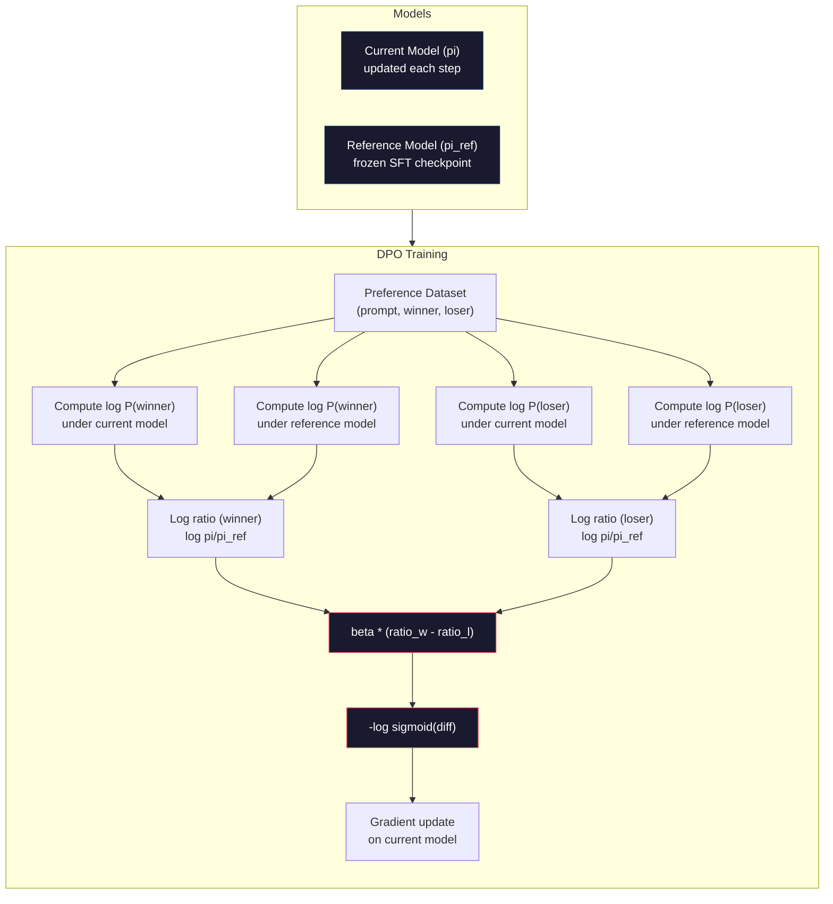

# DPO: تحسين التفضيل المباشر
> RLHF يعمل. ويتطلب أيضًا تدريب ثلاثة نماذج (SFT، نموذج المكافأة، السياسة)، وإدارة عدم استقرار PPO، وضبط عقوبة KL. DPO يسأل: ماذا لو كان بإمكانك تخطي كل ذلك؟ DPO يقوم مباشرة بتحسين نموذج اللغة على أزواج التفضيلات. لا يوجد نموذج مكافأة. لا PPO. حلقة تدريب واحدة. نفس النتائج.
**النوع:** بناء
** اللغات: ** بايثون (مع numpy)
**المتطلبات الأساسية:** المرحلة 10، الدرس 07 (RLHF)
**الوقت:** ~90 دقيقة
## أهداف التعلم
- تنفيذ تدريب DPO الذي يعمل بشكل مباشر على تحسين نموذج اللغة على أزواج التفضيلات دون نموذج مكافأة منفصل
- استنتج دالة الخسارة DPO واشرح كيف تمثل ضمنيًا نموذج المكافأة من خلال احتمالات سجل السياسة
- قارن بين DPO وRLHF من حيث استقرار التدريب وتكلفة الحوسبة وعدد النماذج المطلوبة
- ضبط معلمة بيتا للتحكم في مدى انحراف السياسة المدربة عن النموذج المرجعي
## المشكلة
لقد قمت ببناء خط RLHF pipe في الدرس 07. ثلاث مراحل. ثلاثة نماذج. تم تحسين نموذج SFT ونموذج المكافأة ونموذج السياسة باستخدام PPO. يتطلب نموذج المكافأة وحده الآلاف من أزواج التفضيلات البشرية وحلقة تدريب منفصلة. يتطلب PPO ضبطًا دقيقًا لمعامل KL ومعدل التعلم ونسبة المقطع وعدد الفترات.
من الناحية العملية، يعد تدريب PPO غير مستقر بشكل ملحوظ. تؤدي التغييرات الصغيرة في المعلمات الفائقة إلى تباعد التدريب. إن نموذج المكافأة يشكل بديلاً غير كامل للتفضيلات البشرية، وتجد السياسة السبل لاستغلال نقاط ضعفه. تساعد عقوبة KL ولكنها تتطلب ضبطًا خاصًا بها - فهي منخفضة جدًا وتحصل على مكافأة، أما مرتفعة جدًا وبالكاد يتعلم النموذج.
هذا التعقيد هو السبب وراء معاناة معظم النماذج مفتوحة المصدر مع RLHF لسنوات بعد نشر InstructGPT. خط pipe ذو المراحل الثلاث هش. كل مرحلة لها أوضاع الفشل الخاصة بها والأخطاء المركبة.
في مايو 2023، نشر رافائيل رافايلوف وأرتشيت شارما وزملاؤه في جامعة ستانفورد "تحسين التفضيل المباشر: نموذج لغتك هو نموذج مكافأة سرًا". الفكرة الأساسية: لا تحتاج إلى نموذج مكافأة منفصل. يتم تحديد وظيفة المكافأة المثالية رياضيًا من خلال احتمالات الرمز المميز لنموذج اللغة. يمكنك تخطي نموذج المكافأة بالكامل وتحسين نموذج اللغة مباشرة على أزواج التفضيلات.
DPO يقلل RLHF إلى خطوة تعليمية واحدة تحت الإشراف. نموذج واحد. وظيفة خسارة واحدة. حلقة تدريب واحدة. لا يوجد تعلم معزز. Zephyr-7B، أحد النماذج الأولى التي استخدمت DPO على نطاق واسع، يطابق أو يتفوق على النماذج التي تم تدريبها باستخدام RLHF بالكامل في العديد من المعايير. التعريف المستخدم DPO كجزء من محاذاة Llama 3 pipeline. لقد استشهدت الأنثروبيك بأساليب أسلوب DPO في أبحاث المحاذاة الخاصة بها.
##المفهوم
### البصيرة الرئيسية
RLHF يعمل على تحسين هذا الهدف:
```
maximize: E[R(x, y)] - beta * KL(pi || pi_ref)
```

حيث R هو نموذج المكافأة، وpi هي السياسة، وpi_ref هو النموذج المرجعي، وbeta هو المعامل KL.
أظهرت ورقة DPO أن هذا الهدف له الحل الأمثل ذو الشكل المغلق. بالنسبة لأي دالة مكافأة R، فإن السياسة المثلى هي:
```
pi*(y | x) = pi_ref(y | x) * exp(R(x, y) / beta) / Z(x)
```

حيث Z(x) هو ثابت التطبيع. إعادة الترتيب:
```
R(x, y) = beta * log(pi*(y | x) / pi_ref(y | x)) + beta * log Z(x)
```

هذا هو الاختراق. ويتم التعبير عن المكافأة بالكامل من حيث احتمالات نموذج السياسة واحتمالات النموذج المرجعي. لا تحتاج إلى تدريب نموذج مكافأة منفصل. المكافأة * ضمنية * في نسبة الاحتمال.
استبدال هذا في نموذج تفضيل برادلي-تيري:
```
P(y_w > y_l | x) = sigmoid(R(x, y_w) - R(x, y_l))
                  = sigmoid(beta * (log pi(y_w|x)/pi_ref(y_w|x) - log pi(y_l|x)/pi_ref(y_l|x)))
```

يتم إلغاء شروط Z(x) لأن كلا الاستجابتين مشروطتان بنفس الموجه x. ما تبقى هو وظيفة فقط لاحتمالات سجل نموذج السياسة واحتمالات سجل النموذج المرجعي على الاستجابات المفضلة والمرفوضة.
### الخسارة DPO
```
L_DPO = -log(sigmoid(beta * (log pi(y_w|x)/pi_ref(y_w|x) - log pi(y_l|x)/pi_ref(y_l|x))))
```

دعونا نفك كل قطعة:
- **y_w** = الاستجابة المفضلة (الفائزة).
- **y_l** = الاستجابة المرفوضة (الخاسرة).
- **x** = موجه
- **pi** = النموذج الحالي (قيد التدريب)
- **pi_ref** = النموذج المرجعي (نقطة تفتيش SFT المجمدة)
- **بيتا** = معلمة درجة الحرارة التي تتحكم في الانحراف عن المرجع (عادة من 0.1 إلى 0.5)
النسبة `log pi(y|x) / pi_ref(y|x)` هي نسبة احتمالية السجل. عندما تكون هذه النسبة موجبة، فإن النموذج الحالي يعين احتمالية أعلى للاستجابة y مقارنة بالمرجع. عندما تكون النتيجة سلبية، فإن النموذج الحالي يعين احتمالية أقل.
تدفع خسارة DPO النموذج إلى زيادة نسبة احتمالية السجل للاستجابات المفضلة وتقليلها للاستجابات المرفوضة. تتحكم معلمة بيتا في مدى قوة انحراف النموذج عن المرجع - بيتا الصغيرة تعني الانحرافات الكبيرة المسموح بها، بيتا الكبيرة تبقي النموذج قريبًا من المرجع.


### لماذا DPO أبسط
| الجانب | RLHF (PPO) | __المصطلح_2__ |
|--------|----------|-----|
| نماذج للتدريب | 3 (__المصطلح_3__ + المكافأة + السياسة) | 1 (السياسة فقط) |
| حلقات التدريب | 3 (SFT، RM التدريب، PPO) | 2 (SFT، ​​DPO) |
| المعلمات الفائقة | lr، KL coeff، نسبة المقطع، RM lr، العصور x3 | lr، بيتا، العصور |
| نموذج المكافأة | مطلوب (تدريب منفصل) | ضمنية في احتمالات النموذج |
| RL خوارزمية | PPO (معقد وغير مستقر) | التعلم الخاضع للإشراف (مستقر) |
| GPU الذاكرة | 3-4 نماذج في الذاكرة خلال PPO | 2 نموذج (الحالي + المرجع) |
| الاستقرار التدريبي | حساس للمعلمات المفرطة | قوية، تشبه SFT |
DPO يحتاج إلى نموذجين في الذاكرة أثناء التدريب - النموذج الحالي والمرجع المجمد. يحتاج RLHF إلى ثلاثة أو أربعة: السياسة، والمرجع، ونموذج المكافأة، وخط الأساس لوظيفة القيمة بشكل اختياري. بالنسبة للطراز 70B، تستهلك كل نسخة 140 جيجابايت في FP16. إن التوفير في الذاكرة الناتج عن إلغاء نموذج المكافأة كبير.
### عندما يتفوق DPO على RLHF
**مجموعات بيانات صغيرة.** مع وجود 5000 إلى 20000 زوج من التفضيلات، غالبًا ما يتطابق DPO مع RLHF أو يتجاوزه. يحتاج نموذج المكافأة في RLHF إلى بيانات كافية للتعميم -- مع وجود بيانات محدودة، فإنه يفرط في التجهيز وينتج إشارات مكافأة غير موثوقة. DPO يتجاوز هذه المشكلة من خلال عدم الحاجة إلى نموذج مكافأة على الإطلاق.
**حساب محدود.** يتطلب DPO ما يقرب من ثلث حساب RLHF الكامل (حلقة تدريب واحدة بدلاً من ثلاث). بالنسبة للفرق التي ليس لديها مجموعات كبيرة GPU، هذا هو الاختيار العملي.
**التكرار السريع.** هل ترغب في تجربة 10 مجموعات بيانات تفضيلات مختلفة لمعرفة أي منها ينتج أفضل نموذج؟ يتيح لك DPO إجراء كل تجربة خلال ساعات. RLHF يتطلب إعادة تدريب نموذج المكافأة لكل مجموعة بيانات.
### عندما يتفوق RLHF على DPO
**تدريب واسع النطاق.** على مقياس GPT-4 أو كلود، يمكن لنموذج المكافأة المنفصل الخاص بـ RLHF التقاط إشارات تفضيل أكثر دقة. يعمل نموذج المكافأة كوظيفة خسارة مكتسبة تتكيف مع معايير الجودة المعقدة.
**إشارات مكافأة معقدة.** عندما تتضمن كلمة "الأفضل" أبعادًا متعددة (المفيدة، وعدم الضرر، والصدق)، يمكن لنموذج المكافأة أن يتعلم هذه المقايضة متعددة الأهداف. DPO يتعامل مع كل زوج من التفضيلات كإشارة ثنائية - أحدهما أفضل والآخر أسوأ - دون تحديد السبب.
**المحاذاة التكرارية.** RLHF pipيمكن للخطوط إنشاء استجابات جديدة باستخدام السياسة الحالية، وجعل البشر يقيمونها، وإعادة تدريب نموذج المكافأة في حلقة عبر الإنترنت. يعمل DPO على مجموعة بيانات ثابتة من أزواج التفضيلات. يستخدم AI الدستوري (النهج الإنساني) هذه الخاصية التكرارية لـ RLHF على نطاق واسع.
### ما بعد DPO: KTO، ORPO، SimPO
DPO ألهمت عائلة من طرق المحاذاة المبسطة.
**KTO (تحسين كانيمان-تفيرسكي، 2024):** لا تحتاج حتى إلى أزواج. يعمل KTO مع التعليقات غير المقترنة -- ما عليك سوى تصنيف كل استجابة على أنها "جيدة" أو "سيئة" دون مقارنتها ببديل. وهذا يبسط بشكل كبير عملية جمع البيانات. بدلاً من إظهار إجابتين للمعلقين والسؤال "أيهما أفضل؟"، يمكنك عرض إجابة واحدة وتسأل "هل هذا جيد؟" تطبق دالة الخسارة النفور من الخسارة من نظرية الاحتمال: تتم معاقبة الاستجابات السيئة أكثر من مكافأة الاستجابات الجيدة.
**ORPO (تحسين تفضيلات نسبة الأرجحية، 2024):** يجمع بين SFT والمواءمة في خطوة تدريب واحدة. بدلاً من القيام أولاً بـ SFT ثم DPO، يقوم ORPO بتعديل الخسارة SFT لتشمل إشارة تفضيل. تحتوي الخسارة على فترتين: خسارة التنبؤ القياسية للرمز التالي على الاستجابات المفضلة، بالإضافة إلى مصطلح نسبة الأرجحية الذي يزيد الفجوة بين احتمالات الاستجابة المفضلة والمرفوضة. حلقة تدريب واحدة بدلاً من اثنتين.
**SimPO (Simple Preference Optimization, 2024):** يلغي النموذج المرجعي تمامًا. بدلاً من حساب نسب احتمالية السجل مقابل مرجع مجمد، يستخدم SimPO متوسط ​​احتمالية السجل للاستجابة (التي تمت تسويتها حسب الطول) كمكافأة ضمنية. وهذا يوفر الذاكرة (لا حاجة إلى نموذج مرجعي) ويبسط التدريب. يمنع تطبيع الطول النموذج من تفضيل الاستجابات الأقصر.
| الطريقة | سنة | نماذج في الذاكرة | يحتاج أزواج؟ | يحتاج إلى مرجع؟ | حلقات التدريب |
|--------|------|-----------------|------------|-----------------|----------------|
| RLHF | 2022 | 3-4 | نعم (لـ RM) | نعم | 3 |
| __المصطلح_2__ | 2023 | 2 | نعم | نعم | 2 |
| __المصطلح_3__ | 2024 | 2 | لا (غير مقترن) | نعم | 2 |
| ORPO | 2024 | 1 | نعم | لا | 1 |
| سيمبو | 2024 | 1 | نعم | لا | 1 |
الاتجاه واضح: كل طريقة تزيل قطعة أخرى من التعقيد. كان RLHF بحاجة إلى نموذج مكافأة وPPO. DPO ألغى كليهما. KTO تم حذف البيانات المقترنة. ORPO ألغى مرحلة SFT المنفصلة. ألغى SimPO النموذج المرجعي. تستمر ضريبة المحاذاة - تكلفة الحوسبة والتعقيد للانتقال من النموذج الأساسي إلى النموذج المتوافق - في الانخفاض.
### عمليات النشر الحقيقية DPO
**Zephyr-7B (HuggingFace، أكتوبر 2023):** قاعدة Mistral 7B، SFT على UltraChat (200 ألف مثال)، ثم DPO على UltraFeedback (60 ألف زوج مفضل). سجلت 6.47 على MT-Bench - أعلى طراز 7B في ذلك الوقت. للمقارنة، سجلت Llama 2 Chat 70B 6.86، مما يعني أن Zephyr حصل على 6% من نموذج أكبر بـ 10 أضعاف حجمه باستخدام محاذاة DPO فقط.
**Llama 3 (Meta، أبريل 2024):** تم استخدام DPO بعد مراحل RLHF الأولية. تشير المجموعة إلى أن DPO وRLHF يمكن أن يكونا متكاملين - RLHF للمحاذاة الواسعة، وDPO للتحسين المستهدف.
**Neural Magic / nm-chat (2024):** تم تطبيق DPO على نماذج متعددة مفتوحة المصدر، ويظهر باستمرار تحسنًا بنسبة 5-15% في معايير المحاذاة عبر خطوط الأساس SFT فقط.
## بنائها
### الخطوة 1: مجموعة البيانات المفضلة
نفس التنسيق مثل RLHF -- (مطالب، مفضل، مرفوض) ثلاث مرات. DPO يستهلك هذه البيانات مباشرةً بدون نموذج مكافأة وسيط.
```python
import numpy as np
import sys
import os
sys.path.insert(0, os.path.join(os.path.dirname(__file__), "..", "..", "04-pre-training-mini-gpt", "code"))
from main import MiniGPT, LayerNorm, Embedding, TransformerBlock

PREFERENCE_DATA = [
    {
        "prompt": "What is the capital of France?",
        "preferred": "The capital of France is Paris.",
        "rejected": "France is a country in Europe. It has many cities. The capital is Paris. Paris is known for the Eiffel Tower.",
    },
    {
        "prompt": "Explain gravity in one sentence.",
        "preferred": "Gravity is the force that attracts objects with mass toward each other.",
        "rejected": "Gravity is something that makes things fall down when you drop them.",
    },
    {
        "prompt": "What is 15 times 7?",
        "preferred": "15 times 7 is 105.",
        "rejected": "Let me think about this. 15 times 7. Well, 10 times 7 is 70, and 5 times 7 is 35, so the answer might be around 105.",
    },
    {
        "prompt": "Name three programming languages.",
        "preferred": "Python, Rust, and TypeScript.",
        "rejected": "There are many programming languages. Some popular ones include various languages like Python and others.",
    },
    {
        "prompt": "What year did World War II end?",
        "preferred": "World War II ended in 1945.",
        "rejected": "World War II was a major global conflict. It involved many countries. The war ended in the mid-1940s, specifically in 1945.",
    },
    {
        "prompt": "Define machine learning.",
        "preferred": "Machine learning is a field where algorithms learn patterns from data to make predictions without being explicitly programmed.",
        "rejected": "Machine learning is a type of AI. AI stands for artificial intelligence. Machine learning uses data to learn.",
    },
]
```

### الخطوة 2: احتمالية سجل التسلسل
تتطلب خسارة DPO حساب إجمالي احتمالية السجل للاستجابة في ضوء المطالبة. وهذا يعني تشغيل النموذج على التسلسل الكامل (الموجه + الاستجابة) وجمع احتمالات السجل لكل رمز استجابة.
```python
def tokenize_sequence(text, vocab_size=256):
    return [min(t, vocab_size - 1) for t in list(text.encode("utf-8"))]


def compute_sequence_log_prob(model, prompt_tokens, response_tokens, max_seq_len=128):
    full_sequence = prompt_tokens + response_tokens
    if len(full_sequence) > max_seq_len:
        full_sequence = full_sequence[:max_seq_len]

    if len(full_sequence) < 2:
        return 0.0

    input_ids = np.array(full_sequence[:-1]).reshape(1, -1)
    target_ids = np.array(full_sequence[1:])

    logits = model.forward(input_ids)
    logits = logits[0]

    max_logits = logits.max(axis=-1, keepdims=True)
    log_probs = logits - max_logits - np.log(
        np.exp(logits - max_logits).sum(axis=-1, keepdims=True)
    )

    prompt_len = len(prompt_tokens)
    response_start = max(0, prompt_len - 1)
    response_end = len(target_ids)

    if response_start >= response_end:
        return 0.0

    response_log_probs = log_probs[response_start:response_end, :]
    response_targets = target_ids[response_start:response_end]

    total_log_prob = 0.0
    for i, target in enumerate(response_targets):
        total_log_prob += response_log_probs[i, target]

    return total_log_prob
```

هذه الوظيفة هي العمود الفقري لـ DPO. لكل زوج تفضيل، يتم تشغيله أربع مرات: نموذج عن الاستجابة المفضلة، ونموذج عن الاستجابة المرفوضة، ومرجع عن الاستجابة المفضلة، ومرجع عن الاستجابة المرفوضة. هذا يعني 4 تمريرات أمامية لكل مثال تدريبي مقابل جيل RLHF + تسجيل المكافأة + تقدير القيمة + تحديث PPO. أبسط وأسرع وأكثر استقرارا.
### الخطوة 3: الخسارة DPO
جوهر الورقة في التعليمات البرمجية. وظيفة واحدة. خسارة واحدة. لا يوجد نموذج مكافأة.
```python
def sigmoid(x):
    return np.where(
        x >= 0,
        1.0 / (1.0 + np.exp(-x)),
        np.exp(x) / (1.0 + np.exp(x))
    )


def dpo_loss(policy_logprob_preferred, policy_logprob_rejected,
             ref_logprob_preferred, ref_logprob_rejected, beta=0.1):
    preferred_ratio = policy_logprob_preferred - ref_logprob_preferred
    rejected_ratio = policy_logprob_rejected - ref_logprob_rejected

    logit = beta * (preferred_ratio - rejected_ratio)

    loss = -np.log(sigmoid(logit) + 1e-8)

    preferred_reward = beta * preferred_ratio
    rejected_reward = beta * rejected_ratio

    return loss, {
        "preferred_ratio": float(preferred_ratio),
        "rejected_ratio": float(rejected_ratio),
        "logit": float(logit),
        "implicit_preferred_reward": float(preferred_reward),
        "implicit_rejected_reward": float(rejected_reward),
        "reward_margin": float(preferred_reward - rejected_reward),
    }
```

إن `preferred_ratio` و`rejected_ratio` هما نسب احتمالية السجل من اشتقاق DPO. عندما يعين النموذج الحالي احتمالية أعلى للاستجابة المفضلة (بالنسبة للمرجع) واحتمالية أقل للاستجابة المرفوضة، يكون logit موجبًا والخسارة منخفضة. تدفع إشارة التدريب النموذج في هذا الاتجاه بالضبط.
إن `implicit_preferred_reward` و`implicit_rejected_reward` هما المكافآت التي تعينها خسارة DPO ضمنيًا. يمكنك استخراجها للتحقق من نجاح التدريب - يجب أن يزيد الهامش بين المكافآت المفضلة والمكافآت المرفوضة على مدار التدريب.
### الخطوة 4: DPO حلقة التدريب
حلقة تدريب قياسية خاضعة للإشراف. لا PPO. لا يوجد نموذج مكافأة. فقط تمريرات للأمام وتحديثات التدرج.
```python
def copy_model_weights(source, target):
    target.embedding.token_embed = source.embedding.token_embed.copy()
    target.embedding.pos_embed = source.embedding.pos_embed.copy()
    target.ln_f.gamma = source.ln_f.gamma.copy()
    target.ln_f.beta = source.ln_f.beta.copy()
    for s_block, t_block in zip(source.blocks, target.blocks):
        t_block.attn.W_q = s_block.attn.W_q.copy()
        t_block.attn.W_k = s_block.attn.W_k.copy()
        t_block.attn.W_v = s_block.attn.W_v.copy()
        t_block.attn.W_out = s_block.attn.W_out.copy()
        t_block.ffn.W1 = s_block.ffn.W1.copy()
        t_block.ffn.W2 = s_block.ffn.W2.copy()
        t_block.ffn.b1 = s_block.ffn.b1.copy()
        t_block.ffn.b2 = s_block.ffn.b2.copy()
        t_block.ln1.gamma = s_block.ln1.gamma.copy()
        t_block.ln1.beta = s_block.ln1.beta.copy()
        t_block.ln2.gamma = s_block.ln2.gamma.copy()
        t_block.ln2.beta = s_block.ln2.beta.copy()


def dpo_train(policy_model, reference_model, preference_data,
              num_epochs=5, lr=5e-6, beta=0.1, max_seq_len=128):
    print(f"DPO Training: {len(preference_data)} pairs, {num_epochs} epochs, "
          f"lr={lr}, beta={beta}")
    print()

    losses = []
    margins = []

    for epoch in range(num_epochs):
        epoch_loss = 0.0
        epoch_margin = 0.0
        num_examples = 0

        indices = np.random.permutation(len(preference_data))

        for idx in indices:
            pair = preference_data[idx]

            prompt_tokens = tokenize_sequence(pair["prompt"])
            preferred_tokens = tokenize_sequence(pair["preferred"])
            rejected_tokens = tokenize_sequence(pair["rejected"])

            pi_logprob_w = compute_sequence_log_prob(
                policy_model, prompt_tokens, preferred_tokens, max_seq_len
            )
            pi_logprob_l = compute_sequence_log_prob(
                policy_model, prompt_tokens, rejected_tokens, max_seq_len
            )
            ref_logprob_w = compute_sequence_log_prob(
                reference_model, prompt_tokens, preferred_tokens, max_seq_len
            )
            ref_logprob_l = compute_sequence_log_prob(
                reference_model, prompt_tokens, rejected_tokens, max_seq_len
            )

            loss, metrics = dpo_loss(
                pi_logprob_w, pi_logprob_l,
                ref_logprob_w, ref_logprob_l, beta
            )

            update_direction = 1.0 if metrics["logit"] < 0 else -0.1
            for block in policy_model.blocks:
                block.ffn.W1 += lr * update_direction * np.random.randn(*block.ffn.W1.shape) * 0.01
                block.ffn.W2 += lr * update_direction * np.random.randn(*block.ffn.W2.shape) * 0.01

            epoch_loss += loss
            epoch_margin += metrics["reward_margin"]
            num_examples += 1
            losses.append(float(loss))
            margins.append(metrics["reward_margin"])

        avg_loss = epoch_loss / max(num_examples, 1)
        avg_margin = epoch_margin / max(num_examples, 1)

        print(f"  Epoch {epoch + 1}/{num_epochs} | Loss: {avg_loss:.4f} | "
              f"Avg Margin: {avg_margin:.4f}")

    return policy_model, losses, margins
```

حلقة التدريب بسيطة للغاية مقارنة بـ RLHF. لكل زوج من التفضيلات: قم بحساب أربعة احتمالات سجل (نموذجان، استجابتان)، وقم بتوصيلها في خسارة DPO، وحساب التدرج، وتحديث السياسة. لا خطوة الجيل. لا يوجد استنتاج لنموذج المكافأة. لا يوجد تقدير للميزة. لا لقطة.
### الخطوة 5: مقارنة DPO مع RLHF
قم بقياس هوامش المكافآت الضمنية وتحولات احتمالية السجل لمقارنة DPO بنموذج RLHF من الدرس 07.
```python
def evaluate_preference_accuracy(model, reference_model, preference_data, beta=0.1, max_seq_len=128):
    correct = 0
    total = 0

    for pair in preference_data:
        prompt_tokens = tokenize_sequence(pair["prompt"])
        preferred_tokens = tokenize_sequence(pair["preferred"])
        rejected_tokens = tokenize_sequence(pair["rejected"])

        pi_w = compute_sequence_log_prob(model, prompt_tokens, preferred_tokens, max_seq_len)
        pi_l = compute_sequence_log_prob(model, prompt_tokens, rejected_tokens, max_seq_len)
        ref_w = compute_sequence_log_prob(reference_model, prompt_tokens, preferred_tokens, max_seq_len)
        ref_l = compute_sequence_log_prob(reference_model, prompt_tokens, rejected_tokens, max_seq_len)

        preferred_reward = beta * (pi_w - ref_w)
        rejected_reward = beta * (pi_l - ref_l)

        if preferred_reward > rejected_reward:
            correct += 1
        total += 1

    return correct / max(total, 1)


def analyze_implicit_rewards(model, reference_model, preference_data, beta=0.1, max_seq_len=128):
    print("Implicit Reward Analysis:")
    print("-" * 65)
    print(f"  {'Prompt':<30} {'Pref Reward':>12} {'Rej Reward':>12} {'Margin':>10}")
    print("  " + "-" * 60)

    for pair in preference_data:
        prompt_tokens = tokenize_sequence(pair["prompt"])
        preferred_tokens = tokenize_sequence(pair["preferred"])
        rejected_tokens = tokenize_sequence(pair["rejected"])

        pi_w = compute_sequence_log_prob(model, prompt_tokens, preferred_tokens, max_seq_len)
        pi_l = compute_sequence_log_prob(model, prompt_tokens, rejected_tokens, max_seq_len)
        ref_w = compute_sequence_log_prob(reference_model, prompt_tokens, preferred_tokens, max_seq_len)
        ref_l = compute_sequence_log_prob(reference_model, prompt_tokens, rejected_tokens, max_seq_len)

        pref_reward = beta * (pi_w - ref_w)
        rej_reward = beta * (pi_l - ref_l)
        margin = pref_reward - rej_reward

        truncated = pair["prompt"][:28] + ".." if len(pair["prompt"]) > 30 else pair["prompt"]
        print(f"  {truncated:<30} {pref_reward:>12.4f} {rej_reward:>12.4f} {margin:>10.4f}")

    print()
```

### الخطوة 6: تحليل حساسية بيتا
المعلمة التجريبية هي DPO المكافئة لمعامل KL في RLHF. إنه يتحكم في مدى انحراف النموذج عن المرجع. هذه التجربة تظهر تأثيرها.
```python
def beta_sensitivity_analysis(sft_model, preference_data, betas, max_seq_len=128):
    print("Beta Sensitivity Analysis")
    print("-" * 60)
    print(f"  {'Beta':>8} {'Final Loss':>12} {'Final Margin':>14} {'Accuracy':>10}")
    print("  " + "-" * 55)

    results = []

    for beta in betas:
        policy = MiniGPT(
            vocab_size=256, embed_dim=128, num_heads=4,
            num_layers=4, max_seq_len=max_seq_len, ff_dim=512
        )
        reference = MiniGPT(
            vocab_size=256, embed_dim=128, num_heads=4,
            num_layers=4, max_seq_len=max_seq_len, ff_dim=512
        )
        copy_model_weights(sft_model, policy)
        copy_model_weights(sft_model, reference)

        policy, losses, margins_list = dpo_train(
            policy, reference, preference_data,
            num_epochs=3, lr=5e-6, beta=beta, max_seq_len=max_seq_len
        )

        accuracy = evaluate_preference_accuracy(
            policy, reference, preference_data, beta, max_seq_len
        )

        final_loss = losses[-1] if losses else 0
        final_margin = margins_list[-1] if margins_list else 0

        print(f"  {beta:>8.3f} {final_loss:>12.4f} {final_margin:>14.4f} {accuracy:>10.1%}")
        results.append({
            "beta": beta,
            "final_loss": final_loss,
            "final_margin": final_margin,
            "accuracy": accuracy,
        })

        print()

    return results
```

يتيح الإصدار التجريبي الصغير (0.01) للنموذج الانحراف بحرية عن المرجع - التعلم السريع ولكن خطر الحلول المتدهورة. النسخة التجريبية الكبيرة (1.0) تحافظ على النموذج قريبًا من المرجع - وهو تعلم مستقر ولكنه بطيء. النقطة المثالية لمعظم التطبيقات هي 0.1 إلى 0.3.
## استخدمه
### العرض التوضيحي الكامل لخط الأنابيب DPO
```python
if __name__ == "__main__":
    np.random.seed(42)

    print("=" * 70)
    print("DPO: DIRECT PREFERENCE OPTIMIZATION")
    print("=" * 70)
    print()

    print("STEP 1: Initialize SFT Model (from Lesson 06)")
    print("-" * 50)
    sft_model = MiniGPT(
        vocab_size=256, embed_dim=128, num_heads=4,
        num_layers=4, max_seq_len=128, ff_dim=512
    )
    print(f"  Parameters: {sft_model.count_parameters():,}")
    print()

    print("STEP 2: DPO Training")
    print("-" * 50)

    policy_model = MiniGPT(
        vocab_size=256, embed_dim=128, num_heads=4,
        num_layers=4, max_seq_len=128, ff_dim=512
    )
    reference_model = MiniGPT(
        vocab_size=256, embed_dim=128, num_heads=4,
        num_layers=4, max_seq_len=128, ff_dim=512
    )
    copy_model_weights(sft_model, policy_model)
    copy_model_weights(sft_model, reference_model)

    policy_model, losses, margins = dpo_train(
        policy_model, reference_model, PREFERENCE_DATA,
        num_epochs=5, lr=5e-6, beta=0.1
    )
    print()

    print("=" * 70)
    print("STEP 3: Evaluate")
    print("=" * 70)
    print()

    pre_accuracy = evaluate_preference_accuracy(
        sft_model, reference_model, PREFERENCE_DATA, beta=0.1
    )
    post_accuracy = evaluate_preference_accuracy(
        policy_model, reference_model, PREFERENCE_DATA, beta=0.1
    )

    print(f"  Preference accuracy (pre-DPO):  {pre_accuracy:.1%}")
    print(f"  Preference accuracy (post-DPO): {post_accuracy:.1%}")
    print()

    analyze_implicit_rewards(policy_model, reference_model, PREFERENCE_DATA, beta=0.1)

    print("=" * 70)
    print("STEP 4: Training Dynamics")
    print("=" * 70)
    print()

    if losses:
        print("  Loss curve:")
        window = max(1, len(losses) // 5)
        for i in range(0, len(losses), window):
            chunk = losses[i:i + window]
            avg = sum(chunk) / len(chunk)
            print(f"    Steps {i:3d}-{i + len(chunk) - 1:3d}: loss = {avg:.4f}")
        print()

    if margins:
        print("  Reward margin curve:")
        window = max(1, len(margins) // 5)
        for i in range(0, len(margins), window):
            chunk = margins[i:i + window]
            avg = sum(chunk) / len(chunk)
            print(f"    Steps {i:3d}-{i + len(chunk) - 1:3d}: margin = {avg:.4f}")
        print()

    print("=" * 70)
    print("STEP 5: Beta Sensitivity")
    print("=" * 70)
    print()

    beta_results = beta_sensitivity_analysis(
        sft_model, PREFERENCE_DATA, betas=[0.01, 0.1, 0.3, 1.0]
    )

    print("=" * 70)
    print("DPO vs RLHF COMPARISON")
    print("=" * 70)
    print()
    print("  DPO advantages:")
    print("    - 1 training loop (vs 3 for RLHF)")
    print("    - 2 models in memory (vs 3-4 for RLHF)")
    print("    - Supervised learning (vs RL, more stable)")
    print("    - No reward model to train or maintain")
    print()
    print("  RLHF advantages:")
    print("    - Separate reward model captures complex preferences")
    print("    - Online learning: generate, rate, retrain")
    print("    - Better for multi-objective alignment")
    print("    - Proven at largest scales (GPT-4, Claude)")
    print()
    print("  Practical guidance:")
    print("    - Start with DPO. It's simpler and often sufficient.")
    print("    - Switch to RLHF if DPO plateaus on your eval metrics.")
    print("    - Many production systems use both: RLHF first, DPO to refine.")
```

## اشحنها
ينتج هذا الدرس `outputs/prompt-alignment-method-selector.md` -- مطالبة تساعدك على اختيار طريقة المحاذاة الصحيحة (SFT، RLHF، DPO، KTO، ORPO، SimPO) لحالة الاستخدام الخاصة بك. نظرًا لتوفر البيانات وحساب الميزانية وأهداف التوافق، فإنه يوصي بطريقة وخطة تدريب.
## تمارين
1. تنفيذ KTO (تحسين كانيمان-تفيرسكي). KTO لا يحتاج إلى أزواج -- ما عليك سوى تصنيف كل إجابة على أنها "جيدة" أو "سيئة". الخسارة للاستجابة الجيدة هي `-log(sigmoid(beta * log_ratio))` وللاستجابة السيئة هي `-log(1 - sigmoid(beta * log_ratio))` مع مضاعف النفور من الخسارة (عادةً 1.5x) على خسارة الاستجابة السيئة. تدرب على نفس البيانات (تعامل مع المفضلة على أنها "جيدة" ورفضها على أنها "سيئة" بشكل مستقل) وقارن الدقة مع DPO.
2. تنفيذ تطبيع الطول DPO. بدلاً من احتمالات السجل الأولية، قم بالقسمة على عدد رموز الاستجابة: `normalized_logprob = total_logprob / num_tokens`. وهذا يمنع النموذج من تفضيل الاستجابات الأقصر (التي تحتوي على إجمالي احتمالية تسجيل أعلى). قارن هوامش المكافأة الضمنية بالتطبيع وبدونه.
3. قم ببناء خسارة مجمعة على نمط ORPO. أضف خسارة تنبؤ قياسية للرمز المميز التالي على الاستجابة المفضلة لخسارة DPO: `L = L_sft(preferred) + alpha * L_dpo`. جرب قيم ألفا 0.1 و0.5 و1.0. يجب أن تنتج الخسارة المجمعة نموذجًا يتبع التعليمات (من المصطلح SFT) ويفضل استجابات أفضل (من المصطلح DPO)، مما يلغي الحاجة إلى مرحلة SFT منفصلة.
4. قم بتنفيذ DPO التكراري. قم بتشغيل DPO لمدة 3 فترات، ثم قم بإنشاء استجابات جديدة من النموذج المُدرب، وقم بإقرانها بالاستجابات المفضلة الأصلية كأزواج تفضيلات جديدة، وقم بتشغيل DPO مرة أخرى. جولتان من عملية "اللعب الذاتي". قارن دقة التفضيل بعد الجولة الأولى والجولة الثانية لمعرفة ما إذا كان التحسين التكراري يساعد أم لا.
5. قارن DPO مع نماذج مرجعية مختلفة. بدلاً من استخدام نقطة التفتيش SFT كمرجع، حاول: (أ) النموذج الأساسي (ما قبل SFT)، (ب) نقطة تفتيش من الحقبة 1 من DPO، (ج) المتوسط ​​المتحرك الأسي لنموذج السياسة. قم بالإبلاغ عن المرجع الذي ينتج أعلى دقة تفضيلية ومنحنى التدريب الأكثر استقرارًا.
## المصطلحات الرئيسية
| مصطلح | ماذا يقول الناس | ماذا يعني في الواقع |
|------|----------------|----------------------|
| DPO | "RLHF بدون RL" | تحسين التفضيلات المباشرة: خوارزمية تعلم خاضعة للإشراف تعمل على تحسين نموذج اللغة مباشرة على أزواج التفضيلات، متجاوزة نموذج المكافأة وPPO |
| مكافأة ضمنية | "إن الأجر في العارضة" | يتم تحديد دالة المكافأة من خلال نسبة احتمالية السجل بين نماذج السياسة والنماذج المرجعية - لا حاجة إلى نموذج مكافأة منفصل |
| بيتا (DPO) | "درجة الحرارة" | يتحكم في مدى انحراف السياسة عن النموذج المرجعي - يسمح الإصدار التجريبي الصغير بانحرافات كبيرة، بينما يُبقي الإصدار التجريبي الكبير النموذج قريبًا |
| نسبة احتمالية السجل | "كم تغير النموذج" | log pi(y\|x) - log pi_ref(y\|x) - موجب يعني أن النموذج الحالي يعين احتمالية أعلى من المرجع |
| النموذج المرجعي | "الحاجز المتجمد" | نسخة من نموذج SFT الذي لا تتغير أوزانه أبدًا - تعمل بمثابة مرتكز لحساب نسب الاحتمالية |
| __المصطلح_6__ | "DPO بدون أزواج" | تحسين Kahneman-Tversky: يعمل مع التصنيفات "الجيدة" أو "السيئة" غير المقترنة بدلاً من طلب أزواج التفضيلات |
| ORPO | "محاذاة خطوة واحدة" | تحسين تفضيلات نسبة الأرجحية: يجمع بين SFT والمحاذاة في حلقة تدريب واحدة عن طريق إضافة مصطلح تفضيل إلى خسارة SFT |
| سيمبو | "لا حاجة إلى مرجع" | تحسين التفضيلات البسيطة: يلغي النموذج المرجعي باستخدام متوسط ​​احتمالية السجل المقيس للطول كمكافأة ضمنية |
| ضريبة المحاذاة | "تكلفة جعل النماذج آمنة" | إن الحوسبة والبيانات والتعقيد الإضافية المطلوبة للانتقال من النموذج الأساسي إلى النموذج المحاذي -- DPO تقلل هذا بشكل كبير |
## مزيد من القراءة
- [Rafailov et al., 2023 -- "Direct Preference Optimization: Your Language Model is Secretly a Reward Model"](https://arxiv.org/abs/2305.18290) -- ورقة DPO التي بسّطت التوافق من RLHF إلى التعلم الخاضع للإشراف
- [Tunstall et al., 2023 -- "Zephyr: Direct Distillation of LM Alignment"](https://arxiv.org/abs/2310.16944) -- Zephyr-7B، يُظهر DPO في UltraFeedback ويطابق RLHF في المعايير
- [Ethayarajh et al., 2024 -- "KTO: Model Alignment as Prospect Theoretic Optimization"](https://arxiv.org/abs/2402.01306) -- إلغاء الحاجة إلى التفضيلات المقترنة
- [Hong et al., 2024 -- "ORPO: Monolithic Preference Optimization without Reference Model"](https://arxiv.org/abs/2403.07691) -- الجمع بين SFT والمحاذاة في خطوة واحدة
- [Meng et al., 2024 -- "SimPO: Simple Preference Optimization with a Reference-Free Reward"](https://arxiv.org/abs/2405.14734) -- إزالة النموذج المرجعي بالكامل
- [Llama 3 Technical Report](https://arxiv.org/abs/2407.21783) -- محاذاة Meta pipeline تجمع بين RLHF وDPO