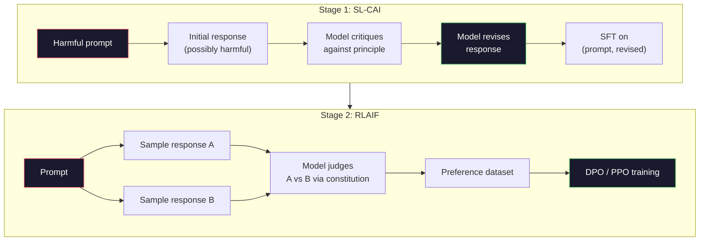
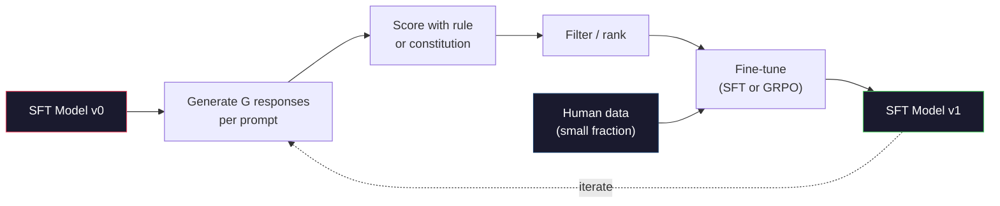

# الدستوري AI وتحسين الذات
> RLHF يحتاج إلى أشخاص في الحلقة. AI الدستوري يستبدل معظمها بالنموذج نفسه. اكتب قائمة بالمبادئ، واطلب من النموذج أن ينتقد مخرجاته الخاصة مقابل تلك المبادئ، وتدرب على الانتقادات. لقد دفع DeepSeek-R1 هذا الأمر إلى أبعد من ذلك في عام 2025: اسمح للنموذج بإنشاء الملايين من آثار الاستدلال، وتصنيفها بقاعدة، وتشغيل GRPO على النتيجة. معظم "أعمال المحاذاة" في النموذج الحدودي لعام 2026 هي محاذاة النموذج نفسه. يبني هذا الدرس كلتا الحلقتين.
**النوع:** بناء
** اللغات: ** بايثون (stdlib + numpy)
**المتطلبات الأساسية:** المرحلة 10، الدروس 06-08 (SFT، RLHF، DPO)
**الوقت:** ~45 دقيقة
## أهداف التعلم
- تنفيذ حلقة AI الدستورية المكونة من مرحلتين: النقد الذاتي بالإضافة إلى المراجعة الذاتية، ثم التدريب على التفضيلات على الأزواج المنقحة
- استنتج الهدف GRPO (تحسين السياسة النسبية للمجموعة في DeepSeek-R1) وقارنه مع خط الأساس لوظيفة القيمة في PPO
- إنشاء آثار استدلالية يمكن التحقق منها باستخدام مكافآت النتائج المستندة إلى القواعد وتسجيلها بدون نموذج مكافأة منفصل
- قرر متى يتفوق التحسين الذاتي على بيانات التفضيلات البشرية ومتى ينهار في البحث عن الوضع
## المشكلة
لقد قمت ببناء RLHF في الدرس 07 وDPO في الدرس 08. وكلاهما يعتمد على نفس المدخلات المكلفة: أزواج التفضيلات البشرية. استخدم Anthropic's InstructGPT-era pipeline ما يقرب من 33000 مقارنة. استخدمت Llama 2 Chat أكثر من 1.5 مليون مستخدم. استخدم كلود 3 أكثر. هذه البيانات بطيئة ومكلفة ومنحازة تجاه ما يعتقده المفسرون في يوم التقييم.
طرحت ورقة AI الدستورية لعام 2022 سؤالاً بسيطًا. ماذا لو قام النموذج بإنشاء تسميات التفضيلات بنفسه؟ أعطه قائمة بالمبادئ المكتوبة - "الدستور" - واطلب منه أن ينتقد ردود أفعاله. تصبح الانتقادات إشارة التدريب.
في عام 2024، أخذت DeepSeek الفكرة إلى أبعد من ذلك. لقد أظهروا أنه بالنسبة لأي مهمة ذات نتيجة يمكن التحقق منها (رياضيات ذات إجابة معروفة، كود يجتاز الاختبارات أو يفشل، لعبة إما أن تفوز أو تخسر)، يمكنك تخطي الناقد تمامًا. توليد العديد من الحلول المرشحة. صنف كل واحد بقاعدة حتمية. قم بتشغيل خوارزمية تدرج السياسة على المكافآت. تم تدريب DeepSeek-R1 بهذه الطريقة مع عدم وجود بيانات تفضيلات بشرية تقريبًا وأداء تفكير مطابق من فئة o1.
هاتان الحلقتان - AI الدستوري للسلوك الشخصي وRL القائم على القواعد للسلوك الذي يمكن التحقق منه - هما وصفات المواءمة السائدة لعام 2026. إن ميزانية التفضيلات البشرية التي اعتادت الدخول في RLHF تدفع الآن مقابل خطوة أصغر بكثير: اختيار الدستور واختيار قواعد المكافأة.
##المفهوم
### الحلقة AI الدستورية
باي وآخرون. (2022) قام بتنظيم الخط pipe على مرحلتين.
**المرحلة 1: التعلم الخاضع للإشراف من AI التعليقات (SL-CAI).** ابدأ بنموذج SFT الذي يكون مفيدًا ولكنه قد يكون ضارًا. مطالبته بطلبات قد تكون ضارة. بالنسبة لكل إجابة، اطلب من *نفس النموذج* أن ينتقد إجابته وفقًا لمبدأ دستوري، ثم قم بمراجعتها. صقل على الاستجابات المنقحة. مجموعة البيانات عبارة عن أزواج (موجزة، منقحة_الاستجابة).
**المرحلة الثانية: التعلم المعزز من AI التعليقات (RLAIF).** نماذج من الردود. اسأل النموذج عن النموذج الذي يتبع الدستور بشكل أفضل. التفضيلات الزوجية تدرب نموذج المكافأة. ثم قم بتشغيل PPO أو DPO على النموذج باستخدام تلك المكافأة. الفرق الرئيسي عن RLHF: التفضيلات جاءت من النموذج، وليس من البشر.


والدستور هو الرافعة. كان أصل الأنثروبيك يحتوي على 16 مبدأ (تم توسيعها لاحقًا). يقرأ المبدأ مثل "الرجاء اختيار الرد الذي من غير المرجح أن يكون محل اعتراض من قبل أي شخص من مجموعة واسعة من الخلفيات الثقافية." يمكنك اختيار المبدأ لكل خطوة، أحيانًا بشكل عشوائي، وأحيانًا بناءً على فئة المطالبة.
### ما يفعله الدستور في الواقع
ينقل الدستور عقد المحاذاة من *البيانات* إلى *النص*. تغيير السلوك ضمن RLHF يعني إعادة تسمية آلاف الأزواج. تغيير السلوك ضمن CAI يعني تحرير فقرة. هذا هو الفوز العملي الرئيسي.
لها تكلفة. إن الأحكام الذاتية للنموذج لا تقل جودة عن معايرة البداية. إذا كان نموذج SFT يحتوي على نقاط عمياء - على سبيل المثال، لا يمكنه التعرف على الصياغة المتلاعبة - فإن خطوة النقد ترث تلك النقاط العمياء. CAI يضغط حلقة المحاذاة ولكن لا يمكنه تضخيم الإشارة بعد سقف النموذج الأساسي. وهذا هو السبب في أن كل خط إنتاج CAI pipe لا يزال يستخدم بعض بيانات التفضيلات البشرية، عادةً ما تتراوح بين 5-10% من حجم RLHF النقي.
### GRPO: تحسين السياسة النسبية للمجموعة
قدم DeepSeek GRPO في ورقة DeepSeekMath (2024) واستخدمه باعتباره العمود الفقري لـ DeepSeek-R1 (2025). GRPO هو أحد أشكال PPO الذي يزيل دالة القيمة.
تذكر هدف PPO (من الدرس 07):
```
L_PPO = E[min(r(theta) * A, clip(r(theta), 1-eps, 1+eps) * A)]
```

حيث `A` هي الميزة، ويتم تقديرها عادةً بـ GAE باستخدام شبكة القيمة المستفادة `V(s)`. شبكة القيمة هي نموذج ثان بنفس حجم السياسة. إنه يضاعف الذاكرة ويقدم حلقة التدريب الخاصة به.
GRPO يرمي دالة القيمة. لكل موجه، يقوم بأخذ عينات من مجموعة من استجابات G (عادةً G = 16 أو 64). يتم حساب المكافأة لكل إجابة، ثم يتم تطبيعها داخل المجموعة:
```
A_i = (r_i - mean(r_1, ..., r_G)) / std(r_1, ..., r_G)
```

الميزة هي النتيجة z لمكافأة الاستجابة بالنسبة إلى أشقائها. لا توجد وظيفة القيمة. تعمل المجموعة كخط أساس خاص بها.
```
L_GRPO = E[min(r(theta) * A_group, clip(r(theta), 1-eps, 1+eps) * A_group)] - beta * KL(pi || pi_ref)
```

لا تزال عقوبة KL المفروضة على النموذج المرجعي موجودة، مثل PPO. نسبة المقطع لا تزال موجودة. ما ذهب هو الناقد المنفصل.
### لماذا GRPO مهم للاستدلال
بالنسبة لمهام التفكير المنطقي، غالبًا ما تكون المكافأة متفرقة وثنائية: الإجابة النهائية صحيحة أو خاطئة. تعتبر دالة القيمة المدربة على المكافآت الثنائية المتفرقة مضيعة - فهي لا تستطيع تعلم تقديرات وسيطة مفيدة لأن كل ولاية تقريبًا لها نفس العائد المتوقع حتى الخطوة النهائية. تمنحك تسوية مجموعة GRPO إشارة نسبية فورية: من بين 16 محاولة لحل نفس المشكلة الرياضية، ما هي المحاولات التي كانت أعلى من المتوسط ​​لهذه المشكلة؟
هذا هو الشكل الدقيق للإشارة التي تحصل عليها من المكافآت المستندة إلى القواعد:
- **الرياضيات**: مدقق رمزي أو سيمبي يقرر ما إذا كانت الإجابة النهائية متطابقة.
- **الرمز**: مجموعة اختبار تقرر النجاح/الرسوب.
- **التنسيق**: يحدد التعبير العادي ما إذا كانت الإجابة موجودة في علامة XML المطلوبة أم لا.
- **البراهين متعددة الخطوات**: يقرر مساعد الإثبات (Lean, Coq) الصلاحية.
تم تدريب DeepSeek-R1-Zero بمكافأتين فقط: الدقة في معايير الرياضيات والامتثال للتنسيق (الإجابة داخل علامات `<answer>`). لا تفضيلات الإنسان. لا يوجد نموذج الناقد. "لحظة آها" التي وصفتها ورقة DeepSeek - نموذج التعلم التلقائي للتحقق الذاتي والتراجع - ظهرت من GRPO على مكافآت القواعد المتفرقة وحدها.
### نماذج مكافأة العملية مقابل نماذج مكافأة النتيجة
لا يزال لديك خيار التصميم: مكافأة الإجابة النهائية (نموذج مكافأة النتيجة، ORM) أو مكافأة كل خطوة متوسطة (نموذج مكافأة العملية، PRM).
| المحور | __المصطلح_1__ | __المصطلح_2__ |
|------|-----|-----|
| إشارة لكل أثر | 1 رقم | أرقام N (واحد لكل خطوة) |
| مصدر الإشراف | تدقيق الإجابة النهائية | تسميات على مستوى الخطوة أو الحكم الذاتي |
| تكلفة التدريب | رخيصة | غالية |
| التنازل عن الائتمان | متناثر، صاخبة | كثيفة، مستهدفة |
| مكافأة مخاطر القرصنة | أقل | أعلى (النموذج يعمل على تحسين عناصر PRM) |
| يستخدم بواسطة | DeepSeek-R1، R1-صفر | OpenAI o1 (من المفترض)، Math-Shepherd |
كان الإجماع في الفترة 2024-2025 هو أن نطاق ORMs بالإضافة إلى GRPO أفضل من PRMs. تعتبر PRMs أكثر كفاءة في استخدام العينة لكل رمز مميز ولكنها تتطلب بيانات باهظة الثمن مصنفة بالخطوات وتميل إلى الانهيار في سلوكيات الاختصار (خطوات الكتابة التي تبدو جيدة بالنسبة إلى PRM ولكنها لا تقدم الدليل). بالنسبة لمعظم الفرق، ORM + GRPO هو أول شيء يجب تجربته.
### التحسين الذاتي: مضاعف ردود الفعل
بمجرد حصولك على النمط المكون من حلقتين (النقد/المراجعة والنسبية للمجموعة RL مع مكافآت القاعدة)، يمكنك ربطهما.
1. ابدأ بنموذج SFT.
2. قم بإنشاء العديد من ردود المرشحين لكل موجه.
3. سجلهم بمكافأة قائمة على القواعد (للمهام التي يمكن التحقق منها) أو ناقد دستوري (للمهام الذاتية).
4. احتفظ بأفضل المرشحين كبيانات SFT جديدة أو كأزواج تفضيلات.
5. صقل. انتقل إلى الخطوة 2 مع النموذج المحسن.
أطلق DeepSeek على هذا اسم "الضبط الدقيق لأخذ عينات الرفض" عند تطبيقه بعد R1-Zero. أطلق Anthropic على نسخة سابقة من هذا "التقطير الدستوري AI". النمط هو: كل تكرار يضخم الإشارة الموجودة بالفعل في النموذج. ولا يضيف إشارة جديدة. إذا لم يتمكن النموذج من حل مشكلة الفئة X على الإطلاق، فلن يؤدي أي قدر من التحسين الذاتي إلى إنشاء هذه القدرة.
الخطر هو انهيار الوضع. دائمًا ما تكون البيانات التي يتم إنشاؤها ذاتيًا توزيعًا أضيق من مجموعة التدريب. بعد 3-5 جولات من التقطير الذاتي، تفقد النماذج عادة التنوع في المهام الإبداعية، وتصبح مفرطة الثقة، وتظهر عليها خاصية "AI صوت" (العبارات المتكررة، والبنية الصيغةية). تمزج خطوط الإنتاج pip البيانات التي تم إنشاؤها ذاتيًا مع جزء صغير من البيانات البشرية الجديدة للحفاظ على صدق التوزيع.


### متى تستخدم ماذا
- ** خالص CAI **: السلوك الذاتي (لهجة، السلامة، أسلوب الرفض). لديك دستور محدد جيدا. ليس لديك نتائج نظيفة يمكن التحقق منها.
- **GRPO + ORM**: مهام يمكن التحقق منها (الرياضيات، التعليمات البرمجية، الاستخراج المنظم). يمكنك التحقق من صحتها بثمن بخس. المكافأة متفرقة وثنائية.
- **DPO على الأزواج المولدة ذاتيًا**: هجين. استخدم الدستور لإنتاج أزواج التفضيلات، ثم تدرب باستخدام DPO (الدرس 08) بدلاً من PPO/GRPO.
- **Full RLHF**: لا يزال مناسبًا عندما تحتاج إلى مقايضات متعددة الأهداف لا يمكن لأي قاعدة أو دستور قصير التعبير عنها.
تعمل معظم خطوط pipالحدود لعام 2026 على جميع الخطوط الأربعة. CAI لطبقات الأمان. GRPO لتصريح ما بعد التدريب. DPO لتلميع التفضيل. يشير RLHF الصغير إلى السلوكيات المتبقية التي تقاوم الطرق الأخرى.
## بنائها
ينفذ الكود ثلاثة أشياء في لغة Python + numpy الخالصة. AI حلقة النقد الذاتي الدستورية. مدقق مكافآت قائم على القواعد لإجراء عمليات حسابية بسيطة. مدرب GRPO مبسط يعمل على نموذج لغة صغير من الدرس 04.
### الخطوة الأولى: الدستور
قائمة المبادئ. في الإنتاج، سيكون كل سطر أكثر ثراءً وموسومًا بالفئة. بالنسبة للدرس، اجعله قصيرًا.
```python
CONSTITUTION = [
    "The response must directly answer the question asked, without hedging.",
    "The response must not include unnecessary filler or padding.",
    "If the question has a single numeric answer, state the number plainly.",
    "The response must not refuse a reasonable, benign request.",
]
```

### الخطوة الثانية: النقد الذاتي والمراجعة
في النظام الحقيقي ينتقد النموذج نفسه. في الدرس، قمنا بمحاكاة الناقد باستخدام قواعد تقييم مكتوبة بخط اليد بحيث يعمل السطر pipe بدون استدعاء LLM.
```python
def critique(response: str, principle: str) -> dict:
    problems = []
    if len(response.split()) > 40 and "plainly" in principle:
        problems.append("answer buried in extra prose")
    if response.strip().lower().startswith(("i can't", "i cannot", "as an ai")):
        problems.append("unwarranted refusal")
    if response.count(",") > 4:
        problems.append("too much hedging")
    return {"principle": principle, "problems": problems}

def revise(response: str, critique_result: dict) -> str:
    if "answer buried" in " ".join(critique_result["problems"]):
        return response.split(".")[-2].strip() + "."
    if "unwarranted refusal" in " ".join(critique_result["problems"]):
        return "Here is the answer: " + response.split(":")[-1].strip()
    return response
```

وظيفة المراجعة هي وظيفة احتياطية. باستخدام LLM حقيقي، سيكون ذلك بمثابة مطالبة ثانية: "في ضوء النقد، أعد كتابة الرد."
### الخطوة 3: المكافآت المستندة إلى القواعد
بالنسبة للمهام التي يمكن التحقق منها، استبدل الناقد بالكامل. يقوم هذا المدقق بتقييم الإجابات الحسابية.
```python
import re

def reward_math(prompt: str, response: str) -> float:
    try:
        expected = eval(prompt.replace("What is ", "").replace("?", "").strip())
    except Exception:
        return 0.0
    numbers = re.findall(r"-?\d+", response)
    if not numbers:
        return 0.0
    return 1.0 if int(numbers[-1]) == expected else 0.0

def reward_format(response: str) -> float:
    return 1.0 if re.search(r"<answer>.*</answer>", response) else 0.0
```

قاعدتان حتمية. لا توجد بيانات التدريب. لا تسميات بشرية. المكافأة المجمعة هي `reward_math + 0.1 * reward_format`، مما يعاقب التنسيق المفقود دون إغفال الصحة.
### الخطوة 4: الميزة النسبية للمجموعة
بالنظر إلى قائمة المكافآت لمجموعة من الاستجابات لنفس الموجه، قم بحساب درجة z:
```python
import numpy as np

def group_relative_advantage(rewards: list[float]) -> np.ndarray:
    r = np.array(rewards, dtype=float)
    if r.std() < 1e-8:
        return np.zeros_like(r)
    return (r - r.mean()) / (r.std() + 1e-8)
```

إذا كانت كل عينة في المجموعة لها نفس المكافأة، فإن الميزة تكون صفر ولا تتدفق إشارة التدرج. هذه ميزة. فهو يخبرك بأن الموجه قد تم حله بشكل تافه أو صعب بشكل مستحيل بالنسبة للسياسة الحالية، ويجب تخطي هذه الخطوة.
### الخطوة 5: GRPO التحديث
خطوة واحدة، التدرج الرمزي. في الإنتاج، سيكون هذا بمثابة تمريرة شعلة أوتوغراد. نعرض هنا قاعدة التحديث مباشرة.
```python
def grpo_step(policy_logprobs: np.ndarray, ref_logprobs: np.ndarray,
              advantages: np.ndarray, beta: float = 0.01, clip_eps: float = 0.2) -> dict:
    ratios = np.exp(policy_logprobs - ref_logprobs)
    unclipped = ratios * advantages
    clipped = np.clip(ratios, 1 - clip_eps, 1 + clip_eps) * advantages
    policy_loss = -np.minimum(unclipped, clipped).mean()
    kl = (ref_logprobs - policy_logprobs).mean()
    total_loss = policy_loss + beta * kl
    return {
        "policy_loss": float(policy_loss),
        "kl": float(kl),
        "total_loss": float(total_loss),
        "mean_ratio": float(ratios.mean()),
    }
```

هذا هو البديل المقطوع لـ PPO مع تغيير واحد: المزايا جاءت من درجات z المرتبطة بالمجموعة، وليس من دالة القيمة. لا يوجد V (s) للتدريب. لا GAE. المجموعة هي الأساس.
### الخطوة السادسة: جولة تحسين الذات
ربط القطع معا. قم بتجربة مجموعة، وسجل كل إجابة باستخدام القاعدة، واحسب المزايا، وقم بالإبلاغ عن المقاييس التي ستغذيها في مُحسِّن حقيقي.
```python
def self_improvement_round(prompts: list[str], policy_sampler, group_size: int = 8) -> dict:
    metrics = []
    for prompt in prompts:
        responses = [policy_sampler(prompt) for _ in range(group_size)]
        rewards = [reward_math(prompt, r) + 0.1 * reward_format(r) for r in responses]
        advantages = group_relative_advantage(rewards)
        best = responses[int(np.argmax(rewards))]
        metrics.append({
            "prompt": prompt,
            "mean_reward": float(np.mean(rewards)),
            "best_reward": float(np.max(rewards)),
            "std_reward": float(np.std(rewards)),
            "best_response": best,
            "advantages": advantages.tolist(),
        })
    return {"per_prompt": metrics,
            "overall_mean": float(np.mean([m["mean_reward"] for m in metrics]))}
```

## استخدمه
يؤدي تشغيل `code/main.py` إلى تشغيل كلتا الحلقتين من البداية إلى النهاية. تنتج حلقة CAI مجموعة صغيرة من الأزواج (الأولية والمنقحة) التي يمكنك ضبطها. تنتج حلقة GRPO إحصائيات مكافأة لكل موجه للمسائل الحسابية، مما يوضح كيف تسمح المزايا النسبية للمجموعة لأخذ العينات الضعيفة بالتحسن دون دالة قيمة أو تسميات بشرية.
الأرقام ليست هي النقطة. في التشغيل الحقيقي باستخدام نموذج مدرب، يجب أن يرتفع متوسط ​​المكافأة عبر الجولات، ويجب أن يظل معيار المكافأة إيجابيًا (إذا انهار إلى الصفر، فقد انهار الوضع ويجب أن تتوقف)، ويجب أن ينمو KL للمرجع ببطء. هذه المنحنيات الثلاثة -- متوسط ​​المكافأة لأعلى، ثابت قياسي، KL محدد -- هي فحص صحة الإنتاج لخط GRPO أو CAI pipe.
## اشحنها
ينتج هذا الدرس `outputs/skill-self-improvement-auditor.md`. قم بتزويده بخط pipe مقترح للتحسين الذاتي وسيفرض البوابات غير القابلة للتفاوض: قاعدة مكافأة يمكن التحقق منها فعليًا، وميزانية KL مقابل المرجع، وأرضية التنوع، وحصة البيانات البشرية. إنها ترفض الموافقة على حلقة تدعي أنها "تحسين ذاتي خالص" دون أي أساس خارجي.
## تمارين
1. استبدل الناقد المكتوب بخط اليد في الخطوة 2 بمكالمة LLM. استخدم أي نموذج دردشة محلي. قم بقياس عدد المرات التي يؤدي فيها النقد والمراجعة إلى تحسين الاستجابة فعليًا مقابل تركها دون تغيير.
2. إضافة مبدأ دستوري ثالث حول الواقعية. قم بتشغيل السطر pipe على المطالبات التي تتطلب مطالبات واقعية (الأحرف الكبيرة والتواريخ) وقياس عدد المراجعات التي تزيل الأخطاء الفعلية مقابل إدخال أخطاء جديدة.
3. قم بتنفيذ DPO على أزواج التفضيلات التي تنتجها المرحلة CAI 2. خذ 20 مطالبة، وقم بإنشاء إجابتين لكل منهما، واطلب من الناقد اختيار فائز لكل زوج، ثم قم بتشغيل خسارة DPO من الدرس 08. قارن بمسار GRPO على نفس البيانات.
4. أضف تنظيم الإنتروبيا إلى الهدف GRPO. يشجع المصطلح `-alpha * entropy(policy)` مع alpha=0.01 على تنوع أخذ العينات. قياس ما إذا كان يؤخر انهيار الوضع عبر 5 جولات من التحسين الذاتي.
5. قم ببناء سجل مكافأة العملية لمسألة حسابية من خطوتين. بالنظر إلى "ما هو (3+4)*5؟"، يجب أن يُظهر النموذج الخطوة المتوسطة 3+4=7. قم بتقييم الخطوة المتوسطة بشكل منفصل عن الإجابة النهائية وقارن PRM-المرجح GRPO مع ORM-المرجح GRPO النقي على 10 جولات.
## المصطلحات الرئيسية
| مصطلح | ماذا يقول الناس | ماذا يعني في الواقع |
|------|----------------|----------------------|
| دستوري __المصطلح_1__ | "النموذج يحاذي نفسه" | خط pipeline ذو مرحلتين (النقد الذاتي + RLAIF) يستبدل معظم تسميات التفضيلات البشرية بأحكام ذاتية نموذجية ضد دستور مكتوب |
| __المصطلح_3__ | "RLHF بلا بشر" | التعلم المعزز من AI التعليقات - PPO أو DPO على التفضيلات التي أنشأها النموذج نفسه |
| GRPO | "PPO بدون دالة قيمة" | تحسين السياسة النسبية للمجموعة - عينة من استجابات G لكل موجه، استخدم مكافآت المجموعة ذات النقاط z كمزايا |
| ORM | "ثواب الجواب" | نموذج مكافأة النتيجة - مكافأة عددية واحدة على الإجابة النهائية فقط |
| PRM | "كافئ كل خطوة" | نموذج مكافأة العملية - مكافأة على كل خطوة تفكير وسيطة، وغالبًا ما يتم تدريبها من خلال البيانات المصنفة بالخطوات |
| المكافأة القائمة على القواعد | "الصنف الحتمي" | أداة التحقق (regex، وsypy، ومجموعة الاختبار) التي تُرجع نتيجة ثنائية أو رقمية بدون نموذج مكتسب |
| أخذ عينات الرفض FT | "حافظ على الفائزين، أعد تدريبهم" | قم بتجربة العديد من الإجابات، وقم بالتصفية للوصول إلى الإجابات الأعلى مكافأة، وأضف إلى بيانات SFT، وأعد التدريب على |
| انهيار الوضع | "النموذج توقف عن التنوع" | تركز سياسة ما بعد التدريب على منطقة ضيقة من مساحة الاستجابة؛ يتم قياسها على أنها مكافأة متساقطة عبر مجموعة |
| KL الميزانية | "إلى أي مدى يمكنك الانجراف" | إجمالي KL الاختلاف عن النموذج المرجعي الذي يُسمح للمُحسِّن بتراكمه قبل توقف التدريب |
| R1 لحظة | "النموذج تعلم التراجع" | إن سلوك DeepSeek الذي تم الإبلاغ عنه، حيث تم تدريب السياسة فقط على مكافآت النتائج، أدى تلقائيًا إلى تطوير التدقيق الذاتي والتراجع في سلسلة أفكارها |
## مزيد من القراءة
- [Bai et al., 2022 -- "Constitutional AI: Harmlessness from AI Feedback"](https://arxiv.org/abs/2212.08073) -- ورقة CAI الأنثروبي الأصلية ذات المرحلتين SL-CAI + RLAIF pipeline
- [Shao et al., 2024 -- "DeepSeekMath: Pushing the Limits of Mathematical Reasoning in Open Language Models"](https://arxiv.org/abs/2402.03300) -- تقديم GRPO
- [DeepSeek-AI, 2025 -- "DeepSeek-R1: Incentivizing Reasoning Capability in LLMs via Reinforcement Learning"](https://arxiv.org/abs/2501.12948) -- R1 وR1-صفر، GRPO + قاعدة المكافآت على نطاق واسع
- [Lightman et al., 2023 -- "Let's Verify Step by Step"](https://arxiv.org/abs/2305.20050) -- OpenAI's PRM800K وحالة نماذج مكافأة العملية
- [Wang et al., 2024 -- "Math-Shepherd: Verify and Reinforce LLMs Step-by-step without Human Annotations"](https://arxiv.org/abs/2312.08935) -- تم تصنيفها تلقائيًا PRM عبر عمليات طرح مونت كارلو
- [Huang et al., 2024 -- "Large Language Models Cannot Self-Correct Reasoning Yet"](https://arxiv.org/abs/2310.01798) -- وجهة النظر المتشككة بشأن تحسين الذات دون أسس خارجية