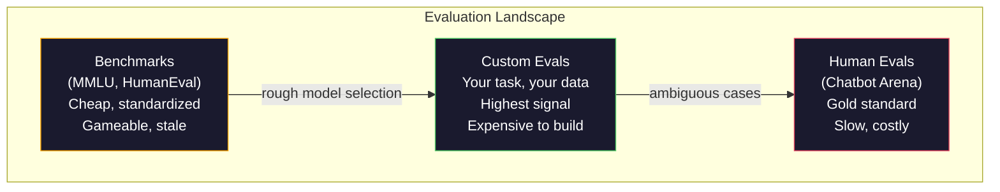
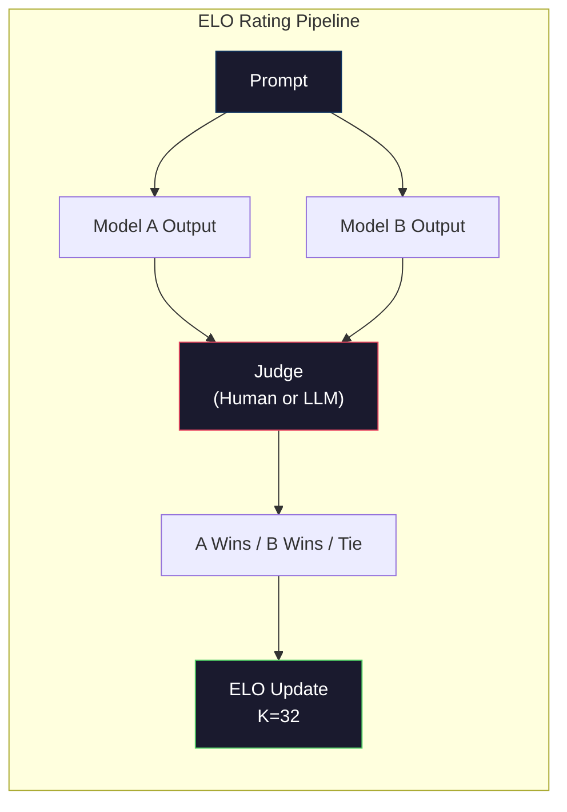

# التقييم: المعايير، التقييمات، LM الحزام
> قانون جودهارت: عندما يصبح المقياس هدفا، فإنه يتوقف عن أن يكون مقياسا جيدا. كل معايير ألعاب Frontier Lab. ترتفع درجات MMLU بينما لا تزال النماذج غير قادرة على حساب عدد حروف R في كلمة "الفراولة" بشكل موثوق. التقييم الوحيد المهم هو تقييم YOUR -- في مهمة YOUR، مع بيانات YOUR.
**النوع:** بناء
** اللغات: ** بايثون
**المتطلبات الأساسية:** المرحلة 10، الدروس 01-05 (ماجستير في القانون من الصفر)
**الوقت:** ~90 دقيقة
## أهداف التعلم
- قم ببناء أداة تقييم مخصصة تدير معايير متعددة الاختيارات ومفتوحة النهاية مقابل نموذج اللغة
- اشرح سبب تشبع المعايير القياسية (MMLU، HumanEval) وفشلها في التمييز بين النماذج الحدودية
- تنفيذ تقييمات خاصة بالمهمة باستخدام المقاييس المناسبة: المطابقة التامة، F1، BLEU، وLLM-تسجيل نقاط القاضي
- صمم مجموعة تقييم مخصصة تستهدف حالة الاستخدام المحددة الخاصة بك بدلاً من الاعتماد فقط على لوحات المتصدرين العامة
## المشكلة
تم نشر MMLU في عام 2020 مع 15,908 سؤالًا في 57 موضوعًا. وفي غضون ثلاث سنوات، أشبعتها النماذج الحدودية. GPT-4 حصل على 86.4%. حصل كلود 3 أوبوس على نسبة 86.8%. وسجل اللاما 3 405B 88.6%. تم ضغط لوحة المتصدرين في نطاق من 3 نقاط حيث تكون الاختلافات عبارة عن ضوضاء إحصائية، وليست فجوات حقيقية في القدرات.
وفي الوقت نفسه، تفشل تلك النماذج نفسها في المهام التي يتعامل معها طفل يبلغ من العمر 10 سنوات دون تفكير. كلود 3.5 سونيت، الذي حصل على 88.7% في MMLU، لم يتمكن في البداية من حساب الحروف في "الفراولة" - وهي مهمة لا تتطلب أي معرفة بالعالم أو تفكير صفري، فقط التكرار على مستوى الشخصية. يختبر HumanEval إنشاء التعليمات البرمجية مع 164 مشكلة. تحصل النماذج على نسبة 90%+ في حين تستمر في إنتاج تعليمات برمجية تتعطل في الحالات المتطورة التي يمكن لأي مطور مبتدئ اكتشافها.
تعد الفجوة بين الأداء المعياري والموثوقية في العالم الحقيقي هي المشكلة الأساسية لتقييم LLM. تخبرك المعايير بكيفية أداء النموذج على المعيار. فهي لا تخبرك بأي شيء تقريبًا عن كيفية أداء هذا النموذج في مهمتك المحددة، مع بياناتك المحددة، في ظل أوضاع الفشل المحددة الخاصة بك. إذا كنت تقوم بإنشاء روبوت لدعم العملاء، فإن MMLU ليس له أي صلة. إذا كنت تقوم بإنشاء مساعد تعليمات برمجية، فإن HumanEval يغطي فقط إنشاء مستوى الوظيفة - ولا يذكر شيئًا عن تصحيح الأخطاء أو إعادة البناء أو شرح التعليمات البرمجية عبر الملفات.
أنت بحاجة إلى تقييمات مخصصة. ليس لأن المعايير غير مجدية - فهي مفيدة للاختيار التقريبي للنموذج - ولكن لأن التقييم النهائي يجب أن يتطابق تمامًا مع شروط النشر الخاصة بك.
##المفهوم
### المشهد التقييمي
هناك ثلاث فئات للتقييم، لكل منها تكلفة وجودة إشارة مختلفة.
**المقاييس المعيارية** عبارة عن مجموعات اختبار موحدة. MMLU، HumanEval، SWE-مقعد، MATH، ARC، HellaSwag. يمكنك تشغيل نموذج مقابل المعيار والحصول على النتيجة. الميزة: يستخدم الجميع نفس الاختبار، حتى تتمكن من مقارنة النماذج. العيب: النماذج وبيانات التدريب تلوث هذه المعايير بشكل متزايد. تتدرب المختبرات على البيانات التي تتضمن أسئلة مرجعية. النتائج ترتفع. القدرة قد لا.
**التقييمات المخصصة** عبارة عن مجموعات اختبار تقوم بإنشائها لحالة الاستخدام المحددة الخاصة بك. يمكنك تحديد المدخلات والمخرجات المتوقعة ووظيفة التسجيل. يتم تقييم ملخص المستندات القانونية بناءً على المستندات القانونية. يتم تقييم المولد SQL في مخطط قاعدة البيانات الخاصة بك. يعد إنشاءها مكلفًا ولكنها التقييم الوحيد الذي يتنبأ بأداء الإنتاج.
يستخدم **المقيمون البشريون** تعليقات توضيحية مدفوعة الأجر للحكم على مخرجات النموذج بناءً على معايير مثل مدى المساعدة والصحة والطلاقة والسلامة. المعيار الذهبي للمهام ذات النهايات المفتوحة حيث يفشل التسجيل التلقائي. جمعت Chatbot Arena أكثر من 2 مليون صوت من تفضيلات الإنسان عبر أكثر من 100 نموذج. الجانب السلبي: التكلفة (0.10 دولار - 2.00 دولار لكل حكم) والسرعة (من ساعات إلى أيام).


### لماذا تنكسر المعايير؟
هناك ثلاث آليات تؤدي إلى توقف النتائج المرجعية عن عكس القدرة الحقيقية.
**تلوث البيانات.** تتخلص مجموعات التدريب من الإنترنت. الأسئلة المرجعية مباشرة على شبكة الإنترنت. ترى النماذج الإجابات أثناء التدريب. ولا يعد هذا غشًا بالمعنى التقليدي - فالمختبرات لا تتضمن بيانات مرجعية عن عمد. ولكن من المستحيل تقريبًا استبعاد عملية تجريف نطاق الويب make.
**التدريس للاختبار.** تعمل المعامل على تحسين مزيج التدريب لتحقيق الأداء القياسي. إذا كان 5% من مزيج التدريب عبارة عن نمط اختيار من متعدد MMLU، فسيتعلم النموذج التنسيق وتوزيع الإجابات. MMLU هو الاختيار من متعدد في 4 اتجاهات. تتعلم النماذج أن توزيع الإجابات يكون موحدًا تقريبًا عبر A/B/C/D، مما يساعد حتى عندما لا يعرف النموذج الإجابة.
**التشبع.** عندما يسجل كل نموذج حدودي نسبة 85-90% في أحد المعايير، يتوقف المعيار عن التمييز. قد تكون الأسئلة المتبقية البالغة 10-15% غامضة، أو ذات عناوين خاطئة، أو تتطلب معرفة غامضة بالمجال. قد يعني التحسين من 87% إلى 89% في MMLU أن النموذج حفظ سؤالين أكثر غموضًا، وليس أنه أصبح أكثر ذكاءً.
### الحيرة: فحص صحي سريع
تقيس الحيرة مدى مفاجأة النموذج بسلسلة من الرموز المميزة. رسميًا، هو متوسط ​​احتمالية السجل السلبي الأسي:
```
PPL = exp(-1/N * sum(log P(token_i | context)))
```

والحيرة البالغة 10 تعني أن النموذج، في المتوسط، غير مؤكد مثل الاختيار بشكل موحد بين 10 خيارات في كل موضع رمزي. أقل هو أفضل. GPT-2 يحصل على درجة حيرة تبلغ ~30 في WikiText-103. GPT-3 يحصل على ~20. اللاما 3 8B يحصل على ~7.
تعتبر الحيرة مفيدة لمقارنة النماذج الموجودة في نفس مجموعة الاختبار، ولكنها تحتوي على نقاط عمياء. يمكن أن يكون للنموذج درجة منخفضة من الحيرة من خلال كونه جيدًا في التنبؤ بالأنماط الشائعة بينما يكون سيئًا في الأنماط النادرة ولكن المهمة. كما أنه لا يذكر شيئًا عن اتباع التعليمات أو الاستدلال أو الدقة الواقعية. استخدمه كفحص للعقل، وليس كحكم نهائي.
### LLM-كقاضي
استخدم نموذجًا قويًا لتقييم مخرجات النموذج الأضعف. الفكرة بسيطة: اطلب من GPT-4o أو Claude Sonnet تقييم الإجابة على مقياس من 1 إلى 5 من حيث الصحة والمساعدة والسلامة. يكلف هذا حوالي 0.01 USD لكل حكم باستخدام GPT-4o-mini ويرتبط بشكل مدهش بالأحكام البشرية - اتفاق بنسبة 80% تقريبًا على معظم المهام.
إن مطالبة التسجيل مهمة أكثر من النموذج. تؤدي المطالبة الغامضة ("قيم هذه الاستجابة") إلى نتائج مزعجة. إن المطالبة المنظمة مع نموذج التقييم ("ضع 5 نقاط إذا كانت الإجابة صحيحة فعليًا وتستشهد بمصدر، و4 إذا كانت صحيحة ولكن بدون مصدر، و3 إذا كانت صحيحة جزئيًا...") تنتج درجات متسقة وقابلة للتكرار.
أوضاع الفشل: تُظهر نماذج القاضي انحيازًا للموضع (تفضل الاستجابة الأولى في المقارنات الزوجية)، وانحياز الإسهاب (تفضل الاستجابات الأطول)، والتفضيل الذاتي (معدلات GPT-4 GPT-4 أعلى من مخرجات كلود المكافئة). إجراءات التخفيف: ترتيب عشوائي، وتطبيع الطول، واستخدام حكم مختلف عن النموذج الذي يتم تقييمه.
### ELO التقييمات من المقارنات الزوجية
نهج Chatbot Arena. عرض استجابتين لنفس الموجه من نماذج مختلفة. يختار الإنسان (أو LLM القاضي) الخيار الأفضل. من بين آلاف هذه المقارنات، احسب تقييم ELO لكل نموذج - وهو نفس النظام المستخدم في لعبة الشطرنج.
مزايا ELO: الترتيب النسبي أكثر موثوقية من التسجيل المطلق، ويتعامل مع الارتباطات بأمان، ويتقارب مع مقارنات أقل من تسجيل كل مخرجات بشكل مستقل. اعتبارًا من أوائل عام 2026، تظهر تصنيفات Chatbot Arena GPT-4o وClaude 3.5 Sonnet وGemini 1.5 Pro ضمن 20 ELO نقطة من بعضها البعض في الأعلى.


### أطر التقييم
**lm-evaluation-harness** (EleutherAI): إطار التقييم القياسي مفتوح المصدر. يدعم 200+ المعايير. قم بتشغيل أي نموذج Hugging Face مقابل MMLU، وHellaSwag، وARC، وما إلى ذلك باستخدام أمر واحد. يتم استخدامه بواسطة لوحة المتصدرين المفتوحة LLM.
**RAGAS**: إطار التقييم المخصص لـ RAG pipelines. يقيس الإخلاص (هل تتطابق الإجابة مع السياق المسترجع؟) والملاءمة (هل السياق المسترجع ذو صلة بالسؤال؟) وصحة الإجابة.
**promptfoo**: تقييم يعتمد على التكوين للهندسة السريعة. حدد حالات الاختبار في YAML، وقم بتشغيلها على نماذج متعددة، واحصل على تقرير النجاح/الفشل. مفيد لمطالبات اختبار الانحدار - make تأكد من أن التغيير الفوري لا يؤدي إلى كسر حالات الاختبار الحالية.
### بناء التقييمات المخصصة
التقييم الوحيد الذي يهم الإنتاج. العملية:
1. **حدد المهمة.** ما الذي يجب أن يفعله النموذج بالضبط؟ كن دقيقا. "الإجابة على الأسئلة" غامضة للغاية. "بالنظر إلى رسالة بريد إلكتروني لشكوى العميل، قم باستخراج اسم المنتج وفئة المشكلة والمشاعر" هي مهمة يمكنك تقييمها.
2. **إنشاء حالات اختبار.** الحد الأدنى 50 لتقييم النموذج الأولي، و200+ للإنتاج. كل حالة اختبار هي زوج (الإدخال، المتوقع_الإخراج). قم بتضمين حالات الحافة: المدخلات الفارغة، والمدخلات المتعارضة، والمدخلات الغامضة، والمدخلات بلغات أخرى.
3. **تحديد النقاط.** المطابقة التامة للمخرجات المنظمة. BLEU/ROUGE لتشابه النص. LLM-حكم الجودة المفتوحة. F1 لمهام الاستخراج. الجمع بين مقاييس متعددة مع الأوزان.
4. **أتمتة.** يتم تشغيل كل تقييم بأمر واحد. لا توجد خطوات يدوية. قم بتخزين النتائج بتنسيق يتيح المقارنة بمرور الوقت.
5. **التتبع بمرور الوقت.** لا معنى لنتيجة التقييم بمعزل عن غيرها. أنت في حاجة إلى خط الاتجاه. هل تحسنت النتيجة بعد التغيير الفوري الأخير؟ هل تراجعت بعد تبديل النماذج؟ قم بإصدار التقييم الخاص بك جنبًا إلى جنب مع المطالبات الخاصة بك.
| نوع التقييم | تكلفة الحكم | الاتفاق مع البشر | الأفضل لـ |
|-----------|----------------------------------|------|----------|
| تطابق تام | ~$0 | 100% (عند الاقتضاء) | الإخراج المنظم والتصنيف |
| BLEU/ROUGE | ~$0 | ~60% | ترجمة تلخيص |
| LLM-كقاضي | ~0.01 دولار | ~80% | جيل مفتوح |
| التقييم البشري | 0.10 دولار - 2.00 دولار | لا يوجد (هي الحقيقة الأرضية) | مهام غامضة وعالية المخاطر |
## بنائها
### الخطوة 1: الحد الأدنى من إطار التقييم
تحديد التجريدات الأساسية. تحتوي حالة التقييم على مدخلات ومخرجات متوقعة وإملاء بيانات تعريف اختياري. يأخذ المسجل توقعًا ومرجعًا ويعيد النتيجة بين 0 و1.
```python
import json
from collections import Counter

class EvalCase:
    def __init__(self, input_text, expected, metadata=None):
        self.input_text = input_text
        self.expected = expected
        self.metadata = metadata or {}

class EvalSuite:
    def __init__(self, name, cases, scorers):
        self.name = name
        self.cases = cases
        self.scorers = scorers

    def run(self, model_fn):
        results = []
        for case in self.cases:
            prediction = model_fn(case.input_text)
            scores = {}
            for scorer_name, scorer_fn in self.scorers.items():
                scores[scorer_name] = scorer_fn(prediction, case.expected)
            results.append({
                "input": case.input_text,
                "expected": case.expected,
                "prediction": prediction,
                "scores": scores,
            })
        return results
```

### الخطوة الثانية: وظائف التسجيل
أنشئ مطابقة تامة، والرمز المميز F1، ومحاكاة LLM كمسجل للحكم.
```python
def exact_match(prediction, expected):
    return 1.0 if prediction.strip().lower() == expected.strip().lower() else 0.0

def token_f1(prediction, expected):
    pred_tokens = set(prediction.lower().split())
    exp_tokens = set(expected.lower().split())
    if not pred_tokens or not exp_tokens:
        return 0.0
    common = pred_tokens & exp_tokens
    precision = len(common) / len(pred_tokens)
    recall = len(common) / len(exp_tokens)
    if precision + recall == 0:
        return 0.0
    return 2 * (precision * recall) / (precision + recall)

def llm_judge_simulated(prediction, expected):
    pred_words = set(prediction.lower().split())
    exp_words = set(expected.lower().split())
    if not exp_words:
        return 0.0
    overlap = len(pred_words & exp_words) / len(exp_words)
    length_penalty = min(1.0, len(prediction) / max(len(expected), 1))
    return round(overlap * 0.7 + length_penalty * 0.3, 3)
```

### الخطوة 3: ELO نظام التقييم
قم بتنفيذ مقارنات زوجية مع تحديثات ELO. هذا هو بالضبط النظام الذي تستخدمه Chatbot Arena لتصنيف النماذج.
```python
class ELOTracker:
    def __init__(self, k=32, initial_rating=1500):
        self.ratings = {}
        self.k = k
        self.initial_rating = initial_rating
        self.history = []

    def _ensure_player(self, name):
        if name not in self.ratings:
            self.ratings[name] = self.initial_rating

    def expected_score(self, rating_a, rating_b):
        return 1 / (1 + 10 ** ((rating_b - rating_a) / 400))

    def record_match(self, player_a, player_b, outcome):
        self._ensure_player(player_a)
        self._ensure_player(player_b)

        ea = self.expected_score(self.ratings[player_a], self.ratings[player_b])
        eb = 1 - ea

        if outcome == "a":
            sa, sb = 1.0, 0.0
        elif outcome == "b":
            sa, sb = 0.0, 1.0
        else:
            sa, sb = 0.5, 0.5

        self.ratings[player_a] += self.k * (sa - ea)
        self.ratings[player_b] += self.k * (sb - eb)

        self.history.append({
            "a": player_a, "b": player_b,
            "outcome": outcome,
            "rating_a": round(self.ratings[player_a], 1),
            "rating_b": round(self.ratings[player_b], 1),
        })

    def leaderboard(self):
        return sorted(self.ratings.items(), key=lambda x: -x[1])
```

### الخطوة 4: حساب الحيرة
حساب الحيرة باستخدام الاحتمالات الرمزية. من الناحية العملية، يمكنك الحصول على هذه من logits النموذج. نحن هنا نحاكي مع التوزيع الاحتمالي.
```python
import numpy as np

def perplexity(log_probs):
    if not log_probs:
        return float("inf")
    avg_neg_log_prob = -np.mean(log_probs)
    return float(np.exp(avg_neg_log_prob))

def token_log_probs_simulated(text, model_quality=0.8):
    np.random.seed(hash(text) % 2**31)
    tokens = text.split()
    log_probs = []
    for i, token in enumerate(tokens):
        base_prob = model_quality
        if len(token) > 8:
            base_prob *= 0.6
        if i == 0:
            base_prob *= 0.7
        prob = np.clip(base_prob + np.random.normal(0, 0.1), 0.01, 0.99)
        log_probs.append(float(np.log(prob)))
    return log_probs
```

### الخطوة 5: النتائج الإجمالية
حساب إحصائيات الملخص عبر عملية التقييم: المتوسط، والوسيط، ومعدل النجاح عند العتبة، والتقسيمات لكل متري.
```python
def summarize_results(results, threshold=0.8):
    all_scores = {}
    for r in results:
        for metric, score in r["scores"].items():
            all_scores.setdefault(metric, []).append(score)

    summary = {}
    for metric, scores in all_scores.items():
        arr = np.array(scores)
        summary[metric] = {
            "mean": round(float(np.mean(arr)), 3),
            "median": round(float(np.median(arr)), 3),
            "std": round(float(np.std(arr)), 3),
            "min": round(float(np.min(arr)), 3),
            "max": round(float(np.max(arr)), 3),
            "pass_rate": round(float(np.mean(arr >= threshold)), 3),
            "n": len(scores),
        }
    return summary

def print_summary(summary, suite_name="Eval"):
    print(f"\n{'=' * 60}")
    print(f"  {suite_name} Summary")
    print(f"{'=' * 60}")
    for metric, stats in summary.items():
        print(f"\n  {metric}:")
        print(f"    Mean:      {stats['mean']:.3f}")
        print(f"    Median:    {stats['median']:.3f}")
        print(f"    Std:       {stats['std']:.3f}")
        print(f"    Range:     [{stats['min']:.3f}, {stats['max']:.3f}]")
        print(f"    Pass rate: {stats['pass_rate']:.1%} (threshold >= 0.8)")
        print(f"    N:         {stats['n']}")
```

### الخطوة 6: تشغيل خط الأنابيب بالكامل
سلك كل شيء معا. حدد مهمة، وقم بإنشاء حالات اختبار، ومحاكاة نموذجين، وتشغيل التقييمات، وحساب ELO من المقارنات الزوجية، وطباعة لوحة المتصدرين.
```python
def demo_model_good(prompt):
    responses = {
        "What is the capital of France?": "Paris",
        "What is 2 + 2?": "4",
        "Who wrote Hamlet?": "William Shakespeare",
        "What language is PyTorch written in?": "Python and C++",
        "What is the boiling point of water?": "100 degrees Celsius",
    }
    return responses.get(prompt, "I don't know")

def demo_model_bad(prompt):
    responses = {
        "What is the capital of France?": "Paris is the capital city of France",
        "What is 2 + 2?": "The answer is four",
        "Who wrote Hamlet?": "Shakespeare",
        "What language is PyTorch written in?": "Python",
        "What is the boiling point of water?": "212 Fahrenheit",
    }
    return responses.get(prompt, "Unknown")

cases = [
    EvalCase("What is the capital of France?", "Paris"),
    EvalCase("What is 2 + 2?", "4"),
    EvalCase("Who wrote Hamlet?", "William Shakespeare"),
    EvalCase("What language is PyTorch written in?", "Python and C++"),
    EvalCase("What is the boiling point of water?", "100 degrees Celsius"),
]

suite = EvalSuite(
    name="General Knowledge",
    cases=cases,
    scorers={
        "exact_match": exact_match,
        "token_f1": token_f1,
        "llm_judge": llm_judge_simulated,
    },
)

results_good = suite.run(demo_model_good)
results_bad = suite.run(demo_model_bad)

print_summary(summarize_results(results_good), "Model A (concise)")
print_summary(summarize_results(results_bad), "Model B (verbose)")
```

النموذج "الجيد" يعطي إجابات دقيقة. النموذج "السيئ" يعطي إعادة صياغة مطولة. المطابقة التامة تعاقب النموذج المطول بشدة. الرمز المميز F1 وLLM بصفته القاضي أكثر تسامحًا. يوضح هذا سبب أهمية اختيار المقياس: يبدو النموذج نفسه رائعًا أو سيئًا اعتمادًا على كيفية تسجيله.
### الخطوة 7: ELO البطولة
قم بإجراء مقارنات زوجية بين النماذج عبر جولات متعددة.
```python
elo = ELOTracker(k=32)

for case in cases:
    pred_a = demo_model_good(case.input_text)
    pred_b = demo_model_bad(case.input_text)

    score_a = token_f1(pred_a, case.expected)
    score_b = token_f1(pred_b, case.expected)

    if score_a > score_b:
        outcome = "a"
    elif score_b > score_a:
        outcome = "b"
    else:
        outcome = "tie"

    elo.record_match("model_a_concise", "model_b_verbose", outcome)

print("\nELO Leaderboard:")
for name, rating in elo.leaderboard():
    print(f"  {name}: {rating:.0f}")
```

### الخطوة 8: مقارنة الحيرة
قارن بين الحيرة عبر "النماذج" ذات مستويات الجودة المختلفة.
```python
test_text = "The quick brown fox jumps over the lazy dog in the garden"

for quality, label in [(0.9, "Strong model"), (0.7, "Medium model"), (0.4, "Weak model")]:
    log_probs = token_log_probs_simulated(test_text, model_quality=quality)
    ppl = perplexity(log_probs)
    print(f"  {label} (quality={quality}): perplexity = {ppl:.2f}")
```

## استخدمه
### أداة تقييم lm (EleutherAI)
الأداة القياسية لتشغيل المعايير على أي نموذج.
```python
# pip install lm-eval
# Command line:
# lm_eval --model hf --model_args pretrained=meta-llama/Llama-3.1-8B --tasks mmlu --batch_size 8

# Python API:
# import lm_eval
# results = lm_eval.simple_evaluate(
#     model="hf",
#     model_args="pretrained=meta-llama/Llama-3.1-8B",
#     tasks=["mmlu", "hellaswag", "arc_easy"],
#     batch_size=8,
# )
# print(results["results"])
```

### موجه
التقييم القائم على التكوين للهندسة السريعة. حدد الاختبارات في YAML وقم بتشغيلها على موفري خدمات متعددين.
```yaml
# promptfoo.yaml
providers:
  - openai:gpt-4o-mini
  - anthropic:claude-3-haiku

prompts:
  - "Answer in one word: {{question}}"

tests:
  - vars:
      question: "What is the capital of France?"
    assert:
      - type: contains
        value: "Paris"
  - vars:
      question: "What is 2 + 2?"
    assert:
      - type: equals
        value: "4"
```

### RAGAS لتقييم RAG
```python
# pip install ragas
# from ragas import evaluate
# from ragas.metrics import faithfulness, answer_relevancy, context_precision
#
# result = evaluate(
#     dataset,
#     metrics=[faithfulness, answer_relevancy, context_precision],
# )
# print(result)
```

RAGAS يقيس ما تفتقده التقييمات العامة: ما إذا كانت إجابة النموذج مستندة إلى السياق المسترجع، وليس فقط ما إذا كانت الإجابة "صحيحة" في الملخص.
## اشحنها
يُنتج هذا الدرس `outputs/prompt-eval-designer.md` -- مطالبة قابلة لإعادة الاستخدام تصمم مجموعات تقييم مخصصة لأية مهمة. أعطها وصفًا للمهمة وستقوم بإنشاء حالات اختبار ووظائف تسجيل وتوصية بحد النجاح/الفشل.
كما أنه ينتج أيضًا `outputs/skill-llm-evaluation.md` -- إطار عمل لاتخاذ القرار لاختيار استراتيجية التقييم الصحيحة استنادًا إلى نوع المهمة والميزانية ومتطلبات زمن الاستجابة.
## تمارين
1. قم بإضافة مسجل "الاتساق" الذي يقوم بتشغيل نفس المدخلات من خلال النموذج 5 مرات ويقيس عدد مرات تطابق المخرجات. تكشف الإجابات غير المتسقة على المدخلات الحتمية عن مطالبات هشة أو إعدادات درجة حرارة عالية.
2. قم بتوسيع أداة التتبع ELO لدعم وظائف القاضي المتعددة (المطابقة التامة، F1، LLM-كحكم) ووزنها. قارن كيف تتغير لوحة المتصدرين عندما يتطابق الوزن تمامًا مع F1 بشكل كبير.
3. أنشئ مجموعة تقييم لمهمة محددة: تصنيف البريد الإلكتروني إلى 5 فئات. قم بإنشاء 100 حالة اختبار بأمثلة متنوعة بما في ذلك حالات الحافة (رسائل البريد الإلكتروني التي يمكن أن تنتمي إلى فئات متعددة، ورسائل البريد الإلكتروني الفارغة، ورسائل البريد الإلكتروني بلغات أخرى). قياس مدى أداء "النماذج" المختلفة (المعتمدة على القواعد، ومطابقة الكلمات الرئيسية، والمحاكاة LLM).
4. تنفيذ الكشف عن التلوث: بالنظر إلى مجموعة من أسئلة التقييم ومجموعة التدريب، تحقق من النسبة المئوية لأسئلة التقييم (أو إعادة الصياغة القريبة) التي تظهر في بيانات التدريب. هذه هي الطريقة التي يقوم بها الباحثون بمراجعة صلاحية المعيار.
5. قم ببناء أداة "نموذج الفرق". في ضوء نتائج التقييم من نسختين نموذجيتين، قم بتسليط الضوء على حالات الاختبار المحددة التي تحسنت، والتي تراجعت، والتي ظلت على حالها. هذا هو المعادل التقييمي لفرق الكود - وهو ضروري لفهم ما إذا كان التغيير قد ساعد أم أضر.
## المصطلحات الرئيسية
| مصطلح | ماذا يقول الناس | ماذا يعني في الواقع |
|------|----------------|----------------------|
| __المصطلح_2__ | "المعيار" | فهم لغة متعدد المهام بشكل هائل - 15,908 سؤال اختيار من متعدد في 57 موضوعًا، مشبعة بنسبة تزيد عن 88% بحلول عام 2025 |
| هيومان إيفال | "تقييم الكود" | 164 مشكلة إكمال وظيفة بايثون من OpenAI، اختبارات توليد الوظائف المعزولة فقط |
| SWE- مقعد | "تقييم الترميز الحقيقي" | 2,294 إصدار GitHub من 12 مستودعًا لـ Python، يقيس إصلاح الأخطاء بشكل شامل بما في ذلك إنشاء الاختبار |
| الحيرة | "كم هو مرتبك النموذج" | exp(-avg(log P(token_i نظرا للسياق))) - يعني أقل أن النموذج يعين احتمالية أعلى للرموز الفعلية |
| ELO التقييم | "ترتيب الشطرنج للنماذج" | تصنيف مهارة نسبي محسوب من سجلات الفوز/الخسارة الزوجية، يستخدمه Chatbot Arena لتصنيف أكثر من 100 نموذج |
| LLM-كقاضي | "استخدام AI للتقدير AI" | يسجل النموذج القوي نتائج النموذج الأضعف وفقًا لقاعدة تقييم، اتفاق بنسبة 80% تقريبًا مع الحكام البشريين عند 0.01 دولار أمريكي/حكم |
| تلوث البيانات | "النموذج رأى الاختبار" | تتضمن بيانات التدريب أسئلة معيارية، مما يؤدي إلى تضخيم النتائج دون تحسين القدرة الحقيقية |
| جناح إيفال | "مجموعة من الاختبارات" | مجموعة من الإصدارات الثلاثية (المدخلات، المخرجات المتوقعة، الهداف) تقيس قدرة معينة |
| معدل النجاح | "ما هي النسبة المئوية التي تحصل عليها بشكل صحيح" | جزء من حالات التقييم التي سجلت أعلى من العتبة - أكثر قابلية للتنفيذ من النتيجة المتوسطة لأنها تقيس الموثوقية |
| ساحة الدردشة | "موقع تصنيف النماذج" | منصة LMSYS تتمتع بأكثر من مليوني صوت من تفضيلات البشر، مما ينتج لوحة صدارة LLM الأكثر ثقة من خلال تقييمات ELO |
## مزيد من القراءة
- [Hendrycks et al., 2021 -- "Measuring Massive Multitask Language Understanding"](https://arxiv.org/abs/2009.03300) -- ورقة MMLU، لا تزال أكثر معايير LLM استشهادًا بها على الرغم من تشبعها
- [Chen et al., 2021 -- "Evaluating Large Language Models Trained on Code"](https://arxiv.org/abs/2107.03374) -- ورقة HumanEval من OpenAI، منهجية تقييم إنشاء التعليمات البرمجية
- [Zheng et al., 2023 -- "Judging LLM-as-a-Judge"](https://arxiv.org/abs/2306.05685) -- تحليل منهجي لاستخدام LLMs لتقييم LLMs، بما في ذلك نتائج تحيز الموقف وتحيز الإسهاب
- [LMSYS Chatbot Arena](https://chat.lmsys.org/) -- منصة مقارنة النماذج الجماعية مع أكثر من 2 مليون صوت، تصنيف LLM الأكثر ثقة في العالم الحقيقي