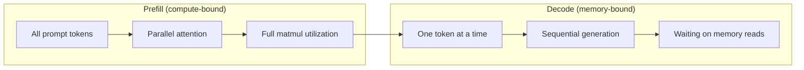
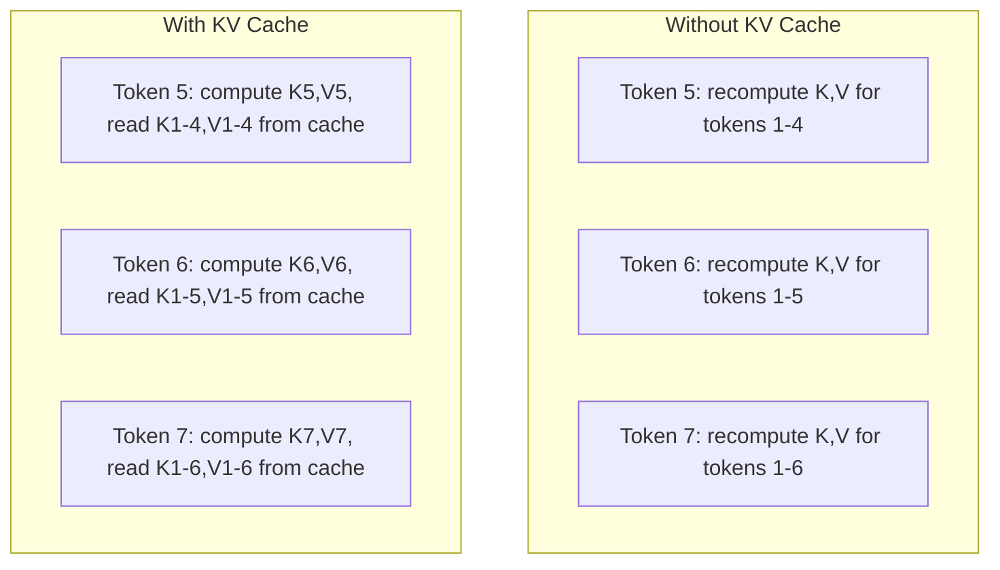
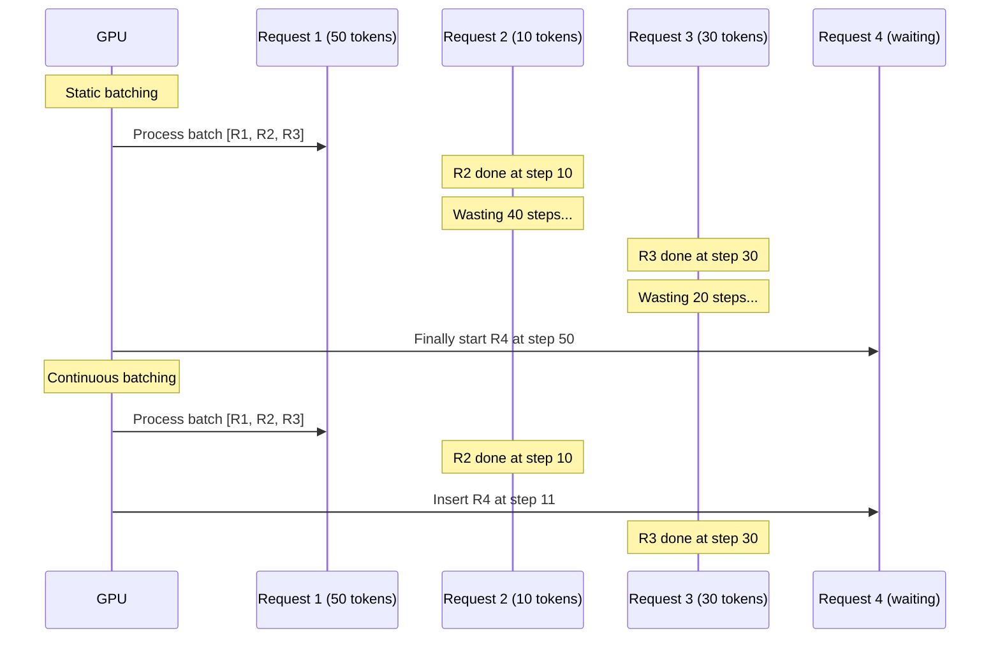
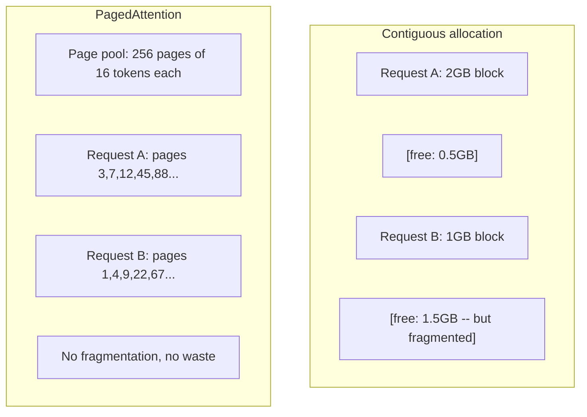
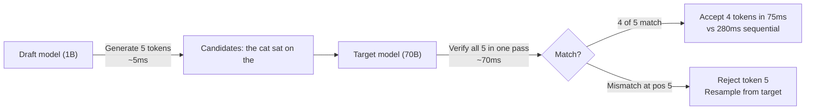

# الاستدلال الأمثل
> مرحلتان تحددان LLM الاستدلال. تقوم عملية التعبئة المسبقة بمعالجة المطالبة بالتوازي - وهي مرتبطة بالحوسبة. يقوم فك التشفير بإنشاء الرموز المميزة واحدة تلو الأخرى - مرتبطة بالذاكرة. يستهدف كل تحسين أحدهما أو كليهما.
**النوع:** بناء
** اللغات: ** بايثون
**المتطلبات الأساسية:** المرحلة العاشرة، الدروس 01-08 (هندسة المحولات، الاهتمام)
**الوقت:** ~120 دقيقة
## أهداف التعلم
- تنفيذ KV-cache للتخلص من الحسابات الزائدة أثناء إنشاء رمز الانحدار التلقائي
- شرح مراحل التعبئة المسبقة مقابل فك التشفير لاستدلال LLM ولماذا تحتوي كل منها على اختناقات مختلفة (مرتبطة بالحساب مقابل مرتبطة بالذاكرة)
- تنفيذ مفاهيم التجميع المستمر وPagedAttention لتعظيم الاستفادة من GPU في ظل الطلبات المتزامنة
- قارن بين تقنيات تحسين الاستدلال (KV-ذاكرة التخزين المؤقت، وفك التشفير التخميني، وانتباه الفلاش) ومقايضات الإنتاجية/زمن الوصول الخاصة بها
## المشكلة
يمكنك نشر Llama 3 70B على وحدات معالجة الرسومات 4xA100. يحصل مستخدم واحد على 50 رمزًا تقريبًا في الثانية. يشعر بسرعة. ثم وصل 100 مستخدم إلى نقطة النهاية في وقت واحد. تنخفض الإنتاجية إلى 3 رموز/ثانية/مستخدم. فاتورتك البالغة 25000 دولار شهريًا GPU تخدم الاستجابات بشكل أبطأ من الأنواع البشرية.
النموذج نفسه لا يتغير بين مستخدم واحد و100 مستخدم. نفس الأوزان، نفس الهندسة المعمارية، نفس الرياضيات. ما يتغير هو كيفية جدولة العمل. الاستدلال الساذج يهدر 90%+ من حساب GPU المتاح. يحتفظ المستخدم الذي ينتظر الرمز المميز 47 بفتحة دفعة كاملة مفتوحة بينما يظل ناقل الذاكرة GPU خاملاً بين matmuls. وفي الوقت نفسه، يمكن لمطالبة المستخدم الجديد بـ 2000 رمز مميز أن تملأ هذا الوقت الميت بحسابات مفيدة.
هذه ليست مشكلة التحجيم. إنها مشكلة في الجدولة. التقنيات الموجودة في هذا الدرس -- التخزين المؤقت KV، التجميع المستمر، PagedAttention، فك التشفير التخميني، التخزين المؤقت للبادئة -- هي ما يفصل فاتورة الاستدلال البالغة 25 ألف دولار شهريًا عن فاتورة بقيمة 5 آلاف دولار شهريًا تخدم نفس حركة المرور.
يحقق vLLM الذي يقدم Llama 3 70B على 4xA100-80GB ما يقرب من 50 رمزًا مميزًا/ثانية/مستخدم بتزامن منخفض، ويحافظ على 15-25 TPS/مستخدم عند 100 طلب متزامن من خلال التجميع المستمر وPagedAttention. بدون هذه التحسينات، يخدم نفس الجهاز 5 TPS/مستخدم في هذا التزامن. نفس وحدات معالجة الرسومات، نفس الطراز، 4 أضعاف الإنتاجية.
##المفهوم
### الملء المسبق مقابل فك التشفير
يحتوي كل طلب استدلال LLM على مرحلتين متميزتين.
**الملء المسبق** يعالج موجه الإدخال بالكامل. جميع الرموز المميزة معروفة، لذلك يمكن حساب الانتباه بالتوازي عبر التسلسل الكامل. هذا ضرب مصفوفة كبيرة - تظل النوى GPU مشغولة. عنق الزجاجة هو الحساب: عدد FLOPS الذي يمكن لجهازك توصيله في الثانية. A100 ينطبق على 312 TFLOPS (BF16). تستغرق عملية التعبئة المسبقة لمطالبة مكونة من 4,096 رمزًا مميزًا على طراز 70B حوالي 400 مللي ثانية في A100 واحد.
**فك التشفير** يُنشئ رموز الإخراج واحدًا تلو الآخر. يعتني كل رمز مميز جديد بجميع الرموز المميزة السابقة، ولكن يتم إنتاج رمز مميز واحد فقط لكل تمريرة أمامية. تكون مصفوفات الوزن بنفس الحجم أثناء التعبئة المسبقة، ولكنك تقوم بضربها بمتجه واحد بدلاً من المصفوفة. تنتهي نوى GPU بالميكروثانية، ثم انتظر وصول الدفعة التالية من الأوزان من الذاكرة. عنق الزجاجة هو عرض النطاق الترددي للذاكرة: مدى السرعة التي يمكنك بها دفق أوزان النموذج من HBM إلى وحدات الحوسبة. يحتوي A100 على عرض نطاق ترددي يبلغ 2 TB/s. نموذج 70B في FP16 هو 140 GB. تستغرق قراءة النموذج الكامل مرة واحدة 70 مللي ثانية - وهذا هو الحد الأدنى لخطوة فك التشفير الواحدة.


تلتقط **نسبة العمليات: البايت** (وتسمى أيضًا الكثافة الحسابية) هذه المقايضة. فهو يقيس عدد العمليات التي تقوم بها لكل بايت يتم تحميله من الذاكرة.
```
ops:byte ratio = FLOPs per token / bytes read from memory
```

أثناء التعبئة المسبقة لمجموعة مكونة من 4,096 رمزًا مميزًا، يمكنك تنفيذ ما يقرب من 4,096 عملية تراكم مضاعفة لكل وزن تم تحميله. النسبة عالية - أنت ملزم بالحساب. أثناء فك التشفير بحجم الدُفعة 1، يمكنك إجراء عملية واحدة تقريبًا لكل وزن تم تحميله. النسبة منخفضة - أنت مرتبط بالذاكرة.
الفكرة الأساسية: *فك التشفير مرتبط بالذاكرة لأنك تقرأ النموذج بأكمله لإنتاج رمز مميز واحد*. كل تحسين أدناه إما يقلل ما تقرأه، أو يزيد من مجموعة الرموز المميزة التي تتم معالجتها لكل قراءة، أو يتجنب عمليات القراءة تمامًا.
### KV ذاكرة التخزين المؤقت
أثناء الاهتمام، يقوم استعلام كل رمز مميز بالاهتمام بمفتاح كل رمز مميز سابق ومتجهات القيمة. بدون التخزين المؤقت، يتطلب إنشاء الرمز المميز N إعادة حساب توقعات المفتاح والقيمة لجميع الرموز المميزة السابقة N-1. يتم عرض الرمز المميز 1 عند إنشاء الرمز المميز 2، ثم مرة أخرى للرمز المميز 3، ثم مرة أخرى للرمز المميز 4. بواسطة الرمز المميز 1000، قمت بإسقاط الرمز المميز 1 إجمالي 999 مرة.
تقوم ذاكرة التخزين المؤقت KV بتخزين توقعات المفتاح والقيمة من جميع الرموز المميزة السابقة. عند إنشاء الرمز المميز N، فإنك تحسب فقط المفتاح والقيمة للرمز المميز N، ثم تقوم بتسلسلهما مع K/V المخزن مؤقتًا من الرموز المميزة من 1 إلى N-1.


**صيغة الذاكرة لذاكرة التخزين المؤقت KV:**
```
KV cache size = 2 * num_layers * num_kv_heads * head_dim * seq_len * bytes_per_param
```

بالنسبة إلى Llama 3 70B (80 طبقة، 8 رؤوس KV مع GQA، head_dim=128، BF16):
```
per token: 2 * 80 * 8 * 128 * 2 bytes = 327,680 bytes = 320 KB
at 4,096 tokens: 320 KB * 4,096 = 1.28 GB
at 128K tokens: 320 KB * 131,072 = 40 GB
```

تستهلك محادثة واحدة ذات سياق 128 كيلو بايت لـ Llama 3 70B 40 GB من ذاكرة التخزين المؤقت KV -- نصف ذاكرة A100. مع وجود 100 مستخدم متزامن برموز 4K لكل منهم، تتطلب ذاكرة التخزين المؤقت KV وحدها 128 GB. هذا هو السبب في أن إدارة ذاكرة التخزين المؤقت KV هي التحدي الرئيسي لتحسين الاستدلال.
### الخلط المستمر
ينتظر التجميع الثابت حتى وصول مجموعة من طلبات N، ويعالجها معًا، وينتظر حتى تنتهي *الكل* قبل قبول الطلبات الجديدة. إذا كان أحد الطلبات يحتاج إلى 500 رمزًا وآخر يحتاج إلى 10، فسيظل الطلب القصير خاملاً لمدة 490 خطوة لفك التشفير بعد انتهائه.
يؤدي التجميع المستمر (يُسمى أيضًا التجميع على مستوى التكرار) إلى إدراج طلبات جديدة في المجموعة بمجرد اكتمال أي طلب. تتم إعادة تقييم الدفعة في كل خطوة فك التشفير. يتم استبدال الطلب الذي ينتهي بعد 10 رموز على الفور بطلب انتظار.


يعتمد تحسين الإنتاجية على مقدار اختلاف أطوال الإخراج. مع الأطوال الموحدة، يتطابق التجميع المستمر مع التجميع الثابت. مع الأطوال المتغيرة (الحالة الشائعة)، يمكن أن يوفر التجميع المستمر إنتاجية أعلى بمقدار 2-5 مرات لأن فتحات GPU لا تظل فارغة أبدًا.
### PagedAttention
ذاكرة التخزين المؤقت KV لكل طلب عبارة عن كتلة متجاورة من الذاكرة. مع وصول الطلبات ومغادرتها، تتفتت الذاكرة - تمامًا مثل تجزئة RAM في أنظمة التشغيل. يحتاج طلب رمز 4K إلى 1.28 GB متجاورة. حتى لو كان لديك GB إجماليًا مجانيًا، فقد لا يكون لديك 1.28 GB *مجاورين*. إما أن تضيع الذاكرة أو ترفض الطلب.
يطبق PagedAttention (من vLLM) الذاكرة الظاهرية بنمط OS على ذاكرة التخزين المؤقت KV. بدلاً من تخصيص كتلة واحدة متجاورة لكل طلب، فإنه يخصص "صفحات" ذات حجم ثابت (عادةً 16 رمزًا مميزًا لكل منها). يمكن أن تكون الصفحات في أي مكان في ذاكرة GPU الفعلية. يقوم جدول الصفحة بتعيين مواضع التسلسل المنطقي لكل طلب إلى مواقع الصفحات الفعلية.


يتيح PagedAttention أيضًا **النسخ عند الكتابة** للبادئات المشتركة. إذا شارك 50 طلبًا نفس موجه النظام، فسيتم تخزين صفحات ذاكرة التخزين المؤقت KV لموجه النظام هذا مرة واحدة ويتم الرجوع إليها بواسطة جميع الطلبات الخمسين. فقط عندما يتباين الطلب (رسائل مستخدم مختلفة)، فإنه يحصل على صفحاته الخاصة. يؤدي هذا إلى تقليل استخدام الذاكرة بشكل كبير للتطبيقات ذات مطالبات النظام المشتركة.
يُبلغ vLLM عن إهدار الذاكرة بالقرب من الصفر (حوالي 4% مقابل ~60-80% في التخصيص الساذج) من خلال PagedAttention.
### فك التشفير التخميني
فك التشفير بطيء لأنه متسلسل - فأنت تنشئ رمزًا مميزًا واحدًا، ثم تغذيه مرة أخرى، وتولد الرمز التالي. ولكن ماذا لو كان بإمكانك تخمين الرموز الخمسة التالية بتكلفة زهيدة، ثم التحقق منها جميعًا مرة واحدة؟
يستخدم فك التشفير التخميني **مسودة نموذج** صغيرة وسريعة لإنشاء رموز K المرشحة. يقوم **النموذج المستهدف** الكبير بعد ذلك بمعالجة جميع مرشحات K في تمريرة أمامية واحدة (والتي تبدو وكأنها تعبئة مسبقة - متوازية ومرتبطة بالحساب وفعالة). إذا وافق النموذج المستهدف مع تنبؤات مسودة النموذج، فإنك تقبل جميع رموز K المميزة في وقت تمرير هدف واحد للأمام. إذا لم يتفق مع الموضع j، فإنك تقبل الرموز المميزة من 1 إلى j-1 وتتجاهل الباقي.


يعتمد التسريع على **معدل القبول** - عدد المرات التي تتطابق فيها تنبؤات نموذج المسودة مع الهدف. بالنسبة لصياغة Llama 3 8B لـ Llama 3 70B، فإن معدلات القبول تتراوح بين 70-85% وهي نموذجية في اللغة الطبيعية. وهذا يترجم إلى تسريع فك التشفير بمقدار 2-3x.
ثلاث طرق لفك التشفير التخميني:
| الطريقة | مصدر المسودة | معدل القبول | النفقات العامة |
|--------|------------|-----------------|----------|
| مسودة الهدف (ليفياثان وآخرون) | نموذج صغير منفصل | 70-85% | مشروع نموذج الذاكرة |
| EAGLE (لي وآخرون) | رأس خفيف الوزن على الهدف | 75-90% | ~1% معلمات إضافية |
| بحث N-جرام | جدول الرمز المميز n-gram | 40-60% | لا يذكر |
**EAGLE** يقوم بتدريب رأس انحدار ذاتي صغير أعلى الحالات المخفية للنموذج المستهدف. ويتنبأ بتضمين الرمز المميز التالي باستخدام ميزات الطبقة الثانية إلى الأخيرة للنموذج المستهدف. نظرًا لأنه يعمل على التمثيلات الخاصة بالنموذج المستهدف (وليس نموذجًا منفصلاً)، فإنه يحقق معدلات قبول أعلى مع الحد الأدنى من الذاكرة الإضافية. يضيف EAGLE-2 شجرة مسودة ديناميكية تقوم بضبط عدد المرشحين بناءً على السياق.
** فك التشفير التخميني لـ N-gram ** يحتفظ بجدول استمرارات n-gram من السياق الحالي أو مجموعة بيانات تم إنشاؤها مسبقًا. إذا تطابقت المسودة مع ما ظهر من قبل في نفس المحادثة (الأنماط المتكررة، التعليمات البرمجية، المخرجات المنظمة)، فسيتم تشغيلها بدون أي حمل للشبكة العصبية. معدلات القبول أقل في المتوسط ​​ولكن تكلفة المضاربة مجانية بشكل أساسي.
فك التشفير التخميني *دقيق رياضيًا* - توزيع المخرجات مطابق لتوزيع النموذج المستهدف. انها ليست تقريبية. تضمن خطوة التحقق أن كل رمز مميز مقبول لديه بالضبط الاحتمالية التي قد يعينها النموذج المستهدف.
### التخزين المؤقت للبادئة
العديد من الطلبات تشترك في نفس البادئة. موجه نظام chatbot. كتلة سياق RAG. مجموعة أمثلة قليلة. بدون التخزين المؤقت للبادئة، يقوم كل طلب بإعادة حساب ذاكرة التخزين المؤقت KV لهذه الرموز المميزة المشتركة من البداية.
يقوم التخزين المؤقت للبادئة بتخزين ذاكرة التخزين المؤقت KV للبادئات الشائعة ويعيد استخدامها عبر الطلبات. عندما يصل طلب جديد ببادئة معروفة، يقوم النظام بنسخ (أو الإشارة) إلى إدخالات KV المخزنة مؤقتًا ويحسب فقط KV لللاحقة الفريدة.
بالنسبة لمطالبة النظام المكونة من 2000 رمز مميز والتي تتم مشاركتها عبر جميع الطلبات، فإن التخزين المؤقت للبادئة يزيل حوالي 400 مللي ثانية من التعبئة المسبقة لكل طلب. عند 100 طلب/ثانية، يوفر ذلك 40 ثانية من GPU حساب في الثانية - أكثر من GPU من العمل.
ينفذ RadixAttention من SGLang التخزين المؤقت للبادئة باستخدام شجرة الجذر (trie) التي تقوم بفهرسة البادئات حسب محتوى الرمز المميز الخاص بها. أي طلب يطابق بادئة مخزنة يحصل على ذاكرة التخزين المؤقت KV الخاصة به مجانًا. تعمل الشجرة على تمكين التطابقات الجزئية للبادئة - إذا قمت بمشاركة 1500 من 2000 رمز مميز للبادئة مع إدخال مخبأ، فإنك تعيد استخدام تلك الـ 1500 وتعيد حساب 500 فقط.
### محركات الاستدلال
هناك ثلاثة محركات تهيمن على خدمة الإنتاج LLM:
| المحرك | الابتكار الرئيسي | الأفضل لـ |
|--------|--------------|---------|
| vLLM | PagedAttention، الدفع المستمر | خدمة للأغراض العامة، أعلى مستوى من التوافق |
| اس جلانج | RadixAttention (التخزين المؤقت للبادئة)، التوليد المنظم | روبوتات الدردشة متعددة الأدوار، وفك التشفير المقيد |
| TensorRT-LLM | NVIDIA اندماج النواة، FP8 التكميم | الحد الأقصى للإنتاجية الفردية GPU على أجهزة NVIDIA |
**vLLM** هي نقطة البداية الافتراضية. وهو يدعم أكبر مجموعة من النماذج، ويعمل على أي بائع GPU (NVIDIA، AMD، Intel)، ويحقق إنتاجية قوية من خلال PagedAttention + التجميع المستمر. يعني OpenAI المتوافق API أنه يمكنك إضافته كبديل لأي مكالمة OpenAI API.
يعتمد **SGLang** على نفس أسس vLLM ولكنه يضيف RadixAttention للتخزين المؤقت للبادئة ولغة خاصة بالمجال لبرامج LLM المنظمة. إذا كان عبء العمل الخاص بك يتضمن محادثات متعددة الأدوار، أو استخدام أداة، أو فك تشفير مقيد (JSON إخراج، إنشاء موجه بواسطة regex)، فغالبًا ما يتفوق SGLang على vLLM بمقدار 2-5x من خلال إعادة استخدام البادئة.
** TensorRT-LLM** يجمع النماذج في نواة NVIDIA GPU محسنة. فهو يدمج العمليات (الانتباه + الخطي + التنشيط في نواة واحدة)، ويستخدم FP8 على وحدات معالجة الرسوميات H100، ويتكامل مع NVIDIA Triton Inference Server لنشر الإنتاج. إنه يحقق أعلى إنتاجية فردية GPU على أجهزة NVIDIA ولكنه يتطلب المزيد من الإعداد ويعمل فقط على وحدات معالجة الرسومات NVIDIA.
أرقام حقيقية لـ Llama 3 70B (4xA100-80GB، BF16):
| متري | vLLM | اس جلانج | TensorRT-LLM |
|--------|------|--------|---------------|
| الإنتاجية (مستخدم واحد) | ~50 TPS | ~55 TPS | ~65 TPS |
| الإنتاجية (100 مستخدم) | ~2500 إجمالي TPS | ~3,200 إجمالي TPS | ~3000 إجمالي TPS |
| الوقت لأول رمز مميز | ~400 مللي ثانية | ~300 مللي ثانية (ضرب البادئة) | ~350 مللي ثانية |
| سياق ماكس | 128 ألف | 128 ألف | 128 ألف |
### العمليات: إطار بايت
لا يمكنك تحسين ما لا تقيسه. تخبرك نسبة العمليات: البايت عما إذا كنت مقيدًا بالحوسبة أو بالذاكرة، مما يحدد التحسينات المهمة.
```
Compute roof: peak FLOPS of the GPU
Memory roof:  peak bandwidth * ops:byte ratio
```

عندما تكون العمليات: البايت منخفضة (فك التشفير، دفعات صغيرة)، فإنك تصل إلى سقف النطاق الترددي للذاكرة. إن إضافة المزيد من الحوسبة (ساعة أعلى، المزيد من النوى) لا يساعد. أنت بحاجة إلى تقليل قراءات الذاكرة (التكميم، KV ضغط ذاكرة التخزين المؤقت) أو زيادة حجم الدُفعة لاستهلاك القراءات عبر عمل أكثر فائدة.
عندما تكون العمليات: البايت عالية (التعبئة المسبقة، دفعات كبيرة)، فإنك تصل إلى سقف الحوسبة. تحسين عرض النطاق الترددي للذاكرة لا يساعد. أنت بحاجة إلى وحدات معالجة رسومات أسرع، أو دمج kernel، أو دقة أقل للضغط على المزيد من FLOPS.
| السيناريو | العمليات: بايت | منضم | التحسين باستخدام |
|----------|---------|------|---------------|
| التعبئة المسبقة، الدفعة = 1 | ~4,096 | حساب | اندماج النواة، FP8 |
| فك التشفير، الدفعة=1 | ~1 | الذاكرة | التكميم، KV الضغط |
| فك التشفير الدفعة = 32 | ~32 | الذاكرة | دفعة أكبر، الخلط المستمر |
| فك التشفير الدفعة = 256 | ~256 | الانتقال | كلا الأمرين |
| فك التشفير الدفعة = 1024 | ~1,024 | حساب | اندماج النواة، توازي الموتر |
نقطة التقاطع في A100 تقع حول ops:byte = 156 (312 TFLOPS / 2 TB/s). أقل من 156، أنت مرتبط بالذاكرة. فوق 156، أنت ملزم بالحوسبة. يؤدي التجميع المستمر إلى دفع فك التشفير نحو هذا التقاطع عن طريق تعبئة المزيد من الرموز المميزة لكل تكرار.
## بنائها
### الخطوة 1: KV ذاكرة التخزين المؤقت من الصفر
لقد قمنا ببناء ذاكرة تخزين مؤقت KV متعددة الرؤوس تقوم بتخزين إسقاطات المفاتيح والقيمة لكل طبقة، لكل رأس، وتوضح نمط نمو الذاكرة.
```python
import numpy as np

class KVCache:
    def __init__(self, num_layers, num_heads, head_dim, max_seq_len, dtype=np.float16):
        self.num_layers = num_layers
        self.num_heads = num_heads
        self.head_dim = head_dim
        self.max_seq_len = max_seq_len
        self.dtype = dtype

        self.k_cache = np.zeros(
            (num_layers, num_heads, max_seq_len, head_dim), dtype=dtype
        )
        self.v_cache = np.zeros(
            (num_layers, num_heads, max_seq_len, head_dim), dtype=dtype
        )
        self.seq_len = 0

    def update(self, layer_idx, new_keys, new_values):
        num_new = new_keys.shape[1]
        end = self.seq_len + num_new
        self.k_cache[layer_idx, :, self.seq_len:end, :] = new_keys
        self.v_cache[layer_idx, :, self.seq_len:end, :] = new_values
        return (
            self.k_cache[layer_idx, :, :end, :],
            self.v_cache[layer_idx, :, :end, :]
        )

    def advance(self, num_tokens):
        self.seq_len += num_tokens

    def memory_bytes(self):
        return self.k_cache.nbytes + self.v_cache.nbytes

    def used_bytes(self):
        per_token = 2 * self.num_layers * self.num_heads * self.head_dim * np.dtype(self.dtype).itemsize
        return per_token * self.seq_len
```

### الخطوة الثانية: انتبه إلى ذاكرة التخزين المؤقت KV
تنبيه مبسط متعدد الرؤوس يستخدم ذاكرة التخزين المؤقت KV لخطوات فك التشفير.
```python
def scaled_dot_product_attention(query, keys, values):
    head_dim = query.shape[-1]
    scores = np.matmul(query, keys.transpose(0, 1, 3, 2)) / np.sqrt(head_dim)
    seq_len_q = scores.shape[-2]
    seq_len_k = scores.shape[-1]
    if seq_len_q > 1:
        mask = np.triu(np.ones((seq_len_q, seq_len_k), dtype=np.float32), k=seq_len_k - seq_len_q + 1)
        scores = scores + mask * (-1e9)
    max_scores = np.max(scores, axis=-1, keepdims=True)
    exp_scores = np.exp(scores - max_scores)
    attn_weights = exp_scores / np.sum(exp_scores, axis=-1, keepdims=True)
    return np.matmul(attn_weights, values)


class MultiHeadAttention:
    def __init__(self, d_model, num_heads):
        self.num_heads = num_heads
        self.head_dim = d_model // num_heads
        scale = np.sqrt(2.0 / d_model)
        self.W_q = np.random.randn(d_model, d_model).astype(np.float32) * scale
        self.W_k = np.random.randn(d_model, d_model).astype(np.float32) * scale
        self.W_v = np.random.randn(d_model, d_model).astype(np.float32) * scale
        self.W_o = np.random.randn(d_model, d_model).astype(np.float32) * scale

    def forward(self, x, kv_cache=None, layer_idx=0):
        batch, seq_len, d_model = x.shape
        Q = np.matmul(x, self.W_q).reshape(batch, seq_len, self.num_heads, self.head_dim).transpose(0, 2, 1, 3)
        K = np.matmul(x, self.W_k).reshape(batch, seq_len, self.num_heads, self.head_dim).transpose(0, 2, 1, 3)
        V = np.matmul(x, self.W_v).reshape(batch, seq_len, self.num_heads, self.head_dim).transpose(0, 2, 1, 3)

        if kv_cache is not None:
            K_full, V_full = kv_cache.update(layer_idx, K[0], V[0])
            K = K_full[np.newaxis, :, :, :]
            V = V_full[np.newaxis, :, :, :]
            if seq_len == 1:
                kv_cache.advance(1)

        attn_out = scaled_dot_product_attention(Q, K, V)
        attn_out = attn_out.transpose(0, 2, 1, 3).reshape(batch, -1, d_model)
        return np.matmul(attn_out, self.W_o)
```

### الخطوة 3: محاكاة التجميع المستمر
هذا يحاكي فرق الجدولة بين الدفع الثابت والمستمر.
```python
import heapq

class Request:
    def __init__(self, request_id, prompt_tokens, output_tokens, arrival_step):
        self.request_id = request_id
        self.prompt_tokens = prompt_tokens
        self.output_tokens = output_tokens
        self.arrival_step = arrival_step
        self.tokens_generated = 0
        self.start_step = None
        self.end_step = None

    def is_done(self):
        return self.tokens_generated >= self.output_tokens


def simulate_static_batching(requests, batch_size):
    step = 0
    completed = []
    queue = list(requests)
    queue.sort(key=lambda r: r.arrival_step)

    while queue:
        batch = []
        while queue and len(batch) < batch_size:
            r = queue.pop(0)
            r.start_step = max(step, r.arrival_step)
            batch.append(r)

        if batch:
            step = max(step, max(r.start_step for r in batch))
            max_output = max(r.output_tokens for r in batch)
            for r in batch:
                r.tokens_generated = r.output_tokens
                r.end_step = step + max_output
            step += max_output
            completed.extend(batch)

    return completed


def simulate_continuous_batching(requests, batch_size):
    step = 0
    completed = []
    queue = sorted(requests, key=lambda r: r.arrival_step)
    queue_idx = 0
    active = []
    waiting = []

    while queue_idx < len(queue) or active or waiting:
        while queue_idx < len(queue) and queue[queue_idx].arrival_step <= step:
            waiting.append(queue[queue_idx])
            queue_idx += 1

        while waiting and len(active) < batch_size:
            r = waiting.pop(0)
            r.start_step = step
            active.append(r)

        if not active:
            if waiting:
                step += 1
                continue
            elif queue_idx < len(queue):
                step = queue[queue_idx].arrival_step
                continue
            else:
                break

        for r in active:
            r.tokens_generated += 1

        done = [r for r in active if r.is_done()]
        for r in done:
            r.end_step = step + 1
            completed.append(r)
        active = [r for r in active if not r.is_done()]

        step += 1

    return completed


def batching_stats(completed):
    latencies = [r.end_step - r.arrival_step for r in completed]
    total_time = max(r.end_step for r in completed) - min(r.arrival_step for r in completed)
    total_tokens = sum(r.output_tokens for r in completed)
    return {
        "avg_latency": np.mean(latencies),
        "p50_latency": np.median(latencies),
        "p99_latency": np.percentile(latencies, 99),
        "total_time": total_time,
        "throughput": total_tokens / total_time if total_time > 0 else 0,
    }
```

### الخطوة 4: بادئة ذاكرة التخزين المؤقت
ذاكرة تخزين مؤقت للبادئة قائمة على أساس ثلاثي تقوم بتخزين إدخالات KV للبادئات المشتركة.
```python
class TrieNode:
    def __init__(self):
        self.children = {}
        self.kv_data = None
        self.hit_count = 0


class PrefixCache:
    def __init__(self, max_entries=1000):
        self.root = TrieNode()
        self.max_entries = max_entries
        self.total_entries = 0
        self.hits = 0
        self.misses = 0

    def _walk(self, token_ids):
        node = self.root
        depth = 0
        for tid in token_ids:
            if tid not in node.children:
                break
            node = node.children[tid]
            depth += 1
        return node, depth

    def lookup(self, token_ids):
        node, depth = self._walk(token_ids)
        if depth > 0:
            self.hits += 1
            current = self.root
            for tid in token_ids[:depth]:
                current = current.children[tid]
                current.hit_count += 1
            kv_entries = []
            current = self.root
            for tid in token_ids[:depth]:
                current = current.children[tid]
                if current.kv_data is not None:
                    kv_entries.append(current.kv_data)
            return depth, kv_entries
        self.misses += 1
        return 0, []

    def insert(self, token_ids, kv_per_token):
        node = self.root
        for i, tid in enumerate(token_ids):
            if tid not in node.children:
                if self.total_entries >= self.max_entries:
                    return i
                node.children[tid] = TrieNode()
                self.total_entries += 1
            node = node.children[tid]
            if i < len(kv_per_token):
                node.kv_data = kv_per_token[i]
        return len(token_ids)

    def hit_rate(self):
        total = self.hits + self.misses
        return self.hits / total if total > 0 else 0.0
```

### الخطوة 5: محاكي فك التشفير التأملي
نحن نحاكي فك التشفير التخميني لمسودة الهدف بمعدلات قبول قابلة للتكوين.
```python
class DraftModel:
    def __init__(self, vocab_size, acceptance_rate=0.8):
        self.vocab_size = vocab_size
        self.acceptance_rate = acceptance_rate

    def generate(self, context, num_tokens):
        tokens = np.random.randint(0, self.vocab_size, size=num_tokens)
        return tokens

    def get_probs(self, context, token):
        probs = np.random.dirichlet(np.ones(self.vocab_size))
        return probs


class TargetModel:
    def __init__(self, vocab_size):
        self.vocab_size = vocab_size

    def get_probs(self, context, tokens=None):
        if tokens is not None:
            return [np.random.dirichlet(np.ones(self.vocab_size)) for _ in tokens]
        return np.random.dirichlet(np.ones(self.vocab_size))


def speculative_decode(draft_model, target_model, context, num_speculative=5,
                       draft_cost=1.0, target_cost=10.0, verify_cost=12.0):
    total_tokens = 0
    total_cost = 0.0
    accepted_counts = []
    context = list(context)

    max_tokens = 100

    while total_tokens < max_tokens:
        draft_tokens = draft_model.generate(context, num_speculative)
        total_cost += draft_cost * num_speculative

        target_probs = target_model.get_probs(context, draft_tokens)
        total_cost += verify_cost

        accepted = 0
        for i, token in enumerate(draft_tokens):
            draft_p = draft_model.get_probs(context + list(draft_tokens[:i]), token)
            target_p = target_probs[i]

            r = np.random.random()
            acceptance_prob = min(1.0, target_p[token] / (draft_p[token] + 1e-10))

            if r < draft_model.acceptance_rate:
                accepted += 1
                context.append(token)
                total_tokens += 1
            else:
                new_token = np.random.choice(draft_model.vocab_size, p=target_p)
                context.append(new_token)
                total_tokens += 1
                break

        accepted_counts.append(accepted)

        if accepted == num_speculative:
            bonus_probs = target_model.get_probs(context)
            bonus_token = np.random.choice(draft_model.vocab_size, p=bonus_probs)
            context.append(bonus_token)
            total_tokens += 1

    sequential_cost = total_tokens * target_cost
    return {
        "total_tokens": total_tokens,
        "speculative_cost": total_cost,
        "sequential_cost": sequential_cost,
        "speedup": sequential_cost / total_cost if total_cost > 0 else 1.0,
        "avg_accepted": np.mean(accepted_counts),
        "acceptance_rate": np.mean(accepted_counts) / num_speculative,
    }


def compare_speculation_strategies(vocab_size=1000, num_trials=20):
    results = {}

    for name, acceptance_rate, spec_tokens in [
        ("Draft-target (8B->70B)", 0.78, 5),
        ("EAGLE", 0.85, 6),
        ("N-gram", 0.50, 4),
        ("No speculation", 0.0, 0),
    ]:
        if spec_tokens == 0:
            results[name] = {
                "speedup": 1.0,
                "acceptance_rate": 0.0,
                "avg_accepted": 0.0,
            }
            continue

        trial_results = []
        for _ in range(num_trials):
            draft = DraftModel(vocab_size, acceptance_rate=acceptance_rate)
            target = TargetModel(vocab_size)
            context = list(np.random.randint(0, vocab_size, size=10))
            result = speculative_decode(draft, target, context, num_speculative=spec_tokens)
            trial_results.append(result)

        results[name] = {
            "speedup": np.mean([r["speedup"] for r in trial_results]),
            "acceptance_rate": np.mean([r["acceptance_rate"] for r in trial_results]),
            "avg_accepted": np.mean([r["avg_accepted"] for r in trial_results]),
        }

    return results
```

### الخطوة 6: KV ملف تعريف ذاكرة التخزين المؤقت
حساب متطلبات ذاكرة التخزين المؤقت KV لتكوينات النموذج الحقيقي.
```python
MODEL_CONFIGS = {
    "Llama-3-8B": {
        "num_layers": 32, "num_kv_heads": 8, "head_dim": 128,
        "model_params_b": 8, "gqa": True,
    },
    "Llama-3-70B": {
        "num_layers": 80, "num_kv_heads": 8, "head_dim": 128,
        "model_params_b": 70, "gqa": True,
    },
    "Llama-3-405B": {
        "num_layers": 126, "num_kv_heads": 8, "head_dim": 128,
        "model_params_b": 405, "gqa": True,
    },
    "Mistral-7B": {
        "num_layers": 32, "num_kv_heads": 8, "head_dim": 128,
        "model_params_b": 7, "gqa": True,
    },
    "GPT-4-est": {
        "num_layers": 120, "num_kv_heads": 96, "head_dim": 128,
        "model_params_b": 1800, "gqa": False,
    },
}


def kv_cache_memory(config, seq_len, dtype_bytes=2):
    per_token = 2 * config["num_layers"] * config["num_kv_heads"] * config["head_dim"] * dtype_bytes
    total = per_token * seq_len
    return {
        "per_token_bytes": per_token,
        "per_token_kb": per_token / 1024,
        "total_bytes": total,
        "total_mb": total / (1024 ** 2),
        "total_gb": total / (1024 ** 3),
    }


def memory_budget(config, gpu_memory_gb, model_dtype_bytes=2, kv_dtype_bytes=2):
    model_memory_gb = config["model_params_b"] * 1e9 * model_dtype_bytes / (1024 ** 3)
    overhead_gb = gpu_memory_gb * 0.1
    available_for_kv = gpu_memory_gb - model_memory_gb - overhead_gb

    if available_for_kv <= 0:
        return {"error": "Model does not fit in GPU memory", "model_memory_gb": model_memory_gb}

    per_token = 2 * config["num_layers"] * config["num_kv_heads"] * config["head_dim"] * kv_dtype_bytes
    max_tokens = int(available_for_kv * (1024 ** 3) / per_token)

    return {
        "gpu_memory_gb": gpu_memory_gb,
        "model_memory_gb": round(model_memory_gb, 1),
        "overhead_gb": round(overhead_gb, 1),
        "available_for_kv_gb": round(available_for_kv, 1),
        "max_total_tokens": max_tokens,
        "max_users_at_2k": max_tokens // 2048,
        "max_users_at_4k": max_tokens // 4096,
        "max_users_at_32k": max_tokens // 32768,
    }
```

## استخدمه
مع vLLM:
```python
from vllm import LLM, SamplingParams

llm = LLM(
    model="meta-llama/Llama-3-70B-Instruct",
    tensor_parallel_size=4,
    enable_prefix_caching=True,
    max_model_len=8192,
    gpu_memory_utilization=0.9,
)

params = SamplingParams(temperature=0.7, max_tokens=256)
outputs = llm.generate(["Explain inference optimization in one paragraph."], params)
```

باستخدام SGLang للتخزين المؤقت للبادئة + الإخراج المنظم:
```python
import sglang as sgl

@sgl.function
def classify(s, text):
    s += sgl.system("You are a classifier. Output JSON only.")
    s += sgl.user(f"Classify this text: {text}")
    s += sgl.assistant(sgl.gen("result", regex=r'\{"label": "(positive|negative|neutral)"\}'))

runtime = sgl.Runtime(model_path="meta-llama/Llama-3-70B-Instruct", tp_size=4)
sgl.set_default_backend(runtime)

results = classify.run_batch([
    {"text": "This product is amazing!"},
    {"text": "Terrible experience."},
    {"text": "It was okay I guess."},
])
```

مع TensorRT-LLM:
```python
import tensorrt_llm
from tensorrt_llm.runtime import ModelRunner

runner = ModelRunner.from_dir("./llama-70b-trt-engine/", rank=0)

outputs = runner.generate(
    batch_input_ids=[tokenizer.encode("Explain KV caching.")],
    max_new_tokens=256,
    temperature=0.7,
)
```

## اشحنها
ينتج هذا الدرس:
- `outputs/skill-inference-optimization.md` -- مهارة لتشخيص وتحسين خدمة الاستدلال LLM
## تمارين
1. قم بتعديل ملف تعريف ذاكرة التخزين المؤقت KV لمقارنة FP16 مقابل FP8 مقابل INT4 KV تكميم ذاكرة التخزين المؤقت. بالنسبة إلى Llama 3 70B في سياق 4K، قم بحساب الحد الأقصى للمستخدمين المتزامنين لكل منهم على 4xA100-80GB. KV يجب أن يصل التكميم إلى INT4 إلى 4 أضعاف سعة المستخدم تقريبًا.
2. قم بتوسيع جهاز محاكاة الدُفعات المستمر لتتبع استخدام GPU (جزء من فتحات الدُفعات المملوءة في كل خطوة). استخدام المخطط بمرور الوقت لكل من الدفعات الثابتة والمستمرة مع 50 طلبًا تتبع أطوال مخرجاتها توزيع باريتو (الشكل = 1.5، المقياس = 20). يجب أن يحافظ الخلط المستمر على الاستفادة من 80%.
3. قم بتنفيذ إصدار استعلام مجمع (GQA) من ذاكرة التخزين المؤقت KV حيث `num_kv_heads < num_query_heads`. يستخدم Llama 3 70B 64 رأس استعلام ولكن 8 رؤوس KV فقط. حساب توفير الذاكرة مقابل الاهتمام الكامل متعدد الرؤوس (تخفيض 8x في حجم ذاكرة التخزين المؤقت KV).
4. أنشئ ذاكرة تخزين مؤقت للبادئة تستخدم الإخلاء LRU. قم بتعيين max_entries على 500 وقم بإنشاء 1000 طلب حيث يشترك 60% في واحدة من البادئات الخمس الشائعة. قم بقياس معدل الإصابة ومقارنته بذاكرة تخزين مؤقت غير محدودة. مع الإخلاء الجيد، يجب أن يظل معدل الضرب أعلى من 55٪.
5. توسيع نطاق محاكاة فك التشفير التخميني لتنفيذ التخمينات القائمة على الشجرة (نمط EAGLE-2). بدلاً من سلسلة واحدة من رموز المسودة K، قم بإنشاء شجرة من المرشحين (على سبيل المثال، فرعين في كل مستوى من المستويات الثلاثة = 8 أوراق مرشحة). قارن إجمالي الرموز المميزة المقبولة في كل جولة تحقق مقابل المضاربة الخطية.
## المصطلحات الرئيسية
| مصطلح | ماذا يقول الناس | ماذا يعني في الواقع |
|------|----------------|----------------------|
| تعبئة مسبقة | "معالجة الموجه" | الاهتمام الحسابي بجميع الرموز المميزة للإدخال بالتوازي - مرتبط بالحساب لأن الضرب الكامل للمصفوفة يبقي GPU النوى مشغولة |
| فك | "إنشاء الرموز" | إنتاج رمز مميز واحد لكل تمريرة أمامية، وقراءة أوزان النموذج بالكامل في كل مرة - مرتبطة بالذاكرة لأن الحساب ينتهي قبل وصول الأوزان التالية |
| KV ذاكرة التخزين المؤقت | "حالات التخزين المؤقت للانتباه" | تخزين توقعات المفتاح والقيمة لجميع الرموز المميزة السابقة بحيث لا تتم إعادة حسابها في كل خطوة فك تشفير - ذاكرة التداول للحساب |
| الخلط المستمر | "التجميع الديناميكي" | إدراج طلبات جديدة في الدفعة قيد التشغيل بمجرد انتهاء أي طلب، ويتم تقييمها عند كل تكرار لفك التشفير بدلاً من انتظار الدفعة بأكملها |
| PagedAttention | "الذاكرة الافتراضية لذاكرة التخزين المؤقت KV" | تخصيص ذاكرة التخزين المؤقت KV في الصفحات ذات الحجم الثابت بدلاً من الكتل المتجاورة، والقضاء على تجزئة الذاكرة وتمكين النسخ عند الكتابة للبادئات المشتركة |
| فك التشفير المضاربة | "مسودة وتحقق" | استخدام نموذج مسودة سريع لاقتراح رموز متعددة، ثم التحقق منها جميعًا في تمريرة أمامية لنموذج مستهدف واحد - دقة رياضية، تسريع 2-3x |
| EAGLE | "فك تشفير المضاربة الذاتية" | متغير فك تشفير تخميني يقوم بتدريب رأس خفيف الوزن على الحالات المخفية للنموذج المستهدف، مما يحقق معدلات قبول أعلى من نموذج مسودة منفصل |
| التخزين المؤقت للبادئة | "إعادة استخدام موجه النظام KV" | تخزين إدخالات ذاكرة التخزين المؤقت KV المحسوبة للبادئات الشائعة (مطالبات النظام، أمثلة قليلة) وإعادة استخدامها عبر الطلبات لتخطي التعبئة المسبقة الزائدة عن الحاجة |
| العمليات: نسبة البايت | "الكثافة الحسابية" | نسبة عمليات الحساب إلى بايتات الذاكرة المقروءة - تحدد ما إذا كان حمل العمل مرتبطًا بالحساب (نسبة عالية) أو مرتبطًا بالذاكرة (نسبة منخفضة) |
| الوقت لأول رمز مميز | "__المصطلح_7__" | زمن الوصول من تلقي طلب إلى إنتاج أول رمز مميز للإخراج - يهيمن عليه وقت التعبئة المسبقة للمطالبات الطويلة |
## مزيد من القراءة
- كوون وآخرون، "إدارة الذاكرة الفعالة لخدمة نموذج اللغة الكبيرة مع PagedAttention" (2023) - ورقة vLLM التي قدمت إدارة ذاكرة التخزين المؤقت المقسمة إلى صفحات KV، وهي الآن المعيار الصناعي لخدمة الاستدلال
- Leviathan et al.، "الاستدلال السريع من المحولات عبر فك التشفير التخميني" (2023) - الورقة التأسيسية التي تثبت أن تخمين التحقق من المسودة ينتج توزيعات نموذجية مستهدفة دقيقة مع تحقيق تسريع بمقدار 2-3x
- لي وآخرون، "EAGLE: أخذ العينات التخمينية يتطلب إعادة التفكير في عدم اليقين في الميزات" (2024) - يحقق معدلات قبول أعلى من خلال تدريب الرأس على الميزات الخاصة بالنموذج المستهدف بدلاً من استخدام مسودة نموذج منفصلة
- Zheng et al.، "SGLang: التنفيذ الفعال لبرامج نماذج اللغة المنظمة" (2024) - يقدم RadixAttention للتخزين المؤقت للبادئات ونموذج برمجة لبرامج LLM متعددة الاستدعاءات
- ويليامز وآخرون، "Roofline: نموذج أداء مرئي ثاقب للبنيات متعددة النواة" (2009) - ورقة السقف الأصلية التي أضفت طابعًا رسميًا على إطار عمل العمليات: البايت للاستدلال حول اختناقات الحساب مقابل الذاكرة