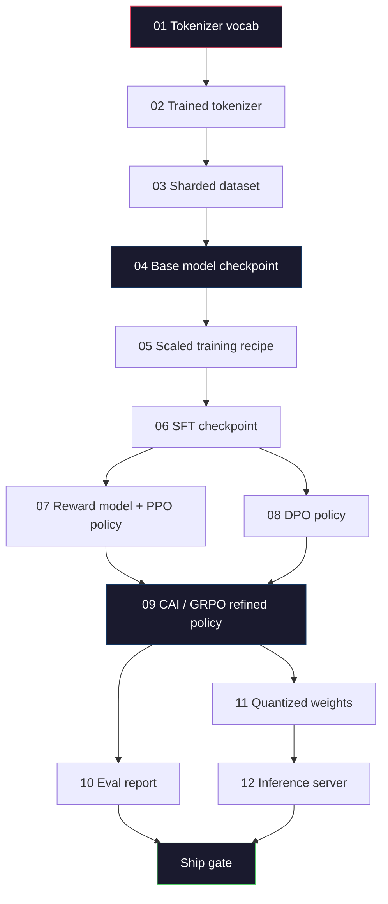
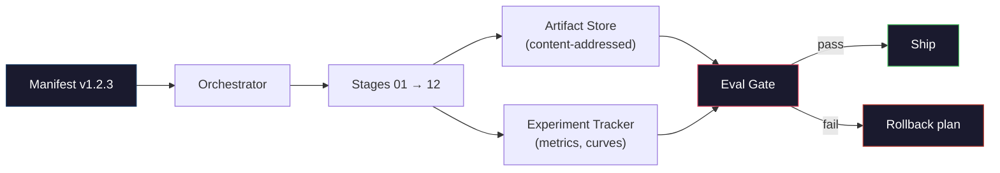

# بناء خط أنابيب LLM كامل
> كل شيء من الدروس 01 إلى 12 هو مرحلة واحدة من pipeline. هذا الدرس هو السقالة التي تحول تلك المراحل إلى تشغيل واحد شامل: الرمز المميز، التدريب المسبق، القياس، SFT، المحاذاة، التقييم، التكميم، الخدمة. لن تقوم بتدريب نموذج 70B على جهاز كمبيوتر محمول. ستقوم بإنتاج طبقة التنسيق والبيان وبوابة التقييم وخطة التراجع التي يستخدمها فريق الحدود لعام 2026 لتحديد ما سيتم شحنه. هذا هو حجر الزاوية.
**النوع:** بناء
** اللغات: ** بايثون (stdlib)
**المتطلبات الأساسية:** جميع دروس المرحلة العاشرة 01-12
**الوقت:** ~120 دقيقة
## أهداف التعلم
- قم بتأليف الدروس السابقة الأحد عشر (الرمز المميز، البيانات، التدريب المسبق، القياس، SFT، RLHF، DPO، CAI، التقييم، التكميم، الاستدلال) في مواصفات pipeline واحدة قابلة للتكرار
- تعريف العقد الأثري بين المراحل: ما تستهلكه كل مرحلة، وما تنتجه، وكيف تتحقق المرحلة التالية من المدخلات
- قم ببناء منسق يتتبع التجارب، ويجزئ العناصر، وينفذ قرارات السفن على عتبات التقييم
- تصميم خطة التراجع: ما هي القطع الأثرية الرخيصة لإعادة تشغيلها، وما هي باهظة الثمن، وما تكلفة نقطة التفتيش التالفة
## المشكلة
الدروس السابقة لكل عمل. تم تدريب الرمز المميز. صغير GPT تم تدريبه مسبقًا. SFT مجموعة البيانات مجمعة. تم تدريب نموذج المكافأة. DPO تشغيل. تم قياس التقييمات. الأوزان الكمية المصدرة. تم تشغيل خادم الاستدلال. كل واحد عبارة عن دفتر. كل واحد لديه اتفاقياته الخاصة، ومسارات الإخراج الخاصة به، وبذرة خاصة به.
إن التدريب على الحدود ليس دفترًا. استغرق Llama 3 405B 30 مليون H100 ساعة على مدار 54 يومًا تقريبًا. تم استخدام DeepSeek-V3 حوالي 2.8 مليون H800 ساعة. خلال تلك الفترة، يمكن أن تكلف نقطة تفتيش واحدة تالفة أو تلوث بيانات واحد أو انحدار تقييمي الفريق أسبوعًا من ساعة الحائط وشهرًا من ميزانية GPU. الطريقة التي تنجو بها الفرق من هذا هي من خلال pipنظافة الخط: تحتوي كل مرحلة على مدخلات حتمية، ومخرجات حتمية، وبيان، وتجزئة، وبوابة.
هذا هو حجر الزاوية. لن تقوم بتشغيل pipeline من طرف إلى طرف على جهاز كمبيوتر محمول. ستكتب المنسق الذي ينسق المراحل، والبيان الذي يصف التشغيل، والمدقق الذي ينفذ قرارات الشحن، وخطة إعادة التشغيل التي تسمح لطرف ثالث بإعادة تشغيل عملك من ملف واحد. الكود صغير؛ الانضباط كبير.
يتغير حجم النمط من 100M إلى 1T من المعلمات دون تغيير. نفس المكونات الأربعة - البيان، والمنسق، وبوابة التقييم، ومتجر القطع الأثرية - قم بتشغيل Llama 3 وأيضًا تشغيل هوايتك GPT. الفرق هو حجم الأرقام الموجودة داخل تكوين كل مرحلة، وليس شكل الخط pipe.
##المفهوم
### المراحل الاثنتي عشرة
كل درس في المرحلة العاشرة هو مرحلة. هنا هو الرسم البياني التبعية الكامل.


يمكن تشغيل المرحلتين 07 و08 بالتوازي. كل شيء آخر هو تبعية صعبة. يؤدي التغيير في المرحلة 02 (الرمز المميز) إلى إبطال كل قطعة أثرية في اتجاه المصب. التغيير في المرحلة 10 (التقييم) يبطل قرار السفينة فقط.
### البيان
البيان هو ملف واحد يصف عملية التشغيل بشكل كامل بما يكفي لإعادة تشغيلها. لا شيء ينتج عن pipeline يجب أن يعتمد على الحالة غير الموجودة في البيان. الحقول مملة وإلزامية.
```
pipeline_version: 1.2.3
seed: 42
git_commit: a1b2c3d4
stages:
  01_tokenizer:
    recipe: bpe_32k
    input_hash: sha256:...
    output_hash: sha256:...
    wall_clock_sec: 3600
    cost_usd: 12
```

تجزئة الإخراج للمرحلة N هي تجزئة الإدخال للمرحلة N+1. أي انحراف وسيتوقف الخط pipe. هذه هي الطريقة التي تكتشف بها تلف البيانات مبكرًا. إنها أيضًا الطريقة التي يتحقق بها أحد أعضاء الفريق في قارة مختلفة من أن إعادة العرض الخاصة به أنتجت نفس القطعة الأثرية التي أنتجتها.
في الممارسة العملية، تستخدم الفرق مخططًا صغيرًا YAML بالإضافة إلى مدقق البيان الذي يختلف عن التشغيل الناجح السابق. أي دلتا خارج الحقول المتوقعة (التكلفة، ساعة الحائط) هي علامة حمراء.
### كتابة القطع الأثرية
مخرجات كل مرحلة عبارة عن قطعة أثرية مكتوبة. ليس دليلًا ثنائي النقطة، وليس مخللًا، ولكنه نوع مسمى بمخطط معروف.
| المرحلة | نوع القطعة الأثرية | الحقول الرئيسية |
|-------|-------------|-----------|
| 01-02 | رمز مميز | vocab.json، merges.txt، config.json، hash |
| 03 | مجموعة البيانات | الشظايا[]، عدد الصفوف، عدد الرموز، إحصائيات الحذف |
| 04-05 | نقطة تفتيش | Weights.safetensors، config.json، حالة المحسن، عدد الخطوات |
| 06 | SFT النموذج | نقطة تفتيش + SFT وصفة + مزيج البيانات |
| 07 | نموذج المكافأة | RM نقطة تفتيش + تجزئة بيانات التفضيل |
| 08-09 | سياسة | نقطة تفتيش + تجزئة مرجعية + بيتا + KL الميزانية المستهلكة |
| 10 | تقرير التقييم | الدرجات المرجعية + فروق الانحدار + تجزئة بيانات التقييم |
| 11 | النموذج الكمي | الأوزان الكمية + بيانات المعايرة + دلتا الدقة مقابل FP16 |
| 12 | مواصفات الخادم | نقطة النهاية + تجزئة النموذج + التكوين + خطافات إمكانية الملاحظة |
تمنع الكتابة وضع الفشل الأكثر شيوعًا: استخدام مخرج المرحلة 08 كمدخل للمرحلة 06، وشحن نموذج تم تدريبه بواسطة DPO عبر المسار SFT. العناصر المكتوبة وتوقيعات المرحلة المكتوبة make هذه الأخطاء هي حالات فشل وقت الترجمة، وليس حالات فشل اليوم الخامس.
### بوابة التقييم
الشحن ليس "انتهى التدريب". الشحن هو "انتهى التدريب وتم اجتياز بوابة التقييم". يتم تعريف البوابة قبل بدء التشغيل.
```
gates:
  mmlu:      >= baseline + 0.5   # no regression
  humaneval: >= baseline + 1.0
  truthfulqa: >= baseline         # no drop
  safety_refusal_rate: <= 0.05
  kl_from_reference: <= 25.0
  cost_total_usd: <= 50000
```

كل بوابة هي عتبة رقمية. لا توجد بوابات "تبدو جيدة". لا يوجد تسجيلات ذاتية. إذا مرت كل بوابة، فسيتم وضع علامة على القطعة الأثرية بأنها قابلة للشحن. في حالة فشل أي بوابة، يتم تعليق التشغيل في انتظار التجاوز الصريح بواسطة مراجع مسمى، والذي يتم تسجيله بنفسه في البيان.
بوابتان تصطادان معظم الكوارث. بوابة *الانحدار* (يجب أن يكون النموذج الجديد بنفس جودة النموذج السابق على الأقل فيما يتعلق بالمعايير الأساسية) تكتشف أخطاء التدريب. بوابة الميزانية *KL* (يجب ألا تكون السياسة المحاذية قد انحرفت أكثر من X عن مرجعها) تلتقط المحاذاة الزائدة. يحتوي كل خط إنتاج pipeline على كليهما.
### المنسق
جزء صغير من التعليمات البرمجية يقرأ البيان، ويرسل المراحل، ويتتبع القطع الأثرية، ويوقف أي انتهاك للعقد. هذا ليس تدفق الهواء. هذا ليس كوبيفلو. بالنسبة إلى pipeline health، فأنت تريد شيئًا مملًا كتبته.
وظيفة المنسق ضيقة:
1. قم بحل DAG من البيان.
2. في كل مرحلة، تحقق مما إذا كان الإخراج المتوقع موجودًا بالفعل بالتجزئة الصحيحة (تخطي إذا كان الأمر كذلك).
3. قم بتشغيل المسرح، والتقاط stdout/stderr، وقياس ساعة الحائط والتكلفة.
4. تحقق من تجزئة الإخراج مقابل تجزئة الإدخال المتوقعة للمرحلة النهائية.
5. في حالة الفشل، قم بكتابة بيان جزئي مع تحديد مرحلة الفشل بالضبط والخروج من الصفر.
هذا هو 200 سطر من بايثون. سيبدو مثل الملف `code/main.py` في هذا الدرس. تحت الغطاء، يستخدم pipeline الحقيقي `torchrun` أو `ray` لتنفيذ مراحل فردية على مجموعات، لكن المنسق نفسه يعمل على صندوق واحد.
### تتبع التجارب وتخزين القطع الأثرية
يقوم نظامان خارجيان بتثبيت الخط pipeline.
**أداة تعقب التجارب (wandb، ونبتون، وmlflow).** تسجل منحنيات الخسارة، ومقاييس التقييم، وقياس النظام عن بعد لكل مرحلة. جهاز التعقب هو المكان الذي تذهب إليه عندما تحتاج إلى مقارنة التشغيل "أ" مع التشغيل "ب" بعد ثلاثة أسابيع. تستخدم الفرق دائمًا أداة تعقب مستضافة لهذا الغرض - فكتابة ما تريده يضيع الوقت الذي يجب أن يستغرقه التدريب.
**مخزن العناصر (S3، R2، GCS).** مخزن كائنات غير قابل للتغيير لنقاط التفتيش ومجموعات البيانات والرموز المميزة وتقارير التقييم. تتم معالجة القطع الأثرية عن طريق التجزئة، وليس عن طريق اسم الملف. اسم ملف مثل `latest.pt` هو بندقية قدم؛ `ckpt-7b-step-20000-sha256:abc123.safetensors` هو عقد.
يكتب المنسق لكليهما. المتعقب مخصص للبشر الذين ينظرون إلى الرسوم البيانية. مخزن القطع الأثرية مخصص للمرحلة التالية للبحث عن المدخلات.
### التكلفة
المدى الحدودي مرفق به رقم بالدولار. يحدث انضباط الميزانية في مكانين.
**تقدير التشغيل المسبق.** من البيان، قم بحساب FLOPs المتوقعة (للتدريب المسبق: 6 x معلمات x الرموز المميزة)، GPU ساعة المتوقعة (FLOPs / ذروة الإنتاجية / الاستخدام)، والتكلفة بالدولار بسعر الإيجار الحالي. إذا تجاوز التقدير بوابة الميزانية، فسيرفض سطر pip البدء.
**التتبع أثناء التشغيل.** يتم تسجيل ساعة الحائط والتكلفة خطوة بخطوة في البيان. بعد كل مرحلة، يتم فحص الميزانية المتبقية. إذا تم تجاوز المرحلة، فسيتم تقييم بوابة المرحلة التالية بالميزانية الجديدة المتبقية. لن تكتشف أن أموالك قد نفدت عندما يتصل VC.
بلغت تكلفة Llama 3 المبلغ عنها 61 مليون دولار. أبلغ DeepSeek-V3 عن مبلغ 5.6 مليون دولار أمريكي لتشغيل ما قبل التدريب الرئيسي. النسبة في الغالب هي كفاءة الأجهزة بالإضافة إلى مزيج من الخبراء - ولكن التكلفة المحددة مرئية لأن كلا الفريقين قاما بتتبعها في كل مرحلة، وليس في كل عملية تشغيل.
### القابلية للتكرار مقابل الحتمية
هذه ليست هي نفسها. *قابل للتكرار* يعني أن نفس البيان بالإضافة إلى نفس الكود بالإضافة إلى نفس البنية التحتية ينتج نقطة تفتيش ذات مقاييس نهائية مكافئة. * الحتمية * تعني الإخراج المتطابق للبت.
تدريب LLM الحديث قابل للتكرار ولكنه ليس حتميًا. يتحد ترتيب تقليل التدريب الموزع، GPU عدم حتمية النواة (cuBLAS، flash-attn)، والتقريب المختلط الدقيق لإنتاج عوامات تختلف عند المستوى 1e-5 بين عمليات التشغيل. وهذا أمر جيد بالنسبة للمقاييس النهائية، التي لا تتحرك. إنه أمر قاتل إذا كنت تحاول تصحيح الأخطاء باستخدام فروق على مستوى البت. العلاج هو تسجيل تجزئة المدخلات، وتجزئة المخرجات، ومقاييس العنوان لكل مرحلة - إذا كانت تلك متطابقة، فسيتم "إعادة إنتاج" التشغيل حتى لو لم تكن الأوزان متطابقة بت.


### خطة التراجع
قبل بدء التشغيل، اكتب ما يحدث عند فشل كل مرحلة. ثلاث فئات.
- **إعادة تشغيل رخيصة** (ساعات): أداة الرمز المميز، والتقييم، والتكميم، وخادم الاستدلال. فقط أعد التشغيل.
- **متوسطة** (أيام): SFT، DPO، CAI. احتفظ بالنموذج الأساسي؛ أعد تشغيل مراحل المحاذاة فقط.
- **باهظة الثمن** (أسابيع وملايين الدولارات): التدريب المسبق. خطة التراجع هنا ليست "إعادة تشغيل". إنها "استخدام آخر نقطة تفتيش جيدة وإعادة تشغيل المراحل النهائية الأرخص ببيانات منقحة."
نظرًا لأن تبعيات المرحلة يتم كتابتها وتجزئتها، يمكن للمنسق حساب مجموعة التراجع تلقائيًا: إبطال المرحلة الفاشلة بالإضافة إلى كل فرع. الفشل في المرحلة 06 (SFT) يبطل 06، 07، 08، 09، 10، 11، 12. الفشل في المرحلة 11 (التكميم) يبطل فقط 11 و12. تسمية هذا مقدمًا تتجنب الارتجال بينما يكون الفريق منهكًا في الساعة 4 صباحًا.
### وصفات الإنتاج التي تمت ملاحظتها في عام 2026
اجتمعت معظم الفرق الحدودية على نفس الهيكل العظمي.
- الرمز المميز: 128 كيلو بايت BPE مع البايت الاحتياطي. تدرب على شريحة صغيرة ومتعددة اللغات ومتوازنة.
- التدريب المسبق: 10-20T من الرموز، معظمها من رموز الويب بالإضافة إلى أكواد اصطناعية. مُحسِّن Muon أو AdamW. FSDP2 أو DeepSpeed ​​ZeRO-3. نقاط التفتيش التدرج. BF16 الأوزان، FP32 رئيسي.
- SFT: أزواج تعليمات من 500 ألف إلى 2 مليون، مختلطة بشرية وصناعية، مع عملية استخلاص صارمة مقابل مجموعة التقييم.
- المحاذاة: DPO أو CAI + GRPO. RLHF فقط عندما تكون إشارة التفضيل متعددة الأبعاد للغاية بالنسبة لـ DPO.
- التقييم: MMLU-Pro، MATH، HumanEval+، GPQA، SWE- تم التحقق من مقاعد البدلاء، LiveBench، بالإضافة إلى مجموعة خاصة محتجزة لا يراها الجمهور أبدًا.
- التكميم: 4 بت GPTQ أو AWQ للتقديم، 8 بت لتقييمات السلامة حيث تكون دلتا الدقة مهمة.
- التقديم: vLLM، TensorRT-LLM، أو داخليًا. الخلط المستمر. فك التشفير التخميني. KV إخلاء ذاكرة التخزين المؤقت.
الأرقام تتغير كل ستة أشهر. الهيكل العظمي لا.
## بنائها
رمز الدرس عبارة عن منسق ومدقق واضح، وليس اثني عشر نصًا تدريبيًا. تتم محاكاة كل مرحلة باستخدام عنصر نائب ينتج عنه قطعة أثرية بالشكل والتجزئة الصحيحين. يثبت تشغيل المنسق من البداية إلى النهاية أن أعمال السباكة في pipeline تعمل قبل أن تحرق GPU المال على المراحل الحقيقية.
راجع `code/main.py` للاطلاع على التنفيذ الكامل. القطع الرئيسية:
- `Manifest` فئة البيانات: pipإصدار الخط، البذور، git الالتزام، المراحل، البوابات.
- `Stage` فئة البيانات: الاسم، النوع، المدخلات (التجزئة)، الإخراج (التجزئة)، ساعة الحائط، التكلفة.
- `Orchestrator.run()`: يحل DAG، ويرسل المراحل، ويتحقق من التجزئة، وبيان التحديثات.
- `EvalGate.check()`: قراءة الحدود، ومقارنتها بتقرير التقييم الأخير، وإرجاع النجاح/الفشل.
- `ArtifactStore` (كعب روتين في الذاكرة): وضع/حصول على التجزئة، يحاكي S3.
- `CostTracker`: لكل مرحلة وتراكمي، ويتوقف عند تجاوز الحد الأقصى.
يقوم pipeline في `main.py` بتشغيل اثنتي عشرة مرحلة من العناصر النائبة، وينتج بيانًا، ويمارس بوابة تقييم فاشلة لإظهار كيف يبدو التشغيل المتوقف. قم بتبديل كل عنصر نائب بالنص التدريبي الحقيقي من الدرس المقابل وسيكون لديك الهيكل العظمي الذي يستخدمه pipeline.
## استخدمه
يحتوي سير العمل الأساسي على ثلاثة أوامر.
```
python code/main.py plan    # validate manifest, compute cost estimate, print DAG
python code/main.py run     # execute stages, writing to manifest.out.yaml
python code/main.py gate    # read manifest.out.yaml, apply eval gates, ship-or-hold
```

قم بتشغيل `plan` أولاً في كل مرة. تظهر معظم أخطاء pipeline في وقت الخطة -- حدود البوابة المفقودة، والتجزئة التي لا معنى لها، وتجاوزات الميزانية. تشغيل `plan` مجاني. تشغيل `run` مكلف. توفير المال عن طريق اصطياد الأخطاء على الجانب الرخيص.
إخراج `gate` هو إما `SHIP` أو `HOLD: <reason>`. إن الجري المتوقف ليس فشلاً؛ إنها نقطة القرار. إما أن يقوم المراجع المسمى بالتجاوز (ويتم تسجيل التجاوز)، أو يوافق على التراجع.
## اشحنها
ينتج هذا الدرس `outputs/skill-llm-pipeline-reviewer.md`. قم بإطعامه ببيان pipeline المقترح وسيقوم بالتحقق من جميع العقود: كتابة المرحلة، وسلسلة التجزئة، والبوابات، وخطة التراجع، وتقدير التكلفة. يرفض الموافقة على بيان به بوابة تقييم مفقودة، أو ميزانية KL غير محدودة، أو تشغيل يمزج بين بيانات التقييم والتدريب.
## تمارين
1. قم بتوسيع المُنسق لدعم التنفيذ المتوازي للمرحلتين 07 و08. استخدم الوحدة النمطية stdlib `concurrent.futures`. تأكد من أن البيان النهائي يسجل مخرجات المرحلتين وأن تجزئة مدخلات المرحلة 09 هي مزيج محدد من الاثنين معًا.
2. أضف بوابة "فحص التلوث". بالنظر إلى تجزئة مجموعة بيانات التقييم وأجزاء مجموعة بيانات التدريب، قم بحساب التداخل (تطابق السلسلة تمامًا أو تطابق 13 جرامًا). تفشل البوابة إذا تجاوز التداخل 0.1%. قم بإطعامه بمجموعة تدريب ملوثة وتأكد من أن البوابة ستستمر في الجري.
3. تنفيذ مقدر التكلفة من المبادئ الأولى. بالنسبة للمرحلة 04 (ما قبل التدريب)، قم بتقدير FLOPs على أنها 6 x معلمات x الرموز المميزة، وافترض 40% MFU (استخدام نموذج FLOPs) في H100 عند 989 TFLOPs BF16، بسعر 2.50 دولار/GPU-ساعة. قم بالإبلاغ عن التقدير لنموذج 7B الذي تم تدريبه على رموز 2T. قارن بأرقام اللاما 2 المنشورة.
4. بناء التراجع الجزئي. قم بمحاكاة الفشل في المرحلة 09 (CAI)، ثم أعد تشغيل المراحل من 09 إلى 12 مع ترك 01-08 مخزنة مؤقتًا. يجب على المنسق اكتشاف العناصر المخزنة مؤقتًا عن طريق التجزئة وتخطيها. قياس ساعة الحائط المحفوظة مقابل إعادة التشغيل الكامل.
5. أضف إمكانية الملاحظة. قم بإصدار نطاقات OpenTelemetry لكل مرحلة، مع سمات المعلمات والرموز المميزة والخسارة والتكلفة. قم بتوصيل الامتدادات إلى جامع محلي. النقطة ليست لوحات المعلومات؛ النقطة المهمة هي أن صحة كل مرحلة يمكن تتبعها من أثر واحد ID.
## المصطلحات الرئيسية
| مصطلح | ماذا يقول الناس | ماذا يعني في الواقع |
|------|----------------|----------------------|
| بيان | "ملف الوصفة" | YAML أو JSON يصف pipإصدار الخط، والتكوين الأساسي، والتكوين لكل مرحلة، وعتبات البوابة - كافية لإعادة تشغيل التشغيل |
| عنوان المحتوى | "بالتجزئة وليس الاسم" | القطع الأثرية المخزنة بواسطة SHA-256 من محتوياتها، لذلك لا يمكنك أبدًا الخلط بين الإصدار A والإصدار B |
| بوابة إيفال | "معايير السفينة" | الحدود الرقمية للمقاييس المعيارية ودرجات الأمان التي يجب اجتيازها قبل أن يتم وضع علامة على قطعة أثرية بأنها قابلة للشحن |
| KL الميزانية | "إلى أي مدى انجرفت المحاذاة" | حد أقصى للتراكمي KL(مرجع السياسة ||) عبر مراحل المحاذاة، ويتم فرضه كبوابة |
| __المصطلح_7__ | "ما مقدار GPU الذي استخدمته" | استخدام نموذج FLOPs — يتم تحقيق FLOPs مقسومًا على الذروة النظرية. 40% نموذجي على مقياس 70B، و55% على مقياس 7B |
| خطة التراجع | "ماذا نفعل عندما ينكسر" | مجموعة من الإجراءات المكتوبة مسبقًا لكل مرحلة عند الفشل: إعادة التشغيل، والتراجع، وإعادة التدريب باستخدام المدخلات المنقحة |
| منسق | "الموصل" | العملية التي تقرأ البيان، وترسل المراحل، وتتحقق من التجزئة، وتتوقف عند أي انتهاك للعقد |
| متجر التحف | "الإصدار S3 للأوزان" | مخزن العناصر الموجه للمحتوى غير القابل للتغيير — مصدر واحد للحقيقة لنقاط التفتيش ومجموعات البيانات وتقارير التقييم |
| استنساخ | "نفس المقاييس عند الإعادة" | أوزان مختلفة على مستوى البت ولكن مقاييس متكافئة - الهدف الواقعي للتدريب الموزع LLM |
| بوابة التكلفة | "لا يمكنك تجاوز X" | تقدير تكلفة التشغيل المسبق بالإضافة إلى أداة التتبع أثناء التشغيل — يرفض سطر pipe البدء إذا تجاوز التقدير الميزانية |
## مزيد من القراءة
- [Dubey et al., 2024 -- "The Llama 3 Herd of Models"](https://arxiv.org/abs/2407.21783) -- الوصف العام الأكثر تفصيلاً لخط الحدود pipe بما في ذلك البيانات والتدريب والمحاذاة والتقييم
- [DeepSeek-AI, 2024 -- "DeepSeek-V3 Technical Report"](https://arxiv.org/abs/2412.19437) -- الكفاءة أولاً pipeline بتكلفة 1/10 تقريبًا من تكلفة تدريب فئة Llama 3
- [Kaplan et al., 2020 -- "Scaling Laws for Neural Language Models"](https://arxiv.org/abs/2001.08361) - علاقة القياس الأصلية لمعلمات الحساب والبيانات
- [Hoffmann et al., 2022 -- "Training Compute-Optimal Large Language Models (Chinchilla)"](https://arxiv.org/abs/2203.15556) -- تصحيح كابلان الذي أعاد معايرة ميزانيات البيانات الحديثة
- [PyTorch FSDP2 documentation](https://pytorch.org/docs/stable/fsdp.html) - استبدال التدريب الموزع FSDP1 في PyTorch 2.4+
- [Weights & Biases LLM Reports](https://wandb.ai/site/llms) -- البيانات الحقيقية ومخرجات تعقب التجارب لعمليات تشغيل LLM مفتوحة المصدر، وهي مفيدة كقوالب قابلة للسرقة