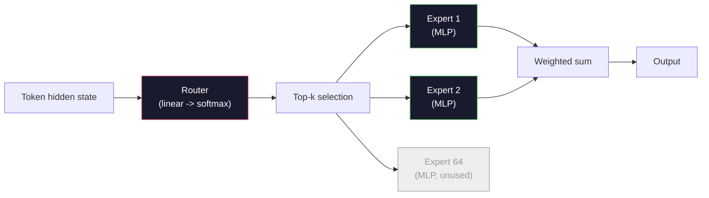

# Open Models: Architecture Walkthroughs

> لقد قمت ببناء GPT-2 صغير من الصفر في الدرس 04. نماذج Frontier المفتوحة في عام 2026 هي نفس العائلة مع خمسة أو ستة تغييرات ملموسة. RMSNorm بدلاً من LayerNorm. سويغلو بدلاً من GELU. RoPE بدلاً من المواقف المستفادة. GQA أو MLA بدلاً من MHA الكامل. مزيج من الخبراء على نطاق واسع. الرياضيات التي تعرفها بالفعل تغطي 95% منها. يقرأ هذا الدرس Llama 3 وDeepSeek-V3 وMixtral وQwen وGemma جنبًا إلى جنب ويسمي الخط الدقيق الذي تتباعد فيه كل بنية.

**النوع:** تعلم
** اللغات: ** بايثون (stdlib)
**المتطلبات الأساسية:** المرحلة 10، الدروس 04، 05، 12 (التدريب المسبق، القياس، الاستدلال)
**الوقت:** ~45 دقيقة

## Learning Objectives

- اقرأ ملف config.json الخاص بـ Llama 3 وMistral وMixtral وGemma 2 وQwen 2.5 وDeepSeek-V3 واشرح كل مجال
- تسمية التغيير المعماري المحدد لكل نموذج مقابل GPT-2 صغير وتبريره من المبادئ الأولى
- حساب عدد المعلمات، KV حجم ذاكرة التخزين المؤقت، وذاكرة التنشيط لأي نموذج مفتوح من التكوين الخاص به وحده
- اختر النموذج المفتوح الصحيح لهدف النشر مع مراعاة قيود وقت الاستجابة والذاكرة والقدرة

## The Problem

في الدرس 04، كتبت 350 سطرًا من numpy وكان لديك نموذج على شكل GPT-2. يحتوي Llama 3 405B على تقرير فني مكون من 200 صفحة. غريزتك هي أن هذه وحوش مختلفة. إنهم ليسوا كذلك. تصف الصفحات الـ 200 نفس الكائن مع خمسة أو ستة تعديلات ذات دوافع جيدة، بالإضافة إلى آلاف تفاصيل التنفيذ حول القياس. الهيكل العظمي - التضمين، كتل المحولات، الانتباه، MLP، القاعدة، الرأس - لم يتغير.

هذا الدرس فيه فرق لكل مجموعة رئيسية من النماذج المفتوحة، ندرج بالضبط ما تغير من GPT-2، ولماذا، وما هي التكلفة. عند الانتهاء، يمكنك قراءة بطاقة نموذجية جديدة وترجمتها ذهنيًا مرة أخرى إلى خط الأساس GPT-2.

المردود العملي هو أنه عندما تقوم Meta بإصدار Llama 5 أو DeepSeek بإصدار V4، فلن تحتاج إلى نموذج عقلي جديد. سوف تنظر إلى التكوين، وترى أيًا من المقابض المعروفة تم تحريكها، وتعرف ما هي الآثار المترتبة على ذلك. معماريات 2026 عبارة عن صندوق أدوات محدود. يختار كل نموذج جديد مجموعة فرعية مختلفة.

## The Concept

### The Invariant Core

تشترك جميع نماذج الانحدار الذاتي المفتوحة في:

- مصفوفة تضمين الرمز المميز (vocab_size x Hidden_dim).
- كومة من كتل فك التشفير N: القاعدة، الاهتمام الذاتي، المتبقية، القاعدة، MLP، المتبقية.
- المعيار النهائي والرأس الخطي المسقط لحجم المفردة (غالبًا ما يكون مرتبطًا بالوزن مع التضمينات).
- القناع السببي، الخسارة التالية للإنتروبيا المتقاطعة.

هذا هو الشكل. والباقي هو المقابض.

### The Six Knobs That Actually Move

في كل طراز مفتوح من 2024 إلى 2026، يتم اختيار نفس خيارات التصميم الستة مرارًا وتكرارًا:

1. **التطبيع.** LayerNorm -> RMSNorm.
2. **الترميز الموضعي.** المطلق المكتسب -> RoPE (بالإضافة إلى المتغيرات: YaRN، NTK).
3. **التنشيط.** GELU -> SwiGLU (أو GeGLU).
4. **مشاركة الاهتمام.** MHA -> GQA -> MQA -> MLA.
5. **كثيف مقابل متناثر MLP.** كثيف -> خليط من الخبراء.
6. **وضع ما قبل القاعدة.** إقامات ما قبل القاعدة. لقد ذهب ما بعد القاعدة.

كل شيء آخر (جدول معدل التعلم، مزيج البيانات، حجم الدفعة، طول السياق) موجود في تكوين التدريب، وليس في البنية. ستة مقابض.

### Knob 1: RMSNorm

يقوم LayerNorm بطرح المتوسط ​​والقسمة على القياسات القياسية والمقاييس والتحولات. يحتفظ RMSNorm بالمقياس فقط:

```
RMSNorm(x) = x / sqrt(mean(x^2) + eps) * gamma
```

لا يعني الطرح. لا يوجد تحيز. ماتمول واحد أقل لكل رمز مميز. جادل Zhang وSennrich (2019) بأنه يطابق LayerNorm في الترجمة الآلية بينما يكون أسرع بنسبة 10%. كل نموذج مفتوح حديث يديره.

التكلفة: لا شيء. الفائدة: ربح إنتاجي صغير، رمز أبسط.

### Knob 2: RoPE

كانت عمليات تضمين الموضع المستفادة عبارة عن جدول بحث مكون من 1024 فتحة في GPT-2. السياق 1025 خارج نهاية الجدول. لا يمكن للنماذج استقراء ما يتجاوز مدة تدريبها.

يقوم تضمين الموضع الدوار (RoPE, Su et al. 2021) بإدخال الموضع عن طريق تدوير كل متجه Q وK في أزواج قبل منتج نقطة الانتباه. زاوية الدوران هي وظيفة حتمية للموضع، لذلك لا يوجد شيء يمكن تعلمه ولا شيء يمكن نفاده. باستخدام حيل القياس (NTK الاستيفاء المدرك، YaRN)، يمكن للنموذج الذي تم تدريبه على سياق 8k أن يمتد إلى 128k عند الاستدلال مع فقدان دقة متواضع.

```
q_rotated = rotate(q, angle(pos))
k_rotated = rotate(k, angle(pos))
score = q_rotated . k_rotated
```

يستخدم كل من Llama وMistral وQwen وDeepSeek وGemma حبل RoPE. تستخدم Gemma 2 مزيجًا هجينًا (RoPE في معظم الطبقات، وانتباه النافذة المنزلقة المحلية في الطبقات الأخرى).

### Knob 3: SwiGLU

GPT-2 MLP هو `x -> gelu(xW1 + b1) -> (...)W2 + b2`. يستبدل SwiGLU (Shazeer 2020) التنشيط بمنتج مسور:

```
SwiGLU(x) = (xW1) * sigmoid(xW1) * xV
```

عرضان متوازيان بدلاً من واحد، مفصولان بتنشيط Swish. أقوى تجريبيا على الحيرة لكل معلمة. تبناه Llama 2، وتبعه الجميع. عادةً ما يتم تعيين الحجم المخفي لـ MLP بحيث يتطابق إجمالي عدد المعلمات مع الكثافة الأصلية MLP: إذا تم استخدام GPT-2 `ff_dim = 4 * hidden`، يستخدم SwiGLU `ff_dim = (2/3) * 4 * hidden = 8/3 * hidden`.

### Knob 4: Attention Head Sharing

GPT-2 مستخدم ** تنبيه متعدد الرؤوس (MHA) **: كل رأس له إسقاط Q وK وV الخاص به.

** تنبيه متعدد الاستعلامات (MQA، Shazeer 2019)** يشترك في K واحد وV واحد في جميع الرؤوس. يقطع ذاكرة التخزين المؤقت KV بمقدار num_heads، وهو ما يمثل تقليلًا بمقدار 12x إلى 32x في النموذج النموذجي. تنخفض الدقة قليلاً في المعايير الصعبة.

** انتباه الاستعلام المجمّع (GQA، Ainslie et al. 2023)** هو الحل الأوسط: تشترك مجموعات G من رؤوس Q في واحد K وواحد V. يستخدم Llama 3 8B GQA مع 32 رأس Q و8 رؤوس KV (G = 8)، وبالتالي فإن ذاكرة التخزين المؤقت KV تتقلص 4x مقابل MHA الكاملة.

** الانتباه الكامن متعدد الرؤوس (MLA، DeepSeek 2024) ** يضغط K وV في كامنة مشتركة منخفضة الرتبة، ويعرضهما احتياطيًا لكل رأس. يقلل أيضًا من ذاكرة التخزين المؤقت KV مع الحفاظ على التعبير لكل رأس. يعتمد DeepSeek-V2 وV3 على هذا لأدائهما طويل السياق.

| مخطط | KV رؤوس | KV ذاكرة التخزين المؤقت | دقة |
|--------|--------------|----------|---------|
| MHA | num_heads | كامل | أفضل |
| GQA | num_groups (G < num_heads) | num_heads / تخفيض G | قريب-MHA |
| MQA | 1 | تخفيض عدد الرؤوس | ضربة صغيرة |
| MLA | تخفيف الضغط الكامن لكل رأس | أصغر من MQA | قريب-MHA |

بالنسبة لأي نموذج يتجاوز ~13B من المعلمات، فإن GQA أو MLA يكون إلزاميًا فعليًا. كامل MHA على نطاق واسع هو كارثة ذاكرة التخزين المؤقت KV.

### Knob 5: Mixture of Experts

يقوم MLP الكثيف بتنشيط جميع معلماته لكل رمز مميز. تحتوي وزارة البيئة MLP على K خبراء لكل كتلة وجهاز توجيه يختار الخبراء الأعلى تصنيفًا لكل رمز مميز (عادةً أعلى 2). فقط أوزان هؤلاء الخبراء ترى تمريرة للأمام لهذا الرمز المميز.

```
router_logits = xW_r
indices, weights = top_k(router_logits, k=2)
output = sum_i weights[i] * expert[indices[i]](x)
```

الجاذبية: يمكن أن يكون لديك 64 خبيرًا بحجم 7B لكل منهم (لذلك يكون إجمالي عدد المعلمات ضخمًا) أثناء تشغيل 2 منهم فقط لكل رمز مميز (لذا فإن حساب كل رمز مميز يتطابق مع نموذج 7B كثيف). يحتوي Mixtral 8x7B على إجمالي 47 بايت من المعلمات ولكنه ينشط 13 بايت فقط لكل رمز مميز. يحتوي DeepSeek-V3 على إجمالي 671B من المعلمات ولكنه ينشط 37B فقط لكل رمز مميز.



الايجابيات: نفس الحساب، المزيد من المعلمات، وقدرة أفضل. السلبيات: لا يزال يتعين على الذاكرة المتخصصة أن تعيش في مكان ما (لذا فإن الخدمة تحتاج إلى أكثر من VRAM من مكافئ كثيف)، ومن الصعب موازنة تحميل جهاز التوجيه، كما أن ضبط جهاز التوجيه أثناء المحاذاة هو مجال بحث خاص به.

### Knob 6: Pre-norm stays

قام المحول الأصلي بتطبيق معيار الطبقة بعد كل طبقة فرعية. كل نموذج مفتوح منذ GPT-2 يضعه *قبل* كل طبقة فرعية. المعيار المسبق أسهل تمامًا في التدريب على العمق. لا يوجد ما يجادل حوله.

### Model-by-Model Diff

هنا هو الجدول الذي make كل هذه الخرسانة.

| نموذج | سنة | مجموع المعلمات | المعلمات النشطة | نورم | التنشيط | الموقف | انتبه | وزارة التربية والتعليم | السياق |
|-------|------|---------------------|-----------|----------|----------|------------|--------|
| GPT-2 صغير | 2019 | 124 م | 124 م | طبقة نورم | GELU | تعلمت | MHA (12 رأسًا) | لا | 1 ك |
| اللاما 3 8ب | 2024 | 8 ب | 8 ب | آر إم إس نورم | سويجلو | حبل |  (٣٢/٨) | لا | 128 ألف |
| اللاما 3 70ب | 2024 | 70ب | 70ب | آر إم إس نورم | سويجلو | حبل | GQA (٦٤/٨) | لا | 128 ألف |
| اللاما 3 405 ب | 2024 | 405 ب | 405 ب | آر إم إس نورم | سويجلو | حبل | GQA (١٢٨/١٦) | لا | 128 ألف |
| ميسترال 7ب | 2023 | 7.2ب | 7.2ب | آر إم إس نورم | سويجلو | حبل | GQA | لا | 32 ك |
| ميكسترال 8x7B | 2023 | 47 ب | 13 ب | آر إم إس نورم | سويجلو | حبل | GQA | نعم (8 خبراء، أعلى 2) | 32 ك |
| جيما 2 9ب | 2024 | 9ب | 9ب | RMSNorm (قبل + بعد) | جيغلو | حبل + انزلاق | GQA | لا | 8 ك |
| كوين 2.5 72 ب | 2024 | 72ب | 72ب | آر إم إس نورم | سويجلو | حبل (غزل) | GQA (٦٤/٨) | لا | 128 ألف |
| ديب سيك V2 236ب | 2024 | 236ب | 21 ب | آر إم إس نورم | سويجلو | حبل | MLA | نعم (160 خبيرًا، أعلى 6) | 128 ألف |
| ديب سيك DeepSeek | 2024 | 671 ب | 37 ب | آر إم إس نورم | سويجلو | حبل | MLA | نعم (256 خبيرًا، أعلى 8) | 128 ألف |

مسح الأعمدة. RMSNorm عالمي. SwiGLU أو ابن عمها GeGLU عالمي. حبل عالمي. GQA عالمية فوق 7B إلا عند استبدالها بـ MLA. وزارة التربية هي الفارق في النهاية العليا.

### Reading a config.json

تكوين اللاما 3 8B:

```
{
  "hidden_size": 4096,
  "intermediate_size": 14336,
  "num_hidden_layers": 32,
  "num_attention_heads": 32,
  "num_key_value_heads": 8,
  "max_position_embeddings": 131072,
  "rope_theta": 500000.0,
  "rms_norm_eps": 1e-5,
  "vocab_size": 128256
}
```

يتوافق كل حقل مع شيء قمت بتنفيذه بالفعل.

- `hidden_size`: بُعد التضمين.
- `intermediate_size`: MLP الحجم المخفي (3.5x مخفي -- SwiGLU math).
- `num_hidden_layers`: عمق المكدس.
- `num_attention_heads`: رؤوس س.
- `num_key_value_heads`: KV رأس (GQA).
- `max_position_embeddings`: طول سياق التدريب.
- `rope_theta`: التردد الأساسي للحبل. قامت Meta بتحجيمها من 10k الافتراضي إلى 500k لاستقراء السياق الطويل.
- `rms_norm_eps`: الثبات العددي.
- `vocab_size`: الرموز.

من هذه وحدها يمكنك حساب إجمالي المعلمات وKV ذاكرة التخزين المؤقت وذاكرة التنشيط القصوى. راجع `code/main.py` للحصول على الصيغ الدقيقة.

### Activation memory budget

تهيمن عمليات التنشيط على ذاكرة التدريب التي تتجاوز بضعة مليارات من المعلمات. القاعدة الأساسية للتدريب المسبق (مع نقاط التفتيش المتدرجة):

```
activation_mem ~ batch_size * seq_len * hidden_size * num_layers * bytes_per_element
```

بالنسبة إلى Llama 3 8B في الدفعة 1، التسلسل 8192، BF16، 32 طبقة، مخفي 4096: تقريبًا 8 GB فقط للتنشيطات مع نقاط التفتيش، 40 GB بدون. وهذا هو سبب أهمية الانتباه السريع والانتباه الحلقي - فهم يعيدون كتابة حساب الانتباه بحيث تكون عمليات التنشيط مناسبة.

### KV Cache budget

للاستدلال في السياق الأقصى:

```
kv_cache = 2 * num_layers * num_kv_heads * head_dim * max_seq_len * bytes_per_element
```

اللاما 3 8B في سياق 128 كيلو بايت، BF16، head_dim = مخفي / num_heads = 128:
`2 * 32 * 8 * 128 * 131072 * 2 = 17.2 GB` لكل تسلسل.

أوزان 8B هي 16 GB في BF16. تعد ذاكرة التخزين المؤقت KV لتسلسل واحد بحجم 128 كيلو بايت أكبر من الأوزان. هذا هو ضغط الذاكرة الذي يقود GQA وMLA وKV بحث تكميم ذاكرة التخزين المؤقت.

### When Each Model Wins

- **ذاكرة فردية 80 جيجابايت GPU، بدون MoE**: Llama 3 8B، Mistral 7B، Gemma 2 9B. سهلة الخدمة، وأدوات واسعة.
- **مفرد node (8x80 جيجابايت)، سعة كبيرة**: Llama 3 70B، Qwen 2.5 72B. أعلى قدرة مفتوحة كثيفة.
- **أكبر قدرة مفتوحة، تقبل تعقيد MoE**: DeepSeek V3، Mixtral 8x22B. أفضل قدرة لكل نشط FLOP.
- **احتياجات السياق الطويل**: Llama 3 (128 كيلو مع تحجيم RoPE)، DeepSeek (ميزة MLA).
- **العرض بزمن استجابة منخفض**: Gemma 2 9B (النافذة المنزلقة تقطع الحوسبة ذات السياق الطويل).

## Build It

رمز الدرس هو الآلة الحاسبة. بالنظر إلى أي config.json، فإنه يطبع عدد المعلمات حسب المكون، وذاكرة التخزين المؤقت KV في الحد الأقصى للسياق، ونسبة SwiGLU MLP، وحكم قصير على البنية (كثيفة / GQA / MLA / MoE).

```python
config = {
    "hidden_size": 4096, "intermediate_size": 14336,
    "num_hidden_layers": 32, "num_attention_heads": 32,
    "num_key_value_heads": 8, "vocab_size": 128256,
    "max_position_embeddings": 131072,
}
```

يتنقل البرنامج النصي في مجال الهندسة المعمارية حسب المجال، ويحسب عدد المعلمات للتضمين، والاهتمام (مع تقليل GQA)، MLP (مع توسيع SwiGLU)، وقواعد الطبقة، والرأس. ثم يحسب ذاكرة التخزين المؤقت KV بطول السياق المحدد ويطبع ملخصًا.

راجع `code/main.py` للتنفيذ.

## Use It

قم بتشغيل الآلة الحاسبة على تكوينات Llama 3 8B وMistral 7B وMixtral 8x7B وDeepSeek V3 المجمعة في البرنامج النصي. قارن انهيار المعلمات. لاحظ أن نماذج MoE تحتوي على عدد معلمات إجمالي يقزم النماذج الكثيفة ولكن عدد معلمات نشط غالبًا ما يكون أصغر. لاحظ أن ذاكرة التخزين المؤقت الخاصة بـ DeepSeek V3 KV أصغر من ذاكرة Llama 3 405B على الرغم من وجود معلمات إجمالية أكثر - أي MLA قيد التشغيل.

ثم قم بتوصيل التكوين لأي نموذج لديك محليًا، واقرأ الملخص، وقرر ما إذا كان يناسب GPU الخاص بك.

## Ship It

ينتج عن هذا الدرس `outputs/skill-open-model-picker.md`. نظرًا لهدف النشر (نوع GPU، VRAM، طول السياق، ميزانية زمن الوصول) وملف تعريف المهمة (الدردشة، التعليمات البرمجية، الاستدلال، السياق الطويل)، توصي بنموذج مفتوح، ونظام تكميم من الدرس 11، ومكدس استدلال من الدرس 12، مع تفكير واضح حول المقابض المعمارية الستة.

## Exercises

1. اقرأ تكوين Qwen 2.5 72B من HuggingFace. حساب إجمالي المعلمات من الصفر. قارن بالقيمة المبلغ عنها HF وحدد مصدر أي دلتا (تقريب خافت الرأس، KV عامل المشاركة، وما إلى ذلك).

2. يستخدم DeepSeek V3 256 خبيرًا مع توجيه من أعلى 8. احسب نسبة الخبراء المنشطين إلى إجمالي الخبراء وقارنهم بأعلى 2 من 8 في Mixtral 8x7B. ماذا يعني التحول من متفرق (25%) إلى متفرق أكثر كثافة (3%) بشأن السعة لكل FLOP؟

3. احسب ذاكرة التخزين المؤقت KV لـ Llama 3 405B في سياق 128 كيلو بايت في FP8 وBF16. عند FP8 يكون نصف الرقم BF16. ما عدد التسلسلات المتوازية التي يمكنك تقديمها على جهاز واحد 8xH100 node (80 جيجابايت لكل = إجمالي 640 جيجابايت، مطروحًا منه وزن الذاكرة)؟

4. تقوم Gemma 2 بالتناوب بين طبقات الانتباه الكامل وطبقات النافذة المنزلقة. اكتب العمليات الحسابية لذاكرة التخزين المؤقت KV عندما تستخدم نصف الطبقات نافذة منزلقة مكونة من 4096 رمزًا مميزًا بدلاً من السياق الكامل. ما مقدار الذاكرة التي يوفرها ذلك في سياق إجمالي يبلغ 8 كيلو بايت؟

5. ابحث عن نموذج مفتوح حديث تم إصداره بعد كتابة هذا الدرس. حدد أيًا من المقابض الستة التي اختارها وما إذا كان قد أدخل مقبضًا سابعًا. سيشعر المنهج بأنه قديم في اللحظة التي يتم فيها ظهور بنية جديدة - الهدف هو تحديث طاولتك دون إعادة بناء نموذجك العقلي.

## Key Terms

| مصطلح | ماذا يقول الناس | ماذا يعني في الواقع |
|------|----------------|----------------------|
| آر إم إس نورم | "LayerNorm بدون الوسط" | التطبيع عن طريق جذر متوسط ​​المربع فقط، بمقياس مكتسب - أرخص وقابل للمقارنة بـ LayerNorm |
| حبل | "مواقف دوارة" | قم بتدوير كل متجه Q وK في أزواج ثنائية الأبعاد بزاوية تعتمد على الموضع - يتم استقراءه بما يتجاوز طول التدريب باستخدام حيل القياس |
| سويجلو | "تفعيل MLP الجديد" | وحدة خطية مسورة مع Swish: `(xW1) * sigmoid(xW1) * xV` — قياسية في كل طراز مفتوح 2024+ |
| GQA | "الانتباه إلى الأرض الوسطى" | تنبيه للاستعلام المجمع: مجموعات G من رؤوس Q تشترك في رأس K واحد ورأس V واحد - تقلص ذاكرة التخزين المؤقت KV دون دقة MQA |
| MLA | "اهتمام DeepSeek" | تنبيه كامن متعدد الرؤوس: ضغط K/V إلى كامن مشترك منخفض الرتبة، وفك الضغط لكل رأس - أصغر ذاكرة تخزين مؤقت KV للنماذج الكبيرة |
| وزارة التربية والتعليم | "خبراء متفرقون" | مزيج من الخبراء: N MLPs لكل كتلة، جهاز التوجيه يختار أعلى k لكل رمز مميز - إجمالي المعلمات الضخمة، المعلمات النشطة الصغيرة |
| توجيه Top-k | "اختر خبراء k لكل رمز مميز" | يحسب جهاز التوجيه النتيجة لكل خبير وينشط أعلى k - k النموذجي هو 2 (Mixtral) إلى 8 (DeepSeek) |
| غزل | "حبل ممتد" | امتداد RoPE آخر - يقحم الزوايا الدوارة لتوسيع السياق من 8k إلى 128k+ في وقت الاستدلال |
| انزلاق النافذة الاهتمام | "لا تهتم بكل شيء" | يهتم كل رمز برموز W الأخيرة فقط - ويحد من تكلفة الانتباه عند O(W) لكل رمز، المستخدم في Gemma 2 وأوائل Mistral |
| المعلمات النشطة | "ما يتم تشغيله لكل رمز مميز" | بالنسبة لنماذج MoE، فإن عدد المعلمات الذي يشهد تمريرًا للأمام لكل رمز مميز (أصغر بكثير من إجمالي المعلمات) — يحكم FLOPs لكل رمز مميز |

## Further Reading

- [دوبي وآخرون، 2024 -- "قطيع نماذج اللاما 3"](https://arxiv.org/abs/2407.21783) -- المرجع المعماري والتدريبي لعائلة اللاما 3 الكثيفة
- [DeepSeek-AI، 2024 -- "DeepSeek-V3 التقرير الفني"](https://arxiv.org/abs/2412.19437) -- MLA بالإضافة إلى موازنة التحميل الإضافية الخالية من الخسارة بالإضافة إلى 671B MoE
- [جيانغ وآخرون، 2024 -- "مزيج من الخبراء"](https://arxiv.org/abs/2401.04088) -- الورقة النموذجية المفتوحة لوزارة التربية والتعليم
- [سو وآخرون، 2021 -- "RoFormer: محول محسّن مع تضمين موضع دوار"](https://arxiv.org/abs/2104.09864) -- ورق RoPE
- [Shazeer، 2020 -- "GLU المتغيرات لتحسين المحول"](https://arxiv.org/abs/2002.05202) -- SwiGLU وGeGLU والأصدقاء
- [أينسلي وآخرون، 2023 -- "GQA: تدريب نماذج المحولات متعددة الاستعلامات المعممة"](https://arxiv.org/abs/2305.13245) -- الورقة GQA
- [فريق جيما 2، 2024 -- "جيما 2: تحسين نماذج اللغة المفتوحة بحجم عملي"](https://arxiv.org/abs/2408.00118) -- انتباه هجين كامل + انزلاقي، معيار ما قبل + ما بعد
- [فريق Qwen، 2024 -- "التقرير الفني لـ Qwen 2.5"](https://arxiv.org/abs/2412.15115) -- امتداد سياق YaRN ووصفات تدريب طويلة السياق
