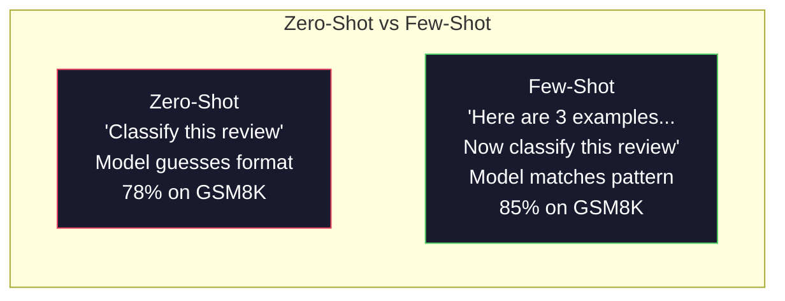
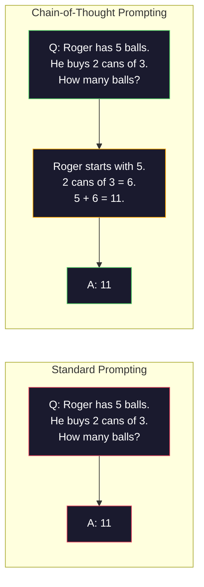
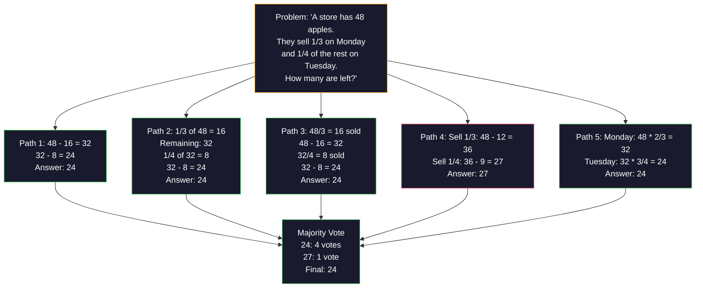
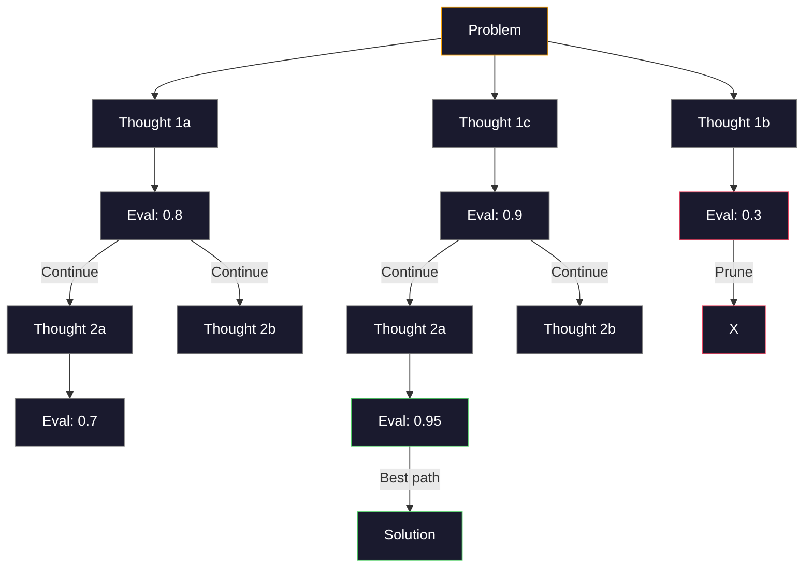

# لقطة قليلة، سلسلة أفكار، شجرة أفكار
> إن إخبار النموذج بما يجب فعله هو حث. إن إظهار كيفية التفكير هو هندسة. الفجوة بين 78% و91% من الدقة في نفس النموذج، ونفس المهمة، ونفس البيانات ليست نموذجًا أفضل. إنها استراتيجية تفكير أفضل.
**النوع:** بناء
** اللغات: ** بايثون
**المتطلبات السابقة:** الدرس 11.01 (الهندسة السريعة)
**الوقت:** ~45 دقيقة
## أهداف التعلم
- تنفيذ مطالبات قليلة عن طريق تحديد وتنسيق العروض التوضيحية التي تزيد من دقة المهمة
- تطبيق منطق سلسلة الأفكار (CoT) لتحسين الدقة في المسائل متعددة الخطوات مثل المسائل الرياضية اللفظية
- قم ببناء موجه شجرة الأفكار الذي يستكشف مسارات التفكير المتعددة ويختار أفضلها
- قياس تحسين الدقة من صفر طلقة مقابل طلقة قليلة مقابل CoT على معيار قياسي
## المشكلة
يمكنك إنشاء تطبيق لتدريس الرياضيات. تقول المطالبة الخاصة بك: "حل هذه المشكلة اللفظية." GPT-5 ينجح في تحقيق الهدف بنسبة 94% من الوقت في GSM8K، وهو مقياس الرياضيات القياسي للصف الدراسي. تعتقد أنك بلغت ذروتها بالفعل. أنت لا تفعل ذلك — لا تزال سلسلة الأفكار تضيف 3-4 نقاط.
أضف خمس كلمات - "دعونا نفكر خطوة بخطوة" - وستقفز الدقة إلى 91%. أضف بعض الأمثلة الناجحة وتصل إلى 95%. نفس النموذج. نفس درجة الحرارة. نفس تكلفة API. والفرق الوحيد هو أنك أعطيت ورقة مسودة للنموذج.
هذا ليس الاختراق. هذه هي الطريقة التي يعمل بها المنطق. البشر لا يحلون مسائل متعددة الخطوات بقفزة عقلية واحدة. ولا المحولات. عندما تجبر نموذجًا على إنشاء رموز مميزة متوسطة، تصبح تلك الرموز المميزة جزءًا من سياق الرمز المميز التالي. كل خطوة تفكير تغذي الخطوة التالية. يحسب النموذج حرفيًا طريقه إلى الإجابة.
لكن "التفكير خطوة بخطوة" هو البداية وليس النهاية. ماذا لو قمت بأخذ عينات من خمسة مسارات منطقية وحصلت على أغلبية الأصوات؟ ماذا لو سمحت للنموذج باستكشاف شجرة الاحتمالات وتقييم الفروع وتشذيبها؟ ماذا لو قمت بخلط الاستدلال مع استخدام الأداة؟ هذه ليست افتراضات. وهي عبارة عن تقنيات منشورة مع تحسينات محسوبة، وسوف تقوم ببناءها جميعًا في هذا الدرس.
##المفهوم
### صفر طلقة مقابل طلقة قليلة: عندما تتغلب الأمثلة على التعليمات
تعطي المطالبة الصفرية للنموذج مهمة وليس أي شيء آخر. تعطي المطالبة القليلة بالرصاص أمثلة أولاً.
وي وآخرون. (2022) قام بقياس ذلك عبر 8 معايير. بالنسبة للمهام البسيطة مثل تصنيف المشاعر، يتم تنفيذ اللقطة الصفرية واللقطة القليلة في حدود 2% من بعضها البعض. بالنسبة للمهام المعقدة مثل الحساب متعدد الخطوات والتفكير الرمزي، أدت اللقطات القليلة إلى تحسين الدقة بنسبة 10-25%.
الحدس: الأمثلة هي تعليمات مضغوطة. بدلاً من وصف تنسيق الإخراج، يمكنك إظهاره. بدلاً من شرح عملية الاستدلال، فإنك تثبتها. يتطابق نمط النموذج مع الأمثلة بشكل أكثر موثوقية من تفسيره للتعليمات المجردة.


**عندما يفوز عدد قليل من اللقطات:** المهام الحساسة للتنسيق، والتصنيف، والاستخراج المنظم، والمصطلحات الخاصة بالمجال، وأي مهمة يحتاج النموذج فيها إلى مطابقة نمط معين.
**عندما تفوز الفرصة الصفرية:** أسئلة واقعية بسيطة، ومهام إبداعية حيث تقيد الأمثلة الإبداع، والمهام التي يكون العثور على أمثلة جيدة فيها أصعب من كتابة تعليمات جيدة.
### مثال للاختيار: إيقاعات مماثلة عشوائية
ليست كل الأمثلة متساوية. إن اختيار أمثلة مشابهة للمدخل المستهدف يتفوق على الاختيار العشوائي بنسبة 5-15% في مهام التصنيف (Liu et al., 2022). ثلاثة مبادئ:
1. **التشابه الدلالي**: اختر الأمثلة الأقرب إلى الإدخال في مساحة التضمين
2. **تنوع الملصقات**: يغطي جميع فئات المخرجات في الأمثلة الخاصة بك
3. **صعوبة المطابقة**: مطابقة مستوى تعقيد المشكلة المستهدفة
العدد الأمثل للأمثلة لمعظم المهام هو 3-5. أقل من 3، لا يحتوي النموذج على إشارة كافية لاستخراج النموذج. فوق 5، ستصل إلى عوائد متناقصة وتضيع الرموز المميزة لنافذة السياق. بالنسبة للتصنيف الذي يحتوي على العديد من التصنيفات، استخدم مثالاً واحدًا لكل تصنيف.
### سلسلة الأفكار: إعطاء النماذج ورقة مسودة
تم تقديم المطالبة بسلسلة الفكر (CoT) بواسطة Wei et al. (2022) في جوجل برين. الفكرة بسيطة: بدلاً من مطالبة النموذج بالإجابة فقط، اطلب منه إظهار خطواته المنطقية أولاً.


لماذا يعمل هذا ميكانيكيا؟ يصبح كل رمز مميز ينشئه المحول سياقًا للرمز المميز التالي. بدون CoT، يجب على النموذج ضغط جميع الأسباب في الحالة المخفية لتمريرة أمامية واحدة. مع CoT، يقوم النموذج بإخراج الحسابات المتوسطة كرموز مميزة. يعمل كل رمز منطقي على توسيع عمق الحساب الفعال.
**GSM8K المعايير (الرياضيات المدرسية، 8.5 ألف مسألة):**
| نموذج | صفر طلقة | زيرو شوت كوت | قليل من الطلقات CoT |
|-------|-------------------|--------------------------|-------|
| GPT-4o | 78% | 91% | 95% |
| GPT-5 | 94% | 97% | 98% |
| o4-mini (الاستدلال) | 97% | — | — |
| كلود أوبوس 4.7 | 93% | 97% | 98% |
| الجوزاء 3 برو | 92% | 96% | 98% |
| اللاما 4 70ب | 80% | 89% | 94% |
| ديبسيك-V3.1 | 89% | 94% | 96% |
**ملاحظة حول نماذج الاستدلال.** تعمل نماذج مثل OpenAI's o-series (o3, o4-mini) وDeepSeek-R1 على تشغيل سلسلة الأفكار داخليًا قبل إرسال إجابتها. إن إضافة عبارة "دعونا نفكر خطوة بخطوة" إلى نموذج الاستدلال أمر زائد عن الحاجة ويؤدي في بعض الأحيان إلى نتائج عكسية - وقد فعلوا ذلك بالفعل.
نكهتين من CoT:
**Zero-shot CoT**: ألحق عبارة "دعونا نفكر خطوة بخطوة" بالموجه. لا حاجة إلى أمثلة. كوجيما وآخرون. (2022) أظهر أن هذه الجملة المفردة تعمل على تحسين الدقة عبر المهام الحسابية والمنطقية والرمزية.
**Few-shot CoT**: قدم أمثلة تتضمن خطوات التفكير. أكثر فعالية من CoT الصفري لأن النموذج يرى تنسيق التفكير الدقيق الذي تتوقعه.
**عندما يكون CoT مؤلمًا**: تذكر حقائق بسيطة ("ما هي عاصمة فرنسا؟")، وتصنيف من خطوة واحدة، ومهام حيث تكون السرعة أكثر أهمية من الدقة. يضيف CoT ما بين 50 إلى 200 رمزًا مميزًا للاستدلال لكل استعلام. بالنسبة للمهام ذات الإنتاجية العالية والمنخفضة التعقيد، فهذه تكلفة ضائعة.
### الاتساق الذاتي: عينة متعددة، قم بالتصويت مرة واحدة
وانغ وآخرون. (2023) قدم الاتساق الذاتي. الرؤية: قد يحتوي مسار CoT واحد على أخطاء منطقية. ولكن إذا قمت بتجربة عدد N من مسارات التفكير المستقلة (باستخدام درجة الحرارة > 0) وحصلت على تصويت الأغلبية على الإجابة النهائية، فسيتم إلغاء الأخطاء.


تم تحسين دقة الاتساق الذاتي GSM8K من 56.5% (CoT واحد) إلى 74.4% مع N = 40 في تجارب PaLM 540B الأصلية. في GPT-5 كان التحسن صغيرًا (97% إلى 98%) لأن الدقة الأساسية مشبعة بالفعل. تتألق هذه التقنية بشكل أكبر في النماذج التي تتمتع بدقة CoT الأساسية بنسبة 60-85% - وهي النقطة المثالية التي تتكرر فيها أخطاء المسار الواحد ولكنها ليست منهجية. بالنسبة لنماذج الاستدلال (سلسلة o، R1) يتم تضمين الاتساق الذاتي من خلال أخذ العينات الداخلية المضمنة.
المقايضة: N العينات تعني Nx API التكلفة ووقت الاستجابة. ومن الناحية العملية، N=5 يستحوذ على معظم الفوائد. N=3 هو الحد الأدنى للتصويت ذي المعنى. N > 10 له عوائد متناقصة لمعظم المهام.
### شجرة الفكر: استكشاف المتفرعة
ياو وآخرون. (2023) قدم شجرة الفكر (ToT). حيث يتبع CoT مسارًا منطقيًا خطيًا واحدًا، يستكشف ToT الفروع المتعددة ويقيم أيها أكثر واعدة قبل المتابعة.


يتكون ToT من ثلاثة مكونات:
1. **توليد الأفكار**: إنتاج خطوات تالية متعددة للمرشحين
2. **تقييم الحالة**: سجل كل مرشح (يمكن استخدام LLM نفسه كمقيم)
3. **خوارزمية البحث**: BFS أو DFS من خلال الشجرة، وتشذيب الفروع ذات الدرجات المنخفضة
في مهمة "لعبة الـ 24" (دمج 4 أرقام باستخدام الحساب إلى make 24)، يحل GPT-4 مع المطالبة القياسية 7.3% من المسائل. مع CoT، 4.0% (CoT مؤلم هنا بالفعل لأن مساحة البحث واسعة). مع تدريب المدربين، 74%.
ToT باهظ الثمن. يتطلب كل node في الشجرة استدعاء LLM. تتطلب الشجرة ذات عامل التفرع 3 والعمق 3 ما يصل إلى 39 مكالمة LLM. استخدمه فقط للمشكلات التي تكون فيها مساحة البحث كبيرة ولكنها قابلة للتقييم - التخطيط وحل الألغاز والحل الإبداعي للمشكلات مع القيود.
### رد الفعل: التفكير + العمل
ياو وآخرون. (2022) جمع آثار الاستدلال مع الأفعال. يتناوب النموذج بين التفكير (توليد الاستدلال) والتصرف (أدوات الاتصال والبحث والحوسبة).

```mermaid
graph LR
    Q["Question:\nWhat is the\npopulation of the\ncountry where\nthe Eiffel Tower\nis located?"]
    T1["Thought: I need to\nfind which country\nhas the Eiffel Tower"]
    A1["Action: search\n'Eiffel Tower location'"]
    O1["Observation:\nParis, France"]
    T2["Thought: Now I need\nFrance's population"]
    A2["Action: search\n'France population 2024'"]
    O2["Observation:\n68.4 million"]
    T3["Thought: I have\nthe answer"]
    F["Answer:\n68.4 million"]

    Q --> T1 --> A1 --> O1 --> T2 --> A2 --> O2 --> T3 --> F

    style Q fill:#1a1a2e,stroke:#ffa500,color:#fff
    style T1 fill:#1a1a2e,stroke:#51cf66,color:#fff
    style A1 fill:#1a1a2e,stroke:#e94560,color:#fff
    style O1 fill:#1a1a2e,stroke:#808080,color:#fff
    style T2 fill:#1a1a2e,stroke:#51cf66,color:#fff
    style A2 fill:#1a1a2e,stroke:#e94560,color:#fff
    style O2 fill:#1a1a2e,stroke:#808080,color:#fff
    style T3 fill:#1a1a2e,stroke:#51cf66,color:#fff
    style F fill:#1a1a2e,stroke:#51cf66,color:#fff
```


يتفوق ReAct في أداء CoT الخالص في المهام كثيفة المعرفة لأنه يمكنه تأسيس تفكيره على بيانات حقيقية. في HotpotQA (الإجابة على الأسئلة متعددة القفزات)، يحقق ReAct مع GPT-4 تطابقًا تامًا بنسبة 35.1% مقابل 29.4% لـ CoT وحده. القوة الحقيقية هي أن أخطاء الاستدلال يتم تصحيحها من خلال الملاحظات - يمكن للنموذج تحديث خطته في منتصف التنفيذ.
ReAct هو أساس وكلاء AI الحديثين. ينفذ كل إطار عمل وكيل (LangChain، وCrewAI، وAutoGen) بعض أشكال حلقة التفكير والإجراء والمراقبة. سوف تقوم ببناء وكلاء كاملين في المرحلة 14. يغطي هذا الدرس نمط التحفيز.
### المطالبة المنظمة: XML العلامات والمحددات والرؤوس
عندما تصبح المطالبات معقدة، تمنع البنية النموذج من إرباك الأقسام. ثلاث طرق:
علامات **XML** (تعمل بشكل أفضل مع Claude، وهي ثابتة في كل مكان):```
<context>
You are reviewing a pull request.
The codebase uses TypeScript and React.
</context>

<task>
Review the following diff for bugs, security issues, and style violations.
</task>

<diff>
{diff_content}
</diff>

<output_format>
List each issue with: file, line, severity (critical/warning/info), description.
</output_format>
```

**رؤوس تخفيض السعر** (عامة):```
## Role
Senior security engineer at a fintech company.

## Task
Analyze this API endpoint for vulnerabilities.

## Input
{api_code}

## Rules
- Focus on OWASP Top 10
- Rate each finding: critical, high, medium, low
- Include remediation steps
```

**المحددات** (الحد الأدنى ولكنها فعالة):```
---INPUT---
{user_text}
---END INPUT---

---INSTRUCTIONS---
Summarize the above in 3 bullet points.
---END INSTRUCTIONS---
```

### التسلسل الفوري: التحلل المتسلسل
بعض المهام معقدة للغاية بالنسبة لمطالبة واحدة. يؤدي تسلسل الموجهات إلى تقسيمها إلى خطوات، حيث يصبح ناتج إحدى الموجهات مدخلاً للموجه التالي.


يتفوق التسلسل على الموجه الفردي لثلاثة أسباب:
1. **كل خطوة أبسط**: يتعامل النموذج مع مهمة واحدة مركزة بدلاً من التوفيق بين كل شيء
2. **المخرجات المتوسطة قابلة للفحص**: يمكنك التحقق من صحتها وتصحيحها بين الخطوات
3. **خطوات مختلفة يمكن أن تستخدم نماذج مختلفة**: استخدم نموذجًا رخيصًا للاستخراج، ونموذجًا مكلفًا للاستدلال
### مقارنة الأداء
| تقنية | الأفضل لـ | GSM8K الدقة (GPT-5) | API المكالمات | الرمز المميز | التعقيد |
|-----------|----------|------------------------|----------|----------------|------------|
| صفر طلقة | مهام بسيطة | 94% | 1 | لا شيء | تافهة |
| طلقة قليلة | مطابقة التنسيق | 96% | 1 | 200-500 توكن | منخفض |
| زيرو شوت كوت | تعزيز التفكير السريع | 97% | 1 | 50-200 رمز | تافهة |
| قليل من الطلقات CoT | الحد الأقصى لدقة المكالمة الواحدة | 98% | 1 | 300-600 رمز | منخفض |
| الاتساق الذاتي (العدد = 5) | الاستدلال عالي المخاطر | 98.5% | 5 | تكلفة الرمز المميز 5x | متوسطة |
| نموذج الاستدلال (o4-mini) | استبدال سرير الأطفال المتنقل | 97% | 1 | مخفي (2-10x داخلي) | تافهة |
| شجرة الفكر | مشاكل البحث/التخطيط | غير متاح (74% في المباراة الـ 24) | 10-40+ | تكلفة الرمز المميز 10-40x | عالية |
| رد فعل | الاستدلال المبني على المعرفة | غير متاح (35.1% على HotpotQA) | 3-10+ | متغير | عالية |
| تسلسل موجه | مهام معقدة متعددة الخطوات | 96% (pipeline) | 2-5 | تكلفة رمزية 2-5x | متوسطة |
يعتمد الأسلوب الصحيح على ثلاثة عوامل: متطلبات الدقة، وميزانية زمن الوصول، وتحمل التكلفة. بالنسبة لمعظم أنظمة الإنتاج، يغطي CoT قليل اللقطات مع 3 نماذج احتياطية للاتساق الذاتي 90% من حالات الاستخدام.
## بنائها
سوف نقوم ببناء حل للمسائل الرياضية يجمع بين التحفيز البسيط، والتفكير المتسلسل، والتصويت المتسق الذاتي في سطر واحد pipe. ثم سنضيف شجرة أفكار للمشكلات الصعبة.
التنفيذ الكامل موجود في `code/advanced_prompting.py`. وهنا المكونات الرئيسية.
### الخطوة 1: متجر أمثلة قليلة
يدير المكون الأول أمثلة قليلة ويختار الأمثلة الأكثر صلة بمشكلة معينة.
```python
GSM8K_EXAMPLES = [
    {
        "question": "Janet's ducks lay 16 eggs per day. She eats three for breakfast every morning and bakes muffins for her friends every day with four. She sells every egg at the farmers' market for $2. How much does she make every day at the farmers' market?",
        "reasoning": "Janet's ducks lay 16 eggs per day. She eats 3 and bakes 4, using 3 + 4 = 7 eggs. So she has 16 - 7 = 9 eggs left. She sells each for $2, so she makes 9 * 2 = $18 per day.",
        "answer": "18"
    },
    ...
]
```

يتكون كل مثال من ثلاثة أجزاء: السؤال، وسلسلة الاستدلال، والإجابة النهائية. سلسلة الاستدلال هي ما يحول مثالًا عاديًا من اللقطات القليلة إلى مثال من اللقطات القليلة لـ CoT.
### الخطوة الثانية: الإنشاء الفوري لسلسلة الأفكار
يقوم منشئ الموجه بتجميع رسالة النظام، وأمثلة قليلة مع سلاسل منطقية، والسؤال المستهدف في موجه واحد.
```python
def build_cot_prompt(question, examples, num_examples=3):
    system = (
        "You are a math problem solver. "
        "For each problem, show your step-by-step reasoning, "
        "then give the final numerical answer on the last line "
        "in the format: 'The answer is [number]'."
    )

    example_text = ""
    for ex in examples[:num_examples]:
        example_text += f"Q: {ex['question']}\n"
        example_text += f"A: {ex['reasoning']} The answer is {ex['answer']}.\n\n"

    user = f"{example_text}Q: {question}\nA:"
    return system, user
```

يعد قيد التنسيق ("الإجابة هي [الرقم]") أمرًا بالغ الأهمية. وبدون ذلك، لا يمكن للاتساق الذاتي استخراج ومقارنة الإجابات عبر العينات.
### الخطوة 3: التصويت على الاتساق الذاتي
قم بتجربة مسارات التفكير N ​​واحصل على إجابة الأغلبية.
```python
def self_consistency_solve(question, examples, client, model, n_samples=5):
    system, user = build_cot_prompt(question, examples)

    answers = []
    reasonings = []
    for _ in range(n_samples):
        response = client.chat.completions.create(
            model=model,
            messages=[
                {"role": "system", "content": system},
                {"role": "user", "content": user}
            ],
            temperature=0.7
        )
        text = response.choices[0].message.content
        reasonings.append(text)
        answer = extract_answer(text)
        if answer is not None:
            answers.append(answer)

    vote_counts = Counter(answers)
    best_answer = vote_counts.most_common(1)[0][0] if vote_counts else None
    confidence = vote_counts[best_answer] / len(answers) if best_answer else 0

    return best_answer, confidence, reasonings, vote_counts
```

درجة الحرارة 0.7 مهمة. عند درجة حرارة 0.0، ستكون جميع العينات N متطابقة، مما يتعارض مع الغرض. أنت بحاجة إلى ما يكفي من العشوائية لمسارات التفكير المتنوعة، ولكن ليس بالقدر الذي يؤدي إلى إنتاج النموذج رطانة.
### الخطوة 4: حل شجرة الأفكار
بالنسبة للمشكلات التي يفشل فيها التفكير الخطي، يستكشف ToT طرقًا متعددة ويقيم الاتجاه الأكثر واعدة.
```python
def tree_of_thought_solve(question, client, model, breadth=3, depth=3):
    thoughts = generate_initial_thoughts(question, client, model, breadth)
    scored = [(t, evaluate_thought(t, question, client, model)) for t in thoughts]
    scored.sort(key=lambda x: x[1], reverse=True)

    for current_depth in range(1, depth):
        next_thoughts = []
        for thought, score in scored[:2]:
            extensions = extend_thought(thought, question, client, model, breadth)
            for ext in extensions:
                ext_score = evaluate_thought(ext, question, client, model)
                next_thoughts.append((ext, ext_score))
        scored = sorted(next_thoughts, key=lambda x: x[1], reverse=True)

    best_thought = scored[0][0] if scored else ""
    return extract_answer(best_thought), best_thought
```

المُقيِّم بحد ذاته عبارة عن مكالمة LLM. تسأل النموذج: "على مقياس من 0.0 إلى 1.0، ما مدى نجاح هذا المسار المنطقي في حل المشكلة؟" هذه هي الفكرة الرئيسية لـ ToT - يقوم النموذج بتقييم الحلول الجزئية الخاصة به.
### الخطوة 5: خط الأنابيب الكامل
يجمع خط pipeline جميع التقنيات مع استراتيجية التصعيد.
```python
def solve_with_escalation(question, examples, client, model):
    system, user = build_cot_prompt(question, examples)
    single_response = call_llm(client, model, system, user, temperature=0.0)
    single_answer = extract_answer(single_response)

    sc_answer, confidence, _, _ = self_consistency_solve(
        question, examples, client, model, n_samples=5
    )

    if confidence >= 0.8:
        return sc_answer, "self_consistency", confidence

    tot_answer, _ = tree_of_thought_solve(question, client, model)
    return tot_answer, "tree_of_thought", None
```

منطق التصعيد: حاول تجربة رخيصة (CoT واحد) أولاً. إذا كانت الثقة في الاتساق الذاتي أقل من 0.8 (أقل من 4 من 5 عينات توافق)، قم بالتصعيد إلى تدريب المدربين. يؤدي هذا إلى الموازنة بين التكلفة والدقة - يتم حل معظم المشكلات بتكلفة زهيدة، وتتطلب المشكلات الصعبة مزيدًا من الحوسبة.
## استخدمه
### مع لانج تشين
يوفر LangChain دعمًا مدمجًا للقوالب السريعة وتحليل المخرجات التي تعمل على تبسيط أنماط اللقطات القليلة وCoT:
```python
from langchain_core.prompts import FewShotPromptTemplate, PromptTemplate
from langchain_openai import ChatOpenAI

example_prompt = PromptTemplate(
    input_variables=["question", "reasoning", "answer"],
    template="Q: {question}\nA: {reasoning} The answer is {answer}."
)

few_shot_prompt = FewShotPromptTemplate(
    examples=examples,
    example_prompt=example_prompt,
    suffix="Q: {input}\nA: Let's think step by step.",
    input_variables=["input"]
)

llm = ChatOpenAI(model="gpt-4o", temperature=0.7)
chain = few_shot_prompt | llm
result = chain.invoke({"input": "If a train travels 120 km in 2 hours..."})
```

لدى LangChain أيضًا فئات `ExampleSelector` لاختيار التشابه الدلالي:
```python
from langchain_core.example_selectors import SemanticSimilarityExampleSelector
from langchain_openai import OpenAIEmbeddings

selector = SemanticSimilarityExampleSelector.from_examples(
    examples,
    OpenAIEmbeddings(),
    k=3
)
```

### مع دي إس بي باي
يتعامل DSPy مع استراتيجيات المطالبة كوحدات قابلة للتحسين. بدلاً من صياغة مطالبات CoT يدويًا، يمكنك تحديد التوقيع والسماح لـ DSPy بتحسين المطالبة:
```python
import dspy

dspy.configure(lm=dspy.LM("openai/gpt-4o", temperature=0.7))

class MathSolver(dspy.Module):
    def __init__(self):
        self.solve = dspy.ChainOfThought("question -> answer")

    def forward(self, question):
        return self.solve(question=question)

solver = MathSolver()
result = solver(question="Janet's ducks lay 16 eggs per day...")
```

يضيف `ChainOfThought` الخاص بـ DSPy آثارًا منطقية تلقائيًا. `dspy.majority` يطبق الاتساق الذاتي:
```python
result = dspy.majority(
    [solver(question=q) for _ in range(5)],
    field="answer"
)
```

### المقارنة: من الصفر مقابل أطر العمل
| ميزة | من الصفر (هذا الدرس) | لانجشين | دسبي |
|---------|-------------------------|-----------|------|
| التحكم في تنسيق المطالبة | كامل | على أساس القالب | آلي |
| الاتساق مع الذات | التصويت اليدوي | دليل | مدمج (`dspy.majority`) |
| اختيار المثال | منطق مخصص | __الكود_1__ | __الكود_2__ |
| شجرة الفكر | بحث شجرة مخصصة | سلاسل المجتمع | غير مدمج |
| التحسين الفوري | التكرار اليدوي | دليل | التجميع التلقائي |
| الأفضل لـ | التعلم، pipelines مخصصة | سير العمل القياسي | البحث والتحسين |
## اشحنها
ينتج هذا الدرس قطعتين أثريتين.
**1. موجه سلسلة الاستدلال** (`outputs/prompt-reasoning-chain.md`): قالب مطالبة جاهز للإنتاج لعدد قليل من لقطات CoT مع الاتساق الذاتي. قم بتوصيل الأمثلة الخاصة بك ومجال المشكلة.
**2. مهارة اختيار أنماط CoT** (`outputs/skill-cot-patterns.md`): إطار عمل لاتخاذ القرار لاختيار أسلوب التفكير الصحيح استنادًا إلى نوع المهمة ومتطلبات الدقة وقيود التكلفة.
## تمارين
1. **قياس الفجوة**: حل 10 مسائل GSM8K. قم بحل كل منها باستخدام CoT ذات الطلقات الصفرية، والطلقات القليلة، والCoT ذات الطلقات القليلة. دقة التسجيل لكل منهما. ما هي التقنية التي تعطي أكبر تأثير على النموذج الخاص بك؟
2. **مثال لتجربة الاختيار**: بالنسبة للمسائل العشر نفسها، قارن اختيار الأمثلة العشوائية بالأمثلة المشابهة المنتقاة بعناية. قياس الفرق في الدقة. في أي نقطة تكون جودة المثال أكثر أهمية من كمية المثال؟
3. **منحنى تكلفة الاتساق الذاتي**: قم بتشغيل الاتساق الذاتي مع N=1، 3، 5، 7، 10 في 20 GSM8K مسألة. دقة المؤامرة مقابل التكلفة (إجمالي الرموز). أين تقع ركبة المنحنى لنموذجك؟
4. **إنشاء حلقة ReAct**: قم بتوسيع الخط pipe باستخدام أداة الآلة الحاسبة. عندما يقوم النموذج بإنشاء تعبير رياضي، قم بتنفيذه باستخدام `eval()` الخاص بـ Python (في وضع الحماية) ثم قم بتغذية النتيجة مرة أخرى. قم بقياس ما إذا كان التفكير المبني على الأداة يتفوق على CoT النقي.
5. **تدريب المدربين للمهام الإبداعية**: قم بتكييف أداة حل شجرة الأفكار لمهمة الكتابة الإبداعية: "اكتب قصة من 6 كلمات تكون مضحكة وحزينة في نفس الوقت." استخدم LLM كمقيم. هل ينتج عن الاستكشاف المتفرع مخرجات إبداعية أفضل من توليد اللقطة الواحدة؟
## المصطلحات الرئيسية
| مصطلح | ماذا يقول الناس | ماذا يعني في الواقع |
|------|----------------|----------------------|
| مطالبة قليلة بالرصاص | "أعطها بعض الأمثلة" | بما في ذلك العروض التوضيحية للمدخلات والمخرجات في الموجه لترسيخ تنسيق إخراج النموذج وسلوكه |
| سلسلة الفكر | "اجعله يفكر خطوة بخطوة" | استخلاص الرموز المنطقية المتوسطة التي تعمل على توسيع الحساب الفعال للنموذج قبل إنتاج إجابة نهائية |
| الاتساق الذاتي | "قم بتشغيله عدة مرات" | أخذ عينات من مسارات التفكير المتنوعة عند درجة الحرارة> 0 واختيار الإجابة النهائية الأكثر شيوعًا بأغلبية الأصوات |
| شجرة الفكر | "دعه يستكشف الخيارات" | بحث منظم على فروع الاستدلال حيث يتم تقييم كل حل جزئي ويتم توسيع المسارات الواعدة فقط |
| رد فعل | "التفكير + استخدام الأداة" | تتبعات الاستدلال المتداخل مع الإجراءات الخارجية (البحث والحساب واستدعاءات API) في حلقة الفكر والإجراء والملاحظة |
| تسلسل موجه | "قسمها إلى خطوات" | تحليل مهمة معقدة إلى مطالبات تسلسلية حيث يغذي كل مخرج المدخلات التالية |
| صفر طلقة CoT | "فقط أضف" فكر خطوة بخطوة "" | إلحاق عبارة تشغيل الاستدلال بالموجه دون أي أمثلة، بالاعتماد على قدرة الاستدلال الكامن للنموذج |
## مزيد من القراءة
- [Chain-of-Thought Prompting Elicits Reasoning in Large Language Models](https://arxiv.org/abs/2201.11903) -- وي وآخرون. 2022. ورقة CoT الأصلية من Google Brain. اقرأ الأقسام 2-3 للحصول على النتائج الأساسية.
- [Self-Consistency Improves Chain of Thought Reasoning in Language Models](https://arxiv.org/abs/2203.11171) -- وانغ وآخرون. 2023. ورقة الاتساق الذاتي. يحتوي الجدول 1 على جميع الأرقام التي تحتاجها.
- [Tree of Thoughts: Deliberate Problem Solving with Large Language Models](https://arxiv.org/abs/2305.10601) -- ياو وآخرون. 2023. ورقة ToT. تعتبر نتائج لعبة الـ 24 في القسم 4 هي أبرز النتائج.
- [ReAct: Synergizing Reasoning and Acting in Language Models](https://arxiv.org/abs/2210.03629) -- ياو وآخرون. 2022. تأسيس وكلاء AI الحديثين. يشرح القسم 3 حلقة الفكر والفعل والملاحظة.
- [Large Language Models are Zero-Shot Reasoners](https://arxiv.org/abs/2205.11916) -- كوجيما وآخرون. 2022. ورقة "دعونا نفكر خطوة بخطوة". فعالة بشكل مدهش لمدى بساطتها.
- [DSPy: Compiling Declarative Language Model Calls into Self-Improving Pipelines](https://arxiv.org/abs/2310.03714) -- خطاب وآخرون. 2023. يعامل المطالبة كمشكلة تجميع. اقرأ إذا كنت تريد تجاوز الهندسة السريعة اليدوية.
- [OpenAI — Reasoning models guide](https://platform.openai.com/docs/guides/reasoning) -- إرشادات البائع حول متى تصبح سلسلة الأفكار وضع "استدلال" داخلي يتم تسعيره لكل رمز مقابل خدعة على مستوى المطالبة.
- [Lightman et al., "Let's Verify Step by Step" (2023)](https://arxiv.org/abs/2305.20050) -- نماذج مكافأة العملية (PRM) التي تحدد درجة كل خطوة من خطوات السلسلة؛ إشارة الإشراف المنطقي التي تنجح في تحقيق المكافآت ذات النتائج فقط.
- [Snell et al., "Scaling LLM Test-Time Compute Optimally" (2024)](https://arxiv.org/abs/2408.03314) -- دراسة منهجية لطول CoT، وأخذ عينات الاتساق الذاتي، وMCTS؛ حيث يذهب "التفكير خطوة بخطوة" عندما تكون الدقة أكثر أهمية من زمن الوصول.