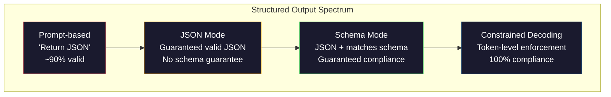
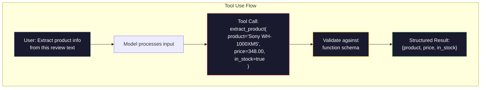

# المخرجات المنظمة: JSON، التحقق من صحة المخطط، فك التشفير المقيد
> يقوم LLM الخاص بك بإرجاع سلسلة. يحتاج طلبك إلى JSON. لقد أدت هذه الفجوة إلى تحطيم أنظمة الإنتاج أكثر من أي هلوسة نموذجية. الإخراج المنظم هو الجسر بين اللغة الطبيعية والبيانات المكتوبة. افعل ذلك بشكل صحيح وسيصبح LLM API موثوقًا به. أخطأت في ذلك وأنت تقوم بتحليل النص الحر باستخدام التعبير العادي في الساعة 3 صباحًا.
**النوع:** بناء
** اللغات: ** بايثون
**المتطلبات الأساسية:** المرحلة 10، الدروس 01-05 (ماجستير في القانون من الصفر)
**الوقت:** ~90 دقيقة
**ذات صلة:** المرحلة 5 · 20 (المخرجات المنظمة وفك التشفير المقيد) تغطي النظرية على مستوى وحدة فك التشفير (FSM/CFG logit المعالجات، الخطوط العريضة، XGrammar). يركز هذا الدرس على سطح الإنتاج SDK (OpenAI `response_format`، استخدام الأدوات الإنسانية، المعلم) - اقرأ المرحلة 5 · 20 أولاً إذا كنت تريد فهم ما يحدث أسفل API.
## أهداف التعلم
- تنفيذ JSON-mode والمخرجات المقيدة بالمخطط باستخدام OpenAI ومعلمات API البشرية
- أنشئ طبقة تحقق Pydantic ترفض مخرجات LLM المشوهة وتعيد المحاولة مع تعليقات الأخطاء
- اشرح كيف يفرض فك التشفير المقيد صلاحية JSON على مستوى الرمز المميز دون معالجة لاحقة
- تصميم مطالبات استخراج قوية تعمل بشكل موثوق على تحويل النص غير المنظم إلى هياكل بيانات مكتوبة
## المشكلة
أنت تسأل LLM: "استخرج اسم المنتج وسعره ومدى توفره من هذا النص." يستجيب:
```
The product is the Sony WH-1000XM5 headphones, which cost $348.00 and are currently in stock.
```

هذه إجابة صحيحة تمامًا. كما أنه عديم الفائدة تمامًا لتطبيقك. يحتاج نظام المخزون الخاص بك إلى `{"product": "Sony WH-1000XM5", "price": 348.00, "in_stock": true}`. أنت بحاجة إلى كائن JSON بمفاتيح محددة وأنواع محددة وقيود قيمة محددة. لا تحتاج إلى جملة.
الحل الساذج: أضف "الرد خلال JSON" إلى الموجه الخاص بك. هذا يعمل 90٪ من الوقت. أما الـ 10% الأخرى، فيقوم النموذج بتغليف JSON في أسوار كود تخفيض السعر، أو يضيف مقدمة مثل "إليك JSON:"، أو ينتج JSON غير صالح من الناحية النحوية لأنه أغلق قوسًا مبكرًا. يتعطل المحلل اللغوي JSON. فواصل pipeline الخاصة بك. يمكنك إضافة محاولة/باستثناء وحلقة إعادة المحاولة. تؤدي إعادة المحاولة أحيانًا إلى ظهور بيانات مختلفة. الآن لديك مشكلة اتساق بالإضافة إلى مشكلة التحليل.
هذه ليست مشكلة هندسية سريعة. إنها مشكلة فك التشفير. يقوم النموذج بإنشاء الرموز المميزة من اليسار إلى اليمين. وفي كل موضع، يختار الرمز المميز التالي الأكثر احتمالاً من بين مفردات تضم أكثر من 100 ألف خيار. قد تنتج معظم هذه الخيارات JSON غير صالح في أي موضع محدد. إذا أصدر النموذج للتو `{"price":`، فيجب أن يكون الرمز المميز التالي digit، أو علامة اقتباس (للسلسلة)، أو `null`، أو `true`، أو `false`، أو علامة سلبية. أي شيء آخر ينتج عنه JSON غير صالح. وبدون قيود، قد يختار النموذج كلمة إنجليزية معقولة تمامًا ولكنها خاطئة بشكل كارثي من الناحية النحوية.
##المفهوم
### طيف الإخراج المنظم
هناك أربعة مستويات للتحكم المنظم في الإخراج، كل منها أكثر موثوقية من سابقتها.


**مستندة إلى المطالبة** ("الرد بشكل صالح JSON"): لا يوجد تنفيذ. عادة ما يتوافق النموذج ولكن في بعض الأحيان لا يفعل ذلك. الموثوقية: ~90%. وضع الفشل: أسوار تخفيض السعر، نص الديباجة، المخرجات المقطوعة، البنية الخاطئة.
**JSON الوضع**: يضمن API أن الإخراج صالح JSON. OpenAI's `response_format: { type: "json_object" }` يمكّن هذا. سيتم تحليل الإخراج دون أخطاء. ولكنه قد لا يتطابق مع المخطط المتوقع - مفاتيح إضافية، وأنواع خاطئة، وحقول مفقودة.
**وضع المخطط**: يأخذ API مخطط JSON ويضمن أن المخرجات تطابقه. في عام 2026، يدعم كل مزود رئيسي هذا محليًا: OpenAI's `response_format: { type: "json_schema", json_schema: {...} }` (أيضًا باسم `tool_choice="required"`)، واستخدام أداة Anthropic مع `input_schema`، و`response_schema` + `response_mime_type: "application/json"` من Gemini. يحتوي الإخراج على المفاتيح والأنواع والقيود المحددة التي حددتها.
**فك تشفير مقيد**: في كل موضع رمز مميز أثناء الإنشاء، يقوم جهاز فك التشفير بإخفاء جميع الرموز المميزة التي قد تنتج مخرجات غير صالحة. إذا كان المخطط يتطلب رقمًا وكان النموذج على وشك إرسال حرف، فسيتم تعيين هذا الرمز المميز على الاحتمال صفر. يمكن للنموذج فقط إنتاج الرموز المميزة التي تؤدي إلى مخرجات صالحة. هذا هو ما يطبقه وضع الإخراج المنظم لـ OpenAI والمكتبات مثل الخطوط العريضة والإرشادات تحت الغطاء.
### JSON المخطط: لغة العقد
JSON المخطط هو الطريقة التي تخبر بها النموذج (أو طبقة التحقق) بالشكل الذي يجب أن يكون عليه الإخراج. يستخدمه كل نظام إخراج منظم رئيسي.
```json
{
  "type": "object",
  "properties": {
    "product": { "type": "string" },
    "price": { "type": "number", "minimum": 0 },
    "in_stock": { "type": "boolean" },
    "categories": {
      "type": "array",
      "items": { "type": "string" }
    }
  },
  "required": ["product", "price", "in_stock"]
}
```

يقول هذا المخطط: يجب أن يكون الإخراج كائنًا بسلسلة `product`، ورقم غير سالب `price`، و`in_stock` منطقي، ومصفوفة اختيارية من السلسلة `categories`. سيتم رفض أي مخرجات غير متطابقة.
تتعامل المخططات مع الحالات الصعبة: الكائنات المتداخلة، والمصفوفات ذات العناصر المكتوبة، والتعدادات (تقييد سلسلة بقيم محددة)، ومطابقة الأنماط (التعبير العادي على السلاسل)، والمجمعات (واحد، أي، الكل للمخرجات متعددة الأشكال).
### النمط Pydantic
في بايثون، لا تكتب مخطط JSON يدويًا. يمكنك تحديد نموذج Pydantic ويقوم بإنشاء المخطط لك.
```python
from pydantic import BaseModel

class Product(BaseModel):
    product: str
    price: float
    in_stock: bool
    categories: list[str] = []
```

وينتج عن ذلك نفس مخطط JSON كما هو مذكور أعلاه. تقبل مكتبة المدرب (و SDK الخاصة بـ OpenAI) نماذج Pydantic مباشرة: قم بتمرير فئة النموذج، واحصل على نسخة تم التحقق من صحتها. إذا لم يتطابق الإخراج LLM، فسيقوم المدرب بإعادة المحاولة تلقائيًا.
### استدعاء الوظيفة / استخدام الأداة
واجهة بديلة لنفس المشكلة. بدلاً من مطالبة النموذج بإنتاج JSON مباشرة، يمكنك تحديد "الأدوات" (الوظائف) باستخدام المعلمات المكتوبة. يقوم النموذج بإخراج استدعاء دالة باستخدام وسيطات منظمة. OpenAI يطلق على هذا اسم "استدعاء الوظيفة". يطلق عليه الأنثروبيك اسم "استخدام الأداة". والنتيجة هي نفسها: البيانات المنظمة.


يُفضل استخدام الأداة عندما يحتاج النموذج إلى اختيار الوظيفة التي سيتم الاتصال بها، وليس فقط ملء المعلمات. إذا كان لديك 10 مخططات استخراج مختلفة ويجب على النموذج اختيار المخطط الصحيح بناءً على الإدخال، فإن استخدام الأداة يمنحك كلاً من تحديد المخطط والإخراج المنظم.
### أوضاع الفشل الشائعة
حتى مع فرض المخطط، يمكن أن تفشل المخرجات المنظمة بطرق خفية.
**القيم المهلوسة**: المخرجات تتطابق مع المخطط ولكنها تحتوي على بيانات مخترعة. ينتج النموذج `{"price": 299.99}` عندما يقول النص 348 دولارًا. لا يمكن للتحقق من صحة المخطط اكتشاف ذلك - النوع صحيح، والقيمة خاطئة.
**ارتباك التعداد**: أنت تقيد الحقل بـ `["in_stock", "out_of_stock", "preorder"]`. يُخرج النموذج `"available"` -- صحيحًا لغويًا، ولكن ليس في المجموعة المسموح بها. فك التشفير المقيد الجيد يمنع ذلك. النهج القائم على موجه لا يفعل ذلك.
**عمق الكائن المتداخل**: تنتج المخططات المتداخلة بشدة (أكثر من 4 مستويات) المزيد من الأخطاء. كل مستوى من مستويات التداخل هو مكان آخر يمكن أن يفقد فيه النموذج هيكله.
**طول المصفوفة**: قد ينتج النموذج عددًا كبيرًا جدًا أو قليلًا جدًا من العناصر في المصفوفة. تدعم المخططات `minItems` و`maxItems` ولكن ليس كل مقدمي الخدمة يفرضونها على مستوى فك التشفير.
**حذف الحقل الاختياري**: يحذف النموذج الحقول الاختيارية من الناحية الفنية ولكنها مهمة من الناحية الدلالية لحالة الاستخدام الخاصة بك. قم بتعيينها كما هو مطلوب في المخطط حتى إذا كانت البيانات مفقودة في بعض الأحيان - قم بإجبار النموذج على إنتاج `null` بشكل صريح.
## بنائها
### الخطوة 1: JSON مدقق المخطط
قم ببناء أداة التحقق من البداية للتحقق مما إذا كان كائن Python يتطابق مع مخطط JSON. هذا هو ما يتم تشغيله على جانب الإخراج للتحقق من الامتثال.
```python
import json

def validate_schema(data, schema):
    errors = []
    _validate(data, schema, "", errors)
    return errors

def _validate(data, schema, path, errors):
    schema_type = schema.get("type")

    if schema_type == "object":
        if not isinstance(data, dict):
            errors.append(f"{path}: expected object, got {type(data).__name__}")
            return
        for key in schema.get("required", []):
            if key not in data:
                errors.append(f"{path}.{key}: required field missing")
        properties = schema.get("properties", {})
        for key, value in data.items():
            if key in properties:
                _validate(value, properties[key], f"{path}.{key}", errors)

    elif schema_type == "array":
        if not isinstance(data, list):
            errors.append(f"{path}: expected array, got {type(data).__name__}")
            return
        min_items = schema.get("minItems", 0)
        max_items = schema.get("maxItems", float("inf"))
        if len(data) < min_items:
            errors.append(f"{path}: array has {len(data)} items, minimum is {min_items}")
        if len(data) > max_items:
            errors.append(f"{path}: array has {len(data)} items, maximum is {max_items}")
        items_schema = schema.get("items", {})
        for i, item in enumerate(data):
            _validate(item, items_schema, f"{path}[{i}]", errors)

    elif schema_type == "string":
        if not isinstance(data, str):
            errors.append(f"{path}: expected string, got {type(data).__name__}")
            return
        enum_values = schema.get("enum")
        if enum_values and data not in enum_values:
            errors.append(f"{path}: '{data}' not in allowed values {enum_values}")

    elif schema_type == "number":
        if not isinstance(data, (int, float)):
            errors.append(f"{path}: expected number, got {type(data).__name__}")
            return
        minimum = schema.get("minimum")
        maximum = schema.get("maximum")
        if minimum is not None and data < minimum:
            errors.append(f"{path}: {data} is less than minimum {minimum}")
        if maximum is not None and data > maximum:
            errors.append(f"{path}: {data} is greater than maximum {maximum}")

    elif schema_type == "boolean":
        if not isinstance(data, bool):
            errors.append(f"{path}: expected boolean, got {type(data).__name__}")

    elif schema_type == "integer":
        if not isinstance(data, int) or isinstance(data, bool):
            errors.append(f"{path}: expected integer, got {type(data).__name__}")
```

### الخطوة الثانية: نموذج Pydantic للمخطط
أنشئ محولًا صغيرًا من فئة إلى مخطط. حدد فئة Python وقم بإنشاء مخطط JSON الخاص بها تلقائيًا.
```python
class SchemaField:
    def __init__(self, field_type, required=True, default=None, enum=None, minimum=None, maximum=None):
        self.field_type = field_type
        self.required = required
        self.default = default
        self.enum = enum
        self.minimum = minimum
        self.maximum = maximum

def python_type_to_schema(field):
    type_map = {
        str: "string",
        int: "integer",
        float: "number",
        bool: "boolean",
    }

    schema = {}

    if field.field_type in type_map:
        schema["type"] = type_map[field.field_type]
    elif field.field_type == list:
        schema["type"] = "array"
        schema["items"] = {"type": "string"}
    elif isinstance(field.field_type, dict):
        schema = field.field_type

    if field.enum:
        schema["enum"] = field.enum
    if field.minimum is not None:
        schema["minimum"] = field.minimum
    if field.maximum is not None:
        schema["maximum"] = field.maximum

    return schema

def model_to_schema(name, fields):
    properties = {}
    required = []

    for field_name, field in fields.items():
        properties[field_name] = python_type_to_schema(field)
        if field.required:
            required.append(field_name)

    return {
        "type": "object",
        "properties": properties,
        "required": required,
    }
```

### الخطوة 3: عامل تصفية الرمز المميز المقيد
محاكاة فك التشفير المقيد. بالنظر إلى سلسلة JSON جزئية ومخطط، حدد فئات الرموز المميزة الصالحة في الموضع الحالي.
```python
def next_valid_tokens(partial_json, schema):
    stripped = partial_json.strip()

    if not stripped:
        return ["{"]

    try:
        json.loads(stripped)
        return ["<EOS>"]
    except json.JSONDecodeError:
        pass

    last_char = stripped[-1] if stripped else ""

    if last_char == "{":
        return ['"', "}"]
    elif last_char == '"':
        if stripped.endswith('":'):
            return ['"', "0-9", "true", "false", "null", "[", "{"]
        return ["a-z", '"']
    elif last_char == ":":
        return [" ", '"', "0-9", "true", "false", "null", "[", "{"]
    elif last_char == ",":
        return [" ", '"', "{", "["]
    elif last_char in "0123456789":
        return ["0-9", ".", ",", "}", "]"]
    elif last_char == "}":
        return [",", "}", "]", "<EOS>"]
    elif last_char == "]":
        return [",", "}", "<EOS>"]
    elif last_char == "[":
        return ['"', "0-9", "true", "false", "null", "{", "[", "]"]
    else:
        return ["any"]

def demonstrate_constrained_decoding():
    partial_states = [
        '',
        '{',
        '{"product"',
        '{"product":',
        '{"product": "Sony"',
        '{"product": "Sony",',
        '{"product": "Sony", "price":',
        '{"product": "Sony", "price": 348',
        '{"product": "Sony", "price": 348}',
    ]

    print(f"{'Partial JSON':<45} {'Valid Next Tokens'}")
    print("-" * 80)
    for state in partial_states:
        valid = next_valid_tokens(state, {})
        display = state if state else "(empty)"
        print(f"{display:<45} {valid}")
```

### الخطوة 4: خط أنابيب الاستخراج
ادمج كل شيء في عملية استخراج pipeline: حدد مخططًا، وقم بمحاكاة LLM لإنتاج مخرجات منظمة، والتحقق من صحة المخرجات، والتعامل مع عمليات إعادة المحاولة.
```python
def simulate_llm_extraction(text, schema, attempt=0):
    if "headphones" in text.lower() or "sony" in text.lower():
        if attempt == 0:
            return '{"product": "Sony WH-1000XM5", "price": 348.00, "in_stock": true, "categories": ["audio", "headphones"]}'
        return '{"product": "Sony WH-1000XM5", "price": 348.00, "in_stock": true}'

    if "laptop" in text.lower():
        return '{"product": "MacBook Pro 16", "price": 2499.00, "in_stock": false, "categories": ["computers"]}'

    return '{"product": "Unknown", "price": 0, "in_stock": false}'

def extract_with_retry(text, schema, max_retries=3):
    for attempt in range(max_retries):
        raw = simulate_llm_extraction(text, schema, attempt)

        try:
            data = json.loads(raw)
        except json.JSONDecodeError as e:
            print(f"  Attempt {attempt + 1}: JSON parse error -- {e}")
            continue

        errors = validate_schema(data, schema)
        if not errors:
            return data

        print(f"  Attempt {attempt + 1}: Schema validation errors -- {errors}")

    return None

product_schema = {
    "type": "object",
    "properties": {
        "product": {"type": "string"},
        "price": {"type": "number", "minimum": 0},
        "in_stock": {"type": "boolean"},
        "categories": {"type": "array", "items": {"type": "string"}},
    },
    "required": ["product", "price", "in_stock"],
}
```

### الخطوة 5: تشغيل خط الأنابيب بالكامل
```python
def run_demo():
    print("=" * 60)
    print("  Structured Output Pipeline Demo")
    print("=" * 60)

    print("\n--- Schema Definition ---")
    product_fields = {
        "product": SchemaField(str),
        "price": SchemaField(float, minimum=0),
        "in_stock": SchemaField(bool),
        "categories": SchemaField(list, required=False),
    }
    generated_schema = model_to_schema("Product", product_fields)
    print(json.dumps(generated_schema, indent=2))

    print("\n--- Schema Validation ---")
    test_cases = [
        ({"product": "Test", "price": 10.0, "in_stock": True}, "Valid object"),
        ({"product": "Test", "price": -5.0, "in_stock": True}, "Negative price"),
        ({"product": "Test", "in_stock": True}, "Missing price"),
        ({"product": "Test", "price": "ten", "in_stock": True}, "String as price"),
        ("not an object", "String instead of object"),
    ]

    for data, label in test_cases:
        errors = validate_schema(data, product_schema)
        status = "PASS" if not errors else f"FAIL: {errors}"
        print(f"  {label}: {status}")

    print("\n--- Constrained Decoding Simulation ---")
    demonstrate_constrained_decoding()

    print("\n--- Extraction Pipeline ---")
    texts = [
        "The Sony WH-1000XM5 headphones are priced at $348 and currently available.",
        "The new MacBook Pro 16-inch laptop costs $2499 but is sold out.",
        "This is a random sentence with no product info.",
    ]

    for text in texts:
        print(f"\n  Input: {text[:60]}...")
        result = extract_with_retry(text, product_schema)
        if result:
            print(f"  Output: {json.dumps(result)}")
        else:
            print(f"  Output: FAILED after retries")
```

## استخدمه
### OpenAI المخرجات المنظمة
```python
# from openai import OpenAI
# from pydantic import BaseModel
#
# client = OpenAI()
#
# class Product(BaseModel):
#     product: str
#     price: float
#     in_stock: bool
#
# response = client.beta.chat.completions.parse(
#     model="gpt-5-mini",
#     messages=[
#         {"role": "system", "content": "Extract product information."},
#         {"role": "user", "content": "Sony WH-1000XM5, $348, in stock"},
#     ],
#     response_format=Product,
# )
#
# product = response.choices[0].message.parsed
# print(product.product, product.price, product.in_stock)
```

يستخدم وضع الإخراج المنظم لـ OpenAI فك التشفير المقيد داخليًا. يتم ضمان كل رمز مميز ينشئه النموذج لإنتاج مخرجات مطابقة لمخطط Pydantic. لا حاجة لإعادة المحاولة. لا حاجة للتحقق من الصحة. يتم خبز القيد في عملية فك التشفير.
### استخدام الأدوات الإنسانية
```python
# import anthropic
#
# client = anthropic.Anthropic()
#
# response = client.messages.create(
#     model="claude-opus-4-7",
#     max_tokens=1024,
#     tools=[{
#         "name": "extract_product",
#         "description": "Extract product information from text",
#         "input_schema": {
#             "type": "object",
#             "properties": {
#                 "product": {"type": "string"},
#                 "price": {"type": "number"},
#                 "in_stock": {"type": "boolean"},
#             },
#             "required": ["product", "price", "in_stock"],
#         },
#     }],
#     messages=[{"role": "user", "content": "Extract: Sony WH-1000XM5, $348, in stock"}],
# )
```

يحقق Anthropic مخرجات منظمة من خلال استخدام الأداة. يُصدر النموذج استدعاء أداة باستخدام وسيطات منظمة تتطابق مع مخطط الإدخال. نفس النتيجة، سطح API مختلف.
### مكتبة المدرب
```python
# pip install instructor
# import instructor
# from openai import OpenAI
# from pydantic import BaseModel
#
# client = instructor.from_openai(OpenAI())
#
# class Product(BaseModel):
#     product: str
#     price: float
#     in_stock: bool
#
# product = client.chat.completions.create(
#     model="gpt-5-mini",
#     response_model=Product,
#     messages=[{"role": "user", "content": "Sony WH-1000XM5, $348, in stock"}],
# )
```

يقوم المدرب بتغليف أي عميل LLM وإضافة عمليات إعادة المحاولة التلقائية مع التحقق من الصحة. إذا فشلت المحاولة الأولى في التحقق من الصحة، فسيتم إرسال الأخطاء مرة أخرى إلى النموذج كسياق ويطلب منه إصلاح الإخراج. يعمل هذا مع أي مزود، وليس فقط OpenAI.
## اشحنها
ينتج هذا الدرس `outputs/prompt-structured-extractor.md` -- قالب مطالبة قابل لإعادة الاستخدام يستخرج البيانات المنظمة من أي نص محدد بتعريف المخطط. قم بإطعامه بمخطط JSON ونص غير منظم، وسيقوم بإرجاع JSON تم التحقق من صحته.
كما أنه ينتج أيضًا `outputs/skill-structured-outputs.md` -- إطار عمل لاتخاذ القرار لاختيار استراتيجية الإخراج المنظمة الصحيحة استنادًا إلى المزود الخاص بك ومتطلبات الموثوقية وتعقيد المخطط.
## تمارين
1. قم بتوسيع أداة التحقق من صحة المخطط لدعم `oneOf` (يجب أن تتطابق البيانات تمامًا مع مخطط واحد من عدة مخططات). يعالج هذا المخرجات متعددة الأشكال - على سبيل المثال، الحقل الذي يمكن أن يكون كائنًا `Product` أو `Service` بأشكال مختلفة.
2. أنشئ أداة "فرق المخطط" التي تقارن بين مخططين وتحدد التغييرات العاجلة (إزالة الحقول المطلوبة، والأنواع المتغيرة) مقابل التغييرات غير المنفصلة (حقول اختيارية مضافة، وقيود مخففة). يعد هذا أمرًا ضروريًا لإصدار مخططات الاستخراج الخاصة بك في الإنتاج.
3. تنفيذ محاكاة أكثر واقعية لفك التشفير. بالنظر إلى مخطط JSON ومفردات مكونة من 100 رمز مميز (أحرف، digits، علامات الترقيم، الكلمات الرئيسية)، انتقل عبر عملية الإنشاء خطوة بخطوة، مع إخفاء الرموز المميزة غير الصالحة في كل موضع. قم بقياس النسبة المئوية للمفردات الصالحة في كل خطوة.
4. بناء مجموعة تقييم الاستخراج. أنشئ 50 وصفًا للمنتج بمخرجات JSON ذات علامات يدوية. قم بتشغيل الاستخراج pipeline على جميع الـ 50 وقم بقياس المطابقة التامة والدقة على مستوى الحقل وامتثال النوع. تحديد الحقول التي يصعب استخراجها بشكل صحيح.
5. أضف "نقاط الثقة" إلى الاستخراج الخاص بك pipeline. لكل حقل مستخرج، قم بتقدير مدى ثقة النموذج (استنادًا إلى احتمالات الرمز المميز، أو عن طريق تشغيل الاستخراج 3 مرات وقياس الاتساق). قم بوضع علامة على الحقول منخفضة الثقة للمراجعة البشرية.
## المصطلحات الرئيسية
| مصطلح | ماذا يقول الناس | ماذا يعني في الواقع |
|------|----------------|----------------------|
| JSON الوضع | "إرجاع JSON" | علامة API التي تضمن إخراج JSON صالح من الناحية النحوية، ولكنها لا تفرض أي مخطط معين |
| إخراج منظم | "تم كتابته JSON" | الإخراج الذي يطابق مخطط JSON محدد مع المفاتيح والأنواع والقيود الصحيحة |
| فك التشفير المقيد | "الجيل الموجه" | في كل موضع رمز مميز، قم بإخفاء الرموز المميزة التي قد تنتج مخرجات غير صالحة - مما يضمن توافق المخطط بنسبة 100% |
| JSON المخطط | "قالب JSON" | لغة تعريفية لوصف بنية وأنواع وقيود بيانات JSON (المستخدمة بواسطة OpenAPI ونماذج JSON وما إلى ذلك) |
| بيانتيك | "فئات بيانات بايثون+" | مكتبة Python التي تحدد نماذج البيانات من خلال التحقق من النوع، والتي يستخدمها FastAPI والمدرس لإنشاء مخططات JSON |
| استدعاء الدالة | "استخدام الأداة" | يقوم LLM بإخراج استدعاء دالة منظمة (الاسم + الوسائط المكتوبة) بدلاً من النص الحر -- OpenAI وAnthropic كلاهما يدعمان هذا |
| مدرس | "Pydantic للماجستير في القانون" | مكتبة Python التي تغلف عملاء LLM لإرجاع مثيلات Pydantic التي تم التحقق من صحتها، مع إعادة المحاولة التلقائية عند فشل التحقق من الصحة |
| إخفاء الرمز المميز | "تصفية المفردات" | تعيين احتمالات رمزية محددة على الصفر أثناء الإنشاء حتى لا يتمكن النموذج من إنتاجها |
| الامتثال للمخطط | "يطابق الشكل" | يحتوي الإخراج على كل الحقول المطلوبة، والأنواع الصحيحة، والقيم ضمن القيود، ولا توجد حقول إضافية غير مسموح بها |
| إعادة المحاولة | "حاول مرة أخرى حتى تعمل" | أرسل أخطاء التحقق مرة أخرى إلى النموذج واطلب منه إصلاح المخرجات - يقوم المدرب بذلك تلقائيًا، بحد أقصى قابل للتكوين |
## مزيد من القراءة
- [OpenAI Structured Outputs Guide](https://platform.openai.com/docs/guides/structured-outputs) -- التوثيق الرسمي لـ JSON فك التشفير المقيد القائم على المخطط في OpenAI API
- [Willard & Louf, 2023 -- "Efficient Guided Generation for Large Language Models"](https://arxiv.org/abs/2307.09702) -- ورقة الخطوط العريضة، التي تصف كيفية تجميع مخططات JSON في أجهزة الحالة المحدودة للقيود على مستوى الرمز المميز
- [Instructor documentation](https://python.useinstructor.com/) -- المكتبة القياسية للحصول على مخرجات منظمة من أي LLM مع التحقق من صحة Pydantic وإعادة المحاولة
- [Anthropic Tool Use Guide](https://docs.anthropic.com/en/docs/tool-use) -- كيف يقوم كلود بتنفيذ المخرجات المنظمة عبر استخدام الأداة مع JSON Schema input_schema
- [JSON Schema specification](https://json-schema.org/) -- المواصفات الكاملة للغة المخطط التي يستخدمها كل نظام إخراج منظم رئيسي
- [Outlines library](https://github.com/outlines-dev/outlines) - إنشاء مقيد مفتوح المصدر باستخدام regex ومخطط JSON الذي تم تجميعه إلى أجهزة الحالة المحدودة
- [Dong et al., "XGrammar: Flexible and Efficient Structured Generation Engine for Large Language Models" (MLSys 2025)](https://arxiv.org/abs/2411.15100) - محرك القواعد الحديث الحالي؛ تجميع Pushdown-automaton الذي يخفي الرموز المميزة عند ~ 100 ns / token.
- [Beurer-Kellner et al., "Prompting Is Programming: A Query Language for Large Language Models" (LMQL)](https://arxiv.org/abs/2212.06094) -- فك التشفير المقيد للإطار الورقي LMQL كلغة استعلام مع قيود النوع والقيمة.
- [Microsoft Guidance (framework docs)](https://github.com/guidance-ai/guidance) - إنشاء مقيد يعتمد على القالب؛ مكمل حيادي للبائع للمخططات التفصيلية وXGrammar.