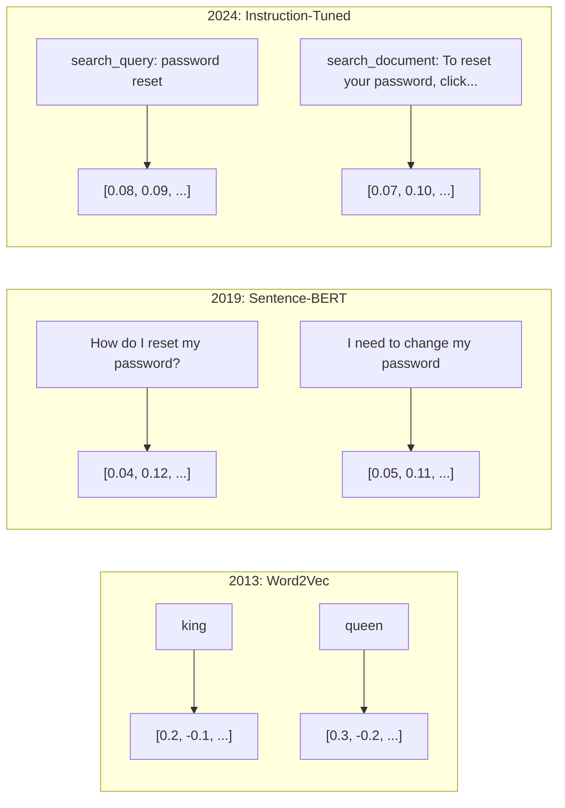
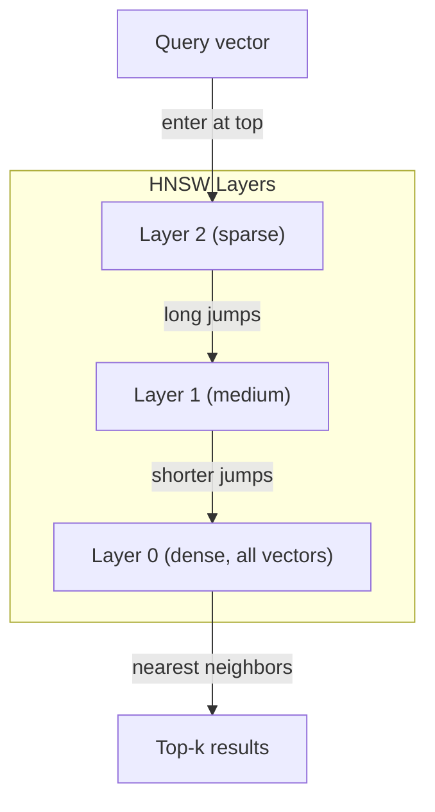
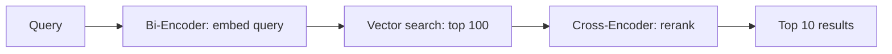

# التضمينات وتمثيلات المتجهات
> النص منفصل. الرياضيات مستمرة. في كل مرة تطلب فيها LLM العثور على مستندات "مشابهة"، أو مقارنة المعاني، أو البحث فيما وراء الكلمات الرئيسية، فإنك تعتمد على جسر بين هذين العالمين. هذا الجسر هو التضمين. إذا كنت لا تفهم التضمينات، فأنت لا تفهم AI الحديث. أنت فقط تستخدمه.
**النوع:** بناء
** اللغات: ** بايثون
**المتطلبات الأساسية:** المرحلة 11، الدرس 01 (الهندسة الفورية)
**الوقت:** ~75 دقيقة
** ذات صلة: ** المرحلة 5 · 22 (التعمق في نماذج التضمين) تغطي الكثافة مقابل المتفرقة مقابل المتجهات المتعددة، واقتطاع ماتريوشكا، واختيار النموذج لكل محور. يركز هذا الدرس على خط الإنتاج pipe (قواعد البيانات المتجهة، HNSW، رياضيات التشابه). اقرأ المرحلة 5 · 22 قبل اختيار النموذج.
## أهداف التعلم
- إنشاء تضمينات نصية باستخدام موفري API ونماذج مفتوحة المصدر، وحساب تشابه جيب التمام بينهما
- اشرح لماذا تحل عمليات التضمين مشكلة عدم تطابق المفردات التي لا يستطيع البحث عن الكلمات الرئيسية معالجتها
- إنشاء فهرس بحث دلالي يسترد المستندات حسب المعنى بدلاً من المطابقة التامة للكلمات الرئيسية
- تقييم جودة التضمين باستخدام معايير الاسترجاع (precision@k، Recall) واختيار نموذج التضمين المناسب لمهمتك
## المشكلة
لديك 10000 تذكرة دعم. يكتب أحد العملاء "لم تتم الدفعة الخاصة بي". تحتاج إلى العثور على تذاكر سابقة مماثلة. البحث عن الكلمات الرئيسية يعثر على التذاكر التي تحتوي على "الدفع" و"لم يتم التنفيذ". ولا تحتوي على "فشل المعاملة"، و"تم رفض الرسوم"، و"خطأ في الفوترة". تصف هذه التذاكر نفس المشكلة تمامًا بكلمات مختلفة تمامًا.
هذه هي مشكلة عدم تطابق المفردات. اللغة البشرية لديها عشرات الطرق لقول نفس الشيء. يتعامل البحث عن الكلمات الرئيسية مع كل كلمة كرمز مستقل لا معنى له. ولا يمكن أن يعرف أن كلمتي "رفض" و"لم يتم التنفيذ" تشيران إلى نفس المفهوم.
أنت بحاجة إلى تمثيل النص حيث يحدد المعنى، وليس التهجئة، التشابه. أنت بحاجة إلى طريقة لوضع عبارة "لم تتم دفعتي" و"تم رفض المعاملة" بالقرب من بعضهما البعض في بعض المساحة الحسابية، مع دفع عبارة "وصلت دفعتي في الوقت المحدد" بعيدًا على الرغم من مشاركة كلمة "دفع".
وهذا التمثيل هو التضمين.
##المفهوم
### ما هو التضمين؟
التضمين هو ناقل كثيف لأرقام الفاصلة العائمة التي تمثل معنى النص. كلمة "كثيف" مهمة - كل بُعد يحمل معلومات، على عكس التمثيلات المتفرقة (حقيبة الكلمات، TF-IDF) حيث تكون معظم الأبعاد صفرًا.
تصبح عبارة "جلست القطة على السجادة" شيئًا مثل `[0.023, -0.041, 0.087, ..., 0.012]` - قائمة من 768 إلى 3072 رقمًا حسب الطراز. هذه الأرقام ترمز المعنى. لا تقم بفحصهم بشكل مباشر أبدًا. أنت تقارنهم.
### اختراق Word2Vec
في عام 2013، نشر توماس ميكولوف وزملاؤه في جوجل Word2Vec. الفكرة الأساسية: تدريب الشبكة العصبية على التنبؤ بكلمة من جيرانها (أو جيرانها من كلمة)، وتصبح أوزان الطبقة المخفية تمثيلات متجهة ذات معنى.
النتيجة المشهورة:
```
king - man + woman = queen
```

يجسد الحساب المتجه على تضمينات الكلمات العلاقات الدلالية. الاتجاه من "الرجل" إلى "المرأة" هو تقريبًا نفس الاتجاه من "الملك" إلى "الملكة". كانت هذه هي اللحظة التي أدرك فيها هذا المجال أن الهندسة يمكن أن تشفر المعنى.
أنتج Word2Vec ناقلات ذات 300 بعد. حصلت كل كلمة على ناقل واحد بغض النظر عن السياق. "البنك" في "بنك النهر" و"الحساب البنكي" لهما نفس التضمين. قاد هذا القيد العقد التالي من البحث.
### من الكلمات إلى الجمل
تمثل تضمينات الكلمات رموزًا فردية. تحتاج أنظمة الإنتاج إلى تضمين جمل أو فقرات أو مستندات كاملة. ظهرت أربعة أساليب:
**المتوسط**: حساب متوسط ​​جميع متجهات الكلمات في الجملة. رخيصة، ضائعة، لائقة بشكل مدهش للنص القصير. يفقد ترتيب الكلمات بالكامل - تحصل عبارة "dog bits man man" و"man bitbits dog" على تضمينات متطابقة.
**CLS الرمز المميز**: تقوم نماذج المحولات (BERT, 2018) بإخراج تضمين رمز مميز خاص [CLS] يمثل الإدخال بالكامل. أفضل من المتوسط ​​ولكن تم تدريب الرمز المميز [CLS] للتنبؤ بالجمل التالية، وليس التشابه.
**التعلم التقابلي**: تدريب النموذج بشكل صريح على دفع الأزواج المتشابهة معًا والفصل بين الأزواج المتباينة. الجملة-BERT (Reimers & Gurevych, 2019) استخدمت هذا النهج وأصبحت الأساس لنماذج التضمين الحديثة. بالنظر إلى "كيف يمكنني إعادة تعيين كلمة المرور الخاصة بي؟" و"أحتاج إلى تغيير كلمة المرور الخاصة بي"، يتعلم النموذج أن هذه المتجهات يجب أن تكون متطابقة تقريبًا.
**التضمينات المضبوطة حسب التعليمات**: أحدث نهج. تقبل النماذج مثل E5 وGTE بادئة المهمة ("search_query:"، "search_document:") التي تخبر النموذج بنوع التضمين المطلوب إنتاجه. وهذا يتيح لنموذج واحد أن يخدم مهام متعددة.


### نماذج التضمين الحديثة
استقر السوق في عدد قليل من خيارات درجة الإنتاج (MTEB درجات اعتبارًا من أوائل عام 2026، MTEB الإصدار الثاني):
| نموذج | مقدم | الأبعاد | __المصطلح_2__ | السياق | التكلفة / مليون رمز |
|-------|----------|----------|------|---------|-----------------|
| تضمين الجوزاء 2 | جوجل | 3072 (ماتريوشكا) | 67.7 (استرجاع) | 8192 | 0.15 دولار |
| تضمين-v4 | كوهير | 1024 (ماتريوشكا) | 65.2 | 128 ألف | 0.12 دولار |
| رحلة-4 | رحلة AI | 1024/2048 (ماتريوشكا) | 66.8 | 32 ألف | 0.12 دولار |
| تضمين النص-3-كبير | OpenAI | 3072 (ماتريوشكا) | 64.6 | 8192 | 0.13 دولار |
| تضمين النص-3-صغير | __المصطلح_1__ | 1536 (ماتريوشكا) | 62.3 | 8192 | 0.02 دولار |
| BGE-M3 | __المصطلح_6__ | 1024 (كثيفة+متفرقة+كولبيرت) | 63.0 متعدد اللغات | 8192 | الوزن المفتوح |
| Qwen3-التضمين | علي بابا | 4096 (ماتريوشكا) | 66.9 | 32 ألف | الوزن المفتوح |
| Nomic-embed-v2 | نوميك | 768 (ماتريوشكا) | 63.1 | 8192 | الوزن المفتوح |
MTEB (معيار تضمين النص الضخم) يغطي الإصدار الثاني أكثر من 100 مهمة عبر الاسترجاع والتصنيف والتجميع وإعادة الترتيب والتلخيص. الأعلى هو الأفضل. بحلول عام 2026، ستتطابق النماذج ذات الوزن المفتوح (Qwen3-Embedding، BGE-M3) مع النماذج المستضافة المغلقة أو تتفوق عليها في معظم المحاور. Gemini Embedding 2 يؤدي إلى الاسترجاع النقي؛ Voyage/Cohere يؤدي إلى مجالات محددة (المالية، القانون، الكود). قم دائمًا بقياس استفساراتك الخاصة قبل الالتزام.
### مقاييس التشابه
بالنظر إلى ناقلين مضمنين، هناك ثلاث طرق لقياس مدى تشابههما:
**تشابه جيب التمام**: جيب تمام الزاوية بين متجهين. يتراوح من -1 (العكس) إلى 1 (الاتجاه المطابق). يتجاهل الحجم - يمكن أن تحصل الجملة المكونة من 10 كلمات والمستند المكون من 500 كلمة على 1.0 إذا كانت تشير إلى نفس الاتجاه. هذا هو الإعداد الافتراضي لـ 90% من حالات الاستخدام.
```
cosine_sim(a, b) = dot(a, b) / (||a|| * ||b||)
```

**المنتج النقطي**: المنتج الداخلي الخام لمتجهين. مطابق لتشابه جيب التمام عندما يتم تطبيع المتجهات (طول الوحدة). أسرع في الحساب. تمت تسوية تضمينات OpenAI، لذا فإن منتج النقطة وجيب التمام يعطيان نفس الترتيب.
```
dot(a, b) = sum(a_i * b_i)
```

**المسافة الإقليدية (L2)**: مسافة الخط المستقيم في الفضاء المتجه. أصغر = أكثر تشابها. حساسة لاختلافات الحجم. يُستخدم عندما يكون الموضع المطلق في الفضاء مهمًا، وليس الاتجاه فقط.
```
L2(a, b) = sqrt(sum((a_i - b_i)^2))
```

متى تستخدم ما:
| متري | استخدم عندما | تجنب متى |
|--------|----------|------------|
| تشابه جيب التمام | مقارنة النصوص ذات الأطوال المختلفة؛ معظم مهام الاسترجاع | الحجم يحمل معلومات |
| منتج دوت | لقد تم بالفعل تسوية التضمينات؛ السرعة القصوى | النواقل لها مقادير متفاوتة |
| المسافة الإقليدية | التجميع؛ مشاكل الجار المكاني | مقارنة المستندات ذات الأطوال المختلفة تمامًا |
### قواعد بيانات المتجهات وHNSW
يقوم بحث تشابه القوة الغاشمة بمقارنة الاستعلام بكل متجه مخزن. عند وجود مليون متجه مع 1536 بُعدًا، أي 1.5 مليار عملية ضرب وجمع لكل استعلام. بطيء جدًا.
تحل قواعد بيانات المتجهات هذه المشكلة باستخدام خوارزميات أقرب جار تقريبي (ANN). الخوارزمية السائدة هي HNSW (عالم صغير قابل للملاحة الهرمي):
1. أنشئ رسمًا بيانيًا متعدد الطبقات للمتجهات
2. الطبقات العليا متفرقة - اتصالات طويلة المدى بين المجموعات البعيدة
3. الطبقات السفلية كثيفة، وهي عبارة عن وصلات دقيقة بين النواقل القريبة
4. يبدأ البحث من الطبقة العليا، وينزل بجشع للتحسين
5. إرجاع نتائج top-k التقريبية في زمن O(log n) بدلاً من O(n)
يستبدل HNSW خسارة صغيرة في الدقة (عادةً ما تتراوح بين 95-99%) لتحقيق مكاسب هائلة في السرعة. عند وجود 10 ملايين متجه، تستغرق القوة الغاشمة ثوانٍ. HNSW يستغرق ميلي ثانية.


خيارات الإنتاج:
| قاعدة بيانات | اكتب | الأفضل لـ | مقياس ماكس |
|----------|------|---------|-----------|
| كوز الصنوبر | ادارة العلاقات مع | إنتاج العمليات الصفرية | مليارات |
| ويفييت | مفتوح المصدر | بحث مختلط ذاتي الاستضافة | 100 مليون+ |
| قدرانت | مفتوح المصدر | أداء عالي، تصفية | 100 مليون+ |
| كروما دي بي | مضمن | النماذج الأولية والتطوير المحلي | 1M |
| بجفيكتور | ملحق بوستجرس | تستخدم بالفعل Postgres | 10 م |
| FAISS | مكتبة | قيد التنفيذ، بحث | 1ب+ |
### استراتيجيات التقطيع
المستندات طويلة جدًا بحيث لا يمكن تضمينها كمتجهات فردية. يغطي PDF المكون من 50 صفحة عشرات المواضيع -- ويصبح تضمينه متوسطًا لكل شيء، ولا يشبه أي شيء محدد. يمكنك تقسيم المستندات إلى أجزاء وتضمين كل منها.
**التقطيع ذو الحجم الثابت**: قم بتقسيم كل رموز N مع تداخل رمز M. بسيطة ويمكن التنبؤ بها. يعمل بشكل جيد عندما لا يكون للمستندات بنية واضحة. قطعة مكونة من 512 رمزًا مع تداخل 50 رمزًا: القطعة 1 هي الرموز المميزة 0-511، القطعة 2 هي الرموز المميزة 462-973.
**التقطيع بناءً على الجملة**: التقسيم عند حدود الجملة، وتجميع الجمل حتى الوصول إلى الحد الأقصى للرمز المميز. كل قطعة عبارة عن جملة كاملة واحدة على الأقل. أفضل من الحجم الثابت لأنك لا تقطع الفكرة إلى النصف أبدًا.
**التقطيع العودي**: حاول التقسيم عند الحد الأكبر أولاً (رؤوس الأقسام). إذا كان لا يزال كبيرًا جدًا، فجرّب حدود الفقرة. ثم حدود الجملة. ثم حدود الأحرف. هذا هو `RecursiveCharacterTextSplitter` الخاص بـ LangChain وهو يعمل بشكل جيد مع النصوص المجمعة ذات التنسيق المختلط.
**التقطيع الدلالي**: قم بتضمين كل جملة، ثم قم بتجميع الجمل المتتالية التي تتشابه تضميناتها. عندما ينخفض ​​تشابه التضمين إلى أقل من العتبة، ابدأ قطعة جديدة. باهظ الثمن (يتطلب تضمين كل جملة على حدة) ولكنه ينتج الأجزاء الأكثر تماسكًا.
| استراتيجية | التعقيد | الجودة | الأفضل لـ |
|----------|-----------|---------|----------|
| حجم ثابت | منخفض | لائق | نص غير منظم، وسجلات |
| بناء الجملة | منخفض | جيد | مقالات ورسائل بريد إلكتروني |
| عودي | متوسطة | جيد | تخفيض السعر، HTML، مستندات مختلطة |
| الدلالية | عالية | أفضل | جودة الاسترجاع الحرجة |
النقطة المثالية لمعظم الأنظمة: 256-512 قطعة رمزية مع تداخل 50 رمزًا.
### أجهزة التشفير الثنائية مقابل أجهزة التشفير المتقاطعة
يقوم جهاز التشفير الثنائي بتضمين الاستعلام والمستندات بشكل مستقل، ثم يقارن بين المتجهات. سريع - يمكنك تضمين الاستعلام مرة واحدة ومقارنته بتضمينات المستندات المحسوبة مسبقًا. هذا هو ما تستخدمه للاسترجاع.
يأخذ برنامج التشفير المشترك الاستعلام والمستند كمدخل واحد ويخرج درجة الصلة. بطيء - يعالج كل زوج من مستندات الاستعلام من خلال النموذج الكامل. ولكنه أكثر دقة لأنه يمكنه الحضور عبر الاستعلامات والرموز المميزة للمستندات في وقت واحد.
نمط الإنتاج: يقوم برنامج التشفير الثنائي باسترداد أفضل 100 مرشح، ويقوم برنامج التشفير المتقاطع بإعادة ترتيبهم إلى العشرة الأوائل. هذا هو سطر الاسترداد ثم إعادة الترتيب pipe.


نماذج إعادة الترتيب: Cohere Reranker 3.5 (2 دولار لكل 1000 استعلام)، BGE-reranker-v2 (مجاني، مفتوح المصدر)، Jina Reranker v2 (مجاني، مفتوح المصدر).
### زخارف ماتريوشكا
التضمينات التقليدية هي كل شيء أو لا شيء. يستخدم المتجه ذو الأبعاد 1536 1536 عوامة. لا يمكنك اقتطاع 256 بُعدًا دون إعادة التدريب.
يعمل تعلم تمثيل ماتريوشكا (Kusupati et al., 2022) على إصلاح هذه المشكلة. تم تدريب النموذج بحيث تلتقط أبعاد N الأولى المعلومات الأكثر أهمية، مثل دمية التعشيش الروسية. يؤدي اقتطاع تضمين دمية ماتريوشكا من عام 1536 إلى 256 بُعدًا إلى فقدان بعض الدقة ولكنه يظل فعالاً.
يدعم تضمين النص OpenAI-3-الصغير وتضمين النص-3-الكبير اقتطاع Matryoshka عبر المعلمة `dimensions`. يؤدي طلب 256 بُعدًا بدلاً من 1536 إلى تقليل مساحة التخزين بمقدار 6x مع فقدان الدقة بنسبة 3-5% تقريبًا وفقًا لمعايير MTEB.
### التكميم الثنائي
يستخدم التضمين ذو 1536 بعدًا والمخزن كـ float32 6,144 بايت. اضرب في 10 ملايين مستند: 61 GB للمتجهات فقط.
يقوم التكميم الثنائي بتحويل كل تعويم إلى بتة واحدة: تصبح القيم الموجبة 1، والقيم السالبة تصبح 0. وينخفض ​​التخزين من 6,144 بايت إلى 192 بايت - أي تخفيض بمقدار 32x. يتم حساب التشابه باستخدام مسافة Hamming (عد البتات المختلفة)، والتي يمكن لوحدات المعالجة المركزية القيام بها في تعليمات واحدة.
تصل الدقة إلى حوالي 5-10% عند استدعاء الاسترجاع. النمط الشائع: التكميم الثنائي للبحث في التمريرة الأولى على ملايين المتجهات، ثم إعادة تسجيل أعلى 1000 باستخدام متجهات كاملة الدقة. ويمنحك هذا دقة كاملة تزيد عن 95% وذاكرة أقل بمقدار 32 مرة.
## بنائها
نحن نبني محرك بحث دلالي من الصفر. لا توجد قاعدة بيانات المتجهات. لا يوجد تضمين خارجي API. بيثون نقية مع numpy للرياضيات.
### الخطوة 1: تقطيع النص
```python
def chunk_text(text, chunk_size=200, overlap=50):
    words = text.split()
    chunks = []
    start = 0
    while start < len(words):
        end = start + chunk_size
        chunk = " ".join(words[start:end])
        chunks.append(chunk)
        start += chunk_size - overlap
    return chunks


def chunk_by_sentences(text, max_chunk_tokens=200):
    sentences = text.replace("\n", " ").split(".")
    sentences = [s.strip() + "." for s in sentences if s.strip()]
    chunks = []
    current_chunk = []
    current_length = 0
    for sentence in sentences:
        sentence_length = len(sentence.split())
        if current_length + sentence_length > max_chunk_tokens and current_chunk:
            chunks.append(" ".join(current_chunk))
            current_chunk = []
            current_length = 0
        current_chunk.append(sentence)
        current_length += sentence_length
    if current_chunk:
        chunks.append(" ".join(current_chunk))
    return chunks
```

### الخطوة الثانية: بناء التضمينات من الصفر
نقوم بتنفيذ عملية تضمين كثيفة بسيطة باستخدام TF-IDF مع التطبيع L2. هذا ليس تضمينًا عصبيًا، ولكنه يتبع نفس العقد: النص الوارد، والمتجهات ذات الحجم الثابت، والنصوص المماثلة تنتج متجهات مماثلة.
```python
import math
import numpy as np
from collections import Counter

class SimpleEmbedder:
    def __init__(self):
        self.vocab = []
        self.idf = []
        self.word_to_idx = {}

    def fit(self, documents):
        vocab_set = set()
        for doc in documents:
            vocab_set.update(doc.lower().split())
        self.vocab = sorted(vocab_set)
        self.word_to_idx = {w: i for i, w in enumerate(self.vocab)}
        n = len(documents)
        self.idf = np.zeros(len(self.vocab))
        for i, word in enumerate(self.vocab):
            doc_count = sum(1 for doc in documents if word in doc.lower().split())
            self.idf[i] = math.log((n + 1) / (doc_count + 1)) + 1

    def embed(self, text):
        words = text.lower().split()
        count = Counter(words)
        total = len(words) if words else 1
        vec = np.zeros(len(self.vocab))
        for word, freq in count.items():
            if word in self.word_to_idx:
                tf = freq / total
                vec[self.word_to_idx[word]] = tf * self.idf[self.word_to_idx[word]]
        norm = np.linalg.norm(vec)
        if norm > 0:
            vec = vec / norm
        return vec
```

### الخطوة 3: وظائف التشابه
```python
def cosine_similarity(a, b):
    dot = np.dot(a, b)
    norm_a = np.linalg.norm(a)
    norm_b = np.linalg.norm(b)
    if norm_a == 0 or norm_b == 0:
        return 0.0
    return float(dot / (norm_a * norm_b))


def dot_product(a, b):
    return float(np.dot(a, b))


def euclidean_distance(a, b):
    return float(np.linalg.norm(a - b))
```

### الخطوة 4: فهرس المتجهات باستخدام بحث القوة الغاشمة
```python
class VectorIndex:
    def __init__(self):
        self.vectors = []
        self.texts = []
        self.metadata = []

    def add(self, vector, text, meta=None):
        self.vectors.append(vector)
        self.texts.append(text)
        self.metadata.append(meta or {})

    def search(self, query_vector, top_k=5, metric="cosine"):
        scores = []
        for i, vec in enumerate(self.vectors):
            if metric == "cosine":
                score = cosine_similarity(query_vector, vec)
            elif metric == "dot":
                score = dot_product(query_vector, vec)
            elif metric == "euclidean":
                score = -euclidean_distance(query_vector, vec)
            else:
                raise ValueError(f"Unknown metric: {metric}")
            scores.append((i, score))
        scores.sort(key=lambda x: x[1], reverse=True)
        results = []
        for idx, score in scores[:top_k]:
            results.append({
                "text": self.texts[idx],
                "score": score,
                "metadata": self.metadata[idx],
                "index": idx
            })
        return results

    def size(self):
        return len(self.vectors)
```

### الخطوة 5: محرك البحث الدلالي
```python
class SemanticSearchEngine:
    def __init__(self, chunk_size=200, overlap=50):
        self.embedder = SimpleEmbedder()
        self.index = VectorIndex()
        self.chunk_size = chunk_size
        self.overlap = overlap

    def index_documents(self, documents, source_names=None):
        all_chunks = []
        all_sources = []
        for i, doc in enumerate(documents):
            chunks = chunk_text(doc, self.chunk_size, self.overlap)
            all_chunks.extend(chunks)
            name = source_names[i] if source_names else f"doc_{i}"
            all_sources.extend([name] * len(chunks))
        self.embedder.fit(all_chunks)
        for chunk, source in zip(all_chunks, all_sources):
            vec = self.embedder.embed(chunk)
            self.index.add(vec, chunk, {"source": source})
        return len(all_chunks)

    def search(self, query, top_k=5, metric="cosine"):
        query_vec = self.embedder.embed(query)
        return self.index.search(query_vec, top_k, metric)

    def search_with_scores(self, query, top_k=5):
        results = self.search(query, top_k)
        return [
            {
                "text": r["text"][:200],
                "source": r["metadata"].get("source", "unknown"),
                "score": round(r["score"], 4)
            }
            for r in results
        ]
```

### الخطوة 6: مقارنة مقاييس التشابه
```python
def compare_metrics(engine, query, top_k=3):
    results = {}
    for metric in ["cosine", "dot", "euclidean"]:
        hits = engine.search(query, top_k=top_k, metric=metric)
        results[metric] = [
            {"score": round(h["score"], 4), "preview": h["text"][:80]}
            for h in hits
        ]
    return results
```

## استخدمه
مع تضمين الإنتاج API، تظل البنية متطابقة. يتغير المضمن فقط:
```python
from openai import OpenAI

client = OpenAI()

def openai_embed(texts, model="text-embedding-3-small", dimensions=None):
    kwargs = {"model": model, "input": texts}
    if dimensions:
        kwargs["dimensions"] = dimensions
    response = client.embeddings.create(**kwargs)
    return [item.embedding for item in response.data]
```

اقتطاع ماتريوشكا باستخدام OpenAI -- نفس الطراز، وأبعاد أقل، ومساحة تخزين أقل:
```python
full = openai_embed(["semantic search query"], dimensions=1536)
compact = openai_embed(["semantic search query"], dimensions=256)
```

يستخدم المتجه 256-d مساحة تخزين أقل بمقدار 6x. بالنسبة لـ 10 ملايين مستند، يكون ذلك 10 GB مقابل 61 GB. تبلغ نسبة فقدان الدقة حوالي 3-5% وفقًا للمعايير القياسية.
لإعادة الترتيب باستخدام Cohere:
```python
import cohere

co = cohere.ClientV2()

results = co.rerank(
    model="rerank-v3.5",
    query="What is the refund policy?",
    documents=["Full refund within 30 days...", "No refunds after 90 days..."],
    top_n=3
)
```

بالنسبة لعمليات التضمين المحلية التي لا تحتوي على تبعية API:
```python
from sentence_transformers import SentenceTransformer

model = SentenceTransformer("BAAI/bge-small-en-v1.5")
embeddings = model.encode(["semantic search query", "another document"])
```

تعمل فئة VectorIndex من بنيتنا مع أي من هذه العناصر. قم بتبديل وظيفة التضمين، واحتفظ بمنطق البحث.
## اشحنها
ينتج هذا الدرس:
- `outputs/prompt-embedding-advisor.md` -- مطالبة باختيار نماذج واستراتيجيات التضمين لحالات استخدام محددة
- `outputs/skill-embedding-patterns.md` -- مهارة تعلم الوكلاء كيفية استخدام التضمينات بشكل فعال في الإنتاج
## تمارين
1. **مقارنة المقاييس**: قم بإجراء نفس الاستعلامات الخمسة مقابل نماذج المستندات باستخدام تشابه جيب التمام وحاصل الضرب النقطي والمسافة الإقليدية. سجل أعلى 3 نتائج لكل منها. ما هي الاستعلامات التي تختلف فيها المقاييس؟ لماذا؟
2. **تجربة حجم القطعة**: قم بفهرسة نماذج المستندات ذات أحجام الأجزاء 50 و100 و200 و500 كلمة. لكل منها، قم بتشغيل 5 استعلامات وسجل أعلى 1 نقاط تشابه. رسم العلاقة بين حجم القطعة وجودة الاسترجاع. ابحث عن النقطة التي تبدأ فيها القطع الأكبر في الألم.
3. **محاكاة ماتريوشكا**: أنشئ برنامج SimpleEmbedder الذي ينتج متجهات ذات 500 يوم. اقتطاع إلى أبعاد 50 و100 و200 و500. قم بقياس مدى تدهور استدعاء الاسترجاع عند كل اقتطاع. هذا يحاكي سلوك ماتريوشكا دون الحاجة إلى خدعة التدريب الحقيقية.
4. **التكميم الثنائي**: خذ التضمينات من محرك البحث، وقم بتحويلها إلى ثنائي (1 إذا كان موجبًا، 0 إذا كان سالبًا)، وقم بتنفيذ بحث مسافة هامينج. قارن أفضل 10 نتائج مع تشابه جيب التمام كامل الدقة. قياس نسبة التداخل.
5. **التقطيع على أساس الجملة**: استبدل التقطيع ذي الحجم الثابت بـ `chunk_by_sentences`. قم بتشغيل نفس الاستعلامات وقارن نتائج الاسترجاع. هل احترام حدود الجملة يحسن النتائج؟
## المصطلحات الرئيسية
| مصطلح | ماذا يقول الناس | ماذا يعني في الواقع |
|------|----------------|----------------------|
| التضمين | "النص إلى أرقام" | متجه كثيف حيث يرمز القرب الهندسي إلى التشابه الدلالي |
| Word2Vec | "التضمين OG" | نموذج 2013 الذي تعلم ناقلات الكلمات من خلال التنبؤ بكلمات السياق؛ ثبت أن الحساب المتجه يشفر المعنى |
| تشابه جيب التمام | "ما مدى تشابه المتجهين" | جيب تمام الزاوية بين المتجهات؛ 1 = اتجاه متطابق، 0 = متعامد، -1 = معاكس |
| __المصطلح_1__ | "بحث سريع عن المتجهات" | رسم بياني هرمي للعالم الصغير قابل للملاحة - هيكل متعدد الطبقات يتيح O(log n) البحث التقريبي عن أقرب جار |
| التشفير الثنائي | "التضمين بشكل منفصل، والمقارنة السريعة" | تشفير الاستعلام والوثيقة بشكل مستقل في المتجهات؛ يتيح الحساب المسبق والاسترجاع السريع |
| عبر التشفير | "إعادة ترتيب بطيئة ولكن دقيقة" | يعالج زوج مستند الاستعلام بشكل مشترك من خلال النموذج الكامل؛ دقة أعلى، لا يوجد حساب مسبق |
| زخارف ماتريوشكا | "ناقلات قابلة للاقتطاع" | تم تدريب التضمينات بحيث تلتقط أبعاد N الأولى المعلومات الأكثر أهمية، مما يتيح تخزينًا متغير الحجم |
| التكميم الثنائي | "التضمينات ذات 1 بت" | تحويل المتجهات العائمة إلى ثنائية (بت الإشارة فقط) لتقليل التخزين بمقدار 32x باستخدام بحث مسافة هامينج |
| التقطيع | "تقسيم المستندات للتضمين" | تقسيم المستندات إلى مقاطع رمزية من 256 إلى 512 بحيث يمكن تضمين كل منها واسترجاعها بشكل مستقل |
| قاعدة بيانات المتجهات | "محرك بحث عن التضمينات" | مخزن بيانات محسّن لتخزين المتجهات وإجراء بحث تقريبي عن أقرب جيران على نطاق واسع |
| التعلم التقابلي | "التدريب بالمقارنة" | نهج التدريب الذي يدفع التضمينات الزوجية المتشابهة معًا والتضمينات الزوجية المتباينة |
| __المصطلح_2__ | "معيار التضمين" | مقياس تضمين النص الضخم - 56 مجموعة بيانات عبر 8 مهام؛ معيار لمقارنة نماذج التضمين |
## مزيد من القراءة
- ميكولوف وآخرون، "التقدير الفعال لتمثيلات الكلمات في الفضاء المتجه" (2013) - ورقة Word2Vec التي بدأت ثورة التضمين باستخدام تشبيه الملك والملكة
- Reimers & Gurevych، "Sentence-BERT: تضمينات الجملة باستخدام الشبكات السيامية BERT" (2019) - كيفية تدريب أجهزة التشفير الثنائية على التشابه على مستوى الجملة، وأساس نماذج التضمين الحديثة
- كوسوباتي وآخرون، "تعلم تمثيل ماتريوشكا" (2022) - التقنية وراء عمليات التضمين ذات الأبعاد المتغيرة التي اعتمدها OpenAI لتضمين النص-3
- مالكوف وياشونين، "أقرب جار تقريبي فعال وقوي باستخدام الرسوم البيانية الهرمية للعالم الصغير القابلة للملاحة" (2018) - ورقة HNSW، الخوارزمية وراء معظم عمليات البحث عن متجهات الإنتاج
- OpenAI دليل التضمين (platform.openai.com/docs/guides/embeddings) - مرجع عملي لنماذج تضمين النص 3 بما في ذلك تقليل أبعاد ماتريوشكا
- MTEB لوحة المتصدرين (huggingface.co/spaces/mteb/leaderboard) - معيار مباشر لمقارنة جميع نماذج التضمين عبر المهام واللغات
- [Muennighoff et al., "MTEB: Massive Text Embedding Benchmark" (EACL 2023)](https://arxiv.org/abs/2210.07316) - المعيار الذي يحدد 8 فئات مهام (التصنيف، والتجميع، وتصنيف الأزواج، وإعادة الترتيب، والاسترجاع، STS، والتلخيص، واستخراج النصوص الثنائية) التي تقاريرها لوحة المتصدرين؛ اقرأ قبل أن تثق بأي درجة MTEB واحدة.
- [Sentence Transformers documentation](https://www.sbert.net/) -- المرجع الأساسي للتشفير الثنائي مقابل التشفير المتقاطع، واستراتيجيات التجميع، ومخزن الإدخال والتقسيم والتضمين RAG pipeline الذي ينفذه هذا الدرس.