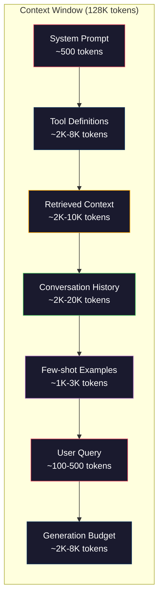
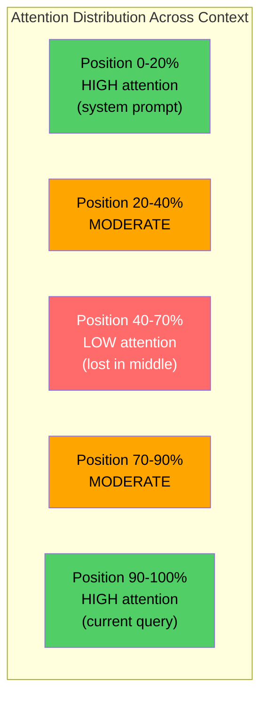
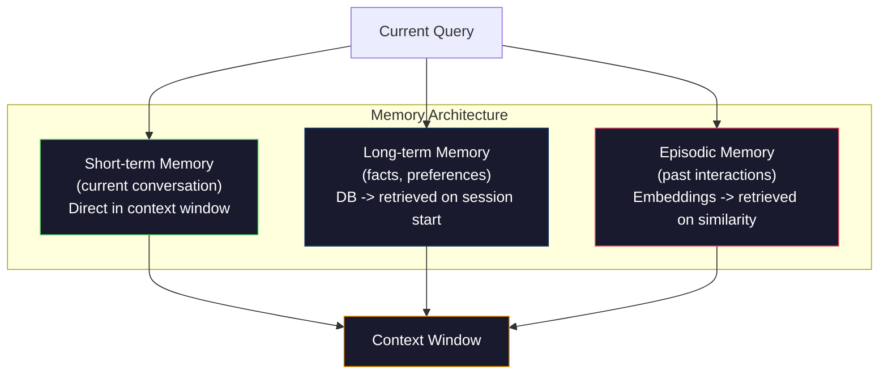

# هندسة السياق: النوافذ والميزانيات والذاكرة والاسترجاع
> الهندسة السريعة هي مجموعة فرعية. هندسة السياق هي اللعبة بأكملها. المطالبة هي سلسلة تكتبها. السياق هو كل ما يدخل في نافذة النموذج: تعليمات النظام، والمستندات المستردة، وتعريفات الأداة، وسجل المحادثة، وأمثلة قليلة، والموجه نفسه. أفضل مهندسي AI في عام 2026 هم مهندسو السياق. إنهم يقررون ما يدخل، وما يبقى خارجا، وبأي ترتيب.
**النوع:** بناء
** اللغات: ** بايثون
**المتطلبات الأساسية:** المرحلة 10 (ماجستير إدارة الأعمال من الصفر)، المرحلة 11 الدرس 01-02
**الوقت:** ~90 دقيقة
**ذات صلة:** المرحلة 11 · 15 (التخزين المؤقت السريع) — يعد التخطيط الملائم لذاكرة التخزين المؤقت امتدادًا لهندسة السياق. المرحلة 5 · 28 (تقييم السياق الطويل) لكيفية قياس الضياع في المنتصف باستخدام NIAH/RULER.
## أهداف التعلم
- حساب ميزانيات الرمز المميز عبر جميع مكونات نافذة السياق (موجه النظام، والأدوات، والتاريخ، والمستندات المستردة، وإرتفاع التوليد)
- تنفيذ استراتيجيات إدارة نافذة السياق: الاقتطاع والتلخيص والنافذة المنزلقة لسجل المحادثة
- تحديد أولويات مكونات السياق وترتيبها لزيادة انتباه النموذج إلى المعلومات الأكثر صلة
- إنشاء مجمع السياق الذي يخصص الرموز المميزة ديناميكيًا بناءً على نوع الاستعلام ومساحة النافذة المتاحة
## المشكلة
لدى Claude Opus 4.7 نافذة رمزية تبلغ 200 ألف (مليون واحد في النسخة التجريبية). GPT-5 لديه 400 ألف. الجوزاء 3 برو لديه 2M. اللاما 4 تطالب بـ 10 ملايين. تبدو هذه الأرقام هائلة حتى تقوم بملئها.
هنا تفصيل حقيقي لمساعد الترميز. موجه النظام: 500 رمزًا. تعريفات الأدوات لـ 50 أداة: 8000 رمزًا. الوثائق التي تم استرجاعها: 4000 رمز. سجل المحادثة (10 دورات): 6000 رمز. استعلام المستخدم الحالي: 200 رمزًا. ميزانية التوليد (الحد الأقصى للإنتاج): 4000 رمز. المجموع: 22,700 قطعة. هذا يمثل 18% فقط من نافذة بحجم 128 كيلو بايت.
لكن الاهتمام لا يتوسع بشكل خطي مع طول السياق. نموذج يحتوي على 128 ألف رمز مميز للسياق يدفع تكلفة انتباه تربيعية (O(n^2) في محولات الفانيليا، على الرغم من أن معظم نماذج الإنتاج تستخدم متغيرات انتباه فعالة). والأهم من ذلك، أن دقة الاسترجاع تنخفض. يوضح اختبار "إبرة في كومة قش" أن النماذج تكافح للعثور على المعلومات الموضوعة في وسط السياقات الطويلة. البحث الذي أجراه ليو وآخرون. (2023) أظهر أن ماجستير إدارة الأعمال يسترد المعلومات في بداية ونهاية السياقات الطويلة بدقة شبه مثالية، لكن الدقة تنخفض بنسبة 10-20% للمعلومات الموضوعة في المنتصف (المواضع 40-70% من السياق). يختلف تأثير "الضياع في المنتصف" هذا حسب الطراز ولكنه يؤثر على جميع البنى الحالية.
الدرس العملي: توفر 200 ألف رمز لا يعني أن استخدام 200 ألف رمز فعال. غالبًا ما يتفوق سياق الرمز المميز الذي يبلغ 10 آلاف والذي تم تنسيقه بعناية على سياق الرمز المميز الذي يبلغ 100 ألف والذي تم إغراقه. هندسة السياق هي مجال تعظيم نسبة الإشارة إلى الضوضاء داخل نافذة السياق.
كل رمز مميز تضعه في النافذة يزيح رمزًا مميزًا قد يحمل المزيد من المعلومات ذات الصلة. كل تعريف أداة غير ذي صلة، وكل محادثة قديمة، وكل جزء من النص المسترد لا يجيب على السؤال - كل واحد make هو النموذج الأسوأ قليلاً في المهمة.
##المفهوم
### نافذة السياق هي مورد نادر
فكر في نافذة السياق على أنها RAM، وليس قرصًا. إنه سريع ويمكن الوصول إليه مباشرة، ولكنه محدود. لا يمكنك أن تناسب كل شيء. يجب عليك الاختيار.


كل مكون يتنافس على المساحة. إن إضافة المزيد من تعريفات الأدوات يعني مساحة أقل لسجل المحادثات. إن إضافة المزيد من السياق المسترجع يعني مساحة أقل لأمثلة قليلة. هندسة السياق هي فن تخصيص هذه الميزانية لتحقيق أقصى قدر من أداء المهام.
### الضياع في المنتصف
أهم النتائج التجريبية في هندسة السياق. تهتم النماذج بشكل أفضل بالمعلومات الموجودة في بداية السياق ونهايته. تحصل المعلومات الموجودة في المنتصف على درجات اهتمام أقل ومن المرجح أن يتم تجاهلها.
ليو وآخرون. (2023) اختبر هذا بشكل منهجي. لقد وضعوا وثيقة ذات صلة بين 20 وثيقة غير ذات صلة في مواقع مختلفة وقاموا بقياس دقة الإجابة. عندما كانت الوثيقة ذات الصلة هي الأولى أو الأخيرة، كانت الدقة 85-90%. عندما كان في المنتصف (الموضع 10 من 20)، انخفضت الدقة إلى 60-70%.
وهذا له آثار هندسية مباشرة:
- ضع المعلومات الأكثر أهمية أولاً (موجه النظام، التعليمات الهامة)
- ضع الاستعلام الحالي والسياق الأكثر صلة في النهاية (يساعد تحيز الحداثة)
- تعامل مع منتصف السياق باعتباره المنطقة ذات الأولوية الدنيا
- إذا كان يجب عليك تضمين معلومات في المنتصف، قم بتكرار النقطة الرئيسية في النهاية


### مكونات السياق
**موجه النظام**: يحدد الشخصية والقيود والقواعد السلوكية. يبدأ هذا أولاً ويظل ثابتًا عبر المنعطفات. يستخدم Claude Code ما يقرب من 6000 رمز مميز لموجه النظام الخاص به بما في ذلك تعريفات الأداة والتعليمات السلوكية. يبقيه ضيقا. يتم تكرار كل كلمة في موجه النظام في كل مكالمة API.
**تعريفات الأداة**: تضيف كل أداة ما بين 50 إلى 200 رمزًا مميزًا (الاسم والوصف ومخطط المعلمات). 50 أداة بـ 150 رمزًا لكل منها 7500 رمزًا قبل إجراء أي محادثة. يمكن أن يؤدي التحديد الديناميكي للأداة - بما في ذلك الأدوات ذات الصلة بالاستعلام الحالي فقط - إلى تقليل ذلك بنسبة 60-80%.
**السياق المسترد**: المستندات من قاعدة بيانات المتجهات ونتائج البحث ومحتويات الملف. جودة الاسترجاع تحدد بشكل مباشر جودة الاستجابة. يعد الاسترجاع السيئ أسوأ من عدم الاسترجاع - فهو يملأ النافذة بالضوضاء ويضلل النموذج بشكل فعال.
**سجل المحادثات**: كل رسالة مستخدم سابقة واستجابة المساعد. ينمو خطيًا مع طول المحادثة. محادثة مكونة من 50 دورة بمعدل 200 رمز لكل دور هي 10000 رمز من التاريخ. معظمها لا علاقة له بالاستعلام الحالي.
**أمثلة قليلة**: أزواج الإدخال/الإخراج التي توضح السلوك المطلوب. غالبًا ما يعمل مثالان أو ثلاثة أمثلة مختارة جيدًا على تحسين جودة المخرجات أكثر من آلاف الرموز المميزة للتعليمات. لكنها تكلف الفضاء.
**ميزانية الإنشاء**: الرموز المميزة المخصصة لاستجابة النموذج. إذا قمت بملء النافذة إلى أقصى حد، فلن يكون لدى النموذج مجال للإجابة. احتفظ بما لا يقل عن 2000-4000 رمزًا للجيل.
### استراتيجيات ضغط السياق
**تلخيص التاريخ**: بدلاً من الاحتفاظ بجميع المنعطفات السابقة حرفيًا، قم بتلخيص المحادثة بشكل دوري. "لقد ناقشنا X، وقررنا Y، والمستخدم يريد Z" في 100 رمز يحل محل 10 دورات استغرقت 2000 رمزًا. قم بتشغيل التلخيص عندما يتجاوز السجل الحد الأدنى (على سبيل المثال، 5000 رمز).
**تصفية الصلة**: قم بتسجيل كل مستند تم استرداده مقابل الاستعلام الحالي وإفلات المستندات تحت الحد. إذا قمت باسترجاع 10 أجزاء ولكن 3 منها فقط ذات صلة، فتخلص من السبعة الأخرى. من الأفضل أن يكون لديك 3 أجزاء ذات صلة كبيرة بدلاً من 10 أجزاء متوسطة.
** تقليم الأدوات **: قم بتصنيف غرض استعلام المستخدم وقم فقط بتضمين الأدوات ذات الصلة بهذا الهدف. لا يحتاج سؤال الكود إلى أدوات التقويم. لا يحتاج سؤال الجدولة إلى أدوات نظام الملفات. يمكن أن يؤدي ذلك إلى تقليل تعريفات الأداة من 8000 رمز مميز إلى 1000 رمز.
**التلخيص العودي**: بالنسبة للمستندات الطويلة جدًا، يتم تلخيصها على مراحل. قم أولاً بتلخيص كل قسم، ثم تلخيص الملخصات. يصبح المستند المكون من 50 صفحة ملخصًا مكونًا من 500 رمزًا مميزًا يلتقط النقاط الأساسية.
### أنظمة الذاكرة
تمتد هندسة السياق إلى ثلاثة آفاق زمنية.
**الذاكرة قصيرة المدى**: المحادثة الحالية. مخزنة في نافذة السياق مباشرة. ينمو مع كل منعطف. تدار عن طريق التلخيص والاقتطاع.
**الذاكرة طويلة المدى**: الحقائق والتفضيلات التي تستمر عبر المحادثات. "يفضل المستخدم TypeScript." "يستخدم المشروع PostgreSQL." مخزنة في قاعدة بيانات، ويتم استرجاعها عند بدء الجلسة. يقوم كلود كود بتخزين هذا في ملفات CLAUDE.md. يقوم ChatGPT بتخزينه في ميزة الذاكرة الخاصة به.
**الذاكرة العرضية**: تفاعلات سابقة محددة قد تكون ذات صلة. "في يوم الثلاثاء الماضي، قمنا بتصحيح مشكلة مماثلة في وحدة المصادقة." يتم تخزينها كتضمينات، ويتم استردادها عندما تتطابق المحادثة الحالية مع حلقة سابقة.


### تجميع السياق الديناميكي
الفكرة الرئيسية: الاستعلامات المختلفة تحتاج إلى سياق مختلف. إن مطالبة النظام الثابت + الأدوات الثابتة + السجل الثابت يعد إهدارًا. تقوم أفضل الأنظمة بتجميع السياق ديناميكيًا لكل استعلام.
1. تصنيف غرض الاستعلام
2. حدد الأدوات ذات الصلة (وليس كل الأدوات)
3. استرجاع المستندات ذات الصلة (ليست مجموعة ثابتة)
4. قم بتضمين المنعطفات التاريخية ذات الصلة (وليس كل التاريخ)
5. قم بإضافة أمثلة قليلة تتطابق مع نوع المهمة
6. رتّب كل شيء حسب الأهمية: الأهمية أولاً، المهم أخيرًا، واختياري في المنتصف
هذا هو ما يفصل تطبيق AI الجيد عن التطبيق الرائع. النموذج هو نفسه. السياق هو الفارق.
## بنائها
### الخطوة 1: عداد الرمز المميز
لا يمكنك وضع ميزانية لما لا يمكنك قياسه. أنشئ عدادًا بسيطًا للرموز المميزة (التقريب باستخدام تقسيم المسافات البيضاء، نظرًا لأن العدد الدقيق يعتمد على أداة الرمز المميز).
```python
import json
import numpy as np
from collections import OrderedDict

def count_tokens(text):
    if not text:
        return 0
    return int(len(text.split()) * 1.3)

def count_tokens_json(obj):
    return count_tokens(json.dumps(obj))
```

### الخطوة الثانية: مدير ميزانية السياق
التجريد الأساسي. يتتبع مدير الميزانية عدد الرموز المميزة التي يستخدمها كل مكون ويفرض الحدود.
```python
class ContextBudget:
    def __init__(self, max_tokens=128000, generation_reserve=4000):
        self.max_tokens = max_tokens
        self.generation_reserve = generation_reserve
        self.available = max_tokens - generation_reserve
        self.allocations = OrderedDict()

    def allocate(self, component, content, max_tokens=None):
        tokens = count_tokens(content)
        if max_tokens and tokens > max_tokens:
            words = content.split()
            target_words = int(max_tokens / 1.3)
            content = " ".join(words[:target_words])
            tokens = count_tokens(content)

        used = sum(self.allocations.values())
        if used + tokens > self.available:
            allowed = self.available - used
            if allowed <= 0:
                return None, 0
            words = content.split()
            target_words = int(allowed / 1.3)
            content = " ".join(words[:target_words])
            tokens = count_tokens(content)

        self.allocations[component] = tokens
        return content, tokens

    def remaining(self):
        used = sum(self.allocations.values())
        return self.available - used

    def utilization(self):
        used = sum(self.allocations.values())
        return used / self.max_tokens

    def report(self):
        total_used = sum(self.allocations.values())
        lines = []
        lines.append(f"Context Budget Report ({self.max_tokens:,} token window)")
        lines.append("-" * 50)
        for component, tokens in self.allocations.items():
            pct = tokens / self.max_tokens * 100
            bar = "#" * int(pct / 2)
            lines.append(f"  {component:<25} {tokens:>6} tokens ({pct:>5.1f}%) {bar}")
        lines.append("-" * 50)
        lines.append(f"  {'Used':<25} {total_used:>6} tokens ({total_used/self.max_tokens*100:.1f}%)")
        lines.append(f"  {'Generation reserve':<25} {self.generation_reserve:>6} tokens")
        lines.append(f"  {'Remaining':<25} {self.remaining():>6} tokens")
        return "\n".join(lines)
```

### الخطوة 3: إعادة الترتيب المفقود
قم بتنفيذ استراتيجية إعادة الترتيب: العناصر الأكثر أهمية تأتي أولًا وأخيرًا، والأقل أهمية توضع في المنتصف.
```python
def reorder_lost_in_middle(items, scores):
    paired = sorted(zip(scores, items), reverse=True)
    sorted_items = [item for _, item in paired]

    if len(sorted_items) <= 2:
        return sorted_items

    first_half = sorted_items[::2]
    second_half = sorted_items[1::2]
    second_half.reverse()

    return first_half + second_half

def score_relevance(query, documents):
    query_words = set(query.lower().split())
    scores = []
    for doc in documents:
        doc_words = set(doc.lower().split())
        if not query_words:
            scores.append(0.0)
            continue
        overlap = len(query_words & doc_words) / len(query_words)
        scores.append(round(overlap, 3))
    return scores
```

### الخطوة 4: ضاغط سجل المحادثة
تلخيص المحادثات القديمة لاستعادة ميزانية الرمز المميز.
```python
class ConversationManager:
    def __init__(self, max_history_tokens=5000):
        self.turns = []
        self.summaries = []
        self.max_history_tokens = max_history_tokens

    def add_turn(self, role, content):
        self.turns.append({"role": role, "content": content})
        self._compress_if_needed()

    def _compress_if_needed(self):
        total = sum(count_tokens(t["content"]) for t in self.turns)
        if total <= self.max_history_tokens:
            return

        while total > self.max_history_tokens and len(self.turns) > 4:
            old_turns = self.turns[:2]
            summary = self._summarize_turns(old_turns)
            self.summaries.append(summary)
            self.turns = self.turns[2:]
            total = sum(count_tokens(t["content"]) for t in self.turns)

    def _summarize_turns(self, turns):
        parts = []
        for t in turns:
            content = t["content"]
            if len(content) > 100:
                content = content[:100] + "..."
            parts.append(f"{t['role']}: {content}")
        return "Previous: " + " | ".join(parts)

    def get_context(self):
        parts = []
        if self.summaries:
            parts.append("[Conversation Summary]")
            for s in self.summaries:
                parts.append(s)
        parts.append("[Recent Conversation]")
        for t in self.turns:
            parts.append(f"{t['role']}: {t['content']}")
        return "\n".join(parts)

    def token_count(self):
        return count_tokens(self.get_context())
```

### الخطوة 5: محدد الأدوات الديناميكي
قم بتضمين الأدوات ذات الصلة بالاستعلام الحالي فقط. تصنيف النية، ثم التصفية.
```python
TOOL_REGISTRY = {
    "read_file": {
        "description": "Read contents of a file",
        "tokens": 120,
        "categories": ["code", "files"],
    },
    "write_file": {
        "description": "Write content to a file",
        "tokens": 150,
        "categories": ["code", "files"],
    },
    "search_code": {
        "description": "Search for patterns in codebase",
        "tokens": 130,
        "categories": ["code"],
    },
    "run_command": {
        "description": "Execute a shell command",
        "tokens": 140,
        "categories": ["code", "system"],
    },
    "create_calendar_event": {
        "description": "Create a new calendar event",
        "tokens": 180,
        "categories": ["calendar"],
    },
    "list_emails": {
        "description": "List recent emails",
        "tokens": 160,
        "categories": ["email"],
    },
    "send_email": {
        "description": "Send an email message",
        "tokens": 200,
        "categories": ["email"],
    },
    "web_search": {
        "description": "Search the web for information",
        "tokens": 140,
        "categories": ["research"],
    },
    "query_database": {
        "description": "Run a SQL query on the database",
        "tokens": 170,
        "categories": ["code", "data"],
    },
    "generate_chart": {
        "description": "Generate a chart from data",
        "tokens": 190,
        "categories": ["data", "visualization"],
    },
}

def classify_intent(query):
    query_lower = query.lower()

    intent_keywords = {
        "code": ["code", "function", "bug", "error", "file", "implement", "refactor", "debug", "test"],
        "calendar": ["meeting", "schedule", "calendar", "appointment", "event"],
        "email": ["email", "mail", "send", "inbox", "message"],
        "research": ["search", "find", "what is", "how does", "explain", "look up"],
        "data": ["data", "query", "database", "chart", "graph", "analytics", "sql"],
    }

    scores = {}
    for intent, keywords in intent_keywords.items():
        score = sum(1 for kw in keywords if kw in query_lower)
        if score > 0:
            scores[intent] = score

    if not scores:
        return ["code"]

    max_score = max(scores.values())
    return [intent for intent, score in scores.items() if score >= max_score * 0.5]

def select_tools(query, token_budget=2000):
    intents = classify_intent(query)
    relevant = {}
    total_tokens = 0

    for name, tool in TOOL_REGISTRY.items():
        if any(cat in intents for cat in tool["categories"]):
            if total_tokens + tool["tokens"] <= token_budget:
                relevant[name] = tool
                total_tokens += tool["tokens"]

    return relevant, total_tokens
```

### الخطوة 6: مسار تجميع السياق الكامل
سلك كل شيء معا. بالنظر إلى الاستعلام، قم بتجميع السياق الأمثل ديناميكيًا.
```python
class ContextEngine:
    def __init__(self, max_tokens=128000, generation_reserve=4000):
        self.budget = ContextBudget(max_tokens, generation_reserve)
        self.conversation = ConversationManager(max_history_tokens=5000)
        self.system_prompt = (
            "You are a helpful AI assistant. You have access to tools for "
            "code editing, file management, web search, and data analysis. "
            "Use the appropriate tools for each task. Be concise and accurate."
        )
        self.knowledge_base = [
            "Python 3.12 introduced type parameter syntax for generic classes using bracket notation.",
            "The project uses PostgreSQL 16 with pgvector for embedding storage.",
            "Authentication is handled by Supabase Auth with JWT tokens.",
            "The frontend is built with Next.js 15 using the App Router.",
            "API rate limits are set to 100 requests per minute per user.",
            "The deployment pipeline uses GitHub Actions with Docker multi-stage builds.",
            "Test coverage must be above 80% for all new modules.",
            "The codebase follows the repository pattern for data access.",
        ]

    def assemble(self, query):
        self.budget = ContextBudget(self.budget.max_tokens, self.budget.generation_reserve)

        system_content, _ = self.budget.allocate("system_prompt", self.system_prompt, max_tokens=1000)

        tools, tool_tokens = select_tools(query, token_budget=2000)
        tool_text = json.dumps(list(tools.keys()))
        tool_content, _ = self.budget.allocate("tools", tool_text, max_tokens=2000)

        relevance = score_relevance(query, self.knowledge_base)
        threshold = 0.1
        relevant_docs = [
            doc for doc, score in zip(self.knowledge_base, relevance)
            if score >= threshold
        ]

        if relevant_docs:
            doc_scores = [s for s in relevance if s >= threshold]
            reordered = reorder_lost_in_middle(relevant_docs, doc_scores)
            doc_text = "\n".join(reordered)
            doc_content, _ = self.budget.allocate("retrieved_context", doc_text, max_tokens=3000)

        history_text = self.conversation.get_context()
        if history_text.strip():
            history_content, _ = self.budget.allocate("conversation_history", history_text, max_tokens=5000)

        query_content, _ = self.budget.allocate("user_query", query, max_tokens=500)

        return self.budget

    def chat(self, query):
        self.conversation.add_turn("user", query)
        budget = self.assemble(query)
        response = f"[Response to: {query[:50]}...]"
        self.conversation.add_turn("assistant", response)
        return budget


def run_demo():
    print("=" * 60)
    print("  Context Engineering Pipeline Demo")
    print("=" * 60)

    engine = ContextEngine(max_tokens=128000, generation_reserve=4000)

    print("\n--- Query 1: Code task ---")
    budget = engine.chat("Fix the bug in the authentication module where JWT tokens expire too early")
    print(budget.report())

    print("\n--- Query 2: Research task ---")
    budget = engine.chat("What is the best approach for implementing vector search in PostgreSQL?")
    print(budget.report())

    print("\n--- Query 3: After conversation history builds up ---")
    for i in range(8):
        engine.conversation.add_turn("user", f"Follow-up question number {i+1} about the implementation details of the system")
        engine.conversation.add_turn("assistant", f"Here is the response to follow-up {i+1} with technical details about the architecture")

    budget = engine.chat("Now implement the changes we discussed")
    print(budget.report())

    print("\n--- Tool Selection Examples ---")
    test_queries = [
        "Fix the bug in auth.py",
        "Schedule a meeting with the team for Tuesday",
        "Show me the database query performance stats",
        "Search for best practices on error handling",
    ]

    for q in test_queries:
        tools, tokens = select_tools(q)
        intents = classify_intent(q)
        print(f"\n  Query: {q}")
        print(f"  Intents: {intents}")
        print(f"  Tools: {list(tools.keys())} ({tokens} tokens)")

    print("\n--- Lost-in-the-Middle Reordering ---")
    docs = ["Doc A (most relevant)", "Doc B (somewhat relevant)", "Doc C (least relevant)",
            "Doc D (relevant)", "Doc E (moderately relevant)"]
    scores = [0.95, 0.60, 0.20, 0.80, 0.50]
    reordered = reorder_lost_in_middle(docs, scores)
    print(f"  Original order: {docs}")
    print(f"  Scores:         {scores}")
    print(f"  Reordered:      {reordered}")
    print(f"  (Most relevant at start and end, least relevant in middle)")
```

## استخدمه
### استراتيجية السياق لكلود كود
يدير كلود كود السياق من خلال نهج متعدد الطبقات. يتضمن موجه النظام قواعد سلوكية وتعريفات للأدوات (حوالي 6 آلاف رمز). عند فتح ملف، يتم إدخال محتوياته كسياق. عند البحث، تتم إضافة النتائج. يتم تلخيص المنعطفات المحادثة القديمة. يوفر CLAUDE.md ذاكرة طويلة المدى تستمر عبر الجلسات.
القرار الهندسي الرئيسي: لا يقوم Claude Code بتفريغ قاعدة التعليمات البرمجية بالكامل في السياق. يقوم باسترداد الملفات ذات الصلة عند الطلب. هذه هي هندسة السياق في الممارسة العملية.
### تحميل السياق الديناميكي للمؤشر
يقوم المؤشر بفهرسة قاعدة التعليمات البرمجية بأكملها في التضمينات. عند كتابة استعلام، فإنه يسترد الملفات وكتل التعليمات البرمجية الأكثر صلة باستخدام تشابه المتجهات. فقط تلك القطع تدخل في نافذة السياق. يتم ضغط قاعدة التعليمات البرمجية المكونة من 500 ألف سطر في 5 إلى 10 كتل تعليمات برمجية ذات صلة.
هذا هو النمط: قم بتضمين كل شيء، واسترجاعه عند الطلب، وقم بتضمين ما يهم فقط.
### ذاكرة ChatGPT
يقوم ChatGPT بتخزين تفضيلات المستخدم وحقائقه كذاكرة طويلة المدى. في كل بداية محادثة، يتم استرداد الذكريات ذات الصلة وإدراجها في موجه النظام. تكلف عبارة "المستخدم يفضل Python" 5 رموز مميزة ولكنها توفر مئات الرموز المميزة للتعليمات المتكررة عبر المحادثات.
### RAG كهندسة السياق
الجيل المعزز من الاسترجاع هو هندسة السياق ذات الطابع الرسمي. بدلاً من حشو المعرفة في أوزان النموذج (التدريب) أو موجه النظام (السياق الثابت)، يمكنك استرداد المستندات ذات الصلة في وقت الاستعلام وإدخالها في نافذة السياق. إن خط RAG pipeline بأكمله - التقطيع، والتضمين، والاسترجاع، وإعادة الترتيب - موجود لحل مشكلة واحدة: وضع المعلومات الصحيحة في نافذة السياق.
## اشحنها
يُنتج هذا الدرس `outputs/prompt-context-optimizer.md` -- موجه قابل لإعادة الاستخدام يقوم بمراجعة إستراتيجية تجميع السياق والتوصية بالتحسينات. قم بتزويده بموجه النظام الخاص بك، وعدد الأدوات، ومتوسط ​​طول التاريخ، واستراتيجية الاسترداد، ويحدد نفايات الرمز المميز ويقترح التحسينات.
كما أنه ينتج أيضًا `outputs/skill-context-engineering.md` - إطار عمل قرار لتصميم خطوط pipe لتجميع السياق استنادًا إلى نوع المهمة وحجم نافذة السياق وميزانية زمن الوصول.
## تمارين
1. أضف "كاشف نفايات الرمز المميز" إلى فئة contextBudget. وينبغي أن تضع علامة على المكونات التي تستخدم أكثر من 30% من الميزانية وتقترح استراتيجيات ضغط خاصة بكل نوع مكون (تلخيص التاريخ، وأدوات التنقيح، وإعادة ترتيب المستندات).
2. تنفيذ إلغاء البيانات المكررة الدلالية للسياق المسترجع. إذا كان هناك مستندان تم استردادهما متشابهين بنسبة تزيد عن 80% (من خلال تداخل الكلمات أو تشابه جيب التمام لتضمينهما)، فاحتفظ فقط بالمستند ذي الدرجات الأعلى. قم بقياس مقدار ميزانية الرمز المميز التي سيتم استردادها.
3. قم ببناء أداة "إعادة تشغيل السياق". بالنظر إلى نص المحادثة، أعد تشغيله من خلال contextEngine وتصور كيف يتغير تخصيص الميزانية تلو الآخر. رسم استخدام الرمز المميز لكل مكون مع مرور الوقت. حدد المنعطف الذي يبدأ عنده ضغط السياق.
4. قم بتنفيذ أداة تحديد الأدوات على أساس الأولوية. بدلاً من التضمين/الاستثناء الثنائي، قم بتعيين درجة ملاءمة لكل أداة للاستعلام الحالي. قم بتضمين الأدوات بترتيب تنازلي من حيث الصلة حتى يتم استنفاد ميزانية الأداة. قارن أداء المهام باستخدام 5 و10 و20 و50 أداة مضمنة.
5. بناء ضاغط سياق متعدد الاستراتيجيات. تنفيذ ثلاث إستراتيجيات ضغط (الاقتطاع والتلخيص واستخراج الجمل الرئيسية) ومقارنتها بمجموعة من 20 مستندًا. قم بقياس المفاضلة بين نسبة الضغط والاحتفاظ بالمعلومات (هل لا تزال النسخة المضغوطة تحتوي على إجابة الاستعلام؟).
## المصطلحات الرئيسية
| مصطلح | ماذا يقول الناس | ماذا يعني في الواقع |
|------|----------------|----------------------|
| نافذة السياق | "كم يستطيع النموذج أن يقرأ" | الحد الأقصى لعدد الرموز المميزة (الإدخال + الإخراج) التي يعالجها النموذج في تمرير أمامي واحد - 400 ألف لـ GPT-5، 200 ألف (1 مليون بيتا) لـ Claude Opus 4.7، 2M لـ Gemini 3 Pro |
| هندسة السياق | "الهندسة السريعة المتقدمة" | نظام تحديد ما يتم إدخاله في نافذة السياق، وبأي ترتيب، وبأي أولوية - يشمل الاسترجاع، والضغط، واختيار الأداة، وإدارة الذاكرة |
| ضائع في المنتصف | "العارضات ينسون الأشياء الموجودة في المنتصف" | اكتشاف تجريبي يفيد بأن حاملي ماجستير إدارة الأعمال يهتمون بشكل أفضل ببداية ونهاية السياق، مع انخفاض الدقة بنسبة 10-20% للمعلومات الموضوعة في المنتصف |
| ميزانية الرمز المميز | "كم عدد الرموز المتبقية لديك" | تخصيص واضح لسعة نافذة السياق عبر المكونات (موجه النظام، الأدوات، المحفوظات، الاسترجاع، الإنشاء) مع حدود لكل مكون |
| السياق الديناميكي | "تحميل الأشياء بسرعة" | تجميع نافذة السياق بشكل مختلف لكل استعلام بناءً على تصنيف النوايا واختيار الأداة ذات الصلة ونتائج الاسترجاع |
| تلخيص التاريخ | "ضغط المحادثة" | يتحول استبدال المحادثة القديمة الحرفية إلى ملخص موجز، مما يقلل من تكلفة الرمز المميز مع الحفاظ على المعلومات الأساسية |
| أداة التقليم | "بما في ذلك الأدوات ذات الصلة فقط" | تصنيف غرض الاستعلام وتضمين تعريفات الأدوات المطابقة فقط، مما يقلل تكلفة الرمز المميز للأداة بنسبة 60-80% |
| الذاكرة طويلة المدى | "التذكر عبر الجلسات" | الحقائق والتفضيلات المخزنة في قاعدة بيانات ويتم استرجاعها عند بداية الجلسة - CLAUDE.md وذاكرة ChatGPT والأنظمة المشابهة |
| الذاكرة العرضية | "تذكر أحداث سابقة محددة" | يتم تخزين التفاعلات السابقة كتضمينات ويتم استردادها عندما يكون الاستعلام الحالي مشابهًا لمحادثة سابقة |
| ميزانية الجيل | "مجال للإجابة" | الرموز المميزة المخصصة لمخرجات النموذج - إذا ملأ السياق النافذة بالكامل، فلن يكون للنموذج مساحة للرد |
## مزيد من القراءة
- [Liu et al., 2023 -- "Lost in the Middle: How Language Models Use Long Contexts"](https://arxiv.org/abs/2307.03172) -- الدراسة النهائية حول الاهتمام المعتمد على الموضع، والتي توضح أن النماذج تواجه صعوبة في التعامل مع المعلومات في منتصف السياقات الطويلة
- [Anthropic's Contextual Retrieval blog post](https://www.anthropic.com/news/contextual-retrieval) -- كيف تتعامل الأنثروبولوجية مع استرجاع الأجزاء المدركة للسياق، مما يقلل من فشل الاسترجاع بنسبة 49%
- [Simon Willison's "Context Engineering"](https://simonwillison.net/2025/Jun/27/context-engineering/) -- تدوينة المدونة التي ذكرت اسم التخصص وميزته عن الهندسة الفورية
- [LangChain documentation on RAG](https://python.langchain.com/docs/tutorials/rag/) -- التنفيذ العملي لتوليد الاسترجاع المعزز كنمط هندسي للسياق
- [Greg Kamradt's Needle in a Haystack test](https://github.com/gkamradt/LLMTest_NeedleInAHaystack) -- المعيار الذي كشف عن حالات فشل الاسترجاع المعتمدة على الموضع في جميع النماذج الرئيسية
- [Pope et al., "Efficiently Scaling Transformer Inference" (2022)](https://arxiv.org/abs/2211.05102) - لماذا يحرك طول السياق الذاكرة وزمن الوصول، وكيف يغير KV ذاكرة التخزين المؤقت، MQA، وGQA حساب الميزانية.
- [Agrawal et al., "SARATHI: Efficient LLM Inference by Piggybacking Decodes with Chunked Prefills" (2023)](https://arxiv.org/abs/2308.16369) - مرحلتي الاستدلال التي make تتطلب تكلفة طويلة في TTFT ولكنها رخيصة في TPOT؛ الحقيقة الأساسية وراء مقايضات تعبئة السياق.
- [Ainslie et al., "GQA: Training Generalized Multi-Query Transformer Models from Multi-Head Checkpoints" (EMNLP 2023)](https://arxiv.org/abs/2305.13245) -- ورقة الاهتمام بالاستعلام المجمع التي تقطع ذاكرة KV 8× في أجهزة فك ترميز الإنتاج دون فقدان الجودة.