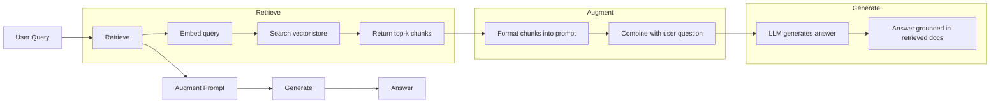
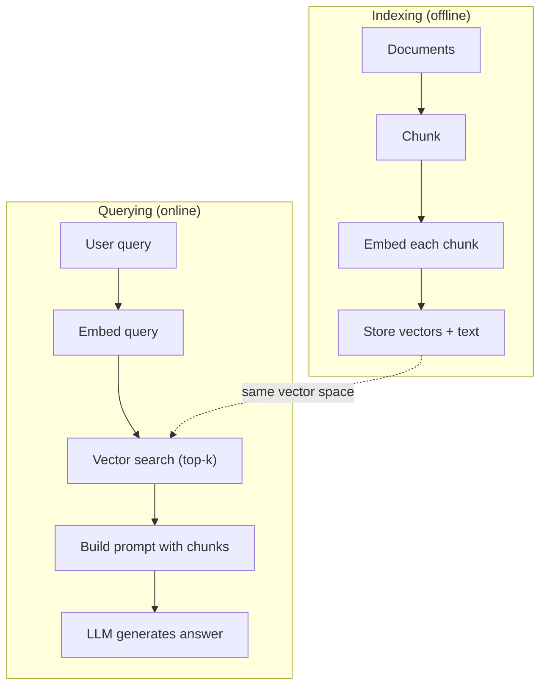

# RAG (Retrieval-Augmented Generation)

> يعرف LLM كل شيء حتى موعد التدريب. فهو لا يعرف شيئًا عن مستندات شركتك أو قاعدة التعليمات البرمجية الخاصة بك أو ملاحظات اجتماع الأسبوع الماضي. RAG يحل هذه المشكلة عن طريق استرداد المستندات ذات الصلة وحشوها في الموجه. إنه النمط الأكثر انتشارًا في الإنتاج AI. إذا قمت ببناء شيء واحد من هذه الدورة، قم ببناء خط RAG pipeline.

**النوع:** بناء
** اللغات: ** بايثون
**المتطلبات:** المرحلة 10 (LLMs من الصفر)، المرحلة 11 الدروس 01-05
**الوقت:** ~90 دقيقة
** ذات صلة: ** المرحلة 5 · 23 (استراتيجيات التقطيع لـ RAG) لخوارزميات التقطيع الستة ومتى يفوز كل منها. المرحلة 5 · 22 (التعمق في نماذج التضمين) لانتقاء أداة التضمين. المرحلة 11 · 07 (متقدم RAG) للبحث المختلط وإعادة الترتيب وتحويل الاستعلام.

## Learning Objectives

- إنشاء خط RAG pip كامل: تحميل المستندات، وتقطيعها، وتضمينها، وتخزين المتجهات، واسترجاعها، وتوليدها
- تنفيذ البحث الدلالي باستخدام قاعدة بيانات متجهة (ChromaDB، FAISS، أو Pinecone) مع الفهرسة المناسبة
- اشرح سبب تفضيل RAG على الضبط الدقيق للتطبيقات القائمة على المعرفة (التكلفة، الحداثة، الإسناد)
- تقييم RAG الجودة باستخدام مقاييس الاسترجاع (الدقة والاستدعاء) ومقاييس التوليد (الإخلاص والملاءمة)

## The Problem

يمكنك بناء chatbot لشركتك. يسأل أحد العملاء "ما هي سياسة استرداد الأموال لخطط المؤسسة؟" يستجيب LLM بإجابة عامة حول سياسات استرداد SaaS النموذجية. تقول السياسة الفعلية، المدفونة في موقع ويكي داخلي مكون من 200 صفحة، إن عملاء المؤسسات يحصلون على نافذة مدتها 60 يومًا مع المبالغ المستردة التناسبية. LLM لم ير هذه الوثيقة من قبل. لا يمكنه معرفة ما لم يتم تدريبه عليه.

الضبط الدقيق هو أحد الحلول. خذ LLM وقم بتدريبه على مستنداتك الداخلية وانشر النموذج المحدث. هذا يعمل ولكن لديه مشاكل خطيرة. الضبط الدقيق يكلف آلاف الدولارات في الحوسبة. يصبح النموذج قديمًا في اللحظة التي يتغير فيها المستند. ليس لديك طريقة لمعرفة المصدر الذي استمد منه النموذج. وإذا استحوذت الشركة على خط إنتاج آخر في الشهر المقبل، فسوف تقوم بضبطه مرة أخرى.

RAG هو الحل الآخر. اترك النموذج دون تغيير. عندما يأتي سؤال، ابحث في مخزن المستندات الخاص بك عن المقاطع ذات الصلة، وألصقها في الموجه قبل السؤال، واترك النموذج يجيب باستخدام تلك المقاطع كسياق. يمكن تحديث مخزن المستندات في دقائق. يمكنك أن ترى بالضبط ما هي الوثائق التي تم استردادها. النموذج نفسه لا يتغير أبدًا. هذا هو السبب في أن RAG هو النمط السائد في الإنتاج: فهو أرخص وأحدث وأكثر قابلية للتدقيق ويعمل مع أي LLM.

## The Concept

### The RAG Pattern

النمط بأكمله يتناسب مع أربع خطوات:



استعلام -> استرداد -> موجه التعزيز -> إنشاء. يتبع كل نظام RAG هذا النمط. تكمن الاختلافات بين أنظمة الإنتاج RAG في تفاصيل كل خطوة: كيفية التقطيع، وكيفية التضمين، وكيفية البحث، وكيفية إنشاء الموجه.

### Why RAG Beats Fine-Tuning

| قلق | ضبط دقيق | RAG |
|---------|----------|-----|
| التكلفة | 1000 دولار - 100000 دولار + لكل دورة تدريبية | 0.01 دولار - 0.10 دولار لكل استعلام (التضمين + LLM) |
| نضارة | لا معنى لها حتى إعادة تدريبها | تم التحديث خلال دقائق عن طريق إعادة فهرسة المستندات |
| قابلية التدقيق | لا يمكن تتبع الإجابة إلى المصدر | يمكن أن تظهر المقاطع المستردة بالضبط |
| هلوسة | لا يزال يهلوس بحرية | ترتكز على الوثائق المستردة |
| خصوصية البيانات | بيانات التدريب المخبوزة في الأوزان | تظل المستندات في متجر المتجهات الخاص بك |

يؤدي الضبط الدقيق إلى تغيير أوزان النموذج بشكل دائم. RAG يغير سياق النموذج مؤقتًا. بالنسبة لمعظم التطبيقات، السياق المؤقت هو ما تريده.

الحالة الوحيدة التي يفوز فيها الضبط الدقيق: عندما تحتاج إلى أن يتبنى النموذج أسلوبًا أو نغمة أو نمطًا منطقيًا محددًا لا يمكن تحقيقه من خلال التحفيز وحده. لاسترجاع المعرفة الواقعية، RAG يفوز في كل مرة.

### Embedding Models

يقوم نموذج التضمين بتحويل النص إلى ناقل كثيف. تنتج النصوص المتشابهة نواقل متقاربة في هذا الفضاء عالي الأبعاد. "كيف يمكنني إعادة تعيين كلمة المرور الخاصة بي؟" و"أحتاج إلى تغيير كلمة المرور الخاصة بي" تنتج متجهات متطابقة تقريبًا على الرغم من مشاركة كلمات قليلة. "جلست القطة على السجادة" تنتج ناقلًا مختلفًا تمامًا.

نماذج التضمين الشائعة (تشكيلة 2026 - راجع المرحلة 5 · 22 للحصول على التحليل الكامل):

| نموذج | الأبعاد | مقدم | ملاحظات |
|-------|---------------|-------|-------|
| تضمين النص-3-صغير | 1536 (ماتريوشكا) | OpenAI | أفضل سعر/أداء لمعظم حالات الاستخدام |
| تضمين النص-3-كبير | 3072 (ماتريوشكا) | OpenAI | دقة أعلى، قابلة للاقتطاع إلى 256/512/1024 |
| تضمين الجوزاء 2 | 3072 (ماتريوشكا) | جوجل | أعلى MTEB استرجاع؛ سياق 8K |
| رحلة-4 | 1024/2048 (ماتريوشكا) | الرحلة AI | متغيرات المجال (الكود، المالية، القانون) |
| كوهير تضمين-V4 | 1024 (ماتريوشكا) | كوهير | سياق قوي متعدد اللغات، 128 كيلو بايت |
| BGE - M3 | 1024 (كثيفة + متفرقة + كولبيرت) | BAAI (الوزن المفتوح) | ثلاث مناظر من نموذج واحد |
| Qwen3-التضمين | 4096 (ماتريوشكا) | علي بابا (الوزن المفتوح) | أعلى نتيجة لاسترجاع الوزن المفتوح |
| الكل-MiniLM-L6-v2 | 384 | الوزن المفتوح (محولات الجملة) | النماذج الأولية |

في هذا الدرس، قمنا ببناء التضمين البسيط الخاص بنا باستخدام TF-IDF. ليس لأن TF-IDF هو ما تستخدمه أنظمة الإنتاج، ولكن لأنه make هو المفهوم الملموس: يدخل النص، ويخرج المتجه، وتنتج النصوص المماثلة نواقل مماثلة.

### Vector Similarity

بالنظر إلى ناقلين، كيف يمكنك قياس التشابه؟ ثلاثة خيارات:

**تشابه جيب التمام**: جيب تمام الزاوية بين متجهين. يتراوح من -1 (المعاكس) إلى 1 (متطابق). يتجاهل الحجم، ويهتم فقط بالاتجاه. هذا هو الإعداد الافتراضي لـ RAG.

```
cosine_sim(a, b) = dot(a, b) / (||a|| * ||b||)
```

**المنتج النقطي**: المنتج الداخلي الخام. تحصل المتجهات الأكبر على درجات أعلى. تكون مفيدة عندما يحمل الحجم معلومات (قد تكون المستندات الأطول أكثر صلة بالموضوع).

```
dot(a, b) = sum(a_i * b_i)
```

**L2 (المسافة الإقليدية)**: مسافة الخط المستقيم في الفضاء المتجه. مسافة أصغر = أكثر تشابها. حساسة لاختلافات الحجم.

```
L2(a, b) = sqrt(sum((a_i - b_i)^2))
```

تشابه جيب التمام هو المعيار. إنه يتعامل مع المستندات ذات الأطوال المختلفة بأمان لأنه يتم تطبيعها من حيث الحجم. عندما يقول شخص ما "البحث عن المتجهات"، فهو يعني دائمًا تشابه جيب التمام.

### Chunking Strategies

المستندات طويلة جدًا بحيث لا يمكن تضمينها كمتجهات فردية. قد تنتج صفحة PDF المكونة من 50 صفحة تضمينًا رهيبًا لأنها تحتوي على عشرات المواضيع. بدلاً من ذلك، يمكنك تقسيم المستندات إلى أجزاء وتضمين كل قطعة على حدة.

**التقطيع ذو الحجم الثابت**: قم بتقسيم كل رموز N. بسيطة ويمكن التنبؤ بها. القطعة المكونة من 512 رمزًا مع تداخل 50 رمزًا تعني أن القطعة 1 هي الرموز المميزة 0-511، والقطعة 2 هي الرموز المميزة 462-973، وهكذا. يضمن التداخل عدم تقسيم الجملة عند حدود غير محظوظة.

**التقطيع الدلالي**: الانقسام عند الحدود الطبيعية. الفقرات أو الأقسام أو رؤوس تخفيض السعر. كل قطعة هي وحدة متماسكة من المعنى. أكثر تعقيدًا في التنفيذ ولكنها تنتج استرجاعًا أفضل.

**التقطيع العودي**: حاول التقسيم عند الحد الأكبر أولاً (رؤوس الأقسام). إذا كان القسم لا يزال كبيرًا جدًا، فقم بتقسيمه عند حدود الفقرة. إذا كانت الفقرة لا تزال كبيرة جدًا، فقم بتقسيمها عند حدود الجملة. هذا هو نهج LangChain RecursiveCharacterTextSplitter وهو يعمل بشكل جيد في الممارسة العملية.

حجم القطعة مهم أكثر مما يعتقده الناس:

- صغير جدًا (64-128 رمزًا): كل جزء يفتقر إلى السياق. "لقد زاد بنسبة 15% في الربع الأخير" لا يعني شيئًا دون معرفة ما تشير إليه كلمة "ذلك".
- كبير جدًا (أكثر من 2048 رمزًا): يغطي كل جزء موضوعات متعددة، مما يقلل من أهميته. عندما تبحث عن بيانات الإيرادات، تحصل على جزء يمثل 10% حول الإيرادات و90% حول عدد الموظفين.
- النقطة المثالية (256-512 رمزًا): سياق كافٍ ليكون قائمًا بذاته، ومركزًا بدرجة كافية ليكون ذا صلة.

تستخدم معظم أنظمة الإنتاج RAG 256-512 قطعة رمزية مع تداخل 50 رمزًا. توصي إرشادات RAG الأنثروبي بهذا النطاق.

### Vector Databases

بمجرد حصولك على التضمينات، ستحتاج إلى مكان لتخزينها والبحث فيها. خيارات:

| قاعدة بيانات | اكتب | الأفضل لـ |
|----------|------|---------|
| FAISS | المكتبة (قيد التنفيذ) | النماذج الأولية، مجموعات البيانات الصغيرة والمتوسطة |
| صفاء | خفيف الوزن DB | التنمية المحلية، عمليات الانتشار الصغيرة |
| كوز الصنوبر | الخدمة المدارة | الإنتاج بدون تكاليف العمليات |
| ويفييت | مفتوح المصدر DB | إنتاج ذاتي الاستضافة |
| بجفيكتور | ملحق بوستجرس | تستخدم بالفعل Postgres |
| قدرانت | مفتوح المصدر DB | استضافة ذاتية عالية الأداء |

في هذا الدرس، قمنا ببناء مخزن ناقل بسيط في الذاكرة. يقوم بتخزين المتجهات في قائمة ويقوم بالبحث عن تشابه جيب التمام بالقوة الغاشمة. وهذا يعادل FAISS بمؤشر مسطح. يمكن أن يصل إلى 100000 متجه قبل أن يصبح بطيئًا. تستخدم أنظمة الإنتاج خوارزميات جار تقريبية (ANN) مثل HNSW للبحث في ملايين المتجهات بالمللي ثانية.

### The Full Pipeline



يتم تشغيل مرحلة الفهرسة مرة واحدة لكل مستند (أو عند تحديث المستندات). يتم تشغيل مرحلة الاستعلام بناءً على كل طلب مستخدم. في مرحلة الإنتاج، قد تعالج الفهرسة ملايين المستندات خلال ساعات. يجب أن يستجيب الاستعلام في أقل من ثانية.

### Real Numbers

تستخدم معظم أنظمة الإنتاج RAG هذه المعلمات:

- **k = 5 إلى 10** القطع المستردة لكل استعلام
- **حجم القطعة = 256 إلى 512 رمزًا** مع تداخل 50 رمزًا
- **ميزانية السياق**: 2500-5000 رمز مميز للمحتوى المسترد لكل استعلام
- **إجمالي المطالبة**: ~8,000-16,000 رمز مميز (موجه النظام + الأجزاء المستردة + سجل المحادثات + استعلام المستخدم)
- **بعد التضمين**: 384-3072 حسب الطراز
- ** إنتاجية الفهرسة **: 100-1000 مستند في الثانية مع تضمينات API
- **زمن استجابة الاستعلام**: 50-200 مللي ثانية للاسترجاع، 500-3000 مللي ثانية للإنشاء

## Build It

### Step 1: Document Chunking

```python
def chunk_text(text, chunk_size=200, overlap=50):
    words = text.split()
    chunks = []
    start = 0
    while start < len(words):
        end = start + chunk_size
        chunk = " ".join(words[start:end])
        chunks.append(chunk)
        start += chunk_size - overlap
    return chunks
```

### Step 2: TF-IDF Embeddings

نحن نبني وظيفة التضمين البسيطة. TF-IDF (تكرار المصطلح - تردد المستند العكسي) ليس تضمينًا عصبيًا، ولكنه يحول النص إلى متجهات بطريقة تلتقط أهمية الكلمة. الكلمات المتكررة في المستند ترتفع TF. الكلمات النادرة عبر المجموعة ترتفع IDF. يوفر المنتج متجهًا حيث تكون الكلمات المهمة والمميزة ذات قيم عالية.

```python
import math
from collections import Counter

def build_vocabulary(documents):
    vocab = set()
    for doc in documents:
        vocab.update(doc.lower().split())
    return sorted(vocab)

def compute_tf(text, vocab):
    words = text.lower().split()
    count = Counter(words)
    total = len(words)
    return [count.get(word, 0) / total for word in vocab]

def compute_idf(documents, vocab):
    n = len(documents)
    idf = []
    for word in vocab:
        doc_count = sum(1 for doc in documents if word in doc.lower().split())
        idf.append(math.log((n + 1) / (doc_count + 1)) + 1)
    return idf

def tfidf_embed(text, vocab, idf):
    tf = compute_tf(text, vocab)
    return [t * i for t, i in zip(tf, idf)]
```

### Step 3: Cosine Similarity Search

```python
def cosine_similarity(a, b):
    dot = sum(x * y for x, y in zip(a, b))
    norm_a = math.sqrt(sum(x * x for x in a))
    norm_b = math.sqrt(sum(x * x for x in b))
    if norm_a == 0 or norm_b == 0:
        return 0.0
    return dot / (norm_a * norm_b)

def search(query_embedding, stored_embeddings, top_k=5):
    scores = []
    for i, emb in enumerate(stored_embeddings):
        sim = cosine_similarity(query_embedding, emb)
        scores.append((i, sim))
    scores.sort(key=lambda x: x[1], reverse=True)
    return scores[:top_k]
```

### Step 4: Prompt Construction

هذا هو المكان الذي يحدث فيه "المعزز" في RAG. خذ الأجزاء المستردة، وقم بتنسيقها في رسالة، واطلب من LLM الإجابة بناءً على السياق المقدم.

```python
def build_rag_prompt(query, retrieved_chunks):
    context = "\n\n---\n\n".join(
        f"[Source {i+1}]\n{chunk}"
        for i, chunk in enumerate(retrieved_chunks)
    )
    return f"""Answer the question based ONLY on the following context.
If the context doesn't contain enough information, say "I don't have enough information to answer that."

Context:
{context}

Question: {query}

Answer:"""
```

### Step 5: The Complete RAG Pipeline

```python
class RAGPipeline:
    def __init__(self):
        self.chunks = []
        self.embeddings = []
        self.vocab = []
        self.idf = []

    def index(self, documents):
        all_chunks = []
        for doc in documents:
            all_chunks.extend(chunk_text(doc))
        self.chunks = all_chunks
        self.vocab = build_vocabulary(all_chunks)
        self.idf = compute_idf(all_chunks, self.vocab)
        self.embeddings = [
            tfidf_embed(chunk, self.vocab, self.idf)
            for chunk in all_chunks
        ]

    def query(self, question, top_k=5):
        query_emb = tfidf_embed(question, self.vocab, self.idf)
        results = search(query_emb, self.embeddings, top_k)
        retrieved = [(self.chunks[i], score) for i, score in results]
        prompt = build_rag_prompt(
            question, [chunk for chunk, _ in retrieved]
        )
        return prompt, retrieved
```

### Step 6: Generation (simulated)

في الإنتاج، هذا هو المكان الذي تسميه LLM API. في هذا الدرس، نقوم بمحاكاة عملية التوليد عن طريق استخراج الجملة الأكثر صلة من السياق المسترجع.

```python
def simple_generate(prompt, retrieved_chunks):
    query_words = set(prompt.lower().split("question:")[-1].split())
    best_sentence = ""
    best_score = 0
    for chunk in retrieved_chunks:
        for sentence in chunk.split("."):
            sentence = sentence.strip()
            if not sentence:
                continue
            words = set(sentence.lower().split())
            overlap = len(query_words & words)
            if overlap > best_score:
                best_score = overlap
                best_sentence = sentence
    return best_sentence if best_sentence else "I don't have enough information."
```

## Use It

مع نموذج التضمين الحقيقي وLLM، بالكاد يتغير الكود:

```python
from openai import OpenAI

client = OpenAI()

def embed(text):
    response = client.embeddings.create(
        model="text-embedding-3-small",
        input=text
    )
    return response.data[0].embedding

def generate(prompt):
    response = client.chat.completions.create(
        model="gpt-4o-mini",
        messages=[{"role": "user", "content": prompt}],
        temperature=0
    )
    return response.choices[0].message.content
```

أو مع الأنثروبي:

```python
import anthropic

client = anthropic.Anthropic()

def generate(prompt):
    response = client.messages.create(
        model="claude-sonnet-4-20250514",
        max_tokens=1024,
        messages=[{"role": "user", "content": prompt}]
    )
    return response.content[0].text
```

الخط pip هو نفسه. تبديل وظيفة التضمين. تبديل وظيفة التوليد. منطق الاسترجاع، والتقطيع، والبناء السريع - كلها متطابقة بغض النظر عن النماذج التي تستخدمها.

لتخزين المتجهات على نطاق واسع، استبدل البحث الغاشم بقاعدة بيانات المتجهات المناسبة:

```python
import chromadb

client = chromadb.Client()
collection = client.create_collection("my_docs")

collection.add(
    documents=chunks,
    ids=[f"chunk_{i}" for i in range(len(chunks))]
)

results = collection.query(
    query_texts=["What is the refund policy?"],
    n_results=5
)
```

يتعامل Chroma مع التضمين داخليًا (يستخدم all-MiniLM-L6-v2 افتراضيًا) ويخزن المتجهات في قاعدة بيانات محلية. نفس النمط، والسباكة مختلفة.

## Ship It

ينتج هذا الدرس:
- `outputs/prompt-rag-architect.md` -- مطالبة بتصميم أنظمة RAG لحالات استخدام محددة
- `outputs/skill-rag-pipelineeline.md` -- مهارة تعلم الوكلاء كيفية إنشاء الخطوط وتصحيحها RAG pipelines

## Exercises

1. استبدل التضمينات TF-IDF بأسلوب بسيط من الكلمات (ثنائي: 1 إذا كانت الكلمة موجودة، 0 إذا لم تكن موجودة). مقارنة جودة الاسترجاع في نماذج المستندات. TF-IDF يجب أن يتفوق لأنه يزن الكلمات النادرة أعلى.

2. قم بتجربة أحجام المقاطع: جرب 50 و100 و200 و500 كلمة في نفس مجموعة المستندات. بالنسبة لكل حجم، قم بتشغيل نفس الاستعلامات الخمسة واحسب عدد العناصر التي تُرجع قطعة ذات صلة في أعلى 3. ابحث عن المكان المناسب حيث تبلغ جودة الاسترجاع ذروتها.

3. قم بإضافة البيانات الوصفية إلى كل قطعة (اسم المستند المصدر، موضع القطعة). قم بتعديل قالب المطالبة ليشمل إسناد المصدر بحيث يستشهد LLM بمصادره.

4. قم بتنفيذ تقييم بسيط: في حالة وجود 10 أزواج من الأسئلة والإجابات، قم بتشغيل كل سؤال عبر الخط RAG pip، وقياس النسبة المئوية للأجزاء المستردة التي تحتوي على الإجابة. هذا هو استدعاء الاسترجاع عند k.

5. أنشئ محادثة مدركة RAG pipeline: احتفظ بسجل لآخر 3 تبادلات وقم بإدراجها في الموجه جنبًا إلى جنب مع القطع المستردة. اختبر باستخدام أسئلة المتابعة مثل "ماذا عن المؤسسة؟" بعد السؤال عن الأسعار.

## Key Terms

| مصطلح | ماذا يقول الناس | ماذا يعني في الواقع |
|------|----------------|----------------------|
| RAG | "AI الذي يقرأ مستنداتك" | استرجع المستندات ذات الصلة، والصقها في الموجه، ثم قم بإنشاء إجابة ترتكز على تلك المستندات |
| التضمين | "تحويل النص إلى أرقام" | تمثيل متجه كثيف للنص حيث تنتج المعاني المتشابهة ناقلات مماثلة |
| قاعدة بيانات المتجهات | "محرك البحث عن AI" | مخزن بيانات محسّن لتخزين المتجهات والعثور على أقرب الجيران عن طريق التشابه |
| التقطيع | "تقسيم المستندات إلى أجزاء" | تقسيم المستندات إلى أجزاء أصغر (عادةً 256-512 رمزًا) بحيث يمكن تضمين كل منها واسترجاعها بشكل مستقل |
| تشابه جيب التمام | "ما مدى تشابه المتجهين" | جيب تمام الزاوية بين متجهين؛ 1 = اتجاه متطابق، 0 = متعامد، -1 = معاكس |
| استرجاع توب-ك | "احصل على أفضل التطابقات" | قم بإرجاع القطع k الأكثر تشابهًا للاستعلام من متجر المتجهات |
| نافذة السياق | "ما مقدار النص الذي يمكن لـ LLM رؤيته" | الحد الأقصى لعدد الرموز المميزة التي يمكن لـ LLM معالجتها في طلب واحد؛ يجب أن تتناسب القطع المستردة مع هذا |
| الجيل المعزز | "الإجابة باستخدام سياق معين" | إنشاء استجابة باستخدام المستندات المستردة كسياق بدلاً من الاعتماد فقط على المعرفة المدربة |
| TF-IDF | "تسجيل أهمية الكلمات" | مدة التكرار مرات تكرار المستند العكسي؛ أوزان الكلمات بمدى تميزها داخل المجموعة |
| الفهرسة | "تحضير المستندات للبحث" | العملية غير المتصلة بالإنترنت لتقطيع المستندات وتضمينها وتخزينها حتى يمكن البحث عنها في وقت الاستعلام |

## Further Reading

- لويس وآخرون، "جيل الاسترجاع المعزز لمهام NLP كثيفة المعرفة" (2020) - ورقة RAG الأصلية من فيسبوك AI البحث الذي أضفى طابعًا رسميًا على نمط الاسترجاع ثم الإنشاء
- وثائق Anthropic's RAG (docs.anthropic.com) - إرشادات عملية لأحجام القطع والبناء الفوري والتقييم
- مركز تعلم كوز الصنوبر، "ما هو RAG؟" - تفسيرات مرئية واضحة للخط RAG pip مع اعتبارات الإنتاج
- الجملة-BERT: Reimers & Gurevych (2019) - الورقة البحثية وراء نماذج تضمين MiniLM بالكامل، والتي توضح كيفية تدريب أجهزة التشفير الثنائية على التشابه الدلالي
- [Karpukhin et al.، "استرجاع الممر الكثيف للإجابة على أسئلة المجال المفتوح" (EMNLP 2020)](https://arxiv.org/abs/2004.04906) - ورقة DPR التي أثبتت أن استرجاع التشفير الثنائي الكثيف يتفوق على BM25 على المجال المفتوح QA وتعيين النمط لـ RAG الحديث المستردون.
- [مفاهيم LlamaIndex عالية المستوى](https://docs.llamaindex.ai/en/stable/getting_started/concepts.html) - المفاهيم الرئيسية التي يجب معرفتها عند إنشاء خطوط RAG pip: أدوات تحميل البيانات، وموزعات node، والمؤشرات، والمستردون، ومُركبات الاستجابة.
- [LangChain RAG البرنامج التعليمي](https://python.langchain.com/docs/tutorials/rag/) - منسق النكهة المعاكسة؛ عرض سلسلة من العناصر القابلة للتشغيل لنفس نمط الاسترداد ثم الإنشاء.
