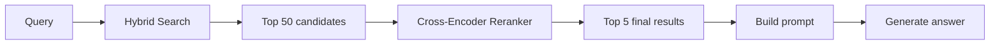
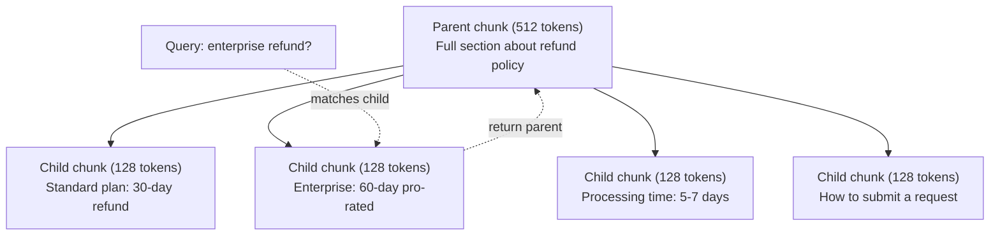
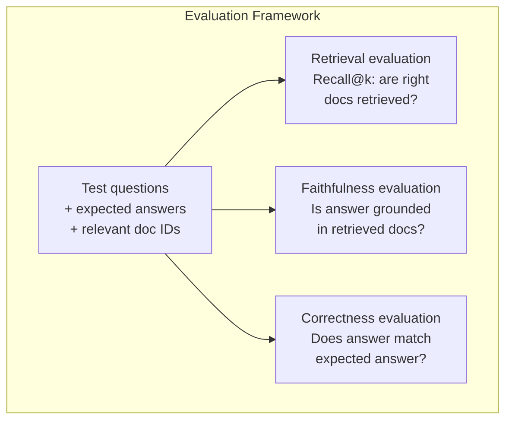

# متقدم RAG (التقطيع، إعادة الترتيب، البحث المختلط)
> يسترد RAG الأساسي الأجزاء الأكثر تشابهًا. هذا يعمل على الأسئلة البسيطة. إنه ينهار بسبب التفكير متعدد القفزات والاستعلامات الغامضة والمجموعات الكبيرة. المتقدم RAG هو الفرق بين العرض التوضيحي الذي يعمل على 10 مستندات والنظام الذي يعمل على 10 ملايين.
**النوع:** بناء
** اللغات: ** بايثون
**المتطلبات الأساسية:** المرحلة 11، الدرس 06 (RAG)
**الوقت:** ~90 دقيقة
** ذات صلة: ** المرحلة 5 · 23 (استراتيجيات التقطيع لـ RAG) تغطي جميع خوارزميات التقطيع الستة - العودية، والدلالية، والجملة، والوثيقة الأصلية، والتقطيع المتأخر، والاسترجاع السياقي - مع معايير Vectara/Anthropic. يرتكز هذا الدرس على ما يلي: البحث المختلط، وإعادة الترتيب، وتحويل الاستعلام.
## أهداف التعلم
- تنفيذ استراتيجيات القطع المتقدمة (الدلالية، العودية، الأصل والطفل) التي تحافظ على بنية الوثيقة وسياقها
- أنشئ بحثًا مختلطًا pipeline يجمع بين BM25 مطابقة الكلمات الرئيسية مع البحث الدلالي المتجه وإعادة الترتيب عبر التشفير
- تطبيق تقنيات تحويل الاستعلام (HyDE، الاستعلام المتعدد، خطوة إلى الوراء) لتحسين استرجاع الأسئلة الغامضة أو المعقدة
- تشخيص وإصلاح حالات فشل RAG الشائعة: تم استرداد جزء خاطئ، والإجابة ليست في السياق، وانهيار المنطق متعدد القفزات
## المشكلة
لقد قمت بإنشاء سطر RAG pipe أساسي في الدرس 06. وهو مناسب للأسئلة المباشرة في مجموعة صغيرة. الآن جرب هذه:
**استعلام غامض**: "ما هي الإيرادات في الربع الأخير؟" يُرجع البحث الدلالي أجزاءً حول إستراتيجية الإيرادات، وتوقعات الإيرادات، وأفكار CFO حول نمو الإيرادات. جميعها تشبه لغويا كلمة "الإيرادات". لا شيء يحتوي على الرقم الفعلي. الجزء الصحيح يقول "47.2 مليون دولار في Q3 2025" ولكنه يستخدم كلمة "الأرباح" بدلاً من "الإيرادات". يعتقد نموذج التضمين أن "استراتيجية الإيرادات" أقرب إلى الاستعلام من "Q3 الأرباح كانت 47.2 مليون دولار أمريكي."
**سؤال متعدد القفزات**: "ما الفريق الذي حقق أعلى تحسن في درجة رضا العملاء؟" ويتطلب ذلك إيجاد درجات الرضا لكل فريق ومقارنتها وتحديد الحد الأقصى. لا يوجد جزء واحد يحتوي على الجواب. المعلومات متناثرة عبر تقارير الفريق.
**مشكلة كبيرة في المجموعة**: لديك 2 مليون قطعة. الإجابة الصحيحة في القطعة رقم 1,847,293. تسحب عمليات الاسترجاع الخمسة الأولى لديك الأجزاء رقم 14 و#89,201 و#1,200,000 و#44 و#901,333. إغلاق في مساحة التضمين، ولكن لا شيء يحتوي على الإجابة. على هذا المقياس، يقدم البحث التقريبي لأقرب جار خطأً كافيًا يؤدي إلى دفع النتائج ذات الصلة خارج أعلى k.
يفشل RAG الأساسي لأن تشابه المتجهات ليس هو نفس الملاءمة. يمكن أن تكون القطعة مشابهة لغويًا للاستعلام دون أن تكون مفيدة للإجابة عليه. يعالج RAG المتقدم هذا الأمر من خلال أربع تقنيات: البحث المختلط (إضافة مطابقة للكلمات الرئيسية)، وإعادة الترتيب (تسجيل المرشحين بعناية أكبر)، وتحويل الاستعلام (إصلاح الاستعلام قبل البحث)، والتقطيع بشكل أفضل (الاسترجاع بالدقة الصحيحة).
##المفهوم
### البحث المختلط: الدلالي + الكلمة الرئيسية
البحث الدلالي (تشابه المتجهات) جيد في فهم المعنى. "كيف يمكنني إلغاء اشتراكي؟" يتطابق مع "خطوات إنهاء خطتك" على الرغم من عدم مشاركة أي كلمات. لكنه يفتقد التطابقات الدقيقة. قد لا يتطابق "رمز الخطأ E-4021" مع القطعة التي تحتوي على "E-4021" إذا كان نموذج التضمين يعاملها على أنها ضوضاء.
البحث عن الكلمات الرئيسية (BM25) هو العكس. إنه يتفوق في التطابقات الدقيقة. "E-4021" يتطابق تمامًا. لكن "إلغاء اشتراكي" لا يُرجع أي نتائج إذا كان المستند ينص على "إنهاء خطتك".
يقوم البحث المختلط بتشغيل كليهما، ثم يدمج النتائج.
**BM25** (أفضل 25 مطابقة) هي خوارزمية البحث عن الكلمات الرئيسية القياسية. لقد كان العمود الفقري لمحركات البحث منذ التسعينيات. الصيغة:
```
BM25(q, d) = sum over terms t in q:
    IDF(t) * (tf(t,d) * (k1 + 1)) / (tf(t,d) + k1 * (1 - b + b * |d| / avgdl))
```

حيث tf(t,d) هو تكرار المصطلح t في الوثيقة d، IDF(t) هو تكرار الوثيقة العكسي، |d| هو طول المستند، وavgdl هو متوسط ​​طول المستند، ويتحكم k1 في تشبع تردد المصطلح (الافتراضي 1.2)، ويتحكم b في تسوية الطول (الافتراضي 0.75).
بعبارات واضحة: BM25 يسجل نقاطًا أعلى للمستندات عندما تحتوي على مصطلحات استعلام (خاصة تلك النادرة)، ولكن مع انخفاض العائدات للمصطلحات المتكررة. إن الوثيقة التي تحتوي على كلمة "إيرادات" 50 مرة ليست أكثر صلة بـ 50 مرة من تلك التي تحتوي عليها مرة واحدة.
### دمج الرتب المتبادلة (RRF)
لديك قائمتان مرتبة: واحدة من البحث المتجه، وواحدة من BM25. كيف يمكنك الجمع بينهما؟ إن دمج الرتبة المتبادلة هو النهج القياسي.
```
RRF_score(d) = sum over rankings R:
    1 / (k + rank_R(d))
```

حيث k هو ثابت (عادةً 60) يمنع النتيجة ذات الترتيب الأعلى من السيطرة.
الوثيقة التي تحتل المرتبة الأولى في البحث المتجه والمرتبة الخامسة في BM25 تحصل على: 1/(60+1) + 1/(60+5) = 0.0164 + 0.0154 = 0.0318
الوثيقة المصنفة رقم 3 في البحث المتجه والمرتبة 2 في BM25 تحصل على: 1/(60+3) + 1/(60+2) = 0.0159 + 0.0161 = 0.0320
RRF يوازن بين الإشارتين بشكل طبيعي. يحصل المستند الذي يحتل مرتبة عالية في كلتا القائمتين على أفضل الدرجات. الوثيقة التي تحتل المرتبة الأولى في قائمة واحدة ولكنها غائبة عن القائمة الأخرى تحصل على درجة متوسطة. وهذا أمر قوي لأنه يستخدم الرتب، وليس الدرجات الأولية، لذلك لا يهم الاختلافات في توزيع الدرجات بين النظامين.
### إعادة الترتيب
يعد الاسترجاع (سواء كان متجهًا أو كلمة رئيسية أو مختلطًا) سريعًا ولكنه غير دقيق. ويستخدم برامج ترميز ثنائية: يتم تضمين الاستعلام وكل مستند بشكل مستقل، ثم تتم مقارنتهما. يتم حساب التضمينات مرة واحدة وتخزينها مؤقتًا. هذا يتسع لملايين المستندات.
تستخدم إعادة الترتيب برامج تشفير متقاطعة: يتم تغذية الاستعلام والمستند المرشح معًا في نموذج يُخرج درجة الصلة. يرى النموذج كلا النصين في وقت واحد ويمكنه التقاط التفاعلات الدقيقة بينهما. يمكن أن يفهم برنامج التشفير المشترك أن "ما هي أرباح Q3؟" يرتبط ارتباطًا وثيقًا بالقطعة التي تحتوي على "47.2 مليون دولار في Q3" حتى لو فاتك جهاز التشفير الثنائي الاتصال.
المقايضة: تكون أجهزة التشفير المتقاطعة أبطأ بمقدار 100 إلى 1000 مرة من أجهزة التشفير الثنائية لأنها تقوم بمعالجة زوج مستند الاستعلام بشكل مشترك. لا يمكنك إجراء حساب مسبق لدرجات التشفير المتبادل لمليون مستند. الحل: استرداد مجموعة مرشحة أكبر (أفضل 50 مجموعة من البحث المختلط)، ثم إعادة التصنيف باستخدام برنامج تشفير مشترك للحصول على أفضل 5 مرشحين نهائيين.


نماذج إعادة الترتيب الشائعة (تشكيلة 2026):
- Cohere Rerank 3.5: مُدار API، متعدد اللغات، أفضل مكسب للاستدعاء في النصوص المختلطة
- إعادة ترتيب Voyage-2.5: تمت إدارة API، أقل زمن استجابة للخيارات المستضافة
- Jina-Reranker-v2 متعدد اللغات: مفتوح الوزن، أكثر من 100 لغة
- bge-reranker-v2-m3: وزن مفتوح، خط أساس قوي
- التشفير المتقاطع/ms-marco-MiniLM-L-6-v2: مفتوح الوزن، ويعمل على CPU للنماذج الأولية
- ColBERTv2 / Jina-ColBERT-v2: أدوات إعادة ترتيب متعددة المتجهات للتفاعل المتأخر - O(الرموز المميزة) وليس O(docs) في وقت التسجيل
### تحويل الاستعلام
في بعض الأحيان لا تكمن المشكلة في الاسترجاع، بل في الاستعلام نفسه. "ما هو هذا الشيء المتعلق بتغيير السياسة الجديد؟" هو استعلام بحث رهيب. ولا تحتوي على مصطلحات محددة. التضمين غامض. لا يمكن لأي نظام استرجاع العثور على المستندات الصحيحة من هذا.
**إعادة كتابة الاستعلام**: إعادة صياغة استعلام المستخدم وتحويله إلى استعلام بحث أفضل. يمكن لـ LLM القيام بذلك:
```
User: "What was that thing about the new policy change?"
Rewritten: "Recent policy changes and updates"
```

**HyDE (تضمين المستندات الافتراضية)**: بدلاً من البحث باستخدام الاستعلام، قم بإنشاء إجابة افتراضية، وقم بتضمينها، وابحث عن مستندات حقيقية مماثلة.
```
Query: "What is the refund policy for enterprise?"
Hypothetical answer: "Enterprise customers are eligible for a full refund
within 60 days of purchase. Refunds are pro-rated based on the remaining
subscription period and processed within 5-7 business days."
```

قم بتضمين الإجابة الافتراضية وابحث عن مستندات حقيقية مشابهة لها. الحدس: الإجابة الافتراضية تعيش في مكان أقرب إلى الإجابة الحقيقية من السؤال الأصلي. الأسئلة والأجوبة لها هياكل لغوية مختلفة. من خلال توليد إجابة افتراضية، يمكنك سد الفجوة بين "مساحة السؤال" و"مساحة الإجابة" في التضمين.
تقوم HyDE بإضافة مكالمة LLM واحدة قبل استرجاعها. يؤدي هذا إلى زيادة زمن الوصول بمقدار 500-2000 مللي ثانية. يستحق كل هذا العناء عندما تكون جودة الاسترجاع سيئة في الاستعلامات الأولية.
### تقسيم الوالدين والطفل
يفرض التقسيم القياسي مقايضة: أجزاء صغيرة من أجل استرجاع دقيق، وأجزاء كبيرة من أجل سياق كافٍ. يؤدي تقطيع الوالدين والطفل إلى القضاء على هذه المقايضة.
فهرسة القطع الصغيرة (128 رمزًا) لاسترجاعها. عند استرداد قطعة صغيرة، قم بإرجاع القطعة الأصلية (512 رمزًا) للموجه. القطعة الصغيرة تطابق الاستعلام بدقة. توفر القطعة الأصلية سياقًا كافيًا لـ LLM لإنشاء إجابة جيدة.


الاستعلام "استرداد المؤسسة؟" يتطابق مع القطعة الفرعية C2 بدقة. لكن الموجه يتلقى الجزء الأصلي الكامل P، والذي يتضمن السياق المحيط حول وقت المعالجة وعملية الإرسال.
### تصفية البيانات الوصفية
قبل تشغيل بحث المتجهات، قم بتصفية المجموعة حسب البيانات الوصفية: التاريخ، المصدر، الفئة، المؤلف، اللغة. وهذا يقلل من مساحة البحث ويمنع النتائج غير ذات الصلة.
"ما الذي تغير في السياسة الأمنية الشهر الماضي؟" يجب أن يبحث فقط في المستندات من آخر 30 يومًا في فئة الأمان. بدون تصفية البيانات التعريفية، يمكنك البحث في المجموعة بأكملها وقد تسترد مستندًا أمنيًا عمره عامين ويصادف أنه متشابه من حيث الدلالة.
تقوم أنظمة الإنتاج RAG بتخزين البيانات الوصفية بجانب كل جزء: المستند المصدر، تاريخ الإنشاء، الفئة، المؤلف، الإصدار. تدعم قواعد بيانات المتجهات التصفية المسبقة بواسطة البيانات التعريفية قبل البحث عن التشابه، وهو أمر بالغ الأهمية للأداء على نطاق واسع.
### تقييم
لقد قمت ببناء نظام RAG. كيف تعرف إذا كان يعمل؟ ثلاثة مقاييس:
**ملاءمة الاسترجاع (Recall@k)**: بالنسبة لمجموعة من أسئلة الاختبار ذات المستندات المعروفة ذات الصلة، ما هي النسبة المئوية للمستندات ذات الصلة التي تظهر في نتائج Top-K؟ إذا كانت إجابة السؤال موجودة في المجموعة رقم 47، فهل تظهر المجموعة رقم 47 في أعلى 5؟
**الإخلاص**: هل ترتكز الإجابة التي تم إنشاؤها على المستندات المستردة؟ إذا كانت القطع المستردة تقول "نافذة استرداد لمدة 60 يومًا" وكان النموذج يقول "نافذة استرداد لمدة 90 يومًا"، فهذا يعد فشلًا في الإخلاص. النموذج مصاب بالهلوسة على الرغم من وجود السياق الصحيح.
** صحة الإجابة **: هل الإجابة الناتجة مطابقة للإجابة المتوقعة؟ هذا هو المقياس الشامل. فهو يجمع بين جودة الاسترجاع وجودة التوليد.
فحص بسيط للصدق: خذ كل مطالبة في الإجابة التي تم إنشاؤها وتحقق من ظهورها (من حيث الجوهر) في الأجزاء المستردة. إذا كانت الإجابة تحتوي على حقيقة غير موجودة في أي جزء تم استرجاعه، فمن المحتمل أن تكون هلوسة.


## بنائها
### الخطوة 1: BM25 التنفيذ
```python
import math
from collections import Counter

class BM25:
    def __init__(self, k1=1.2, b=0.75):
        self.k1 = k1
        self.b = b
        self.docs = []
        self.doc_lengths = []
        self.avg_dl = 0
        self.doc_freqs = {}
        self.n_docs = 0

    def index(self, documents):
        self.docs = documents
        self.n_docs = len(documents)
        self.doc_lengths = []
        self.doc_freqs = {}

        for doc in documents:
            words = doc.lower().split()
            self.doc_lengths.append(len(words))
            unique_words = set(words)
            for word in unique_words:
                self.doc_freqs[word] = self.doc_freqs.get(word, 0) + 1

        self.avg_dl = sum(self.doc_lengths) / self.n_docs if self.n_docs else 1

    def score(self, query, doc_idx):
        query_words = query.lower().split()
        doc_words = self.docs[doc_idx].lower().split()
        doc_len = self.doc_lengths[doc_idx]
        word_counts = Counter(doc_words)
        score = 0.0

        for term in query_words:
            if term not in word_counts:
                continue
            tf = word_counts[term]
            df = self.doc_freqs.get(term, 0)
            idf = math.log((self.n_docs - df + 0.5) / (df + 0.5) + 1)
            numerator = tf * (self.k1 + 1)
            denominator = tf + self.k1 * (1 - self.b + self.b * doc_len / self.avg_dl)
            score += idf * numerator / denominator

        return score

    def search(self, query, top_k=10):
        scores = [(i, self.score(query, i)) for i in range(self.n_docs)]
        scores.sort(key=lambda x: x[1], reverse=True)
        return scores[:top_k]
```

### الخطوة 2: دمج الرتب المتبادلة
```python
def reciprocal_rank_fusion(ranked_lists, k=60):
    scores = {}
    for ranked_list in ranked_lists:
        for rank, (doc_id, _) in enumerate(ranked_list):
            if doc_id not in scores:
                scores[doc_id] = 0.0
            scores[doc_id] += 1.0 / (k + rank + 1)
    fused = sorted(scores.items(), key=lambda x: x[1], reverse=True)
    return fused
```

### الخطوة 3: مسار البحث المختلط
```python
def hybrid_search(query, chunks, vector_embeddings, vocab, idf, bm25_index, top_k=5, fusion_k=60):
    query_emb = tfidf_embed(query, vocab, idf)
    vector_results = search(query_emb, vector_embeddings, top_k=top_k * 3)
    bm25_results = bm25_index.search(query, top_k=top_k * 3)
    fused = reciprocal_rank_fusion([vector_results, bm25_results], k=fusion_k)
    return fused[:top_k]
```

### الخطوة 4: إعادة الترتيب البسيطة
في الإنتاج، يمكنك استخدام نموذج التشفير المتقاطع. نحن هنا نبني أداة إعادة ترتيب تسجل مدى صلة مستند الاستعلام باستخدام تداخل الكلمات وأهمية المصطلح ومطابقة العبارة.
```python
def rerank(query, candidates, chunks):
    query_words = set(query.lower().split())
    stop_words = {"the", "a", "an", "is", "are", "was", "were", "what", "how",
                  "why", "when", "where", "do", "does", "for", "of", "in", "to",
                  "and", "or", "on", "at", "by", "it", "its", "this", "that",
                  "with", "from", "be", "has", "have", "had", "not", "but"}
    query_terms = query_words - stop_words

    scored = []
    for doc_id, initial_score in candidates:
        chunk = chunks[doc_id].lower()
        chunk_words = set(chunk.split())

        term_overlap = len(query_terms & chunk_words)

        query_bigrams = set()
        q_list = [w for w in query.lower().split() if w not in stop_words]
        for i in range(len(q_list) - 1):
            query_bigrams.add(q_list[i] + " " + q_list[i + 1])
        bigram_matches = sum(1 for bg in query_bigrams if bg in chunk)

        position_boost = 0
        for term in query_terms:
            pos = chunk.find(term)
            if pos != -1 and pos < len(chunk) // 3:
                position_boost += 0.5

        rerank_score = (
            term_overlap * 1.0
            + bigram_matches * 2.0
            + position_boost
            + initial_score * 5.0
        )
        scored.append((doc_id, rerank_score))

    scored.sort(key=lambda x: x[1], reverse=True)
    return scored
```

### الخطوة 5: HyDE (تضمين المستندات الافتراضية)
```python
def hyde_generate_hypothesis(query):
    templates = {
        "what": "The answer to '{query}' is as follows: Based on our documentation, {topic} involves specific policies and procedures that define how the process works.",
        "how": "To address '{query}': The process involves several steps. First, you need to initiate the request. Then, the system processes it according to the defined rules.",
        "default": "Regarding '{query}': Our records indicate specific details and policies related to this topic that provide a comprehensive answer."
    }
    query_lower = query.lower()
    if query_lower.startswith("what"):
        template = templates["what"]
    elif query_lower.startswith("how"):
        template = templates["how"]
    else:
        template = templates["default"]

    topic_words = [w for w in query.lower().split()
                   if w not in {"what", "is", "the", "how", "do", "does", "a", "an",
                                "for", "of", "to", "in", "on", "at", "by", "and", "or"}]
    topic = " ".join(topic_words) if topic_words else "this topic"

    return template.format(query=query, topic=topic)


def hyde_search(query, chunks, vector_embeddings, vocab, idf, top_k=5):
    hypothesis = hyde_generate_hypothesis(query)
    hypothesis_emb = tfidf_embed(hypothesis, vocab, idf)
    results = search(hypothesis_emb, vector_embeddings, top_k)
    return results, hypothesis
```

### الخطوة 6: تقسيم الوالدين والطفل
```python
def create_parent_child_chunks(text, parent_size=200, child_size=50):
    words = text.split()
    parents = []
    children = []
    child_to_parent = {}

    parent_idx = 0
    start = 0
    while start < len(words):
        parent_end = min(start + parent_size, len(words))
        parent_text = " ".join(words[start:parent_end])
        parents.append(parent_text)

        child_start = start
        while child_start < parent_end:
            child_end = min(child_start + child_size, parent_end)
            child_text = " ".join(words[child_start:child_end])
            child_idx = len(children)
            children.append(child_text)
            child_to_parent[child_idx] = parent_idx
            child_start += child_size

        parent_idx += 1
        start += parent_size

    return parents, children, child_to_parent
```

### الخطوة 7: تقييم الإخلاص
```python
def evaluate_faithfulness(answer, retrieved_chunks):
    answer_sentences = [s.strip() for s in answer.split(".") if len(s.strip()) > 10]
    if not answer_sentences:
        return 1.0, []

    grounded = 0
    ungrounded = []
    context = " ".join(retrieved_chunks).lower()

    for sentence in answer_sentences:
        words = set(sentence.lower().split())
        stop_words = {"the", "a", "an", "is", "are", "was", "were", "and", "or",
                      "to", "of", "in", "for", "on", "at", "by", "it", "this", "that"}
        content_words = words - stop_words
        if not content_words:
            grounded += 1
            continue

        matched = sum(1 for w in content_words if w in context)
        ratio = matched / len(content_words) if content_words else 0

        if ratio >= 0.5:
            grounded += 1
        else:
            ungrounded.append(sentence)

    score = grounded / len(answer_sentences) if answer_sentences else 1.0
    return score, ungrounded


def evaluate_retrieval_recall(queries_with_relevant, retrieval_fn, k=5):
    total_recall = 0.0
    results = []

    for query, relevant_indices in queries_with_relevant:
        retrieved = retrieval_fn(query, k)
        retrieved_indices = set(idx for idx, _ in retrieved)
        relevant_set = set(relevant_indices)
        hits = len(retrieved_indices & relevant_set)
        recall = hits / len(relevant_set) if relevant_set else 1.0
        total_recall += recall
        results.append({
            "query": query,
            "recall": recall,
            "hits": hits,
            "total_relevant": len(relevant_set)
        })

    avg_recall = total_recall / len(queries_with_relevant) if queries_with_relevant else 0
    return avg_recall, results
```

## استخدمه
مع التشفير المتقاطع الحقيقي لإعادة الترتيب:
```python
from sentence_transformers import CrossEncoder

reranker = CrossEncoder("cross-encoder/ms-marco-MiniLM-L-6-v2")

def rerank_with_cross_encoder(query, candidates, chunks, top_k=5):
    pairs = [(query, chunks[doc_id]) for doc_id, _ in candidates]
    scores = reranker.predict(pairs)
    scored = list(zip([doc_id for doc_id, _ in candidates], scores))
    scored.sort(key=lambda x: x[1], reverse=True)
    return scored[:top_k]
```

مع أداة إعادة الترتيب المُدارة من Cohere:
```python
import cohere

co = cohere.Client()

def rerank_with_cohere(query, candidates, chunks, top_k=5):
    docs = [chunks[doc_id] for doc_id, _ in candidates]
    response = co.rerank(
        model="rerank-english-v3.0",
        query=query,
        documents=docs,
        top_n=top_k
    )
    return [(candidates[r.index][0], r.relevance_score) for r in response.results]
```

بالنسبة إلى HyDE مع LLM حقيقي:
```python
import anthropic

client = anthropic.Anthropic()

def hyde_with_llm(query):
    response = client.messages.create(
        model="claude-sonnet-4-20250514",
        max_tokens=256,
        messages=[{
            "role": "user",
            "content": f"Write a short paragraph that would be a good answer to this question. Do not say you don't know. Just write what the answer would look like.\n\nQuestion: {query}"
        }]
    )
    return response.content[0].text
```

للبحث المختلط عن الإنتاج باستخدام Weaviate:
```python
import weaviate

client = weaviate.connect_to_local()

collection = client.collections.get("Documents")
response = collection.query.hybrid(
    query="enterprise refund policy",
    alpha=0.5,
    limit=10
)
```

تتحكم معلمة ألفا في التوازن: 0.0 = كلمة رئيسية خالصة (BM25)، 1.0 = متجه خالص، 0.5 = وزن متساوي. تستخدم معظم أنظمة الإنتاج ألفا بين 0.3 و 0.7.
## اشحنها
ينتج هذا الدرس:
- `outputs/prompt-advanced-rag-debugger.md` -- مطالبة بتشخيص وإصلاح مشكلات الجودة في RAG
- `outputs/skill-advanced-rag.md` -- مهارة بناء درجة الإنتاج RAG مع البحث المختلط وإعادة الترتيب
## تمارين
1. قارن BM25 مقابل البحث المتجهي مقابل البحث المختلط في نماذج المستندات. لكل من استعلامات الاختبار الخمسة، قم بتسجيل النهج الذي يعرض القطعة الأكثر صلة في الموضع رقم 1. يجب أن يفوز البحث المختلط بـ 3 من أصل 5 على الأقل.
2. قم بتنفيذ مرشح بيانات التعريف. أضف حقل "الفئة" إلى كل مستند (الأمان، الفوترة، واجهة برمجة التطبيقات، المنتج). قبل تشغيل بحث المتجهات، قم بتصفية الأجزاء إلى الفئة ذات الصلة فقط. اختبار مع "ما هو التشفير المستخدم؟" وتحقق من أنه يبحث فقط في أجزاء فئة الأمان.
3. أنشئ خط HyDE pipeline كاملًا باستخدام وظيفة الإنشاء البسيطة من الدرس 06. قارن جودة الاسترجاع (أعلى 3 صلة) بين بحث الاستعلام المباشر وبحث HyDE في جميع استعلامات الاختبار الخمسة. يجب على HyDE تحسين النتائج للاستعلامات الغامضة.
4. قم بتنفيذ استراتيجية التجزئة بين الوالدين والطفل على المستندات النموذجية. استخدم Child_size=30 وparent_size=100. ابحث باستخدام القطع الفرعية ولكن قم بإرجاع القطع الأصلية في الموجه. قارن الإجابات التي تم إنشاؤها بالتقطيع القياسي باستخدامchunk_size=50.
5. أنشئ مجموعة بيانات تقييم: 10 أسئلة ذات أجزاء إجابات معروفة. قم بقياس Recall@3، وRecall@5، وRecall@10 من أجل (أ) بحث المتجهات فقط، (ب) BM25 فقط، (ج) البحث المختلط، (د) الهجين + إعادة الترتيب. ارسم النتائج وحدد المجالات التي تساعد فيها إعادة الترتيب أكثر.
## المصطلحات الرئيسية
| مصطلح | ماذا يقول الناس | ماذا يعني في الواقع |
|------|----------------|----------------------|
| BM25 | "البحث عن الكلمات الرئيسية" | خوارزمية تصنيف احتمالية تسجل المستندات حسب تكرار المصطلح، وتكرار المستند العكسي، وتسوية طول المستند |
| بحث هجين | "أفضل ما في العالمين" | تشغيل البحث الدلالي (المتجه) والكلمة الرئيسية (BM25) بالتوازي، ثم دمج النتائج مع دمج الرتب |
| اندماج الرتبة المتبادلة | "دمج القوائم المرتبة" | دمج قوائم متعددة مرتبة عن طريق جمع 1/(k + رتبة) لكل مستند عبر جميع القوائم |
| إعادة الترتيب | "تسجيل التمريرة الثانية" | استخدام نموذج تشفير متقاطع أكثر تكلفة لإعادة تسجيل مجموعة مرشحة من الاسترجاع الأولي |
| عبر التشفير | "نموذج مستند الاستعلام المشترك" | نموذج يأخذ استعلامًا ومستندًا كمدخل واحد، مما يؤدي إلى إنتاج درجة الصلة؛ أكثر دقة من أجهزة التشفير الثنائية ولكنها بطيئة جدًا للبحث الكامل عن المجموعة |
| التشفير الثنائي | "نموذج التضمين المستقل" | نموذج يتضمن الاستعلامات والمستندات بشكل مستقل؛ سريع لأن عمليات التضمين محسوبة مسبقًا، ولكنها أقل دقة من أجهزة التشفير المتقاطعة |
| هايد | "البحث بإجابة وهمية" | أنشئ إجابة افتراضية للاستعلام وقم بتضمينها وابحث عن مستندات حقيقية مشابهة لها |
| تقطيع الوالدين والطفل | "بحث صغير، سياق كبير" | قم بفهرسة القطع الصغيرة لاسترجاعها بدقة، لكن قم بإرجاع القطعة الأصلية الأكبر حجمًا لتوفير سياق كافٍ |
| تصفية البيانات الوصفية | "ضيق قبل البحث" | تصفية المستندات حسب السمات (التاريخ، المصدر، الفئة) قبل تشغيل البحث المتجه لتقليل مساحة البحث |
| الإخلاص | "هل بقي على الأرض" | ما إذا كانت الإجابة التي تم إنشاؤها مدعومة بالمستندات المستردة، بدلاً من الهلوسة من بيانات تدريب النموذج |
## مزيد من القراءة
- روبرتسون وسرقسطة، "إطار الصلة الاحتمالية: BM25 وما بعده" (2009) - المرجع النهائي لـ BM25، موضحًا الأسس الاحتمالية وراء الصيغة
- كورماك وآخرون، "اندماج الرتبة المتبادلة يتفوق على طرق تعلم الرتبة الفردية والكوندورسيه" (2009) - ورقة RRF الأصلية التي توضح أنها تتفوق على طرق الدمج الأكثر تعقيدًا
- جاو وآخرون، "استرجاع دقيق بدقة صفر بدون ملصقات ذات صلة" (2022) - ورقة HyDE التي توضح أن تضمينات المستندات الافتراضية تعمل على تحسين الاسترجاع بدون أي بيانات تدريب
- Nogueira & Cho، "Passage Re-ranking with BERT" (2019) - أظهر أن إعادة ترتيب التشفير المتبادل أعلى BM25 تعمل بشكل كبير على تحسين جودة الاسترجاع
- [Khattab et al., "DSPy: Compiling Declarative Language Model Calls into Self-Improving Pipelines" (2023)](https://arxiv.org/abs/2310.03714) -- يتعامل مع البناء الفوري واختيار الوزن كمشكلة تحسين على استرجاع pipelines؛ اقرأ هذا لـ "برامج LLMs" بدلاً من "LLMs السريعة".
- [Edge et al., "From Local to Global: A Graph RAG Approach to Query-Focused Summarization" (Microsoft Research 2024)](https://arxiv.org/abs/2404.16130) -- ورقة GraphRAG: استخراج علاقة الكيان + اكتشاف مجتمع Leiden للتلخيص الذي يركز على الاستعلام؛ التمييز بين الاسترجاع العالمي والمحلي.
- [Asai et al., "Self-RAG: Learning to Retrieve, Generate, and Critique through Self-Reflection" (ICLR 2024)](https://arxiv.org/abs/2310.11511) -- التقييم الذاتي RAG مع رموز الانعكاس؛ الحدود الوكيلة ماضية في الاسترداد الثابت ثم الإنشاء.
- [LangChain Query Construction blog](https://blog.langchain.dev/query-construction/) -- كيفية ترجمة استعلامات اللغة الطبيعية إلى استعلامات قاعدة بيانات منظمة (Text-to-SQL, Cypher) كخطوة ما قبل الاسترجاع.