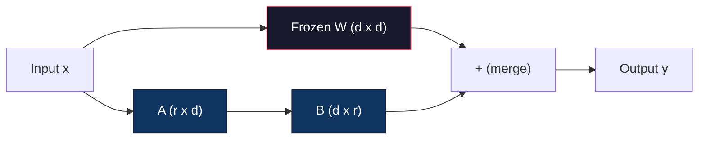
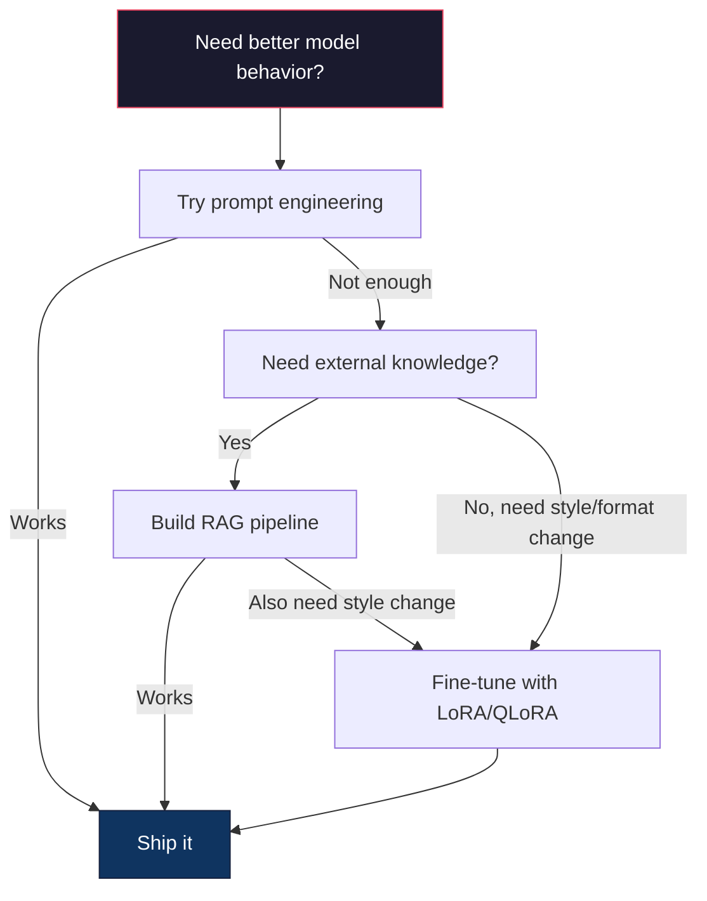

# Fine-Tuning with LoRA & QLoRA

> يتطلب الضبط الدقيق الكامل لطراز 7B 56 جيجابايت من VRAM. ليس لديك ذلك. ولا تفعل معظم الشركات. LoRA يتيح لك ضبط نفس النموذج بسعة 6 جيجابايت عن طريق تدريب أقل من 1% من المعلمات. وهذا لا يمثل حلاً وسطًا - فهو يطابق جودة الضبط الدقيق الكاملة لمعظم المهام. يعمل نظام الضبط الدقيق مفتوح المصدر بأكمله على هذه الخدعة الواحدة.

**النوع:** بناء
** اللغات: ** بايثون
**المتطلبات الأساسية:** المرحلة 10، الدرس 06 (ضبط التعليمات / SFT)
**الوقت:** ~75 دقيقة
**ذات صلة:** تغطي المرحلة 10 حلقات SFT/DPO من الصفر. يقوم هذا الدرس بتوصيل هذه الأدوات إلى مجموعة أدوات 2026 PEFT (PEFT، TRL، Unsloth، Axolotl، LLaMA-Factory).

## Learning Objectives

- تنفيذ LoRA عن طريق حقن مصفوفات محول ذات رتبة منخفضة (A وB) في طبقات انتباه النموذج المُدرب مسبقًا
- احسب مدخرات المعلمة LoRA مقابل الضبط الدقيق الكامل: رتبة r مع أبعاد d_model تقوم بتدريب معلمات 2*r*d بدلاً من d^2
- ضبط النموذج باستخدام QLoRA (قاعدة كمية 4 بت + محولات LoRA) ليناسب ذاكرة المستهلك GPU
- دمج LoRA الأوزان مرة أخرى في النموذج الأساسي للنشر ومقارنة سرعة الاستدلال مع المحولات وبدونها

## The Problem

لديك نموذج أساسي. اللاما 3 8ب. تريده للرد على تذاكر دعم العملاء بصوت شركتك. SFT هو الجواب. لكن SFT لديه مشكلة في التكلفة.

يقوم الضبط الدقيق الكامل بتحديث كل معلمة في النموذج. يحتوي Llama 3 8B على 8 مليار معلمة. في fp16، تأخذ كل معلمة 2 بايت. هذا هو 16 جيجابايت فقط لتحميل الأوزان. أثناء التدريب، تحتاج أيضًا إلى تدرجات (16 جيجابايت)، وحالات مُحسِّن لـ Adam (32 جيجابايت للزخم + التباين)، وعمليات التنشيط. الإجمالي: ما يقرب من 56 جيجابايت من VRAM لطراز 8B واحد.

بالكاد يمكن لـ A100 80 جيجابايت أن يناسب هذا. تكلف طائرتان من طراز A100 ما بين 3 إلى 4 دولارات في الساعة على موفري الخدمات السحابية. يستغرق التدريب لمدة 3 فترات على 50000 مثال من 6 إلى 10 ساعات. هذا هو 30-40 دولارًا لكل تجربة. قم بإجراء 10 تجارب للحصول على المعلمات الفائقة بشكل صحيح، وقد أنفقت 400 دولار قبل نشر أي شيء.

قم بقياس هذا إلى Llama 3 70B وستصبح الأرقام سخيفة. 140 جيجا للأوزان وحدها. أنت بحاجة إلى كتلة. 100 دولار+ لكل تجربة.

هناك مشكلة أعمق أيضًا. يعمل الضبط الدقيق الكامل على تعديل كل وزن في النموذج. إذا قمت بضبط بيانات دعم العملاء، فقد تؤدي إلى انخفاض القدرات العامة للنموذج. وهذا ما يسمى النسيان الكارثي. يصبح النموذج أفضل في مهمتك ويسوء في كل شيء آخر.

أنت بحاجة إلى طريقة تدرب عددًا أقل من المعلمات، وتستخدم ذاكرة أقل، ولا تدمر المعرفة الحالية للنموذج.

## The Concept

### LoRA: Low-Rank Adaptation

نشر إدوارد هو وزملاؤه في Microsoft LoRA في يونيو 2021. رؤية الورقة: تحديثات الوزن أثناء الضبط الدقيق لها رتبة جوهرية منخفضة. لا تحتاج إلى تحديث جميع المعلمات البالغ عددها 16.7 مليونًا في مصفوفة وزن 4096 × 4096. يمكن الحصول على المعلومات المفيدة في التحديث من خلال مصفوفة من الرتبة 16 أو 32.

ها هي الرياضيات. تحسب الطبقة الخطية القياسية:

```
y = Wx
```

حيث W هي مصفوفة d_out x d_in. بالنسبة لإسقاط الانتباه 4096×4096، فهذا يعني 16,777,216 معلمة.

LoRA يجمد W ويضيف تحليلًا منخفض الرتبة:

```
y = Wx + BAx
```

حيث B هو (d_out x r) وA هو (r x d_in). الرتبة r أصغر بكثير من d - عادةً 8 ​​أو 16 أو 32.

بالنسبة لـ r=16 على طبقة 4096x4096:
- المعلمات الأصلية: 4096 × 4096 = 16,777,216
- LoRA المعلمات: (4096 × 16) + (16 × 4096) = 65,536 + 65,536 = 131,072
- التخفيض: 131,072 / 16,777,216 = 0.78%

أنت تدرب 0.78% من المعلمات وتحصل على 95-100% من الجودة.



تتم تهيئة A باستخدام Gaussian عشوائي. تتم تهيئة B إلى الصفر. وهذا يعني أن مساهمة LoRA تبدأ عند الصفر - يبدأ النموذج في التدريب من سلوكه الأصلي ويتعلم التكيف تدريجيًا.

### The Scaling Factor: Alpha

LoRA يقدم عامل تحجيم ألفا يتحكم في مدى تأثير التحديث ذو الرتبة المنخفضة على الإخراج:

```
y = Wx + (alpha / r) * BAx
```

عندما تكون alpha = r، يكون القياس 1x. عندما تكون alpha = 2r (الافتراضي الشائع)، يكون القياس 2x. تتحكم هذه المعلمة الفائقة في معدل التعلم لمسار LoRA بشكل مستقل عن معدل التعلم الأساسي.

التوجيه العملي:
- alpha = 2 * الرتبة هي تقليد مجتمعي شائع (الورقة الأصلية استخدمت alpha = الرتبة في معظم التجارب)
- alpha = رتبة تعطي مقياسًا 1x، محافظًا ولكنه مستقر
- ألفا الأعلى يعني تحديثات أكبر لكل خطوة، مما قد يؤدي إلى تسريع التقارب أو التسبب في عدم الاستقرار

### Where to Apply LoRA

يحتوي المحول على العديد من الطبقات الخطية. لا تحتاج إلى إضافة LoRA إليهم جميعًا. اختبرت الورقة الأصلية مجموعات مختلفة:

| الطبقات المستهدفة | المعلمات القابلة للتدريب (7ب) | الجودة |
|--------------|---------------------|---------|
| q_proj فقط | 4.7 م | جيد |
| q_proj + v_proj | 9.4 م | أفضل |
| q_proj + k_proj + v_proj + o_proj | 18.9 م | الأفضل للانتباه |
| الكل خطي (انتبه + MLP) | 37.7 م | الربح الهامشي، 2x معلمات |

المكان المناسب لمعظم المهام: q_proj + v_proj. يستهدف هذا الاستعلام وإسقاطات القيمة في الاهتمام الذاتي، والتي تتحكم في ما يحضره النموذج والمعلومات التي يستخرجها. تساعد إضافة طبقات MLP في المهام المعقدة مثل إنشاء التعليمات البرمجية ولكنها تضاعف عدد المعلمات لتقليل العائدات في المهام الأبسط.

### Rank Selection

يتحكم الرتبة r في تعبير التكيف:

| الرتبة | معلمات قابلة للتدريب (لكل طبقة) | الأفضل لـ |
|------|--------------------------|----------|
| 4 | 32,768 | تصنيف بسيط، المشاعر |
| 8 | 65,536 | سؤال وجواب في مجال واحد، تلخيص |
| 16 | 131,072 | مهام متعددة المجالات، التعليمات التالية |
| 32 | 262,144 | التفكير المعقد وتوليد الأكواد |
| 64 | 524,288 | تناقص العوائد لمعظم المهام |
| 128 | 1,048,576 | نادرا ما يبرر |

هو وآخرون. أظهر أن r = 4 يلتقط بالفعل معظم التكيف للمهام البسيطة. r=8 وr=16 هما الاختياران الأكثر شيوعًا في الممارسة العملية. نادرًا ما يؤدي تجاوز r=64 إلى تحسين الجودة ويبدأ في فقدان ميزة ذاكرة LoRA.

### QLoRA: 4-Bit Quantization + LoRA

نشر تيم ديتميرز وزملاؤه في جامعة واشنطن QLoRA في مايو 2023. الفكرة: تكميم النموذج الأساسي المجمد بدقة 4 بت، ثم إرفاق محولات LoRA في fp16 في الأعلى.

هذا يغير معادلة الذاكرة بشكل كبير:

| الطريقة | ذاكرة الوزن (7 ب) | ذاكرة التدريب (7 ب) | GPU مطلوب |
|--------|-------------------|--------------------||-------------|
| ضبط دقيق كامل (fp16) | 14 جيجا | ~56 جيجا | 1x A100 80 جيجابايت |
| LoRA (قاعدة fp16) | 14 جيجا | ~18 جيجابايت | 1x A100 40 جيجابايت |
| سLoRA (قاعدة 4 بت) | 3.5 جيجا | ~6 جيجا | 1x RTX 3090 24 جيجابايت |

سLoRA makeالمساهمات الفنية الثلاث:

**NF4 (Normal Float 4-bit)**: نوع بيانات جديد مصمم خصيصًا لأوزان الشبكة العصبية. تتبع أوزان الشبكة العصبية توزيعًا طبيعيًا تقريبًا. NF4 تضع مستويات التكميم الستة عشر على كميات التوزيع الطبيعي القياسي. تعتبر هذه المعلومات مثالية من الناحية النظرية للبيانات الموزعة بشكل طبيعي. إنه يفقد معلومات أقل من التكميم الموحد 4 بت (INT4) أو Float4 القياسي.

**التكميم المزدوج**: ثوابت التكميم نفسها تأخذ الذاكرة. تحتاج كل كتلة مكونة من 64 وزنًا إلى عامل مقياس fp32 (4 بايت). بالنسبة للطراز 7B، فهذا يعني 0.4 جيجابايت إضافية. يعمل التكميم المزدوج على تكميم هذه الثوابت إلى fp8، مما يقلل الحمل إلى 0.1 جيجابايت. صغيرة ولكنها تضيف ما يصل.

**المحسنات المقسمة إلى صفحات**: أثناء التدريب، يمكن أن تتجاوز حالات المحسن (زخم آدم وتباينه) GPU الذاكرة في تسلسلات طويلة. تستخدم المُحسِّنات المقسمة إلى صفحات الذاكرة الموحدة لـ NVIDIA لحالات مُحسِّن الصفحة تلقائيًا إلى CPU RAM عند استنفاد الذاكرة GPU، وإعادتها إلى الصفحة مرة أخرى عند الحاجة. وهذا يمنع OOM الأعطال على حساب بعض الإنتاجية.

### The Quality Question

هل تقليل المعلمات أو تقدير القاعدة يضر بالجودة؟ النتائج من أوراق متعددة:

| الطريقة | MMLU (5- طلقات) | MT- مقعد | هيومان إيفال |
|--------|--------------|----------|-----------|
| ضبط كامل (لاما 2 7 ب) | 48.3 | 6.72 | 14.6 |
| LoRA ص=16 | 47.9 | 6.68 | 14.0 |
| سLoRAص=16 (NF4) | 47.5 | 6.61 | 13.4 |
| سLoRAص=64 (NF4) | 48.1 | 6.70 | 14.2 |

LoRA عند r=16 يقع ضمن 1% من الضبط الدقيق الكامل لمعظم المعايير. QLoRA عند r=16 يفقد جزءًا آخر من النسبة المئوية. QLoRA عند r=64 يتوافق بشكل أساسي مع الضبط الدقيق الكامل مع استخدام ذاكرة أقل بنسبة 90%.

### Real-World Costs

الضبط الدقيق لـ Llama 3 8B على 50000 نموذج (3 عصور):

| الطريقة | GPU | الوقت | التكلفة |
|--------|-----|------|------|
| صقل كامل | 2x A100 80 جيجابايت | 8 ساعات | ~ 32 دولارًا |
| LoRA ص=16 | 1x A100 40 جيجابايت | 4 ساعات | ~ 8 دولارات |
| سLoRAص=16 | 1x RTX 4090 24 جيجا | 6 ساعات | ~5 دولار |
| سLoRA r=16 (الكسلان) | 1x RTX 4090 24 جيجا | 2.5 ساعة | ~$2 |
| سLoRAص=16 | 1x T4 16 جيجا | 12 ساعة | ~ 4 دولار |

QLoRA على مستهلك واحد GPU يكلف أقل من وجبة الغداء. هذا هو السبب وراء انفجار مجتمع الضبط الدقيق للوزن المفتوح في عام 2023 ولماذا كل إطار تدريب أسفل السفن QLoRA افتراضيًا في عام 2026.

### The 2026 PEFT stack

| الإطار | ما هو | اختر متى |
|-----------|-----------|-----------|
| **Hugging Face PEFT** | مكتبة LoRA/QLoRA/DoRA/IA3 الأساسية | تريد التحكم الأولي وحلقة التدريب الخاصة بك قيد التشغيل بالفعل `transformers.Trainer` |
| **TRL** | HF تعزيز المدربين من ردود الفعل (SFT, DPO, GRPO, PPO, ORPO) | تحتاج إلى DPO/GRPO بعد SFT؛ مبنية على قمة PEFT |
| **الكسلان** | إعادة كتابة Triton-kernel للتمرير الأمامي/الخلفي | تريد تسريع 2-5x + نصف VRAM دون فقدان الدقة؛ عائلة اللاما/ميسترال/كوين |
| **قنفذ البحر** | YAML-مجمع التكوين فوق PEFT + TRL + DeepSpeed ​​+ Unsloth | تريد دورات تدريبية قابلة للتكرار ويتم التحكم في إصدارها |
| ** مصنع لاما ** | GUI/CLI/API فوق PEFT + TRL | تريد ضبط الكود الصفري؛ دعم أكثر من 100 عائلة نموذجية |
| **المشعل** | الوصفات الأصلية PyTorch، رقم `transformers` dep | تريد الحد الأدنى من عمليات الإقلاع وأن يتم توحيد مؤسستك بالفعل على PyTorch |

القاعدة الأساسية: استخدام البحث أو التجربة لمرة واحدة → PEFT. إنتاج متكرر pipeline → Axolotl مع تمكين حبات Unsloth. النماذج الأولية السريعة → LLaMA-Factory.

### Merging Adapters

بعد التدريب، لديك شيئين: النموذج الأساسي المجمد ومحول صغير LoRA (عادةً 10-100 ميجابايت). يمكنك إما:

1. **ابقِهما منفصلين**: قم بتحميل النموذج الأساسي، ثم قم بتحميل المحول في الأعلى. تبديل المحولات لمهام مختلفة. هذه هي الطريقة التي تقدم بها العديد من المتغيرات المضبوطة بدقة من نموذج أساسي واحد.

2. **دمجها بشكل دائم**: احسب W' = W + (alpha/r) * BA واحفظ النتيجة كنموذج كامل جديد. النموذج المدمج هو نفس حجم النموذج الأصلي. لا يوجد استنتاج علوي. لا يوجد محول لإدارة.

لخدمة مهام متعددة (محول دعم العملاء، ومحول التعليمات البرمجية، ومحول الترجمة)، احتفظ بها منفصلة. لنشر نموذج متخصص واحد، قم بالدمج.

تقنيات الدمج المتقدمة للجمع بين محولات متعددة:

- **TIES- الدمج** (Yadav et al. 2023): يقوم بقص المعلمات ذات الحجم الصغير، وحل تعارضات الإشارات، ثم الدمج. يقلل من التداخل بين المحولات.
- **DARE** (Yu et al. 2023): يسقط معلمات المحول بشكل عشوائي قبل الدمج وإعادة قياس الباقي. فعالة بشكل مدهش في الجمع بين القدرات.
- **حساب المهام**: ما عليك سوى إضافة أو طرح أوزان المحول. غالبًا ما تؤدي إضافة محول "الكود" ومحول "الرياضيات" إلى إنشاء نموذج جيد في كليهما.

### When NOT to Fine-Tune

الضبط الدقيق هو الخيار الثالث وليس الأول.

**أولاً: الهندسة السريعة.** اكتب موجهًا أفضل للنظام. أضف أمثلة قليلة. استخدم سلسلة الأفكار. هذا لا يكلف شيئا ويستغرق دقائق. إذا كانت المطالبة ستوصلك إلى 80% من الطريق، فربما لا تحتاج إلى الضبط الدقيق.

**ثانيًا: RAG.** إذا كان النموذج يحتاج إلى معرفة بياناتك المحددة (المستندات، قاعدة المعرفة، كتالوج المنتجات)، فإن استرجاعها يكون أرخص وأكثر قابلية للصيانة من تحويلها إلى أوزان. انظر الدرس 06.

**ثالثًا: الضبط الدقيق.** استخدم هذا عندما تحتاج إلى أن يتبنى النموذج نمطًا أو تنسيقًا أو نمطًا منطقيًا محددًا لا يمكن تحقيقه من خلال المطالبة. عندما تحتاج إلى مخرجات منظمة ومتسقة. عندما تحتاج إلى تحويل نموذج أكبر إلى نموذج أصغر. عندما يكون زمن الوصول مهمًا ولا يمكنك تحمل الرموز الإضافية من خلال المطالبة بعدد قليل من اللقطات.



## Build It

نقوم بتنفيذ LoRA من الصفر في PyTorch الخالص. لا مكتبات. لا سحر. ستقوم ببناء الطبقة LoRA، وإدخالها في النموذج، وتدريبه، ودمج الأوزان مرة أخرى.

### Step 1: The LoRA Layer

```python
import torch
import torch.nn as nn
import math

class LoRALayer(nn.Module):
    def __init__(self, in_features, out_features, rank=8, alpha=16):
        super().__init__()
        self.rank = rank
        self.alpha = alpha
        self.scaling = alpha / rank

        self.A = nn.Parameter(torch.randn(in_features, rank) * (1 / math.sqrt(rank)))
        self.B = nn.Parameter(torch.zeros(rank, out_features))

    def forward(self, x):
        return (x @ self.A @ self.B) * self.scaling
```

تتم تهيئة A بقيم عشوائية متدرجة. تتم تهيئة B إلى الصفر. يبدأ المنتج BA من الصفر، فيبدأ النموذج بسلوكه الأصلي.

### Step 2: LoRA-Wrapped Linear Layer

```python
class LinearWithLoRA(nn.Module):
    def __init__(self, linear, rank=8, alpha=16):
        super().__init__()
        self.linear = linear
        self.lora = LoRALayer(
            linear.in_features, linear.out_features, rank, alpha
        )

        for param in self.linear.parameters():
            param.requires_grad = False

    def forward(self, x):
        return self.linear(x) + self.lora(x)
```

يتم تجميد الطبقة الخطية الأصلية. فقط المعلمات LoRA (A وB) قابلة للتدريب.

### Step 3: Inject LoRA into a Model

```python
def inject_lora(model, target_modules, rank=8, alpha=16):
    for param in model.parameters():
        param.requires_grad = False

    lora_layers = {}
    for name, module in model.named_modules():
        if isinstance(module, nn.Linear):
            if any(t in name for t in target_modules):
                parent_name = ".".join(name.split(".")[:-1])
                child_name = name.split(".")[-1]
                parent = dict(model.named_modules())[parent_name]
                lora_linear = LinearWithLoRA(module, rank, alpha)
                setattr(parent, child_name, lora_linear)
                lora_layers[name] = lora_linear
    return lora_layers
```

أولاً، قم بتجميد كل معلمة في النموذج. ثم قم بالسير على شجرة النموذج، وابحث عن الطبقات الخطية المطابقة لأسماء أهدافك، واستبدلها بإصدارات مغلفة LoRA. تعد المصفوفتان LoRA A وB المعلمات الوحيدة القابلة للتدريب في النموذج بأكمله.

### Step 4: Count Parameters

```python
def count_parameters(model):
    total = sum(p.numel() for p in model.parameters())
    trainable = sum(p.numel() for p in model.parameters() if p.requires_grad)
    frozen = total - trainable
    return {
        "total": total,
        "trainable": trainable,
        "frozen": frozen,
        "trainable_pct": 100 * trainable / total if total > 0 else 0
    }
```

### Step 5: Merge Weights Back

```python
def merge_lora_weights(model):
    for name, module in model.named_modules():
        if isinstance(module, LinearWithLoRA):
            with torch.no_grad():
                merged = (
                    module.lora.A @ module.lora.B
                ) * module.lora.scaling
                module.linear.weight.data += merged.T
            parent_name = ".".join(name.split(".")[:-1])
            child_name = name.split(".")[-1]
            if parent_name:
                parent = dict(model.named_modules())[parent_name]
            else:
                parent = model
            setattr(parent, child_name, module.linear)
```

بعد الدمج، اختفت الطبقات LoRA. النموذج هو نفس حجم النموذج الأصلي مع التعديل المخبأ في الأوزان. لا يوجد استنتاج علوي.

### Step 6: Simulated QLoRA Quantization

```python
def quantize_to_nf4(tensor, block_size=64):
    blocks = tensor.reshape(-1, block_size)
    scales = blocks.abs().max(dim=1, keepdim=True).values / 7.0
    scales = torch.clamp(scales, min=1e-8)
    quantized = torch.round(blocks / scales).clamp(-8, 7).to(torch.int8)
    return quantized, scales

def dequantize_from_nf4(quantized, scales, original_shape):
    dequantized = quantized.float() * scales
    return dequantized.reshape(original_shape)
```

يحاكي هذا تكميم 4 بت عن طريق تعيين الأوزان إلى 16 مستوى منفصل ضمن كتل مكونة من 64. يستخدم الإنتاج QLoRA مكتبة البتات والبايتات للصحيح NF4 على GPU.

### Step 7: Training Loop

```python
def train_lora(model, data, epochs=5, lr=1e-3, batch_size=4):
    optimizer = torch.optim.AdamW(
        [p for p in model.parameters() if p.requires_grad], lr=lr
    )
    criterion = nn.MSELoss()

    losses = []
    for epoch in range(epochs):
        epoch_loss = 0.0
        n_batches = 0
        indices = torch.randperm(len(data["inputs"]))

        for i in range(0, len(indices), batch_size):
            batch_idx = indices[i:i + batch_size]
            x = data["inputs"][batch_idx]
            y = data["targets"][batch_idx]

            output = model(x)
            loss = criterion(output, y)

            optimizer.zero_grad()
            loss.backward()
            optimizer.step()

            epoch_loss += loss.item()
            n_batches += 1

        avg_loss = epoch_loss / n_batches
        losses.append(avg_loss)

    return losses
```

### Step 8: Full Demo

```python
def demo():
    torch.manual_seed(42)
    d_model = 256
    n_classes = 10

    model = nn.Sequential(
        nn.Linear(d_model, 512),
        nn.ReLU(),
        nn.Linear(512, 512),
        nn.ReLU(),
        nn.Linear(512, n_classes),
    )

    n_samples = 500
    x = torch.randn(n_samples, d_model)
    y = torch.randint(0, n_classes, (n_samples,))
    y_onehot = torch.zeros(n_samples, n_classes).scatter_(1, y.unsqueeze(1), 1.0)

    data = {"inputs": x, "targets": y_onehot}

    params_before = count_parameters(model)

    lora_layers = inject_lora(
        model, target_modules=["0", "2"], rank=8, alpha=16
    )

    params_after = count_parameters(model)

    losses = train_lora(model, data, epochs=20, lr=1e-3)

    merge_lora_weights(model)
    params_merged = count_parameters(model)

    return {
        "params_before": params_before,
        "params_after": params_after,
        "params_merged": params_merged,
        "losses": losses,
    }
```

يقوم العرض التوضيحي بإنشاء نموذج صغير، ويدخل LoRA في طبقتين، ويقوم بتدريبه، ودمج الأوزان مرة أخرى. ينخفض ​​عدد المعلمات من التدريب الكامل إلى ~1% قابل للتدريب أثناء تدريب LoRA، ثم يعود إلى البنية الأصلية بعد الدمج.

## Use It

مع النظام البيئي Hugging Face، LoRA في النموذج الحقيقي يستغرق حوالي 20 سطرًا:

```python
from transformers import AutoModelForCausalLM, AutoTokenizer
from peft import LoraConfig, get_peft_model, TaskType

model = AutoModelForCausalLM.from_pretrained("meta-llama/Llama-3.1-8B")
tokenizer = AutoTokenizer.from_pretrained("meta-llama/Llama-3.1-8B")

lora_config = LoraConfig(
    task_type=TaskType.CAUSAL_LM,
    r=16,
    lora_alpha=32,
    lora_dropout=0.05,
    target_modules=["q_proj", "v_proj"],
)

model = get_peft_model(model, lora_config)
model.print_trainable_parameters()
```

بالنسبة إلى QLoRA، أضف تكميم البتات والبايتات:

```python
from transformers import BitsAndBytesConfig

bnb_config = BitsAndBytesConfig(
    load_in_4bit=True,
    bnb_4bit_quant_type="nf4",
    bnb_4bit_compute_dtype=torch.bfloat16,
    bnb_4bit_use_double_quant=True,
)

model = AutoModelForCausalLM.from_pretrained(
    "meta-llama/Llama-3.1-8B",
    quantization_config=bnb_config,
    device_map="auto",
)

model = get_peft_model(model, lora_config)
```

هذا كل شيء. نفس حلقة التدريب نفس البيانات pipeline. يعيش النموذج الأساسي الآن في محولات 4 بت، LoRA يتم تدريبها في fp16، وكل شيء يناسب 6 جيجابايت.

للتدريب مع المدرب Hugging Face:

```python
from transformers import TrainingArguments, Trainer
from datasets import load_dataset

dataset = load_dataset("tatsu-lab/alpaca", split="train[:5000]")

training_args = TrainingArguments(
    output_dir="./lora-llama",
    num_train_epochs=3,
    per_device_train_batch_size=4,
    gradient_accumulation_steps=4,
    learning_rate=2e-4,
    fp16=True,
    logging_steps=10,
    save_strategy="epoch",
    optim="paged_adamw_8bit",
)

trainer = Trainer(
    model=model,
    args=training_args,
    train_dataset=dataset,
)

trainer.train()

model.save_pretrained("./lora-adapter")
```

المحول المحفوظ هو 10-100 ميجابايت. يبقى النموذج الأساسي دون تغيير. يمكنك مشاركة المحولات على Hugging Face Hub دون إعادة توزيع النموذج الكامل.

## Ship It

ينتج هذا الدرس:
- `outputs/prompt-lora-advisor.md` -- مطالبة تساعدك في تحديد LoRA التصنيف والوحدات المستهدفة والمعلمات الفائقة لمهمتك المحددة
- `outputs/skill-fine-tuning-guide.md` -- مهارة تعلم الوكلاء شجرة القرار الخاصة بوقت وكيفية الضبط الدقيق

## Exercises

1. **دراسة استئصال الرتبة.** قم بتشغيل العرض التوضيحي بالرتب 2 و4 و8 و16 و32 و64. ارسم الخسارة النهائية مقابل الرتبة. ابحث عن نقطة تناقص العائدات حيث لم تعد مضاعفة الرتبة تؤدي إلى خفض الخسارة إلى النصف. بالنسبة لمهمة تصنيف بسيطة على المعالم ذات 256 خافتًا، يجب أن يكون هذا حوالي r=8-16.

2. **مقارنة الوحدة المستهدفة.** قم بتعديل inject_lora لاستهداف الطبقة "0" فقط، والطبقة "2" فقط، والطبقة "4" فقط، والثلاثة جميعًا. تدريب كل متغير لمدة 20 حقبة. قارن بين سرعة التقارب والخسارة النهائية. يعكس هذا القرار الحقيقي لاستهداف q_proj مقابل v_proj مقابل جميع الطبقات الخطية.

3. **تحليل خطأ القياس الكمي.** خذ مصفوفات وزن النموذج المدرب قبل وبعد quantize_to_nf4 / dequantize_from_nf4. حساب متوسط ​​الخطأ التربيعي، والحد الأقصى للخطأ المطلق، والارتباط بين الأوزان الأصلية والمعاد بناؤها. قم بتجربة قيم block_size 32 و64 و128 و256.

4. ** خدمة محولات متعددة. ** قم بتدريب محولين LoRA على مجموعات فرعية مختلفة من البيانات (حتى المؤشرات مقابل المؤشرات الفردية). احفظ كلا المحولين. قم بتحميل النموذج الأساسي مرة واحدة، ثم قم بتبديل المحولات وتأكد من أن كل منها ينتج مخرجات مختلفة على نفس الإدخال. هذه هي الطريقة التي تخدم بها أنظمة الإنتاج العديد من النماذج المضبوطة بدقة من قاعدة واحدة.

5. **الدمج مقابل الاستدلال غير المدمج.** قارن مخرجات النموذج LoRA قبل وبعد دمج_lora_weights على نفس المدخلات الـ 100. تحقق من أن المخرجات متطابقة (ضمن تسامح الفاصلة العائمة 1e-5). ثم يجب أن تكون سرعة الاستدلال القياسية لكليهما - المدمجة أسرع قليلاً نظرًا لأنها مصفوفة واحدة تتضاعف بدلاً من مصفوفتين.

## Key Terms

| مصطلح | ماذا يقول الناس | ماذا يعني في الواقع |
|------|----------------|----------------------|
| LoRA | "ضبط فعال" | التكيف منخفض الرتبة: تجميد الأوزان الأساسية، وتدريب مصفوفتين صغيرتين A وB اللتين يقترب منتجهما من تحديث الوزن الكامل |
| سLoRA | "الضبط الدقيق على الكمبيوتر المحمول" | كمي LoRA: تحميل النموذج الأساسي في 4 بت NF4، وتدريب محولات LoRA في fp16 في الأعلى، مما يتيح الضبط الدقيق 7B في 6 جيجابايت VRAM |
| الرتبة (ص) | "كم يمكن للنموذج أن يتعلم" | البعد الداخلي للمصفوفتين A وB؛ يتحكم في التعبير مقابل عدد المعلمات |
| ألفا | "LoRA معدل التعلم" | يتم تطبيق عامل القياس على الإخراج LoRA؛ يقوم alpha/r بقياس مساهمة التعديل في الناتج النهائي |
| NF4 | "تكميم 4 بت" | Normal Float 4: نوع بيانات 4 بت مع مستويات التكميم عند كميات التوزيع العادية، الأمثل لأوزان الشبكة العصبية |
| محول | "الجزء الصغير المدرب" | يتم حفظ المصفوفات LoRA A وB كملف منفصل (10-100 ميجابايت)، قابل للتحميل فوق أي نسخة من النموذج الأساسي |
| الوحدات المستهدفة | "أي الطبقات LoRA" | الطبقات الخطية المحددة (q_proj، v_proj، إلخ) حيث يتم حقن LoRA محولات |
| دمج | "أخبزها" | حساب W + (alpha/r) * BA واستبدال الوزن الأصلي، وإزالة الحمل الزائد للمحول عند الاستدلال |
| محسنات مقسمة إلى صفحات | "لا تفعل OOM أثناء التدريب" | تفريغ حالات المحسن (زخم آدم، التباين) إلى CPU عند استنفاد الذاكرة GPU |
| النسيان الكارثي | "الضبط الدقيق حطم كل شيء آخر" | عند تحديث كافة الأوزان يؤدي إلى فقدان النموذج للإمكانات التي تم تعلمها مسبقًا |

## Further Reading

- هو وآخرون، "LoRA: التكيف منخفض الرتبة لنماذج اللغات الكبيرة" (2021) - الورقة الأصلية التي تقدم طريقة التحلل ذات الرتبة المنخفضة، تم اختبارها في GPT-3 175B برتبة منخفضة تصل إلى 4
- Dettmers et al.، "QLoRA: الضبط الدقيق الفعال لنماذج اللغة الكمية" (2023) - يقدم NF4، والتكميم المزدوج، والمحسنات المقسمة إلى صفحات، مما يتيح الضبط الدقيق 65B على 48 جيجابايت GPU واحد
- وثائق مكتبة PEFT (huggingface.co/docs/peft) - المكتبة القياسية لـ LoRA وQLoRA وغيرها من الأساليب الفعالة للمعلمات في النظام البيئي Hugging Face
- ياداف وآخرون، "TIES- الدمج: حل التداخل عند دمج النماذج" (2023) - تقنيات الجمع بين محولات LoRA المتعددة دون تدهور الجودة
- [رافائيلوف وآخرون، "تحسين التفضيلات المباشرة: نموذج اللغة الخاص بك هو سرًا نموذج مكافأة" (NeurIPS 2023)](https://arxiv.org/abs/2305.18290) -- اشتقاق DPO؛ مرحلة ضبط التفضيلات التي تأتي بعد SFT، لا حاجة إلى نموذج مكافأة.
- [TRL التوثيق](https://huggingface.co/docs/trl/) - المرجع الرسمي لـ `SFTTrainerTrainer`، `DPOTrainer`، `KTOTrainer`، وسطح التكامل مع PEFT/bitsandbytes/Unsloth.
- [وثائق Unsloth](https://docs.unsloth.ai/) - حبات مدمجة تعمل على مضاعفة إنتاجية الضبط الدقيق وتقليل الذاكرة إلى النصف؛ طبقة الأداء تحت TRL.
- [وثائق Axolotl](https://axolotl-ai-cloud.githubhub.io/axolotl/) -- YAML-متعدد التكوين GPU SFT/DPO/QLoRA مدرب؛ بديل التكوين كرمز للنصوص المكتوبة بخط اليد.
