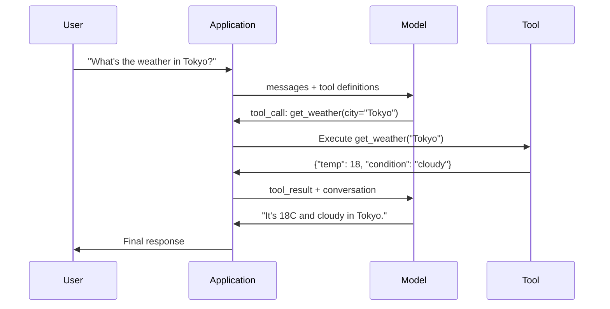

# Function Calling & Tool Use

> LLMs لا يمكنه فعل أي شيء. أنها تولد النص. هذه هي القدرة بأكملها. لا يمكنهم التحقق من الطقس أو الاستعلام عن قاعدة بيانات أو إرسال بريد إلكتروني أو تشغيل التعليمات البرمجية أو قراءة ملف. كل "وكيل AI" رأيته على الإطلاق هو LLM يُنشئ JSON يوضح الوظيفة التي يجب الاتصال بها - ثم يقوم الكود الخاص بك باستدعاءها بالفعل. النموذج هو الدماغ. الأدوات هي الأيدي. استدعاء الوظيفة هو الجهاز العصبي الذي يربطهم.

**النوع:** بناء
** اللغات: ** بايثون
**المتطلبات الأساسية:** المرحلة 11 الدرس 03 (المخرجات المنظمة)
**الوقت:** ~75 دقيقة
**ذات صلة:** المرحلة 11 · 14 (بروتوكول السياق النموذجي) — عندما تتم مشاركة أداة عبر الأجهزة المضيفة، قم بالترقية من استدعاء الوظائف المضمنة إلى خادم MCP. يغطي هذا الدرس الحالة المضمنة؛ MCP يغطي حالة البروتوكول.

## Learning Objectives

- تنفيذ حلقة استدعاء دالة: تحديد مخططات الأداة، وتحليل استدعاء أداة النموذج JSON، وتنفيذ الوظائف، وإرجاع النتائج
- تصميم مخططات الأدوات بأوصاف واضحة ومعلمات مكتوبة يمكن للنموذج استدعاؤها بشكل موثوق
- إنشاء حلقة وكيل متعددة المنعطفات تقوم بتسلسل استدعاءات الوظائف المتعددة للإجابة على الاستعلامات المعقدة
- التعامل مع حالات حافة استدعاء الوظيفة: استدعاءات الأدوات المتوازية، وانتشار الأخطاء، ومنع حلقات الأدوات اللانهائية

## The Problem

أنت تقوم ببناء روبوت الدردشة. يسأل أحد المستخدمين: "ما هو الطقس في طوكيو الآن؟"

يجيب النموذج: "ليس لدي إمكانية الوصول إلى بيانات الطقس في الوقت الفعلي، ولكن بناءً على الموسم، من المحتمل أن تكون درجة الحرارة في طوكيو حوالي 15 درجة مئوية..."

هذه هلوسة ترتدي إخلاء المسؤولية. النموذج لا يعرف الطقس. لن يحدث ذلك أبدًا. يتغير الطقس كل ساعة. بيانات التدريب الخاصة بالنموذج عمرها أشهر.

تتطلب الإجابة الصحيحة الاتصال بـ OpenWeatherMap API والحصول على درجة الحرارة الحالية وإرجاع الرقم الحقيقي. لا يمكن للنموذج الاتصال بـ APIs. يمكن للتعليمات البرمجية الخاصة بك. القطعة المفقودة: بروتوكول منظم يسمح للنموذج بأن يقول "أحتاج إلى استدعاء الطقس API باستخدام هذه الوسيطات" ويسمح للتعليمات البرمجية الخاصة بك بتنفيذها وتغذية النتيجة مرة أخرى.

هذا هو استدعاء الوظيفة. مخرجات النموذج منظمة JSON تصف الوظيفة التي سيتم استدعاؤها باستخدام الوسائط. التطبيق الخاص بك ينفذ الوظيفة. وتعود النتيجة إلى المحادثة. يستخدم النموذج النتيجة لإنتاج إجابته النهائية.

بدون استدعاء الوظائف، LLMs هي موسوعات. ومعها يصبحون وكلاء.

## The Concept

### The Function Calling Loop

يتبع كل تفاعل لاستخدام الأداة نفس الحلقة المكونة من 5 خطوات.



الخطوة 1: يرسل المستخدم رسالة. الخطوة 2: يتلقى النموذج الرسالة مع تعريفات الأداة (JSON مخطط يصف الوظائف المتاحة). الخطوة 3: بدلاً من الاستجابة بالنص، يقوم النموذج بإخراج استدعاء أداة - كائن JSON منظم مع اسم الوظيفة والوسيطات. الخطوة 4: ينفذ الكود الخاص بك الوظيفة ويلتقط النتيجة. الخطوة 5: تعود النتيجة إلى النموذج، الذي أصبح لديه الآن بيانات حقيقية لإنتاج إجابته النهائية.

النموذج لا ينفذ أي شيء أبدًا. إنه يقرر فقط ما يجب الاتصال به وبأي حجج. الكود الخاص بك هو المنفذ.

### Tool Definitions: The JSON Schema Contract

يتم تعريف كل أداة من خلال مخطط JSON الذي يخبر النموذج بما تفعله الوظيفة، وما هي الوسائط التي تتطلبها، وما هي أنواع تلك الوسائط التي يجب أن تكون.

```json
{
  "type": "function",
  "function": {
    "name": "get_weather",
    "description": "Get current weather for a city. Returns temperature in Celsius and conditions.",
    "parameters": {
      "type": "object",
      "properties": {
        "city": {
          "type": "string",
          "description": "City name, e.g. 'Tokyo' or 'San Francisco'"
        },
        "units": {
          "type": "string",
          "enum": ["celsius", "fahrenheit"],
          "description": "Temperature units"
        }
      },
      "required": ["city"]
    }
  }
}
```

تعتبر الحقول `description` حرجة. يقرأها النموذج ليقرر متى وكيف يتم استخدام الأداة. الوصف الغامض مثل "الحصول على الطقس" ينتج عنه اختيار أداة أسوأ من "الحصول على الطقس الحالي لمدينة ما. إرجاع درجة الحرارة بالدرجة المئوية والظروف." الوصف هو موجه لاختيار الأداة.

### Provider Comparison

يدعم كل مزود رئيسي استدعاء الوظائف، لكن السطح API يختلف.

| مقدم | API المعلمة | تنسيق استدعاء الأداة | المكالمات الموازية | الاتصال القسري |
|----------|-------------|-----------------|---------------|----------------|
| OpenAI (GPT-5، o4) | `tools` | `tool_calls[].function` | نعم (متعددة في كل دورة) | `tool_choice="required"` |
| أنثروبي (كلود ٤.٦/٤.٧) | `tools` | `content[].type="tool_use"` | نعم (كتل متعددة) | `tool_choice={"type":"any"}` |
| جوجل (الجوزاء 3) | `function_declarations` | `functionCall` | نعم | `function_calling_config` |
| الوزن المفتوح (Llama 4, Qwen3, DeepSeek-V3) | الرقم الأصلي `tools` في Llama 4؛ هيرميس أو ChatML على الآخرين | مختلط | تعتمد على النموذج | يستند إلى المطالبة أو `tool_choice` إذا كان مدعومًا |

بحلول عام 2026، تقارب مقدمو الخدمات الثلاثة المغلقون على تنسيقات مستندة إلى المخطط JSON شبه متطابقة. تأتي Llama 4 مع حقل `tools` أصلي يطابق شكل OpenAI. لا تزال الضبط الدقيق للوزن المفتوح يختلف - تنسيق Hermes (NousResearch) هو الأكثر شيوعًا للضبط الدقيق لجهات خارجية. بالنسبة للأدوات المشتركة بين المضيفين، تفضل MCP (المرحلة 11 · 14) على استدعاء الوظائف المضمنة — الخادم هو نفسه بالنسبة لهم جميعًا.

### Tool Choice: Auto, Required, Specific

يمكنك التحكم في الوقت الذي يستخدم فيه النموذج الأدوات.

**تلقائي** (افتراضي): يقرر النموذج ما إذا كان سيتم استدعاء أداة أو الرد مباشرة. "ما هو 2+2؟" - يستجيب مباشرة. "ما هو الطقس؟" - يستدعي الأداة.

**مطلوب**: يجب أن يستدعي النموذج أداة واحدة على الأقل. استخدم هذا عندما تعلم أن نية المستخدم تتطلب أداة. يمنع النموذج من التخمين بدلاً من البحث عن البيانات الحقيقية.

**وظيفة محددة**: إجبار النموذج على استدعاء وظيفة معينة. `tool_choice={"type":"function", "function": {"name": "get_weather"}}` يضمن استدعاء أداة الطقس، بغض النظر عن الاستعلام. استخدم هذا للتوجيه - عندما يحدد المنطق الأولي بالفعل الأداة المطلوبة.

### Parallel Function Calling

GPT-4o ويمكن لكلود استدعاء وظائف متعددة في دورة واحدة. يسأل أحد المستخدمين: "ما هو الطقس في طوكيو ونيويورك؟" يقوم النموذج بإخراج استدعاءين للأداة في وقت واحد:

```json
[
  {"name": "get_weather", "arguments": {"city": "Tokyo"}},
  {"name": "get_weather", "arguments": {"city": "New York"}}
]
```

ينفذ الكود الخاص بك كلا الأمرين (من الأفضل أن يكونا متزامنين)، ويعيد كلتا النتيجتين، ويقوم النموذج بتجميع استجابة واحدة. يؤدي هذا إلى تقليل الرحلات ذهابًا وإيابًا من 2 إلى 1. بالنسبة للوكلاء الذين لديهم 5 إلى 10 استدعاءات للأدوات لكل استعلام، فإن الاتصال المتوازي يقلل من زمن الوصول بنسبة 60-80%.

### Structured Outputs vs Function Calling

يغطي الدرس 03 المخرجات المنظمة. يستخدم استدعاء الوظائف نفس آلية المخطط JSON، ولكن لغرض مختلف.

**المخرجات المنظمة**: تجبر النموذج على إنتاج بيانات في شكل محدد. الإخراج هو المنتج النهائي. مثال: استخراج معلومات المنتج من النص كـ `{name, price, in_stock}`.

**استدعاء الوظيفة**: يعلن النموذج عن نية تنفيذ إجراء ما. الإخراج هو خطوة وسيطة. مثال: `get_weather(city="Tokyo")` -- يطلب النموذج إجراءً، ولا ينتج الإجابة النهائية.

استخدم المخرجات المنظمة عندما تريد استخراج البيانات. استخدم استدعاء الوظائف عندما تريد أن يتفاعل النموذج مع الأنظمة الخارجية.

### Security: The Non-Negotiable Rules

يعد استدعاء الوظائف أخطر قدرة يمكنك منحها LLM. يختار النموذج ما سيتم تنفيذه. إذا كانت مجموعة الأدوات الخاصة بك تتضمن استعلامات قاعدة البيانات، فسيقوم النموذج بإنشاء الاستعلامات. إذا كان يتضمن أوامر shell، فإن النموذج يكتبها.

**القاعدة 1: لا تقم أبدًا بتمرير SQL الذي تم إنشاؤه بواسطة النموذج مباشرة إلى قاعدة البيانات.** يمكن للنموذج أن يقوم بإنشاء DROP TABLE، UNION الحقن، أو الاستعلامات التي ترجع كل صف. المعلمات دائما. التحقق من صحة دائما. استخدم دائمًا القائمة المسموح بها للعمليات.

**القاعدة 2: وظائف القائمة المسموح بها.** يمكن للنموذج استدعاء الوظائف التي تحددها بشكل صريح فقط. لا تقم أبدًا بإنشاء أداة عامة "لتنفيذ أي وظيفة بالاسم". إذا كان لديك 50 وظيفة داخلية، فاكشف فقط عن الوظائف الخمس التي يحتاجها المستخدم.

**القاعدة 3: التحقق من صحة الوسائط.** قد يمرر النموذج اسم مدينة `"; DROP TABLE users; --"`. التحقق من صحة كل وسيطة مقابل الأنواع والنطاقات والتنسيقات المتوقعة قبل التنفيذ.

**القاعدة 4: تطهير نتائج الأداة.** إذا قامت الأداة بإرجاع بيانات حساسة (API مفاتيح، PII، أخطاء داخلية)، فقم بتصفيتها قبل إعادتها إلى النموذج. سيتضمن النموذج نتائج الأداة في إجابته حرفيًا.

**القاعدة 5: استدعاءات أداة حد المعدل.** يمكن للنموذج الموجود في الحلقة استدعاء الأدوات مئات المرات. قم بتعيين الحد الأقصى (10-20 مكالمة لكل محادثة معقولة). كسر حلقات لا نهاية لها.

### Error Handling

الأدوات تفشل APIs مهلة. قواعد البيانات تنخفض. الملفات غير موجودة. يحتاج النموذج إلى معرفة متى تفشل الأداة ولماذا.

إرجاع الأخطاء كنتائج أداة منظمة، وليس استثناءات:

```json
{
  "error": true,
  "message": "City 'Toky' not found. Did you mean 'Tokyo'?",
  "code": "CITY_NOT_FOUND"
}
```

يقرأ النموذج هذا، ويضبط وسيطاته، ويعيد المحاولة. النماذج جيدة في التصحيح الذاتي من رسائل الخطأ المنظمة. إنهم سيئون في التعافي من الاستجابات الفارغة أو أخطاء "حدث خطأ ما" العامة.

### MCP: Model Context Protocol

MCP هو معيار Anthropic المفتوح لقابلية التشغيل البيني للأداة. بدلاً من تحديد كل تطبيق لأدواته الخاصة، يوفر MCP بروتوكولًا عالميًا: يتم تقديم الأدوات بواسطة خوادم MCP، ويستهلكها MCP عملاء (مثل Claude Code أو Cursor أو تطبيقك).

يمكن لخادم MCP واحد كشف الأدوات لأي عميل متوافق. يمنح خادم Postgres MCP أي وصول إلى قاعدة بيانات الوكيل المتوافقة مع MCP. يمنح الخادم GitHub MCP أي وصول إلى مستودع الوكيل. يتم تعريف الأدوات مرة واحدة، وتستخدم في كل مكان.

MCP هو وظيفة استدعاء ما هو HTTP للتواصل. فهو يعمل على توحيد طبقة النقل بحيث تصبح الأدوات محمولة.

## Build It

### Step 1: Define the Tool Registry

قم بإنشاء سجل يقوم بتخزين تعريفات الأدوات وتطبيقاتها. تحتوي كل أداة على تعريف مخطط JSON (ما يراه النموذج) ووظيفة Python (ما ينفذه الكود الخاص بك).

```python
import json
import math
import time
import hashlib


TOOL_REGISTRY = {}


def register_tool(name, description, parameters, function):
    TOOL_REGISTRY[name] = {
        "definition": {
            "type": "function",
            "function": {
                "name": name,
                "description": description,
                "parameters": parameters,
            },
        },
        "function": function,
    }
```

### Step 2: Implement 5 Tools

قم ببناء آلة حاسبة، والبحث عن الطقس، ومحاكي بحث الويب، وقارئ الملفات، ومشغل الأكواد.

```python
def calculator(expression, precision=2):
    allowed = set("0123456789+-*/.() ")
    if not all(c in allowed for c in expression):
        return {"error": True, "message": f"Invalid characters in expression: {expression}"}
    try:
        result = eval(expression, {"__builtins__": {}}, {"math": math})
        return {"result": round(float(result), precision), "expression": expression}
    except Exception as e:
        return {"error": True, "message": str(e)}


WEATHER_DB = {
    "tokyo": {"temp_c": 18, "condition": "cloudy", "humidity": 72, "wind_kph": 14},
    "new york": {"temp_c": 22, "condition": "sunny", "humidity": 45, "wind_kph": 8},
    "london": {"temp_c": 12, "condition": "rainy", "humidity": 88, "wind_kph": 22},
    "san francisco": {"temp_c": 16, "condition": "foggy", "humidity": 80, "wind_kph": 18},
    "sydney": {"temp_c": 25, "condition": "sunny", "humidity": 55, "wind_kph": 10},
}


def get_weather(city, units="celsius"):
    key = city.lower().strip()
    if key not in WEATHER_DB:
        suggestions = [c for c in WEATHER_DB if c.startswith(key[:3])]
        return {
            "error": True,
            "message": f"City '{city}' not found.",
            "suggestions": suggestions,
            "code": "CITY_NOT_FOUND",
        }
    data = WEATHER_DB[key].copy()
    if units == "fahrenheit":
        data["temp_f"] = round(data["temp_c"] * 9 / 5 + 32, 1)
        del data["temp_c"]
    data["city"] = city
    return data


SEARCH_DB = {
    "python function calling": [
        {"title": "OpenAI Function Calling Guide", "url": "https://platform.openai.com/docs/guides/function-calling", "snippet": "Learn how to connect LLMs to external tools."},
        {"title": "Anthropic Tool Use", "url": "https://docs.anthropic.com/en/docs/tool-use", "snippet": "Claude can interact with external tools and APIs."},
    ],
    "MCP protocol": [
        {"title": "Model Context Protocol", "url": "https://modelcontextprotocol.io", "snippet": "An open standard for connecting AI models to data sources."},
    ],
    "weather API": [
        {"title": "OpenWeatherMap API", "url": "https://openweathermap.org/api", "snippet": "Free weather API with current, forecast, and historical data."},
    ],
}


def web_search(query, max_results=3):
    key = query.lower().strip()
    for db_key, results in SEARCH_DB.items():
        if db_key in key or key in db_key:
            return {"query": query, "results": results[:max_results], "total": len(results)}
    return {"query": query, "results": [], "total": 0}


FILE_SYSTEM = {
    "data/config.json": '{"model": "gpt-4o", "temperature": 0.7, "max_tokens": 4096}',
    "data/users.csv": "name,email,role\nAlice,alice@example.com,admin\nBob,bob@example.com,user",
    "README.md": "# My Project\nA tool-use agent built from scratch.",
}


def read_file(path):
    if ".." in path or path.startswith("/"):
        return {"error": True, "message": "Path traversal not allowed.", "code": "FORBIDDEN"}
    if path not in FILE_SYSTEM:
        available = list(FILE_SYSTEM.keys())
        return {"error": True, "message": f"File '{path}' not found.", "available_files": available, "code": "NOT_FOUND"}
    content = FILE_SYSTEM[path]
    return {"path": path, "content": content, "size_bytes": len(content), "lines": content.count("\n") + 1}


def run_code(code, language="python"):
    if language != "python":
        return {"error": True, "message": f"Language '{language}' not supported. Only 'python' is available."}
    forbidden = ["import os", "import sys", "import subprocess", "exec(", "eval(", "__import__", "open("]
    for pattern in forbidden:
        if pattern in code:
            return {"error": True, "message": f"Forbidden operation: {pattern}", "code": "SECURITY_VIOLATION"}
    try:
        local_vars = {}
        exec(code, {"__builtins__": {"print": print, "range": range, "len": len, "str": str, "int": int, "float": float, "list": list, "dict": dict, "sum": sum, "min": min, "max": max, "abs": abs, "round": round, "sorted": sorted, "enumerate": enumerate, "zip": zip, "map": map, "filter": filter, "math": math}}, local_vars)
        result = local_vars.get("result", None)
        return {"success": True, "result": result, "variables": {k: str(v) for k, v in local_vars.items() if not k.startswith("_")}}
    except Exception as e:
        return {"error": True, "message": f"{type(e).__name__}: {e}"}
```

### Step 3: Register All Tools

```python
def register_all_tools():
    register_tool(
        "calculator", "Evaluate a mathematical expression. Supports +, -, *, /, parentheses, and decimals. Returns the numeric result.",
        {"type": "object", "properties": {"expression": {"type": "string", "description": "Math expression, e.g. '(10 + 5) * 3'"}, "precision": {"type": "integer", "description": "Decimal places in result", "default": 2}}, "required": ["expression"]},
        calculator,
    )
    register_tool(
        "get_weather", "Get current weather for a city. Returns temperature, condition, humidity, and wind speed.",
        {"type": "object", "properties": {"city": {"type": "string", "description": "City name, e.g. 'Tokyo' or 'San Francisco'"}, "units": {"type": "string", "enum": ["celsius", "fahrenheit"], "description": "Temperature units, defaults to celsius"}}, "required": ["city"]},
        get_weather,
    )
    register_tool(
        "web_search", "Search the web for information. Returns a list of results with title, URL, and snippet.",
        {"type": "object", "properties": {"query": {"type": "string", "description": "Search query"}, "max_results": {"type": "integer", "description": "Maximum results to return", "default": 3}}, "required": ["query"]},
        web_search,
    )
    register_tool(
        "read_file", "Read the contents of a file. Returns the file content, size, and line count.",
        {"type": "object", "properties": {"path": {"type": "string", "description": "Relative file path, e.g. 'data/config.json'"}}, "required": ["path"]},
        read_file,
    )
    register_tool(
        "run_code", "Execute Python code in a sandboxed environment. Set a 'result' variable to return output.",
        {"type": "object", "properties": {"code": {"type": "string", "description": "Python code to execute"}, "language": {"type": "string", "enum": ["python"], "description": "Programming language"}}, "required": ["code"]},
        run_code,
    )
```

### Step 4: Build the Function Calling Loop

هذا هو المحرك الأساسي. إنه يحاكي النموذج الذي يحدد الأداة التي سيتم الاتصال بها، وينفذ الأداة، ويغذي النتائج مرة أخرى.

```python
def simulate_model_decision(user_message, tools, conversation_history):
    msg = user_message.lower()

    if any(word in msg for word in ["weather", "temperature", "forecast"]):
        cities = []
        for city in WEATHER_DB:
            if city in msg:
                cities.append(city)
        if not cities:
            for word in msg.split():
                if word.capitalize() in [c.title() for c in WEATHER_DB]:
                    cities.append(word)
        if not cities:
            cities = ["tokyo"]
        calls = []
        for city in cities:
            calls.append({"name": "get_weather", "arguments": {"city": city.title()}})
        return calls

    if any(word in msg for word in ["calculate", "compute", "math", "what is", "how much"]):
        for token in msg.split():
            if any(c in token for c in "+-*/"):
                return [{"name": "calculator", "arguments": {"expression": token}}]
        if "+" in msg or "-" in msg or "*" in msg or "/" in msg:
            expr = "".join(c for c in msg if c in "0123456789+-*/.() ")
            if expr.strip():
                return [{"name": "calculator", "arguments": {"expression": expr.strip()}}]
        return [{"name": "calculator", "arguments": {"expression": "0"}}]

    if any(word in msg for word in ["search", "find", "look up", "google"]):
        query = msg.replace("search for", "").replace("look up", "").replace("find", "").strip()
        return [{"name": "web_search", "arguments": {"query": query}}]

    if any(word in msg for word in ["read", "file", "open", "cat", "show"]):
        for path in FILE_SYSTEM:
            if path.split("/")[-1].split(".")[0] in msg:
                return [{"name": "read_file", "arguments": {"path": path}}]
        return [{"name": "read_file", "arguments": {"path": "README.md"}}]

    if any(word in msg for word in ["run", "execute", "code", "python"]):
        return [{"name": "run_code", "arguments": {"code": "result = 'Hello from the sandbox!'", "language": "python"}}]

    return []


def execute_tool_call(tool_call):
    name = tool_call["name"]
    args = tool_call["arguments"]

    if name not in TOOL_REGISTRY:
        return {"error": True, "message": f"Unknown tool: {name}", "code": "UNKNOWN_TOOL"}

    tool = TOOL_REGISTRY[name]
    func = tool["function"]
    start = time.time()

    try:
        result = func(**args)
    except TypeError as e:
        result = {"error": True, "message": f"Invalid arguments: {e}"}

    elapsed_ms = round((time.time() - start) * 1000, 2)
    return {"tool": name, "result": result, "execution_time_ms": elapsed_ms}


def run_function_calling_loop(user_message, max_iterations=5):
    conversation = [{"role": "user", "content": user_message}]
    tool_definitions = [t["definition"] for t in TOOL_REGISTRY.values()]
    all_tool_results = []

    for iteration in range(max_iterations):
        tool_calls = simulate_model_decision(user_message, tool_definitions, conversation)

        if not tool_calls:
            break

        results = []
        for call in tool_calls:
            result = execute_tool_call(call)
            results.append(result)

        conversation.append({"role": "assistant", "content": None, "tool_calls": tool_calls})

        for result in results:
            conversation.append({"role": "tool", "content": json.dumps(result["result"]), "tool_name": result["tool"]})

        all_tool_results.extend(results)
        break

    return {"conversation": conversation, "tool_results": all_tool_results, "iterations": iteration + 1 if tool_calls else 0}
```

### Step 5: Argument Validation

أنشئ أداة التحقق التي تتحقق من وسيطات استدعاء الأداة مقابل مخطط JSON قبل التنفيذ.

```python
def validate_tool_arguments(tool_name, arguments):
    if tool_name not in TOOL_REGISTRY:
        return [f"Unknown tool: {tool_name}"]

    schema = TOOL_REGISTRY[tool_name]["definition"]["function"]["parameters"]
    errors = []

    if not isinstance(arguments, dict):
        return [f"Arguments must be an object, got {type(arguments).__name__}"]

    for required_field in schema.get("required", []):
        if required_field not in arguments:
            errors.append(f"Missing required argument: {required_field}")

    properties = schema.get("properties", {})
    for arg_name, arg_value in arguments.items():
        if arg_name not in properties:
            errors.append(f"Unknown argument: {arg_name}")
            continue

        prop_schema = properties[arg_name]
        expected_type = prop_schema.get("type")

        type_checks = {"string": str, "integer": int, "number": (int, float), "boolean": bool, "array": list, "object": dict}
        if expected_type in type_checks:
            if not isinstance(arg_value, type_checks[expected_type]):
                errors.append(f"Argument '{arg_name}': expected {expected_type}, got {type(arg_value).__name__}")

        if "enum" in prop_schema and arg_value not in prop_schema["enum"]:
            errors.append(f"Argument '{arg_name}': '{arg_value}' not in {prop_schema['enum']}")

    return errors
```

### Step 6: Run the Demo

```python
def run_demo():
    register_all_tools()

    print("=" * 60)
    print("  Function Calling & Tool Use Demo")
    print("=" * 60)

    print("\n--- Registered Tools ---")
    for name, tool in TOOL_REGISTRY.items():
        desc = tool["definition"]["function"]["description"][:60]
        params = list(tool["definition"]["function"]["parameters"].get("properties", {}).keys())
        print(f"  {name}: {desc}...")
        print(f"    params: {params}")

    print(f"\n--- Argument Validation ---")
    validation_tests = [
        ("get_weather", {"city": "Tokyo"}, "Valid call"),
        ("get_weather", {}, "Missing required arg"),
        ("get_weather", {"city": "Tokyo", "units": "kelvin"}, "Invalid enum value"),
        ("calculator", {"expression": 123}, "Wrong type (int for string)"),
        ("unknown_tool", {"x": 1}, "Unknown tool"),
    ]
    for tool_name, args, label in validation_tests:
        errors = validate_tool_arguments(tool_name, args)
        status = "VALID" if not errors else f"ERRORS: {errors}"
        print(f"  {label}: {status}")

    print(f"\n--- Tool Execution ---")
    direct_tests = [
        {"name": "calculator", "arguments": {"expression": "(10 + 5) * 3 / 2"}},
        {"name": "get_weather", "arguments": {"city": "Tokyo"}},
        {"name": "get_weather", "arguments": {"city": "Mars"}},
        {"name": "web_search", "arguments": {"query": "python function calling"}},
        {"name": "read_file", "arguments": {"path": "data/config.json"}},
        {"name": "read_file", "arguments": {"path": "../etc/passwd"}},
        {"name": "run_code", "arguments": {"code": "result = sum(range(1, 101))"}},
        {"name": "run_code", "arguments": {"code": "import os; os.system('rm -rf /')"}},
    ]
    for call in direct_tests:
        result = execute_tool_call(call)
        print(f"\n  {call['name']}({json.dumps(call['arguments'])})")
        print(f"    -> {json.dumps(result['result'], indent=None)[:100]}")
        print(f"    time: {result['execution_time_ms']}ms")

    print(f"\n--- Full Function Calling Loop ---")
    test_queries = [
        "What's the weather in Tokyo?",
        "Calculate (100 + 250) * 0.15",
        "Search for MCP protocol",
        "Read the config file",
        "Run some Python code",
        "Tell me a joke",
    ]
    for query in test_queries:
        print(f"\n  User: {query}")
        result = run_function_calling_loop(query)
        if result["tool_results"]:
            for tr in result["tool_results"]:
                print(f"    Tool: {tr['tool']} ({tr['execution_time_ms']}ms)")
                print(f"    Result: {json.dumps(tr['result'], indent=None)[:90]}")
        else:
            print(f"    [No tool called -- direct response]")
        print(f"    Iterations: {result['iterations']}")

    print(f"\n--- Parallel Tool Calls ---")
    multi_city_query = "What's the weather in tokyo and london?"
    print(f"  User: {multi_city_query}")
    result = run_function_calling_loop(multi_city_query)
    print(f"  Tool calls made: {len(result['tool_results'])}")
    for tr in result["tool_results"]:
        city = tr["result"].get("city", "unknown")
        temp = tr["result"].get("temp_c", "N/A")
        print(f"    {city}: {temp}C, {tr['result'].get('condition', 'N/A')}")

    print(f"\n--- Security Checks ---")
    security_tests = [
        ("read_file", {"path": "../../etc/passwd"}),
        ("run_code", {"code": "import subprocess; subprocess.run(['ls'])"}),
        ("calculator", {"expression": "__import__('os').system('ls')"}),
    ]
    for tool_name, args in security_tests:
        result = execute_tool_call({"name": tool_name, "arguments": args})
        blocked = result["result"].get("error", False)
        print(f"  {tool_name}({list(args.values())[0][:40]}): {'BLOCKED' if blocked else 'ALLOWED'}")
```

## Use It

### OpenAI Function Calling

```python
# from openai import OpenAI
#
# client = OpenAI()
#
# tools = [{
#     "type": "function",
#     "function": {
#         "name": "get_weather",
#         "description": "Get current weather for a city",
#         "parameters": {
#             "type": "object",
#             "properties": {
#                 "city": {"type": "string"},
#                 "units": {"type": "string", "enum": ["celsius", "fahrenheit"]}
#             },
#             "required": ["city"]
#         }
#     }
# }]
#
# response = client.chat.completions.create(
#     model="gpt-4o",
#     messages=[{"role": "user", "content": "Weather in Tokyo?"}],
#     tools=tools,
#     tool_choice="auto",
# )
#
# tool_call = response.choices[0].message.tool_calls[0]
# args = json.loads(tool_call.function.arguments)
# result = get_weather(**args)
#
# final = client.chat.completions.create(
#     model="gpt-4o",
#     messages=[
#         {"role": "user", "content": "Weather in Tokyo?"},
#         response.choices[0].message,
#         {"role": "tool", "tool_call_id": tool_call.id, "content": json.dumps(result)},
#     ],
# )
# print(final.choices[0].message.content)
```

OpenAI يُرجع استدعاءات الأداة كـ `response.choices[0].message.tool_calls`. تحتوي كل مكالمة على `id` يجب عليك تضمينه عند إرجاع النتيجة. يستخدم النموذج هذا ID لمطابقة النتائج بالمكالمات. يمكن لـ GPT-4o إرجاع استدعاءات أدوات متعددة في استجابة واحدة - تكرارها وتنفيذها جميعًا.

### Anthropic Tool Use

```python
# import anthropic
#
# client = anthropic.Anthropic()
#
# response = client.messages.create(
#     model="claude-sonnet-4-20250514",
#     max_tokens=1024,
#     tools=[{
#         "name": "get_weather",
#         "description": "Get current weather for a city",
#         "input_schema": {
#             "type": "object",
#             "properties": {
#                 "city": {"type": "string"},
#                 "units": {"type": "string", "enum": ["celsius", "fahrenheit"]}
#             },
#             "required": ["city"]
#         }
#     }],
#     messages=[{"role": "user", "content": "Weather in Tokyo?"}],
# )
#
# tool_block = next(b for b in response.content if b.type == "tool_use")
# result = get_weather(**tool_block.input)
#
# final = client.messages.create(
#     model="claude-sonnet-4-20250514",
#     max_tokens=1024,
#     tools=[...],
#     messages=[
#         {"role": "user", "content": "Weather in Tokyo?"},
#         {"role": "assistant", "content": response.content},
#         {"role": "user", "content": [{"type": "tool_result", "tool_use_id": tool_block.id, "content": json.dumps(result)}]},
#     ],
# )
```

تقوم أداة الإرجاع البشرية باستدعاء كتل المحتوى باستخدام `type: "tool_use"`. تظهر نتيجة الأداة في رسالة مستخدم تحتوي على `type: "tool_result"`. لاحظ الفرق الرئيسي: يستخدم Anthropic `input_schema` لتعريفات معلمات الأداة، بينما يستخدم OpenAI `parameters`.

### MCP Integration

```python
# MCP servers expose tools over a standardized protocol.
# Any MCP-compatible client can discover and call these tools.
#
# Example: connecting to a Postgres MCP server
#
# from mcp import ClientSession, StdioServerParameters
# from mcp.client.stdio import stdio_client
#
# server_params = StdioServerParameters(
#     command="npx",
#     args=["-y", "@modelcontextprotocol/server-postgres", "postgresql://localhost/mydb"],
# )
#
# async with stdio_client(server_params) as (read, write):
#     async with ClientSession(read, write) as session:
#         await session.initialize()
#         tools = await session.list_tools()
#         result = await session.call_tool("query", {"sql": "SELECT count(*) FROM users"})
```

MCP يفصل تنفيذ الأداة عن استهلاك الأداة. يعرف خادم Postgres SQL. الخادم GitHub يعرف API. يقوم وكيلك فقط باكتشاف الأدوات واستدعاءها - فهو لا يحتاج إلى رمز خاص بالموفر لكل عملية تكامل.

## Ship It

يُنتج هذا الدرس `outputs/prompt-tool-designer.md` - قالب مطالبة قابل لإعادة الاستخدام لتصميم تعريفات الأدوات. أعطها وصفًا لما تريد أن تفعله الأداة، وستنتج تعريف مخطط JSON الكامل مع الأوصاف والأنواع والقيود.

كما أنه ينتج أيضًا `outputs/skill-function-calling-patterns.md` - إطار عمل لاتخاذ القرار لتنفيذ استدعاء الوظائف في الإنتاج، ويغطي تصميم الأداة، ومعالجة الأخطاء، والأمان، والأنماط الخاصة بالموفر.

## Exercises

1. **إضافة الأداة السادسة: استعلام قاعدة البيانات.** تنفيذ أداة محاكاة SQL مع جدول في الذاكرة. تقبل الأداة اسم الجدول وشروط التصفية (وليس الخام SQL). تحقق من أن اسم الجدول موجود في القائمة المسموح بها وأن عوامل التصفية مقيدة بـ `=`، `>`، `<`، `>=`، `<=`. قم بإرجاع الصفوف المطابقة كـ JSON.

2. **تنفيذ إعادة المحاولة مع ملاحظات الخطأ.** عندما يفشل استدعاء الأداة (على سبيل المثال، لم يتم العثور على المدينة)، قم بتغذية رسالة الخطأ مرة أخرى إلى وظيفة قرار النموذج واتركها تصحح وسيطاتها. تتبع عدد مرات إعادة المحاولة التي تستغرقها كل مكالمة. قم بتعيين الحد الأقصى لعدد مرات إعادة المحاولة لكل استدعاء للأداة.

3. **إنشاء وكيل متعدد الخطوات.** تتطلب بعض الاستعلامات استدعاءات أداة التسلسل: "اقرأ ملف التكوين وأخبرني عن النموذج الذي تم تكوينه، ثم ابحث في الويب عن تسعير هذا النموذج." قم بتنفيذ حلقة يتم تشغيلها حتى يقرر النموذج عدم الحاجة إلى المزيد من الأدوات، مع تمرير النتائج المتراكمة في كل خطوة قرار. الحد من 10 تكرارات لمنع الحلقات اللانهائية.

4. **قياس دقة اختيار الأداة.** أنشئ 30 استعلام اختبار بأسماء الأدوات المتوقعة. قم بتشغيل وظيفة القرار الخاصة بك على جميع الـ 30 وقياس النسبة المئوية للوقت الذي تختار فيه الأداة الصحيحة. حدد الاستعلامات التي تسبب أكبر قدر من الارتباك بين الأدوات.

5. **تنفيذ التخزين المؤقت لاستدعاء الأداة.** إذا تم استدعاء نفس الأداة باستخدام وسيطات متطابقة خلال 60 ثانية، فقم بإرجاع النتيجة المخزنة مؤقتًا بدلاً من إعادة التنفيذ. استخدم قاموسًا مرتبطًا بـ `(tool_name, frozenset(args.items()))`. قم بقياس معدلات الوصول إلى ذاكرة التخزين المؤقت عبر محادثة تحتوي على 20 استعلامًا.

## Key Terms

| مصطلح | ماذا يقول الناس | ماذا يعني في الواقع |
|------|----------------|----------------------|
| استدعاء الدالة | "استخدام الأداة" | يخرج النموذج منظمًا JSON يصف وظيفة لاستدعائها باستخدام وسائط محددة - ينفذها الكود الخاص بك، وليس النموذج |
| تعريف الأداة | "مخطط الدالة" | كائن مخطط JSON يصف اسم الأداة والغرض منها ومعلماتها وأنواعها - يقرأ النموذج ذلك ليقرر متى وكيف يتم استخدام الأداة |
| اختيار الأداة | "وضع الاتصال" | يتحكم فيما إذا كان النموذج يجب أن يستدعي أداة (مطلوب)، أو يمكنه استدعاء أداة (تلقائي)، أو يجب أن يستدعي أداة معينة (مسمى) |
| النداء الموازي | "أداة متعددة" | يقوم النموذج بإخراج استدعاءات متعددة للأداة في دورة واحدة، مما يقلل الرحلات ذهابًا وإيابًا -- GPT-4o وكلود يدعمان هذا |
| نتيجة الأداة | "مخرجات الدالة" | القيمة المرتجعة من تنفيذ الأداة، يتم إرسالها مرة أخرى إلى النموذج كرسالة حتى يتمكن من استخدام بيانات حقيقية في استجابته |
| التحقق من صحة الوسيطة | "فحص الإدخال" | التحقق من تطابق الوسائط التي تم إنشاؤها بواسطة النموذج مع الأنواع والنطاقات والقيود المتوقعة قبل تنفيذ الأداة |
| MCP | "بروتوكول الأداة" | بروتوكول السياق النموذجي - معيار Anthropic المفتوح لعرض الأدوات عبر الخوادم التي يمكن لأي عميل متوافق اكتشافها والاتصال بها |
| حلقة الوكيل | "حلقة رد الفعل" | الدورة التكرارية لأداة تحديد النموذج، وأداة تنفيذ التعليمات البرمجية، والتغذية الراجعة للنتائج حتى يتوفر لدى النموذج معلومات كافية للاستجابة |
| التسمم بالأدوات | "الحقن الفوري عبر الأدوات" | هجوم حيث تحتوي نتائج الأداة على تعليمات تعالج سلوك النموذج - تعقم جميع مخرجات الأداة |
| الحد من المعدل | "استدعاء الميزانية" | تحديد الحد الأقصى لعدد استدعاءات الأداة لكل محادثة لمنع الحلقات اللانهائية والتكاليف الهاربة API |

## Further Reading

- [OpenAI Function Calling Guide](https://platform.openai.com/docs/guides/function-calling) -- the definitive reference for tool use with GPT-4o, including parallel calls, forced calling, and structured arguments
- [Anthropic Tool Use Guide](https://docs.anthropic.com/en/docs/tool-use) -- Claude's tool use implementation with input_schema, multi-tool responses, and tool_choice configuration
- [Model Context Protocol Specification](https://modelcontextprotocol.io) -- the open standard for tool interoperability across AI applications, with server/client architecture
- [Schick et al., 2023 -- "Toolformer: Language Models Can Teach Themselves to Use Tools"](https://arxiv.org/abs/2302.04761) -- the foundational paper on training LLMs to decide when and how to call external tools
- [Patil et al., 2023 -- "Gorilla: Large Language Model Connected with Massive APIs"](https://arxiv.org/abs/2305.15334) -- fine-tuning LLMs for accurate API calls across 1,645 APIs with hallucination reduction
- [Berkeley Function Calling Leaderboard](https://gorilla.cs.berkeley.edu/leaderboard.html) -- real-time benchmark comparing function calling accuracy across GPT-4o, Claude, Gemini, and open models
- [Yao et al., "ReAct: Synergizing Reasoning and Acting in Language Models" (ICLR 2023)](https://arxiv.org/abs/2210.03629) -- حلقة الفكر والفعل والملاحظة التي تمثل حلقة الوكيل الخارجي حول كل استدعاء للأداة؛ حيث ينتهي هذا الدرس، تبدأ المرحلة 14.
- [Anthropic — Building effective agents (Dec 2024)](https://www.anthropic.com/research/building-effective-agents) -- five composable patterns (prompt chaining, routing, parallelization, orchestrator-workers, evaluator-optimizer) بنيت من بدائية استخدام الأداة الواحدة.
