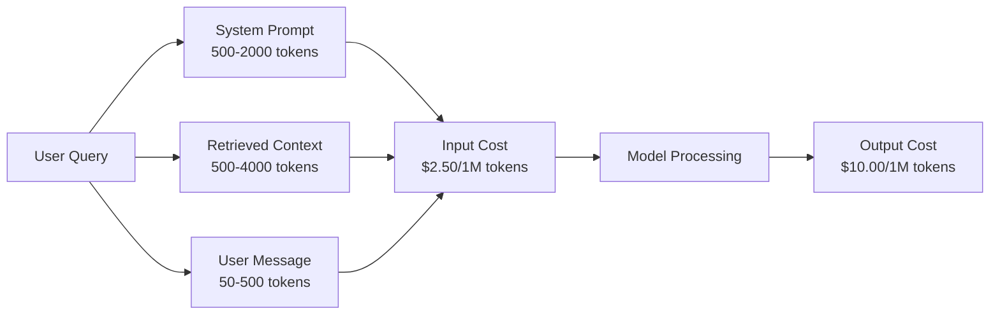
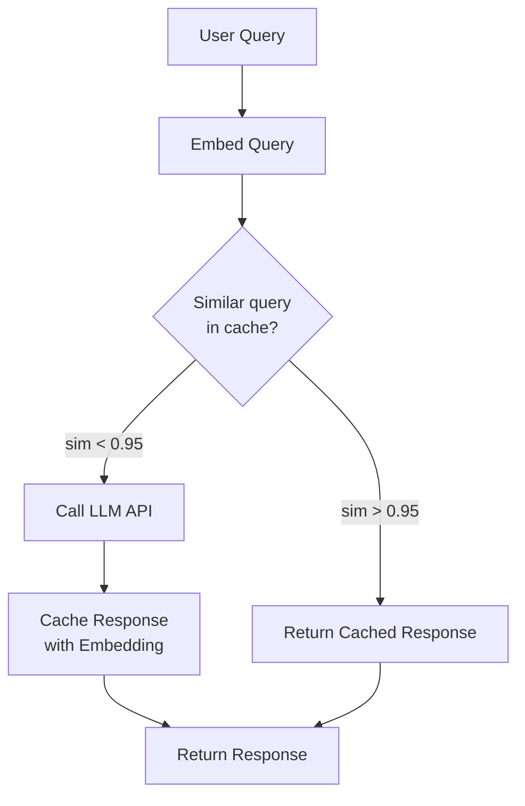
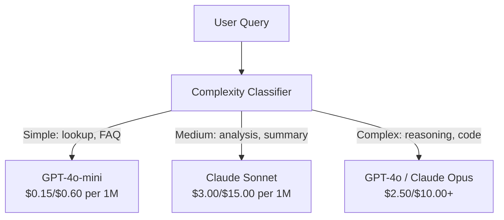

# Caching, Rate Limiting & Cost Optimization

> معظم الشركات الناشئة AI لا تموت بسبب نماذج سيئة. يموتون من اقتصاديات الوحدة السيئة. مكالمة واحدة GPT-4o تكلف كسورًا من السنت. يكلف إجراء عشرة آلاف مستخدم عشر مكالمات يوميًا 250 دولارًا من رموز الإدخال فقط - قبل أن تتقاضى دولارًا واحدًا. الشركات التي تبقى على قيد الحياة هي تلك التي تتعامل مع كل مكالمة API على أنها معاملة مالية، وليس مكالمة وظيفية.

**النوع:** بناء
** اللغات: ** بايثون
**المتطلبات الأساسية:** المرحلة 11 الدرس 09 (استدعاء الوظيفة)
**الوقت:** ~45 دقيقة
**ذات صلة:** المرحلة 11 · 15 (التخزين المؤقت الفوري) — يغطي هذا الدرس التخزين المؤقت لطبقة التطبيق (ذاكرة التخزين المؤقت الدلالية، وذاكرة التخزين المؤقت للتجزئة الدقيقة، وتوجيه النموذج). يغطي الدرس 15 التخزين المؤقت السريع لطبقة الموفر (Anthropic Cache_control، OpenAI تلقائي، Gemini CachedContent). اجمع بين الاثنين لتخفيض التكلفة بنسبة 50-95%.

## Learning Objectives

- تنفيذ التخزين المؤقت الدلالي الذي يخدم الاستعلامات المتكررة أو المشابهة من ذاكرة التخزين المؤقت بدلاً من إجراء مكالمة API جديدة
- حساب تكاليف كل طلب عبر مقدمي الخدمة وتنفيذ تحديد معدل التعرف على الرمز المميز وتنبيهات الميزانية
- إنشاء طبقة تحسين التكلفة من خلال الضغط الفوري، وتوجيه النموذج (باهظ الثمن مقابل الرخيص)، والتخزين المؤقت للاستجابة
- تصميم إستراتيجية تخزين مؤقت متدرجة باستخدام المطابقة التامة والتشابه الدلالي والتخزين المؤقت للبادئة لأنواع الاستعلام المختلفة

## The Problem

يمكنك بناء RAG chatbot. إنه يعمل بشكل جميل. المستخدمين يحبون ذلك.

ثم تصل الفاتورة.

GPT-5 تكلف 5 دولارات لكل مليون رمز إدخال و15 دولارًا لكل مليون مخرج. تبلغ تكلفة Claude Opus 4.7 15 دولارًا للإدخال / 75 دولارًا للإخراج. تبلغ تكلفة Gemini 3 Pro 1.25 دولارًا أمريكيًا للمدخلات / 5 دولارًا أمريكيًا للإخراج. GPT-5-ميني هو 0.25 دولار/2 دولار. الأسعار أدناه توضيحية؛ تحقق دائمًا من صفحة التسعير الحالية للمزود.

هذه هي الرياضيات التي تقتل الشركات الناشئة:

- 10000 مستخدم نشط يوميا
- 10 استفسارات لكل مستخدم يوميًا
- 1000 رمز إدخال لكل استعلام (موجه النظام + السياق + رسالة المستخدم)
- 500 رمز إخراج لكل استجابة

**تكلفة الإدخال اليومية:** 10,000 × 10 × 1,000 / 1,000,000 × 2.50 دولار = **250 دولارًا في اليوم**
**تكلفة الإنتاج اليومية:** 10,000 × 10 × 500 / 1,000,000 × 10.00 دولار = **500 دولار في اليوم**
**الإجمالي الشهري:** **22,500 دولار شهريًا**

هذا مجرد LLM. أضف التضمينات واستضافة قاعدة بيانات المتجهات والبنية التحتية. أنت تبحث عن 30 ألف دولار شهريًا مقابل برنامج الدردشة الآلي.

الجزء الوحشي: 40-60% من تلك الاستعلامات شبه مكررة. يطرح المستخدمون نفس الأسئلة بكلمات مختلفة قليلاً. تتم محاسبتك على مطالبة النظام الخاصة بك - المتماثلة في كل طلب - في كل مرة. تتكرر مستندات السياق التي يتم استردادها بواسطة RAG عبر المستخدمين الذين يسألون عن نفس الموضوع.

أنت تدفع الثمن الكامل للحسابات الزائدة عن الحاجة.

## The Concept

### The Cost Anatomy of an LLM Call

تحتوي كل مكالمة API على خمسة مكونات تكلفة.



مطالبات النظام هي القاتل الصامت. تبلغ تكلفة إرسال 1500 رمز مميز مع كل طلب 3.75 دولارًا لكل مليون طلب لهذه البادئة فقط. عند 100 ألف طلب يوميًا، يعني ذلك 375 دولارًا أمريكيًا في اليوم - 11.250 دولارًا أمريكيًا في الشهر - للنص الذي لا يتغير أبدًا.

### Provider Caching: Built-in Discounts

يقدم جميع المزودين الرئيسيين الثلاثة تخزينًا مؤقتًا سريعًا من جانب الموفر في عام 2026، لكن الآليات تختلف. راجع المرحلة 11 · 15 للتعمق أكثر.

| مقدم | آلية | خصم | الحد الأدنى | مدة ذاكرة التخزين المؤقت |
|----------|----------|----------|---------|----------------|
| انثروبي | علامات التحكم في ذاكرة التخزين المؤقت الصريحة | 90% على نتائج ذاكرة التخزين المؤقت (ادفع 25% إضافية عند الكتابة) | 1024 رمزًا (سونيت/أوبوس)، 2048 (هايكو) | 5 دقائق افتراضية؛ ساعة واحدة ممتدة (2x قسط الكتابة) |
| OpenAI | مطابقة البادئة التلقائية | 50% على نتائج ذاكرة التخزين المؤقت | 1,024 رمزًا | أفضل جهد يصل إلى ساعة واحدة |
| جوجل الجوزاء | محتوى مخبأ صريح API | تخفيض بنسبة 75% تقريبًا (بالإضافة إلى مساحة التخزين) | 4,096 (فلاش) / 32,768 (برو) | قابل للتكوين بواسطة المستخدم TTL |

**النهج الأنثروبي** واضح. يمكنك وضع علامة على أقسام المطالبة الخاصة بك بـ `cache_control: {"type": "ephemeral"}`. يدفع الطلب الأول علاوة كتابة بنسبة 25%. الطلبات اللاحقة بنفس البادئة تحصل على خصم 90%. إن مطالبة النظام المكونة من 2000 رمز والتي تكلف 0.005 دولارًا أمريكيًا تكلف عادةً 0.000625 دولارًا أمريكيًا عند الوصول إلى ذاكرة التخزين المؤقت. أكثر من 100 ألف طلب، مما يوفر 437.50 دولارًا في اليوم.

** نهج OpenAI ** تلقائي. أي بادئة مطالبة تطابق طلبًا سابقًا تحصل على خصم بنسبة 50%. لا حاجة إلى علامات. المقايضة: خصم أقل، سيطرة أقل، ولكن صفر جهد في التنفيذ.

### Semantic Caching: Your Custom Layer

يعمل التخزين المؤقت للموفر فقط مع البادئات المتطابقة. يتعامل التخزين المؤقت الدلالي مع الحالة الأصعب: استعلامات مختلفة لها نفس المعنى.

"ما هي سياسة العودة؟" و"كيف يمكنني إرجاع السلعة؟" هي سلاسل مختلفة ولكن النية متطابقة. تقوم ذاكرة التخزين المؤقت الدلالية بتضمين كلا الاستعلامين، وتحسب تشابه جيب التمام، وترجع الاستجابة المخزنة مؤقتًا إذا تجاوز التشابه العتبة (عادةً 0.92-0.95).



تكاليف التضمين لا تذكر. تبلغ تكلفة تضمين النص 3-small لـ OpenAI 0.02 دولارًا لكل مليون رمز مميز. لا يكلف التحقق من ذاكرة التخزين المؤقت شيئًا تقريبًا مقارنة بمكالمة LLM كاملة.

### Exact Caching: Hash and Match

بالنسبة للمكالمات الحتمية (درجة الحرارة = 0، نفس الطراز، نفس المطالبة)، يكون التخزين المؤقت الدقيق أبسط وأسرع. قم بتجزئة المطالبة الكاملة، وتحقق من ذاكرة التخزين المؤقت، وقم بإعادتها إذا تم العثور عليها.

هذا يعمل بشكل مثالي من أجل:
- موجه النظام + سياق ثابت + استعلامات مستخدم متطابقة
- استدعاء الوظائف مع تعريفات أداة متطابقة
- المعالجة المجمعة حيث تتم معالجة نفس المستند عدة مرات

### Rate Limiting: Protecting Your Budget

إن تحديد المعدل لا يتعلق فقط بالعدالة. إنه يتعلق بالبقاء.

**خوارزمية مجموعة الرموز المميزة:** يحصل كل مستخدم على مجموعة من رموز N التي تتم إعادة تعبئتها بمعدل R في الثانية. يستهلك الطلب الرموز المميزة من المجموعة. إذا كانت الحاوية فارغة، فسيتم رفض الطلب. يسمح هذا بالدفعات (استخدم المجموعة الكاملة مرة واحدة) مع فرض معدل متوسط.

**الحصص لكل مستخدم:** قم بتعيين حدود الرموز المميزة اليومية/الشهرية لكل طبقة مستخدم.

| الطبقة | حد الرمز اليومي | الحد الأقصى للطلبات/الدقيقة | الوصول للنموذج |
|------|------------------|------------------|-------------|
| مجاني | 50,000 | 10 | GPT-4o-ميني فقط |
| برو | 500,000 | 60 | GPT-4o، كلود سونيت |
| مؤسسة | 5,000,000 | 300 | جميع الموديلات |

### Model Routing: Right Model for the Right Job

ليس كل استعلام يحتاج إلى GPT-4o.

"في أي وقت يغلق المتجر؟" لا يتطلب نموذج إخراج بقيمة 10 دولارات/م. GPT-4o-mini بسعر 0.60 دولار/م يعالجها بشكل مثالي. كلود هايكو بإنتاج 1.25 دولار/م يتعامل معها. يقوم المصنف البسيط بتوجيه الاستعلامات الرخيصة إلى النماذج الرخيصة والاستعلامات المعقدة إلى النماذج باهظة الثمن.



يوفر جهاز التوجيه المضبوط جيدًا ما بين 40 إلى 70% من تكاليف الطراز وحده.

### Cost Tracking: Know Where the Money Goes

لا يمكنك تحسين ما لا تقيسه. سجل كل مكالمة API باستخدام:

- الطابع الزمني
- اسم الموديل
- رموز الإدخال
- رموز الإخراج
- الكمون (مللي ثانية)
- التكلفة المحسوبة ($)
- المستخدم ID
- ضرب/ملكة جمال ذاكرة التخزين المؤقت
- فئة الطلب

تكشف هذه البيانات عن الميزات باهظة الثمن، وأي المستخدمين مستهلكون بكثرة، وأين يكون للتخزين المؤقت التأثير الأكبر.

### Batching: Bulk Discounts

تقوم دفعة OpenAI API بمعالجة الطلبات بشكل غير متزامن بخصم 50٪. يمكنك إرسال مجموعة تصل إلى 50000 طلب، وستظهر النتائج خلال 24 ساعة.

استخدم الخلط من أجل:
- معالجة المستندات ليلاً
- تصنيف السائبة
- يجري التقييم
- إثراء البيانات pipخطوط

ليس من أجل: الاستعلامات التي يواجهها المستخدم في الوقت الفعلي (مسألة زمن الوصول).

### Budget Alerts and Circuit Breakers

يتوقف قاطع الدائرة عن الإنفاق عندما تصل إلى الحد الأقصى. وبدون ذلك، يمكن أن يؤدي وجود خطأ أو سوء استخدام إلى استهلاك ميزانيتك الشهرية خلال ساعات.

تعيين ثلاث عتبات:
1. **تحذير** (70% من الميزانية): أرسل تنبيهًا
2. **الخنق** (85% من الميزانية): قم بالتبديل إلى الموديلات الأرخص فقط
3. **الإيقاف** (95% من الميزانية): رفض الطلبات الجديدة، وإرجاع الاستجابات المخزنة مؤقتًا فقط

### The Optimization Stack

قم بتطبيق هذه التقنيات بالترتيب. كل طبقة تتراكم على الطبقات السابقة.

| طبقة | تقنية | الادخار النموذجي | جهد التنفيذ |
|-------|-----------|----------------|------|
| 1 | مزود التخزين المؤقت الفوري | 30-50% | منخفض (إضافة علامات ذاكرة التخزين المؤقت) |
| 2 | التخزين المؤقت الدقيق | 10-20% | منخفض (التجزئة + الإملاء) |
| 3 | التخزين المؤقت الدلالي | 15-30% | المتوسطة (التضمينات + التشابه) |
| 4 | توجيه النموذج | 40-70% | المتوسطة (المصنف) |
| 5 | الحد من المعدل | حماية الميزانية | منخفض (دلو رمزي) |
| 6 | ضغط سريع | 10-30% | متوسط ​​(مطالبات إعادة الكتابة) |
| 7 | الخلط | 50% على المؤهلين | منخفض (الدفعة API) |

عادةً ما يؤدي تطبيق RAG الذي يطبق الطبقات من 1 إلى 5 إلى تقليل التكاليف من 22,500 دولار شهريًا إلى 4,000-6,000 دولار شهريًا. هذا هو الفرق بين حرق المدرج وبناء الأعمال التجارية.

### Real Savings: Before and After

فيما يلي تفصيل حقيقي لروبوت الدردشة RAG الذي يخدم 10000 DAU.

| متري | قبل التحسين | بعد التحسين | التوفير |
|--------|--------------------|-------------------|--------|
| التكلفة الشهرية LLM | 22,500 دولار | 5200 دولار | 77% |
| متوسط ​​التكلفة لكل استعلام | 0.0075 دولار | 0.0017 دولار | 77% |
| معدل ضرب ذاكرة التخزين المؤقت | 0% | 52% | -- |
| يتم توجيه الاستعلامات إلى mini | 0% | 65% | -- |
| P95 الكمون | 2800 مللي ثانية | 900 مللي ثانية (عدد زيارات ذاكرة التخزين المؤقت: 50 مللي ثانية) | 68% |
| تكلفة التضمين الشهرية | $0 | 180 دولارًا | (تكلفة جديدة) |
| إجمالي التكلفة الشهرية | 22,500 دولار | 5,380 دولار | 76% |

تكلفة التضمين للتخزين المؤقت الدلالي (180 دولارًا شهريًا) تُدفع لنفسها خلال الساعة الأولى من نتائج ذاكرة التخزين المؤقت.

## Build It

### Step 1: Cost Calculator

أنشئ حاسبة تكلفة رمزية تعرف الأسعار الحالية للنماذج الرئيسية.

```python
import hashlib
import time
import json
import math
from dataclasses import dataclass, field


MODEL_PRICING = {
    "gpt-4o": {"input": 2.50, "output": 10.00, "cached_input": 1.25},
    "gpt-4o-mini": {"input": 0.15, "output": 0.60, "cached_input": 0.075},
    "gpt-4.1": {"input": 2.00, "output": 8.00, "cached_input": 0.50},
    "gpt-4.1-mini": {"input": 0.40, "output": 1.60, "cached_input": 0.10},
    "gpt-4.1-nano": {"input": 0.10, "output": 0.40, "cached_input": 0.025},
    "o3": {"input": 2.00, "output": 8.00, "cached_input": 0.50},
    "o3-mini": {"input": 1.10, "output": 4.40, "cached_input": 0.55},
    "o4-mini": {"input": 1.10, "output": 4.40, "cached_input": 0.275},
    "claude-opus-4": {"input": 15.00, "output": 75.00, "cached_input": 1.50},
    "claude-sonnet-4": {"input": 3.00, "output": 15.00, "cached_input": 0.30},
    "claude-haiku-3.5": {"input": 0.80, "output": 4.00, "cached_input": 0.08},
    "gemini-2.5-pro": {"input": 1.25, "output": 10.00, "cached_input": 0.3125},
    "gemini-2.5-flash": {"input": 0.15, "output": 0.60, "cached_input": 0.0375},
}


def calculate_cost(model, input_tokens, output_tokens, cached_input_tokens=0):
    if model not in MODEL_PRICING:
        return {"error": f"Unknown model: {model}"}
    pricing = MODEL_PRICING[model]
    non_cached = input_tokens - cached_input_tokens
    input_cost = (non_cached / 1_000_000) * pricing["input"]
    cached_cost = (cached_input_tokens / 1_000_000) * pricing["cached_input"]
    output_cost = (output_tokens / 1_000_000) * pricing["output"]
    total = input_cost + cached_cost + output_cost
    return {
        "model": model,
        "input_tokens": input_tokens,
        "output_tokens": output_tokens,
        "cached_input_tokens": cached_input_tokens,
        "input_cost": round(input_cost, 6),
        "cached_input_cost": round(cached_cost, 6),
        "output_cost": round(output_cost, 6),
        "total_cost": round(total, 6),
    }
```

### Step 2: Exact Cache

قم بتجزئة المطالبة الكاملة وإرجاع الاستجابات المخزنة مؤقتًا للطلبات المتطابقة.

```python
class ExactCache:
    def __init__(self, max_size=1000, ttl_seconds=3600):
        self.cache = {}
        self.max_size = max_size
        self.ttl = ttl_seconds
        self.hits = 0
        self.misses = 0

    def _hash(self, model, messages, temperature):
        key_data = json.dumps({"model": model, "messages": messages, "temperature": temperature}, sort_keys=True)
        return hashlib.sha256(key_data.encode()).hexdigest()

    def get(self, model, messages, temperature=0.0):
        if temperature > 0:
            self.misses += 1
            return None
        key = self._hash(model, messages, temperature)
        if key in self.cache:
            entry = self.cache[key]
            if time.time() - entry["timestamp"] < self.ttl:
                self.hits += 1
                entry["access_count"] += 1
                return entry["response"]
            del self.cache[key]
        self.misses += 1
        return None

    def put(self, model, messages, temperature, response):
        if temperature > 0:
            return
        if len(self.cache) >= self.max_size:
            oldest_key = min(self.cache, key=lambda k: self.cache[k]["timestamp"])
            del self.cache[oldest_key]
        key = self._hash(model, messages, temperature)
        self.cache[key] = {
            "response": response,
            "timestamp": time.time(),
            "access_count": 1,
        }

    def stats(self):
        total = self.hits + self.misses
        return {
            "hits": self.hits,
            "misses": self.misses,
            "hit_rate": round(self.hits / total, 4) if total > 0 else 0,
            "cache_size": len(self.cache),
        }
```

### Step 3: Semantic Cache

قم بتضمين الاستعلامات وإرجاع الاستجابات المخزنة مؤقتًا عندما يتجاوز التشابه الحد الأدنى.

```python
def simple_embed(text):
    words = text.lower().split()
    vocab = {}
    for w in words:
        vocab[w] = vocab.get(w, 0) + 1
    norm = math.sqrt(sum(v * v for v in vocab.values()))
    if norm == 0:
        return {}
    return {k: v / norm for k, v in vocab.items()}


def cosine_similarity(a, b):
    if not a or not b:
        return 0.0
    all_keys = set(a) | set(b)
    dot = sum(a.get(k, 0) * b.get(k, 0) for k in all_keys)
    return dot


class SemanticCache:
    def __init__(self, similarity_threshold=0.85, max_size=500, ttl_seconds=3600):
        self.entries = []
        self.threshold = similarity_threshold
        self.max_size = max_size
        self.ttl = ttl_seconds
        self.hits = 0
        self.misses = 0

    def get(self, query):
        query_embedding = simple_embed(query)
        now = time.time()
        best_match = None
        best_sim = 0.0
        for entry in self.entries:
            if now - entry["timestamp"] > self.ttl:
                continue
            sim = cosine_similarity(query_embedding, entry["embedding"])
            if sim > best_sim:
                best_sim = sim
                best_match = entry
        if best_match and best_sim >= self.threshold:
            self.hits += 1
            best_match["access_count"] += 1
            return {"response": best_match["response"], "similarity": round(best_sim, 4), "original_query": best_match["query"]}
        self.misses += 1
        return None

    def put(self, query, response):
        if len(self.entries) >= self.max_size:
            self.entries.sort(key=lambda e: e["timestamp"])
            self.entries.pop(0)
        self.entries.append({
            "query": query,
            "embedding": simple_embed(query),
            "response": response,
            "timestamp": time.time(),
            "access_count": 1,
        })

    def stats(self):
        total = self.hits + self.misses
        return {
            "hits": self.hits,
            "misses": self.misses,
            "hit_rate": round(self.hits / total, 4) if total > 0 else 0,
            "cache_size": len(self.entries),
        }
```

### Step 4: Rate Limiter

محدد معدل مجموعة الرمز المميز مع الحصص لكل مستخدم.

```python
class TokenBucketRateLimiter:
    def __init__(self):
        self.buckets = {}
        self.tiers = {
            "free": {"capacity": 50_000, "refill_rate": 500, "max_requests_per_min": 10},
            "pro": {"capacity": 500_000, "refill_rate": 5_000, "max_requests_per_min": 60},
            "enterprise": {"capacity": 5_000_000, "refill_rate": 50_000, "max_requests_per_min": 300},
        }

    def _get_bucket(self, user_id, tier="free"):
        if user_id not in self.buckets:
            tier_config = self.tiers.get(tier, self.tiers["free"])
            self.buckets[user_id] = {
                "tokens": tier_config["capacity"],
                "capacity": tier_config["capacity"],
                "refill_rate": tier_config["refill_rate"],
                "last_refill": time.time(),
                "request_timestamps": [],
                "max_rpm": tier_config["max_requests_per_min"],
                "tier": tier,
                "total_tokens_used": 0,
            }
        return self.buckets[user_id]

    def _refill(self, bucket):
        now = time.time()
        elapsed = now - bucket["last_refill"]
        refill = int(elapsed * bucket["refill_rate"])
        if refill > 0:
            bucket["tokens"] = min(bucket["capacity"], bucket["tokens"] + refill)
            bucket["last_refill"] = now

    def check(self, user_id, tokens_needed, tier="free"):
        bucket = self._get_bucket(user_id, tier)
        self._refill(bucket)
        now = time.time()
        bucket["request_timestamps"] = [t for t in bucket["request_timestamps"] if now - t < 60]
        if len(bucket["request_timestamps"]) >= bucket["max_rpm"]:
            return {"allowed": False, "reason": "rate_limit", "retry_after_seconds": 60 - (now - bucket["request_timestamps"][0])}
        if bucket["tokens"] < tokens_needed:
            deficit = tokens_needed - bucket["tokens"]
            wait = deficit / bucket["refill_rate"]
            return {"allowed": False, "reason": "token_limit", "tokens_available": bucket["tokens"], "retry_after_seconds": round(wait, 1)}
        return {"allowed": True, "tokens_available": bucket["tokens"]}

    def consume(self, user_id, tokens_used, tier="free"):
        bucket = self._get_bucket(user_id, tier)
        bucket["tokens"] -= tokens_used
        bucket["request_timestamps"].append(time.time())
        bucket["total_tokens_used"] += tokens_used

    def get_usage(self, user_id):
        if user_id not in self.buckets:
            return {"error": "User not found"}
        b = self.buckets[user_id]
        return {
            "user_id": user_id,
            "tier": b["tier"],
            "tokens_remaining": b["tokens"],
            "capacity": b["capacity"],
            "total_tokens_used": b["total_tokens_used"],
            "utilization": round(b["total_tokens_used"] / b["capacity"], 4) if b["capacity"] else 0,
        }
```

### Step 5: Cost Tracker

تسجيل كل مكالمة وحساب المجاميع الجارية.

```python
class CostTracker:
    def __init__(self, monthly_budget=1000.0):
        self.logs = []
        self.monthly_budget = monthly_budget
        self.alerts = []

    def log_call(self, model, input_tokens, output_tokens, cached_input_tokens=0, latency_ms=0, user_id="anonymous", cache_status="miss"):
        cost = calculate_cost(model, input_tokens, output_tokens, cached_input_tokens)
        entry = {
            "timestamp": time.time(),
            "model": model,
            "input_tokens": input_tokens,
            "output_tokens": output_tokens,
            "cached_input_tokens": cached_input_tokens,
            "latency_ms": latency_ms,
            "cost": cost["total_cost"],
            "user_id": user_id,
            "cache_status": cache_status,
        }
        self.logs.append(entry)
        self._check_budget()
        return entry

    def _check_budget(self):
        total = self.total_cost()
        pct = total / self.monthly_budget if self.monthly_budget > 0 else 0
        if pct >= 0.95 and not any(a["level"] == "stop" for a in self.alerts):
            self.alerts.append({"level": "stop", "message": f"Budget 95% consumed: ${total:.2f}/${self.monthly_budget:.2f}", "timestamp": time.time()})
        elif pct >= 0.85 and not any(a["level"] == "throttle" for a in self.alerts):
            self.alerts.append({"level": "throttle", "message": f"Budget 85% consumed: ${total:.2f}/${self.monthly_budget:.2f}", "timestamp": time.time()})
        elif pct >= 0.70 and not any(a["level"] == "warning" for a in self.alerts):
            self.alerts.append({"level": "warning", "message": f"Budget 70% consumed: ${total:.2f}/${self.monthly_budget:.2f}", "timestamp": time.time()})

    def total_cost(self):
        return round(sum(e["cost"] for e in self.logs), 6)

    def cost_by_model(self):
        by_model = {}
        for e in self.logs:
            m = e["model"]
            if m not in by_model:
                by_model[m] = {"calls": 0, "cost": 0, "input_tokens": 0, "output_tokens": 0}
            by_model[m]["calls"] += 1
            by_model[m]["cost"] = round(by_model[m]["cost"] + e["cost"], 6)
            by_model[m]["input_tokens"] += e["input_tokens"]
            by_model[m]["output_tokens"] += e["output_tokens"]
        return by_model

    def cache_savings(self):
        cache_hits = [e for e in self.logs if e["cache_status"] == "hit"]
        if not cache_hits:
            return {"saved": 0, "cache_hits": 0}
        saved = 0
        for e in cache_hits:
            full_cost = calculate_cost(e["model"], e["input_tokens"], e["output_tokens"])
            saved += full_cost["total_cost"]
        return {"saved": round(saved, 4), "cache_hits": len(cache_hits)}

    def summary(self):
        if not self.logs:
            return {"total_calls": 0, "total_cost": 0}
        total_latency = sum(e["latency_ms"] for e in self.logs)
        cache_hits = sum(1 for e in self.logs if e["cache_status"] == "hit")
        return {
            "total_calls": len(self.logs),
            "total_cost": self.total_cost(),
            "avg_cost_per_call": round(self.total_cost() / len(self.logs), 6),
            "avg_latency_ms": round(total_latency / len(self.logs), 1),
            "cache_hit_rate": round(cache_hits / len(self.logs), 4),
            "cost_by_model": self.cost_by_model(),
            "cache_savings": self.cache_savings(),
            "budget_remaining": round(self.monthly_budget - self.total_cost(), 2),
            "budget_utilization": round(self.total_cost() / self.monthly_budget, 4) if self.monthly_budget > 0 else 0,
            "alerts": self.alerts,
        }
```

### Step 6: Model Router

قم بتوجيه الاستعلامات إلى النموذج الأرخص الذي يمكنه التعامل معها.

```python
SIMPLE_KEYWORDS = ["what time", "hours", "address", "phone", "price", "return policy", "hello", "hi", "thanks", "yes", "no"]
COMPLEX_KEYWORDS = ["analyze", "compare", "explain why", "write code", "debug", "architect", "design", "trade-off", "evaluate"]


def classify_complexity(query):
    q = query.lower()
    if len(q.split()) <= 5 or any(kw in q for kw in SIMPLE_KEYWORDS):
        return "simple"
    if any(kw in q for kw in COMPLEX_KEYWORDS):
        return "complex"
    return "medium"


def route_model(query, tier="pro"):
    complexity = classify_complexity(query)
    routing_table = {
        "simple": {"free": "gpt-4.1-nano", "pro": "gpt-4o-mini", "enterprise": "gpt-4o-mini"},
        "medium": {"free": "gpt-4o-mini", "pro": "claude-sonnet-4", "enterprise": "claude-sonnet-4"},
        "complex": {"free": "gpt-4o-mini", "pro": "gpt-4o", "enterprise": "claude-opus-4"},
    }
    model = routing_table[complexity].get(tier, "gpt-4o-mini")
    return {"query": query, "complexity": complexity, "model": model, "tier": tier}
```

### Step 7: Run the Demo

```python
def simulate_llm_call(model, query):
    input_tokens = len(query.split()) * 4 + 500
    output_tokens = 150 + (len(query.split()) * 2)
    latency = 200 + (output_tokens * 2)
    return {
        "model": model,
        "response": f"[Simulated {model} response to: {query[:50]}...]",
        "input_tokens": input_tokens,
        "output_tokens": output_tokens,
        "latency_ms": latency,
    }


def run_demo():
    print("=" * 60)
    print("  Caching, Rate Limiting & Cost Optimization Demo")
    print("=" * 60)

    print("\n--- Model Pricing ---")
    for model, pricing in list(MODEL_PRICING.items())[:6]:
        cost_1k = calculate_cost(model, 1000, 500)
        print(f"  {model}: ${cost_1k['total_cost']:.6f} per 1K in + 500 out")

    print("\n--- Cost Comparison: 100K Requests ---")
    for model in ["gpt-4o", "gpt-4o-mini", "claude-sonnet-4", "claude-haiku-3.5"]:
        cost = calculate_cost(model, 1000 * 100_000, 500 * 100_000)
        print(f"  {model}: ${cost['total_cost']:.2f}")

    print("\n--- Anthropic Cache Savings ---")
    no_cache = calculate_cost("claude-sonnet-4", 2000, 500, 0)
    with_cache = calculate_cost("claude-sonnet-4", 2000, 500, 1500)
    saving = no_cache["total_cost"] - with_cache["total_cost"]
    print(f"  Without cache: ${no_cache['total_cost']:.6f}")
    print(f"  With 1500 cached tokens: ${with_cache['total_cost']:.6f}")
    print(f"  Savings per call: ${saving:.6f} ({saving/no_cache['total_cost']*100:.1f}%)")

    exact_cache = ExactCache(max_size=100, ttl_seconds=300)
    semantic_cache = SemanticCache(similarity_threshold=0.75, max_size=100)
    rate_limiter = TokenBucketRateLimiter()
    tracker = CostTracker(monthly_budget=100.0)

    print("\n--- Exact Cache ---")
    messages_1 = [{"role": "user", "content": "What is the return policy?"}]
    result = exact_cache.get("gpt-4o-mini", messages_1, 0.0)
    print(f"  First lookup: {'HIT' if result else 'MISS'}")
    exact_cache.put("gpt-4o-mini", messages_1, 0.0, "You can return items within 30 days.")
    result = exact_cache.get("gpt-4o-mini", messages_1, 0.0)
    print(f"  Second lookup: {'HIT' if result else 'MISS'} -> {result}")
    result = exact_cache.get("gpt-4o-mini", messages_1, 0.7)
    print(f"  With temp=0.7: {'HIT' if result else 'MISS (non-deterministic, skip cache)'}")
    print(f"  Stats: {exact_cache.stats()}")

    print("\n--- Semantic Cache ---")
    test_queries = [
        ("What is the return policy?", "Items can be returned within 30 days with receipt."),
        ("How do I return an item?", None),
        ("What are your store hours?", "We are open 9am-9pm Monday through Saturday."),
        ("When does the store open?", None),
        ("Tell me about quantum computing", "Quantum computers use qubits..."),
        ("Explain quantum mechanics", None),
    ]
    for query, response in test_queries:
        cached = semantic_cache.get(query)
        if cached:
            print(f"  '{query[:40]}' -> CACHE HIT (sim={cached['similarity']}, original='{cached['original_query'][:40]}')")
        elif response:
            semantic_cache.put(query, response)
            print(f"  '{query[:40]}' -> MISS (stored)")
        else:
            print(f"  '{query[:40]}' -> MISS (no match)")
    print(f"  Stats: {semantic_cache.stats()}")

    print("\n--- Rate Limiting ---")
    for i in range(12):
        check = rate_limiter.check("user_1", 1000, "free")
        if check["allowed"]:
            rate_limiter.consume("user_1", 1000, "free")
        status = "OK" if check["allowed"] else f"BLOCKED ({check['reason']})"
        if i < 5 or not check["allowed"]:
            print(f"  Request {i+1}: {status}")
    print(f"  Usage: {rate_limiter.get_usage('user_1')}")

    print("\n--- Model Routing ---")
    routing_queries = [
        "What time do you close?",
        "Summarize this quarterly earnings report",
        "Analyze the trade-offs between microservices and monoliths",
        "Hello",
        "Write code for a binary search tree with deletion",
    ]
    for q in routing_queries:
        route = route_model(q, "pro")
        print(f"  '{q[:50]}' -> {route['model']} ({route['complexity']})")

    print("\n--- Full Pipeline: Before vs After Optimization ---")
    queries = [
        "What is the return policy?",
        "How do I return something?",
        "What are your hours?",
        "When do you open?",
        "Explain the difference between TCP and UDP",
        "Compare TCP vs UDP protocols",
        "Hello",
        "What is your phone number?",
        "Write a Python function to sort a list",
        "Analyze the pros and cons of serverless architecture",
    ]

    print("\n  [Before: no caching, single model (gpt-4o)]")
    tracker_before = CostTracker(monthly_budget=1000.0)
    for q in queries:
        result = simulate_llm_call("gpt-4o", q)
        tracker_before.log_call("gpt-4o", result["input_tokens"], result["output_tokens"], latency_ms=result["latency_ms"], cache_status="miss")
    before = tracker_before.summary()
    print(f"  Total cost: ${before['total_cost']:.6f}")
    print(f"  Avg cost/call: ${before['avg_cost_per_call']:.6f}")
    print(f"  Avg latency: {before['avg_latency_ms']}ms")

    print("\n  [After: caching + routing + rate limiting]")
    exact_c = ExactCache()
    semantic_c = SemanticCache(similarity_threshold=0.75)
    tracker_after = CostTracker(monthly_budget=1000.0)

    for q in queries:
        messages = [{"role": "user", "content": q}]
        cached = exact_c.get("gpt-4o", messages, 0.0)
        if cached:
            tracker_after.log_call("gpt-4o-mini", 0, 0, latency_ms=5, cache_status="hit")
            continue
        sem_cached = semantic_c.get(q)
        if sem_cached:
            tracker_after.log_call("gpt-4o-mini", 0, 0, latency_ms=15, cache_status="hit")
            continue
        route = route_model(q)
        result = simulate_llm_call(route["model"], q)
        tracker_after.log_call(route["model"], result["input_tokens"], result["output_tokens"], latency_ms=result["latency_ms"], cache_status="miss")
        exact_c.put(route["model"], messages, 0.0, result["response"])
        semantic_c.put(q, result["response"])

    after = tracker_after.summary()
    print(f"  Total cost: ${after['total_cost']:.6f}")
    print(f"  Avg cost/call: ${after['avg_cost_per_call']:.6f}")
    print(f"  Avg latency: {after['avg_latency_ms']}ms")
    print(f"  Cache hit rate: {after['cache_hit_rate']:.0%}")

    if before["total_cost"] > 0:
        savings_pct = (1 - after["total_cost"] / before["total_cost"]) * 100
        print(f"\n  SAVINGS: {savings_pct:.1f}% cost reduction")
        print(f"  Latency improvement: {(1 - after['avg_latency_ms'] / before['avg_latency_ms']) * 100:.1f}% faster")

    print("\n--- Budget Alerts Demo ---")
    alert_tracker = CostTracker(monthly_budget=0.01)
    for i in range(5):
        alert_tracker.log_call("gpt-4o", 5000, 2000, latency_ms=500)
    print(f"  Total spent: ${alert_tracker.total_cost():.6f} / ${alert_tracker.monthly_budget}")
    for alert in alert_tracker.alerts:
        print(f"  ALERT [{alert['level'].upper()}]: {alert['message']}")

    print("\n--- Cost Breakdown by Model ---")
    multi_tracker = CostTracker(monthly_budget=500.0)
    for _ in range(50):
        multi_tracker.log_call("gpt-4o-mini", 800, 200, latency_ms=150)
    for _ in range(30):
        multi_tracker.log_call("claude-sonnet-4", 1500, 500, latency_ms=400)
    for _ in range(10):
        multi_tracker.log_call("gpt-4o", 2000, 800, latency_ms=600)
    for _ in range(10):
        multi_tracker.log_call("claude-opus-4", 3000, 1000, latency_ms=1200)
    breakdown = multi_tracker.cost_by_model()
    for model, data in sorted(breakdown.items(), key=lambda x: x[1]["cost"], reverse=True):
        print(f"  {model}: {data['calls']} calls, ${data['cost']:.6f}, {data['input_tokens']:,} in / {data['output_tokens']:,} out")
    print(f"  Total: ${multi_tracker.total_cost():.6f}")

    print("\n" + "=" * 60)
    print("  Demo complete.")
    print("=" * 60)


if __name__ == "__main__":
    run_demo()
```

## Use It

### Anthropic Prompt Caching

```python
# import anthropic
#
# client = anthropic.Anthropic()
#
# response = client.messages.create(
#     model="claude-sonnet-4-20250514",
#     max_tokens=1024,
#     system=[
#         {
#             "type": "text",
#             "text": "You are a helpful customer support agent for Acme Corp...",
#             "cache_control": {"type": "ephemeral"},
#         }
#     ],
#     messages=[{"role": "user", "content": "What is the return policy?"}],
# )
#
# print(f"Input tokens: {response.usage.input_tokens}")
# print(f"Cache creation tokens: {response.usage.cache_creation_input_tokens}")
# print(f"Cache read tokens: {response.usage.cache_read_input_tokens}")
```

تتم كتابة المكالمة الأولى إلى ذاكرة التخزين المؤقت (علاوة بنسبة 25٪). تتم قراءة كل مكالمة لاحقة بنفس بادئة موجه النظام من ذاكرة التخزين المؤقت (خصم 90%). تستمر ذاكرة التخزين المؤقت لمدة 5 دقائق وتعيد ضبط المؤقت عند كل ضربة.

### OpenAI Automatic Caching

```python
# from openai import OpenAI
#
# client = OpenAI()
#
# response = client.chat.completions.create(
#     model="gpt-4o",
#     messages=[
#         {"role": "system", "content": "You are a helpful customer support agent..."},
#         {"role": "user", "content": "What is the return policy?"},
#     ],
# )
#
# print(f"Prompt tokens: {response.usage.prompt_tokens}")
# print(f"Cached tokens: {response.usage.prompt_tokens_details.cached_tokens}")
# print(f"Completion tokens: {response.usage.completion_tokens}")
```

OpenAI ذاكرة التخزين المؤقت تلقائيًا. أي بادئة مطالبة مكونة من أكثر من 1024 رمزًا مميزًا تتطابق مع طلب حديث تحصل على خصم بنسبة 50%. ليست هناك حاجة إلى تغييرات في التعليمات البرمجية - فقط حدد `prompt_tokens_details.cached_tokens` في الرد للتحقق من أنه يعمل.

### OpenAI Batch API

```python
# import json
# from openai import OpenAI
#
# client = OpenAI()
#
# requests = []
# for i, query in enumerate(queries):
#     requests.append({
#         "custom_id": f"request-{i}",
#         "method": "POST",
#         "url": "/v1/chat/completions",
#         "body": {
#             "model": "gpt-4o-mini",
#             "messages": [{"role": "user", "content": query}],
#         },
#     })
#
# with open("batch_input.jsonl", "w") as f:
#     for r in requests:
#         f.write(json.dumps(r) + "\n")
#
# batch_file = client.files.create(file=open("batch_input.jsonl", "rb"), purpose="batch")
# batch = client.batches.create(input_file_id=batch_file.id, endpoint="/v1/chat/completions", completion_window="24h")
# print(f"Batch ID: {batch.id}, Status: {batch.status}")
```

تمنح الدفعة API خصمًا ثابتًا بنسبة 50% على جميع الرموز. تصل النتائج خلال 24 ساعة. مثالي لأحمال العمل في غير الوقت الفعلي: التقييمات، ووضع علامات على البيانات، والتلخيص المجمع.

### Production Semantic Cache with Redis

```python
# import redis
# import numpy as np
# from openai import OpenAI
#
# r = redis.Redis()
# client = OpenAI()
#
# def get_embedding(text):
#     response = client.embeddings.create(model="text-embedding-3-small", input=text)
#     return response.data[0].embedding
#
# def semantic_cache_lookup(query, threshold=0.95):
#     query_emb = np.array(get_embedding(query))
#     keys = r.keys("cache:emb:*")
#     best_sim, best_key = 0, None
#     for key in keys:
#         stored_emb = np.frombuffer(r.get(key), dtype=np.float32)
#         sim = np.dot(query_emb, stored_emb) / (np.linalg.norm(query_emb) * np.linalg.norm(stored_emb))
#         if sim > best_sim:
#             best_sim, best_key = sim, key
#     if best_sim >= threshold and best_key:
#         response_key = best_key.decode().replace("cache:emb:", "cache:resp:")
#         return r.get(response_key).decode()
#     return None
```

في الإنتاج، استبدل المسح الخطي بفهرس متجه (Redis Vector Search أو Pinecone أو pgvector). يعمل المسح الخطي لأقل من 1000 إدخال. أبعد من ذلك، استخدم ANN (أقرب جار تقريبي) للبحث عن O(log n).

## Ship It

يُنتج هذا الدرس `outputs/prompt-cost-optimizer.md` — مطالبة قابلة لإعادة الاستخدام تحلل تطبيقك LLM وتوصي بتحسينات محددة في التكلفة مع التوفير المتوقع.

كما أنه ينتج أيضًا `outputs/skill-cost-patterns.md` - إطار عمل لاتخاذ القرار لاختيار استراتيجية التخزين المؤقت الصحيحة، وتكوين تحديد المعدل، وقواعد توجيه النموذج لحالة الاستخدام الخاصة بك.

## Exercises

1. ** تنفيذ LRU الإخلاء لذاكرة التخزين المؤقت الدلالية. ** استبدل الإخلاء الأقدم بالأقل استخدامًا مؤخرًا. تتبع آخر وقت وصول لكل إدخال وقم بطرد الإدخال ذي أقدم وقت وصول عندما تكون ذاكرة التخزين المؤقت ممتلئة. قارن معدلات النجاح بين الاستراتيجيتين عبر 100 استفسار.

2. **إنشاء أداة لتوقع التكلفة.** بالنظر إلى سجل API من المكالمات (سجلات CostTracker)، قم بتوقع التكلفة الشهرية استنادًا إلى متوسط ​​7 أيام. حساب لأنماط أيام الأسبوع/عطلة نهاية الأسبوع. قم بتشغيل تنبيه إذا تجاوزت التكلفة الشهرية المتوقعة الميزانية بأكثر من 20%.

3. **تنفيذ التخزين المؤقت الدلالي المتدرج.** استخدم حدين للتشابه: 0.98 للنتائج عالية الثقة (العودة فورًا) و0.90 للنتائج متوسطة الثقة (العودة مع إخلاء المسؤولية: "استنادًا إلى سؤال سابق مماثل..."). تتبع الطبقة التي جاءت منها كل نتيجة وقياس الاختلافات في رضا المستخدمين.

4. **قم ببناء مصنف توجيه النموذج.** استبدل المصنف القائم على الكلمات الرئيسية بآخر يعتمد على التضمين. قم بتضمين 50 استعلامًا مسمىًا (بسيط/متوسط/معقد)، ثم قم بتصنيف الاستعلامات الجديدة من خلال البحث عن أقرب مثال مسمى. قياس دقة التصنيف مقابل مجموعة اختبار مكونة من 20 استعلامًا.

5. **قم بتركيب قاطع دائرة بمستويات تدهور.** بميزانية قدرها 70%، قم بتسجيل تحذير. عند نسبة 85%، قم تلقائيًا بتحويل كافة المسارات إلى الطراز الأرخص (gpt-4o-mini). عند 95%، يتم عرض الاستجابات المخزنة مؤقتًا فقط ورفض الاستعلامات الجديدة. قم بالاختبار من خلال محاكاة 1000 طلب مقابل ميزانية قدرها 1.00 دولار وتحقق من تشغيل كل حد بشكل صحيح.

## Key Terms

| مصطلح | ماذا يقول الناس | ماذا يعني في الواقع |
|------|----------------|----------------------|
| التخزين المؤقت الفوري | "التخزين المؤقت لموجه النظام" | التخزين المؤقت على مستوى الموفر حيث تحصل بادئات المطالبة المتكررة على خصم (90% Anthropic، 50% OpenAI) - لا توجد تغييرات في التعليمات البرمجية لـ OpenAI، علامات صريحة لـ Anthropic |
| التخزين المؤقت الدلالي | "التخزين المؤقت الذكي" | تضمين الاستعلام، وحساب التشابه مع الاستعلامات السابقة، وإرجاع الاستجابة المخزنة مؤقتًا إذا تجاوز التشابه الحد - يلتقط إعادة الصياغة التي تفتقد المطابقة التامة |
| التخزين المؤقت الدقيق | "التخزين المؤقت للتجزئة" | تجزئة الموجه الكامل (النموذج + الرسائل + درجة الحرارة) وإرجاع الاستجابة المخزنة مؤقتًا لمدخلات متطابقة - يعمل فقط مع درجة الحرارة = 0 مكالمات حتمية |
| دلو رمزي | "محدد السعر" | خوارزمية حيث يكون لدى كل مستخدم مجموعة من الرموز N التي يتم إعادة تعبئتها بمعدل R في الثانية - تسمح بدفعات تصل إلى N مع فرض معدل متوسط ​​لـ R |
| توجيه النموذج | "التوجيه الرخيص" | استخدام المصنف لإرسال استعلامات بسيطة إلى نماذج رخيصة (GPT-4o-mini, Haiku) واستعلامات معقدة إلى نماذج باهظة الثمن (GPT-4o, Opus) - يوفر 40-70% من تكاليف النموذج |
| تتبع التكلفة | "القياس" | تسجيل كل API مكالمة مع النموذج والرموز المميزة وزمن الوصول والتكلفة والمستخدم ID حتى تعرف بالضبط أين تذهب الأموال والميزات باهظة الثمن |
| قاطع الدائرة | "مفتاح القتل" | تدهور الخدمة تلقائيًا (النماذج الأرخص، المخزنة مؤقتًا فقط) أو إيقاف الطلبات تمامًا عندما يقترب الإنفاق من حد الميزانية |
| الدفعة API | "الخصم بالجملة" | معالجة OpenAI غير المتزامنة بخصم 50% - أرسل ما يصل إلى 50000 طلب، واحصل على النتائج خلال 24 ساعة |
| ضغط سريع | "حمية رمزية" | إعادة كتابة مطالبات النظام والسياق لاستخدام عدد أقل من الرموز المميزة مع الحفاظ على المعنى - تكلفة المطالبات الأقصر أقل وغالبًا ما يكون أداؤها أفضل |
| معدل ضرب ذاكرة التخزين المؤقت | "كفاءة ذاكرة التخزين المؤقت" | النسبة المئوية للطلبات التي يتم تقديمها من ذاكرة التخزين المؤقت بدلاً من استدعاء LLM -- 40-60% نموذجية لروبوتات الدردشة الإنتاجية، مما يوفر التكلفة بشكل متناسب |

## Further Reading

- [Anthropic Prompt Caching Guide](https://docs.anthropic.com/en/docs/build-with-claude/prompt-caching) -- the official docs for Anthropic's explicit cache_control markers, pricing, and cache lifetime behavior
- [OpenAI Prompt Caching](https://platform.openai.com/docs/guides/prompt-caching) -- OpenAI's automatic caching, how to verify cache hits via usage fields, and minimum prefix lengths
- [OpenAI Batch API](https://platform.openai.com/docs/guides/batch) -- 50% discount for asynchronous processing, JSONLL format, 24-hour completion window, and 50K request limits
- [GPTCache](https://github.com/zilliztech/GPTCache) -- open-source semantic caching library supporting multiple embedding backends, vector stores, and eviction policies
- [Martian Model Router](https://docs.withmartian.com) -- production model routing that automatically selects the cheapest model capable of handling each query
- [Not Diamond](https://www.notdiamond.ai) -- ML-based model router that learns from your traffic patterns to optimize cost/quality tradeoffs across providers
- [Helicone](https://www.helicone.ai) -- LLM observability platform with cost tracking, caching, rate limiting, and budget alerts as a proxy layer
- [Dean & Barroso, "The Tail at Scale" (CACM 2013)](https://research.google/pubs/the-tail-at-scale/) -- زمن الوصول والإنتاجية والنسب المئوية TTFT/TPOT والطلبات المغطاة؛ نموذج التكلفة وراء "اختيار النموذج الأرخص الذي لا يزال يلبي P95."
- [Kwon et al., "Efficient Memory Management for Large Language Model Serving with PagedAttention" (SOSP 2023)](https://arxiv.org/abs/2309.06180) -- the vvLLM paper; why paged KV-cache + continuous batching beat naive servers 24× on throughput, the infra layer under "caching and cost."
- [Dao et al., "FlashAttention-2: Faster Attention with Better Parallelism and Work Partitioning" (ICLR 2024)](https://arxiv.org/abs/2307.08691) -- خفض التكلفة على مستوى النواة متعامد لتحفيز التخزين المؤقت؛ اقرأ جنبًا إلى جنب مع فك التشفير التخميني وGQA للحصول على صورة منحنى التكلفة الكاملة.
