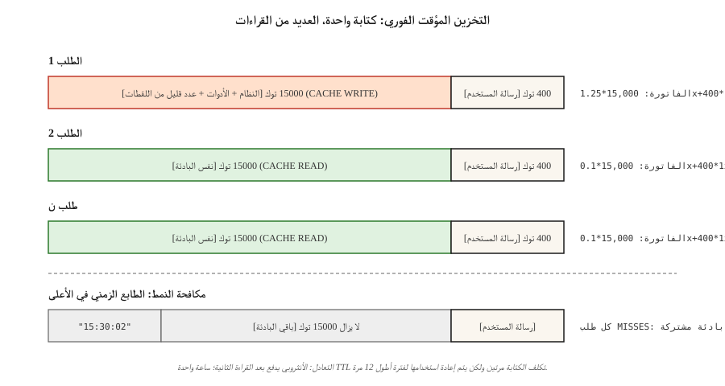

# التخزين المؤقت الفوري والتخزين المؤقت للسياق
> موجه النظام الخاص بك هو 4000 رمزًا. سياق RAG الخاص بك هو 20000 رمزًا مميزًا. يمكنك إرسال كليهما مع كل طلب. أنت تدفع أيضًا مقابل كليهما – في كل مرة. يتيح التخزين المؤقت الفوري للموفر الاحتفاظ بهذه البادئة دافئة من جانبه وتحصيل 10٪ من السعر العادي عند إعادة الاستخدام. إذا تم استخدامه بشكل صحيح، فإنه يقلل تكلفة الاستدلال بنسبة 50-90% ووقت الاستجابة للرمز الأول بنسبة 40-85%.
**النوع:** بناء
** اللغات: ** بايثون
** المتطلبات الأساسية: ** المرحلة 11 · 01 (الهندسة السريعة)، المرحلة 11 · 05 (هندسة السياق)، المرحلة 11 · 11 (التخزين المؤقت والتكلفة)
**الوقت:** ~60 دقيقة
## المشكلة
يرسل وكيل التشفير نفس نظام الـ 15000 رمز مميز إلى كلود في كل دورة من المحادثة. عشرين دورة بقيمة 3 دولارات أمريكية/مليون من رموز الإدخال هي 0.90 دولارًا أمريكيًا في تكلفة الإدخال وحدها - قبل أي من رسائل المستخدم الفعلية. اضرب في 10000 محادثة يومية وستصل الفاتورة إلى 9000 دولار يوميًا للنص الذي لا يتغير أبدًا.
لا يمكنك تقليص المطالبة دون الإضرار بالجودة. لا يمكنك تجنب إرساله - فالنموذج يحتاجه في كل منعطف. الخطوة الوحيدة هي التوقف عن دفع السعر الكامل للبادئة التي شاهدها المزود بالفعل.
هذه الخطوة هي التخزين المؤقت الفوري. قامت Anthropic بشحنها في أغسطس 2024 (مع متغير TTL ممتد لمدة ساعة واحدة في عام 2025)، وOpenAI في وقت لاحق من ذلك العام، وشحنت Google التخزين المؤقت للسياق الصريح جنبًا إلى جنب مع Gemini 1.5، وتقدمها الثلاثة الآن كميزة من الدرجة الأولى في نماذجهم الحدودية.
##المفهوم

**الآلية.** عندما تتطابق بادئة الطلب مع بادئة من طلب حديث، يقدم الموفر ذاكرة التخزين المؤقت KV من التشغيل السابق بدلاً من إعادة تشفير الرموز المميزة. أنت تدفع علاوة كتابة صغيرة في المرة الأولى وخصمًا كبيرًا على القراءة في كل مرة بعد ذلك.
**ثلاث نكهات مقدمة في عام 2026.**
| مقدم | API أسلوب | ضرب الخصم | اكتب قسط | الافتراضي TTL | دقيقة قابلة للتخزين المؤقت |
|---------|-----------|---------------|--------------|-------------|-------------|-------|------|------|------|------|------|
| انثروبي | علامات `cache_control` الصريحة على كتل المحتوى | خصم 90% على الإدخال | 25% رسوم إضافية | 5 دقائق (قابلة للتمديد إلى ساعة واحدة) | 1024 رمزًا (سونيت/أوبوس)، 2048 (هايكو) |
| OpenAI | الكشف التلقائي عن البادئة | خصم 50% على الإدخال | لا شيء | ما يصل إلى ساعة واحدة (أفضل جهد) | 1,024 رمزًا |
| جوجل (الجوزاء) | صريح `CachedContent` API | فاتورة التخزين؛ القراءة بنسبة ~ 25% من المعدل الطبيعي | رسوم التخزين لكل رمز مميز · ساعة | مجموعة المستخدم (افتراضي 1 ساعة) | 4,096 رمزًا (Flash)، 32,768 (Pro) |
**الثابت.** جميع بادئات ذاكرة التخزين المؤقت الثلاث فقط. إذا اختلف أي رمز مميز بين الطلبات، فكل شيء بعد الرمز المميز الأول المختلف يعد خطأً. ضع الأجزاء *الثابتة* في الأعلى، والأجزاء *المتغيرة* في الأسفل.
### التخطيط الصديق لذاكرة التخزين المؤقت
```
[system prompt]          <-- cache this
[tool definitions]       <-- cache this
[few-shot examples]      <-- cache this
[retrieved documents]    <-- cache if reused, else don't
[conversation history]   <-- cache up to last turn
[current user message]   <-- never cache (different every time)
```

قم بانتهاك الأمر - ضع رسالة المستخدم أعلى موجه النظام، وقم بتشذير عمليات الاسترجاع الديناميكية بين اللقطات القليلة - ولن تصل ذاكرة التخزين المؤقت أبدًا.
### حساب التعادل
إن علاوة الكتابة بنسبة 25% التي تقدمها Anthropic تعني أنه يجب قراءة الكتلة المخزنة مؤقتًا مرتين على الأقل لتوفير المال. كتابة واحدة + قراءة واحدة متوسط ​​تكلفة 0.675 مرة لكل طلب (يوفر 32%)؛ كتابة واحدة + 10 قراءة بمعدل 0.205x (يوفر 80%). القاعدة الأساسية: قم بتخزين أي شيء تتوقع إعادة استخدامه 3 مرات على الأقل خلال TTL.
## بنائها
### الخطوة 1: التخزين المؤقت الفوري البشري باستخدام علامات واضحة
```python
import anthropic

client = anthropic.Anthropic()

SYSTEM = [
    {
        "type": "text",
        "text": "You are a senior Python reviewer. Follow the rubric exactly.\n\n" + RUBRIC_15K_TOKENS,
        "cache_control": {"type": "ephemeral"},
    }
]

def review(code: str):
    return client.messages.create(
        model="claude-opus-4-7",
        max_tokens=1024,
        system=SYSTEM,
        messages=[{"role": "user", "content": code}],
    )
```

تخبر علامة `cache_control` شركة Anthropic بتخزين الكتلة لمدة 5 دقائق. إعادة الاستخدام ضمن تلك النافذة يضرب؛ إعادة استخدامها بعد انتهاء الصلاحية ويكتب مرة أخرى.
**حقول استخدام الاستجابة:**
```python
response = review(code_a)
response.usage
# InputTokensUsage(
#     input_tokens=120,
#     cache_creation_input_tokens=15023,   # paid at 1.25x
#     cache_read_input_tokens=0,
#     output_tokens=340,
# )

response_b = review(code_b)
response_b.usage
# cache_creation_input_tokens=0
# cache_read_input_tokens=15023           # paid at 0.1x
```

تحقق من كلا الحقلين في CI — إذا ظل `cache_read_input_tokens` عند الصفر عبر الطلبات، فإن مفاتيح ذاكرة التخزين المؤقت الخاصة بك تنجرف.
### الخطوة 2: تمديد لمدة ساعة واحدة TTL
بالنسبة للمهام المجمعة التي يتم تشغيلها لفترة طويلة، تنتهي صلاحية المدة الافتراضية البالغة 5 دقائق بين المهام. تعيين `ttl`:
```python
{"type": "text", "text": RUBRIC, "cache_control": {"type": "ephemeral", "ttl": "1h"}}
```

ساعة واحدة TTL تكلف ضعف علاوة الكتابة (50% فوق خط الأساس بدلاً من 25%) ولكنها تُسدد بسرعة على أي دفعة تعيد استخدام البادئة أكثر من 5 مرات.
### الخطوة 3: OpenAI التخزين المؤقت التلقائي
OpenAI لا يمنحك أي شيء لتهيئته. أي بادئة تزيد عن 1024 رمزًا تتطابق مع طلب حديث تحصل على خصم بنسبة 50% تلقائيًا.
```python
from openai import OpenAI
client = OpenAI()

resp = client.chat.completions.create(
    model="gpt-5",
    messages=[
        {"role": "system", "content": SYSTEM_PROMPT},   # long and stable
        {"role": "user", "content": user_msg},
    ],
)
resp.usage.prompt_tokens_details.cached_tokens  # the discounted portion
```

تنطبق نفس قاعدة التخطيط الملائمة لذاكرة التخزين المؤقت. هناك شيئان يقتلان ذاكرة التخزين المؤقت لـ OpenAI ولا يقتلان ذاكرة التخزين المؤقت للأنثروبي: تغيير الحقل `user` (المستخدم كمكون رئيسي لذاكرة التخزين المؤقت) وإعادة ترتيب الأدوات.
### الخطوة 4: التخزين المؤقت للسياق الصريح لـ Gemini
يتعامل الجوزاء مع ذاكرة التخزين المؤقت ككائن من الدرجة الأولى تقوم بإنشائه وتسميته:
```python
from google import genai
from google.genai import types

client = genai.Client()

cache = client.caches.create(
    model="gemini-3-pro",
    config=types.CreateCachedContentConfig(
        display_name="rubric-v3",
        system_instruction=RUBRIC,
        contents=[FEW_SHOT_EXAMPLES],
        ttl="3600s",
    ),
)

resp = client.models.generate_content(
    model="gemini-3-pro",
    contents=["Review this code:\n" + code],
    config=types.GenerateContentConfig(cached_content=cache.name),
)
```

يقوم Gemini بشحن سعة التخزين لكل رمز مميز في الساعة طالما أن ذاكرة التخزين المؤقت موجودة، ويقرأ بمعدل 25% تقريبًا من معدل الإدخال العادي. هذا هو الشكل الصحيح عند إعادة استخدام نفس الموجه العملاق عبر العديد من الجلسات على مدار أيام.
### الخطوة 5: قياس معدل النجاح في الإنتاج
راجع `code/main.py` للتعرف على محاسب محاكاة ثلاثي الموفرين يتتبع أعداد الكتابة/القراءة/الإخفاق ويحسب التكلفة المدمجة لكل ألف طلب. يتم نشر البوابة بمعدل إصابة مستهدف — يجب أن تشهد معظم إعدادات الإنتاج البشرية نسبة قراءة تزيد عن 80% بعد الإحماء.
## المزالق التي لا تزال تشحن في عام 2026
- **الطوابع الزمنية الديناميكية في الأعلى.** `"Current time: 2026-04-22 15:30:02"` في أعلى موجه النظام. كل طلب يغيب. انقل الطوابع الزمنية أسفل نقطة توقف ذاكرة التخزين المؤقت.
- **إعادة ترتيب الأدوات.** إجراء تسلسل للأدوات بترتيب مستقر - يؤدي تعديل الإملاء بين عمليات النشر إلى إيقاف كل نتيجة.
- **نص حر شبه مكرر.** "أنت مفيد." مقابل "أنت مساعد مفيد." - فرق بايت واحد = ملكة جمال كاملة.
- **كتل صغيرة جدًا.** تفرض الأنثروبيك أرضية مكونة من 1,024 رمزًا (2,048 لـ Haiku). لا يتم تخزين الكتل الصغيرة بصمت.
- ** لوحات معلومات التكلفة العمياء. ** تقسيم "رموز الإدخال" إلى مخزنة مؤقتًا مقابل غير مخزنة مؤقتًا. وإلا فإن انخفاض حركة المرور يبدو وكأنه فوز في ذاكرة التخزين المؤقت.
## استخدمه
مكدس التخزين المؤقت 2026:
| الوضع | اختر |
|-----------|------|
| وكيل مع موجه نظام 10k+ مستقر، العديد من المنعطفات | إنساني `cache_control` مع 5 دقائق TTL |
| مهمة مجمعة تعيد استخدام بادئة لمدة تزيد عن 30 دقيقة | أنثروبي مع `ttl: "1h"` |
| نقاط نهاية بدون خادم في GPT-5، لا توجد أشعة تحتية مخصصة | OpenAI تلقائي (فقط make البادئة مستقرة وطويلة) |
| إعادة استخدام لعدة أيام لمجموعة كود/مستندات عملاقة | الجوزاء صريح `CachedContent` |
| احتياطي عبر الموفر | احتفظ بتخطيط البادئة القابلة للتخزين المؤقت متطابقًا عبر مقدمي الخدمة حتى تعمل أي نتيجة |
ادمجها مع التخزين المؤقت الدلالي (المرحلة 11 · 11) لطبقة رسالة المستخدم: مقابض التخزين المؤقت السريعة *إعادة استخدام الرمز المميز*، ومقابض التخزين المؤقت الدلالية *إعادة استخدام المعنى*.
## اشحنها
حفظ `outputs/skill-prompt-caching-planner.md`:
```markdown
---
name: prompt-caching-planner
description: Design a cache-friendly prompt layout and pick the right provider caching mode.
version: 1.0.0
phase: 11
lesson: 15
tags: [llm-engineering, caching, cost]
---

Given a prompt (system + tools + few-shot + retrieval + history + user) and a usage profile (requests per hour, TTL needed, provider), output:

1. Layout. Reordered sections with a single cache breakpoint marked; explain which sections are stable, which are volatile.
2. Provider mode. Anthropic cache_control, OpenAI automatic, or Gemini CachedContent. Justify from TTL and reuse pattern.
3. Break-even. Expected reads per write within TTL; net cost vs no-cache with math.
4. Verification plan. CI assertion that cache_read_input_tokens > 0 on the second identical request; dashboard split by cached vs uncached tokens.
5. Failure modes. List the three most likely reasons the cache will miss in this setup (dynamic timestamp, tool reorder, near-duplicate text) and how you will prevent each.

Refuse to ship a cache plan that places a dynamic field above the breakpoint. Refuse to enable 1h TTL without a reuse count that makes the 2x write premium pay back.
```

## تمارين
1. **سهل.** قم بإجراء محادثة من 10 دورات مع نظام مكون من 5000 رمز موجه ضد كلود. قم بتشغيله بدون `cache_control` ثم باستخدام. قم بالإبلاغ عن فاتورة رمز الإدخال لكل منها.
2. **متوسط.** اكتب أداة اختبار تحسب معدل الضرب المتوقع والتوفير بالدولار لكل مزود (Anthropic 5m، Anthropic 1h، OpenAI تلقائي، Gemini الصريح)، وذلك في ضوء قالب سريع وسجل طلب.
3. **صعب.** إنشاء مُحسِّن تخطيط: في ضوء الموجه وقائمة الحقول التي تحمل علامة `stable=True/False`، أعد كتابة الموجه لوضع نقطة توقف واحدة لذاكرة التخزين المؤقت في أقصى موضع مناسب لذاكرة التخزين المؤقت دون فقدان المعلومات. التحقق من نقطة النهاية الأنثروبي الحقيقي.
## المصطلحات الرئيسية
| مصطلح | ماذا يقول الناس | ماذا يعني في الواقع |
|------|-|--------------------------------------|
| التخزين المؤقت الفوري | "يجعل المطالبات الطويلة رخيصة" | إعادة استخدام ذاكرة التخزين المؤقت KV من جانب الموفر لمطابقة البادئات؛ خصم بنسبة 50-90% على رموز الإدخال المتكررة. |
| `cache_control` | "العلامة الأنثروبيه" | سمة كتلة المحتوى التي تعلن أن "كل شيء حتى هنا قابل للتخزين المؤقت"؛ __الكود_1__. |
| مخبأ الكتابة | "دفع القسط" | الطلب الأول الذي يملأ ذاكرة التخزين المؤقت؛ يتم إصدار فاتورة بمعدل إدخال يصل إلى 1.25x تقريبًا على Anthropic، مجانًا في OpenAI. |
| قراءة ذاكرة التخزين المؤقت | "الخصم" | الطلبات اللاحقة التي تطابق البادئة؛ تمت الفاتورة بـ 10% (أنثروبي)، 50% (OpenAI)، ~25% (الجوزاء). |
| TTL | "كم يعيش" | ثواني تبقى ذاكرة التخزين المؤقت دافئة؛ افتراضي 5 أمتار بشرية (ساعة واحدة قابلة للتمديد)، OpenAI أفضل جهد يصل إلى ساعة واحدة، مجموعة مستخدم الجوزاء. |
| ممتد TTL | "مخبأ أنثروبي لمدة ساعة" | `{"type": "ephemeral", "ttl": "1h"}`; 2x قسط الكتابة ولكنه يستحق إعادة استخدام الدفعة. |
| مطابقة البادئة | "لماذا فقدت ذاكرة التخزين المؤقت الخاصة بي" | يتم تشغيل ذاكرة التخزين المؤقت فقط عندما يكون كل رمز مميز من البداية وحتى نقطة التوقف متطابقًا بالبايت. |
| التخزين المؤقت للسياق (الجوزاء) | "الصريح" | كائن ذاكرة التخزين المؤقت المسمى من Google؛ الأفضل لإعادة استخدام المجموعات الكبيرة لعدة أيام. |
## مزيد من القراءة
- [Anthropic — Prompt caching](https://docs.anthropic.com/en/docs/build-with-claude/prompt-caching) — `cache_control`، ساعة واحدة TTL، جداول التعادل.
- [OpenAI — Prompt caching](https://platform.openai.com/docs/guides/prompt-caching) — مطابقة البادئة تلقائيًا.
- [Google — Context caching](https://ai.google.dev/gemini-api/docs/caching) — `CachedContent` API وتسعير التخزين.
- [Anthropic engineering — Prompt caching for long-context workloads](https://www.anthropic.com/news/prompt-caching) — منشور الإطلاق الأصلي بأرقام زمن الوصول.
- المرحلة 11 · 05 (هندسة السياق) - حيث يتم تقسيم الموجه حتى تتمكن ذاكرة التخزين المؤقت من الهبوط.
- المرحلة 11 · 11 (التخزين المؤقت والتكلفة) - إقران التخزين المؤقت السريع مع ذاكرة التخزين المؤقت الدلالية على رسائل المستخدم.
- [Pope et al., "Efficiently Scaling Transformer Inference" (2022)](https://arxiv.org/abs/2211.05102) — نموذج ذاكرة التخزين المؤقت KV الذي يعرض للمستخدمين التخزين المؤقت؛ يشرح لماذا تكون إعادة قراءة البادئة المخزنة مؤقتًا أرخص بـ 10 مرات تقريبًا من إعادة الحساب.
- [Agrawal et al., "SARATHI: Efficient LLM Inference by Piggybacking Decodes with Chunked Prefills" (2023)](https://arxiv.org/abs/2308.16369) — التعبئة المسبقة هي اختصارات المرحلة الخاصة بالتخزين المؤقت؛ تشرح هذه المقالة سبب انخفاض TTFT بشكل كبير عند الوصول إلى ذاكرة التخزين المؤقت بينما لا يتأثر TPOT.
- [Leviathan et al., "Fast Inference from Transformers via Speculative Decoding" (2023)](https://arxiv.org/abs/2211.17192) — يتم وضع التخزين المؤقت الفوري جنبًا إلى جنب مع فك التشفير التخميني، وFlash Attention، وMQA/GQA كأدوات تعمل على ثني منحنى تكلفة الاستدلال؛ اقرأ هذا للثلاثة الآخرين.