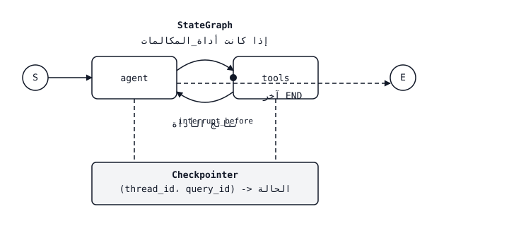

# LangGraph — State Machines for Agents

> حلقة ReAct المكتوبة بخط اليد هي `while True`. حلقة ReAct المكتوبة بلغة LangGraph عبارة عن رسم بياني يمكنك التحقق منه ومقاطعته وتفرعه والسفر عبر الزمن. الوكيل لم يتغير الحزام المحيط به موجود.

**النوع:** بناء
** اللغات: ** بايثون
** المتطلبات الأساسية: ** المرحلة 11 · 09 (استدعاء الوظيفة)، المرحلة 11 · 14 (بروتوكول السياق النموذجي)
**الوقت:** ~75 دقيقة

## The Problem

يمكنك شحن وكيل استدعاء الوظيفة. يعمل لمدة ثلاث دورات، ثم يحدث خطأ ما: يحاول النموذج استخدام أداة تُرجع 500، أو يغير المستخدم رأيه في منتصف المهمة، أو يقرر الوكيل استرداد طلب دون تسجيل الخروج البشري. لا تحتوي الحلقة `while True:` على خطافات. لا يمكنك إيقافه مؤقتًا، ولا يمكنك إرجاعه، ولا يمكنك التفرع إلى "ماذا لو اختار النموذج الأداة الأخرى". في اللحظة التي تقوم فيها بشحن هذا العرض التوضيحي، يصبح الوكيل بمثابة صندوق أسود يعمل أو لا يعمل.

الخطوة التالية واضحة بمجرد رؤيتها. الوكيل هو بالفعل جهاز حالة - موجه النظام بالإضافة إلى سجل الرسائل بالإضافة إلى استدعاءات الأداة المعلقة بالإضافة إلى الإجراء التالي. اجعل آلة الحالة واضحة: nodes لـ "النموذج يفكر"، "الأداة تعمل"، "الإنسان يوافق"، والحواف للانتقالات الشرطية بينهما. بمجرد أن يصبح الرسم البياني واضحًا، يحصل الحزام على أربعة أشياء مجانًا: التحقق (حفظ الحالة بين الخطوات)، والمقاطعات (الإيقاف المؤقت للإنسان)، والبث (رموز الدفق والأحداث الوسيطة)، والسفر عبر الزمن (الإرجاع إلى حالة سابقة وتجربة فرع مختلف).

LangGraph هي المكتبة التي تشحن هذا التجريد. إنه ليس إطار عمل وكيل بمعنى LangChain ("هنا AgentExecutor، حظًا سعيدًا"). إنه وقت تشغيل رسم بياني مع حالة من الدرجة الأولى، واستمرارية من الدرجة الأولى، ومقاطعات من الدرجة الأولى. حلقة الوكيل هي شيء ترسمه، وليس شيئًا تكتبه بخط اليد.

## The Concept



يحتوي `StateGraph` على ثلاثة أشياء.

1. **الحالة.** إملاء مكتوب (نموذج TypedDict أو Pydantic) يتدفق عبر الرسم البياني. يتلقى كل node الحالة الكاملة ويعيد تحديثًا جزئيًا، والذي يدمجه LangGraph باستخدام *مخفض* لكل حقل — `operator.add` للقوائم التي يجب أن تتراكم، وتتم الكتابة فوقها بشكل افتراضي.
2. **العقد.** وظائف بايثون `state -> partial_state`. كل منها عبارة عن خطوة منفصلة: "استدعاء النموذج"، و"تشغيل الأدوات"، و"التلخيص".
3. **الحواف.** الانتقالات بين nodes. الحواف الثابتة تذهب إلى مكان واحد. تأخذ الحواف الشرطية وظيفة التوجيه `state -> next_node_name` بحيث يمكن للرسم البياني أن يتفرع على مخرجات النموذج.

قمت بتجميع الرسم البياني. يقوم Compile بربط الهيكل وإرفاق نقطة تفتيش (اختياري ولكنه ضروري للإنتاج) وإرجاع عنصر قابل للتشغيل. يمكنك استدعاؤه بحالة أولية و `thread_id`. في كل خطوة من خطوات التنفيذ، يتم الاحتفاظ بنقطة تفتيش يتم الضغط عليها على الرقم `(thread_id, checkpoint_id)`.

### The four superpowers

** نقطة التحقق. ** كل انتقال node يكتب الحالة الجديدة إلى المتجر (في الذاكرة للاختبارات، Postgres/Redis/SQLite للمنتج). استأنف باستدعاء الرسم البياني مرة أخرى بنفس `thread_id`. يلتقط الرسم البياني المكان الذي توقف فيه مؤقتًا.

**المقاطعات.** ضع علامة على node بـ `interrupt_before=["human_review"]` ويتوقف التنفيذ قبل تشغيل node. الدولة مستمرة. يستجيب API للمستخدم بـ "في انتظار الموافقة". طلب لاحق لنفس `thread_id` مع `Command(resume=...)` يستأنف التنفيذ.

**البث.** `graph.stream(state, mode="updates")` ينتج عنه دلتا الحالة فور حدوثها. `mode="messages"` يقوم ببث الرموز LLM داخل النموذج nodes. `mode="values"` يعطي لقطات كاملة. اخترت ما تريد أن يظهر في UI.

**السفر عبر الزمن.** `graph.get_state_history(thread_id)` يُرجع سجل نقاط التفتيش الكامل. قم بتمرير أي قبل `checkpoint_id` إلى `graph.invoke` وتفرع من تلك النقطة. رائعة لتصحيح الأخطاء ("ماذا لو اختار النموذج الأداة B بدلاً من ذلك؟") ولاختبارات الانحدار التي تعيد تشغيل آثار الإنتاج.

### Reducers are the point

كل حقل ولاية لديه المخفض. معظم الإعدادات الافتراضية جيدة، فالقيمة الجديدة تحل محل القيمة القديمة. لكن قوائم الرسائل تحتاج إلى `operator.add` لذا يتم إلحاق الرسائل الجديدة بدلاً من استبدالها. تقوم الحواف المتوازية بدمج تحديثاتها من خلال المخفض. إذا قام اثنان من node بتحديث `messages` ونسيت `Annotated[list, add_messages]`، فإن الثاني يفوز بصمت وتخسر ​​نصف الدور. المخفض هو الشيء الوحيد الدقيق في المكتبة؛ احصل عليه بشكل صحيح والباقي يؤلف.

### The ReAct graph in four nodes

يتكون وكيل ReAct للإنتاج من أربعة node وحافتين:

1. `agent` — يتصل بالرقم LLM مع سجل الرسائل الحالي. إرجاع رسالة المساعد (التي قد تحتوي على مكالمات_أداة).
2. `tools` — ينفذ أي استدعاءات للأداة في آخر رسالة مساعد، ويلحق نتائج الأداة كرسائل أداة.
3. حافة شرطية من `agent` توجه إلى `tools` إذا كانت الرسالة الأخيرة تحتوي على مكالمات_أداة، وإلا إلى `END`.
4. حافة ثابتة من `tools` إلى `agent`.

هذا كل شيء. يمكنك الحصول على حلقة ReAct الكاملة (الفكر → الإجراء → الملاحظة → الفكر → …) مع نقاط التفتيش والمقاطعات والتدفق، في حوالي 40 سطرًا من التعليمات البرمجية.

### StateGraph vs Send (fanout)

`Send(node_name, state)` يتيح node إرسال رسوم بيانية فرعية متوازية. مثال: قرر الوكيل الاستعلام عن ثلاثة مستردين في وقت واحد. كل `Send` يولد تنفيذًا موازيًا للهدف node؛ تندمج مخرجاتهم من خلال مخفض الحالة. هذه هي الطريقة التي يعبر بها LangGraph عن نمط عمال الأوركسترا بدون خيوط أولية.

### Subgraphs

يمكن أن يكون الرسم البياني المجمع node في رسم بياني آخر. يرى الرسم البياني الخارجي node واحد؛ الرسم البياني الداخلي له حالته الخاصة ونقاط التفتيش الخاصة به. هذه هي الطريقة التي تقوم بها الفرق ببناء وكلاء المشرفين والعاملين: يقوم الرسم البياني للمشرف بتوجيه نية المستخدم إلى رسم بياني فرعي للعامل لكل مجال.

## Build It

### Step 1: state and nodes

```python
from typing import Annotated, TypedDict
from langchain_core.messages import AnyMessage, HumanMessage, AIMessage
from langgraph.graph import StateGraph, END
from langgraph.graph.message import add_messages
from langgraph.prebuilt import ToolNode
from langgraph.checkpoint.memory import MemorySaver

class State(TypedDict):
    messages: Annotated[list[AnyMessage], add_messages]

def agent_node(state: State) -> dict:
    response = llm.invoke(state["messages"])
    return {"messages": [response]}

def should_continue(state: State) -> str:
    last = state["messages"][-1]
    return "tools" if getattr(last, "tool_calls", None) else END

tool_node = ToolNode(tools=[search_web, read_file])

graph = StateGraph(State)
graph.add_node("agent", agent_node)
graph.add_node("tools", tool_node)
graph.set_entry_point("agent")
graph.add_conditional_edges("agent", should_continue, {"tools": "tools", END: END})
graph.add_edge("tools", "agent")

app = graph.compile(checkpointer=MemorySaver())
```

`add_messages` هو المخفض الذي makes تتراكم قائمة الرسائل بدلاً من الكتابة فوقها. نسيانها هو خطأ LangGraph الأكثر شيوعًا.

### Step 2: run with a thread

```python
config = {"configurable": {"thread_id": "user-42"}}
for event in app.stream(
    {"messages": [HumanMessage("find the Anthropic headquarters address")]},
    config,
    stream_mode="updates",
):
    print(event)
```

كل تحديث هو إملاء `{node_name: state_delta}`. يمكن للواجهة الأمامية الخاصة بك دفق هذه العناصر إلى UI حتى يرى المستخدمون "الوكيل يفكر... يتصل بـ search_web... حصل على نتيجة... يجيب."

### Step 3: add a human-in-the-loop interrupt

ضع علامة node حتى يتوقف التنفيذ مؤقتًا قبل تشغيله.

```python
app = graph.compile(
    checkpointer=MemorySaver(),
    interrupt_before=["tools"],  # pause before every tool call
)

state = app.invoke({"messages": [HumanMessage("delete the production database")]}, config)
# state["__interrupt__"] is set. Inspect proposed tool calls.
# If approved:
from langgraph.types import Command
app.invoke(Command(resume=True), config)
# If denied: write a rejection message and resume
app.update_state(config, {"messages": [AIMessage("Blocked by human reviewer.")]})
```

الحالة ونقطة التفتيش والخيط كلها تستمر عبر المقاطعة. لا يوجد شيء في الذاكرة إلا أثناء التنفيذ.

### Step 4: time-travel for debugging

```python
history = list(app.get_state_history(config))
for snapshot in history:
    print(snapshot.values["messages"][-1].content[:80], snapshot.config)

# Fork from a prior checkpoint
target = history[3].config  # three steps back
for event in app.stream(None, target, stream_mode="values"):
    pass  # replay from that point forward
```

تمرير `None` أثناء إعادة الإدخال من نقطة التحقق المحددة؛ يؤدي تمرير قيمة إلى إلحاقها كتحديث لحالة نقطة التفتيش هذه قبل الاستئناف. هذه هي الطريقة التي تقوم بها بإعادة إنتاج تشغيل العميل السيئ دون إعادة تشغيل المحادثة بأكملها.

### Step 5: swap the checkpointer for production

```python
from langgraph.checkpoint.postgres import PostgresSaver

with PostgresSaver.from_conn_string("postgresql://...") as checkpointer:
    checkpointer.setup()
    app = graph.compile(checkpointer=checkpointer)
```

يتم شحن SQLite وRedis وPostgres. `MemorySaver` مخصص للاختبارات. أي شيء يستمر عبر عمليات إعادة التشغيل يحتاج إلى متجر حقيقي.

## The Skill

> يمكنك إنشاء وكلاء كرسوم بيانية، وليس كحلقات `while True`.

قبل أن تصل إلى LangGraph، قم بتصميم لمدة 60 ثانية:

1. **قم بتسمية nodes.** كل قرار منفصل أو إجراء ذو ​​تأثير جانبي هو node. "يفكر الوكيل"، "تعمل الأداة"، "يوافق المراجع"، "تدفقات الاستجابة". إذا لم تتمكن من إدراجها، فإن المهمة لم يتم تشكيلها بعد.
2. ** أعلن الحالة. ** الحد الأدنى من TypedDict مع المخفض لكل حقل قائمة. لا تقم بحشو كل شيء في `messages`; ارفع الحقول الخاصة بالمهمة (عمل `plan`، عداد `budget`، قائمة `retrieved_docs`) إلى المستوى الأعلى.
3. **ارسم الحواف.** ثابت ما لم تعتمد الخطوة التالية على مخرجات النموذج. تحتاج كل حافة شرطية إلى وظيفة جهاز توجيه ذات فروع مسماة.
4. **اختر نقطة تفتيش في المقدمة.** `MemorySaver` للاختبارات، وPostgres/Redis/SQLite لأي شيء آخر. لا تشحن بدون واحدة - عدم وجود نقطة تفتيش يعني عدم وجود سيرة ذاتية، أو مقاطعة، أو سفر عبر الزمن.
5. **قرر المقاطعات قبل تشغيل الأدوات، وليس بعدها.** تنتقل الموافقات على الحافة إلى تأثير جانبي node حتى تتمكن من الإلغاء قبل الضرر؛ يتم التحقق من الصحة على حافة النموذج حتى تتمكن من رفض المكالمات السيئة بسعر رخيص.
6. **البث بشكل افتراضي.** `mode="updates"` لـ UI، `mode="messages"` للبث على مستوى الرمز المميز داخل النموذج nodes، `mode="values"` للقطات الكاملة أثناء التقييم.

رفض شحن وكيل LangGraph الذي لا يحتوي على نقطة تفتيش. ارفض شحن منتج يقاطع *بعد* التأثير الجانبي. رفض شحن الحقل `messages` بدون `add_messages` كمخفض له.

## Exercises

1. **سهل.** قم بتنفيذ الرسم البياني الأربعة node ReAct أعلاه باستخدام أداة الآلة الحاسبة وأداة البحث على الويب. تحقق من أن `list(app.get_state_history(config))` يُرجع أربع نقاط تحقق على الأقل لمحادثة ذات دورين.
2. **متوسط.** أضف `planner` node الذي يعمل قبل `agent` ويكتب `plan: list[str]` منظم في الحالة. اجعل `agent` علامة على خطوات الخطة كما تم. فشل في الاختبار إذا تم فقدان `plan` عبر السيرة الذاتية لنقطة التفتيش (مخفض خاطئ).
3. **صعب.** أنشئ رسمًا بيانيًا مشرفًا يتنقل بين ثلاثة رسوم بيانية فرعية (`researcher`، `writer`، `reviewer`) باستخدام `Send`. كل رسم بياني فرعي له حالته الخاصة ونقطة التفتيش. أضف `interrupt_before=["writer"]` على الرسم البياني الخارجي حتى يتمكن الإنسان من الموافقة على ملخص البحث. تأكد من أن السفر عبر الزمن من نقطة تفتيش سابقة يعيد تشغيل الفرع المتشعب فقط.

## Key Terms

| مصطلح | ماذا يقول الناس | ماذا يعني في الواقع |
|------|-|--------------------------------------|
| رسم بياني للحالة | "الرسم البياني LangGraph" | كائن المنشئ الذي تضيف إليه nodes والحواف قبل التجميع. |
| المخفض | "كيف يندمج الحقل" | يتم تطبيق وظيفة `(old, new) -> merged` عندما يقوم node بإرجاع تحديث لهذا الحقل؛ يتم استبدال الإعداد الافتراضي، ويتم إلحاق `add_messages`. |
| الموضوع | "محادثة ID" | سلسلة `thread_id` تحدد نطاق جميع نقاط التفتيش لجلسة واحدة. |
| نقطة تفتيش | "حالة متوقفة مؤقتًا" | لقطة مستمرة لحالة الرسم البياني الكاملة بعد الانتقال node، مع الضغط على `(thread_id, checkpoint_id)`. |
| مقاطعة | "وقفة للإنسان" | `interrupt_before` / `interrupt_after` إيقاف التنفيذ عند حدود node؛ استئناف مع `Command(resume=...)`. |
| السفر عبر الزمن | "شوكة من خطوة سابقة" | `graph.invoke(None, config_with_old_checkpoint_id)` الإعادة من نقطة التفتيش تلك للأمام. |
| أرسل | "إرسال الرسم البياني الفرعي المتوازي" | يمكن للمنشئ node العودة إلى عمليات التنفيذ المتوازية N للهدف node. |
| رسم بياني فرعي | "رسم بياني مجمع كـ node" | رسم بياني للحالة مُجمَّع يُستخدم كـ node في رسم بياني آخر؛ يحافظ على نطاق الدولة الخاصة به. |

## Further Reading

- [LangGraph documentation](https://langchain-ai.github.io/langgraph/) — canonical reference for StateGraph, reducers, checkpointers, and interrupts.
- [LangGraph concepts: state, reducers, checkpointers](https://langchain-ai.github.io/langgraph/concepts/low_level/) — the mental model this lesson uses, straight from the source.
- [LangGraph Persistence and Checkpoints](https://langchain-ai.github.io/langgraph/concepts/persistence/) — the detail on Postgres/SQLite/Redis stores, checkpoint namespaces, and thread IDs.
- [LangGraph Human-in-the-loop](https://langchain-ai.github.io/langgraph/concepts/human_in_the_loop/) — `interrupt_before`, `interrupt_after`, `Command(resume=...)`, and the edit-state pattern.
- [AnthropicBuildingeffectiveagents(Dec2024)](https://www.anthropic.com/research/building-effective-agents) — which graph shapes (chain, router, orchestrator-workers, evaluator-optimizer) to prefer and when.
- Phase 11 · 09 (Function Calling) — the tool-call primitive every LangGraph agent effective reuses.
- Phase 11 · 14 (Model Context Protocol) — external tool discovery that plugs into a LangGraph `ToolNode` عبر المحول MCP.
- المرحلة 11 · 17 (مقايضات إطار عمل الوكيل) - متى يتم اختيار LangGraph بدلاً من CrewAI أو AutoGen أو Agno.
