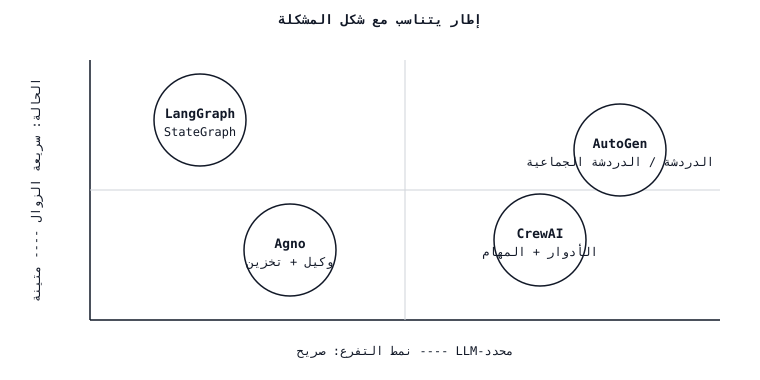

# مقايضات إطار عمل الوكيل - LangGraph vs CrewAI vs AutoGen vs Agno
> يبيع كل إطار نفس العرض التوضيحي (يقوم وكيل البحث بإنشاء تقرير) ويخفي نفس الخطأ (يحارب مخطط الحالة مع طبقة التنسيق). اختر إطار العمل الذي تتطابق تجريداته مع شكل مشكلتك؛ كل شيء آخر هو الغراء الذي تكتبه مرتين.
**النوع:** تعلم
** اللغات: ** بايثون
**المتطلبات الأساسية:** المرحلة 11 · 09 (استدعاء الوظيفة)، المرحلة 11 · 16 (LangGraph)
**الوقت:** ~45 دقيقة
## المشكلة
لديك مهمة تحتاج إلى أكثر من مكالمة LLM واحدة. ربما يكون سير عمل بحثي (تخطيط، بحث، تلخيص، استشهاد). ربما تكون مراجعة التعليمات البرمجية pipeline (تحليل الفرق، النقد، التصحيح، التحقق من الصحة). ربما يكون مساعدًا متعدد الأدوار يحجز الرحلات الجوية ويكتب رسائل البريد الإلكتروني ويقدم تقارير النفقات. اخترت الإطار.
وبعد ثلاثة أيام، تكتشف تسربًا لتجريدات إطار العمل. يمنحك CrewAI الأدوار ولكنه يحاربك عندما يحتاج "الباحث" إلى تسليم خطة منظمة إلى "الكاتب". يمنحك AutoGen الدردشة بين الوكلاء ولكن ليس لديه حالة من الدرجة الأولى، لذا فإن نقطة التفتيش الخاصة بك هي عبارة عن مجموعة مختارة من سجل المحادثة. يمنحك LangGraph رسمًا بيانيًا للحالة ولكنه يفرض عليك تسمية كل عملية انتقال قبل أن تعرف ما سيفعله الوكيل. يمنحك Agno وكيلًا بدائيًا واحدًا يصرخ عندما تحاول توزيعه على ثلاثة عمال متزامنين.
الإصلاح ليس "اختيار الإطار الأفضل". إنه مطابقة التجريد الأساسي لإطار العمل مع شكل مشكلتك. وهذا الدرس يرسم تلك الخريطة.
##المفهوم

هناك أربعة أطر تهيمن على المشهد العام 2026. تجريداتهم الأساسية ليست هي نفسها.
| الإطار | التجريد الأساسي | الأنسب | أسوأ تناسب |
|-----------|------------------|----------|-----------|
| **لانغغراف** | `StateGraph` — الحالة المكتوبة، nodes، الحواف الشرطية، نقطة التفتيش. | سير العمل مع حالة واضحة ومقاطعات بشرية في الحلقة؛ وكلاء الإنتاج الذين يحتاجون إلى تصحيح أخطاء السفر عبر الزمن. | العصف الذهني الفضفاض القائم على الأدوار حيث تكون الطوبولوجيا غير معروفة. |
| **الطاقم** | `Crew` — الأدوار (الهدف، الخلفية الدرامية)، المهام، العملية (متسلسلة أو هرمية). | لعب الأدوار أو سير العمل القائم على الشخصية مع خطة خطية/هرمية قصيرة. | أي شيء مهم يتجاوز تاريخ دور الطاقم؛ المتفرعة المعقدة. |
| **توليد تلقائي** | زوج `ConversableAgent` — اثنان أو أكثر من الوكلاء يتحدثون بالتناوب حتى حالة الخروج. | *حوار* متعدد الوكلاء (المعلم والطالب، ومقترح الناقد، والممثل والمراجع) حيث ينبثق التفكير من الدردشة. | سير العمل الحتمي ذو DAG المعروف؛ أي شيء يحتاج إلى حالة دائمة عبر عمليات إعادة التشغيل. |
| **اجنو** | `Agent` — LLM واحد + أدوات + ذاكرة، قابلة للتكوين في فرق. | وكلاء فرديون وفرق خفيفة الوزن سريعة البناء؛ برامج تشغيل قوية متعددة الوسائط ومدمجة للتخزين. | رسوم بيانية عميقة ومتفرعة بشكل واضح مع مخفضات مخصصة. |
### ماذا يعني "التجريد" في الواقع
التجريد الأساسي لإطار العمل هو الشيء الذي ترسمه على السبورة عندما تقوم بعرض البنية.
- **LangGraph** → تقوم برسم رسم بياني. العقد هي خطوات، والحواف هي انتقالات، ويتم كتابة كائن الحالة في كل نقطة. النموذج العقلي هو آلة الدولة.
- **CrewAI** → تقوم برسم مخطط هيكلي. يحتوي كل دور على وصف وظيفي ويقوم المدير بتوجيه المهام. النموذج العقلي عبارة عن فريق صغير من المتخصصين.
- **AutoGen** → ترسم Slack DM. وكيلان يراسلان بعضهما البعض؛ وينضم ثالث إذا كنت بحاجة إلى وسيط. النموذج العقلي هو الدردشة.
- **Agno** → تقوم برسم صندوق واحد به أدوات معلقة عليه. ضع الصناديق بجانب بعضها البعض للفريق. النموذج العقلي هو "العامل المتضمن البطاريات".
### سؤال الدولة
الدولة هي المكان الذي تنهار فيه معظم الخيارات الإطارية في الإنتاج.
- **LangGraph.** الحالة المكتوبة (`TypedDict` أو نموذج Pydantic)، ومخفضات لكل حقل، ونقطة تفتيش من الدرجة الأولى (SQLite/Postgres/Redis). الاستئناف والمقاطعة والسفر عبر الزمن مجانية. *(انظر المرحلة 11 · 16.)*
- **CrewAI.** تتدفق الحالة كسلاسل بين المهام عبر الحقل `context`، أو يتم تنظيمها من خلال `output_pydantic`. لا يوجد مخزن متين لكل طاقم خارج الصندوق؛ أنت تنسحب بمفردك إذا كان يجب على الطاقم البقاء على قيد الحياة عند إعادة التشغيل.
- **AutoGen.** الحالة هي سجل الدردشة وأي `context` محدد من قبل المستخدم. تستمر نصوص المحادثة؛ حالة سير العمل التعسفية لا إلا إذا قمت بكتابة المحولات.
- **Agno.** برامج تشغيل التخزين المدمجة (SQLite، وPostgres، وMongo، وRedis، وDynamoDB) المرتبطة بـ `Agent` عبر `storage=` - تستمر جلسات المحادثة وذكريات المستخدم تلقائيًا. ليست نقطة تفتيش الرسم البياني الكامل؛ متجر الجلسة.
### السؤال المتفرع
كل فرع وكيل غير تافه. من يقرر الفرع يهم.
- **LangGraph** — أنت من تقرر عبر الحواف الشرطية. التوجيه هو وظيفة بايثون ذات فروع مسماة. الفروع من الدرجة الأولى في الرسم البياني المجمع؛ يسجل نقطة التفتيش الفرع الذي تم أخذه.
- **CrewAI** — يقرر المدير في الوضع الهرمي؛ في الوضع المتسلسل عليك أن تقرر في وقت البناء. التوجيه ضمني في قائمة المهام؛ لا يوجد "إذا" من الدرجة الأولى خارج موجه المدير.
- **AutoGen** — يقرر الوكلاء عبر الدردشة. التفرع ينشأ من الذي يتحدث بعد ذلك. `GroupChatManager` يحدد المتحدث التالي؛ يمكنك كتابة `speaker_selection_method` يدويًا ولكن الإعداد الافتراضي يعتمد على LLM.
- **Agno** — يقرر الوكيل الأداة التي سيتم الاتصال بها بعد ذلك. لدى الفرق وضع المنسق/الموجه/المتعاون؛ والتفرع إلى ما هو أبعد من ذلك هو مسؤولية المطور.
### سؤال إمكانية الملاحظة
- **LangGraph** — قياس المسافة المفتوحة عبر LangSmith أو أي مصدر لـ OTel. كل انتقال node هو فترة تتبع؛ تتضاعف نقاط التفتيش كآثار قابلة لإعادة التشغيل. LangSmith هو خيار الطرف الأول؛ لدى Langfuse/Phoenix أيضًا محولات.
- **CrewAI** — قياس OpenTelemetry من الدرجة الأولى منذ أواخر عام 2025؛ التكامل مع Langfuse، Phoenix، Opik، AgentOps.
- **AutoGen** — تكامل OpenTelemetry عبر `autogen-core`؛ لدى AgentOps وOpik موصلات. تتبع التفاصيل يتم لكل وكيل رسالة، وليس لكل-node.
- **Agno** — علامة `monitoring=True` مدمجة بالإضافة إلى مصدري OpenTelemetry؛ تكامل محكم مع Langfuse لتتبعات الجلسة.
### التكلفة ووقت الاستجابة
تضيف جميع الأطر الأربعة حملًا إضافيًا لكل مكالمة (منطق الإطار والتحقق من الصحة والتسلسل). ترتيب تقريبي لزيادة النفقات العامة: Agno ≈ LangGraph < CrewAI ≈ AutoGen. ويهيمن على الفرق مقدار التوجيه الإضافي LLM الذي يقوم به إطار العمل. ينفق المدير الهرمي لـ CrewAI الرموز المميزة في تحديد من يذهب بعد ذلك؛ AutoGen's `GroupChatManager` بالمثل. لا تنفق LangGraph سوى الرموز المميزة التي تكتب فيها `llm.invoke`. مسار Agno للوكيل الفردي رفيع.
عندما تكون تكلفة التشغيل مهمة، فضل التوجيه الصريح (حواف LangGraph، AutoGen `speaker_selection_method`) على التوجيه المحدد بـ LLM.
### إمكانية التشغيل البيني
- **LangGraph** ↔ **أدوات LangChain**، والمستردون، وLLMs. محول MCP من الدرجة الأولى (الأدوات المستوردة كخوادم MCP).
- **CrewAI** ↔ الأدوات ترث من `BaseTool`؛ أدوات LangChain وأدوات LlamaIndex وأدوات MCP كلها تتكيف. تفويض طاقم إلى طاقم عبر `allow_delegation=True`.
- **AutoGen** → `FunctionTool` يغلف أي لغة Python قابلة للاستدعاء؛ MCP المحول متاح. اقتران محكم بالنظام البيئي AG2 لأنماط وكيل إلى وكيل.
- **Agno** → `@tool` ديكور أو فئة فرعية من BaseTool؛ MCP محول؛ يمكن مشاركة الأدوات عبر الوكلاء والفرق.
## المهارة
> يمكنك أن تشرح، في جملة واحدة، سبب كون إطار عمل معين مناسبًا لمشكلة وكيل معين.
قائمة التحقق قبل البناء:
1. **ارسم الشكل.** هل هذا رسم بياني (حالة مكتوبة، انتقالات مسماة)؟ لعب الأدوار (المتخصصون يسلمون العمل)؟ محادثة (يتحدث الوكلاء حتى الانتهاء)؟ وكيل واحد مع الأدوات؟
2. **قرر من يقوم بالتفرع.** التفرع الذي يقرره المطور → LangGraph. قرر المدير والوكيل → CrewAI التسلسل الهرمي. الدردشة الناشئة → إنشاء تلقائي. قررت أداة الاتصال → Agno.
3. **تحقق من ميزانية الدولة.** هل تحتاج إلى سيرة ذاتية من نقطة التفتيش؟ السفر عبر الزمن؟ يقاطع الإنسان منتصف المدى؟ إذا كانت الإجابة بنعم، فإن LangGraph هو الإعداد الافتراضي؛ تغطي جلسات Agno حالة نطاق المحادثة.
4. **تحقق من ميزانية التكلفة.** LLM-يكلف التوجيه المحدد رموزًا مميزة إضافية لكل دورة. إذا كان الوكيل يعمل آلاف المرات يوميًا، ففضل التوجيه الصريح.
5. **ميزانية إطار العمل العامة.** كل إطار عمل هو تبعية أخرى. إذا كانت المهمة عبارة عن مكالمتين LLM وأداة، فاكتب 30 سطرًا من لغة Python البسيطة؛ لا يوجد إطار أرخص من عدم وجود إطار.
ارفض الوصول إلى إطار عمل قبل أن تتمكن من رسم الرسم البياني أو المخطط التنظيمي أو الدردشة أو مربع الوكيل. ارفض اختيار نموذج يجبرك على محاربة نموذج الدولة الخاص به من أجل الشيء الذي تحتاجه بالفعل.
## مصفوفة القرار
| شكل المشكلة | الإطار المفضل | لماذا |
|---------------|--------------------|-----|
| سير العمل DAG مع الحالة المكتوبة، والموافقات البشرية، وطويلة الأمد | لانغغراف | حالة من الدرجة الأولى، نقطة التفتيش، المقاطعات، السفر عبر الزمن. |
| بحث/كتابة pipeline بأدوار متميزة | CrewAI (متسلسل) أو الرسوم البيانية الفرعية LangGraph | يعتبر الدور لكل مهمة رخيصًا في CrewAI؛ قم بالارتقاء باستخدام LangGraph عندما يصبح التفرع معقدًا. |
| الحوار بين المقترح والناقد أو بين المعلم والطالب | أوتوجن | الدردشة الثنائية هي شكلها الأصلي. |
| وكيل واحد مع الأدوات والجلسات والذاكرة | أجنو | أنحف إعداد ووحدة تخزين وذاكرة مدمجة. |
| الآلاف من المراوح المتوازية مع المخفضات | لانغغراف + `Send` | الوحيد الذي لديه بدائي إرسال متوازي من الدرجة الأولى. |
| نموذج أولي سريع، بدون التزام بإطار العمل | موفر Python + عادي SDK | لا يوجد إطار هو أسرع إطار. |
## تمارين
1. **سهل.** قم بنفس المهمة - "ابحث في مقر الأنثروبيك، واكتب ملخصًا من 200 كلمة، واستشهد بالمصادر" - وقم بتنفيذها في LangGraph (أربعة nodes: التخطيط، والبحث، والكتابة، والاستشهاد) وفي CrewAI (ثلاثة أدوار: باحث، وكاتب، ومحرر). الإبلاغ عن تكلفة الرمز المميز لكل عملية تشغيل وأسطر من التعليمات البرمجية.
2. **متوسط.** أنشئ نفس المهمة في AutoGen (دردشة الباحث ↔ الكاتب، وينضم المحرر عبر `GroupChat`) وAgno (وكيل واحد مع `search_tools` و`write_tools`، بالإضافة إلى مخزن الجلسة). قم بتصنيف التطبيقات الأربعة على (أ) التكلفة لكل تشغيل، (ب) القدرة على الاستئناف بعد التعطل، (ج) القدرة على ضخ موافقة بشرية قبل خطوة الكتابة.
3. **صعب.** أنشئ برنامجًا نصيًا لشجرة القرار `pick_framework.py` يأخذ وصفًا قصيرًا للمشكلة (JSON: `{has_typed_state, has_roles, has_dialogue, has_parallel_fanout, needs_resume}`) ويعرض توصية مع تبرير من جملة واحدة. تحقق من ذلك في ست حالات تصممها بنفسك.
## المصطلحات الرئيسية
| مصطلح | ماذا يقول الناس | ماذا يعني في الواقع |
|------|-|--------------------------------------|
| تنسيق | "كيفية تنسيق الوكلاء" | الطبقة التي تحدد node/الدور/الوكيل الذي سيتم تشغيله بعد ذلك. |
| حالة دائمة | "استئناف بعد إعادة التشغيل" | الحالة التي تنجو من عملية الموت، متصلة بنقطة تفتيش أو مخزن جلسة. |
| LLM-التوجيه المحدد | "دع النموذج يقرر" | يقوم المخطط LLM باختيار الخطوة التالية في كل دورة؛ مرنة ولكنها تدفع الرموز على كل قرار. |
| التوجيه الصريح | "المطور يقرر" | تقوم دالة Python أو الحافة الثابتة باختيار الخطوة التالية؛ رخيصة وقابلة للتدقيق. |
| الطاقم | "فريق CrewAI" | الأدوار + المهام + العملية (متسلسلة أو هرمية) منضمة إلى عملية واحدة قابلة للتشغيل. |
| دردشة جماعية | "دردشة AutoGen المتعددة الوكلاء" | محادثة مُدارة بين وكلاء N باستخدام محدد المتحدث. |
| فريق (اجنو) | "Agno متعدد الوكلاء" | وضع التوجيه/التنسيق/التعاون عبر مجموعة من الوكلاء. |
| رسم بياني للحالة | "الرسم البياني لـ LangGraph" | الحالة المكتوبة، node، الحافة الشرطية، نقطة التفتيش البدائية. |
## مزيد من القراءة
- [LangGraph documentation](https://langchain-ai.github.io/langgraph/) — StateGraph، نقاط التفتيش، المقاطعات، السفر عبر الزمن.
- [CrewAI documentation](https://docs.crewai.com/) — الأطقم، التدفقات، الوكلاء، المهام، العمليات.
- [AutoGen documentation](https://microsoft.github.io/autogen/) — ConversableAgent، GroupChat، الفرق، الأدوات.
- [Agno documentation](https://docs.agno.com/) — الوكيل، الفريق، سير العمل، التخزين، الذاكرة.
- [Anthropic — Building effective agents (Dec 2024)](https://www.anthropic.com/research/building-effective-agents) — مكتبة الأنماط (التسلسل الفوري، والتوجيه، والتوازي، والعاملون المنسقون، والمقيم-المُحسِّن) غير إطار العمل.
- [Yao et al., "ReAct: Synergizing Reasoning and Acting" (ICLR 2023)](https://arxiv.org/abs/2210.03629) — البدائي الذي يناسب كل إطار عمل.
- [Wu et al., "AutoGen: Enabling Next-Gen LLM Applications via Multi-Agent Conversation" (2023)](https://arxiv.org/abs/2308.08155) — ورقة تصميم AutoGen.
- [Park et al., "Generative Agents: Interactive Simulacra of Human Behavior" (UIST 2023)](https://arxiv.org/abs/2304.03442) — أساس لعب الأدوار الذي تعتمد عليه مجموعات الشخصيات بأسلوب CrewAI.
- المرحلة 11 · 16 (LangGraph) — إطار العمل الذي يستند إليه هذا الدرس.
- المرحلة 11 · 19 (الانعكاس) - نمط يتم تعيينه بشكل واضح لـ LangGraph ولكن بشكل محرج لـ CrewAI.
- المرحلة 11 · 22 (إمكانية ملاحظة الإنتاج) - كيفية استخدام الإطار الذي تختاره.