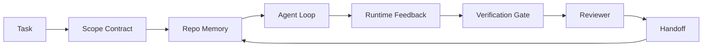

# Agent Workbench Engineering: Why Capable Models Still Fail

> النموذج القادر ليس كافيا. يحتاج الوكلاء الموثوقون إلى طاولة عمل: التعليمات، والحالة، والنطاق، والتعليقات، والتحقق، والمراجعة، والتسليم. قم بإزالة هذه العناصر بعيدًا، وحتى النموذج الحدودي ينتج عملاً غير آمن للشحن.

** النوع: ** تعلم + بناء
** اللغات: ** بايثون (stdlib)
** المتطلبات الأساسية: ** المرحلة 14 · 01 (حلقة الوكيل)، المرحلة 14 · 26 (أوضاع الفشل)
**الوقت:** ~45 دقيقة

## Learning Objectives

- فصل قدرة النموذج عن موثوقية التنفيذ.
- قم بتسمية أسطح طاولة العمل السبعة التي تحدد ما إذا كان العميل سيتم شحنه أم لا.
- قارن بين التشغيل الفوري فقط والتشغيل الموجه منضدة العمل في مهمة الريبو الصغيرة.
- قم بإعداد تقرير وضع الفشل الذي يعين كل سطح مفقود للأعراض التي تسبب فيها.

## The Problem

تقوم بإسقاط نموذج الحدود في الريبو الحقيقي وتطلب منه إضافة التحقق من صحة الإدخال. يفتح أربعة ملفات، ويكتب تعليمات برمجية معقولة، ويعلن النجاح، ويتوقف. تقوم بإجراء الاختبارات. اثنان يفشلان تم لمس ملف ثالث لا علاقة له بالتحقق من الصحة. لا يوجد سجل لما افترضه الوكيل، أو ما حاوله أولاً، أو ما بقي للقيام به.

لم يكن النموذج مخطئًا بشأن بايثون. لقد كان خطأً بشأن العمل لم يكن لديه أي فكرة عما يعتبر قد تم، أو أين يُسمح له بالكتابة، أو ما هي الاختبارات الموثوقة، أو كيف من المفترض أن تبدأ الجلسة التالية.

هذا ليس خطأ نموذجي. إنه خطأ منضدة العمل. يفتقد السطح المحيط بالعامل الأجزاء التي تحول توليد اللقطة الواحدة إلى هندسة موثوقة وقابلة للاستئناف.

## The Concept

منضدة العمل هي بيئة التشغيل التي تغلف النموذج أثناء المهمة. وله سبعة أسطح:

| السطح | ما يحمل | الفشل عند المفقودين |
|---------|-----------------|----------------------|
| تعليمات | قواعد بدء التشغيل، الأفعال المحرمة، تعريف القيام | الوكيل يخمن معنى الشحن |
| الدولة | المهمة الحالية، الملفات التي تم لمسها، أدوات الحظر، الإجراء التالي | يتم إعادة تشغيل كل جلسة من الصفر |
| النطاق | الملفات المسموحة، الملفات المحظورة، معايير القبول | تتسرب التعديلات إلى تعليمات برمجية غير ذات صلة |
| ردود الفعل | تم التقاط إخراج الأمر الحقيقي في الحلقة | الوكيل يعلن نجاح 400 |
| التحقق | الاختبارات، الوبر، تشغيل الدخان، فحص النطاق | "تبدو جيدة" تصل إلى الصفحة الرئيسية |
| مراجعة | تمريرة ثانية بدور مختلف | منشئ علامات الواجبات المنزلية الخاصة |
| هاندوف | ماذا تغير، لماذا، ماذا بقي | الجلسة القادمة تعيد اكتشاف كل شيء |

طاولة العمل مستقلة عن النموذج. يمكنك تبديل النموذج والاحتفاظ بالأسطح. لا يمكنك تبديل الأسطح والحفاظ على الموثوقية.



يتم إغلاق الحلقة في ملف الحالة، وليس في سجل الدردشة. الدردشة متقلبة. الريبو هو نظام التسجيل.

### Workbench versus prompt engineering

تخبر المطالبة النموذج بما تريده في هذا المنعطف. تخبر طاولة العمل النموذج بكيفية القيام بالعمل عبر الدورات وعبر الجلسات. معظم قصص فشل العملاء هي حالات فشل في العمل وهم يرتدون ملابس هندسية سريعة.

### Workbench versus framework

يمنحك إطار العمل وقت تشغيل (LangGraph، AutoGen، Agents SDK). تمنح طاولة العمل الوكيل مكانًا للعمل خلال وقت التشغيل هذا. أنت بحاجة إلى كليهما. هذا المسار المصغر يدور حول المسار الثاني.

### Reasoning from primitives, not from vendor taxonomies

هناك الكثير من الكتابات حول "هندسة الحزام" في الوقت الحالي. Addy Osmani، OpenAI، Anthropic، LangChain، Martin Fowler، MongoDB، HumanLayer، Augment Code، Thoughtworks، قائمة walklabs الرائعة، وقرع الطبول الثابت لمقالات Medium وHacker News كلها تحملها. إنهم يختلفون حول حدود ما هو الحزام، وما هو في نطاقه، وما هي المفردات التي يجب استخدامها. نحن لسنا بحاجة لاختيار الجانب. الأسطح السبعة عبارة عن طبقة UX؛ يوجد أسفل كل طاولة عمل نفس المجموعة من الأنظمة الأولية للأنظمة الموزعة التي تدعم أي واجهة خلفية موثوقة.

قم بإزالة ملصق الوكيل للحظة. تشغيل الوكيل هو حساب يعبر الوقت والعمليات والآلات. لكي make تلك الموثوقة تحتاج إلى نفس الأساسيات التي يحتاجها أي نظام إنتاج.

| بدائية | ما هو | ما يحمله للوكيل |
|-----------|-----------|-----------------------------|
| وظيفة | معالج مكتوب. نقي حيثما أمكن ذلك. يمتلك مدخلاته ومخرجاته. | استدعاء أداة، فحص القاعدة، خطوة التحقق، استدعاء النموذج |
| عامل | عملية طويلة العمر تمتلك وظيفة واحدة أو أكثر ودورة حياة | المنشئ، المراجع، المدقق، خادم MCP |
| الزناد | مصدر الحدث الذي يستدعي دالة | علامة حلقة الوكيل، طلب HTTP، رسالة قائمة الانتظار، كرون، تغيير الملف، ربط |
| وقت التشغيل | الحدود التي تحدد ما يتم تشغيله وأين، وبأي مهلات وموارد | عملية كلود كود، وقت تشغيل LangGraph، حاوية عاملة |
| HTTP / RPC | السلك بين المتصل والعامل | بروتوكول استدعاء الأداة، طلب MCP، نموذج API |
| قائمة الانتظار | عازل متين بين الزناد والعامل؛ الضغط الخلفي، إعادة المحاولة، العجز | لوحة المهام، وسجل الملاحظات، وصندوق الوارد للمراجعة |
| ثبات الجلسة | الحالة التي تنجو من الأعطال وإعادة التشغيل ومقايضات النموذج | `agent_state.json`, نقاط التفتيش, KV متاجر, الريبو نفسه |
| سياسة التفويض | من يمكنه استدعاء الوظيفة وبأي نطاق | الملفات المسموح بها/المحظورة، حدود الموافقة، MCP قوائم القدرات |

الآن قم بتعيين أسطح طاولة العمل السبعة على تلك البدائيات.

- **تعليمات** — البيانات الوصفية للسياسة + الوظيفة. القواعد هي الشيكات (وظائف). جهاز التوجيه (`AGENTS.md`) هو سياسة مرتبطة ببدء تشغيل وقت التشغيل.
- **الحالة** — ثبات الجلسة. مخزن مرتبط بقراءة وقت التشغيل في كل خطوة. ملف، KV، أو DB؛ دلالات الثبات مهمة، بينما الواجهة الخلفية للتخزين ليست كذلك.
- **النطاق** — سياسة التفويض لكل مهمة. الكرات المسموح بها/المحظورة هي ACL. الموافقات المطلوبة هي شعرية إذن.
- **التعليقات** — سجل الاستدعاءات المكتوب في قائمة الانتظار. كل مكالمة صدفة هي سجل، متين، قابل لإعادة التشغيل.
- **التحقق** — وظيفة. حتمية على المدخلات. تم تشغيله عند إغلاق المهمة. فشل مغلقة.
- **المراجعة** — عامل منفصل يتمتع بمصادقة للقراءة فقط على عناصر المنشئ ومصادقة للكتابة فقط على تقارير المراجعة.
- **Handoff** — سجل دائم ينبعث من مشغل نهاية الجلسة. يقرأه مشغل بدء التشغيل للجلسة التالية.

حلقة الوكيل نفسها عبارة عن عامل يستهلك الأحداث (رسالة المستخدم، ونتيجة الأداة، وعلامة المؤقت)، ويستدعي الوظائف (النموذج، ثم الأدوات التي يختارها النموذج)، ويكتب السجلات (الحالة، والتعليقات)، ويصدر المشغلات (التحقق، والمراجعة، والتسليم). لا يوجد لغز. نفس شكل المعالج الوظيفي.

### Patterns in circulation, translated to primitives

كل نمط من أنماط التسخير الشائعة يختزل إلى البدائيات الثمانية. جدول الترجمة.

| نمط البائع أو المجتمع | ما هو في الواقع |
|-----------------------------|-----|
| رالف لوب (كلود كود، كوديكس، كتاب agentic_harness) - إعادة إدخال النية الأصلية في نافذة سياق جديدة عندما يحاول الوكيل التوقف مبكرًا | مشغل يقوم بإعادة إدراج مهمة بسياق نظيف؛ مثابرة الجلسة تحمل الهدف إلى الأمام |
| خطط / نفذ / تحقق (PEV) | ثلاثة عمال، واحد لكل دور، يتواصلون عبر الحالة وقائمة انتظار بين المراحل |
| فصل حساب تسخير (OpenAI الوكلاء SDK، أبريل 2026) — فصل مستوى التحكم عن مستوى التنفيذ | إعادة صياغة مستوى التحكم / مستوى البيانات. يسبق تسمية الوكيل بعقود |
| افتح جواز سفر الوكيل (OAP، مارس 2026) - قم بالتوقيع والمراجعة على كل استدعاء أداة مقابل سياسة تصريحية قبل التنفيذ | سياسة تفويض يتم فرضها بواسطة عامل ما قبل الإجراء، مع قائمة انتظار تدقيق موقعة |
| الأدلة وأجهزة الاستشعار (Birgitta Bökeler / Thoughtworks) - قواعد التغذية + إمكانية ملاحظة التعليقات | سياسة التفويض + وظائف التحقق + آثار الملاحظة |
| الضغط التدريجي، 5 مراحل (الهندسة العكسية لكلود كود، أبريل 2026) | عامل إدارة الحالة الذي يعمل مثل cron على استمرارية الجلسة لإبقائها ضمن الميزانية |
| الخطافات / البرامج الوسيطة (LangChain، Claude Code) - اعتراض استدعاءات النماذج والأدوات | المشغلات + الوظائف الملتفة حول مسار استدعاء وقت التشغيل |
| مهارات تخفيض السعر مع الكشف التدريجي (الإنساني، المداخن) | سجل دالة حيث يتم تحميل بيانات التعريف الخاصة بالوظيفة في السياق في الوقت المناسب |
| وكلاء Sandbox (كوديكس، ساندكاسل، فيرسيل ساندبوكس) | مستوى الحوسبة: وقت تشغيل مع نظام ملفات وشبكة ودورة حياة معزولة |
| MCP خوادم | يعرض العمال الوظائف على مدار RPC مستقر، مع قوائم القدرات كتفويض |

كل إدخال في هذا الجدول هو وصول مجتمع الوكلاء إلى عنصر بدائي كان له بالفعل اسم في الأنظمة الموزعة وإعطائه اسمًا جديدًا. تسميات مفيدة للتسويق. ليست مفيدة مثل المفردات الهندسية.

### What the receipts actually say

إن المطالبة بالتسخير على النموذج لها أرقام وراءها الآن. تستحق المعرفة، لأنها أيضًا الحجة الصادقة الوحيدة ضد "فقط انتظر نموذجًا أكثر ذكاءً".

- Terminal Bench 2.0 - نفس النموذج، أدى تغيير الحزام إلى نقل وكيل تشفير من خارج أفضل 30 وكيلًا إلى المرتبة الخامسة (LangChain، *Anatomy of an Agent Harness*).
- Vercel — حذفت 80% من أدوات وكيلها؛ قفز معدل النجاح من 80% إلى 100% (MongoDB).
- هارفي - ساهم الوكلاء القانونيون في زيادة الدقة بأكثر من الضعف من خلال تحسين الأدوات وحدها (MongoDB).
- 88% من مشاريع المشاريع AI الوكيل تفشل في الوصول إلى الإنتاج. تتجمع حالات الفشل حول وقت التشغيل، وليس الاستدلال (preprints.org، *Harness Engineering for Language Agents*، مارس 2026).
- أفادت دراسة مرجعية أجريت عام 2025 عبر ثلاثة أطر عمل مفتوحة المصدر شائعة بإكمال المهام بنسبة 50% تقريبًا؛ انهار WebAgent ذو السياق الطويل من 40-50% إلى أقل من 10% في ظروف السياق الطويل، معظمها من الحلقات اللانهائية وفقدان الأهداف (تمت تغطيتها على نطاق واسع في أوائل عام 2026).

الوجبات الجاهزة ليست "الحزام يفوز إلى الأبد". تمتص النماذج حيل التسخير بمرور الوقت. والخلاصة هي أن الهندسة الحاملة اليوم تدور حول النموذج، وليس داخله، والبدائيات التي تحمل هذا الحمل هي تلك التي يحتاجها كل نظام إنتاج دائمًا.

### Where vendor writeups stop short

هذا هو الجزء الذي لا تحتاج إلى أن تكون مهذبا بشأنه.

- يعدد *تشريح أداة Agent Harness* الخاصة بـ LangChain أحد عشر مكونًا - المطالبات، والأدوات، والخطافات، وصناديق الحماية، والتنسيق، والذاكرة، والمهارات، والوكلاء الفرعيين، و"الحلقة الغبية" أثناء التشغيل. ولا يذكر قوائم الانتظار، أو العمال كوحدة نشر، أو دلالات التشغيل، أو استمرارية الجلسة كمصدر قلق منفصل، أو سياسة التفويض. فهو يتعامل مع الحزام ككائن تقوم بتكوينه، وليس كنظام تقوم بنشره.
- يقوم *Agent Harness Engineering* من Addy Osmani بوضع الإطار `Agent = Model + Harness` ونمط السقاطة، لكنه يمتنع عن ذكر المادة التي تم صنع الحزام منها. يقرأ كموقف، وليس المواصفات.
- أنثروبي وOpenAI يتعمقان على الأسطح ولكنهما يظلان داخل أوقات التشغيل الخاصة بهما. يُعد إعلان "فصل الحوسبة المتراكمة" في وكلاء أبريل 2026 SDK أول جزء من البائع يؤيد صراحةً تقسيم مستوى التحكم/مستوى البيانات. وهذه فكرة بدائية وليست جديدة.
- يتعامل كتاب Agentic_harness مع أدوات الأمان ككائن تكوين (كتاب Jaymin West *الهندسة الوكيلة*، الفصل 6) وأقوى سطر فيه هو "الأدوات المساعدة هي الحدود الأمنية الأساسية في النظام الوكيل." هذه مجرد سياسة ترخيص، أعيد صياغتها.
- تستمر مواضيع Hacker News في الوصول إلى نفس المكان. يشير موضوع أبريل 2026 *ينتمي حزام الوكيل إلى خارج وضع الحماية* إلى أن الحزام يجب أن يكون "أشبه ببرنامج Hypervisor الذي يجلس خارج كل شيء ويسمح بالوصول بناءً على السياق والمستخدم." وهذه هي مرة أخرى سياسة الترخيص كمستوى منفصل.

لا تحتاج إلى الاختلاف مع أي من هذه القطع لتلاحظ الفجوة. إنهم يكتبون UX أوصاف نظام موجود بالفعل. نحن نكتب النظام. عندما يتم بناء النظام بشكل صحيح، فإن الأسطح السبعة تسقط من البدائيات. عندما يتم بناؤه بشكل خاطئ، لن يقوم أي قدر من `AGENTS.md` بإصلاح قائمة الانتظار المفقودة.

لذلك عندما تسمع عبارة "هندسة تسخير" في مكان آخر، ترجمها إلى البدائيين. المطالبات والقواعد هي السياسة والوظائف. السقالات هي وقت التشغيل. الدرابزين عبارة عن ترخيص + تحقق. الخطافات هي المشغلات. الذاكرة هي استمرار الجلسة. حلقة رالف في قائمة الانتظار. الوكلاء الفرعيون هم العمال. صناديق الحماية هي طائرات حسابية. تتغير المفردات. الهندسة لا. طاولة العمل هي الواجهة للوكيل UX؛ إن الحزام، بالمعنى الذي يستمر بعد إعادة صياغة البائع التالي، هو الوظائف، والعاملون، والمشغلات، وأوقات التشغيل، وقوائم الانتظار، والاستمرارية، والسياسة التي يتم ربطها معًا بشكل صحيح.

## Build It

`code/main.py` يقوم بتشغيل مهمة ريبو صغيرة مرتين. أولاً كموجه فقط، ثم مع توصيل الأسطح السبعة. نفس النموذج، نفس المهمة. يقوم البرنامج النصي بإحصاء الأسطح المفقودة أثناء التشغيل الفاشل ويطبع تقرير وضع الفشل.

مهمة الريبو صغيرة عن قصد: أضف التحقق من صحة الإدخال إلى معالج نمط FastAPI المكون من ملف واحد واكتب اختبار النجاح.

تشغيله:

```
python3 code/main.py
```

الإخراج: سجل جنبًا إلى جنب لعمليتي التشغيل، `failure_modes.json` يلخص تشغيل الموجه فقط، وحكم من سطر واحد لتشغيل طاولة العمل.

الوكيل عبارة عن كعب صغير يعتمد على القواعد؛ النقطة المهمة هي الأسطح وليس النموذج. عبر بقية هذا المسار الصغير، ستعيد بناء كل سطح كقطعة أثرية حقيقية قابلة لإعادة الاستخدام.

## Use It

هناك ثلاثة أماكن توجد فيها أسطح طاولة العمل بالفعل، حتى لو لم يطلق عليها أحد هذا الاسم:

- **Claude Code، Codex، Cursor.** `AGENTS.md` و `CLAUDE.md` هما سطح التعليمات. أوامر الشرطة المائلة هي النطاق. يتم التحقق من السنانير.
- **LangGraph، OpenAI الوكلاء SDK.** نقاط التفتيش ومخازن الجلسات هي سطح الدولة. عمليات التسليم هي سطح عملية التسليم.
- **CI في الريبو الحقيقي.** يتم التحقق من الاختبارات والوبر والتحقق من النوع. القالب PR هو التسليم. CODEOWNERS هو مراجعة.

هندسة منضدة العمل هي التخصص الذي يجعل تلك الأسطح واضحة وقابلة لإعادة الاستخدام، بدلاً من ترك كل فريق لإعادة اكتشافها.

## Ship It

`outputs/skill-workbench-audit.md` هي مهارة محمولة تقوم بمراجعة الريبو الحالي لأسطح طاولة العمل السبعة والتقارير المفقودة، والتي هي جزئية، والتي هي سليمة. قم بإسقاطه بجوار أي إعداد وكيل؛ يخبرك بما يجب إصلاحه أولاً.

## Exercises

1. اختر الريبو حيث تقوم بالفعل بتشغيل وكيل. سجل الأسطح السبعة من 0 (مفقود) إلى 2 (صحي). ما هو أضعف سطح لديك؟
2. قم بتوسيع `main.py` بحيث ينتج عن التشغيل الموجه فقط مطالبة "نجاح" زائفة. تأكد من أن بوابة التحقق قد قبضت عليه.
3. أضف سطحًا ثامنًا لمنتجك الخاص. برر لماذا لا ينهار إلى واحد من السبعة الموجودة.
4. أعد تشغيل البرنامج النصي باستخدام وكيل كعب روتين مختلف يهلوس بكتابة ملف إضافي. أي سطح يمسك به أولاً؟
5. ضع خريطة لأنماط الأعطال المتكررة الخمسة في الصناعة من المرحلة 14 · 26 على الأسطح السبعة. ما الوضع الذي تم تصميم كل سطح لامتصاصه؟

## Key Terms

| مصطلح | ماذا يقول الناس | ماذا يعني في الواقع |
|------|----------------|-----------------------|
| منضدة | "الإعداد" | الأسطح الهندسية حول النموذج التي make تعمل بشكل موثوق |
| السطح | "مستند" أو "برنامج نصي" | إدخال مسمى يمكن قراءته آليًا، يقرأه الوكيل أو يكتبه في كل دورة |
| نظام السجل | "الملاحظات" | الملف الذي يتعامل معه الوكيل على أنه حقيقة عند اختفاء سجل الدردشة |
| تعريف تم | "القبول" | قائمة مرجعية موضوعية مدعومة بالملفات لا يمكن للوكيل تزييفها |
| تدقيق طاولة العمل | "التحقق من جاهزية الريبو" | تمريرة فوق الأسطح السبعة تشير إلى القطع المفقودة قبل بدء العمل |

## Further Reading

اقرأها كنقاط بيانات، وليس كسلطات. كل واحد هو تصنيف جزئي. قم بترجمة كل مفهوم مرة أخرى إلى مفهوم بدائي (الوظيفة، العامل، المشغل، وقت التشغيل، HTTP/RPC، قائمة الانتظار، الثبات، السياسة) قبل أن تقرر اعتماده.

إطارات البائع:

- [آدي عثماني، وكيل هندسة تسخير](https://addyosmani.com/blog/agent-harness-engineering/) — `Agent = Model + Harness` ونمط السقاطة؛ رقيق في البنية التحتية
- [LangChain، تشريح أداة تسخير الوكيل](https://blog.langchain.com/the-anatomy-of-an-agent-harness/) — أحد عشر مكونًا: المطالبات، والأدوات، والخطافات، والتنسيق، وصناديق الحماية، والذاكرة، والمهارات، والوكلاء الفرعيين، ووقت التشغيل؛ ويحذف قوائم الانتظار، والنشر، والمصادقة
- [OpenAI، هندسة الأدوات: الاستفادة من Codex في عالم العميل أولاً](https://openai.com/index/harness-engineering/) — رؤية فريق Codex للأسطح المحيطة بوقت التشغيل
- [OpenAI، فتح حلقة وكيل Codex](https://openai.com/index/unrolling-the-codex-agent-loop/) — تم تقليل حلقة الوكيل إلى `while` عبر استدعاءات الوظائف
- [أدوات بشرية فعالة للعوامل طويلة المدى](https://www.anthropic.com/engineering/effective-harnesses-for-long-running-agents) — الأسطح ذات الأفق الطويل داخل وقت تشغيل محدد
- [تصميم إنساني، مفيد لتطوير التطبيقات على المدى الطويل](https://www.anthropic.com/engineering/harness-design-long-running-apps) — ملاحظات التصميم التطبيقية
- [إمكانيات تسخير وكلاء LangChain Deep](https://docs.langchain.com/oss/python/deepagents/harness) — سطح تكوين وقت التشغيل

قطع الممارس مع التفاصيل القابلة للاستخدام:

- [Martin Fowler / BirBirgittata Böckeler, Harness engineering for coding agent users](https://martinfowler.com/articles/harness-engineering.html) — guides (feedforward) + أجهزة الاستشعار (ردود الفعل)؛ أنظف تأطير نظرية التحكم
- [HumanLayer، مشكلة المهارة: Harness Engineering for Coding Agents](https://www.humanlayer.dev/blog/skill-issue-harness-engineering-for-coding-agents) — "إنها ليست مشكلة في النموذج، إنها مشكلة في التكوين"
- [MongoDB، The Agent Harness: لماذا LLM هو أصغر جزء من نظام الوكيل الخاص بك](https://www.mongodb.com/company/blog/technical/agent-harness-why-llm-is-smallest-part-of-your-agent-system) — الإيصالات: Vercel 80% إلى 100%، دقة Harvey 2x، مقعد المحطة الطرفية من أعلى 30 إلى أعلى 5
- [الكود المعزز، هندسة تسخير AI وكلاء الترميز](https://www.augmentcode.com/guides/harness-engineering-ai-coding-agents) — إرشادات القيد الأول
- [بودكاست سيكويا، هاريسون تشيس على وكلاء هندسة السياق طويل الأفق](https://sequoiacap.com/podcast/context-engineering-our-way-to-long-horizon-agents-langchains-harrison-chase/) - مخاوف وقت التشغيل بشأن مخاوف النموذج

الكتب والأبحاث والمراجع التطبيقية:

- [Jaymin West, Agentic Engineering — Chapter 6: Harnesses](https://www.jayminwest.com/agentic-engineering-book/6-harnesses) — book-length treatment, treats harness as the primary security boundary
- [preprints.org, Harness Engineering for Language Agents (March 2026)](https://www.preprints.org/manuscript/202603.1756) — التأطير الأكاديمي كتحكم / وكالة / وقت التشغيل
- [walkinglabs/awesome-harness-engineering](https://github.com/walkinglabs/awesome-harness-engineering) — curated reading list across context, evaluation, observability, orchestration
- [ai-boost/awesome-harness-engineering](https://github.com/ai-boost/awesome-harness-engineering) — alternate curated list (tools, evals, memory, MCP, permissions)
- [andrewgarst/agentic_harness](https://githubhub.com/andrewgarst/agentic_harness) — تنفيذ مرجعي جاهز للإنتاج باستخدام الذاكرة المدعومة من Redis ومجموعة التقييم
- [HKUDS/OpenHarness](https://githubhub.com/HKUDS/OpenHarness) — مجموعة أدوات مفتوحة مع وكيل شخصي مدمج

مواضيع هاكر نيوز تستحق القراءة للخلاف وليس الإجماع:

- [HN: أدوات فعالة للعوامل طويلة المدى](https://news.ycombinator.com/item?id=46081704)
- [HN: تحسين 15 LLMs في البرمجة في إحدى الظهيرة. فقط الحزام تغير](https://news.ycombinator.com/item?id=46988596)
- [HN: حزام الوكيل ينتمي خارج نطاق الحماية](https://news.ycombinator.com/item?id=47990675) — يدعو إلى التفويض كمستوى منفصل

المراجع التبادلية داخل هذا المنهج:

- المرحلة 14 · 23 - اتفاقيات OpenTelemetry GenAI: طبقة إمكانية الملاحظة التي تشير إليها أدبيات المستشعرات
- المرحلة 14 · 26 - كتالوج أوضاع الفشل تم تصميم الأسطح السبعة لاستيعابها
- المرحلة 14 · 27 — دفاعات الحقن الفوري الموجودة في سياسة التفويض البدائية
- المرحلة 14 · 29 — أوقات تشغيل الإنتاج (قائمة الانتظار، الحدث، cron): حيث تعيش البدائيات في هذا الدرس في النشر
