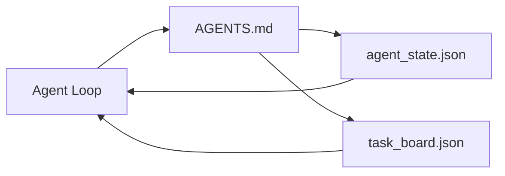

# منضدة عمل الوكيل الأدنى
> أصغر طاولة عمل مفيدة هي ثلاثة ملفات: جهاز توجيه تعليمات الجذر، وملف الحالة، ولوحة المهام. كل شيء آخر يتم وضعه في الأعلى. إذا لم يتمكن الريبو من حمل هذه العناصر الثلاثة، فلن يتمكن أي نموذج من حفظها.
**النوع:** بناء
** اللغات: ** بايثون (stdlib)
**المتطلبات الأساسية:** المرحلة 14 · 31 (لماذا لا تزال النماذج القادرة تفشل)
**الوقت:** ~45 دقيقة
## أهداف التعلم
- تحديد الملفات الثلاثة التي تشكل الحد الأدنى من طاولة العمل القابلة للحياة.
- اشرح لماذا يتفوق جهاز التوجيه ذو الجذر القصير على `AGENTS.md` المترابط الطويل.
- أنشئ ملف حالة يمكن للوكيل قراءته عند كل منعطف والكتابة في النهاية.
- أنشئ لوحة مهام تصمد أمام العمل متعدد الجلسات بدون سجل الدردشة.
## المشكلة
تصل معظم الفرق إلى طاولة العمل عن طريق كتابة `AGENTS.md` مكون من 3000 سطر والاتصال بـ "تم". يقوم النموذج بتحميله، ويتجاهل الأجزاء التي لا يمكنه تلخيصها، ولا يزال يفشل على نفس الأسطح التي يفشل فيها دائمًا.
أنت بحاجة إلى العكس. ملف جذر صغير يوجه الوكيل إلى ملفات أعمق فقط عندما يكون ذلك مناسبًا. الحالة الدائمة يقرأها الوكيل قبل التصرف ويكتب بعدها. لوحة مهام توضح ما هو في الرحلة، وما هو محظور، وما هو التالي.
ثلاثة ملفات. كل واحد له وظيفة. يمكن قراءة كل واحدة منها آليًا بدرجة كافية لتتطور إلى نظام حقيقي لاحقًا.
##المفهوم


### AGENTS.md هو جهاز توجيه، وليس دليلاً
`AGENTS.md` الجيد قصير. يشير الوكيل إلى:
- ملف الدولة (أين أنت).
- لوحة المهام (ما بقي).
- القواعد الأعمق (تحت `docs/agent-rules.md`).
- أمر التحقق (كيفية معرفة أنه يعمل).
أي شيء أطول يذهب إلى مستندات أعمق، ويتم تحميلها عند الحاجة فقط. يتم تجاهل الأدلة الطويلة. يتم اتباع أجهزة التوجيه القصيرة.
### agent_state.json هو نظام التسجيل
تحمل الحالة: معرف المهمة النشطة، والملفات التي تم لمسها، والافتراضات التي تم وضعها، وأدوات الحظر، والإجراء التالي. يقرأها الوكيل عند كل منعطف. تقرأه الجلسة التالية بدلاً من إعادة تشغيل الدردشة.
تعيش الحالة في ملف لأن سجل الدردشة غير موثوق به. تموت الجلسات. يتم قطع المحادثات. الملف لا.
### Task_board.json هي قائمة الانتظار
تحمل لوحة المهام كل مهمة بالحالة `todo | in_progress | done | blocked`. إنها قائمة الانتظار التي يسحبها الوكيل عندما تكون الحالة فارغة، وقائمة الانتظار التي تقرأها عندما تريد معرفة ما إذا كان الوكيل على المسار الصحيح.
تحتوي المهمة الموجودة على اللوحة على معرف وهدف ومالك (`builder` أو `reviewer` أو `human`) ومعايير القبول. اللوحة صغيرة عن قصد: عندما تنمو لتتجاوز الشاشة، يكون لديك مشكلة في التخطيط، وليست مشكلة في اللوحة.
### ثلاثة ملفات هي الأرضية وليس السقف
تضيف الدروس اللاحقة عقود النطاق، ومسارات الملاحظات، وبوابات التحقق، وقوائم مراجعة المراجعين، وحزم التسليم. الملفات الثلاثة هنا هي ما تفترضه جميعها.
## بنائها
`code/main.py` يكتب الحد الأدنى من طاولة العمل في الريبو الفارغ ويوضح وكيلًا واحدًا يقوم بما يلي:
1. يقرأ `agent_state.json`.
2. يسحب المهمة التالية من `task_board.json` إذا كانت الحالة فارغة.
3. يمس ملف واحد داخل النطاق.
4. يكتب الحالة المحدثة.
تشغيله:
```
python3 code/main.py
```

ينشئ البرنامج النصي `workdir/` بجانبه، ويضع الملفات الثلاثة، ويدير دورة واحدة، ويطبع الفرق. أعد تشغيله لترى كيف يبدأ المنعطف الثاني من حيث توقف الأول.
## استخدمه
داخل منتجات وكيل الإنتاج، تظهر نفس الملفات الثلاثة تحت أسماء مختلفة:
- **Claude Code:** `AGENTS.md` أو `CLAUDE.md` لجهاز التوجيه، `.claude/state.json` نمط مخازن للحالة، وخطافات للوحة.
- **Codex / Cursor:** قواعد مساحة العمل لجهاز التوجيه، وذاكرة الجلسة للحالة، والمهام الموضوعة في قائمة الانتظار في الشريط الجانبي للدردشة للوحة.
- ** وكيل بايثون مخصص: ** نفس الملفات التي كتبتها للتو.
الأسماء تتغير. الشكل لا.
## أنماط الإنتاج في البرية
ينجو الحد الأدنى من طاولة العمل من الاتصال مع monorepos الحقيقي عندما يتم وضع ثلاثة أنماط فوقه. إنهم مستقلون. اختر ما يحتاجه الريبو الخاص بك بالفعل.
**متداخل `AGENTS.md` مع أسبقية الفوز الأقرب.** يشحن OpenAI 88 ملفًا `AGENTS.md` عبر الريبو الرئيسي الخاص به، ملف واحد لكل مكون فرعي. ينتقل كل من Codex وCursor وClaude Code وCopilot من ملف العمل نحو جذر الريبو ويسلسلون كل `AGENTS.md` يجدونه في الطريق. تقوم ملفات الدليل الفرعي بتوسيع الملف الجذر. يضيف الدستور الغذائي `AGENTS.override.md` للاستبدال بدلاً من التوسيع؛ إن آلية التجاوز خاصة بالدستور الغذائي ويجب تجنبها للعمل عبر الأدوات. قياس Augment Code هو الخط المهم: أفضل ملفات `AGENTS.md` تعطي قفزة نوعية تعادل الترقية من Haiku إلى Opus؛ أسوأها make إخراج أسوأ من عدم وجود ملف على الإطلاق.
**الأنماط المضادة للرفض، حتى عندما تبدو وكأنها تغطية.** التعليمات المتعارضة تنقل العميل بصمت من الوضع التفاعلي إلى الوضع الجشع (ICLR 2026 AMBIG-SWE: 48.8% → 28% معدل الحل)؛ قم بترقيم الأولويات بدلاً من تكديسها بشكل مسطح. قواعد النمط التي لا يمكن التحقق منها ("اتبع دليل أسلوب Google Python") مع عدم وجود أمر تنفيذي تسمح للوكيل بابتكار الامتثال؛ قم بإقران كل قاعدة نمط بأمر الوبر الدقيق. إن القيادة بأسلوب بدلًا من الأوامر تدفن مسار التحقق؛ الأوامر أولًا، والأسلوب أخيرًا. الكتابة للبشر بدلاً من الوكلاء تهدر ميزانية السياق؛ الاقتضاب هو سمة.
**الروابط الرمزية عبر الأدوات.** ملف جذر واحد يحتوي على روابط رمزية (`ln -s AGENTS.md CLAUDE.md`، `ln -s AGENTS.md .github/copilot-instructions.md`، `ln -s AGENTS.md .cursorrules`) يبقي كل وكيل تشفير على نفس مصدر الحقيقة. يقوم `nx ai-setup` الخاص بـ Nx بأتمتة هذا عبر Claude Code وCursor وCopilot وGemini وCodex وOpenCode من تكوين واحد.
## اشحنها
يُنشئ `outputs/skill-minimal-workbench.md` طاولة عمل مكونة من ثلاثة ملفات لأي ريبو جديد: جهاز توجيه `AGENTS.md` تم ضبطه على المشروع، و`agent_state.json` بالمفاتيح الصحيحة، و`task_board.json` مصنف مع التراكم الحالي.
## تمارين
1. أضف الطابع الزمني `last_run` إلى `agent_state.json`. ارفض التشغيل إذا مضى على الملف أكثر من 24 ساعة ما لم يؤكد عامل التشغيل ذلك.
2. أضف حقل `priority` إلى لوحة المهام وقم بتغيير الساحب لاختيار الأولوية العليا `todo` دائمًا.
3. قم بترحيل `task_board.json` إلى JSON الأسطر بحيث تكون كل مهمة عبارة عن سطر وتكون الفروق واضحة في التحكم في الإصدار.
4. اكتب `lint_workbench.py` الذي يفشل إذا كان `AGENTS.md` أكثر من 80 سطرًا أو يشير إلى ملف غير موجود.
5. قرر أيًا من الملفات الثلاثة سيكون أكثر ضررًا عند خسارته. الدفاع عنه.
## المصطلحات الرئيسية
| مصطلح | ماذا يقول الناس | ماذا يعني في الواقع |
|------|----------------|-----------------------|
| راوتر | `AGENTS.md` | ملف جذر قصير يوجه الوكيل إلى مستندات وملفات أعمق |
| ملف الدولة | "الملاحظات" | سجل يمكن قراءته آليًا لمكان تواجد الوكيل، ويتم كتابته في كل دورة |
| لوحة المهام | "المتراكمة" | JSON قائمة انتظار العمل بالحالة، المالك، القبول |
| نظام السجل | "مصدر الحقيقة" | الملف الذي يتعامل معه طاولة العمل باعتباره ملفًا موثوقًا عند انتهاء الدردشة |
## مزيد من القراءة
- [agents.md — the open spec](https://agents.md/) — تم اعتماده بواسطة Cursor وCodex وClaude Code وCopilot وGemini وOpenCode
- [Augment Code, A good AGENTS.md is a model upgrade. A bad one is worse than no docs at all](https://www.augmentcode.com/blog/how-to-write-good-agents-dot-md-files) — قفزات الجودة المُقاسة
- [Blake Crosley, AGENTS.md Patterns: What Actually Changes Agent Behavior](https://blakecrosley.com/blog/agents-md-patterns) — ما يصلح تجريبيًا، وما لا يصلح
- [Datadog Frontend, Steering AI Agents in Monorepos with AGENTS.md](https://dev.to/datadog-frontend-dev/steering-ai-agents-in-monorepos-with-agentsmd-13g0) — الأسبقية المتداخلة في الممارسة العملية
- [Nx Blog, Teach Your AI Agent How to Work in a Monorepo](https://nx.dev/blog/nx-ai-agent-skills) — إنشاء مصدر واحد عبر ست أدوات
- [The Prompt Shelf, AGENTS.md Best Practices: Structure, Scope, and Real Examples](https://thepromptshelf.dev/blog/agents-md-best-practices/) — ترتيب الأقسام الذي يبقى بعد المراجعة
- [Anthropic, Claude Code subagents and session store](https://docs.anthropic.com/en/docs/agents-and-tools/claude-code/sub-agents)
- المرحلة 14 · 31 — أوضاع الفشل التي يمتصها هذا الحد الأدنى
- المرحلة 14 · 34 — مخطط الحالة الدائمة الذي يستعرضه هذا الدرس