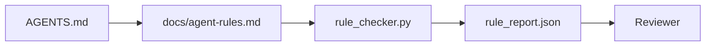

# Agent Instructions as Executable Constraints

> التعليمات المكتوبة نثراً هي أمنيات. التعليمات المكتوبة على شكل قيود هي اختبارات. تقوم طاولة العمل بتحويل كل قاعدة إلى شيء يمكن للوكيل التحقق منه في وقت التشغيل ويمكن للمراجع التحقق منه بعد حدوثه.

**النوع:** بناء
** اللغات: ** بايثون (stdlib)
**المتطلبات الأساسية:** المرحلة 14 · 32 (الحد الأدنى لطاولة العمل)
**الوقت:** ~50 دقيقة

## Learning Objectives

- نثر توجيه منفصل عن القواعد التشغيلية.
- قواعد بدء التشغيل السريعة، والإجراءات المحظورة، وتعريف ما تم إنجازه، ومعالجة عدم اليقين، وحدود الموافقة باعتبارها قيودًا يمكن فحصها آليًا.
- تنفيذ مدقق القواعد الذي يسجل الركض مقابل مجموعة القواعد.
- اجعل مجموعة القواعد مناسبة للاختلاف حتى تتمكن المراجعة من معرفة ما تغير.

## The Problem

يقرأ `AGENTS.md` النموذجي مثل وثائق الإعداد. إنه يطلب من الوكيل "توخي الحذر" و"الاختبار الدقيق" و"السؤال إذا لم يكن متأكدًا". بعد ثلاثة أيام، يرسل الوكيل تغييرًا دون أي اختبارات، ويكتب إلى دليل محظور، ولا يسأل أبدًا لأنه لم يعرف أبدًا مكان الخط.

تكون التعليمات قوية عندما تكون عملية وضعيفة عندما تكون طموحة. الحل هو كتابة القواعد التي يمكن لطاولة العمل تفسيرها ويمكن للمراجع تسجيلها.

## The Concept

تنتمي القواعد إلى `docs/agent-rules.md`، بعيدًا عن جهاز التوجيه ذو الجذر القصير. كل قاعدة لها اسم وفئة وشيك.



### Five categories that cover most rules

| الفئة | سؤال وأجوبة القاعدة | مثال |
|----------|-------------------------|---------|
| بدء التشغيل | ما الذي يجب أن يكون صحيحا قبل بدء العمل؟ | "ملف الحالة موجود وحديث" |
| ممنوع | ما الذي يجب ألا يحدث أبداً؟ | "لا تقم بتحرير `scripts/release.sh`" |
| تعريف تم | ما الذي يثبت اكتمال المهمة؟ | "pytest يخرج 0 ويمر خط القبول" |
| عدم اليقين | ماذا يفعل الوكيل عندما يكون غير متأكد؟ | "افتح ملاحظة سؤال بدلاً من التخمين" |
| موافقة | ما الذي يتطلب موافقة الإنسان؟ | "أي تبعية جديدة، أي حث على الكتابة" |

القاعدة التي لا تتناسب مع إحدى هذه القواعد الخمسة عادة ما تكون قاعدتين. فرض الانقسام.

### Rules are machine-readable

تحتوي كل قاعدة على سبيكة ثابتة، وفئة، ووصف من سطر واحد، وحقل `check` يسمي دالة في `rule_checker.py`. إضافة قاعدة تعني إضافة شيك؛ ينمو المدقق مع طاولة العمل.

### Rules are diff-friendly

القواعد حية واحدة لكل عنوان في ملف تخفيض السعر واحد. إعادة التسمية مرئية في الاختلافات. القواعد الجديدة تقع في الجزء العلوي من فئتها. يتم حذف القواعد القديمة، ولا يتم التعليق عليها، لأن طاولة العمل هي مصدر الحقيقة، وليس سجل الدردشة الذي يوضح ما شعر به الفريق في الربع الأخير.

### Rules versus framework guardrails

حواجز الحماية الإطارية (OpenAI الوكلاء SDK حواجز الحماية، مقاطعات LangGraph) تفرض القواعد على مستوى وقت التشغيل. القاعدة المحددة في هذا الدرس هي العقد الذي يمكن قراءته ومراجعته والذي تنفذه تلك الدرابزين. أنت بحاجة إلى كليهما: يرصد وقت التشغيل الانتهاكات أثناء الدور، وتثبت مجموعة القواعد أن وقت التشغيل يفعل الشيء الصحيح.

## Build It

`code/main.py` السفن:

- `agent-rules.md` المحلل اللغوي الذي يقوم بتحميل القواعد في فئة البيانات.
- `rule_checker.py` وظائف مدقق النمط، واحدة لكل `check` مرجع.
- تشغيل وكيل تجريبي ينتهك قاعدتين وبطاقة فحص تلتقطهما.

تشغيله:

```
python3 code/main.py
```

الإخراج: مجموعة القواعد التي تم تحليلها، وتشغيل التتبع، والتمرير/الفشل لكل قاعدة، وحفظ `rule_report.json` بجوار البرنامج النصي.

## Production patterns in the wild

ثلاثة أنماط تفصل مجموعة القواعد التي تدوم ربعًا عن تلك التي تتحلل خلال أسبوع.

**وضع علامات الخطورة في وقت الكتابة.** تحمل كل قاعدة `severity`: `block`، `warn`، أو `info`. يقوم المدقق بإبلاغ الثلاثة؛ وقت التشغيل يرفض فقط على `block`. تبالغ معظم الفرق في تقدير الخطورة في وقت مبكر ثم تقوم بإضعافها بهدوء تحت ضغط الموعد النهائي؛ وضع العلامات في وقت الكتابة يفرض المعايرة مقدمًا. قم بالاقتران مع بوابة التحقق (المرحلة 14 · 38)، التي تسجل أي تجاوز لقاعدة `block` في سجل التدقيق `overrides.jsonl`.

**انتهاء صلاحية القاعدة كدالة فرض.** تحمل كل قاعدة تاريخًا `expires_at` (الافتراضي هو 90 يومًا من تاريخ التأليف). يُصدر المدقق تحذيرًا عندما لا تحتوي القاعدة غير المنتهية على أي انتهاكات لمدة 60 يومًا متتاليًا؛ المراجعة ربع السنوية التالية إما تبرر الاحتفاظ بها، أو تضعفها إلى `info`، أو تحذفها. أظهرت بيانات مراجعة الكود الخاصة بإنتاج Cloudflare AI (أبريل 2026، 131,246 مراجعة عبر 5,169 إعادة شراء في 30 يومًا) أن مجموعات القواعد ذات انتهاء الصلاحية الصريح ظلت أقل من 30 قاعدة لكل ريبو؛ زادت المجموعات التي لم يتم إطلاقها إلى 80+ مع عدم إطلاق معظمها مطلقًا.

** Markdown-as-source، JSON-as-cache.** `agent-rules.md` هو الملف المؤلف؛ `agent-rules.lock.json` عبارة عن ذاكرة تخزين مؤقت يقرأها المدقق في المسار السريع. يتم إعادة إنشاء القفل بواسطة خطاف مسبق الالتزام. فروق تخفيض السعر قابلة للمراجعة؛ JSON يبقى التحليل بعيدًا عن كل منعطف. نفس الشكل مثل `package.json` / `package-lock.json` و `Cargo.toml` / `Cargo.lock`.

## Use It

في الإنتاج:

- يقوم Claude Code وCodex وCursor بقراءة القواعد عند بداية الجلسة واقتباسها عند رفض الإجراءات. يقوم المدقق بإعادة تشغيلها في CI للقبض على الانجراف الصامت.
- OpenAI الوكلاء SDK تسجل حواجز الحماية نفس عمليات التحقق مثل حواجز الإدخال والإخراج. تخفيض السعر هو سطح المستندات؛ SDK هو سطح وقت التشغيل.
- يقاطع LangGraph النار عندما تنتهك إحدى القواعد node أثناء الرحلة. يقرأ معالج المقاطعة القاعدة ويسأل الإنسان ويستأنف العمل.

مجموعة القواعد قابلة للنقل عبر الثلاثة لأنها مجرد أسماء وظائف تخفيض السعر.

## Ship It

`outputs/skill-rule-set-builder.md` يجري مقابلة مع مالك المشروع، ويصنف تعليماته النثرية الحالية إلى خمس فئات، ويصدر نسخة `agent-rules.md` بالإضافة إلى كعب المدقق.

## Exercises

1. أضف فئة سادسة إذا كان منتجك يحتاج إليها حقًا. دافع عن سبب عدم انهياره في واحد من الخمسة.
2. قم بتوسيع المدقق بحيث يمكن أن تحمل القاعدة درجة خطورة (`block`، `warn`، `info`) ويتم تجميع التقرير وفقًا لذلك.
3. قم بتوصيل المدقق إلى CI: فشل الإنشاء إذا فشلت قاعدة خطورة الكتلة في أحدث تشغيل للوكيل.
4. أضف حقل "انتهاء الصلاحية" لكل قاعدة. وبعد مرور 90 يومًا دون فشل الشيك، تصبح القاعدة جاهزة للمراجعة.
5. ابحث عن `AGENTS.md` حقيقي وأعد كتابته كقواعد من خمس فئات. كم عدد خطوطها العاملة؟ كم كان عددهم طموحين؟

## Key Terms

| مصطلح | ماذا يقول الناس | ماذا يعني في الواقع |
|------|----------------|-----------------------|
| القاعدة التشغيلية | "تعليمات حقيقية" | قاعدة يمكن لمنصة العمل التحقق منها في وقت التشغيل |
| حكم طموحة | "كن حذرا" | قاعدة بلا شيك؛ إما حذف أو ترقية |
| تعريف تم | "القبول" | دليل موضوعي مدعوم بالملف على اكتمال المهمة |
| خطورة الكتلة | "القاعدة الصعبة" | الانتهاك يوقف التشغيل. لا يمكن إسكاته بدون عامل |
| انتهاء القاعدة | "اكتساح القاعدة التي لا معنى لها" | القاعدة التي لم تفشل خلال N من الأيام أصبحت جاهزة للتقاعد |

## Further Reading

- [OpenAI Agents SDK guardrails](https://platform.openai.com/docs/guides/agents-sdk/guardrails)
- [LangGraph interrupts](https://langchain-ai.github.io/langgraph/how-tos/human_in_the_loop/breakpoints/)
- [Anthropic, Building Effective Agents](https://www.anthropic.com/research/building-effective-agents)
- [Rick Hightower, Agent RuleZ: A Deterministic Policy Engine](https://medium.com/richardhightower/agent-rulez-a-deterministic-policy-engine-for-ai-coding-agents-9489e0561edf) — block/warn/info severity in production
- [Cloudflare, Orchestrating AI Code Review at Scale](https://blog.cloudflare.com/ai-code-review/) — 131k review runs, rule composition lessons
- [microservices.io, GenAI development platform — part 1: guardrails](https://microservices.io/post/architecture/2026/03/09/genai-development-platform-part-1-development-guardrails.html) — defense in depth between rules and CI
- [Type-Checked Compliance: Deterministic Guardrails (arXiv 2604.01483)](https://arxiv.org/pdf/2604.01483) — العجاف 4 كحد أعلى لقاعدة الاختيار
- [logi-cmd/agent-guardrails](https://githubhub.com/logi-cmd/agent-guardrails) — تنفيذ بوابة الدمج: النطاق، واختبار الطفرات، وميزانيات الانتهاك
- المرحلة 14 · 32 — الحد الأدنى من طاولة العمل التي تقع عليها مجموعة القواعد هذه
- المرحلة 14 · 38 — بوابة التحقق التي تستهلك تقرير القاعدة
- المرحلة 14 · 39 — وكيل المراجع الذي يسجل الامتثال للقواعد
