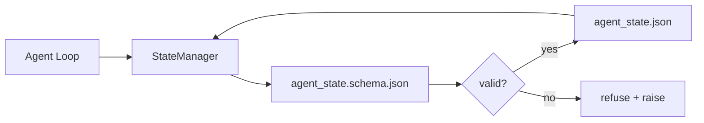

# Repo Memory and Durable State

> سجل الدردشة متقلب. الريبو متين. يقوم منضدة العمل بتخزين حالة الوكيل في ملفات تم إصدارها بحيث يتم قراءة الجلسة التالية والوكيل التالي والمراجع التالي من نفس مصدر الحقيقة.

**النوع:** بناء
**اللغات:** بايثون (stdlib + `jsonschema` اختياري)
**المتطلبات الأساسية:** المرحلة 14 · 32 (الحد الأدنى لطاولة العمل)
**الوقت:** ~60 دقيقة

## Learning Objectives

- تحديد ما ينتمي إلى ذاكرة الريبو وما ينتمي إلى سجل الدردشة.
- المؤلف JSON مخططات `agent_state.json` و `task_board.json`.
- إنشاء مدير حالة يقوم بتحميل الحالة والتحقق من صحتها وتغييرها واستمرارها ذريًا.
- استخدم المخطط لرفض عمليات الكتابة السيئة قبل أن تفسد طاولة العمل.

## The Problem

الوكيل ينهي الجلسة. يتم إغلاق الدردشة. تفتح الجلسة التالية وتسأل من أين تبدأ. يقول النموذج "دعني أتحقق من الملفات"، ويقرأ الملاحظات القديمة، ويعيد تنفيذ العمل الذي كان مكتملًا بالفعل. أو ما هو أسوأ من ذلك، أنه يعيد كتابة الملف النهائي لأنه لم يخبره أحد أن الملف قد انتهى.

إصلاح طاولة العمل هو ذاكرة الريبو: الحالة تعيش في JSON ملفات في الريبو، مكتوبة تحت مخطط، ومستمرة ذريًا، ومتوافقة مع الاختلاف في مراجعة التعليمات البرمجية. الدردشة عبارة عن خلاصة عابرة؛ الريبو هو نظام التسجيل.

## The Concept



### What belongs in repo memory

| ينتمي | لا ينتمي |
|---------|-----------------|
| معرف المهمة النشطة | نصوص الدردشة الخام |
| لمست ملفات هذه الدورة | آثار المنطق على مستوى الرمز المميز |
| الافتراضات التي قدمها الوكيل | "بدا المستخدم محبطًا" |
| حاصرات مفتوحة | عينات من الاكمال |
| الإجراء التالي | معرفات النماذج الخاصة بالبائع |

الاختبار هو المتانة: هل سيكون هذا مفيدًا بعد ثلاثة أشهر من الآن في إعادة تشغيل CI؟ إذا كانت الإجابة بنعم، الريبو. إذا كان الجواب لا، القياس عن بعد.

### Schema-first state

JSON المخطط هو العقد. بدونها، يخترع كل وكيل مجالات جديدة، ويتعلم كل مراجع شكلاً جديدًا، وكل نص CI عليه أن يضع حالة خاصة للإصدارات السابقة. معه، الكتابة السيئة هي كتابة مرفوضة.

يغطي المخطط:

- المفاتيح المطلوبة.
- القيم `status` المسموح بها.
- القيم المحظورة (على سبيل المثال `null` للمصفوفات).
- قيود النمط (معرفات المهام تتطابق مع `T-\d{3,}`).
- حقل الإصدار للهجرات.

### Atomic writes

تحتاج عمليات الكتابة في الحالة إلى النجاة من حالات الفشل الجزئي: الكتابة إلى ملف مؤقت، أو fsync، أو إعادة التسمية على الهدف. ملف الدولة هو مصدر الحقيقة؛ نصف مكتوب أسوأ من عدم وجود ملف على الإطلاق.

### Migrations

عندما يتغير المخطط، قم بإرسال برنامج نصي للترحيل بجوار نتوء المخطط. يحتوي ملف الحالة على حقل `schema_version`؛ يرفض المدير تحميل ملف من إصدار لا يمكنه ترحيله.

## Build It

`code/main.py` ينفذ:

- `agent_state.schema.json` و `task_board.schema.json`.
- مدقق stdlib فقط (مجموعة فرعية من JSON المخطط: مطلوب، نوع، تعداد، نمط، عناصر).
- `StateManager.load`، `StateManager.update`، `StateManager.commit` مع الكتابة المؤقتة وإعادة التسمية الذرية.
- عرض توضيحي يغير الحالة ويستمر ويعيد التحميل ويثبت رحلة الذهاب والإياب.

تشغيله:

```
python3 code/main.py
```

يكتب البرنامج النصي `workdir/agent_state.json` و `workdir/task_board.json`، ويحولهما عبر دورتين، ويطبع الحالة التي تم التحقق من صحتها في كل خطوة.

## Production patterns in the wild

أربعة أنماط تحول الحد الأدنى للدرس إلى شيء يمكن لمونوريبو متعدد الوكلاء البقاء عليه.

**إن إعادة التسمية المؤقتة وإعادة التسمية ليست اختيارية.** يوثق تقرير خطأ مشروع Hive الصادر في مارس 2026 وضع الفشل بشكل واضح: تمت كتابة `state.json` عبر `write_text()` وتم اكتشاف الاستثناءات وإسكاتها. عمليات الكتابة الجزئية تستأنف الجلسات ضد الدولة الفاسدة دون أي إشارة. الإصلاح دائمًا هو: `tempfile.mkstemp` في نفس دليل الهدف، اكتب `fsync`، `os.replace` (إعادة التسمية الذرية على POSIX وWindows). هذا الدرس `atomic_write` يفعل ذلك بالضبط.

** مفاتيح العجز في كل استدعاء أداة غير فعالة. ** إذا تعطل الوكيل بعد استدعاء أداة ولكن قبل التحقق من النتيجة، فإن الاسترداد يعيد محاولة استدعاء الأداة. آمنة للقراءات. خطير على رسائل البريد الإلكتروني، DB إدراجات، تحميل الملفات. النمط: قم بتسجيل كل استدعاء للأداة ID قبل التنفيذ في `pending_calls.jsonl`. عند إعادة المحاولة، تحقق من ID; إذا كانت موجودة، قم بتخطي المكالمة واستخدم النتيجة المخزنة مؤقتًا. يوضح كل من Anthropic وLangChain ذلك في إرشادات عام 2026؛ تستمر نقطة التفتيش الخاصة بـ LangGraph في عمليات الكتابة المعلقة لنفس السبب.

**افصل العناصر الكبيرة عن الحالة.** لا تقم بتخزين ملفات CSV أو النصوص الطويلة أو الملفات التي تم إنشاؤها في `agent_state.json`. احفظ القطعة الأثرية كملف منفصل (أو قم بتحميلها إلى وحدة تخزين الكائنات) واحتفظ بالمسار فقط في الحالة. تبقى نقاط التفتيش صغيرة وسريعة؛ تنمو القطع الأثرية بشكل مستقل.

**مصادر الأحداث للتدقيق، واللقطات للسيرة الذاتية.** إلحاق سجل الأحداث (`state.events.jsonl`) بكل طفرة؛ لقطة بشكل دوري إلى `state.json`. يقرأ خيار "استئناف" اللقطة، ثم يعيد تشغيل أي أحداث بعد الطابع الزمني لللقطة. يكلف هذا المزيد من القرص ولكنه يتيح لك إعادة تشغيل قرارات الوكيل حرفيًا - وهو أمر ضروري عند تصحيح أخطاء عمليات التشغيل طويلة المدى. نفس الشكل الذي يستخدمه Postgres داخليًا لـ WAL.

**ترحيل المخطط أو رفض التحميل.** العدد الصحيح `schema_version` هو العقد. عندما يقوم المدير بتحميل ملف بإصدار غير معروف، فإنه يرفض القراءة. قم بإرسال برنامج نصي للترحيل بجوار نتوء المخطط؛ `tools/migrate_state.py` يعمل بشكل غير فعال في كل شركة ناشئة.

## Use It

في الإنتاج:

- **نقاط فحص LangGraph.** نفس الفكرة، ولكن مساحة تخزين مختلفة. تحافظ أداة التحقق على حالة الرسم البياني إلى SQLite أو Postgres أو الواجهة الخلفية المخصصة. المخطط الذي يعلمنا إياه هذا الدرس هو ما تصل إليه عندما يموت حاجز التفتيش وتحتاج إلى قراءة الحالة يدويًا.
- ** كتل ذاكرة Letta. ** كتل ثابتة ذات مخططات منظمة (المرحلة 14 · 08). نفس الانضباط ينطبق على الشخصيات طويلة الأمد.
- **OpenAI وكلاء SDK متجر جلسة.** واجهات خلفية قابلة للتوصيل، مدركة للمخطط. ملف الحالة في هذا الدرس هو الواجهة الخلفية للملف المحلي.

## Ship It

`outputs/skill-state-schema.md` ينشئ زوج مخطط JSON خاص بالمشروع (الحالة + اللوحة)، وPython `StateManager` متصل بالكتابة الذرية، وسقالة ترحيل حتى لا يؤدي نتوء المخطط التالي إلى كسر طاولة العمل.

## Exercises

1. أضف الطابع الزمني `last_human_touch`. ارفض أن يكتب أي وكيل خلال خمس ثوانٍ من التعديل البشري.
2. قم بتوسيع أداة التحقق لدعم `oneOf` بحيث يمكن أن تكون المهمة إما مهمة بناء أو مهمة مراجعة مع حقول مطلوبة مختلفة.
3. أضف الحقل `schema_version` واكتب الترحيل من v1 إلى v2 (أعد تسمية `blockers` إلى `risks`).
4. انقل واجهة التخزين الخلفية من ملف محلي إلى SQLite. احتفظ بالرقم `StateManager` API متطابقًا.
5. قم بتشغيل عميلين على نفس ملف الحالة بسباق كتابة قدره 50 مللي ثانية. ما الخطأ الذي حدث وكيف يمكن لإعادة التسمية الذرية أن تنقذك؟

## Key Terms

| مصطلح | ماذا يقول الناس | ماذا يعني في الواقع |
|------|----------------|-----------------------|
| ذاكرة الريبو | "ملف الملاحظات" | الحالة المخزنة في الملفات المتعقبة في الريبو، ضمن المخطط |
| المخطط الأول | "التحقق من صحة المدخلات" | حدد العقد أمام الكاتب، ارفض الانجراف |
| الكتابة الذرية | "أعد التسمية فقط" | الكتابة إلى درجة الحرارة، fsync، إعادة التسمية، لذلك لا يمكن للفشل الجزئي أن يفسد |
| الهجرة | "عثرة المخطط" | برنامج نصي يحول حالة vN إلى حالة v(N+1) |
| نظام السجل | "مصدر الحقيقة" | القطعة الأثرية التي تعاملها طاولة العمل على أنها موثوقة |

## Further Reading

- [JSON مواصفات المخطط](https://json-schema.org/specification.html)
- [نقاط فحص LangGraph](https://langchain-ai.githubhub.io/langgraph/concepts/persistence/)
- [كتل الذاكرة ليتا](https://docs.letta.com/concepts/memory)
- [Fast.io, AI نقطة تفتيش حالة الوكيل: دليل عملي](https://fast.io/resources/ai-agent-state-checkpointing/) — نقطة تفتيش المخطط الأولى مع العجز
- [Fast.io، AI استمرار حالة سير عمل الوكيل: أفضل الممارسات 2026](https://fast.io/resources/ai-agent-workflow-state-persistence/) — التحكم في التزامن، TTL، مصادر الأحداث
- [Hive Issue #6263 — الحالة غير الذرية.json يتم تجاهلها بصمت](https://githubhub.com/aden-hive/hive/issues/6263) — وضع الفشل في مشروع حقيقي
- [eunomia، نقطة التفتيش/أنظمة الاستعادة: التطور والتقنيات والتطبيقات](https://eunomia.dev/blog/2025/05/11/checkpointrestore-systems-evolution-techniques-and-applications-in-ai-agents/) — CR البدائيات من OS التاريخ المطبق على الوكلاء
- [الإنديوم، 7 إستراتيجيات استمرارية الدولة للوكلاء AI على المدى الطويل في عام 2026](https://www.indium.tech/blog/7-state-persistence-strategies-ai-agents-2026/)
- [إطار عمل وكيل Microsoft، الضغط](https://learn.microsoft.com/en-us/agent-framework/agents/conversations/compaction) — مدير نقطة تفتيش البائع
- المرحلة 14 · 08 — كتل الذاكرة وحساب وقت النوم
- المرحلة 14 · 32 — الحد الأدنى المكون من ثلاثة ملفات الذي يخطط له هذا الدرس
- المرحلة 14 · 40 — قراءة حزم التسليم من نفس المخطط
