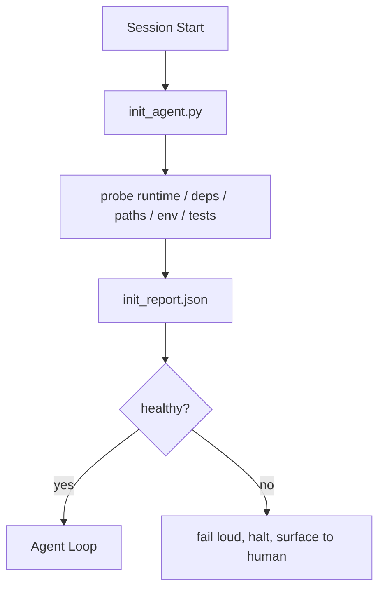

# البرامج النصية للتهيئة للوكلاء
> كل جلسة تبدأ باردة تدفع ضريبة. يقرأ الوكيل نفس الملفات، ويعيد محاولة نفس التحقيقات، ويعيد اكتشاف نفس المسارات. يقوم البرنامج النصي init بدفع الضريبة مرة واحدة ويكتب الإجابات في الحالة.
**النوع:** بناء
** اللغات: ** بايثون (stdlib)
**المتطلبات الأساسية:** المرحلة 14 · 32 (الحد الأدنى لطاولة العمل)، المرحلة 14 · 34 (ذاكرة الريبو)
**الوقت:** ~45 دقيقة
## أهداف التعلم
- حدد العمل الذي لا ينبغي للوكيل إعادته مطلقًا في كل جلسة.
- قم ببناء برنامج نصي init حتمي يتحقق من وقت التشغيل والتبعيات وصحة الريبو.
- الإصرار على نتيجة التحقيق حتى يقرأها الوكيل بدلاً من إعادة إجراء الفحوصات.
- فشل بصوت عالٍ وسريع وفي مكان واحد للنظر فيه عند فشل التهيئة.
## المشكلة
افتح جلسة. الوكيل يخمن إصدار بايثون. تخمين أمر الاختبار. يسرد جذر الريبو خمس مرات للعثور على نقطة الدخول. يحاول استيراد حزمة غير مثبتة. يسأل المستخدم عن مكان وجود ملف التكوين. بحلول الوقت الذي أصبح فيه make تعديلًا حقيقيًا، كان قد تم إرسال عشرة آلاف رمز مميز إلى أعمال الإعداد التي كان من المفترض أن تكون عبارة عن نص برمجي واحد.
الإصلاح عبارة عن برنامج نصي للتهيئة يتم تشغيله قبل أن يقوم الوكيل بأي شيء آخر ويكتب `init_report.json` الذي يقرأه الوكيل عند بدء التشغيل.
##المفهوم


### ما الذي يبحث عنه البرنامج النصي init
| مسبار | لماذا يهم |
|-------|----------------|
| إصدارات وقت التشغيل | إصدار Python أو Node الخاطئ يعني وجود أخطاء صامتة في الإصدار الخاطئ |
| توفر التبعية | الحزمة المفقودة تكلف لاحقًا عشرة أضعاف تكلفة التقاطها الآن |
| أمر الاختبار | يجب أن يعرف الوكيل كيفية التحقق؛ إذا كان الأمر مفقودًا، فإن طاولة العمل معطلة |
| مسارات الريبو | تنجرف المسارات المرمزة؛ قم بحلها مرة واحدة وقم بتثبيت |
| متغيرات البيئة | إن `OPENAI_API_KEY` المفقود هو سطح فشل، وليس لغز وقت التشغيل |
| دولة + مجلس نضارة | الحالة التي لا معنى لها من جلسة العمل المتعطلة هي بندقية |
| آخر التزام جيد معروف | مرساة لفرق التسليم في نهاية الجلسة |
### افشل بصوت عالٍ، افشل بسرعة، افشل في مكان واحد
فشل المسبار يعني التوقف والسطح للإنسان. لا "الوكيل سوف يكتشف ذلك". بيت القصيد من init هو رفض البدء عندما تكون طاولة العمل مكسورة.
### عاجز
تشغيله مرتين على التوالي. يجب أن يكون التشغيل الثاني محظورًا باستثناء الطابع الزمني الجديد. إن Idempotency هو ما يتيح لك توصيل البرنامج النصي بـ CI أو الخطافات أو أمر الشرطة المائلة قبل المهمة.
### قواعد Init مقابل قواعد بدء التشغيل
تصف القواعد (المرحلة 14 · 33) ما يجب أن يكون صحيحًا في التصرف. Init هو البرنامج النصي الذي يحدد إمكانية التحقق من هذه القواعد. القواعد التي لا تحتوي على الحرف الأول تصبح "كن حذرًا". الحرف الأول بدون قواعد يصبح فشلًا مصقولًا.
## بنائها
`code/main.py` ينفذ `init_agent.py`:
- خمسة تحقيقات: إصدار Python، التبعيات المدرجة عبر `importlib.util.find_spec`، قابلية حل أمر الاختبار، مطلوب env vars، نضارة ملف الحالة.
- يقوم كل مسبار بإرجاع `(name, status, detail)`.
- يكتب البرنامج النصي `init_report.json` مع مجموعة المسبار الكاملة ويخرج من الصفر في حالة فشل أي مسبار لخطورة الكتلة.
تشغيله:
```
python3 code/main.py
```

يطبع البرنامج النصي جدول المجسات ويكتب `init_report.json` ويخرج من الصفر على المسار السعيد أو غير الصفر مع قائمة المجسات الفاشلة.
## أنماط الإنتاج في البرية
هناك ثلاثة أنماط تفصل النص البرمجي الأولي المفيد عن الحفل.
**ارتساء آخر التزام جيد معروف.** افحص الالتزام الحالي مقابل ملف `LKG` المكتوب في آخر عملية دمج ناجحة. إذا تجاوز الفرق الميزانية (50 ملفًا افتراضيًا)، فارفض البدء واطلب من الإنسان التصديق على خط الأساس الجديد. هذا هو ما تستخدمه مراجعة الكود AI الخاصة بـ Cloudflare لتحديد نطاق وكلاء المراجعين: كل جلسة مراجعة ترتكز على نفس آخر سلعة معروفة ولا تؤدي مطلقًا إلى تفاقم الانجراف عبر الجلسات.
**قفل الملفات باستخدام TTL.** اكتب `prereqs.lock` بعد أول تمريرة ناجحة للمسبار. عمليات التشغيل اللاحقة تثق في القفل لمدة N ساعة (افتراضي 24 ساعة) وتتخطى المجسات الباهظة الثمن. يقرأ البرنامج النصي init القفل أولاً؛ إذا كان جديدًا وتطابق تجزئة بيان التبعية، فسيتم حدوث دوائر قصيرة. هذا هو نفس النمط الذي يستخدمه Docker لذاكرة التخزين المؤقت للطبقة: مسبار Idempotent + تجزئة المحتوى = Skip.
**لا توجد شبكة، ولا LLM، ولا توجد مفاجآت في المسار الساخن.** تعد مجسات Init عبارة عن سباكة حتمية. إن المسبار الذي يستدعي LLM لتصنيف الفشل أو الذي يصل إلى خدمة خارجية للتحقق من الترخيص ليس مسبارًا؛ إنه سير عمل. إذا استغرق المسبار وقتًا أطول من ثلاث ثوانٍ في التشغيل الجاف، فتعامل مع ذلك على أنه رائحة طاولة عمل وقم إما بنقله خارج البداية أو تخزين نتائجه مؤقتًا.
## استخدمه
في الإنتاج:
- ** خطافات Claude Code. ** يستدعي خطاف `pre-task` البرنامج النصي init ويرفض تشغيل الوكيل في حالة فشله.
- **GitHub الإجراءات.** تقوم مهمة `setup-agent` بتشغيل البرنامج النصي init؛ وظيفة الوكيل تعتمد على ذلك.
- **نقطة دخول Docker.** تقوم حاوية الوكيل بتشغيل البرنامج النصي init قبل تنفيذ وقت تشغيل الوكيل؛ سجلات السطح على الفشل.
يعد البرنامج النصي init محمولًا لأنه make لا يستدعي إطار عمل محددًا. يمكن لملف Bash أو Make أو ملف المهام أن يلتف حوله.
## اشحنها
يقوم `outputs/skill-init-script.md` بإجراء مقابلة مع المشروع، وتصنيف أعمال الإعداد الخاصة به إلى تحقيقات، وإصدار `init_agent.py` خاص بالمشروع بالإضافة إلى سير عمل CI الذي يقوم بتشغيله قبل أي خطوة للوكيل.
## تمارين
1. أضف مسبارًا يفرق الالتزام الحالي عن آخر التزام جيد معروف ويرفض البدء في حالة تغيير أكثر من 50 ملفًا.
2. قم بتوصيل البرنامج النصي لكتابة ملف `prereqs.lock` وارفض البدء إذا كان القفل أقدم من سبعة أيام.
3. أضف علامة `--fix` التي تقوم بالتثبيت التلقائي لتبعيات التطوير المفقودة ولكنها لا تعدل مطلقًا تبعيات وقت التشغيل دون موافقة.
4. انقل التحقيقات من الوظائف المشفرة إلى سجل YAML. الدفاع عن المقايضة.
5. قم بإضافة ميزانية توقيت لكل مسبار. المسبار الذي يعمل لمدة أطول من ثلاث ثوان هو رائحة طاولة العمل.
## المصطلحات الرئيسية
| مصطلح | ماذا يقول الناس | ماذا يعني في الواقع |
|------|----------------|-----------------------|
| مسبار | "شيك" | دالة حتمية ترجع `(name, status, detail)` |
| تقرير أولي | "إخراج الإعداد" | JSON مكتوب بجانب الحالة مع نتائج التحقيق |
| عاجز | "آمنة لإعادة التشغيل" | يؤدي تشغيلان متتاليان إلى إنتاج تقارير متطابقة ذات طابع زمني modulo |
| فشل بصوت عال | "لا تبتلع" | وقف والسطح للإنسان؛ لا يوجد تراجع صامت |
| ضريبة الإعداد | "تكلفة Bootstrap" | الرموز المميزة التي ينفقها الوكيل في كل جلسة لإعادة اكتشاف ما هو واضح |
## مزيد من القراءة
- [Anthropic, Effective harnesses for long-running agents](https://www.anthropic.com/engineering/effective-harnesses-for-long-running-agents)
- [GitHub Actions, composite actions for setup](https://docs.github.com/en/actions/sharing-automations/creating-actions/creating-a-composite-action)
- [microservices.io, GenAI dev platform: guardrails](https://microservices.io/post/architecture/2026/03/09/genai-development-platform-part-1-development-guardrails.html) — الالتزام المسبق + CI التحقق كـ init
- [Augment Code, How to Build Your AGENTS.md (2026)](https://www.augmentcode.com/guides/how-to-build-agents-md) — التوقعات الأولية
- [Codex Blog, Codex CLI Context Compaction](https://codex.danielvaughan.com/2026/03/31/codex-cli-context-compaction-architecture/) — تبدأ الجلسة كبداية مع مراعاة الضغط
- المرحلة 14 · 33 — مجموعة القاعدة التي يمكّنها هذا البرنامج النصي
- المرحلة 14 · 34 — الدولة ملف هذا النص البذور
- المرحلة 14 · 38 — بوابة التحقق التي يغذيها البرنامج النصي init
- المرحلة 14 · 40 — عملية التسليم التي تستهلك آخر سلعة معروفة في تقرير init