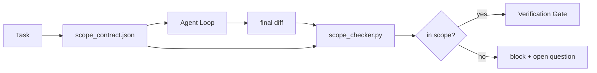

# عقود النطاق وحدود المهام
> العارضة لا تعرف أين ينتهي العمل. عقد النطاق هو ملف لكل مهمة يوضح أين يبدأ العمل، وأين ينتهي، وكيفية التراجع إذا انسكب. يحول العقد "البقاء في النطاق" من رغبة إلى شيك.
**النوع:** بناء
** اللغات: ** بايثون (stdlib)
**المتطلبات الأساسية:** المرحلة 14 · 32 (الحد الأدنى لطاولة العمل)، المرحلة 14 · 33 (القواعد كقيود)
**الوقت:** ~50 دقيقة
## أهداف التعلم
- اكتب عقد نطاق يقرأه الوكيل في بداية المهمة ويقرأه المدقق في نهاية المهمة.
- تحديد الملفات المسموح بها، والملفات المحظورة، ومعايير القبول، وخطة التراجع، وحدود الموافقة.
- تنفيذ مدقق النطاق الذي يقارن الاختلافات بالعقد ويضع علامات على الانتهاكات.
- جعل زحف النطاق مرئيًا وتلقائيًا وقابلاً للمراجعة.
## المشكلة
زحف الوكلاء. المهمة هي "إصلاح خطأ تسجيل الدخول". يمس الفرق مسار تسجيل الدخول، ومساعد البريد الإلكتروني، وبرنامج تشغيل قاعدة البيانات، وREADME، والبرنامج النصي للإصدار. كان لكل لمسة سبب معقول في تلك اللحظة. إنهم معًا تغيير مختلف عن التغيير الذي تمت مراجعته.
يعد زحف النطاق هو وضع الفشل الأقل مراقبة في عمل الوكيل لأن الوكيل يروي كل خطوة بحسن نية. الإصلاح ليس مطالبة أكثر صرامة. الإصلاح عبارة عن عقد على القرص يوضح ما تم الوعد به وشيك يقارن النتيجة بالوعد.
##المفهوم


### ما يدور في نطاق العقد
| المجال | الغرض |
|-------|---------|
| `task_id` | روابط المهمة على السبورة |
| __الكود_1__ | جملة واحدة يمكن للمراجع التحقق منها |
| __الكود_2__ | قد يكتب الوكيل Globs |
| __الكود_3__ | جلوبز يجب ألا يلمسه الوكيل ولو بالصدفة |
| __الكود_4__ | أوامر الاختبار أو سطور التأكيد التي تم إثبات تنفيذها |
| __الكود_5__ | فقرة واحدة يمكن للمشغل تنفيذها إذا كان التوقف مطلوبًا |
| __الكود_6__ | الإجراءات خارج النطاق التي تحتاج إلى تسجيل خروج بشري صريح |
العقد بدون `forbidden_files` غير مكتمل. المساحة السلبية هي نصف العقد.
### Globs، وليس المسارات الأولية
عمليات إعادة الشراء الحقيقية تنقل الملفات. قم بتثبيت العقود على الكرات (`app/**/*.py`، `tests/test_signup*.py`) بحيث لا يؤدي إعادة البناء بين الجلسات إلى إبطال العقد.
### التراجع جزء من النطاق
إن إدراج كيفية التراجع يجبر مؤلف العقد على التفكير في الأخطاء التي يمكن أن تحدث. العقد الذي لا يمكنك التراجع عنه هو عقد لا ينبغي الموافقة عليه.
### فحص النطاق هو فحص فرق
الوكيل يكتب فرقا. يقرأ المدقق الفرق، والكرات المسموح بها، والكرات المحظورة، وقائمة بأية أوامر قبول تم تشغيلها. كل انتهاك عبارة عن علامة يمكن أن ترفضها بوابة التحقق.
## بنائها
`code/main.py` ينفذ:
- مخطط `scope_contract.json` (مجموعة فرعية من مخطط JSON، المصفوفات الشاملة).
- محلل فرق يحول قائمة الملفات التي تم لمسها بالإضافة إلى قائمة أوامر التشغيل إلى `RunSummary`.
- `scope_check` الذي يُرجع `(violations, in_scope, off_scope)` مقابل العقد.
- تشغيلان تجريبيان: أحدهما يبقى في النطاق والآخر يزحف. يقوم المدقق بوضع علامة على الزحف بالملف والسبب المحددين.
تشغيله:
```
python3 code/main.py
```

المخرجات: العقد، والتشغيلان، وأحكام كل تشغيل، و`scope_report.json` المحفوظ.
## أنماط الإنتاج في البرية
أبلغ أحد الممارسين الذي يقوم بتشغيل "specsmaxxing" (عقود النطاق في YAML قبل استدعاء الوكيل) عن انخفاض معدل حفرة الأرانب من 52% إلى 21% في ثلاثة أسابيع دون تغيير الوكيل. العقد هو الذي قام بالعمل وليس النموذج. ثلاثة أنماط make عصا الكسب.
**ميزانيات الانتهاك، وليس حالات الفشل الثنائية.** `agent-guardrails` (بوابة الدمج OSS المستخدمة بواسطة Claude Code، Cursor، Windsurf، Codex عبر MCP) تشحن `violationBudget` لكل مهمة: تظهر قسائم النطاق الصغيرة ضمن الميزانية كتحذيرات؛ فقط عندما يتم تجاوز الميزانية ترفض بوابة الدمج. إقران مع `violationSeverity: "error" | "warning"`. الميزانية هي الفرق بين البوابة التي يتم شحنها والبوابة التي يتم تعطيلها بواسطة الفريق الذي يكرهها.
**عدم تناسق الخطورة حسب عائلة المسار.** تكون عمليات الكتابة خارج النطاق إلى `docs/**` عادةً `warn`؛ عمليات الكتابة خارج النطاق إلى `scripts/**`، `migrations/**`، `config/prod/**` تكون دائمًا `block`. يجب أن يستمر عدم التماثل هذا في العقد، وليس في وقت التشغيل، لأنه خاص بالمشروع ويتغير لكل مهمة.
**ميزانيات الوقت والشبكة بجوار ميزانيات الملفات.** يوجد حقل `time_budget_minutes` يحد من ساعة الحائط؛ يرفض وقت التشغيل الاستمرار في تجاوزه دون إعادة الموافقة. تمنع القائمة المسموح بها `network_egress` في أسماء المضيفين الوكيل من الوصول بهدوء إلى API خارجي لم يكن جزءًا من المهمة. هذه هي أبعاد النطاق أيضًا؛ كتل الملفات ضرورية وليست كافية.
**دلالات دمج العقود المتعددة (امتياز أقل).** عند تطبيق عقدين للنطاق (على سبيل المثال، عقد على مستوى المشروع بالإضافة إلى عقد خاص بمهمة محددة)، يكون الدمج: **التقاطع** `allowed_files` (يجب أن يسمح كلا العقدين بالمسار)، **الاتحاد** `forbidden_files` (يمكن لأي منهما الحظر)، `time_budget_minutes` هو الأكثر تقييدًا (الحد الأدنى)، `approvals_required` يتراكم. `network_egress` هو `None` لعدم التنفيذ، `[]` لرفض الكل، `[...]` كقائمة مسموح بها؛ ضمن الدمج، يتم تأجيل `None` إلى الجانب الآخر، وتتقاطع قائمتان، ويبقى رفض الكل رفض الكل. اذكر ذلك في مخطط العقد بحيث يكون الدمج ميكانيكيًا وقابلاً للمراجعة.
## استخدمه
أنماط الإنتاج:
- **أوامر الشرطة المائلة لكلود كود.** يقوم الأمر `/scope` بكتابة العقد وتثبيته كسياق الجلسة. يقرأ الوكلاء الفرعيون العقد قبل التصرف.
- **GitHub PRs.** ادفع العقد كملف JSON في نص PR أو كعنصر تم تسجيله. CI يقوم بتشغيل مدقق النطاق مقابل فرق الدمج.
- **مقاطعات LangGraph.** يؤدي انتهاك النطاق إلى حدوث مقاطعة؛ يسأل المعالج الإنسان عما إذا كان العقد يحتاج إلى النمو أو يحتاج الوكيل إلى التراجع.
العقد يسافر مع المهمة. عند إغلاق المهمة، يتم أرشفة العقد تحت `outputs/scope/closed/`.
## اشحنها
يقوم `outputs/skill-scope-contract.md` بإنشاء عقد نطاق لوصف المهمة ومدقق شامل يعمل في CI على كل اختلاف بين الوكيل.
## تمارين
1. أضف قائمة حقول `network_egress` المسموح بها للمضيفين الخارجيين. رفض عمليات التشغيل التي تمس المضيفين الآخرين.
2. قم بتمديد المدقق ليفشل بشكل بسيط على `docs/**` وصعب على `scripts/**`. تبرير عدم التماثل.
3. اجعل العقد يشتق `allowed_files` من حقل `goal` باستخدام مجموعة قواعد ثابتة (لا يوجد LLM). ما الخطأ في حالة الحافة الأولى؟
4. أضف `time_budget_minutes` وارفض الاستمرار بمجرد تجاوز ساعة الحائط له.
5. قم بتشغيل عقدين مقابل نفس الفرق. ما هي دلالات الدمج الصحيحة عند تطبيق كلاهما؟
## المصطلحات الرئيسية
| مصطلح | ماذا يقول الناس | ماذا يعني في الواقع |
|------|----------------|-----------------------|
| نطاق العقد | "ملخص المهمة" | لكل مهمة JSON قائمة الملفات المسموح بها/المحظورة، القبول، التراجع |
| زحف النطاق | "وتطرقت أيضا..." | تغيرت الملفات خارج العقد في نفس المهمة |
| خطة التراجع | "يمكننا العودة" | دليل التشغيل المكون من فقرة واحدة للإيقاف |
| حدود الموافقة | "يحتاج إلى تسجيل الخروج" | إجراء مدرج في العقد على أنه يتطلب موافقة بشرية صريحة |
| فحص الفرق | "تدقيق المسار" | مقارنة الملفات التي تم لمسها مع كرات العقد |
## مزيد من القراءة
- [LangGraph human-in-the-loop interrupts](https://langchain-ai.github.io/langgraph/concepts/human_in_the_loop/)
- [OpenAI Agents SDK tool approval policies](https://platform.openai.com/docs/guides/agents-sdk)
- [logi-cmd/agent-guardrails — merge gates and scope validation](https://github.com/logi-cmd/agent-guardrails) — ميزانيات الانتهاك، ومستويات الخطورة
- [Dev|Journal, Preventing AI Agent Configuration Drift with Agent Contract Testing](https://earezki.com/ai-news/2026-05-05-i-built-a-tiny-ci-tool-to-keep-ai-agent-configs-from-drifting-in-my-repo/) — وضع `--strict` بدون نهايات خارجية
- [Agentic Coding Is Not a Trap (production logs)](https://dev.to/jtorchia/agentic-coding-is-not-a-trap-i-answered-the-viral-hn-post-with-my-own-production-logs-33d9) — إيصالات تحديد المواصفات: 52% → 21%
- [OpenCode permission globs](https://opencode.ai/docs/agents/) — نطاق دقيق لكل إذن
- [Knostic, AI Coding Agent Security: Threat Models and Protection Strategies](https://www.knostic.ai/blog/ai-coding-agent-security) — النطاق كجزء من الامتياز الأقل
- [Augment Code, AI Spec Template](https://www.augmentcode.com/guides/ai-spec-template) — نظام حدود ثلاثي المستويات (يجب/يسأل/أبدًا)
- المرحلة 14 · 27 — دفاعات الحقن السريع التي تقترن بأقفال النطاق
- المرحلة 14 · 33 — تحدد قاعدة هذا العقد التخصص لكل مهمة
- المرحلة 14 · 38 — بوابة التحقق التي يدخل إليها المدقق