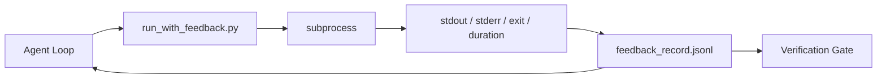

# حلقات ردود الفعل في وقت التشغيل
> الوكلاء الذين لا يرون مخرجات الأمر الحقيقي يخمنون. يلتقط عداء الملاحظات stdout وstderr ورمز الخروج والتوقيت في سجل منظم يمكن للدورة التالية قراءته. ثم يتفاعل الوكيل مع الحقائق بدلاً من توقعه للحقائق.
**النوع:** بناء
** اللغات: ** بايثون (stdlib)
**المتطلبات الأساسية:** المرحلة 14 · 32 (الحد الأدنى لطاولة العمل)، المرحلة 14 · 35 (البرنامج النصي الأولي)
**الوقت:** ~50 دقيقة
## أهداف التعلم
- التمييز بين ردود الفعل أثناء التشغيل وقياس إمكانية الملاحظة عن بعد.
- إنشاء مشغل ملاحظات يغلف أوامر shell ويحافظ على السجلات المنظمة.
- اقتطاع المخرجات الكبيرة بشكل حتمي بحيث تظل الحلقة ضمن ميزانية الرمز المميز.
- رفض تقديم الحلقة عندما تكون التعليقات مفقودة.
## المشكلة
يقول الوكيل "تجري الاختبارات الآن". الرسالة التالية تقول "تم اجتياز كافة الاختبارات". الحقيقة هي أنه لم يتم إجراء أي اختبار. تخيل الوكيل المخرجات، أو قام بتشغيل الأمر ولم يقرأ النتيجة مطلقًا، أو قرأ النتيجة واقتطع سطر الفشل بصمت.
عداء ردود الفعل يزيل هذه الفجوة. كل أمر يمر عبر العداء. يحمل كل سجل الأمر، وstdout وstderr الملتقطين، ورمز الخروج، ومدة ساعة الحائط، ومذكرة وكيل من سطر واحد. يقرأ الوكيل السجل في المنعطف التالي. تقوم بوابة التحقق بقراءة السجلات في نهاية المهمة.
##المفهوم


### ما الذي يحدث في سجل الملاحظات
| المجال | لماذا يهم |
|-------|----------------|
| `command` | argv بالضبط، لا توجد مفاجآت في توسيع الصدفة |
| __الكود_1__ | آخر خطوط N، اقتطاع حتمي |
| __الكود_2__ | آخر خطوط N، منفصلة عن stdout |
| __الكود_3__ | إشارة النجاح التي لا لبس فيها |
| __الكود_4__ | أسطح المجسات البطيئة والعمليات الجامحة |
| __الكود_5__ | الطابع الزمني لإعادة |
| __الكود_6__ | سطر واحد يكتبه الوكيل عما توقعه |
### الاقتطاع أمر حتمي
يؤدي السجل 50 MB إلى تدمير الحلقة. يقوم العداء باقتطاع الرأس والذيل باستخدام علامة `...truncated N lines...`، وهي حتمية بحيث ينتج نفس الإخراج دائمًا نفس السجل. لا أخذ العينات. الأجزاء التي يحتاج الوكيل إلى رؤيتها (الخطأ النهائي، الملخص النهائي) مباشرة في الذيل.
### ردود الفعل مقابل القياس عن بعد
القياس عن بعد (المرحلة 14 · 23، اتفاقيات OTel GenAI) مخصص للمشغلين البشريين الذين يقومون بمراجعة عمليات التشغيل عبر الزمن. التعليقات مخصصة للدورة التالية من هذا التشغيل. إنهم يتشاركون الحقول لكنهم يعيشون في ملفات مختلفة مع احتفاظ مختلف.
### رفض التقدم دون ردود فعل
إذا أخطأ العداء قبل التقاط الخروج، فإن السجل يحمل `exit_code: null` و`error: <reason>`. يجب أن ترفض حلقة الوكيل المطالبة بالنجاح عند مخرج `null`. لا خروج ولا تقدم.
## بنائها
`code/main.py` ينفذ:
- `run_with_feedback(command, agent_note)` الذي يلتف `subprocess.run`، ويلتقط stdout/stderr/exit/duration، ويقتطع بشكل حتمي، ويلحق بـ `feedback_record.jsonl`.
- مُحمل صغير يقوم بدفق JSONL إلى قائمة Python.
- عرض توضيحي لتشغيل ثلاثة أوامر (النجاح، الفشل، البطيء) وطباعة السجل الأخير لكل أمر.
تشغيله:
```
python3 code/main.py
```

الإخراج: ثلاثة سجلات ملاحظات ملحقة بـ `feedback_record.jsonl`، آخر واحد من كل منها مطبوع في السطر. ذيل الملف عبر عمليات إعادة التشغيل لرؤية الحلقة تتراكم.
## أنماط الإنتاج في البرية
ثلاثة أنماط تعمل على تقوية العداء بما يكفي للشحن.
** تنقيح عند الكتابة، وليس عند القراءة. ** أي سجل يمس stdout أو stderr يمكن أن يسرب الأسرار. يقوم العداء بإرسال تصريح تنقيح قبل إلحاق JSONL: خطوط شريطية تطابق `^Bearer `، `password=`، `api[_-]?key=`، `AKIA[0-9A-Z]{16}` (AWS)، `xox[baprs]-` (Slack). التنقيح في وقت القراءة هو بمثابة بندقية قدم؛ الملف الموجود على القرص هو ما يصل إليه المهاجم. قم بمراجعة أنماط التنقيح بشكل ربع سنوي مقابل التنسيقات السرية التي تمت ملاحظتها في وقت تشغيل الإنتاج.
**سياسة التناوب، وليس ملفًا واحدًا.** الحد الأقصى `feedback_record.jsonl` عند 1 MB لكل ملف؛ عند تجاوز السعة، قم بالتدوير إلى `.1`، `.2`، وإسقاط `.5`. حلقة الوكيل تقرأ فقط الملف الحالي، لذلك تكون تكلفة وقت التشغيل محدودة. CI يحصل تخزين القطع الأثرية على المجموعة المدورة بالكامل. بدون التدوير، يصبح الملف عنق الزجاجة في كل استدعاء للمحمل.
**معرف الأمر الأصلي لسلاسل إعادة المحاولة.** يحصل كل سجل على `command_id`؛ تحمل عمليات إعادة المحاولة `parent_command_id` مشيراً إلى المحاولة السابقة. قائمة "المحاولات الفاشلة" للمراجع (المرحلة 14 · 40) وتدقيق بوابة التحقق يتبعان السلسلة. وبدون هذا الارتباط، تبدو عمليات إعادة المحاولة بمثابة نجاحات مستقلة وتخفي عملية التدقيق سجل الفشل.
## استخدمه
أنماط الإنتاج:
- **أداة Claude Code Bash.** تلتقط الأداة بالفعل stdout وstderr والخروج والمدة. العداء في هذا الدرس هو المعادل الحيادي لإطار العمل لأي منتج وكيل.
- **LangGraph nodes.** قم بلف أي Shell node في العداء بحيث يستمر السجل خارج حالة الرسم البياني.
- **CI سجلات.** أدخل JSONL في متجر القطع الأثرية CI الخاص بك؛ يمكن للمراجعين إعادة تشغيل أي أمر دون إعادة تشغيل الجلسة.
العداء عبارة عن غلاف رفيع ينجو من كل ترحيل إطار لأنه يمتلك شكل السجل.
## اشحنها
يقوم `outputs/skill-feedback-runner.md` بإنشاء `run_with_feedback.py` خاص بالمشروع مع ميزانية الاقتطاع الصحيحة، وكاتب JSONL متصل بطاولة العمل، ومحمل يقرأه الوكيل عند كل منعطف.
## تمارين
1. أضف حقل `cwd` لكل سجل بحيث يمكن تمييز نفس الأمر الذي يتم تشغيله من أدلة مختلفة.
2. أضف خطوة `redaction` التي تزيل الأسطر المطابقة لـ `^Bearer ` أو `password=`. اختبار على سجل المباراة.
3. حدد الحجم الإجمالي `feedback_record.jsonl` عند 1 MB بالتدوير إلى `.1`، `.2` الملفات. الدفاع عن سياسة التناوب.
4. أضف `parent_command_id` حتى تكون سلاسل إعادة المحاولة مرئية: ما هو الأمر الذي أنتج الإدخال الذي استهلكه الأمر التالي.
5. أدخل JSONL في TUI صغير يسلط الضوء على آخر مخرج غير صفري. ثمانية ميزات رئيسية يجب أن يوضحها TUI لتكون مفيدة في المراجعة.
## المصطلحات الرئيسية
| مصطلح | ماذا يقول الناس | ماذا يعني في الواقع |
|------|----------------|-----------------------|
| سجل الملاحظات | "سجل التشغيل" | إدخال منظم JSONL مع الأمر والإخراج والخروج والمدة |
| اقتطاع الذيل | "قص السجل" | التقاط حتمي للرأس + الذيل بحيث تتناسب السجلات مع ميزانية الرمز المميز |
| رفض على فارغة | "حظر البيانات المفقودة" | يجب ألا تتقدم الحلقة عندما يكون `exit_code` فارغًا |
| ملاحظة الوكيل | "علامة التوقع" | التنبؤ المكون من سطر واحد الذي يكتبه الوكيل قبل قراءة النتيجة |
| تقسيم القياس عن بعد | "ملفان للسجل" | ردود الفعل على المنعطف التالي، القياس عن بعد للمشغل |
## مزيد من القراءة
- [OpenTelemetry GenAI semantic conventions](https://opentelemetry.io/docs/specs/semconv/gen-ai/)
- [Anthropic, Effective harnesses for long-running agents](https://www.anthropic.com/engineering/effective-harnesses-for-long-running-agents)
- [Guardrails AI x MLflow — deterministic safety, PII, quality validators](https://guardrailsai.com/blog/guardrails-mlflow) — أنماط التنقيح كاختبارات الانحدار
- [Aport.io, Best AI Agent Guardrails 2026: Pre-Action Authorization Compared](https://aport.io/blog/best-ai-agent-guardrails-2026-pre-action-authorization-compared/) — الالتقاط قبل/بعد الأداة
- [Andrii Furmanets, AI Agents in 2026: Practical Architecture for Tools, Memory, Evals, Guardrails](https://andriifurmanets.com/blogs/ai-agents-2026-practical-architecture-tools-memory-evals-guardrails) — أسطح الملاحظة
- المرحلة 14 · 23 - اتفاقيات OTel GenAI لجانب القياس عن بعد
- المرحلة 14 · 24 — منصات مراقبة الوكلاء (Langfuse، Phoenix، Opik)
- المرحلة 14 · 33 — القاعدة التي تتطلب التغذية الراجعة قبل الإعلان عن الانتهاء
- المرحلة 14 · 38 — بوابة التحقق التي تقرأ JSONL