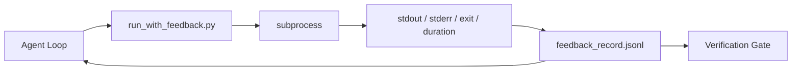

# Runtime Feedback Loops

> الوكلاء الذين لا يرون مخرجات الأمر الحقيقي يخمنون. يلتقط عداء الملاحظات stdout وstderr ورمز الخروج والتوقيت في سجل منظم يمكن للدورة التالية قراءته. ثم يتفاعل الوكيل مع الحقائق بدلاً من توقعه للحقائق.

**النوع:** بناء
** اللغات: ** بايثون (stdlib)
**المتطلبات الأساسية:** المرحلة 14 · 32 (الحد الأدنى لطاولة العمل)، المرحلة 14 · 35 (البرنامج النصي الأولي)
**الوقت:** ~50 دقيقة

## Learning Objectives

- التمييز بين ردود الفعل أثناء التشغيل وقياس إمكانية الملاحظة عن بعد.
- إنشاء مشغل ملاحظات يغلف أوامر shell ويحافظ على السجلات المنظمة.
- اقتطاع المخرجات الكبيرة بشكل حتمي بحيث تظل الحلقة ضمن ميزانية الرمز المميز.
- رفض تقديم الحلقة عندما تكون التعليقات مفقودة.

## The Problem

يقول الوكيل "تجري الاختبارات الآن". الرسالة التالية تقول "تم اجتياز كافة الاختبارات". الحقيقة هي أنه لم يتم إجراء أي اختبار. تخيل الوكيل المخرجات، أو قام بتشغيل الأمر ولم يقرأ النتيجة مطلقًا، أو قرأ النتيجة واقتطع سطر الفشل بصمت.

عداء ردود الفعل يزيل هذه الفجوة. كل أمر يمر عبر العداء. يحمل كل سجل الأمر، وstdout وstderr الملتقطين، ورمز الخروج، ومدة ساعة الحائط، ومذكرة وكيل من سطر واحد. يقرأ الوكيل السجل في المنعطف التالي. تقوم بوابة التحقق بقراءة السجلات في نهاية المهمة.

## The Concept



### What goes in a feedback record

| المجال | لماذا يهم |
|-------|----------------|
| `command` | argv بالضبط، لا توجد مفاجآت في توسيع الصدفة |
| `stdout_tail` | آخر خطوط N، اقتطاع حتمي |
| `stderr_tail` | آخر خطوط N، منفصلة عن stdout |
| `exit_code` | إشارة النجاح التي لا لبس فيها |
| `duration_ms` | أسطح المجسات البطيئة والعمليات الجامحة |
| `started_at` | الطابع الزمني لإعادة |
| `agent_note` | سطر واحد يكتبه الوكيل عما توقعه |

### Truncation is deterministic

سجل 50 MB يدمر الحلقة. يقوم العداء باقتطاع الرأس والذيل باستخدام علامة `...truncated N lines...`، وهي حتمية بحيث ينتج نفس الإخراج دائمًا نفس السجل. لا أخذ العينات. الأجزاء التي يحتاج الوكيل إلى رؤيتها (الخطأ النهائي، الملخص النهائي) مباشرة في الذيل.

### Feedback versus telemetry

القياس عن بعد (المرحلة 14 · 23، اتفاقيات OTel GenAI) مخصص للمشغلين البشريين الذين يقومون بمراجعة عمليات التشغيل عبر الزمن. التعليقات مخصصة للدورة التالية من هذا التشغيل. إنهم يتشاركون الحقول لكنهم يعيشون في ملفات مختلفة مع احتفاظ مختلف.

### Refuse to advance without feedback

إذا أخطأ العداء قبل التقاط الخروج، فإن السجل يحمل `exit_code: null` و`error: <reason>`. يجب أن ترفض حلقة الوكيل المطالبة بالنجاح عند الخروج `null`. لا خروج ولا تقدم.

## Build It

`code/main.py` ينفذ:

- `run_with_feedback(command, agent_note)` يلتف `subprocess.run`، يلتقط stdout/stderr/exit/duration، ويقتطع بشكل حتمي، ويلحق بـ `feedback_record.jsonl`.
- مُحمل صغير يقوم بدفق JSONL إلى قائمة Python.
- عرض توضيحي لتشغيل ثلاثة أوامر (النجاح، الفشل، البطيء) وطباعة السجل الأخير لكل أمر.

تشغيله:

```
python3 code/main.py
```

الإخراج: ثلاثة سجلات ملاحظات ملحقة بـ `feedback_record.jsonl`، آخر واحد من كل منها مطبوع في السطر. ذيل الملف عبر عمليات إعادة التشغيل لرؤية الحلقة تتراكم.

## Production patterns in the wild

ثلاثة أنماط تعمل على تقوية العداء بما يكفي للشحن.

** تنقيح عند الكتابة، وليس عند القراءة. ** أي سجل يمس stdout أو stderr يمكن أن يسرب الأسرار. يقوم العداء بشحن تصريح تنقيح قبل إلحاق JSONL: خطوط الشريط المطابقة `^Bearer `، `password=`، `api[_-]?key=`، `AKIA[0-9A-Z]{16}` (AWS)، `xox[baprs]-` (Slack). التنقيح في وقت القراءة هو بمثابة بندقية قدم؛ الملف الموجود على القرص هو ما يصل إليه المهاجم. قم بمراجعة أنماط التنقيح بشكل ربع سنوي مقابل التنسيقات السرية التي تمت ملاحظتها في وقت تشغيل الإنتاج.

**سياسة التدوير، وليس ملفًا واحدًا.** الحد الأقصى `feedback_record.jsonl` بمعدل 1 MB لكل ملف؛ عند الفائض، قم بالتدوير إلى `.1`، `.2`، إسقاط `.5`. حلقة الوكيل تقرأ فقط الملف الحالي، لذلك تكون تكلفة وقت التشغيل محدودة. CI تخزين القطع الأثرية يحصل على المجموعة الكاملة المدورة. بدون التدوير، يصبح الملف عنق الزجاجة في كل استدعاء للمحمل.

**معرف الأمر الأصلي لسلاسل إعادة المحاولة.** يحصل كل سجل على `command_id`؛ تحمل عمليات إعادة المحاولة الرمز `parent_command_id` الذي يشير إلى المحاولة السابقة. قائمة "المحاولات الفاشلة" للمراجع (المرحلة 14 · 40) وتدقيق بوابة التحقق يتبعان السلسلة. وبدون هذا الارتباط، تبدو عمليات إعادة المحاولة بمثابة نجاحات مستقلة وتخفي عملية التدقيق سجل الفشل.

## Use It

أنماط الإنتاج:

- **أداة Claude Code Bash.** تلتقط الأداة بالفعل stdout وstderr والخروج والمدة. العداء في هذا الدرس هو المعادل الحيادي لإطار العمل لأي منتج وكيل.
- **LangGraph nodes.** لف أي غلاف node في العداء بحيث يستمر السجل خارج حالة الرسم البياني.
- **CI سجلات.** قم بتوصيل JSONL إلى متجر التحف CI الخاص بك؛ يمكن للمراجعين إعادة تشغيل أي أمر دون إعادة تشغيل الجلسة.

العداء عبارة عن غلاف رفيع ينجو من كل ترحيل إطار لأنه يمتلك شكل السجل.

## Ship It

`outputs/skill-feedback-runner.md` ينشئ `run_with_feedback.py` خاص بالمشروع مع ميزانية الاقتطاع الصحيحة، وكاتب JSONL متصل بمنضدة العمل، ومحمل يقرأه الوكيل عند كل منعطف.

## Exercises

1. أضف حقل `cwd` لكل سجل بحيث يمكن تمييز نفس الأمر الذي يتم تشغيله من أدلة مختلفة.
2. أضف خطوة `redaction` تزيل الخطوط المطابقة `^Bearer ` أو `password=`. اختبار على سجل المباراة.
3. الحد الأقصى للحجم الإجمالي `feedback_record.jsonl` عند 1 MB بالتدوير إلى الملفات `.1`، `.2`. الدفاع عن سياسة التناوب.
4. أضف `parent_command_id` حتى تكون سلاسل إعادة المحاولة مرئية: أي أمر أنتج المدخلات التي استهلكها الأمر التالي.
5. قم بتوصيل JSONL إلى TUI صغير يسلط الضوء على آخر مخرج غير الصفر. ثمانية ميزات رئيسية يجب أن تظهرها TUI لتكون مفيدة في المراجعة.

## Key Terms

| مصطلح | ماذا يقول الناس | ماذا يعني في الواقع |
|------|----------------|-----------------------|
| سجل الملاحظات | "سجل التشغيل" | دخول منظم JSONL مع الأمر والإخراج والخروج والمدة |
| اقتطاع الذيل | "قص السجل" | التقاط حتمي للرأس + الذيل بحيث تتناسب السجلات مع ميزانية الرمز المميز |
| رفض على فارغة | "حظر البيانات المفقودة" | يجب ألا تتقدم الحلقة عندما يكون `exit_code` فارغًا |
| ملاحظة الوكيل | "علامة التوقع" | التنبؤ المكون من سطر واحد الذي يكتبه الوكيل قبل قراءة النتيجة |
| تقسيم القياس عن بعد | "ملفان للسجل" | ردود الفعل على المنعطف التالي، القياس عن بعد للمشغل |

## Further Reading

- [OpenTelemetry GenAI semantic conventions](https://opentelemetry.io/docs/specs/semconv/gen-ai/)
- [Anthropic, Effective harnesses for long-running agents](https://www.anthropic.com/engineering/effective-harnesses-for-long-running-agents)
- [Guardrails AI x MLflow — deterministic safety, PII, quality validators](https://guardrailsai.com/blog/guardrails-mlflow) — redaction patterns as regression tests
- [Aport.io, Best AI Agent Guardrails 2026: Pre-Action Authorization Compared](https://aport.io/blog/best-ai-agent-guardrails-2026-pre-action-authorization-compared/) — pre/post-tool capture
- [Andrii Furmanets, AI Agents in 2026: Practical Architecture for Tools, Memory, Evals, Guardrails](https://andriifurmanets.com/blogs/ai-agents-2026-practical-architecture-tools-memory-evals-guardrails) — observability surfaces
- Phase 14 · 23 — OTel GenAI conventions for the telemetry side
- Phase 14 · 24 — agent observability platforms (Langfuse, Phoenix, Opik)
- المرحلة 14 · 33 — القاعدة التي تتطلب التغذية الراجعة قبل الإعلان عن الانتهاء
- المرحلة 14 · 38 — بوابة التحقق التي تقرأ JSONL
