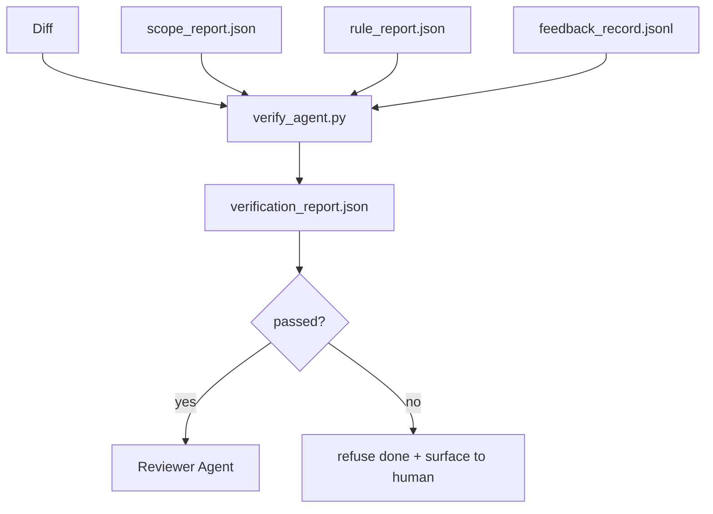

#بوابات التحقق
> لا يحق للوكيل وضع علامة على عمله على أنه قد تم. تقرأ بوابة التحقق عقد النطاق، وسجل التعليقات، وتقرير القاعدة، والفرق، وتجيب على سؤال واحد: هل هذه المهمة مكتملة بالفعل؟ إذا قالت البوابة لا، فلن تتم المهمة، بغض النظر عما تقوله الدردشة.
**النوع:** بناء
** اللغات: ** بايثون (stdlib)
**المتطلبات الأساسية:** المرحلة 14 · 33 (القواعد)، المرحلة 14 · 36 (النطاق)، المرحلة 14 · 37 (الملاحظات)
**الوقت:** ~55 دقيقة
## أهداف التعلم
- تحديد بوابة التحقق كدالة حتمية على القطع الأثرية لمنضدة العمل.
- الجمع بين تقرير القاعدة وتقرير النطاق وسجلات التعليقات والفرق في حكم واحد.
- قم بإرسال `verification_report.json` إلى وكيل المراجع ويمكن لكل من CI قراءته.
- رفض التقدم بالمهمة على أي فشل في خطورة الكتلة دون استثناء.
## المشكلة
يعلن الوكلاء النجاح بسهولة بالغة. تهيمن ثلاثة أشكال للفشل:
- "تبدو جيدة." قرأ النموذج الاختلافات الخاصة به وقرر أنه صحيح.
- "نجحت الاختبارات." قال بثقة. لا يوجد سجل للاختبار قيد التشغيل بالفعل.
- "تم القبول." يتم تفسير معايير القبول بشكل فضفاض بما يكفي لتعني "أي شيء يشبه القيام به".
إصلاح طاولة العمل عبارة عن بوابة تحقق واحدة تقرأ العناصر التي أنتجها الوكيل بالفعل وmakes المكالمة. البوابة حتمية. البوابة في التحكم في الإصدار. تم توصيل البوابة بـ CI. ولا يجوز للوكيل رشوته.
##المفهوم


### ما الذي تتحقق منه البوابة
| تحقق | مصدر قطعة أثرية | شدة |
|-------|-----------------|----------|
| تم تشغيل كافة أوامر القبول | `feedback_record.jsonl` | كتلة |
| جميع أوامر القبول خرجت صفر | __الكود_1__ | كتلة |
| التحقق من النطاق لا يحتوي على عمليات كتابة محظورة | __الكود_2__ | كتلة |
| لا يحتوي فحص النطاق على عمليات كتابة خارج النطاق | __الكود_3__ | حظر أو تحذير |
| تمر جميع قواعد خطورة الكتلة | __الكود_4__ | كتلة |
| لا توجد رموز خروج `null` في التعليقات | __الكود_6__ | كتلة |
| الملفات التي تم لمسها تطابق `scope.allowed_files` | كلاهما | تحذير |
نتيجة `warn` توضح الحكم؛ نتيجة `block` تمنع `passed: true`.
### حتمية وليست احتمالية
يجب أن تصدر البوابة نفس الحكم لنفس القطعة الأثرية في كل مرة. لا يوجد حكام LLM. LLM ينتمي الحكام إلى جانب المراجع (المرحلة 14 · 39) حيث يكون الهدف هو التقييم النوعي، وليس الحالة.
### تقرير واحد، مسار واحد
تُصدر البوابة رمزًا واحدًا `verification_report.json` لكل مهمة نهائية، مكتوبًا تحت `outputs/verification/<task_id>.json`. CI يستخدم نفس المسار. بوابات متعددة ومسارات مختلفة تتفرع من مصدر الحقيقة.
### رفض بلا استثناء
لا يمكن للوكيل تجاوز نتائج خطورة الكتلة. لا يمكن تجاوزها إلا بواسطة الإنسان، باستخدام `override_reason` ومعرف المستخدم `overridden_by` المسجل. التجاوز هو تغيير موقع، وليس قرار الوكيل.
## بنائها
`code/main.py` ينفذ:
- محمل لكل قطعة أثرية مدخلة، كلها متوقفة محليًا بحيث يكون الدرس مستقلاً بذاته.
- وظيفة `verify(task_id, artifacts) -> VerdictReport` خالصة.
- طابعة تعرض نتائج الفحص والرسوب النهائي.
- عرض توضيحي يتضمن ثلاثة سيناريوهات للمهام: التمريرة النظيفة، وزحف النطاق، والقبول المفقود.
تشغيله:
```
python3 code/main.py
```

المخرجات: ثلاثة تقارير حكم، كل منها محفوظ بجوار النص.
## أنماط الإنتاج في البرية
أربعة أنماط ترفع البوابة من "وظيفة الوبر الأخرى" إلى "الحافة الحاسمة".
**الدفاع المتعمق، وليس بوابة واحدة.** خطاف الالتزام المسبق ← CI التحقق من الحالة ← خطاف مصادقة الأداة المسبقة ← بوابة الدمج المسبق. تعتبر كل طبقة حتمية، لذا يتم اكتشاف الفشل في إحدى الطبقات بواسطة الطبقة التالية. إن قواعد اللعب الخاصة بـ microservices.io لشهر مارس 2026 واضحة: خطاف الالتزام المسبق غير قابل للتجاوز لأنه، على عكس المهارة من جانب النموذج، فإنه لا يعتمد على الوكيل الذي يتبع التعليمات. توجد بوابة التحقق عند طبقة CI / طبقة ما قبل الدمج.
** الدفاع عن طريق الفحص الحتمي، القاضي النموذجي فقط من أجل الفروق الدقيقة. ** الاقتران المعياري الهجين لعام 2026 من Anthropic: مكافآت يمكن التحقق منها (اختبارات الوحدة، وفحوصات المخطط، وأكواد الخروج) تجيب على "هل حل الكود المشكلة؟" — LLM تجيب عناوين التقييم "هل الكود قابل للقراءة، وآمن، ومناسب؟" البوابة تدير الدرجة الأولى. يقوم المراجع (المرحلة 14 · 39) بتشغيل المرحلة الثانية. خلطهم ينهار الإشارة.
**سجل التجاوز المُوقع، وليس سلاسل رسائل Slack.** يُصدر كل تجاوز صفًا في `outputs/verification/overrides.jsonl` مع: الطابع الزمني، ورمز البحث، والسبب، وتوقيع المستخدم، والالتزام الحالي HEAD. يرفض وقت التشغيل أي تجاوز يفتقر إلى التوقيع؛ يتم تتبع مسار التدقيق git. هذا هو الخط الفاصل بين سياسة التجاوز ومسرح التجاوز.
**أرضية التغطية كفحص من الدرجة الأولى.** يغذي `coverage_report.json` فحص `coverage_floor` (الافتراضي 80%). تفشل البوابة إذا انخفضت التغطية المقاسة أسفل الأرضية أو أسفل أرضية الدمج السابقة بأكثر من نقطة مئوية واحدة. وبدون هذا الفحص، يقوم الوكلاء بهدوء بحذف الاختبارات التي تفشل وتظل تقارير التحقق باللون الأخضر.
يعمل الوضع **`--strict` على ترقية التحذيرات إلى عمليات الحظر.** بالنسبة لفروع الإصدار، أو PRs لحظر السفن، أو فرز ما بعد الحادث، فإن كل تحذير `--strict` makes يفشل بشدة. يتم اختيار العلم حسب الفرع؛ وليس الوضع الافتراضي العالمي، لأن التقييد الصارم في كل شيء يؤدي إلى تآكل التدفق اليومي.
## استخدمه
أنماط الإنتاج:
- **CI الخطوة.** تعمل مهمة `verify_agent` على تشغيل البوابة ضد القطع الأثرية النهائية للوكيل. ترفض حماية الدمج بدون `passed: true`.
- **خطاف ما قبل التسليم.** يستدعي وقت تشغيل الوكيل البوابة قبل إنشاء مستند التسليم. لا يوجد حكم أخضر، ولا تسليم.
- **الفرز اليدوي.** يقرأ المشغلون التقرير عندما يدعي أحد العملاء النجاح ويشك الإنسان في ذلك.
البوابة هي الحافة الحاسمة في تدفق طاولة العمل. كل سطح آخر هو المنبع منه.
## اشحنها
`outputs/skill-verification-gate.md` يقوم بتوصيل البوابة إلى مشروع محدد: ما هي أوامر القبول التي تغذيها، وما هي القواعد التي تمثل خطورة الكتلة، وما هي عمليات الكتابة خارج النطاق التي يتم التسامح معها، وكيف يتم تخزين سجل تدقيق التجاوز.
## تمارين
1. أضف علامة اختيار `coverage_floor`: يجب أن ينتج أمر الاختبار تقرير تغطية بنسبة 80% على الأقل. قرر أي قطعة أثرية تحمل الكلمة.
2. دعم وضع `--strict` الذي يقوم بالترويج لكل `warn` إلى `block`. قم بتوثيق الحالات التي يكون فيها الوضع الصارم هو الوضع الافتراضي الصحيح.
3. اجعل البوابة تنتج ملخص تخفيض السعر بالإضافة إلى JSON. الدفاع عن الحقول التي تنتمي إلى الملخص.
4. أضف علامة اختيار `time_since_last_human_touch`: أي ملف يتم تحريره خلال 60 ثانية من ضغطة المفتاح البشري يتم إعفاءه من العلامات خارج النطاق.
5. قم بتشغيل البوابة على وكيل حقيقي يختلف عن منتجك. كم عدد النتائج الحقيقية وكم عدد الضوضاء؟ أين تحتاج البوابة إلى النمو؟
## المصطلحات الرئيسية
| مصطلح | ماذا يقول الناس | ماذا يعني في الواقع |
|------|----------------|-----------------------|
| بوابة التحقق | "الشيك الذي يوقف الأشياء" | الدالة الحتمية على منتجات طاولة العمل التي تنتج حكم النجاح/الفشل |
| خطورة الكتلة | "فشل ذريع" | نتيجة تمنع `passed: true` وتتطلب تجاوزًا موقعًا |
| تجاوز السجل | "لماذا نسمح لها بالمرور" | الإدخالات الموقعة مع السبب وهوية المستخدم، ومراجعتها من خلال المراجعة |
| أمر القبول | "البرهان" | أمر Shell يكون خروجه الصفري هو ما يعنيه `done` |
| مسار تقرير واحد | "مصدر الحقيقة" | `outputs/verification/<task_id>.json`، يستهلكه CI والبشر على حدٍ سواء |
## مزيد من القراءة
- [Anthropic, Harness design for long-running application development](https://www.anthropic.com/engineering/harness-design-long-running-apps)
- [OpenAI Agents SDK guardrails](https://platform.openai.com/docs/guides/agents-sdk/guardrails)
- [microservices.io, GenAI dev platform: guardrails](https://microservices.io/post/architecture/2026/03/09/genai-development-platform-part-1-development-guardrails.html) — الدفاع المتعمق بين الالتزام المسبق وCI
- [ICMD, The 2026 Playbook for Agentic AI Ops](https://icmd.app/article/the-2026-playbook-for-agentic-ai-ops-guardrails-costs-and-reliability-at-scale-1776661990431) — سلم بوابة الموافقة (مسودة ← موافقة ← تلقائي تحت العتبات)
- [Type-Checked Compliance: Deterministic Guardrails (arXiv 2604.01483)](https://arxiv.org/pdf/2604.01483) — المستوى 4 هو الحد الأعلى للبوابة الحتمية
- [logi-cmd/agent-guardrails — merge gate spec](https://github.com/logi-cmd/agent-guardrails) — النطاق + بوابات اختبار الطفرات
- [Guardrails AI x MLflow](https://guardrailsai.com/blog/guardrails-mlflow) — أدوات التحقق الحتمية باعتبارها مسجلي CI
- [Akira, Real-Time Guardrails for Agentic Systems](https://www.akira.ai/blog/real-time-guardrails-agentic-systems) — بوابات ما قبل/بعد الأداة
- المرحلة 14 · 27 — دفاعات الحقن السريع (الزوج الخصم للبوابة)
- المرحلة 14 · 36 — عقد النطاق الذي تفرضه هذه البوابة
- المرحلة 14 · 37 — يسجل سجل الملاحظات هذه البوابة
- المرحلة 14 · 39 — وكيل المراجع الذي تقوم البوابة بتسليم يده إليه