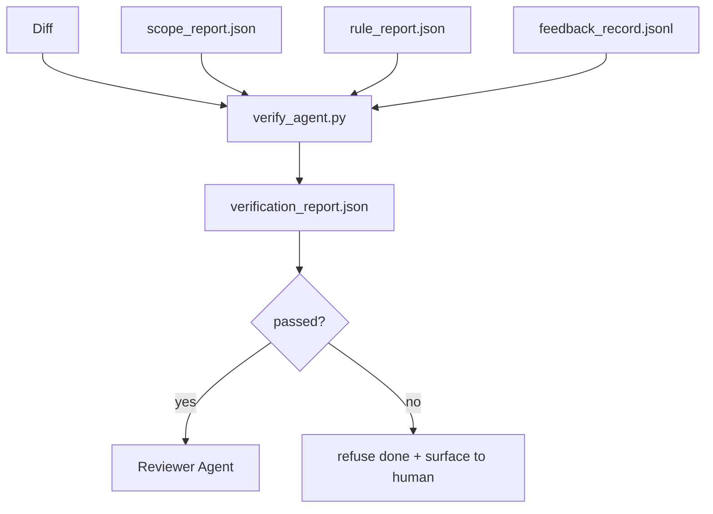

# Verification Gates

> لا يحق للوكيل وضع علامة على عمله على أنه قد تم. تقرأ بوابة التحقق عقد النطاق، وسجل التعليقات، وتقرير القاعدة، والفرق، وتجيب على سؤال واحد: هل هذه المهمة مكتملة بالفعل؟ إذا قالت البوابة لا، فلن تتم المهمة، بغض النظر عما تقوله الدردشة.

**النوع:** بناء
** اللغات: ** بايثون (stdlib)
**المتطلبات الأساسية:** المرحلة 14 · 33 (القواعد)، المرحلة 14 · 36 (النطاق)، المرحلة 14 · 37 (الملاحظات)
**الوقت:** ~55 دقيقة

## Learning Objectives

- تحديد بوابة التحقق كدالة حتمية على القطع الأثرية لمنضدة العمل.
- الجمع بين تقرير القاعدة وتقرير النطاق وسجلات التعليقات والفرق في حكم واحد.
- أرسل `verification_report.json` وكيل المراجع ويمكن لـ CI القراءة.
- رفض التقدم بالمهمة على أي فشل في خطورة الكتلة دون استثناء.

## The Problem

يعلن الوكلاء النجاح بسهولة بالغة. تهيمن ثلاثة أشكال للفشل:

- "تبدو جيدة." قرأ النموذج الاختلافات الخاصة به وقرر أنه صحيح.
- "نجحت الاختبارات." قال بثقة. لا يوجد سجل للاختبار قيد التشغيل بالفعل.
- "تم القبول." يتم تفسير معايير القبول بشكل فضفاض بما يكفي لتعني "أي شيء يشبه القيام به".

إصلاح طاولة العمل عبارة عن بوابة تحقق واحدة تقرأ القطع الأثرية التي أنتجها الوكيل بالفعل وmakes المكالمة. البوابة حتمية. البوابة في التحكم في الإصدار. البوابة متصلة بـ CI. ولا يجوز للوكيل رشوته.

## The Concept



### What the gate checks

| تحقق | مصدر قطعة أثرية | شدة |
|-------|-----------------|----------|
| تم تشغيل كافة أوامر القبول | `feedback_record.jsonl` | كتلة |
| جميع أوامر القبول خرجت صفر | `feedback_record.jsonl` | كتلة |
| التحقق من النطاق لا يحتوي على عمليات كتابة محظورة | `scope_report.json` | كتلة |
| لا يحتوي فحص النطاق على عمليات كتابة خارج النطاق | `scope_report.json` | حظر أو تحذير |
| تمر جميع قواعد خطورة الكتلة | `rule_report.json` | كتلة |
| لا يوجد `null` رموز الخروج في التعليقات | `feedback_record.jsonl` | كتلة |
| الملفات التي تم لمسها تطابق `scope.allowed_files` | كلاهما | تحذير |

النتيجة `warn` تشرح الحكم؛ النتيجة `block` تمنع `passed: true`.

### Deterministic, not probabilistic

يجب أن تصدر البوابة نفس الحكم لنفس القطعة الأثرية في كل مرة. لا LLM القضاة. LLM ينتمي الحكام إلى جانب المراجع (المرحلة 14 · 39) حيث يكون الهدف هو التقييم النوعي وليس الحالة.

### One report, one path

تُصدر البوابة علامة `verification_report.json` واحدة لكل إغلاق مهمة، مكتوبة تحت `outputs/verification/<task_id>.json`. CI يستهلك نفس المسار. بوابات متعددة ومسارات مختلفة تتفرع من مصدر الحقيقة.

### Refuse without exception

لا يمكن للوكيل تجاوز نتائج خطورة الكتلة. ولا يمكن تجاوزها إلا من قبل الإنسان، باستخدام معرف المستخدم المسجل `override_reason` و `overridden_by`. التجاوز هو تغيير موقع، وليس قرار الوكيل.

## Build It

`code/main.py` ينفذ:

- محمل لكل قطعة أثرية مدخلة، كلها متوقفة محليًا بحيث يكون الدرس مستقلاً بذاته.
- وظيفة `verify(task_id, artifacts) -> VerdictReport` خالصة.
- طابعة تعرض نتائج الفحص والرسوب النهائي.
- عرض توضيحي يتضمن ثلاثة سيناريوهات للمهام: التمريرة النظيفة، وزحف النطاق، والقبول المفقود.

تشغيله:

```
python3 code/main.py
```

المخرجات: ثلاثة تقارير حكم، كل منها محفوظ بجوار النص.

## Production patterns in the wild

أربعة أنماط ترفع البوابة من "وظيفة الوبر الأخرى" إلى "الحافة الحاسمة".

**الدفاع المتعمق، وليس بوابة واحدة.** خطاف الالتزام المسبق → CI التحقق من الحالة → خطاف مصادقة الأداة المسبقة → بوابة الدمج المسبق. تعتبر كل طبقة حتمية، لذا يتم اكتشاف الفشل في إحدى الطبقات بواسطة الطبقة التالية. إن قواعد اللعب الخاصة بـ microservices.io لشهر مارس 2026 واضحة: خطاف الالتزام المسبق غير قابل للتجاوز لأنه، على عكس المهارة من جانب النموذج، فإنه لا يعتمد على الوكيل الذي يتبع التعليمات. تقع بوابة التحقق عند طبقة CI / ما قبل الدمج.

** الدفاع عن طريق الفحص الحتمي، القاضي النموذجي فقط من أجل الفروق الدقيقة. ** الاقتران المعياري الهجين لعام 2026 من Anthropic: مكافآت يمكن التحقق منها (اختبارات الوحدة، وفحوصات المخطط، وأكواد الخروج) تجيب على "هل حل الكود المشكلة؟" — LLM إجابة نماذج التقييم "هل الكود قابل للقراءة، وآمن، ومصمم على الطراز؟" البوابة تدير الدرجة الأولى. يقوم المراجع (المرحلة 14 · 39) بتشغيل المرحلة الثانية. خلطهم ينهار الإشارة.

**سجل تجاوز مُوقع، وليس سلاسل رسائل Slack.** يُصدر كل تجاوز صفًا في `outputs/verification/overrides.jsonl` مع: الطابع الزمني، ورمز البحث، والسبب، وتوقيع المستخدم، والالتزام HEAD الحالي. يرفض وقت التشغيل أي تجاوز يفتقر إلى التوقيع؛ يتم تتبع مسار التدقيق git. هذا هو الخط الفاصل بين سياسة التجاوز ومسرح التجاوز.

**أرضية التغطية كفحص من الدرجة الأولى.** يغذي `coverage_report.json` فحص `coverage_floor` (افتراضي 80%). تفشل البوابة إذا انخفضت التغطية المقاسة أسفل الأرضية أو أسفل أرضية الدمج السابقة بأكثر من نقطة مئوية واحدة. وبدون هذا الفحص، يقوم الوكلاء بهدوء بحذف الاختبارات التي تفشل وتظل تقارير التحقق باللون الأخضر.

يعمل الوضع **`--strict` على ترقية التحذيرات إلى عمليات الحظر.** بالنسبة لفروع الإصدار، أو PRs لحظر السفن، أو فرز ما بعد الحادث، فإن كل تحذير `--strict` make يفشل بشدة. يتم اختيار العلم حسب الفرع؛ وليس الوضع الافتراضي العالمي، لأن التقييد الصارم في كل شيء يؤدي إلى تآكل التدفق اليومي.

## Use It

أنماط الإنتاج:

- **CI الخطوة.** المهمة `verify_agent` تدير البوابة ضد القطع الأثرية النهائية للوكيل. يرفض دمج الحماية بدون `passed: true`.
- **خطاف ما قبل التسليم.** يستدعي وقت تشغيل الوكيل البوابة قبل إنشاء مستند التسليم. لا يوجد حكم أخضر، ولا تسليم.
- **الفرز اليدوي.** يقرأ المشغلون التقرير عندما يدعي أحد العملاء النجاح ويشك الإنسان في ذلك.

البوابة هي الحافة الحاسمة في تدفق طاولة العمل. كل سطح آخر هو المنبع منه.

## Ship It

`outputs/skill-verification-gate.md` يقوم بتوصيل البوابة إلى مشروع محدد: ما هي أوامر القبول التي تغذيها، وما هي القواعد التي تمثل خطورة الكتلة، وما هي عمليات الكتابة خارج النطاق التي يتم التسامح معها، وكيف يتم تخزين سجل تدقيق التجاوز.

## Exercises

1. أضف علامة `coverage_floor`: يجب أن ينتج أمر الاختبار تقرير تغطية بنسبة 80% على الأقل. قرر أي قطعة أثرية تحمل الكلمة.
2. دعم الوضع `--strict` الذي يقوم بالترويج لكل `warn` إلى `block`. قم بتوثيق الحالات التي يكون فيها الوضع الصارم هو الوضع الافتراضي الصحيح.
3. اجعل البوابة تنتج ملخص تخفيض السعر بالإضافة إلى JSON. الدفاع عن الحقول التي تنتمي إلى الملخص.
4. أضف علامة `time_since_last_human_touch`: أي ملف يتم تحريره خلال 60 ثانية من ضغطة المفتاح البشري يتم إعفاءه من العلامات خارج النطاق.
5. قم بتشغيل البوابة على وكيل حقيقي يختلف عن منتجك. كم عدد النتائج الحقيقية وكم عدد الضوضاء؟ أين تحتاج البوابة إلى النمو؟

## Key Terms

| مصطلح | ماذا يقول الناس | ماذا يعني في الواقع |
|------|----------------|-----------------------|
| بوابة التحقق | "الشيك الذي يوقف الأشياء" | الدالة الحتمية على منتجات طاولة العمل التي تنتج حكم النجاح/الفشل |
| خطورة الكتلة | "فشل ذريع" | نتيجة تمنع `passed: true` وتتطلب تجاوزًا موقعًا |
| تجاوز السجل | "لماذا نسمح لها بالمرور" | الإدخالات الموقعة مع السبب وهوية المستخدم، ومراجعتها من خلال المراجعة |
| أمر القبول | "البرهان" | أمر Shell خروجه الصفري هو ما يعنيه `done` |
| مسار تقرير واحد | "مصدر الحقيقة" | `outputs/verification/<task_id>.json`، يستهلكها CI والبشر على حدٍ سواء |

## Further Reading

- [Anthropic, Harness design for long-running application development](https://www.anthropic.com/engineering/harness-design-long-running-apps)
- [OpenAI Agents SDK guardrails](https://platform.openai.com/docs/guides/agents-sdk/guardrails)
- [microservices.io, GenAI dev platform: guardrails](https://microservices.io/post/architecture/2026/03/09/genai-development-platform-part-1-development-guardrails.html) — defense in depth between pre-commit and CI
- [ICMD, The 2026 Playbook for Agentic AI Ops](https://icmd.app/article/the-2026-playbook-for-agentic-ai-ops-guardrails-costs-and-reliability-at-scale-1776661990431) — approval-gate ladder (draft → approval → auto under thresholds)
- [Type-Checked Compliance: Deterministic Guardrails (arXiv 2604.01483)](https://arxiv.org/pdf/2604.01483) — Lean 4 as the upper bound of deterministic gating
- [logi-cmd/agent-guardrails — merge gate spec](https://github.com/logi-cmd/agent-guardrails) — scope + mutation-testing gates
- [Guardrails AI x MLflow](https://guardrailsai.com/blog/guardrails-mlflow) — deterministic validators as CI scorers
- [Akira, Real-Time Guardrails for Agentic Systems](https://www.akira.ai/blog/real-time-guardrails-agentic-systems) — pre/post-tool gates
- Phase 14 · 27 — prompt injection defenses (the gate's adversarial pair)
- المرحلة 14 · 36 — عقد النطاق الذي تفرضه هذه البوابة
- المرحلة 14 · 37 — يسجل سجل الملاحظات هذه البوابة
- المرحلة 14 · 39 — وكيل المراجع الذي تقوم البوابة بتسليم يده إليه
