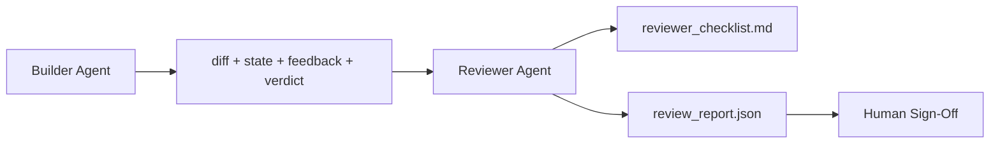

# وكيل المراجع: منشئ منفصل عن العلامة
> لا يستطيع الوكيل الذي كتب الكود تقديره. المراجع هو حلقة ثانية مع موجه نظام مختلف، وهدف مختلف، ووصول للقراءة فقط إلى كل ما أنتجه المنشئ. الفجوة بين المنشئ والمراجع هي المكان الذي تعيش فيه معظم الموثوقية.
**النوع:** بناء
** اللغات: ** بايثون (stdlib)
**المتطلبات:** المرحلة 14 · 38 (بوابة التحقق)
**الوقت:** ~55 دقيقة
## أهداف التعلم
- اذكر لماذا لا يستطيع نفس الوكيل مراجعة عمله بشكل موثوق.
- أنشئ حلقة وكيل مراجع تستهلك عناصر البناء وتصدر تقرير مراجعة منظم.
- قم بتأليف نموذج تقييم للمراجع يصنف أبعادًا معينة، وليس المشاعر.
- قم بتوصيل المراجع إلى طاولة العمل بحيث تبدأ خطوة المراجعة البشرية من قطعة أثرية حقيقية.
## المشكلة
تطلب من الوكيل إصلاح الخلل. يقوم بتحرير أربعة ملفات، وإجراء الاختبارات، وإعداد التقارير. تؤكد بوابة التحقق (المرحلة 14 · 38) مدى القبول وعقد النطاق. البوابة تقول `passed: true`. قمت بدمج. وبعد يومين تجد أن الإصلاح قد حل النصف الخاطئ من الخطأ.
القبول ضروري وليس كافيا. يطرح المراجع الأسئلة التي لا يمكن للقبول طرحها: هل أدى هذا إلى حل المشكلة الصحيحة؟ هل قامت بتوسيع نطاقها دون الإشارة إليها؟ هل وثقت افتراضات كان ينبغي التشكيك فيها؟ هل تركت طاولة العمل في حالة يمكن للجلسة التالية أن تستعيدها؟
##المفهوم


### عنوان المراجع
خمسة أبعاد، سجل كل منها 0 إلى 2.
| البعد | سؤال |
|-----------|----------|
| مشكلة تناسب | هل أدى التغيير إلى حل المهمة كما هو مذكور، وليس مهمة قريبة؟ |
| نطاق الانضباط | هل كانت التعديلات مقتصرة على العقد أم أن العقد تم تطويره عمدا؟ |
| افتراضات | هل كل الافتراضات الخفية مكتوبة في مكان ما قابلة للمراجعة؟ |
| جودة التحقق | فهل أمر القبول يثبت الهدف فعلا أم أنه أثبت نسخة أضعف؟ |
| جاهزية التسليم | هل يمكن للجلسة القادمة أن تتحسن بشكل نظيف من الحالة الحالية؟ |
المجموع من 10. يعتبر التشغيل أقل من 7 بمثابة فشل بسيط؛ التشغيل أقل من 5 يعد فشلًا ذريعًا.
### المراجع دور منفصل، وليس نموذجا منفصلا
يمكنك تشغيل المراجع بنفس نموذج المنشئ. الانضباط هو فصل الأدوار: موجه نظام مختلف، مدخلات مختلفة، لا يوجد وصول للكتابة إلى الفرق. التغيير في الموقف هو التغيير في الإشارة.
### لا يمكن للمراجع تعديل الفرق
يقرأ المراجع الفرق، والحالة، والتعليقات، والحكم. ويكتب تقريرا. لا تصحيح الفرق. إذا كان التقرير يقول "أصلح هذا"، فإن دور المنشئ التالي يقوم بالإصلاح؛ يعود المراجع إلى المراجعة. خلط الأدوار يهزم الفجوة.
### عنوان المراجع مقابل بوابة التحقق
تتحقق البوابة (المرحلة 14 · 38) من الحقائق الحتمية: هل تم القبول، هل تم تمرير القواعد، هل تم الحفاظ على النطاق. الأحكام النوعية للمراجع make: هل كان هذا هو العمل الصحيح، هل تم توثيقه، هل عملية التسليم قابلة للاستخدام؟ كلاهما مطلوب.
## بنائها
`code/main.py` ينفذ:
- فئة بيانات `ReviewerInputs` تجمع العناصر التي يقرأها المراجع.
- هداف نموذجي بوظيفة واحدة لكل بُعد. كل دالة حتمية وأساسية للدرس؛ ستستدعي التطبيقات الحقيقية LLM.
- كاتب `review_report.json` بالدرجات الخمس والمجموع والحكم (`pass`، `soft_fail`، `hard_fail`).
- حالتان تجريبيتان: تغيير نظيف وتغيير "اختبارات صحيحة، مشكلة خاطئة".
تشغيله:
```
python3 code/main.py
```

الإخراج: تقريران للمراجعة مكتوبان على القرص وجدول وحدة التحكم لدرجات الأبعاد.
## أنماط الإنتاج في البرية
الإيصالات: أجرى نظام مراجعة الكود الخاص بـ Cloudflare في أبريل 2026 AI 131,246 مراجعة عبر 48,095 طلب دمج في 5,169 إعادة شراء في 30 يومًا. تم الانتهاء من المراجعة المتوسطة في 3 دقائق و 39 ثانية. يعمل ما يصل إلى سبعة مراجعين متخصصين (الأمان، والأداء، وجودة التعليمات البرمجية، والمستندات، وإدارة الإصدار، والامتثال، والمخطوطة الهندسية) بالتوازي تحت إشراف منسق مراجعة يقوم بإلغاء تكرار النتائج والحكم على مدى الخطورة. نموذج الطبقة العليا مخصص حصريًا للمنسق؛ ركض المتخصصون على مستويات أرخص.
أربعة أنماط make تعمل على نطاق واسع.
**مجموعة متخصصة، وليس مراجعًا واحدًا كبيرًا.** يعمل مراجع واحد بقواعد تقييم خماسية الأبعاد في عمليات إعادة الشراء الفردية. بمجرد أن تحتوي قاعدة التعليمات البرمجية على أسطح ذات أهمية أمنية وحرجة للأداء وأسطح مستندات، يتم تقسيمها إلى متخصصين بمطالبات أصغر. يقوم المنسق بإلغاء البيانات المكررة؛ لا يقوم المتخصصون أبدًا بتشغيل نموذج التقييم الكامل. يقع فصل الطبقة النموذجية: متخصصون رخيصون، ومنسق باهظ الثمن.
**تخفيف التحيز كشرط للتصميم، وليس التحسين.** LLM يُظهر الحكام أربعة تحيزات موثوقة (عدنان مسعود، أبريل 2026): انحياز الموقف (GPT-4 ~40% غير متسق في الترتيب (أ، ب) مقابل (ب، أ))، والتحيز في الإسهاب (~15% تضخم النتيجة نحو المخرجات الأطول)، والتفضيل الذاتي (يفضل القضاة المخرجات من نفس عائلة النماذج)، والسلطة (القضاة إشارات مبالغ فيها إلى مؤلفين معروفين). عمليات التخفيف: تقييم كلا الطلبين واحتساب الانتصارات المتسقة فقط؛ استخدم 1-4 مقاييس تكافئ الإيجاز بشكل صريح؛ تدوير القضاة عبر العائلات النموذجية؛ تجريد أسماء المؤلفين قبل التسجيل.
**مجموعة المعايرة، وليس المشاعر.** مجموعة تاريخية مكونة من 10 إلى 20 مهمة مع أحكام صحيحة معروفة. قم بتشغيل المراجع عليه عند كل تغيير فوري. إذا انخفض الاتفاق مع السجل التاريخي إلى أقل من 80%، فإن نموذج التقييم يحتاج إلى مراجعة قبل أن يقوم المراجع بإرساله. وهذا ما يعيد اكتشافه كل فريق في النهاية؛ من الأفضل أن نبدأ به.
**قاعدة مختلطة مع البوابة.** تعالج بوابة التحقق (المرحلة 14 · 38) عمليات التحقق الحتمية (هل تم قبول القبول، أو اجتياز الاختبارات، أو تثبيت النطاق). يتولى المراجع عمليات التحقق الدلالي (هل كان هذا هو العمل الصحيح، هل تم توثيق الافتراضات، هل عملية التسليم قابلة للاستخدام). إن توجيهات Anthropic لعام 2026 واضحة بشأن هذا التقسيم: لا تطلب من المراجع إعادة ما أثبتته البوابة بالفعل.
## استخدمه
أنماط الإنتاج:
- **الوكلاء الفرعيون لكلود كود.** يتم تشغيل الوكيل الفرعي للمراجع بعد قيام المنشئ بإغلاق المهمة. يقوم بنشر تعليق على PR مع نقاط التقييم.
- **OpenAI تسليم الوكلاء SDK.** يقوم المُنشئ بتسليم المُراجع عند إكمال المهمة. يمكن للمراجع تسليم قائمة النتائج أو ما يصل إلى الإنسان.
- **الاقتران بين نموذجين.** يعمل المنشئ على نموذج أسرع وأرخص. يعمل المراجع على نموذج أقوى مع سياق أصغر، ويركز على الحكم.
المراجع هو الزوج الثاني من العيون الذي ينمو في طاولة العمل عندما لا يستطيع البشر القيام بكل مراجعة بأنفسهم.
## اشحنها
يُنشئ `outputs/skill-reviewer-agent.md` نموذج تقييم مراجع خاص بالمشروع، وكعب وكيل مراجع متصل بعناصر البناء، وتكامل مع بوابة التحقق بحيث تبدأ المراجعة البشرية من تقرير مكتوب بدلاً من صفحة فارغة.
## تمارين
1. أضف بُعدًا سادسًا خاصًا بمجال منتجك. الدفاع عن سبب عدم استيعابها من قبل الخمسة الموجودة.
2. قم بتشغيل المراجع بمطالبتين مختلفتين للنظام (مقتضبة ومطولة). ما الذي ينتج تقريرًا من المرجح أن يقرأه الإنسان؟
3. أضف حقل `confidence` لكل بُعد. ارفض إرسال التقرير عندما تكون الثقة في البعد الأدنى أقل من 0.6.
4. قم ببناء مجموعة معايرة: 10 عمليات إغلاق مهمة تاريخية مع أحكام صحيحة معروفة. قم بتشغيل المراجع عليهم. وأين يختلف مع السجل التاريخي؟
5. أضف إمكانية "طلب المزيد من الأدلة": يمكن للمراجع أن يطلب من المنشئ إجراء اختبار محدد قبل التسجيل. ما هو التراجع الصحيح حتى لا يتكرر هذا؟
## المصطلحات الرئيسية
| مصطلح | ماذا يقول الناس | ماذا يعني في الواقع |
|------|----------------|-----------------------|
| عنوان المراجع | "قائمة المراجعة" | تسجيل النقاط الخماسية الأبعاد 0-2 بسؤال مكتوب لكل بُعد |
| فشل ناعم | "يحتاج إلى مراجعات" | المجموع أقل من 7؛ منشئ يحصل على النتائج لمعالجة |
| فشل صعب | "رفض" | المجموع أقل من 5 أو أي بعد عند 0؛ وقف وسطحية للإنسان |
| فصل الدور | "مطالبة مختلفة" | نفس النموذج يمكن أن يكون كلا الدورين؛ الانضباط هو المدخلات والموقف |
| أرضية الثقة | "لا ترسل تقارير ذات إشارة منخفضة" | رفض إصدار حكم عندما يكون عنوان التقييم غير مؤكد |
## مزيد من القراءة
- [OpenAI Agents SDK handoffs](https://platform.openai.com/docs/guides/agents-sdk/handoffs)
- [Anthropic Claude Code subagents](https://docs.anthropic.com/en/docs/agents-and-tools/claude-code/sub-agents)
- [Cloudflare, Orchestrating AI Code Review at Scale](https://blog.cloudflare.com/ai-code-review/) — 7-متخصص + منسق معماري، 131 ألف تشغيل / 30 يومًا
- [Agent-as-a-Judge: Evaluating Agents with Agents (OpenReview / ICLR)](https://openreview.net/forum?id=DeVm3YUnpj) — معيار DevAI، 366 من متطلبات الحلول الهرمية
- [Adnan Masood, Rubric-Based Evaluations and LLM-as-a-Judge: Methodologies, Biases, Empirical Validation](https://medium.com/@adnanmasood/rubric-based-evals-llm-as-a-judge-methodologies-and-empirical-validation-in-domain-context-71936b989e80) — التحيزات الأربعة والتخفيفات
- [MLflow, LLM-as-a-Judge Evaluation](https://mlflow.org/llm-as-a-judge) — أدوات الإنتاج للمنشئ/المقيم المنفصل
- [LangChain, How to Calibrate LLM-as-a-Judge with Human Corrections](https://www.langchain.com/articles/llm-as-a-judge) — سير عمل مجموعة المعايرة
- [Evidently AI, LLM-as-a-judge: a complete guide](https://www.evidentlyai.com/llm-guide/llm-as-a-judge)
- [Arize, LLM as a Judge — Primer and Pre-Built Evaluators](https://arize.com/llm-as-a-judge/)
- المرحلة 14 · 05 — التحسين الذاتي وCRITIC (خط الأساس للمراجعة الذاتية للوكيل الفردي)
- المرحلة 14 · 30 — تطوير العامل القائم على التقييم (مولد مجموعة المعايرة)
- المرحلة 14 · 38 – بوابة التحقق التي يقرأها المراجع
- المرحلة 14 · 40 — حزمة التسليم التي يغذيها تقرير المراجع