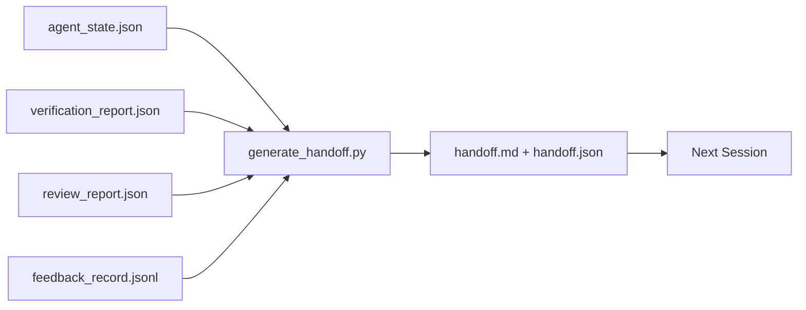

# عملية تسليم متعددة الجلسات
> ستنتهي الجلسة. العمل ليس كذلك. حزمة التسليم هي الأداة التي تحول "عمل الوكيل لمدة ساعة" إلى "الجلسة التالية تكون مثمرة في الدقيقة الأولى." قم ببنائها عن قصد، وليس كفكرة لاحقة.
**النوع:** بناء
** اللغات: ** بايثون (stdlib)
**المتطلبات الأساسية:** المرحلة 14 · 34 (ذاكرة الريبو)، المرحلة 14 · 38 (التحقق)، المرحلة 14 · 39 (المراجع)
**الوقت:** ~50 دقيقة
## أهداف التعلم
- تحديد الحقول السبعة التي تحتاجها كل حزمة تسليم.
- إنشاء عملية تسليم من القطع الأثرية لمنضدة العمل بدون كتابة نثرية بخط اليد.
- قم بقص سجلات التعليقات الكبيرة في ملخص بحجم التسليم.
- اجعل الإجراء الأول للجلسة التالية حتميًا.
## المشكلة
تنتهي الجلسة. يقول الوكيل "رائع، لقد أحرزنا تقدمًا". تفتح الجلسة التالية. يسأل الوكيل التالي "أين توقفنا؟" ذهب إجابة الوكيل الأول. يقوم العميل التالي بإعادة الاكتشاف، وإعادة تشغيل نفس الأوامر، وإعادة طرح نفس الأسئلة على الإنسان، وحرق ثلاثين دقيقة لاستعادة آخر ثلاثين ثانية من الجلسة السابقة.
يتم دفع تكلفة التسليم السيئ في كل جلسة طوال مدة المهمة. الإصلاح عبارة عن حزمة يتم إنشاؤها تلقائيًا في نهاية الجلسة: ما الذي تغير، لماذا، ما الذي تمت تجربته، ما الذي فشل، ما المتبقي، ما يجب فعله أولاً في المرة القادمة.
##المفهوم


### سبعة حقول تحملها كل عملية تسليم
| المجال | سؤال يجيب |
|-------|---------------------|
| `summary` | فقرة واحدة مما تم |
| __الكود_1__ | الفرق في لمحة |
| __الكود_2__ | ما تم تنفيذه فعلا |
| __الكود_3__ | ما الذي تمت تجربته ولماذا لم ينجح |
| __الكود_4__ | ما يمكن أن لدغة الدورة القادمة، مع شدة |
| __الكود_5__ | الخطوة الملموسة الأولى التي ستتخذها الجلسة القادمة |
| __الكود_6__ | المسار إلى التحقق + تقارير المراجعة |
الحقل `next_action` هو الحقل الحامل. تعتبر عملية التسليم بكل شيء باستثناء `next_action` بمثابة تقرير حالة، وليست عملية تسليم.
### يتم إنشاء عمليات التسليم، وليس كتابتها
عملية التسليم المكتوبة بخط اليد هي عملية تسليم يتم تخطيها في يوم شاق. يقرأ المولد عناصر طاولة العمل ويصدر الحزمة. تتمثل مهمة الوكيل في ترك طاولة العمل في حالة يمكن للمولد تلخيصها، وليس كتابة الملخص.
### شكلان: يمكن قراءته بواسطة الإنسان وقابل للقراءة بواسطة الآلة
`handoff.md` هو ما يقرأه الإنسان. `handoff.json` هو ما يقوم الوكيل التالي بتحميله. كلاهما يأتي من نفس القطع الأثرية المصدر. إذا تباعدوا، فإن JSON يفوز.
### قطع سجل الملاحظات
قد يكون `feedback_record.jsonl` الكامل مئات الإدخالات. تحمل عملية التسليم الحرف K الأخير فقط بالإضافة إلى كل إدخال بمخرج غير صفري. تقوم الجلسة التالية بتحميل السجل الكامل إذا لزم الأمر، لكن الحزمة تظل صغيرة.
## بنائها
`code/main.py` ينفذ:
- مُحمل يجمع الحالة والحكم والمراجعة والتعليقات في `WorkbenchSnapshot` واحد.
- وظيفة `generate_handoff(snapshot) -> (markdown, payload)`.
- مرشح يختار آخر إدخالات تعليقات K بالإضافة إلى جميع المخارج غير الصفرية.
- تشغيل تجريبي يكتب `handoff.md` و`handoff.json` بجوار البرنامج النصي.
تشغيله:
```
python3 code/main.py
```

الإخراج: نص تسليم مطبوع، بالإضافة إلى كلا الملفين الموجودين على القرص.
## أنماط الإنتاج في البرية
يقدم كل من Codex CLI وClaude Code وOpenCode قصة ضغط مختلفة؛ توجد حزمة التسليم المنظمة فوق الثلاثة.
**تختلف استراتيجيات الضغط؛ مخطط الحزمة لا. ** Codex CLI's POST /v1/responses/compact عبارة عن AES blob غير شفاف من جانب الخادم (مسار سريع لنماذج OpenAI)؛ الإجراء الاحتياطي هو "ملخص التسليم" المحلي المُلحق كرسالة دور المستخدم `_summary`. يدير Claude Code عملية ضغط تدريجي من خمس مراحل بنسبة 95% من السياق. يقوم OpenCode بإخفاء الرسائل المستندة إلى الطابع الزمني بالإضافة إلى ملخص LLM ذو 5 عناوين. ثلاث آليات مختلفة، والحاجة نفسها: إجراء تسلسل لما ينجو من الضغط إلى قطعة أثرية محمولة. الحزمة هي تلك القطعة الأثرية.
**لا تعتبر عملية تسليم الجلسة الجديدة ضغطًا.** يؤدي الضغط إلى تمديد الجلسة؛ تغلق عملية التسليم واحدًا بشكل نظيف وتبدأ في التالي. إن إطار إصدار Hermes رقم 20372 (أبريل 2026) صحيح: عندما يبدأ الضغط الموضعي في التدهور، يجب على الوكيل كتابة عملية تسليم مضغوطة، وإنهاء الجلسة، والاستئناف في سياق جديد. الحزمة هي ما makes هذا الانتقال الرخيص. الخطأ هو الاستمرار في الضغط حتى تنهار الجودة؛ الحل هو وضع ميزانية لعملية تسليم مبكرة ونظيفة.
**عملية تسليم نشطة واحدة لكل فرع وموضوع.** يتعطل التنسيق بين الوكلاء عند عمليات التسليم القديمة أكثر من مخرجات النموذج السيئة. قم دائمًا بتضمين `branch` و`last_known_good_commit` و`status` من `active | superseded | archived`. تتم أرشفة عمليات التسليم التي لا معنى لها؛ فقط النشط هو الذي يقود الجلسة التالية. هذا هو الفرق بين التسليم كملاحظات والتسليم كحالة.
**اختتم قبل 50-75% من السياق، وليس على الحائط.** يقدم دليل التشغيل ذو النمط المكتوب بخط اليد (CLAUDE.md + HANDOVER.md) أفضل النتائج عندما تنتهي الجلسة بميزانية سياق تتراوح بين 50-75% بدلاً من 95%. يعمل مولد الحزم بشكل نظيف قبل أن تلوث عناصر الضغط الحالة المصدر. رخيصة الثمن في الكتابة بينما يكون السياق سليمًا؛ باهظة الثمن عندما يفقد النموذج مكانه بالفعل.
## استخدمه
أنماط الإنتاج:
- **ربط نهاية الجلسة.** يقوم وقت التشغيل بتشغيل المولد عندما يغلق المستخدم الدردشة. تنتقل الحزمة إلى `outputs/handoff/<session_id>/`.
- قالب **PR.** تخفيض سعر المولد هو أيضًا نص PR. قرأه المراجعون دون فتح خمسة ملفات أخرى.
- **التسليم بين الوكلاء.** البناء باستخدام منتج واحد (Claude Code)، والمتابعة باستخدام منتج آخر (Codex). الحزمة هي اللغة المشتركة.
الحزمة صغيرة ومنتظمة ورخيصة الإنتاج. مركبات توفير التكلفة مع كل جلسة.
## اشحنها
يُنتج `outputs/skill-handoff-generator.md` مولدًا مضبوطًا على مسارات المشروع، وخطاف نهاية الجلسة الذي يقوم بتشغيله، ومخطط `handoff.json` الذي يقرأه الوكيل التالي عند بدء التشغيل.
## تمارين
1. أضف حقل `assumptions_to_validate` الذي يوضح كل الافتراضات التي سجلها المنشئ ولكن المراجع لم يسجل أكثر من 1.
2. قم بقص ملخص الملاحظات بشكل مختلف بالنسبة لعمليات التشغيل الفاشلة مقابل عمليات التشغيل الناجحة. الدفاع عن عدم التماثل.
3. تضمين قائمة "أسئلة للإنسان". ما هو الحد الأدنى لسؤال make في الحزمة مقابل رسالة محادثة؟
4. اجعل المولد غير فعال: تشغيله مرتين ينتج عنه نفس الحزمة. ما الذي يجب أن يكون مستقرًا حتى يستمر ذلك؟
5. أضف قسم "المتطلبات المسبقة للجلسة التالية" يسرد بالضبط العناصر التي يجب أن تقوم الجلسة التالية بتحميلها قبل التصرف.
## المصطلحات الرئيسية
| مصطلح | ماذا يقول الناس | ماذا يعني في الواقع |
|------|----------------|-----------------------|
| حزمة التسليم | "ملخص الجلسة" | قطعة أثرية تم إنشاؤها تحمل الحقول السبعة، كل من تخفيض السعر وJSON |
| الإجراء التالي | "ماذا تفعل أولاً" | الخطوة الملموسة الوحيدة التي تبدأ الجلسة التالية |
| ردود الفعل تقليم | "ملخص السجل" | سجلات K الأخيرة بالإضافة إلى كل خروج غير الصفر |
| تقرير الحالة | "ما فعلناه" | مستند مفقود `next_action`؛ مفيدة، ولكن ليس تسليما |
| مؤشر الحكم | "الاستلام" | المسار إلى التحقق + تقارير المراجعة للتتبع |
## مزيد من القراءة
- [Anthropic, Effective harnesses for long-running agents](https://www.anthropic.com/engineering/effective-harnesses-for-long-running-agents)
- [OpenAI Agents SDK handoffs](https://platform.openai.com/docs/guides/agents-sdk/handoffs)
- [Codex Blog, Codex CLI Context Compaction: Architecture, Configuration, Managing Long Sessions](https://codex.danielvaughan.com/2026/03/31/codex-cli-context-compaction-architecture/) — POST /v1/responses/الاحتياطي المضغوط والمحلي
- [Justin3go, Shedding Heavy Memories: Context Compaction in Codex, Claude Code, OpenCode](https://justin3go.com/en/posts/2026/04/09-context-compaction-in-codex-claude-code-and-opencode) — مقارنة الضغط بين ثلاثة بائعين
- [JD Hodges, Claude Handoff Prompt: How to Keep Context Across Sessions (2026)](https://www.jdhodges.com/blog/ai-session-handoffs-keep-context-across-conversations/) — CLAUDE.md + HANDOVER.md، ميزانية السياق بنسبة 50-75%
- [Mervin Praison, Managing Handoffs in Multi-Agent Coding Sessions: Fresh Context Without Losing Continuity](https://mer.vin/2026/04/managing-handoffs-in-multi-agent-coding-sessions-fresh-context-without-losing-continuity/) — تأطير الأنظمة الموزعة
- [Hermes Issue #20372 — automatic fresh-session handoff when compression becomes risky](https://github.com/NousResearch/hermes-agent/issues/20372)
- [Hermes Issue #499 — Context Compaction Quality Overhaul](https://github.com/NousResearch/hermes-agent/issues/499) — المطالبات الموجهة نحو التسليم في الدستور الغذائي CLI
- [Microsoft Agent Framework, Compaction](https://learn.microsoft.com/en-us/agent-framework/agents/conversations/compaction)
- [OpenCode, Context Management and Compaction](https://deepwiki.com/sst/opencode/2.4-context-management-and-compaction)
- [LangChain, Context Engineering for Agents](https://www.langchain.com/blog/context-engineering-for-agents)
- المرحلة 14 · 34 — ملف الحالة الذي يقرأه المولد
- المرحلة 14 · 38 — حكم التحقق من نقاط الحزمة عند
- المرحلة 14 · 39 — تقرير المراجع مجمع في الحزمة