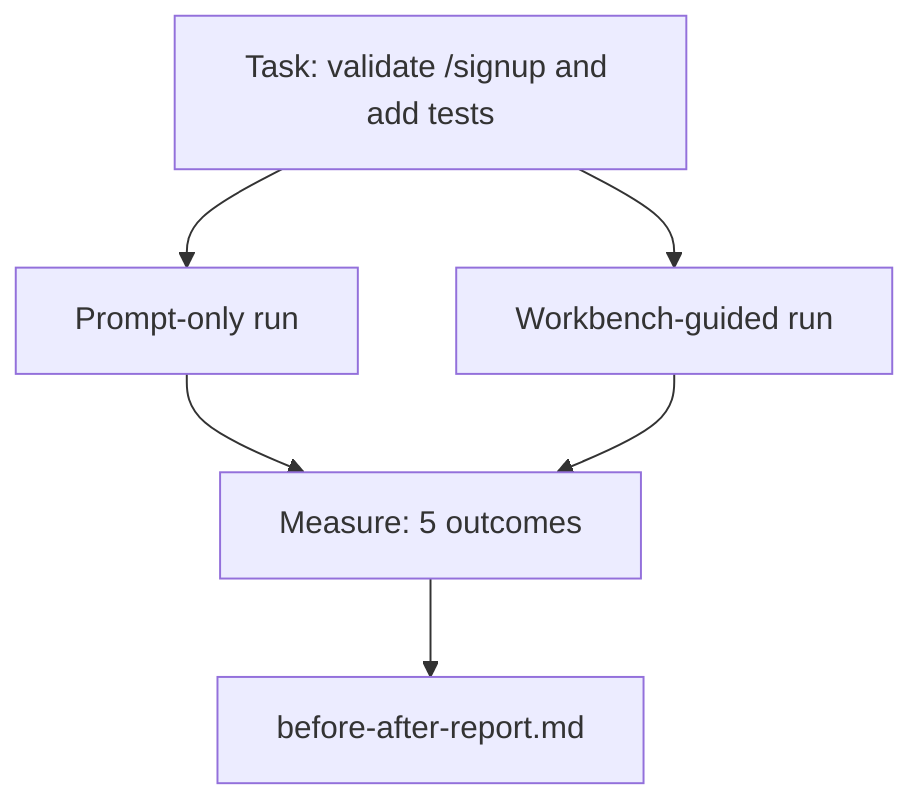

# منضدة العمل على الريبو الحقيقي
> أحد عشر درسًا من الأسطح لا قيمة لها إذا لم تنجو من الاتصال بقاعدة تعليمات برمجية حقيقية. يقوم هذا الدرس بتنفيذ نفس المهمة مرتين على نموذج تطبيق صغير: موجه فقط مقابل موجه منضدة العمل. الأرقام هي التي تجادل.
**النوع:** بناء
** اللغات: ** بايثون (stdlib)
**المتطلبات:** المراحل 14 · 32 إلى 14 · 40
**الوقت:** ~60 دقيقة
## أهداف التعلم
- اجمع أسطح طاولة العمل السبعة معًا في تطبيق صغير.
- قم بتشغيل نفس المهمة مرتين (موجهة فقط وموجهة إلى طاولة العمل) وقم بقياس خمس نتائج.
- اقرأ التقرير قبل/بعد وحدد الأسطح التي أعطت أكبر قدر من التأثير.
- الدفاع عن طاولة العمل ضد الرفض "لكن نموذجي جيد بما فيه الكفاية".
## المشكلة
العرض التوضيحي لمهمة لعبة لا يقنع أحداً. يتم إثبات الحجة لصالح طاولة العمل عندما تصل مهمة حقيقية على الريبو الحقيقي إلى الإنتاج مع عدد أقل من حالات الفشل، وعدد أقل من عمليات الإرجاع، وحزمة يمكن أن تستخدمها الجلسة التالية.
يشحن هذا الدرس هذا الريبو الواقعي ويدير نفس المهمة من خلال كلا السطرين pip. والنتيجة هي تقرير قبل/بعد يمكنك تسليمه إلى المتشكك.
##المفهوم


### التطبيق النموذجي
الحد الأدنى من معالج نمط FastAPI في `sample_app/`:
- `app.py` مع `/signup` (لم يتم التحقق من الصحة بعد).
- `test_app.py` مع اختبار مسار سعيد واحد.
- `README.md` و`scripts/release.sh` كطعم للمنطقة المحرمة.
### المهمة
> إضافة التحقق من صحة الإدخال إلى `/signup`: رفض كلمات المرور الأقصر من 8 أحرف، وإرجاع 422 مع مظروف خطأ مكتوب. إضافة اختبار يثبت السلوك الجديد.
### السطرين pip
مطالبة فقط:
1. اقرأ README.
2. اقرأ `app.py`.
3. تحرير الملفات.
4. تم الانتهاء من المطالبة.
موجهة لمنضدة العمل:
1. قم بتشغيل البرنامج النصي init (الدرس 35).
2. اقرأ عقد النطاق (الدرس 36).
3. قراءة الحالة (الدرس 34).
4. تحرير الملفات المسموح بها فقط.
5. قم بتشغيل أمر القبول عبر مشغل الملاحظات (الدرس 37).
6. قم بتشغيل بوابة التحقق (الدرس 38).
7. قم بتشغيل المراجع (الدرس 39).
8. توليد عملية التسليم (الدرس 40).
### قياس النتائج الخمس
| النتيجة | لماذا يهم |
|---------|----------------|
| `tests_actually_run` | معظم ادعاءات "الاختبارات التي تم اجتيازها" لا يمكن التحقق منها |
| __الكود_1__ | الاختبار الذي يثبت الهدف لا بد أن يكون الاختبار الذي جرى |
| __الكود_2__ | زحف النطاق هو الفشل الصامت السائد |
| __الكود_3__ | الجلسة التالية تدفع أو تستفيد من هذا |
| __الكود_4__ | حكم نوعية على رأس البوابة |
## بنائها
يقوم `code/main.py` بتنسيق سطري pip مقابل نفس نموذج تثبيت التطبيق. يتم كتابة كلا سطري pipe (لا يوجد LLM في الحلقة) بحيث يكون القياس قابلاً للتكرار. يكتب البرنامج النصي المقارنة في `before-after-report.md` و`comparison.json`.
تشغيله:
```
python3 code/main.py
```

الإخراج: جدول وحدة التحكم بالنتائج لكل pipeline، وتقرير تخفيض السعر المحفوظ بجوار البرنامج النصي، وJSON لمن يريد رسمه.
## أنماط الإنتاج في البرية
سؤال المشككين هو "إلى أي مدى تساعد طاولة العمل بالفعل؟" أرقام 2026 تقول أكثر بكثير من التفسير.
**من أعلى 30 إلى أعلى 5 في نفس الطراز.** *تشريح حزام العميل* من LangChain (أبريل 2026): قفز وكيل الترميز من خارج أفضل 30 وكيلًا ليحتل المرتبة الخامسة في Terminal Bench 2.0 عن طريق تغيير الحزام فقط. نفس النموذج. أسطح مختلفة. دلتا خمسة وعشرون رتبة.
** Vercel 80% إلى 100% عن طريق حذف الأدوات. ** ذكرت شركة Vercel أن حذف 80% من أدوات وكيلها أدى إلى رفع معدل النجاح من 80% إلى 100%. سطح أداة أصغر، نطاق أكثر وضوحًا، طرق أقل للفشل. الفضاء السلبي يفوز.
**دقة Harvey مضاعفة عن طريق أدوات الربط وحدها. ** ضاعف الوكلاء القانونيون دقتهم من خلال تحسين أدوات التثبيت، دون تغيير النموذج.
**88% من مشاريع وكيل AI للمؤسسة تفشل في الوصول إلى الإنتاج.** تتتبع ورقة preprints.org *Harness Engineering for Language Agents* (مارس 2026) حالات الفشل في وقت التشغيل، وليس الاستدلال: الحالة التي لا معنى لها، وإعادة المحاولة الهشة، والسياق المتضخم، وضعف التعافي من الأخطاء الوسيطة.
**انهيار السياق الطويل.** ينخفض ​​نجاح WebAgent الأساسي بنسبة 40-50% إلى أقل من 10% في ظروف السياق الطويل، ومعظمها من الحلقات اللانهائية وفقدان الهدف. توجد حلقة رالف وحزمة التسليم لاستيعاب ذلك.
**لا تزال السلبيات الكاذبة موجودة.** المهام الفعلية ذات الخطوة الواحدة، والخطوط المكونة من سطر واحد، وعمليات تشغيل المنسق، وأي شيء حفظه النموذج حرفيًا - يتم تشغيلها بشكل أسرع عند الطلب فقط. يجب أن يسردها المعيار بأمانة حتى لا يتم تأطير طاولة العمل على أنها مبالغة.
الوجبات الجاهزة ليست "الحزام يفوز إلى الأبد". تمتص النماذج حيل التسخير بمرور الوقت. والخلاصة هي أن الحمل الهندسي اليوم يقع على الأسطح السبعة، والأرقام تثبت ذلك.
## استخدمه
هذا الدرس هو ملف الحالة الذي تستشهد به عندما:
- يسأل أحدهم لماذا يحمل كل PR `agent-rules.md` وعقد النطاق.
- يريد الفريق إسقاط بوابة التحقق "لهذا السباق فقط".
- يتم إطلاق منتج وكيل جديد وتحتاج إلى معيار محمول لمعرفة ما إذا كان يوفر الوقت بالفعل.
الأرقام تسافر أبعد من التفسير.
## اشحنها
`outputs/skill-workbench-benchmark.md` عبارة عن أداة تقييم محمولة تعمل على تشغيل أي منتج وكيل من خلال كلا سطري pip مقابل نموذج التطبيق الخاص بالمشروع والإبلاغ عن النتائج الخمس.
## تمارين
1. أضف نتيجة سادسة: تحرير ذات معنى من الوقت إلى الأول. كيف يمكنك قياسه بشكل نظيف؟
2. قم بإجراء المقارنة على مهمة حقيقية في اليوم الثاني في قاعدة التعليمات البرمجية الخاصة بك. أين تنزلق أرقام طاولة العمل؟
3. أضف تمريرة "سلبية كاذبة": المهام التي يكون فيها الطلب الفوري فقط أسرع ويكون عبء طاولة العمل هو التكلفة الحقيقية. الدفاع عن الحفاظ على طاولة العمل على أي حال.
4. استبدل "الوكيل" المكتوب بمكالمة LLM حقيقية. ما هي النتائج التي تصبح أكثر ضجيجًا؟
5. قم بتأليف ملخص من صفحة واحدة موجه لغير المهندسين. ما الذي ينجو من القطع؟
## المصطلحات الرئيسية
| مصطلح | ماذا يقول الناس | ماذا يعني في الواقع |
|------|----------------|-----------------------|
| نموذج التطبيق | "لعبة الريبو" | صغيرة ولكنها واقعية بما يكفي لتمرين جميع الأسطح السبعة |
| خط أنابيب | "سير العمل" | التسلسل المرتب للسطح يقرأ/يكتب ويتبع الوكيل |
| قبل/بعد التقرير | "الإيصالات" | القطعة الأثرية التي تسلمها إلى المتشكك |
| سلبي كاذب | "إفراط في منضدة العمل" | المهام التي يكون فيها الطلب الفوري أسرع؛ من المفيد التعداد بصراحة |
| معيار طاولة العمل | "درجة الموثوقية" | الحزام المحمول الذي يقوم بإجراء المقارنة على قاعدة التعليمات البرمجية الخاصة بك |
## مزيد من القراءة
- [LangChain, The Anatomy of an Agent Harness](https://blog.langchain.com/the-anatomy-of-an-agent-harness/) — إيصال المقعد الطرفي من أعلى 30 إلى أعلى 5
- [MongoDB, The Agent Harness: Why the LLM Is the Smallest Part of Your Agent System](https://www.mongodb.com/company/blog/technical/agent-harness-why-llm-is-smallest-part-of-your-agent-system) — أرقام فيرسيل + هارفي
- [preprints.org, Harness Engineering for Language Agents](https://www.preprints.org/manuscript/202603.1756) — معدل فشل المؤسسة يصل إلى 88%، والأسباب الجذرية لوقت التشغيل
- [HN: Improving 15 LLMs at Coding in One Afternoon. Only the Harness Changed](https://news.ycombinator.com/item?id=46988596) — تم نسخه عبر 15 طرازًا
- [Cloudflare, Orchestrating AI Code Review at Scale](https://blog.cloudflare.com/ai-code-review/) — 131 ألف مراجعة / 30 يومًا في الإنتاج
- [Anthropic, Building Effective Agents](https://www.anthropic.com/research/building-effective-agents)
- المراحل من 14 · 32 إلى 14 · 40 — الأسطح التي يتدرب عليها هذا الدرس من البداية إلى النهاية
- المرحلة 14 · 19 — SWE-bench، GAIA، AgentBench كمقاييس أداء كلية يكملها هذا الدرس
- المرحلة 14 · 30 - تطوير العامل القائم على التقييم والذي يتم توصيل نفس الحزام به