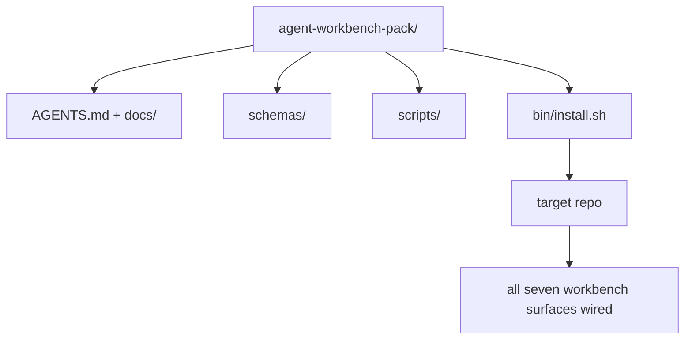

# Capstone: قم بشحن حزمة طاولة عمل الوكيل القابلة لإعادة الاستخدام
> ينتهي المسار المصغر بحزمة تسقطها في أي ريبو. أحد عشر درسًا من الأسطح المضغوطة في دليل يمكنك `cp -r` ويكون لديك وكيل يعمل بشكل موثوق في صباح اليوم التالي. حجر الزاوية هو القطعة الأثرية التي يتداول عليها هذا المنهج.
**النوع:** بناء
** اللغات: ** بايثون (stdlib)
**المتطلبات:** المراحل 14 · 31 إلى 14 · 41
**الوقت:** ~75 دقيقة
## أهداف التعلم
- قم بتجميع أسطح طاولة العمل السبعة في دليل واحد.
- قم بتثبيت المخططات والبرامج النصية والقوالب حتى يحصل الريبو الجديد على خط أساس معروف جيدًا.
- قم بإضافة برنامج تثبيت واحد يقوم بوضع الحزمة بشكل مستقل.
- قرر ما يبقى في العبوة وما يبقى خارجًا، مع الدفاع عن القطع لكل منهما.
## المشكلة
إن طاولة العمل الموجودة في مستند Google، وسجل الدردشة، وثلاثة نصوص برمجية نصف متذكرة هي طاولة عمل يتم إعادة بنائها كل ثلاثة أشهر. العلاج عبارة عن حزمة ذات إصدار: ريبو أو دليل يحتوي على الأسطح والمخططات والبرامج النصية ومثبت بأمر واحد.
ستنهي هذا الدرس بـ `outputs/agent-workbench-pack/` مشحونًا على القرص و`bin/install.sh` الذي يسقطه في أي مستودع مستهدف.
##المفهوم


### تخطيط الحزمة
```
outputs/agent-workbench-pack/
├── AGENTS.md
├── docs/
│   ├── agent-rules.md
│   ├── reliability-policy.md
│   ├── handoff-protocol.md
│   └── reviewer-rubric.md
├── schemas/
│   ├── agent_state.schema.json
│   ├── task_board.schema.json
│   └── scope_contract.schema.json
├── scripts/
│   ├── init_agent.py
│   ├── run_with_feedback.py
│   ├── verify_agent.py
│   └── generate_handoff.py
├── bin/
│   └── install.sh
└── README.md
```

### ما يبقى في الداخل، ما يبقى في الخارج
في:
- المخططات السطحية. هم العقد.
- النصوص الأربعة أعلاه. هم وقت التشغيل.
- المستندات الأربعة. هم القواعد والعنوان.
خارج:
- المهام الخاصة بالمشروع. تنتمي المهام إلى لوحة الريبو المستهدفة، وليس إلى الحزمة.
- مكالمات البائع SDK. الحزمة ملحدة للإطار.
- تأهيل النثر. توجد الحزمة بجوار منطقة الإعداد الحالية للفريق، وليس بداخلها.
### المثبت
`bin/install.sh` قصير (أو `bin/install.py`):
1. يرفض التثبيت على حزمة موجودة بدون `--force`.
2. انسخ الحزمة إلى الريبو المستهدف.
3. قم بتوصيل CI في حالة وجود `.github/workflows/`.
4. قم بطباعة الخطوات التالية: املأ اللوحة، واضبط أوامر القبول، وقم بتشغيل البرنامج النصي init.
### الإصدار
تحتوي الحزمة على ملف `VERSION`. مطبات المخطط وتغييرات البرنامج النصي التي تتطلب عمليات الترحيل تصطدم بالتخصص. تغييرات المستند فقط تصطدم بالتصحيح. يسجل `agent_state.json` الخاص بمستودع الريبو الهدف إصدار الحزمة الذي تمت تهيئته عليه.
## بنائها
يقوم `code/main.py` بتجميع الحزمة في `outputs/agent-workbench-pack/` بجوار الدرس، ومصنفة بالمخططات والنصوص من الدروس السابقة في هذا المسار المصغر والمستندات التي كتبتها بالفعل.
تشغيله:
```
python3 code/main.py
```

يقوم البرنامج النصي بنسخ الأسطح وتثبيتها، ويكتب README، ويطبع شجرة الحزمة، ويخرج من الصفر. إعادة التشغيل غير فعالة.
## أنماط الإنتاج في البرية
لا تكون الحزمة ذات قيمة إلا إذا نجت من الانقسامات والتحديثات والمنبع غير الودي. أربعة أنماط make فعالة.
**`VERSION` هو العقد، وليس التسويق.** تتطلب المطبات الرئيسية ترحيل الحالة. تتطلب المطبات البسيطة إعادة تشغيل المدقق. نتوءات التصحيح هي وثيقة فقط. يقوم المثبت بكتابة `.workbench-version` في الريبو الهدف في كل عملية تثبيت؛ `lint_pack.py` يرفض الشحن إذا كان قفل الهدف لا يتفق مع `VERSION` الخاص بالحزمة. هذه هي الطريقة التي تنجو بها `npm` و`Cargo` و`pyproject.toml` من الاضطراب لمدة 10 سنوات؛ لا شيء عن الوكلاء يغير القواعد.
**مصدر واحد للتوزيع عبر الأدوات.** يشحن Nx واحدًا `nx ai-setup` الذي يضع `AGENTS.md`، `CLAUDE.md`، `.cursor/rules/`، `.github/copilot-instructions.md`، وخادم MCP من تكوين واحد. يجب أن تفعل الحزمة الشيء نفسه؛ يقوم المثبت بإصدار الروابط الرمزية (`ln -s AGENTS.md CLAUDE.md`) بحيث يتم توزيع مصدر واحد للحقيقة على كل وكيل ترميز. يعد تفرع الحزمة لدعم أداة واحدة على أخرى بمثابة وضع فشل.
**`uninstall.sh` الذي يرفض في حالة غير تافهة.** يجب ألا يؤدي إلغاء تثبيت الحزمة إلى حذف `agent_state.json` أو `task_board.json` أو `outputs/` الخاص بالمستخدم. تقوم أداة إلغاء التثبيت بإزالة المخططات والبرامج النصية والمستندات و`AGENTS.md` (مع إلغاء الاشتراك في `--keep-agents-md`) وترفض المتابعة إذا كانت ملفات الحالة تحتوي على أي تغييرات غير ملتزم بها. الدولة تنتمي إلى المستخدم. الحزمة لا تملكها.
**المهارة قابلة للنشر. توزيع بنمط SkillKit.** يتم شحن الحزمة كمهارة SkillKit: `skillkit install agent-workbench-pack` يتم توزيعها عبر 32 وكيل AI من مصدر واحد. الريبو الحزمة هو مصدر الحقيقة. SkillKit هي قناة التوزيع. ينهار قفل البائع؛ الأسطح السبعة تبقى كما هي.
## استخدمه
ثلاثة أماكن لسفن الحزمة:
- **كدليل، ستسقط في الريبو.** `cp -r outputs/agent-workbench-pack /path/to/repo`.
- **كنموذج ريبو عام.** الشوكة والتخصيص، مع التحكم في الانجراف بواسطة `VERSION`.
- **كمهارة SkillKit.** يتم دمجها في منتج الوكيل الخاص بك بحيث يحددها أمر واحد.
الحزمة هي الوصفة. كل تثبيت هو خدمة.
## اشحنها
يُنشئ `outputs/skill-workbench-pack.md` حزمة تم ضبطها حسب المشروع: قواعد تم تحسينها لتتناسب مع تاريخ الفريق، ومجموعات النطاق المطابقة للريبو، وأبعاد نموذج التقييم الموسعة بإدخال واحد خاص بالمجال.
## تمارين
1. حدد المستند الخامس الاختياري الذي يستحق الترقية إلى الحزمة الأساسية. الدفاع عن القطع.
2. أعد كتابة برنامج التثبيت باسم Python مع وضع علامة `--dry-run`. قارن بين بيئة العمل وbash.
3. أضف `bin/uninstall.sh` الذي يزيل الحزمة بأمان ويرفض إذا كانت ملفات الحالة لها تاريخ غير تافه. ما الذي يعتبر غير تافه؟
4. قم بإضافة `lint_pack.py` الذي يفشل عندما تنحرف الحزمة عن `VERSION`. قم بتوصيله إلى CI للحصول على الريبو الخاص بالحزمة.
5. قم بتأليف دليل تشغيل الترحيل من طاولة العمل الملفوفة يدويًا إلى هذه الحزمة. ما هو ترتيب العمليات التي تقلل من وقت التوقف عن العمل؟
## المصطلحات الرئيسية
| مصطلح | ماذا يقول الناس | ماذا يعني في الواقع |
|------|----------------|-----------------------|
| حزمة منضدة | "طقم البداية" | دليل ذو إصدار يحمل كافة الأسطح السبعة |
| المثبت | "برنامج الإعداد" | `bin/install.sh` الذي يضع الحزمة بشكل غير فعال |
| نسخة الحزمة | "__المصطلح_2__" | المطبات الرئيسية لتغييرات المخطط/البرنامج النصي، التصحيح للمستند فقط |
| حزمة منسدلة | "cp -r وانطلق" | تعمل الحزمة بدون تخصيص لكل ريبو في اليوم الأول |
| قالب متشعب | "قالب GitHub" | الريبو العام الذي يمكن لـ GitHub "استخدم هذا القالب" استنساخه من |
## مزيد من القراءة
- المراحل 14 · 31 إلى 14 · 41 — كل سطح في هذه الحزمة
- [SkillKit](https://github.com/rohitg00/skillkit) — قم بتثبيت هذه المهارة عبر 32 وكيل AI
- [Nx Blog, Teach Your AI Agent How to Work in a Monorepo](https://nx.dev/blog/nx-ai-agent-skills) — مولد أحادي المصدر عبر ست أدوات
- [agents.md — the open spec](https://agents.md/) — ما يجب أن ينفذه جهاز التوجيه الخاص بحزمتك
- [HKUDS/OpenHarness](https://github.com/HKUDS/OpenHarness) — التنفيذ المرجعي للحزمة المكافئة
- [andrewgarst/agentic_harness](https://github.com/andrewgarst/agentic_harness) — مرجع مدعوم من Redis مع مجموعة التقييم
- [Augment Code, A good AGENTS.md is a model upgrade](https://www.augmentcode.com/blog/how-to-write-good-agents-dot-md-files) — شريط جودة حزم المستندات
- [Anthropic, Effective harnesses for long-running agents](https://www.anthropic.com/engineering/effective-harnesses-for-long-running-agents)
- [Anthropic, Harness design for long-running application development](https://www.anthropic.com/engineering/harness-design-long-running-apps)
- المرحلة 14 · 30 — تطوير الوكيل القائم على التقييم والذي يستهلك بوابة التحقق الخاصة بالحزمة
- المرحلة 14 · 41 — تم تحسين المعيار السابق/اللاحق لهذه الحزمة