# Communication Protocols

> الوكلاء الذين لا يستطيعون التحدث بنفس اللغة ليسوا فريقًا. إنهم غرباء يصرخون في الفراغ.

**النوع:** بناء
**اللغات:** TypeScript
**المتطلبات الأساسية:** المرحلة 14 (هندسة الوكيل)، الدرس 16.01 (لماذا تعدد الوكلاء)
**الوقت:** ~120 دقيقة

## Learning Objectives

- تنفيذ اكتشاف الأداة MCP واستدعاءها حتى يتمكن الوكلاء من استخدام الأدوات التي تكشفها الخوادم الخارجية
- قم ببناء بطاقة وكيل A2A ونقطة نهاية مهمة تسمح لأحد الوكلاء بتفويض العمل إلى آخر على HTTP
- قارن MCP (الوصول إلى الأداة)، A2A (وكيل إلى وكيل)، ACP (تدقيق المؤسسة)، و ANP (الثقة اللامركزية) وشرح البروتوكول الذي يحل المشكلة
- قم بتوصيل بروتوكولات متعددة معًا في نظام واحد حيث يكتشف الوكلاء الأدوات عبر MCP ويفوضون المهام عبر A2A

## The Problem

قمت بتقسيم النظام الخاص بك إلى وكلاء متعددة. باحث، مبرمج، مراجع. إنهم رائعون في وظائفهم الفردية. لكنك الآن بحاجة إليهم أن يتحدثوا مع بعضهم البعض فعليًا.

محاولتك الأولى واضحة: تمرير الخيوط. يقوم الباحث بإرجاع كتلة من النص، ويقوم المبرمج بتحليلها كيفما يستطيع. إنه يعمل حتى يخطئ المبرمج في تفسير ملخص البحث، أو يصل وكيلان إلى طريق مسدود في انتظار بعضهما البعض، أو تحتاج إلى عملاء تم إنشاؤها بواسطة فرق مختلفة للتعاون. فجأة ينهار مبدأ "مجرد تمرير الخيوط".

هذه هي مشكلة بروتوكول الاتصال. بدون عقد مشترك لكيفية تبادل الوكلاء للمعلومات، تصبح الأنظمة متعددة الوكلاء هشة وغير قابلة للتدقيق ومن المستحيل توسيع نطاقها إلى ما هو أبعد من حفنة من الوكلاء الذين كتبتهم شخصيًا.

استجاب النظام البيئي AI بأربعة بروتوكولات، كل منها يحل شريحة مختلفة من المشكلة:

- **MCP** للوصول إلى الأداة
- **A2A** للتعاون من وكيل إلى وكيل
- **ACP** لقابلية تدقيق المؤسسة
- **ANP** للهوية اللامركزية والثقة

هذا الدرس يتعمق. سوف تقرأ تنسيقات الأسلاك الحقيقية من كل مواصفات، وتبني تطبيقات العمل، وتربط الأربعة جميعها في نظام موحد.

## The Concept

### The Protocol Landscape

فكر في هذه البروتوكولات الأربعة كطبقات، كل منها يتناول سؤالًا مختلفًا:

```mermaid
block-beta
  columns 1
  block:ANP["ANP — How do agents trust strangers?\nDecentralized identity (DID), E2EE, meta-protocol"]
  end
  block:A2A["A2A — How do agents collaborate on goals?\nAgent Cards, task lifecycle, streaming, negotiation"]
  end
  block:ACP["ACP — How do agents talk in auditable systems?\nRuns, trajectory metadata, session continuity"]
  end
  block:MCP["MCP — How does an agent use a tool?\nTool discovery, execution, context sharing"]
  end

  style ANP fill:#f3e8ff,stroke:#7c3aed
  style A2A fill:#dbeafe,stroke:#2563eb
  style ACP fill:#fef3c7,stroke:#d97706
  style MCP fill:#d1fae5,stroke:#059669
```

إنهم ليسوا منافسين. إنهم يحلون مشاكل مختلفة على مستويات مختلفة.

### MCP (Recap)

تمت تغطية MCP بعمق في المرحلة 13. ملخص سريع: MCP يوحد كيفية اتصال LLM بالأدوات الخارجية ومصادر البيانات. إنه بروتوكول **خادم عميل** حيث يقوم الوكيل (العميل) باكتشاف الأدوات التي كشفها الخادم واستدعاءها.

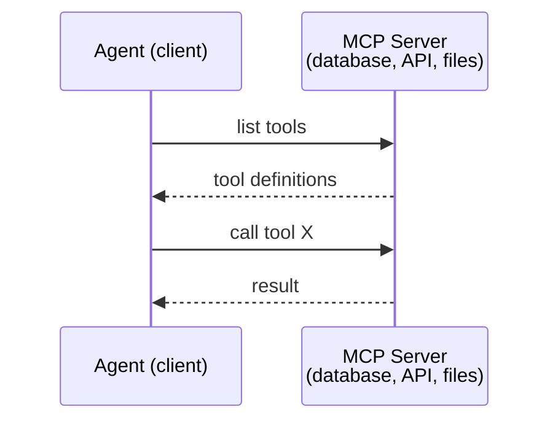

MCP هو **الاتصال بين الوكيل والأداة**. لا يساعد الوكلاء على التحدث مع بعضهم البعض.

### A2A (Agent2Agent Protocol)

**تم الإنشاء بواسطة:** Google (الآن ضمن Linux Foundation باسم `lf.a2a.v1`)
**إصدار المواصفات:** 1.0.0
**المشكلة:** كيف يتعاون الوكلاء المستقلون ويتفاوضون ويفوضون المهام لبعضهم البعض؟

A2A هو بروتوكول **تعاون الوكيل من نظير إلى نظير**. حيث يقوم MCP بتوصيل الوكيل بالأدوات، A2A يربط الوكيل بالوكلاء الآخرين. ينشر كل وكيل **بطاقة الوكيل** على رقم URL معروف، ويكتشفها الوكلاء الآخرون ويتفاوضون معها ويفوضون المهام إليها.

#### How A2A Works

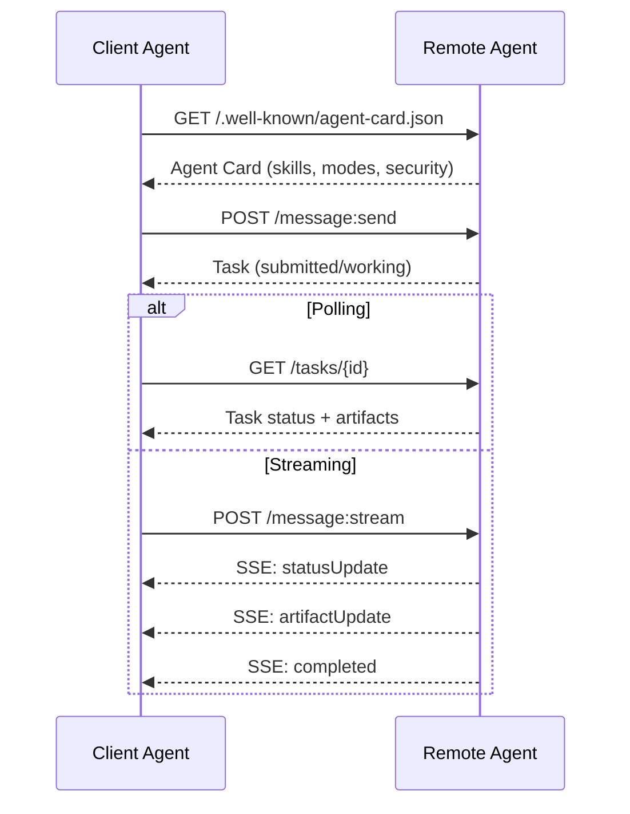

#### The Real Agent Card

هذا ما تبدو عليه بطاقة الوكيل A2A في الواقع. تم تقديمه في `GET /.well-known/agent-card.json`:

```json
{
  "name": "Research Agent",
  "description": "Searches documentation and summarizes findings",
  "version": "1.0.0",
  "supportedInterfaces": [
    {
      "url": "https://research-agent.example.com/a2a/v1",
      "protocolBinding": "JSONRPC",
      "protocolVersion": "1.0"
    },
    {
      "url": "https://research-agent.example.com/a2a/rest",
      "protocolBinding": "HTTP+JSON",
      "protocolVersion": "1.0"
    }
  ],
  "provider": {
    "organization": "Your Company",
    "url": "https://example.com"
  },
  "capabilities": {
    "streaming": true,
    "pushNotifications": false
  },
  "defaultInputModes": ["text/plain", "application/json"],
  "defaultOutputModes": ["text/plain", "application/json"],
  "skills": [
    {
      "id": "web-research",
      "name": "Web Research",
      "description": "Searches the web and synthesizes findings",
      "tags": ["research", "search", "summarization"],
      "examples": ["Research the latest changes in React 19"]
    },
    {
      "id": "doc-analysis",
      "name": "Documentation Analysis",
      "description": "Reads and analyzes technical documentation",
      "tags": ["docs", "analysis"],
      "inputModes": ["text/plain", "application/pdf"],
      "outputModes": ["application/json"]
    }
  ],
  "securitySchemes": {
    "bearer": {
      "httpAuthSecurityScheme": {
        "scheme": "Bearer",
        "bearerFormat": "JWT"
      }
    }
  },
  "security": [{ "bearer": [] }]
}
```

الأشياء الرئيسية التي يجب ملاحظتها:
- **المهارات** هي ما يمكن للوكيل القيام به. يحتوي كل منها على ID وعلامات وأنواع الإدخال/الإخراج المدعومة MIME. هذه هي الطريقة التي يقرر بها وكيل العميل ما إذا كان هذا الوكيل البعيد يمكنه التعامل مع طلبه.
- **supportedInterfaces** يسرد روابط البروتوكولات المتعددة. يمكن لوكيل واحد التحدث JSON-RPC وREST وgRPC في وقت واحد.
- **الأمان** مدمج في البطاقة. يعرف العميل المصادقة التي يحتاجها قبل تقديم طلب واحد.

#### Task Lifecycle

المهام هي وحدة العمل الأساسية في A2A. يتحركون عبر حالات محددة:

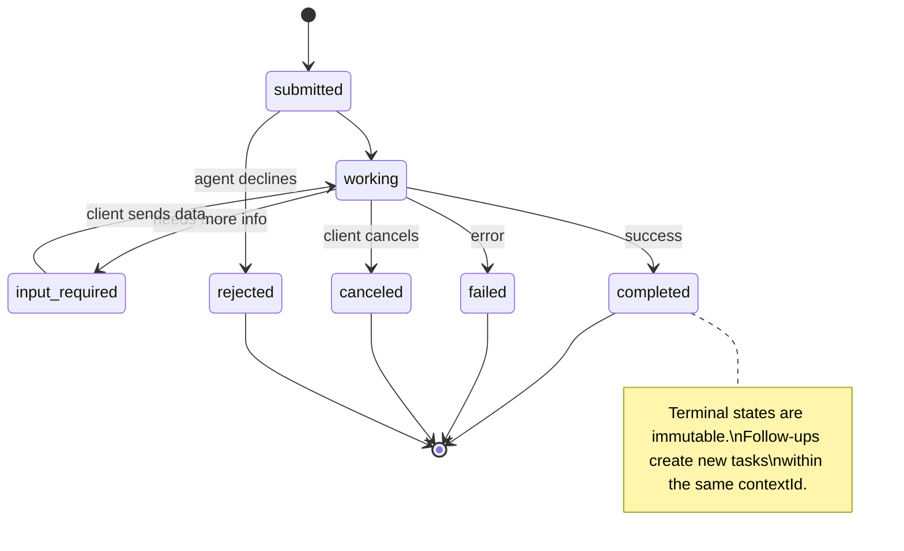

جميع الحالات الثمانية (تعرف المواصفات أيضًا `UNSPECIFIED` كحارس، تم حذفها هنا):

| الدولة | صالة؟ | معنى |
|---|---|---|
| `TASK_STATE_SUBMITTED` | لا | تم الإقرار به، ولم تتم معالجته بعد |
| `TASK_STATE_WORKING` | لا | قيد المعالجة بنشاط |
| `TASK_STATE_INPUT_REQUIRED` | لا | يحتاج الوكيل إلى مزيد من المعلومات من العميل |
| `TASK_STATE_AUTH_REQUIRED` | لا | المصادقة مطلوبة |
| `TASK_STATE_COMPLETED` | نعم | تم الانتهاء بنجاح |
| `TASK_STATE_FAILED` | نعم | انتهى مع الخطأ |
| `TASK_STATE_CANCELED` | نعم | تم الإلغاء قبل الانتهاء |
| `TASK_STATE_REJECTED` | نعم | رفض الوكيل المهمة |

بمجرد وصول المهمة إلى الحالة النهائية، تصبح غير قابلة للتغيير. لا مزيد من الرسائل. تقوم المتابعات بإنشاء مهمة جديدة ضمن نفس `contextId`.

#### Wire Format

A2A يستخدم JSON-RPC 2.0. إليك ما يبدو عليه تبادل الرسائل الحقيقي:

** يرسل العميل مهمة: **
```json
{
  "jsonrpc": "2.0",
  "id": 1,
  "method": "SendMessage",
  "params": {
    "message": {
      "messageId": "msg-001",
      "role": "ROLE_USER",
      "parts": [{ "text": "Research React 19 compiler features" }]
    },
    "configuration": {
      "acceptedOutputModes": ["text/plain", "application/json"],
      "historyLength": 10
    }
  }
}
```

** الوكيل يستجيب بمهمة: **
```json
{
  "jsonrpc": "2.0",
  "id": 1,
  "result": {
    "task": {
      "id": "task-abc-123",
      "contextId": "ctx-xyz-789",
      "status": {
        "state": "TASK_STATE_COMPLETED",
        "timestamp": "2026-03-27T10:30:00Z"
      },
      "artifacts": [
        {
          "artifactId": "art-001",
          "name": "research-results",
          "parts": [{
            "data": {
              "findings": [
                "React 19 compiler auto-memoizes components",
                "No more manual useMemo/useCallback needed",
                "Compiler runs at build time, not runtime"
              ]
            },
            "mediaType": "application/json"
          }]
        }
      ]
    }
  }
}
```

**البث عبر SSE:**
```text
POST /message:stream HTTP/1.1
Content-Type: application/json
A2A-Version: 1.0

data: {"task":{"id":"task-123","status":{"state":"TASK_STATE_WORKING"}}}

data: {"statusUpdate":{"taskId":"task-123","status":{"state":"TASK_STATE_WORKING","message":{"role":"ROLE_AGENT","parts":[{"text":"Searching documentation..."}]}}}}

data: {"artifactUpdate":{"taskId":"task-123","artifact":{"artifactId":"art-1","parts":[{"text":"partial findings..."}]},"append":true,"lastChunk":false}}

data: {"statusUpdate":{"taskId":"task-123","status":{"state":"TASK_STATE_COMPLETED"}}}
```

### ACP (Agent Communication Protocol)

**تم الإنشاء بواسطة:** IBM / BeeAI
**إصدار المواصفات:** 0.2.0 (OpenAPI 3.1.1)
**الحالة:** الاندماج في A2A ضمن مؤسسة Linux
**المشكلة:** كيف يتواصل الوكلاء مع إمكانية التدقيق الكامل واستمرارية الجلسة وتتبع المسار؟

ACP هو **بروتوكول المؤسسة**. على عكس ما تدعي العديد من الملخصات، ACP **لا** يستخدم JSON-LD. إنها طريقة واضحة REST/JSON API محددة عبر OpenAPI. ما يميزه make هو **بيانات تعريف المسار**: يمكن لكل استجابة وكيل أن تحمل سجلاً مفصلاً لخطوات الاستدلال واستدعاءات الأدوات التي أنتجتها.

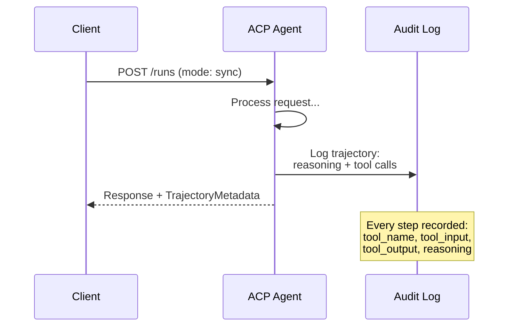

#### Agent Discovery in ACP

ACP يحدد أربع طرق للاكتشاف:

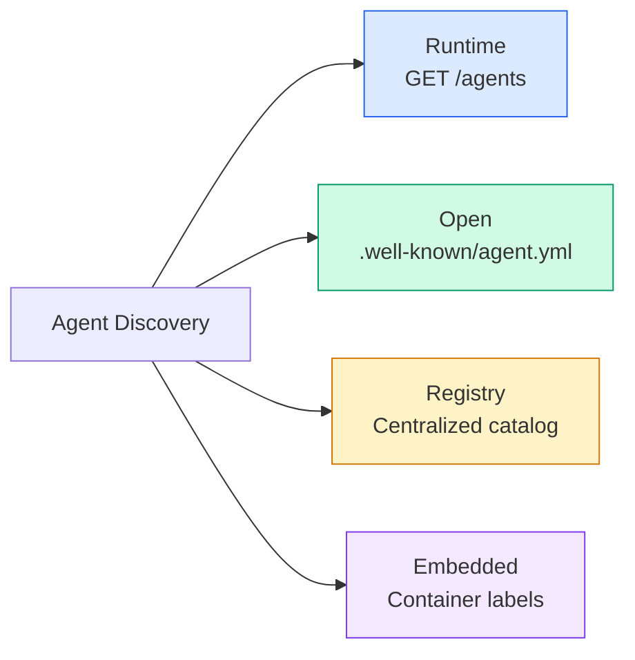

**AgentManifest** أبسط من بطاقة وكيل A2A:

```json
{
  "name": "summarizer",
  "description": "Summarizes documents with source citations",
  "input_content_types": ["text/plain", "application/pdf"],
  "output_content_types": ["text/plain", "application/json"],
  "metadata": {
    "tags": ["summarization", "RAG"],
    "framework": "BeeAI",
    "capabilities": [
      {
        "name": "Document Summarization",
        "description": "Condenses long documents into key points"
      }
    ],
    "recommended_models": ["llama3.3:70b-instruct-fp16"],
    "license": "Apache-2.0",
    "programming_language": "Python"
  }
}
```

#### Run Lifecycle

ACP يستخدم "عمليات التشغيل" بدلاً من "المهام". التشغيل هو تنفيذ وكيل بثلاثة أوضاع:

| الوضع | السلوك |
|---|---|
| `sync` | الحظر. الرد يحتوي على النتيجة الكاملة. |
| `async` | يعود 202 على الفور. استطلاع `GET /runs/{id}` للحالة. |
| `stream` | SSE تيار. تنطلق الأحداث أثناء عمل الوكيل. |

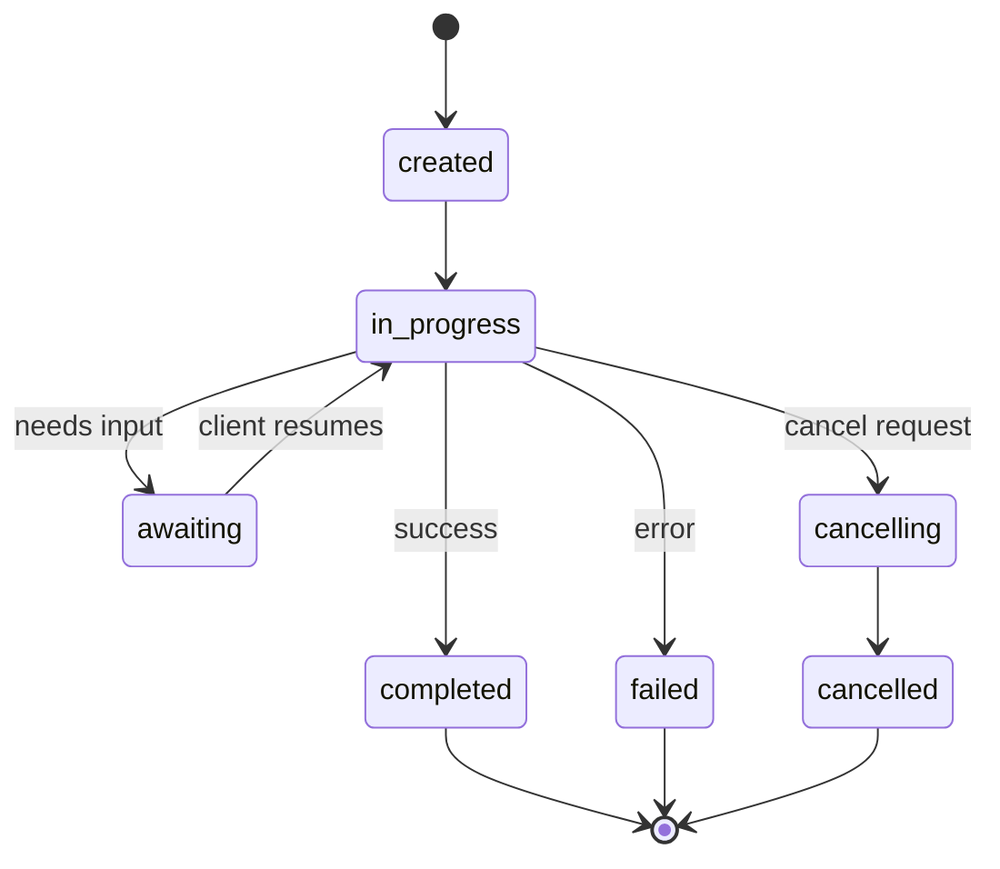

#### TrajectoryMetadata (The Audit Trail)

هذا هو الفارق الرئيسي لـ ACP. يمكن أن يتضمن كل جزء من الرسالة بيانات وصفية توضح بالضبط ما فعله الوكيل:

```json
{
  "role": "agent/researcher",
  "parts": [
    {
      "content_type": "text/plain",
      "content": "The weather in San Francisco is 72F and sunny.",
      "metadata": {
        "kind": "trajectory",
        "message": "I need to check the weather for this location",
        "tool_name": "weather_api",
        "tool_input": { "location": "San Francisco, CA" },
        "tool_output": { "temperature": 72, "condition": "sunny" }
      }
    }
  ]
}
```

بالنسبة للصناعات المنظمة، هذا هو الذهب. تأتي كل إجابة مصحوبة بسلسلة منطقية يمكن إثباتها: ما هي الأدوات التي تم استدعاؤها، وما هي المدخلات التي تم استخدامها، وما هي المخرجات التي تم تلقيها. لا يوجد صندوق أسود.

ACP يدعم أيضًا **بيانات تعريف الاقتباس** لإسناد المصدر:

```json
{
  "kind": "citation",
  "start_index": 0,
  "end_index": 47,
  "url": "https://weather.gov/sf",
  "title": "NWS San Francisco Forecast"
}
```

### ANP (Agent Network Protocol)

**تم الإنشاء بواسطة:** مجتمع مفتوح المصدر (أسسه GaoWei Chang)
**الريبو:** [github.com/agent-network-protocol/AgentNetworkProtocol](https://githubhub.com/agent-network-protocol/AgentNetworkProtocol)
**المشكلة:** كيف يثق الوكلاء من المؤسسات المختلفة ببعضهم البعض دون وجود سلطة مركزية؟

ANP هو **بروتوكول الهوية اللامركزية**. إنه يبني الثقة باستخدام W3C المعرفات اللامركزية (DIDs) والتشفير الشامل. على عكس A2A حيث تكتشف الوكلاء من خلال نقاط النهاية المعروفة، ANP يتيح للوكلاء إثبات هويتهم بطريقة مشفرة.

ANP له ثلاث طبقات:

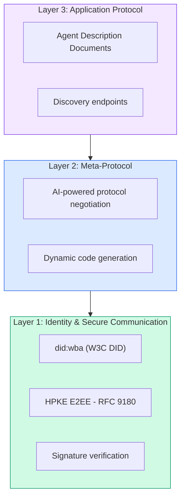

#### DID Documents (Real Structure)

يستخدم ANP طريقة DID مخصصة تسمى `did:wba` (الوكيل المستند إلى الويب). يتحول DID `did:wba:example.com:user:alice` إلى `https://example.com/user/alice/did.json`:

```json
{
  "@context": [
    "https://www.w3.org/ns/did/v1",
    "https://w3id.org/security/suites/jws-2020/v1",
    "https://w3id.org/security/suites/secp256k1-2019/v1"
  ],
  "id": "did:wba:example.com:user:alice",
  "verificationMethod": [
    {
      "id": "did:wba:example.com:user:alice#key-1",
      "type": "EcdsaSecp256k1VerificationKey2019",
      "controller": "did:wba:example.com:user:alice",
      "publicKeyJwk": {
        "crv": "secp256k1",
        "x": "NtngWpJUr-rlNNbs0u-Aa8e16OwSJu6UiFf0Rdo1oJ4",
        "y": "qN1jKupJlFsPFc1UkWinqljv4YE0mq_Ickwnjgasvmo",
        "kty": "EC"
      }
    },
    {
      "id": "did:wba:example.com:user:alice#key-x25519-1",
      "type": "X25519KeyAgreementKey2019",
      "controller": "did:wba:example.com:user:alice",
      "publicKeyMultibase": "z9hFgmPVfmBZwRvFEyniQDBkz9LmV7gDEqytWyGZLmDXE"
    }
  ],
  "authentication": [
    "did:wba:example.com:user:alice#key-1"
  ],
  "keyAgreement": [
    "did:wba:example.com:user:alice#key-x25519-1"
  ],
  "humanAuthorization": [
    "did:wba:example.com:user:alice#key-1"
  ],
  "service": [
    {
      "id": "did:wba:example.com:user:alice#agent-description",
      "type": "AgentDescription",
      "serviceEndpoint": "https://example.com/agents/alice/ad.json"
    }
  ]
}
```

الأشياء الرئيسية التي يجب ملاحظتها:
- **يتم فرض فصل المفاتيح**. مفاتيح التوقيع (secp256k1) منفصلة عن مفاتيح التشفير (X25519).
- **`humanAuthorization`** ينفرد بـ ANP. تتطلب هذه المفاتيح موافقة بشرية صريحة (البيومترية، كلمة المرور، HSM) قبل الاستخدام. تمر العمليات عالية المخاطر مثل تحويلات الأموال عبر هذا المسار.
- **`keyAgreement`** تُستخدم المفاتيح لـ HPKE التشفير الشامل (RFC 9180).
- يرتبط قسم **الخدمة** بمستند وصف الوكيل.

#### How Trust Works in ANP

ANP **لا** يستخدم الرسم البياني لشبكة الثقة أو التأييد. الثقة ثنائية ويتم التحقق منها لكل تفاعل:

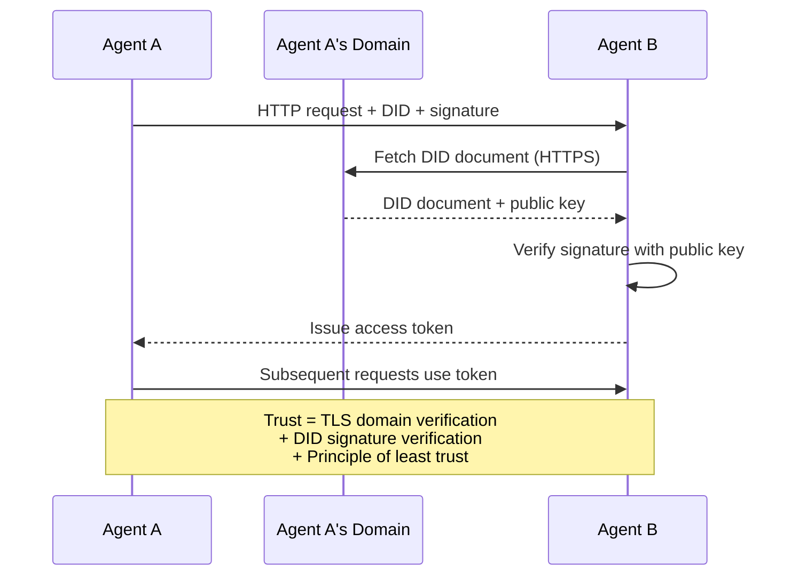

الثقة تأتي من ثلاثة مصادر:
1. ** على مستوى المجال TLS** يتحقق من مضيف المستند DID
2. **DID التوقيعات المشفرة** التحقق من هوية الوكيل
3. **مبدأ الثقة الأقل** يمنح الحد الأدنى من الأذونات فقط

لا يوجد نشر للثقة قائم على القيل والقال أو تسجيل لتصنيف الصفحات. يمكنك التحقق من كل وكيل مباشرة من خلال DID.

#### Meta-Protocol Negotiation

هذه هي الميزة الأكثر حداثة في ANP. عندما يلتقي وكيلان من أنظمة بيئية مختلفة، فإنهما لا يحتاجان إلى تنسيقات بيانات متفق عليها مسبقًا. يتفاوضون باللغة الطبيعية:

```json
{
  "action": "protocolNegotiation",
  "sequenceId": 0,
  "candidateProtocols": "I can communicate using:\n1. JSON-RPC with hotel booking schema\n2. REST with OpenAPI 3.1 spec\n3. Natural language over HTTP",
  "modificationSummary": "Initial proposal",
  "status": "negotiating"
}
```

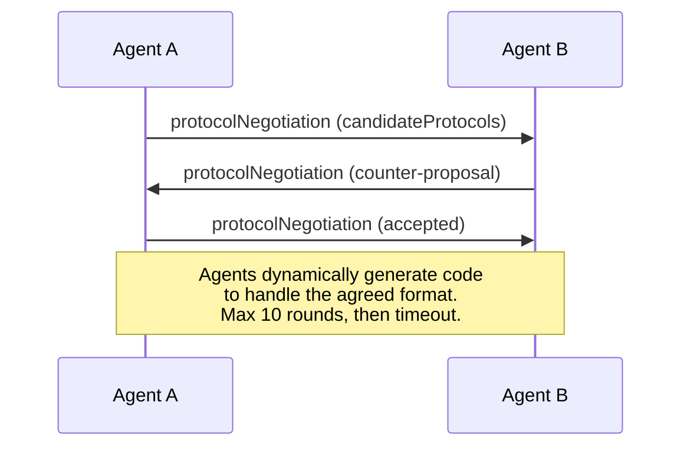

يتنقل الوكلاء ذهابًا وإيابًا (10 جولات كحد أقصى) حتى يتفقوا على التنسيق، ثم يقومون بإنشاء التعليمات البرمجية ديناميكيًا للتعامل معه. قيم الحالة: `negotiating`، `rejected`، `accepted`، `timeout`.

وهذا يعني أن عميلين لم يسبق لهما رؤية بعضهما البعض من قبل يمكنهما معرفة كيفية التواصل دون أن يقوم أي شخص بتحديد مخطط مشترك مسبقًا.

### Comparison (Corrected)

| | MCP | A2A | ACP | ANP |
|---|---|---|---|---|
| **تم الإنشاء بواسطة** | انثروبي | مؤسسة جوجل / لينكس | IBM / بي آي | المجتمع |
| **تنسيق المواصفات** | JSON - RPC | JSON-RPC / REST / جي آر بي سي | مفتوحAPI 3.1 (REST) | JSON - RPC |
| **الاستخدام الأساسي** | وكيل للأداة | وكيل إلى وكيل | وكيل إلى وكيل | وكيل إلى وكيل |
| **الاكتشاف** | قائمة الأدوات | `/.well-known/agent-card.json` | `GET /agents`، `/.well-known/agent.yml` | `/.well-known/agent-descriptions`, DID نقاط نهاية الخدمة |
| **الهوية** | ضمني (محلي) | مخططات الأمان (OAuth، mTLS) | على مستوى الخادم | W3C DID (`did:wba`) مع E2EE |
| ** مسار التدقيق ** | لا يوجد | الأساسية (سجل المهام) | بيانات المسار (استدعاءات الأدوات، الاستدلال) | غير محدد رسميًا |
| **آلة الدولة** | لا يوجد | 9 حالات مهمة | 7 حالات تشغيل | لا يوجد |
| **البث** | لا يوجد | SSE | SSE | النقل الحيادي |
| **ميزة فريدة** | مخططات الأداة | بطاقات الوكيل + المهارات | مسار تدقيق المسار | التفاوض على البروتوكول الفوقي |
| **الأفضل لـ** | الأدوات والبيانات | التعاون الديناميكي | الصناعات المنظمة | الثقة عبر المنظمات |
| **الحالة** | مستقرة | مستقر (الإصدار 1.0) | الاندماج في A2A | التنمية النشطة |

### How They Work Together

هذه البروتوكولات لا يستبعد بعضها بعضا. يستخدم نظام المؤسسة الواقعي عدة:

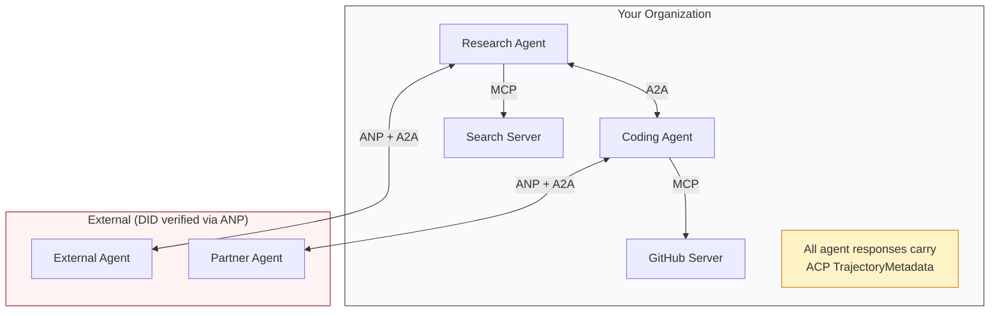

- **MCP** يربط كل وكيل بأدواته
- **A2A** يتعامل مع التعاون بين الوكلاء (الداخليين والخارجيين)
- **ACP** يلف الاستجابات في البيانات الوصفية للمسار من أجل إمكانية التدقيق
- **ANP** يوفر التحقق من هوية الوكلاء الذين لا تتحكم بهم

## Build It

### Step 1: Core Message Types

يبدأ كل نظام متعدد الوكلاء بتنسيق رسالة. نحدد الأنواع التي تحدد ما تستخدمه البروتوكولات الحقيقية:

```typescript
import crypto from "node:crypto";

type MessageRole = "user" | "agent";

type MessagePart =
  | { kind: "text"; text: string }
  | { kind: "data"; data: unknown; mediaType: string }
  | { kind: "file"; name: string; url: string; mediaType: string };

type TrajectoryEntry = {
  reasoning: string;
  toolName?: string;
  toolInput?: unknown;
  toolOutput?: unknown;
  timestamp: number;
};

type AgentMessage = {
  id: string;
  role: MessageRole;
  parts: MessagePart[];
  trajectory?: TrajectoryEntry[];
  replyTo?: string;
  timestamp: number;
};

function createMessage(
  role: MessageRole,
  parts: MessagePart[],
  replyTo?: string
): AgentMessage {
  return {
    id: crypto.randomUUID(),
    role,
    parts,
    replyTo,
    timestamp: Date.now(),
  };
}

function textMessage(role: MessageRole, text: string): AgentMessage {
  return createMessage(role, [{ kind: "text", text }]);
}
```

ملاحظة: `MessagePart` متعدد الوسائط (نص، بيانات منظمة، ملفات) تمامًا مثل المواصفات الحقيقية A2A وACP. `TrajectoryEntry` يلتقط سلسلة الاستدلال، ويطابق بيانات تعريف المسار الخاصة بـ ACP.

### Step 2: A2A Agent Card and Registry

بناء اكتشاف الوكيل الذي يطابق المواصفات الحقيقية A2A:

```typescript
type Skill = {
  id: string;
  name: string;
  description: string;
  tags: string[];
  inputModes: string[];
  outputModes: string[];
};

type AgentCard = {
  name: string;
  description: string;
  version: string;
  url: string;
  capabilities: {
    streaming: boolean;
    pushNotifications: boolean;
  };
  defaultInputModes: string[];
  defaultOutputModes: string[];
  skills: Skill[];
};

class AgentRegistry {
  private cards: Map<string, AgentCard> = new Map();

  register(card: AgentCard) {
    this.cards.set(card.name, card);
  }

  discoverBySkillTag(tag: string): AgentCard[] {
    return [...this.cards.values()].filter((card) =>
      card.skills.some((skill) => skill.tags.includes(tag))
    );
  }

  discoverByInputMode(mimeType: string): AgentCard[] {
    return [...this.cards.values()].filter(
      (card) =>
        card.defaultInputModes.includes(mimeType) ||
        card.skills.some((skill) => skill.inputModes.includes(mimeType))
    );
  }

  resolve(name: string): AgentCard | undefined {
    return this.cards.get(name);
  }

  listAll(): AgentCard[] {
    return [...this.cards.values()];
  }
}
```

وهذا أكثر ثراءً إلى حد كبير من خريطة الاسم إلى القدرة البسيطة. يمكنك اكتشاف الوكلاء من خلال علامات المهارة، أو من خلال أنواع الإدخال MIME، أو بالاسم، تمامًا كما تدعم المواصفات A2A الحقيقية.

### Step 3: A2A Task Lifecycle

بناء آلة حالة المهمة الكاملة:

```typescript
type TaskState =
  | "submitted"
  | "working"
  | "input-required"
  | "auth-required"
  | "completed"
  | "failed"
  | "canceled"
  | "rejected";

const TERMINAL_STATES: TaskState[] = [
  "completed",
  "failed",
  "canceled",
  "rejected",
];

type TaskStatus = {
  state: TaskState;
  message?: AgentMessage;
  timestamp: number;
};

type Artifact = {
  id: string;
  name: string;
  parts: MessagePart[];
};

type Task = {
  id: string;
  contextId: string;
  status: TaskStatus;
  artifacts: Artifact[];
  history: AgentMessage[];
};

type TaskEvent =
  | { kind: "statusUpdate"; taskId: string; status: TaskStatus }
  | {
      kind: "artifactUpdate";
      taskId: string;
      artifact: Artifact;
      append: boolean;
      lastChunk: boolean;
    };

type TaskHandler = (
  task: Task,
  message: AgentMessage
) => AsyncGenerator<TaskEvent>;

class TaskManager {
  private tasks: Map<string, Task> = new Map();
  private handlers: Map<string, TaskHandler> = new Map();
  private listeners: Map<string, ((event: TaskEvent) => void)[]> = new Map();

  registerHandler(agentName: string, handler: TaskHandler) {
    this.handlers.set(agentName, handler);
  }

  subscribe(taskId: string, listener: (event: TaskEvent) => void) {
    const existing = this.listeners.get(taskId) ?? [];
    existing.push(listener);
    this.listeners.set(taskId, existing);
  }

  async sendMessage(
    agentName: string,
    message: AgentMessage,
    contextId?: string
  ): Promise<Task> {
    const handler = this.handlers.get(agentName);
    if (!handler) {
      const task = this.createTask(contextId);
      task.status = {
        state: "rejected",
        timestamp: Date.now(),
        message: textMessage("agent", `No handler for ${agentName}`),
      };
      return task;
    }

    const task = this.createTask(contextId);
    task.history.push(message);
    task.status = { state: "submitted", timestamp: Date.now() };

    this.processTask(task, handler, message).catch((err) => {
      task.status = {
        state: "failed",
        timestamp: Date.now(),
        message: textMessage("agent", String(err)),
      };
    });
    return task;
  }

  getTask(taskId: string): Task | undefined {
    return this.tasks.get(taskId);
  }

  cancelTask(taskId: string): boolean {
    const task = this.tasks.get(taskId);
    if (!task || TERMINAL_STATES.includes(task.status.state)) return false;
    task.status = { state: "canceled", timestamp: Date.now() };
    this.emit(taskId, {
      kind: "statusUpdate",
      taskId,
      status: task.status,
    });
    return true;
  }

  private createTask(contextId?: string): Task {
    const task: Task = {
      id: crypto.randomUUID(),
      contextId: contextId ?? crypto.randomUUID(),
      status: { state: "submitted", timestamp: Date.now() },
      artifacts: [],
      history: [],
    };
    this.tasks.set(task.id, task);
    return task;
  }

  private async processTask(
    task: Task,
    handler: TaskHandler,
    message: AgentMessage
  ) {
    task.status = { state: "working", timestamp: Date.now() };
    this.emit(task.id, {
      kind: "statusUpdate",
      taskId: task.id,
      status: task.status,
    });

    try {
      for await (const event of handler(task, message)) {
        if (TERMINAL_STATES.includes(task.status.state)) break;

        if (event.kind === "statusUpdate") {
          task.status = event.status;
        }
        if (event.kind === "artifactUpdate") {
          const existing = task.artifacts.find(
            (a) => a.id === event.artifact.id
          );
          if (existing && event.append) {
            existing.parts.push(...event.artifact.parts);
          } else {
            task.artifacts.push(event.artifact);
          }
        }
        this.emit(task.id, event);
      }
    } catch (err) {
      task.status = {
        state: "failed",
        timestamp: Date.now(),
        message: textMessage("agent", String(err)),
      };
      this.emit(task.id, {
        kind: "statusUpdate",
        taskId: task.id,
        status: task.status,
      });
    }
  }

  private emit(taskId: string, event: TaskEvent) {
    for (const listener of this.listeners.get(taskId) ?? []) {
      listener(event);
    }
  }
}
```

يؤدي هذا إلى تنفيذ دورة حياة المهمة A2A الحقيقية: الحالات المقدمة، والعمل، والمدخلات المطلوبة، والحالات الطرفية. المعالجات عبارة عن مولدات غير متزامنة تنتج أحداثًا (تحديثات الحالة وأجزاء القطع الأثرية) المطابقة لنموذج البث SSE.

### Step 4: ACP-Style Audit Trail

التفاف الاتصالات مع تتبع المسار:

```typescript
type AuditEntry = {
  runId: string;
  agentName: string;
  input: AgentMessage[];
  output: AgentMessage[];
  trajectory: TrajectoryEntry[];
  status: "created" | "in-progress" | "completed" | "failed" | "awaiting";
  startedAt: number;
  completedAt?: number;
  sessionId?: string;
};

class AuditableRunner {
  private log: AuditEntry[] = [];
  private handlers: Map<
    string,
    (input: AgentMessage[]) => Promise<{
      output: AgentMessage[];
      trajectory: TrajectoryEntry[];
    }>
  > = new Map();

  registerAgent(
    name: string,
    handler: (input: AgentMessage[]) => Promise<{
      output: AgentMessage[];
      trajectory: TrajectoryEntry[];
    }>
  ) {
    this.handlers.set(name, handler);
  }

  async run(
    agentName: string,
    input: AgentMessage[],
    sessionId?: string
  ): Promise<AuditEntry> {
    const entry: AuditEntry = {
      runId: crypto.randomUUID(),
      agentName,
      input: structuredClone(input),
      output: [],
      trajectory: [],
      status: "created",
      startedAt: Date.now(),
      sessionId,
    };
    this.log.push(entry);

    const handler = this.handlers.get(agentName);
    if (!handler) {
      entry.status = "failed";
      return entry;
    }

    entry.status = "in-progress";
    try {
      const result = await handler(input);
      entry.output = structuredClone(result.output);
      entry.trajectory = structuredClone(result.trajectory);
      entry.status = "completed";
      entry.completedAt = Date.now();
    } catch (err) {
      entry.status = "failed";
      entry.trajectory.push({
        reasoning: `Error: ${String(err)}`,
        timestamp: Date.now(),
      });
      entry.completedAt = Date.now();
    }
    return entry;
  }

  getFullAuditLog(): AuditEntry[] {
    return structuredClone(this.log);
  }

  getAuditLogForAgent(agentName: string): AuditEntry[] {
    return structuredClone(
      this.log.filter((e) => e.agentName === agentName)
    );
  }

  getAuditLogForSession(sessionId: string): AuditEntry[] {
    return structuredClone(
      this.log.filter((e) => e.sessionId === sessionId)
    );
  }

  getTrajectoryForRun(runId: string): TrajectoryEntry[] {
    const entry = this.log.find((e) => e.runId === runId);
    return entry ? structuredClone(entry.trajectory) : [];
  }
}
```

ينتج عن كل تنفيذ من قبل الوكيل إدخال تدقيق كامل: ما تم إدخاله، وما تم إصداره، والمسار الكامل لاستدعاءات الأداة وخطوات الاستدلال بينهما. يمكنك الاستعلام حسب الوكيل أو الجلسة أو التشغيل الفردي.

### Step 5: ANP-Style Identity Verification

بناء الهوية والتحقق على أساس DID:

```typescript
type VerificationMethod = {
  id: string;
  type: string;
  controller: string;
  publicKeyDer: string;
};

type DIDDocument = {
  id: string;
  verificationMethod: VerificationMethod[];
  authentication: string[];
  keyAgreement: string[];
  humanAuthorization: string[];
  service: { id: string; type: string; serviceEndpoint: string }[];
};

type AgentIdentity = {
  did: string;
  document: DIDDocument;
  privateKey: crypto.KeyObject;
  publicKey: crypto.KeyObject;
};

class IdentityRegistry {
  private documents: Map<string, DIDDocument> = new Map();

  publish(doc: DIDDocument) {
    this.documents.set(doc.id, doc);
  }

  resolve(did: string): DIDDocument | undefined {
    return this.documents.get(did);
  }

  verify(did: string, signature: string, payload: string): boolean {
    const doc = this.documents.get(did);
    if (!doc) return false;

    const authKeyIds = doc.authentication;
    const authKeys = doc.verificationMethod.filter((vm) =>
      authKeyIds.includes(vm.id)
    );

    for (const key of authKeys) {
      const publicKey = crypto.createPublicKey({
        key: Buffer.from(key.publicKeyDer, "base64"),
        format: "der",
        type: "spki",
      });
      const isValid = crypto.verify(
        null,
        Buffer.from(payload),
        publicKey,
        Buffer.from(signature, "hex")
      );
      if (isValid) return true;
    }
    return false;
  }

  requiresHumanAuth(did: string, operationKeyId: string): boolean {
    const doc = this.documents.get(did);
    if (!doc) return false;
    return doc.humanAuthorization.includes(operationKeyId);
  }
}

function createIdentity(domain: string, agentName: string): AgentIdentity {
  const did = `did:wba:${domain}:agent:${agentName}`;
  const { publicKey, privateKey } = crypto.generateKeyPairSync("ed25519");

  const publicKeyDer = publicKey
    .export({ format: "der", type: "spki" })
    .toString("base64");

  const keyId = `${did}#key-1`;
  const encKeyId = `${did}#key-x25519-1`;

  const document: DIDDocument = {
    id: did,
    verificationMethod: [
      {
        id: keyId,
        type: "Ed25519VerificationKey2020",
        controller: did,
        publicKeyDer,
      },
      {
        id: encKeyId,
        type: "X25519KeyAgreementKey2019",
        controller: did,
        publicKeyDer,
      },
    ],
    authentication: [keyId],
    keyAgreement: [encKeyId],
    humanAuthorization: [],
    service: [
      {
        id: `${did}#agent-description`,
        type: "AgentDescription",
        serviceEndpoint: `https://${domain}/agents/${agentName}/ad.json`,
      },
    ],
  };

  return { did, document, privateKey, publicKey };
}

function signPayload(identity: AgentIdentity, payload: string): string {
  return crypto
    .sign(null, Buffer.from(payload), identity.privateKey)
    .toString("hex");
}
```

يعكس هذا نموذج الهوية ANP الحقيقي: يمتلك الوكلاء DID مستندات ذات مصادقة منفصلة واتفاقية رئيسية ومفاتيح تفويض بشرية. يحاكي `IdentityRegistry` الدقة DID (في الإنتاج سيكون هذا HTTP يجلب إلى مجال الوكيل).

### Step 6: Protocol Gateway

ربط جميع البروتوكولات الأربعة في نظام موحد:

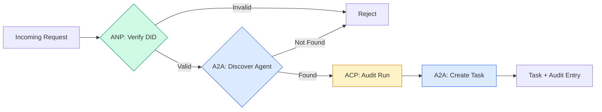

```typescript
class ProtocolGateway {
  private registry: AgentRegistry;
  private taskManager: TaskManager;
  private auditRunner: AuditableRunner;
  private identityRegistry: IdentityRegistry;

  constructor(
    registry: AgentRegistry,
    taskManager: TaskManager,
    auditRunner: AuditableRunner,
    identityRegistry: IdentityRegistry
  ) {
    this.registry = registry;
    this.taskManager = taskManager;
    this.auditRunner = auditRunner;
    this.identityRegistry = identityRegistry;
  }

  async delegateTask(
    fromDid: string,
    signature: string,
    targetAgent: string,
    message: AgentMessage,
    sessionId?: string
  ): Promise<{ task: Task; audit: AuditEntry } | { error: string }> {
    if (!this.identityRegistry.verify(fromDid, signature, message.id)) {
      return { error: "Identity verification failed" };
    }

    const card = this.registry.resolve(targetAgent);
    if (!card) {
      return { error: `Agent ${targetAgent} not found in registry` };
    }

    const audit = await this.auditRunner.run(
      targetAgent,
      [message],
      sessionId
    );
    const task = await this.taskManager.sendMessage(targetAgent, message);

    return { task, audit };
  }

  discoverAndDelegate(
    fromDid: string,
    signature: string,
    skillTag: string,
    message: AgentMessage
  ): Promise<{ task: Task; audit: AuditEntry } | { error: string }> {
    const candidates = this.registry.discoverBySkillTag(skillTag);
    if (candidates.length === 0) {
      return Promise.resolve({
        error: `No agents found with skill tag: ${skillTag}`,
      });
    }
    return this.delegateTask(
      fromDid,
      signature,
      candidates[0].name,
      message
    );
  }
}
```

تقوم البوابة بأربعة أشياء في مكالمة واحدة:
1. **ANP**: التحقق من هوية المتصل عبر التوقيع DID
2. **A2A**: يكتشف العميل المستهدف ويتحقق من قدراته
3. **ACP**: يلتف التنفيذ في مسار التدقيق مع المسار
4. **A2A**: إنشاء مهمة مع تتبع دورة الحياة الكاملة

### Step 7: Wire It All Together

```typescript
async function protocolDemo() {
  const registry = new AgentRegistry();
  registry.register({
    name: "researcher",
    description: "Searches and summarizes findings",
    version: "1.0.0",
    url: "https://researcher.local/a2a/v1",
    capabilities: { streaming: true, pushNotifications: false },
    defaultInputModes: ["text/plain"],
    defaultOutputModes: ["text/plain", "application/json"],
    skills: [
      {
        id: "web-research",
        name: "Web Research",
        description: "Searches the web",
        tags: ["research", "search", "summarization"],
        inputModes: ["text/plain"],
        outputModes: ["application/json"],
      },
    ],
  });
  registry.register({
    name: "coder",
    description: "Writes code from specs",
    version: "1.0.0",
    url: "https://coder.local/a2a/v1",
    capabilities: { streaming: false, pushNotifications: false },
    defaultInputModes: ["text/plain", "application/json"],
    defaultOutputModes: ["text/plain"],
    skills: [
      {
        id: "code-gen",
        name: "Code Generation",
        description: "Generates code",
        tags: ["coding", "generation"],
        inputModes: ["text/plain", "application/json"],
        outputModes: ["text/plain"],
      },
    ],
  });

  const taskManager = new TaskManager();
  const auditRunner = new AuditableRunner();

  const researchTrajectory: TrajectoryEntry[] = [];

  taskManager.registerHandler(
    "researcher",
    async function* (task, message) {
      yield {
        kind: "statusUpdate" as const,
        taskId: task.id,
        status: { state: "working" as const, timestamp: Date.now() },
      };

      researchTrajectory.push({
        reasoning: "Searching for React 19 documentation",
        toolName: "web_search",
        toolInput: { query: "React 19 compiler features" },
        toolOutput: {
          results: ["react.dev/blog/react-19", "github.com/react/react"],
        },
        timestamp: Date.now(),
      });

      researchTrajectory.push({
        reasoning: "Extracting key findings from search results",
        toolName: "doc_analysis",
        toolInput: { url: "react.dev/blog/react-19" },
        toolOutput: {
          summary:
            "React 19 compiler auto-memoizes, no manual useMemo needed",
        },
        timestamp: Date.now(),
      });

      yield {
        kind: "artifactUpdate" as const,
        taskId: task.id,
        artifact: {
          id: crypto.randomUUID(),
          name: "research-results",
          parts: [
            {
              kind: "data" as const,
              data: {
                findings: [
                  "React 19 compiler auto-memoizes components",
                  "No more manual useMemo/useCallback needed",
                  "Compiler runs at build time, not runtime",
                ],
                sources: ["react.dev/blog/react-19"],
              },
              mediaType: "application/json",
            },
          ],
        },
        append: false,
        lastChunk: true,
      };

      yield {
        kind: "statusUpdate" as const,
        taskId: task.id,
        status: { state: "completed" as const, timestamp: Date.now() },
      };
    }
  );

  auditRunner.registerAgent("researcher", async () => ({
    output: [
      textMessage("agent", "React 19 compiler auto-memoizes components"),
    ],
    trajectory: researchTrajectory,
  }));

  const identityRegistry = new IdentityRegistry();

  const coderIdentity = createIdentity("coder.local", "coder");
  const researcherIdentity = createIdentity("researcher.local", "researcher");

  identityRegistry.publish(coderIdentity.document);
  identityRegistry.publish(researcherIdentity.document);

  const gateway = new ProtocolGateway(
    registry,
    taskManager,
    auditRunner,
    identityRegistry
  );

  console.log("=== Protocol Demo ===\n");

  console.log("1. Agent Discovery (A2A)");
  const researchAgents = registry.discoverBySkillTag("research");
  console.log(
    `   Found ${researchAgents.length} agent(s):`,
    researchAgents.map((a) => a.name)
  );

  console.log("\n2. Identity Verification (ANP)");
  const message = textMessage("user", "Research React 19 compiler features");
  const signature = signPayload(coderIdentity, message.id);
  const verified = identityRegistry.verify(
    coderIdentity.did,
    signature,
    message.id
  );
  console.log(`   Coder DID: ${coderIdentity.did}`);
  console.log(`   Signature verified: ${verified}`);

  console.log("\n3. Task Delegation (A2A + ACP + ANP)");
  const result = await gateway.delegateTask(
    coderIdentity.did,
    signature,
    "researcher",
    message,
    "session-001"
  );

  if ("error" in result) {
    console.log(`   Error: ${result.error}`);
    return;
  }

  console.log(`   Task ID: ${result.task.id}`);
  console.log(`   Task state: ${result.task.status.state}`);
  console.log(`   Artifacts: ${result.task.artifacts.length}`);

  console.log("\n4. Audit Trail (ACP)");
  console.log(`   Run ID: ${result.audit.runId}`);
  console.log(`   Status: ${result.audit.status}`);
  console.log(`   Trajectory steps: ${result.audit.trajectory.length}`);
  for (const step of result.audit.trajectory) {
    console.log(`     - ${step.reasoning}`);
    if (step.toolName) {
      console.log(`       Tool: ${step.toolName}`);
    }
  }

  console.log("\n5. Full Audit Log");
  const fullLog = auditRunner.getFullAuditLog();
  console.log(`   Total runs: ${fullLog.length}`);
  for (const entry of fullLog) {
    const duration = entry.completedAt
      ? `${entry.completedAt - entry.startedAt}ms`
      : "in-progress";
    console.log(`   ${entry.agentName}: ${entry.status} (${duration})`);
  }
}

protocolDemo().catch((err) => {
  console.error("Protocol demo failed:", err);
  process.exitCode = 1;
});
```

## What Goes Wrong

البروتوكولات تحل المسار السعيد. وهنا ما يكسر في الإنتاج:

**انحراف المخطط.** ينشر الوكيل أ مخرجات إعلان بطاقة الوكيل `application/json`. لكن مخطط JSON يتغير بين الإصدارات. يقوم العميل B بتوزيع التنسيق القديم ويحصل على البيانات المهملة. الإصلاح: قم بإصدار مهاراتك ومخططات الإخراج. تدعم المواصفات A2A `version` على بطاقات الوكيل لهذا السبب.

**انتهاكات جهاز الحالة.** يُنتج معالج الوكيل حدث `completed`، ثم يحاول إنتاج المزيد من العناصر. المهمة غير قابلة للتغيير. يقوم الكود الخاص بك بإسقاط التحديثات أو الرميات بصمت. الإصلاح: التحقق من الحالة الطرفية قبل الخضوع. يفرض `TaskManager` أعلاه هذا من خلال `break` بعد الحالات الطرفية.

**فشل تحليل الثقة.** يحاول الوكيل "أ" التحقق من DID الخاص بالوكيل "ب"، لكن مجال الوكيل "ب" معطل. لا يمكن جلب المستند DID. هل تفشل في الانفتاح (قبول الوكلاء الذين لم يتم التحقق منهم) أم تفشل في الغلق (رفض كل شيء)؟ ANP يوصي بالفشل مغلقًا بمبدأ أقل قدر من الثقة.

**انتفاخ المسار.** ACP تسجيل المسار قوي ولكنه مكلف. وكيل معقد يقوم بإجراء makes 200 استدعاء للأداة لكل تشغيل ينتج إدخالات تدقيق ضخمة. الإصلاح: تسجيل المسار بمستويات إسهاب قابلة للتكوين. قم بتسجيل أسماء الأدوات وIO للامتثال، وتخطى خطوات التفكير المنطقي لأحمال العمل غير المنظمة.

**اكتشف القطيع الهادر.** يقوم 50 وكيلًا بالاستعلام عن `GET /agents` في نفس الوقت عند بدء التشغيل. الإصلاح: قم بتخزين بطاقات الوكيل باستخدام TTL، أو فترات الاكتشاف المتدرجة، أو استخدم التسجيل القائم على الدفع بدلاً من الاقتراع.

## Use It

### Real Implementations

**A2A** هو الأكثر نضجاً. [المواصفات الرسمية](https://githubhub.com/google/A2A)) من Google مفتوحة المصدر ضمن Linux Foundation. حزم SDK لـ Python وTypeScript. إذا كان وكلاؤك بحاجة إلى اكتشاف ديناميكي وتعاون، فابدأ هنا.

**ACP** يتم الدمج في A2A. IBM's [BeeAI project](https://github.com/i-am-bee/acp) created ACP as a REST-first alternative, but the trajectory metadata concept is being absorbed into the A2A ecosystem. Use ACP patterns (trajectory logging, run lifecycle) حتى لو كنت تستخدم A2A كوسيلة نقل.

**ANP** هو الأكثر تجريبية. [community repo](https://github.com/agent-network-protocol/AgentNetworkProtocol) has a Python SDK (AgentConnect). إن مفهوم التفاوض على البروتوكول الفوقي هو مفهوم جديد حقاً. يستحق المشاهدة لعمليات نشر الوكلاء عبر المنظمات.

**MCP** تمت تغطيته بالفعل في المرحلة 13. إذا كنت تريد من الوكلاء استخدام الأدوات، فإن MCP هو المعيار.

### Picking the Right Protocol

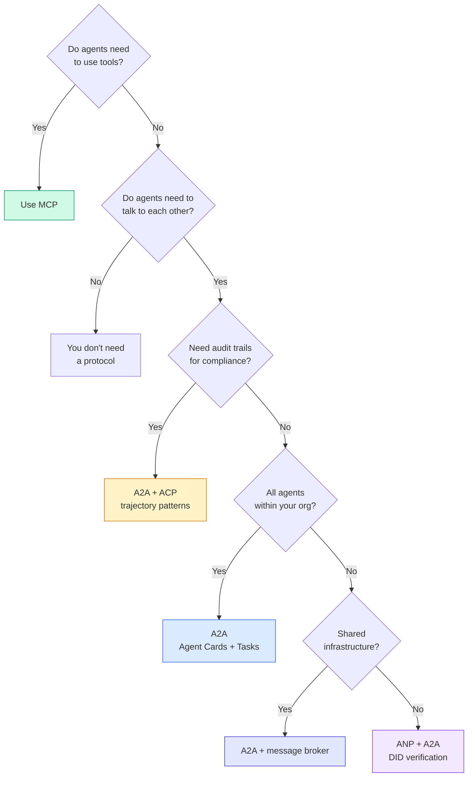

## Ship It

ينتج هذا الدرس:
- `code/main.ts` -- التنفيذ الكامل لأنماط البروتوكول الأربعة
- `outputs/prompt-protocol-selector.md` -- مطالبة تساعدك على اختيار البروتوكولات لنظامك

## Exercises

1. **تفويض المهام متعدد القفزات.** قم بتوسيع `TaskManager` حتى يتمكن معالج الوكيل من تفويض المهام الفرعية إلى وكلاء آخرين. يتلقى الباحث مهمة، ويقوم بتفويض "البحث" و"تلخيص" المهام الفرعية إلى اثنين من الوكلاء المتخصصين، وينتظر حتى يكتمل كلاهما، ثم يدمج النتائج في أعماله الفنية الخاصة.

2. **مسار تدقيق البث.** قم بتعديل `AuditableRunner` لدعم وضع البث. بدلاً من انتظار النتيجة الكاملة، قم بإنتاج تحديثات `AuditEntry` في الوقت الفعلي عند إضافة إدخالات المسار. استخدم منشئًا غير متزامن ينتج لقطات تدقيق.

3. **DID دوران.** أضف دوران المفتاح إلى `IdentityRegistry`. يجب أن يكون الوكيل قادرًا على نشر مستند DID جديد بمفاتيح محدثة مع الاحتفاظ بمرجع `previousDid`. يجب أن يقبل القائمون على التحقق التوقيعات من كل من المفتاح الحالي والسابق خلال فترة السماح.

4. **التفاوض على البروتوكول.** تنفيذ مفهوم البروتوكول الفوقي الخاص بـ ANP. يتبادل وكيلان رسائل `protocolNegotiation` بتنسيقات مرشحة (على سبيل المثال، "أستطيع التحدث JSON-RPC" مقابل "أفضل REST"). بعد 3 جولات كحد أقصى، يتفقون على التنسيق أو المهلة. يحدد التنسيق المتفق عليه أي `TaskManager` أو `AuditableRunner` يستخدمونه.

5. **الاكتشاف محدود السعر.** أضف غلاف `RateLimitedRegistry` يقوم بتخزين عمليات البحث عن بطاقة الوكيل مؤقتًا باستخدام TTL قابل للتكوين ويحد من استعلامات الاكتشاف لكل وكيل في الثانية. قم بمحاكاة قطيع مدوٍ مكون من 100 عميل يكتشفون بعضهم البعض عند بدء التشغيل وقياس الفرق.

## Key Terms

| مصطلح | ماذا يقول الناس | ماذا يعني في الواقع |
|------|----------------|----------------------|
| MCP | "بروتوكول أدوات AI" | بروتوكول خادم العميل للوكلاء لاكتشاف الأدوات واستخدامها. من وكيل إلى أداة، وليس من وكيل إلى وكيل. |
| A2A | "بروتوكول وكيل Google" | بروتوكول نظير إلى نظير لتعاون الوكلاء ضمن Linux Foundation. الاكتشاف عبر بطاقات الوكيل، دورة حياة مهمة مكونة من 9 حالات، البث عبر SSE. يدعم روابط JSON-RPC وREST وgRPC. |
| ACP | "مراسلة وكيل المؤسسة" | IBM/BeeAI's REST API لتشغيل الوكيل باستخدام TrajectoryMetadata: كل استجابة تحمل السلسلة الكاملة من الاستدلال واستدعاءات الأداة. الاندماج في A2A. |
| ANP | "هوية الوكيل اللامركزية" | بروتوكول مجتمع يستخدم `did:wba` (DID) لهوية التشفير، HPKE لـ E2EE، وAI تفاوض البروتوكول التعريفي للوكلاء الذين لم يروا بعضهم البعض من قبل. |
| بطاقة الوكيل | "بطاقة عمل الوكيل" | وثيقة JSON في `/.well-known/agent-card.json` تصف المهارات، وأنواع MIME المدعومة، وأنظمة الأمان، وارتباطات البروتوكول. |
| DID | "لا مركزية ID" | W3C معيار للهويات التي يمكن التحقق منها بالتشفير والمستضافة على المجال الخاص بالوكيل. ANP يستخدم طريقة `did:wba`. |
| بيانات تعريف المسار | "إيصال التدقيق" | آلية ACP لإرفاق خطوات الاستدلال واستدعاءات الأدوات ومدخلاتها/مخرجاتها لكل استجابة من الوكيل. |
| البروتوكول الفوقي | "الوكلاء يتفاوضون حول كيفية التحدث" | نهج ANP حيث يستخدم الوكلاء اللغة الطبيعية للاتفاق ديناميكيًا على تنسيقات البيانات، ثم إنشاء تعليمات برمجية للتعامل معها. |
| مهمة | "وحدة عمل" | A2A عمل تتبع الكائن من التقديم حتى الاكتمال. غير قابل للتغيير مرة واحدة المحطة. |

## Further Reading

- [Google A2A specification](https://github.com/google/A2A) -- official spec and SDKs (v1.0.0, Linux Foundation)
- [IBM/BeeAI ACP specification](https://github.com/i-am-bee/acp) -- OpenOpenAPI 3.1 spec for agent runs and trajectory metadata
- [Agent Network Protocol](https://github.com/agent-network-protocol/AgentNetworkProtocol) -- DID-based identity, E2EE, meta-protocol negotiation
- [Model Context Protocol docs](https://modelcontextprotocol.io/) -- Anthropic's MCP specification (covered in Phase 13)
- [W3C Decentralized Identifiers](https://www.w3.org/TR/did-core/) -- the identity standard underpinning ANP
- [RFC 9180 (HPKE)](https://www.rfc-editor.org/rfc/rfc9180) -- نظام التشفير ANP يستخدم لـ E2EE
- [FIPA لغة تواصل الوكيل](http://www.fipa.org/specs/fipa00061/SC00061G.html) -- التمهيد الأكاديمي لبروتوكولات الوكلاء الحديثة
