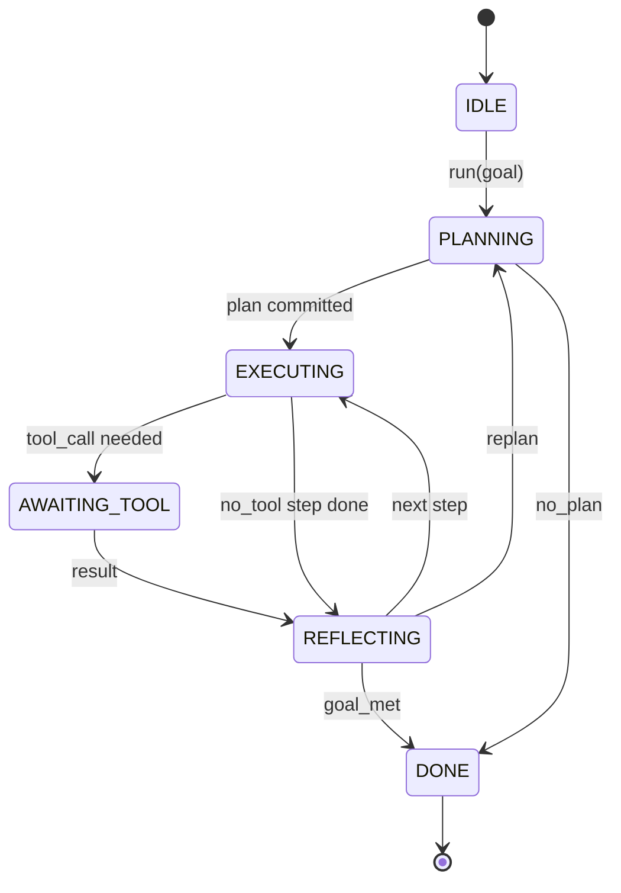

# Agent Harness Loop Contract

> التسخير هو الوكيل. النموذج عبارة عن معالج مساعد. يقوم هذا الدرس بتجميد العقد الحلقي الذي يمكنك توصيل أي نموذج به.

**النوع:** بناء
** اللغات: ** بايثون
**المتطلبات الأساسية:** المرحلة 13 دروس 01-07، المرحلة 14 الدرس 01
**الوقت:** ~90 دقيقة

## Learning Objectives
- Specify an agent harness loop as a deterministic state machine with explicit transitions.
- Implement ten lifecycle hook topics that operators wire policy, telemetry, and guardrails into.
- Define two pull points where the loop yields control back to the caller and resumes on a fresh input.
- Enforce per-session budgets (turns, tool calls, wall-clock) without leaking partial state on exceeding.
- Emit a typed stream of eleven event types so downstream UIs and tracers can subscribe without inspecting the loop directly.

## The frame

وكيل الترميز الذي يعمل دون مراقبة لمدة أربعين دورة ليس حلقة محادثة. إنها آلة حالة يمكن للمشغل اعتراضها node ويمكن للمشغل تدقيق حوافها. بمجرد كتابة العقد، يتوقف تبادل النماذج أو الأدوات أو السياسات عن كونه عامل إعادة بناء. يصبح مكالمة التسجيل.

هذا الدرس يبني هذا العقد. نقوم بتسمية ست حالات، وعشرة مواضيع ربط، ونقطتي جذب، وأحد عشر نوعًا من الأحداث، ومظروف الميزانية. كل شيء آخر في الحزام (تسجيل الأداة، JSON-RPC النقل، المرسل، المخطط) يتم توصيله بهذا الشكل.

## The states

تحتوي الحلقة على ست حالات. خمسة نشطة. واحد هو المحطة.



`IDLE` هي نقطة الدخول القانونية الوحيدة. `DONE` هو المخرج القانوني الوحيد. `AWAITING_TOOL` هي الحالة الوحيدة التي تنتج نقطة سحب. كل انتقال آخر هو داخلي.

آلة الدولة حتمية. وبالنظر إلى نفس سجل الأحداث، يدخل الحزام مرة أخرى إلى نفس الحالة. هذه الخاصية هي ما يتيح لك إعادة تشغيل جلسات التصحيح دون إعادة استدعاء النموذج.

## The hook topics

الخطافات هي خط التماس للمشغل في الحلقة. يطلق الحزام عشرة مواضيع. كل موضوع يقبل أي عدد من المشتركين. المشتركين النار في ترتيب التسجيل. يمكن للمشترك تعديل الحمولة أو رفعها لإلغاء الدور أو إعادة الحارس لتخطي الخطوة التالية.

```text
before_plan         after_plan
before_tool_call    after_tool_call
before_step         after_step
on_error
on_pause
on_budget_exceeded
on_complete
```

يعكس الشكل ما تقارب عليه كل من Claude Code وCursor وOpenCode بحلول منتصف عام 2025. الأسماء وظيفية وليست ذات علامات تجارية. الخطاف الذي يمنع `rm -rf` يعيش في `before_tool_call`. الخطاف الذي يشحن مدى OpenTelemetry موجود في `after_step`. الخطاف الذي يتم استئنافه في الجلسة المتوقفة مؤقتًا موجود في `on_pause`.

## The pull points

الحلقة تعطي التحكم مرتين. أولاً في `AWAITING_TOOL` عندما لا يمكن make التقدم بدون نتيجة الأداة. الثانية في `on_pause` عند استنفاد الميزانية أو عندما يطلب الخطاف صراحةً المراجعة البشرية.

نقطة الجذب ليست استثناء. إنها عودة. يقوم المتصل بفحص حالة مجموعة الأدوات، ويجلب كل ما يطلبه مجموعة الأدوات، ويتصل بـ `resume(payload)`. الحزام يلتقط حيث توقف. هذا هو نفس شكل مولد بايثون. النقل عبر نقطة السحب هو اختيارك. في TUI يتم الضغط على المفتاح. أكثر من MCP هو `tools/call`. على قائمة الانتظار هو استطلاع وظيفة.

## The event stream

تُلحق الحلقة الأحداث بالتدفق المكتوب في نقاط محددة في العقد. الدفق قابل للإلحاق فقط ويمكن للمشتركين إعادة تشغيله من أي إزاحة. أنواع الأحداث الأحد عشر المنفذة هي:

- `session.start` — ينبعث مرة واحدة عند استدعاء `run(goal)`
- `plan.draft` — ينبعث عندما يقوم المخطط بإرجاع مسودة الخطة
- `plan.commit` — ينبعث بعد الالتزام بالمسودة كخطة نشطة
- `step.start` — ينبعث في بداية كل خطوة تنفيذية
- `step.end` — ينبعث في نهاية كل خطوة تنفيذية
- `tool.call` — ينبعث عندما تمنح الخطوة التي تتطلب أداة التحكم للمتصل
- `tool.result` — ينبعث عند السيرة الذاتية مع نتيجة الأداة
- `tool.error` — ينبعث عند الاستئناف مع حدوث خطأ أو عندما يقوم خطاف بإحباط المكالمة
- `budget.warn` — ينبعث عند الوصول إلى حد الميزانية
- `session.pause` — ينبعث عندما تتوقف الحلقة مؤقتًا (الميزانية أو الخطاف)
- `session.complete` — ينبعث مرة واحدة عندما تصل الحلقة إلى `DONE`

لا تقوم الأحداث بتكرار حمولات الخطاف. الخطافات ضرورية (تحور، إحباط). الأحداث رصدية (سجل، سفينة). تعامل معهم على أنهم متعامدون.

## The budget envelope

جلسة تحمل ثلاثة حدود. عدد الدورات، عدد استدعاءات الأداة، ثواني ساعة الحائط. كل دورة تزيد من دورة واحدة. يؤدي كل استدعاء أداة إلى زيادة استدعاءات الأداة بمقدار واحد. يتم فحص ساعة الحائط عند كل انتقال للحالة. عند الوصول إلى أي حد، تنطلق الحلقة `on_budget_exceeded`، وتصدر `budget.warn`، ثم تنتقل إلى `IDLE` بسبب تجاوز الميزانية في نقطة السحب التالية.

الميزانية ليست مفتاح القتل. إنه محصول. يقرر المتصل ما إذا كان سيتم تمديد الميزانية واستئنافها أو إغلاق الجلسة.

## What this lesson does not do

ولا يطلق عليه نموذجا. لا يسجل أدوات حقيقية. أنها لا تنفذ النقل. تلك هي الدروس الأربعة القادمة. يثبت هذا الدرس العقد حتى يتمكن الأربعة التاليون من الانضمام إليه دون إعادة كتابته.

المخطط الحتمي في `main.py` هو بديل. تقوم بإرجاع خطة مضمنة من ثلاث خطوات، اثنتان منها تتطلب نتيجة أداة. النقطة هي الحلقة، وليس الخطة.

## How to read the code

`HarnessLoop` هي الفئة الرئيسية. إنه يحمل الحالة، ويطلق الخطافات، ويصدر الأحداث. `Budget` حدود المسارات. `Event` هو المغلف المكتوب على الدفق. `HookRegistry` هو جدول الإرسال. `_transition` هي الوظيفة الوحيدة التي تغير الحالة، وبالتالي فإن ثوابت آلة الحالة تعيش في مكان واحد.

اقرأ `main.py` من الأعلى إلى الأسفل. ثم اقرأ `code/tests/test_loop.py`. تقوم الاختبارات بتثبيت كل انتقال وكل أمر إطلاق للخطاف.

## Going further

إن الجزء الأصعب في بناء الحزام في الإنتاج ليس آلة الدولة. فهو يجعل العقد قابلا للتنفيذ. يجب أن يكون العقد بمثابة إعادة تحميل ساخنة للمخطط. يجب أن تنجو من الأداة التي تُرجع JSON مشوهة. يجب أن ينجو من الخطاف الذي يرتفع في `before_tool_call` ثلثي الطريق خلال جلسة مكونة من أربعين دورة. وتمارس الاختبارات في هذا الدرس أوضاع الفشل تلك. قم بتشغيلها. كسرهم. إضافة حالات.

يضيف الدرس التالي سجل الأداة. بعد ذلك النقل JSON-RPC. بعد ذلك المرسل. بحلول الدرس الرابع والعشرين، ستجري الحلقة في هذا الملف تشغيل خطة حقيقية ضد أدوات حقيقية مع فرض ميزانيات حقيقية.
